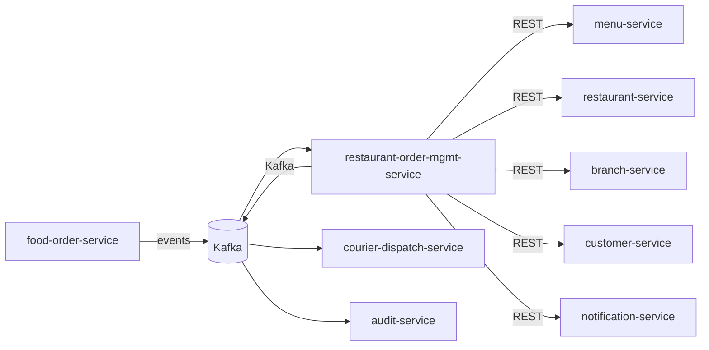

# restaurant-order-mgmt-service — Software Requirements Specification

## 1. Introduction

This SRS specifies the software behavior of
`restaurant-order-mgmt-service`. It covers functional
requirements, non-functional requirements, data requirements,
API contract summaries, validation, state transitions,
authorization, idempotency, performance, availability,
security, and disaster recovery. The service is the source of
truth for the `RestaurantOrderQueue` aggregate.

## 2. Scope

In scope:

- Restaurant-side order queue.
- Accept / reject timer (auto-reject on expiry).
- Accept / reject / preparing / ready transitions.
- Ready signal to `courier-dispatch-service`.

Out of scope:

- Food order aggregate (owned by `food-order-service`).
- Menu (owned by `menu-service`; read-only).
- Delivery (owned by `delivery-service`).
- Kitchen UI (owned by the operator console web app).

## 3. System Context

## 4. Actors

- **Restaurant Manager (human)** — Keycloak subject with role
  `manager` (or `dispatcher`).
- **Kitchen Staff (human)** — Keycloak subject with role
  `kitchen`.
- **Platform Admin (human)** — full access.
- **`food-order-service` (system)** — emits
  `food.order.placed.v1`; consumes accept/reject/preparing/ready.
- **`courier-dispatch-service` (system)** — consumes
  `food.order.ready.v1`.
- **`notification-service` (system)** — operator alerts.
- **`audit-service` (system)** — audit events.

## 5. Functional Requirements

| ID | Requirement | Priority |
|----|-------------|----------|
| FR--001 | The service MUST consume `food.order.placed.v1` and add the order to the queue. | MUST |
| FR--002 | The service MUST start an accept timer of `restaurant_order_mgmt.accept_timer.minutes` (default 5). | MUST |
| FR--003 | The service MUST auto-reject on timer expiry with `reason_code = "auto_reject"`. | MUST |
| FR--004 | The service MUST support `POST /v1/queue/{order_id}/accept` (manager / dispatcher). | MUST |
| FR--005 | The service MUST support `POST /v1/queue/{order_id}/reject` with `reason_code` (manager / dispatcher). | MUST |
| FR--006 | The service MUST support `POST /v1/queue/{order_id}/preparing` (kitchen). | MUST |
| FR--007 | The service MUST support `POST /v1/queue/{order_id}/ready` (kitchen). | MUST |
| FR--008 | The service MUST support `GET /v1/queue` with filters (`state`, `branch_id`). | MUST |
| FR--009 | The service MUST consume `food.order.cancelled.v1` and remove the order from the queue. | MUST |
| FR--010 | The service MUST publish a `food.order.*.v1` event for every state change. | MUST |
| FR--011 | The service MUST reject operator actions on a queue item in a terminal state with 409 `STATE_INVALID`. | MUST |
| FR--012 | The service MUST hard-delete queue items 7 days after the order is terminal. | MUST |
| FR--013 | The service MUST emit `admin.audit.queue.*` events for every admin action. | MUST |

## 6. Non-Functional Requirements

| ID | Category | Requirement | Target |
|----|----------|-------------|--------|
| NFR--001 | performance | P99 `GET /v1/queue` | < 200 ms (cache hit < 30 ms) |
| NFR--002 | performance | P99 `POST /v1/queue/{id}/accept` | < 200 ms |
| NFR--003 | performance | P99 queue add (on `food.order.placed.v1`) | < 1 s |
| NFR--004 | availability | service uptime | 99.95% over 30 days |
| NFR--005 | scalability | concurrent actions | ≥ 1,000 RPS |
| NFR--006 | scalability | `get queue` lookups | ≥ 5,000 RPS via Redis |
| NFR--007 | maintainability | MTTR for P1 | < 30 min |
| NFR--008 | data-integrity | zero event loss | outbox + 24 h ack |
| NFR--009 | latency | auto-reject (P95) | < 1 s of expiry |
| NFR--010 | observability | every state change queryable in audit | 100% |

## 7. API Requirements

REST API under `/v1/queue[...]` per
[`API_STANDARDS.md`](../../architecture/API_STANDARDS.md). All
write endpoints require `Idempotency-Key`. OpenAPI 3.1 spec at
`/openapi.json`.

(Full contracts in `INTEGRATION.md`.)

## 8. Data Requirements

| ID | Requirement | Notes |
|----|-------------|-------|
| DATA--001 | Queue items are uniquely identified by `order_id` (the food order id). | PK |
| DATA--002 | `state` is a CHECK-constrained enum. | lifecycle |
| DATA--003 | `order_id`, `restaurant_id`, `branch_id` are UUID columns with no DB FK. | cross-service ref |
| DATA--004 | `accepted_at`, `rejected_at`, `preparing_at`, `ready_at` are TIMESTAMPTZ. | timestamps |
| DATA--005 | `accept_timer_expires_at` is a TIMESTAMPTZ. | timer |
| DATA--006 | `reason_code`, `reason_text` are recorded on reject. | audit |

(Full schema in `ERD.md`.)

## 9. Validation Rules

- `order_id` — UUID, must reference an existing food order.
- `reason_code` on reject — drawn from
  `restaurant_order_mgmt.rejection.reason_codes`.
- `accept`, `reject` only valid in `placed` state.
- `preparing` only valid in `accepted` state.
- `ready` only valid in `preparing` state.

## 10. State Transitions

| From | To | Trigger |
|------|----|---------|
| (none) | `placed` | `food.order.placed.v1` |
| `placed` | `accepted` | `POST /accept` |
| `placed` | `rejected` | `POST /reject` or auto-reject |
| `accepted` | `preparing` | `POST /preparing` |
| `preparing` | `ready` | `POST /ready` |
| `placed` | `cancelled` | `food.order.cancelled.v1` (customer cancel) |
| `accepted` | `cancelled` | `food.order.cancelled.v1` (customer cancel) |
| `preparing` | `cancelled` | `food.order.cancelled.v1` (customer cancel) |
| `ready` | `cancelled` | `food.order.cancelled.v1` (customer cancel) |
| `cancelled` | — | terminal |
| `rejected` | — | terminal |
| `ready` | — | terminal (order moves to delivery) |

State transitions are described in detail in `WORKFLOWS.md`.

## 11. Authorization Requirements

- `manager` (or `dispatcher`) may accept, reject.
- `kitchen` may mark preparing, ready.
- `platform_admin` has full access.
- All actions are scoped to the staff's assigned restaurant
  or branch (verified via `restaurant-staff-service` RBAC).

## 12. Configuration Requirements

- `restaurant_order_mgmt.accept_timer.minutes` — int (default
  5).
- `restaurant_order_mgmt.queue.max_visible` — int (default 50).
- `restaurant_order_mgmt.rejection.reason_codes` —
  array<string>.
- `restaurant_order_mgmt.rate_limit.actions_per_minute` —
  int.

## 13. Error Handling

| Error | Response |
|-------|----------|
| Body validation failure | 400 `VALIDATION_FAILED` with `details[]` |
| Missing/invalid JWT | 401 `UNAUTHENTICATED` |
| Insufficient role | 403 `FORBIDDEN` |
| Queue item not found | 404 `QUEUE_ITEM_NOT_FOUND` |
| Illegal state transition | 409 `STATE_INVALID` |
| Accept timer expired | 409 `ACCEPT_TIMER_EXPIRED` |
| Idempotency key reused | 422 `IDEMPOTENCY_KEY_REUSED` |
| Rate limited | 429 `RATE_LIMITED` |
| Downstream timeout | 503 `DEPENDENCY_TIMEOUT` |
| Circuit open | 503 `CIRCUIT_OPEN` |
| Other | 500 `INTERNAL_ERROR` |

## 14. Concurrency Requirements

- Two concurrent accepts on the same order MUST be
  serialized via row-level lock; the second one receives 409
  `STATE_INVALID` if the first changed the state.
- The auto-reject timer and a manual accept / reject may
  race; the row-level lock ensures only one wins.

## 15. Idempotency Requirements

- All write endpoints require `Idempotency-Key`.
- The `food.order.placed.v1` consumer is idempotent via inbox
  dedup.
- All state transitions use the outbox pattern with `event_id`
  dedup.

## 16. Performance

- Dominant path: `GET /v1/queue`. P50 < 5 ms (cache hit), P99 <
  30 ms.
- Queue add: P50 < 100 ms, P99 < 1 s.
- Operator action: P50 < 50 ms, P99 < 200 ms.

## 17. Scalability

- Horizontal: HPA on CPU > 60% and
  `http_requests_in_flight > 500/replica`; max 12.
- Vertical: up to 4 CPU / 8 GiB.
- DB: 1 primary + 1 read replica in each region.
- Cache: Redis cluster, key `queue:by_branch:{branch_id}` TTL
  5 s.

## 18. Availability

- SLO: 99.95% over 30 days.
- Error budget: ~22 min / 30 days.
- Maintenance: Sunday 04:00–06:00 UTC.

## 19. Security

| ID | Requirement | Notes |
|----|-------------|-------|
| SEC--001 | All endpoints require a valid JWT; service-to-service uses `client_credentials`. | gateway enforced |
| SEC--002 | Admin actions require `X-Audit-Reason` and HMAC-SHA256 signature. | `API_STANDARDS.md` §14 |
| SEC--003 | RBAC at gateway; resource-level checks at the service. | `manager`, `kitchen`, `dispatcher` |
| SEC--004 | All cross-service calls use mTLS + `client_credentials` JWT. | defense in depth |
| SEC--005 | Secrets only in Vault. | pre-commit enforced |
| SEC--006 | Rate limiting at gateway and service. | `API_STANDARDS.md` §12 |
| SEC--007 | No PII beyond the customer's id. | minimal |
| SEC--008 | Admin actions emit `admin.audit.queue.*` events. | `audit-service` |
| SEC--009 | The service stores no card data; PCI scope is none. | SAQ-A |

## 20. Privacy

- PII stored: the customer's id (for the operator view).
- Retention: 7 days after terminal state.
- Erasure: not directly supported (queue is short-lived).

## 21. Auditability

- Every state transition emits a `food.order.*.v1` event.
- Every admin action emits an `admin.audit.queue.*` event.
- Audit retention: 7 years.

## 22. Observability

- Logs: JSON to stdout with `correlation_id`, `trace_id`,
  `order_id`, `restaurant_id`, `branch_id`, `state`,
  `from_state`, `to_state`, `actor`, `reason_code`.
- Metrics:
  - RED: standard.
  - Business: `queue_items_added_total{restaurant_id}`,
    `queue_items_accepted_total{restaurant_id}`,
    `queue_items_rejected_total{reason}`,
    `queue_items_preparing_total`,
    `queue_items_ready_total`,
    `accept_timer_expired_total{restaurant_id}`,
    `order_acceptance_seconds`,
    `order_prep_seconds`.
- Traces: OpenTelemetry.
- Alerts: SLO burn rate, outbox lag, acceptance rate.

## 23. Maintainability

- TypeScript strict, ESLint, Prettier.
- Coverage: ≥ 85% lines.
- Documentation: this folder.

## 24. Disaster Recovery

- RPO: 5 min (PITR 30 days for Tier-1).
- RTO: 30 min.
- Quarterly restore drill.

## 25. Acceptance Criteria

- AC-1: A placed order appears in the queue within 1 s.
- AC-2: The accept timer starts on add.
- AC-3: Auto-reject on timer expiry within 1 s.
- AC-4: The operator can accept an order.
- AC-5: The operator can reject an order with a reason.
- AC-6: The operator can mark preparing / ready.
- AC-7: The ready signal triggers courier dispatch.
- AC-8: All state changes are emitted as events.
- AC-9: The service meets its 99.95% SLO.
- AC-10: Cancelled orders are removed from the queue.

---

## See also

### Sibling docs for this service

- [`README.md`](./README.md) — purpose, bounded context, responsibilities
- [`BRD.md`](./BRD.md) — business requirements
- [`SRS.md`](./SRS.md) — functional + non-functional requirements
- [`ERD.md`](./ERD.md) — data model (entities, relationships)
- [`INTEGRATION.md`](./INTEGRATION.md) — inter-service contracts (APIs, events, sagas)
- [`WORKFLOWS.md`](./WORKFLOWS.md) — operational workflows (happy paths, failure modes)
- [`TECH.md`](./TECH.md) — technology profile (runtime, libraries, data layer, admin endpoints, RBAC)

### Platform-wide

- [`../../shared/README.md`](../../shared/README.md) — `platform-spring-boot-starter` shared library (the single source of cross-cutting code for all Spring Boot services in the platform)
- [`../RECOMMENDATIONS.md`](../RECOMMENDATIONS.md) — platform-wide technology map (language, framework, version baseline, admin/RBAC pattern)
- [`../../README.md`](../../README.md) — services overview (the catalog of all 58 services)
- [`../../../main.md`](../../../main.md) — top-level platform specification (architecture, Keycloak, PostgreSQL 18, messaging, observability baseline)

