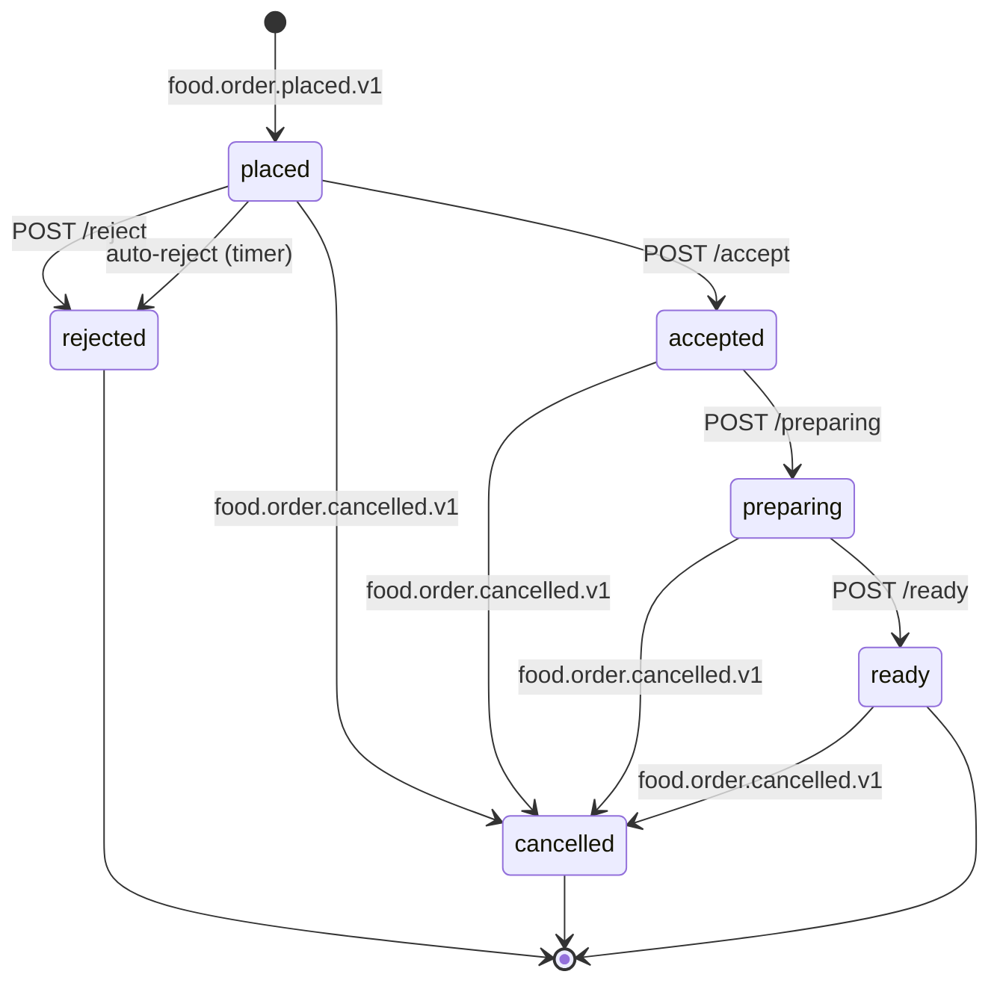

# restaurant-order-mgmt-service — Workflows

## 1. Order Arrival and Accept Timer

### 1.1 Objective

When `food.order.placed.v1` is received, the order is added to
the queue and the accept timer starts (default 5 minutes). The
operator is alerted.

### 1.2 Initiating Actor

`food-order-service` (system) via `food.order.placed.v1`.

### 1.3 Participating Services

- `restaurant-order-mgmt-service` (this service).
- `notification-service` (operator alert).
- `audit-service`.

### 1.4 Prerequisites

- `food.order.placed.v1` is received.
- Inbox dedup passes.

### 1.5 Happy Path

```mermaid
sequenceDiagram
    participant FOR as food-order-service
    participant K as Kafka
    participant ROM as restaurant-order-mgmt-service
    participant NOT as notification-service
    participant AUD as audit-service

    K->>ROM: food.order.placed.v1
    ROM->>ROM: inbox dedup
    ROM->>ROM: insert queue (state=placed, accept_timer_expires_at=now()+5m)
    ROM->>ROM: insert queue_state_history (null -> placed)
    ROM->>NOT: alert operator (sound, push)
    NOT-->>ROM: ok
    ROM->>K: (no event on add; the operator actions emit events)
```

### 1.6 Alternate Paths

- **Duplicate `food.order.placed.v1`**: inbox dedup; the
  `order_id` PK constraint catches duplicates that bypass the
  inbox.

### 1.7 Failure Paths

- **Outbox failure**: outbox retried.

### 1.8 Business Rules

- The accept timer is `restaurant_order_mgmt.accept_timer.minutes`
  (default 5).
- The queue is per branch, not per restaurant.

### 1.9 State Transitions

The relevant transition is `(none) → placed`. (See state
diagram in §2.9.)

### 1.10 Events

| Event | Direction | When |
|-------|-----------|------|
| `food.order.placed.v1` | consumed | trigger |

### 1.11 APIs Involved

| API | Direction | When |
|-----|-----------|------|
| (no inbound API for this workflow) | | |
| `POST /v1/notifications` to notification-service | outbound | alert operator |

### 1.12 Compensation / Rollback

- **Order was added by mistake**: not possible (the food
  order is the source of truth; the queue is a denormalized
  view). The operator can reject the order instead.

### 1.13 Final State

The order is in the queue; the accept timer is running; the
operator is alerted.

## 2. Accept / Reject

### 2.1 Objective

The operator accepts or rejects the order. Accept transitions
the order to `accepted` (kitchen can start); reject transitions
to `rejected` (full refund).

### 2.2 Initiating Actor

`manager` or `dispatcher` (human).

### 2.3 Participating Services

- `restaurant-order-mgmt-service` (this service).
- `food-order-service` (downstream — state transition).
- `food-payment-integration-service` (downstream — refund on
  reject).
- `notification-service` (inform customer).
- `audit-service`.

### 2.4 Prerequisites

- The order is in `placed` state.
- The accept timer has not expired.

### 2.5 Happy Path (Accept)

```mermaid
sequenceDiagram
    participant OP as Operator
    participant ROM as restaurant-order-mgmt-service
    participant K as Kafka
    participant FOR as food-order-service
    participant NOT as notification-service
    participant AUD as audit-service

    OP->>ROM: POST /v1/queue/{order_id}/accept (Idempotency-Key)
    ROM->>ROM: row-level lock; state=placed; accept_timer_expires_at > now()
    ROM->>ROM: state=accepted; accepted_at; accepted_by_kc_sub
    ROM->>ROM: insert queue_state_history
    ROM->>K: food.order.accepted.v1
    K->>FOR: state -> accepted
    K->>NOT: notify customer
    K->>AUD: audit
    ROM-->>OP: 200 OK
```

### 2.6 Alternate Paths

- **Reject**: `POST /reject` with `reason_code`; emits
  `food.order.rejected.v1`; the food order transitions to
  `rejected`; the `food-payment-integration-service` refunds.
- **Auto-reject (timer)**: see §3.
- **Timer expired**: 409 `ACCEPT_TIMER_EXPIRED`.
- **Already accepted / rejected**: 409 `STATE_INVALID`.

### 2.7 Failure Paths

- **Outbox failure**: outbox retried.

### 2.8 Business Rules

- Accept is only valid in `placed` state.
- Reject requires a `reason_code` from the platform enum.

### 2.9 State Transitions



### 2.10 Events

| Event | Direction | When |
|-------|-----------|------|
| `food.order.accepted.v1` | produced | on accept |
| `food.order.rejected.v1` | produced | on reject |

### 2.11 APIs Involved

| API | Direction | When |
|-----|-----------|------|
| `POST /v1/queue/{order_id}/accept` | inbound | accept |
| `POST /v1/queue/{order_id}/reject` | inbound | reject |

### 2.12 Compensation / Rollback

- **Accidental reject**: the order is terminal in `rejected`;
  the customer must re-place. There is no undo.

### 2.13 Final State

The order is `accepted` (ready for the kitchen) or
`rejected` (refund initiated).

## 3. Auto-Reject (Accept Timer Expiry)

### 3.1 Objective

When the accept timer expires without operator action, the
order is auto-rejected with `reason_code = "auto_reject"`. A
full refund is initiated.

### 3.2 Initiating Actor

Cron job (system).

### 3.3 Participating Services

- `restaurant-order-mgmt-service` (this service).
- `food-order-service` (downstream — state transition).
- `food-payment-integration-service` (downstream — refund).
- `notification-service` (inform customer).
- `audit-service`.

### 3.4 Prerequisites

- The queue item is in `placed` state.
- `accept_timer_expires_at < now()`.

### 3.5 Happy Path

```mermaid
sequenceDiagram
    participant CRON as Cron Job
    participant ROM as restaurant-order-mgmt-service
    participant K as Kafka
    participant FOR as food-order-service
    participant FPI as food-payment-integration-service
    participant NOT as notification-service
    participant AUD as audit-service

    CRON->>ROM: query queue with state=placed AND accept_timer_expires_at < now()
    loop each due item
        ROM->>ROM: row-level lock
        ROM->>ROM: state=rejected; reason_code=auto_reject
        ROM->>ROM: insert queue_state_history
        ROM->>K: food.order.rejected.v1 (cause=auto_reject)
        K->>FOR: state -> rejected
        K->>FPI: trigger refund
        K->>NOT: notify customer
        K->>AUD: audit
    end
```

### 3.6 Alternate Paths

- **Operator accepted in the meantime**: skip (state is no
  longer `placed`).
- **Operator rejected in the meantime**: skip.

### 3.7 Failure Paths

- **Outbox failure**: outbox retried.

### 3.8 Business Rules

- The cron job runs every minute and uses
  `SELECT ... FOR UPDATE SKIP LOCKED` to allow multiple
  replicas.
- The auto-reject reason is `auto_reject`.

### 3.9 State Transitions

The relevant transition is `placed → rejected` (with
`cause = auto_reject`).

### 3.10 Events

| Event | Direction | When |
|-------|-----------|------|
| `food.order.rejected.v1` | produced | on auto-reject |

### 3.11 APIs Involved

No direct API involvement; pure internal cron.

### 3.12 Compensation / Rollback

The order is terminal in `rejected`; the customer must
re-place.

### 3.13 Final State

The order is `rejected`; the refund is initiated; the
customer is informed.

## 4. Preparing / Ready

### 4.1 Objective

The kitchen marks the order `preparing` (started) and `ready`
(ready for pickup). The ready signal triggers courier dispatch.

### 4.2 Initiating Actor

`kitchen` (human).

### 4.3 Participating Services

- `restaurant-order-mgmt-service` (this service).
- `food-order-service` (downstream — state transition).
- `courier-dispatch-service` (downstream — dispatch on
  `ready`).
- `notification-service` (inform customer).
- `audit-service`.

### 4.4 Prerequisites

- The order is in `accepted` (for `preparing`) or `preparing`
  (for `ready`) state.

### 4.5 Happy Path

```mermaid
sequenceDiagram
    participant KT as Kitchen
    participant ROM as restaurant-order-mgmt-service
    participant K as Kafka
    participant FOR as food-order-service
    participant CDP as courier-dispatch-service
    participant NOT as notification-service
    participant AUD as audit-service

    KT->>ROM: POST /v1/queue/{order_id}/preparing (Idempotency-Key)
    ROM->>ROM: row-level lock; state=accepted
    ROM->>ROM: state=preparing; preparing_at; preparing_by_kc_sub
    ROM->>ROM: insert queue_state_history
    ROM->>K: food.order.preparing.v1
    K->>FOR: state -> preparing
    K->>NOT: notify customer
    K->>AUD: audit
    ROM-->>KT: 200 OK
    Note over KT: kitchen cooks
    KT->>ROM: POST /v1/queue/{order_id}/ready (Idempotency-Key)
    ROM->>ROM: row-level lock; state=preparing
    ROM->>ROM: state=ready; ready_at; ready_by_kc_sub
    ROM->>ROM: insert queue_state_history
    ROM->>K: food.order.ready.v1
    K->>FOR: state -> ready
    K->>CDP: dispatch courier
    K->>NOT: notify customer
    K->>AUD: audit
    ROM-->>KT: 200 OK
```

### 4.6 Alternate Paths

- **Wrong state**: 409 `STATE_INVALID`.
- **Operator accidentally marks ready**: rare; the order
  transitions to `ready`; the courier is dispatched. The
  operator cannot undo.

### 4.7 Failure Paths

- **Outbox failure**: outbox retried.

### 4.8 Business Rules

- `preparing` is only valid in `accepted` state.
- `ready` is only valid in `preparing` state.
- The ready signal triggers `food.order.ready.v1`; consumed
  by `courier-dispatch-service`.

### 4.9 State Transitions

The relevant transitions are
`accepted → preparing` and `preparing → ready`.

### 4.10 Events

| Event | Direction | When |
|-------|-----------|------|
| `food.order.preparing.v1` | produced | on preparing |
| `food.order.ready.v1` | produced | on ready |

### 4.11 APIs Involved

| API | Direction | When |
|-----|-----------|------|
| `POST /v1/queue/{order_id}/preparing` | inbound | mark preparing |
| `POST /v1/queue/{order_id}/ready` | inbound | mark ready |

### 4.12 Compensation / Rollback

- **Accidental ready**: the order is `ready`; the courier is
  dispatched. There is no undo. The order can be cancelled
  by the customer per the policy; if the courier has not yet
  picked up, the cancellation is allowed.

### 4.13 Final State

The order is `ready`; the courier is dispatched; the
customer is informed.

## 5. Customer Cancellation (Remove from Queue)

### 5.1 Objective

When the customer cancels the order (via `food-order-service`),
the queue item is removed (set to `cancelled`). No further
events are emitted by this service.

### 5.2 Initiating Actor

`food-order-service` (system) via `food.order.cancelled.v1`.

### 5.3 Participating Services

- `restaurant-order-mgmt-service` (this service).
- (no downstream — the food order is already cancelled)

### 5.4 Prerequisites

- `food.order.cancelled.v1` is received.
- Inbox dedup passes.

### 5.5 Happy Path

```mermaid
sequenceDiagram
    participant FOR as food-order-service
    participant K as Kafka
    participant ROM as restaurant-order-mgmt-service

    K->>ROM: food.order.cancelled.v1
    ROM->>ROM: inbox dedup
    ROM->>ROM: row-level lock
    ROM->>ROM: state=cancelled; cancelled_at
    ROM->>ROM: insert queue_state_history
```

### 5.6 Alternate Paths

- **Already cancelled**: skip (idempotent).

### 5.7 Failure Paths

- **Outbox failure**: not applicable (no event emitted).

### 5.8 Business Rules

- The queue item is marked `cancelled`; no further events
  are emitted by this service (the food order is already
  cancelled).

### 5.9 State Transitions

The relevant transition is `placed|accepted|preparing|ready →
cancelled`.

### 5.10 Events

| Event | Direction | When |
|-------|-----------|------|
| `food.order.cancelled.v1` | consumed | on cancel |

### 5.11 APIs Involved

No direct API involvement.

### 5.12 Compensation / Rollback

- The order is terminal in `cancelled`; the customer must
  re-place.

### 5.13 Final State

The queue item is `cancelled`; the food order is already
cancelled; no further action.

---

## See also

### Sibling docs for this service

- [`README.md`](./README.md) — purpose, bounded context, responsibilities
- [`BRD.md`](./BRD.md) — business requirements
- [`SRS.md`](./SRS.md) — functional + non-functional requirements
- [`ERD.md`](./ERD.md) — data model (entities, relationships)
- [`INTEGRATION.md`](./INTEGRATION.md) — inter-service contracts (APIs, events, sagas)
- [`WORKFLOWS.md`](./WORKFLOWS.md) — operational workflows (happy paths, failure modes)
- [`TECH.md`](./TECH.md) — technology profile (runtime, libraries, data layer, admin endpoints, RBAC)

### Platform-wide

- [`../../shared/README.md`](../../shared/README.md) — `platform-spring-boot-starter` shared library (the single source of cross-cutting code for all Spring Boot services in the platform)
- [`../RECOMMENDATIONS.md`](../RECOMMENDATIONS.md) — platform-wide technology map (language, framework, version baseline, admin/RBAC pattern)
- [`../../README.md`](../../README.md) — services overview (the catalog of all 58 services)
- [`../../../main.md`](../../../main.md) — top-level platform specification (architecture, Keycloak, PostgreSQL 18, messaging, observability baseline)

