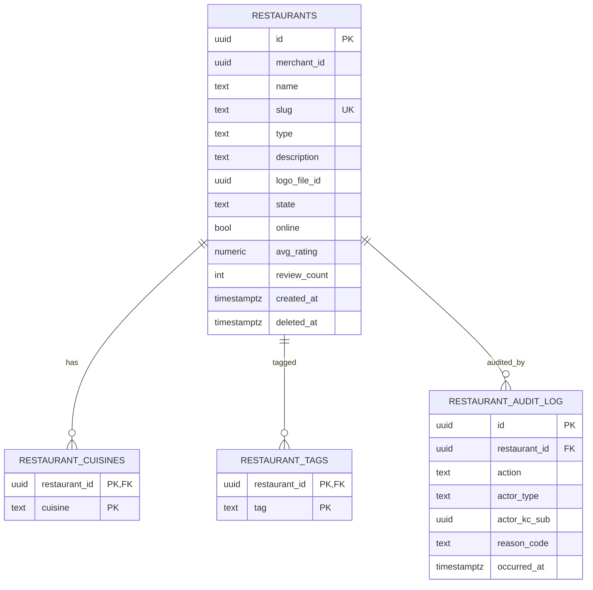

# restaurant-service — Entity-Relationship Diagram

## 1. Database

- Engine: **PostgreSQL 19**.
- Schema: `restaurant` (owned exclusively by this service).
- Migrations: `services/restaurant-service/prisma/migrations/`.

## 2. Cross-Service References

| Column | Type | Refers to | Source of truth |
|--------|------|-----------|------------------|
| `restaurants.merchant_id` | UUID | Merchant | ``restaurant-service` (merchant)` |
| `restaurants.suspension_actor_kc_sub` | UUID | Keycloak user | `identity-service` |
| `restaurants.logo_file_id` | UUID | file metadata | `file-service` |
| `restaurant_audit_log.admin_action_id` | UUID | admin action | `admin-service` |

All cross-service references are stored as columns **without**
database-level foreign keys. Referential integrity is enforced at
the application layer (validating via API and consuming events for
updates).

## 3. Entities

### `restaurants`

The restaurant brand. One restaurant belongs to exactly one
merchant; one merchant may have many restaurants.

#### Columns

| Column | Type | Constraints | Notes |
|--------|------|-------------|-------|
| `id` | UUID | PK | UUIDv7 |
| `merchant_id` | UUID | NOT NULL | cross-service ref to merchant |
| `name` | TEXT | NOT NULL | public name |
| `slug` | TEXT | NOT NULL UNIQUE | URL-safe handle |
| `type` | TEXT | NOT NULL CHECK in (...) | e.g. `restaurant`, `cafe` |
| `description` | TEXT | NULL | up to 1000 chars |
| `logo_file_id` | UUID | NULL | cross-service ref to `file-service` |
| `state` | TEXT | NOT NULL DEFAULT 'draft' CHECK in (...) | lifecycle |
| `online` | BOOLEAN | NOT NULL DEFAULT false | cached online flag |
| `auto_offline_enabled` | BOOLEAN | NOT NULL DEFAULT true | configurable |
| `avg_rating` | NUMERIC(3,2) | NOT NULL DEFAULT 0 CHECK (avg_rating >= 0 AND avg_rating <= 5) | denormalized |
| `review_count` | INTEGER | NOT NULL DEFAULT 0 CHECK (review_count >= 0) | denormalized |
| `last_rating_update_at` | TIMESTAMPTZ | NULL | when denormalized rating was set |
| `state_reason_code` | TEXT | NULL | reason for last transition |
| `state_actor_kc_sub` | UUID | NULL | who made the last transition |
| `state_changed_at` | TIMESTAMPTZ | NULL | when the last transition happened |
| `created_at` | TIMESTAMPTZ | NOT NULL DEFAULT now() | audit |
| `updated_at` | TIMESTAMPTZ | NOT NULL DEFAULT now() | audit |
| `created_by` | UUID | NOT NULL | identity |
| `updated_by` | UUID | NOT NULL | identity |
| `deleted_at` | TIMESTAMPTZ | NULL | soft delete |

#### Indexes

- PK on `id`.
- UNIQUE on `slug`.
- Index on `(merchant_id) WHERE deleted_at IS NULL` — list for a
  merchant.
- Index on `(state)` — admin queue.
- Partial index on `(state) WHERE state IN ('pending_review',
  'approved', 'online') AND deleted_at IS NULL` — hot dashboard
  queries.

#### Constraints

- CHECK: `state IN ('draft','pending_review','approved',
  'rejected','online','offline','suspended','closed')`.
- CHECK: `type IN ('restaurant','cafe','bakery','cloud_kitchen',
  'food_truck','other')`.
- CHECK: `length(name) BETWEEN 1 AND 120`.
- CHECK: `slug ~ '^[a-z0-9](?:[a-z0-9-]{1,38}[a-z0-9])?$'`.

### `restaurant_cuisines`

Many-to-many between restaurants and cuisines.

#### Columns

| Column | Type | Constraints | Notes |
|--------|------|-------------|-------|
| `restaurant_id` | UUID | NOT NULL, FK to `restaurants.id` | |
| `cuisine` | TEXT | NOT NULL | from `restaurant.cuisine.list` |
| `created_at` | TIMESTAMPTZ | NOT NULL DEFAULT now() | |

#### Indexes

- PK on `(restaurant_id, cuisine)`.
- Index on `(cuisine)` — search by cuisine.

### `restaurant_tags`

Many-to-many for free-form tags (e.g. `family_friendly`,
`outdoor_seating`).

#### Columns

| Column | Type | Constraints | Notes |
|--------|------|-------------|-------|
| `restaurant_id` | UUID | NOT NULL, FK to `restaurants.id` | |
| `tag` | TEXT | NOT NULL CHECK (length(tag) <= 50) | |
| `created_at` | TIMESTAMPTZ | NOT NULL DEFAULT now() | |

#### Indexes

- PK on `(restaurant_id, tag)`.
- Index on `(tag)`.

### `restaurant_audit_log`

Append-only audit log of admin actions and cascade events.

#### Columns

| Column | Type | Constraints | Notes |
|--------|------|-------------|-------|
| `id` | UUID | PK | UUIDv7 |
| `restaurant_id` | UUID | NOT NULL, FK to `restaurants.id` | |
| `action` | TEXT | NOT NULL CHECK in (...) | `approve`,`reject`,`suspend`,`reinstate`,`close`,`online`,`offline`,`merchant_suspend_cascade`,`merchant_reinstate_cascade`,`merchant_close_cascade` |
| `actor_kc_sub` | UUID | NULL | who did it; null for system |
| `actor_type` | TEXT | NOT NULL CHECK in (...) | `admin`,`owner`,`staff`,`system` |
| `reason_code` | TEXT | NULL | required for admin/cascade |
| `reason_text` | TEXT | NULL | optional |
| `from_state` | TEXT | NULL | previous state |
| `to_state` | TEXT | NULL | new state |
| `signature_id` | UUID | NULL | request signature |
| `correlation_id` | UUID | NOT NULL | trace |
| `occurred_at` | TIMESTAMPTZ | NOT NULL DEFAULT now() | |

#### Indexes

- PK on `id`.
- Index on `(restaurant_id, occurred_at DESC)`.
- Index on `(actor_kc_sub, occurred_at DESC)` where not null.

### `outbox`

Transactional outbox for events. See `EVENT_ARCHITECTURE.md`.

#### Columns

| Column | Type | Constraints | Notes |
|--------|------|-------------|-------|
| `id` | UUID | PK | UUIDv7 |
| `aggregate_type` | TEXT | NOT NULL | `Restaurant` |
| `aggregate_id` | UUID | NOT NULL | partition key |
| `event_name` | TEXT | NOT NULL | `restaurant.*.v1` |
| `event_id` | UUID | NOT NULL UNIQUE | dedup |
| `payload` | JSONB | NOT NULL | envelope |
| `headers` | JSONB | NOT NULL DEFAULT '{}' | Kafka headers |
| `created_at` | TIMESTAMPTZ | NOT NULL DEFAULT now() | |
| `claimed_at` | TIMESTAMPTZ | NULL | poller-set |
| `published_at` | TIMESTAMPTZ | NULL | poller-set |

#### Indexes

- PK on `id`.
- Index on `(published_at NULLS FIRST, created_at)` — poller.

### `inbox`

Consumer-side dedup. See `EVENT_ARCHITECTURE.md`.

#### Columns

| Column | Type | Constraints | Notes |
|--------|------|-------------|-------|
| `event_id` | UUID | PK | |
| `consumer` | TEXT | NOT NULL | |
| `received_at` | TIMESTAMPTZ | NOT NULL DEFAULT now() | |
| `processed_at` | TIMESTAMPTZ | NULL | |
| `error` | TEXT | NULL | |

## 4. Mermaid ER Diagram



## 5. DDL Sketch

```sql
CREATE SCHEMA IF NOT EXISTS restaurant;

CREATE TABLE restaurant.restaurants (
    id UUID PRIMARY KEY,
    merchant_id UUID NOT NULL,
    name TEXT NOT NULL CHECK (length(name) BETWEEN 1 AND 120),
    slug TEXT NOT NULL UNIQUE
        CHECK (slug ~ '^[a-z0-9](?:[a-z0-9-]{1,38}[a-z0-9])?$'),
    type TEXT NOT NULL CHECK (type IN
        ('restaurant','cafe','bakery','cloud_kitchen',
         'food_truck','other')),
    description TEXT,
    logo_file_id UUID,
    state TEXT NOT NULL DEFAULT 'draft' CHECK (state IN
        ('draft','pending_review','approved','rejected',
         'online','offline','suspended','closed')),
    online BOOLEAN NOT NULL DEFAULT false,
    auto_offline_enabled BOOLEAN NOT NULL DEFAULT true,
    avg_rating NUMERIC(3,2) NOT NULL DEFAULT 0
        CHECK (avg_rating >= 0 AND avg_rating <= 5),
    review_count INTEGER NOT NULL DEFAULT 0 CHECK (review_count >= 0),
    last_rating_update_at TIMESTAMPTZ,
    state_reason_code TEXT,
    state_actor_kc_sub UUID,
    state_changed_at TIMESTAMPTZ,
    created_at TIMESTAMPTZ NOT NULL DEFAULT now(),
    updated_at TIMESTAMPTZ NOT NULL DEFAULT now(),
    created_by UUID NOT NULL,
    updated_by UUID NOT NULL,
    deleted_at TIMESTAMPTZ
);

CREATE INDEX restaurants_merchant_idx
    ON restaurant.restaurants (merchant_id)
    WHERE deleted_at IS NULL;

CREATE INDEX restaurants_state_idx
    ON restaurant.restaurants (state);

CREATE INDEX restaurants_active_idx
    ON restaurant.restaurants (state)
    WHERE state IN ('pending_review','approved','online')
      AND deleted_at IS NULL;

CREATE TABLE restaurant.restaurant_cuisines (
    restaurant_id UUID NOT NULL REFERENCES restaurant.restaurants(id),
    cuisine TEXT NOT NULL,
    created_at TIMESTAMPTZ NOT NULL DEFAULT now(),
    PRIMARY KEY (restaurant_id, cuisine)
);

CREATE INDEX restaurant_cuisines_cuisine_idx
    ON restaurant.restaurant_cuisines (cuisine);

CREATE TABLE restaurant.restaurant_tags (
    restaurant_id UUID NOT NULL REFERENCES restaurant.restaurants(id),
    tag TEXT NOT NULL CHECK (length(tag) <= 50),
    created_at TIMESTAMPTZ NOT NULL DEFAULT now(),
    PRIMARY KEY (restaurant_id, tag)
);

CREATE INDEX restaurant_tags_tag_idx
    ON restaurant.restaurant_tags (tag);

CREATE TABLE restaurant.restaurant_audit_log (
    id UUID PRIMARY KEY,
    restaurant_id UUID NOT NULL REFERENCES restaurant.restaurants(id),
    action TEXT NOT NULL CHECK (action IN
        ('approve','reject','suspend','reinstate','close',
         'online','offline',
         'merchant_suspend_cascade',
         'merchant_reinstate_cascade',
         'merchant_close_cascade')),
    actor_kc_sub UUID,
    actor_type TEXT NOT NULL CHECK (actor_type IN
        ('admin','owner','staff','system')),
    reason_code TEXT,
    reason_text TEXT,
    from_state TEXT,
    to_state TEXT,
    signature_id UUID,
    correlation_id UUID NOT NULL,
    occurred_at TIMESTAMPTZ NOT NULL DEFAULT now()
);

CREATE INDEX restaurant_audit_log_restaurant_idx
    ON restaurant.restaurant_audit_log (restaurant_id, occurred_at DESC);

CREATE INDEX restaurant_audit_log_actor_idx
    ON restaurant.restaurant_audit_log (actor_kc_sub, occurred_at DESC)
    WHERE actor_kc_sub IS NOT NULL;

CREATE TABLE restaurant.outbox (
    id UUID PRIMARY KEY,
    aggregate_type TEXT NOT NULL,
    aggregate_id UUID NOT NULL,
    event_name TEXT NOT NULL,
    event_id UUID NOT NULL UNIQUE,
    payload JSONB NOT NULL,
    headers JSONB NOT NULL DEFAULT '{}'::jsonb,
    created_at TIMESTAMPTZ NOT NULL DEFAULT now(),
    claimed_at TIMESTAMPTZ,
    published_at TIMESTAMPTZ
);

CREATE INDEX outbox_pending_idx
    ON restaurant.outbox (published_at NULLS FIRST, created_at);

CREATE TABLE restaurant.inbox (
    event_id UUID PRIMARY KEY,
    consumer TEXT NOT NULL,
    received_at TIMESTAMPTZ NOT NULL DEFAULT now(),
    processed_at TIMESTAMPTZ,
    error TEXT
);
```

## 6. Audit Columns

`restaurants` has `created_at`, `updated_at`, `created_by`,
`updated_by`, `deleted_at`. `restaurant_cuisines` and
`restaurant_tags` have `created_at`. `restaurant_audit_log` is
append-only.

## 7. Soft Delete

Yes on `restaurants`. Reads include `WHERE deleted_at IS NULL`.

## 8. JSONB Usage

`outbox.payload` and `outbox.headers` for the event envelope per
`EVENT_ARCHITECTURE.md`. No other JSONB in this service.

## 9. Partitioning

No partitioning. Restaurant volume is in the thousands per
country, not millions per day.

## 10. Data Retention

| Table | Retention | Purged by |
|-------|-----------|-----------|
| `restaurants` | 7 years (financial) | soft delete on `close`; hard delete after 7 years |
| `restaurant_cuisines` | with restaurant | hard delete with restaurant |
| `restaurant_tags` | with restaurant | hard delete with restaurant |
| `restaurant_audit_log` | 7 years | hard delete with restaurant |
| `outbox` | 24 h after `published_at` | scheduled job |
| `inbox` | 30 days | scheduled job |

## 11. Migration Considerations

- Adding a new `type` value: forward-only migration; drop CHECK,
  add new CHECK.
- Adding a new `state` value: forward-only migration; update the
  state machine; ensure consumers handle the new state.
- The `slug` UNIQUE constraint is global; the operator UI must
  handle 409 on collision.
- The `online` flag is cached; on `branch.hours.changed.v1` the
  flag is recomputed. The recompute is a database write, not an
  event; the resulting `restaurant.online.v1` or
  `restaurant.offline.v1` is emitted from the outbox.

---

## Appendix A — Predecessor tables absorbed (restaurant-staff)

The tables below were migrated from `restaurant_staff.*` as part of
[ADR-0016](../../architecture/adrs/0016-service-domain-consolidation.md).
The canonical source is [`../../MIGRATION_HUB.md`](../../MIGRATION_HUB.md) 3.10.
The old schema name remains readable as a view in the `restaurant`
schema for at least six months from 2026-08-05.

### A.1 Tables absorbed

| Old schema.table | New schema.table | Notes |
|------------------|------------------|-------|
| `restaurant_staff.staff` | `restaurant.staff` | linked to Keycloak `kc_sub` via UUID (no FK) |
| `restaurant_staff.invitations` | `restaurant.staff_invitations` | invitation token + TTL |
| `restaurant_staff.roles` | `restaurant.staff_roles` | per restaurant / per branch |
| `restaurant_staff.devices` | `restaurant.staff_devices` | allow-list per staff |

### A.2 DDL sketch (migrated entities)

```sql
CREATE TABLE restaurant.staff (
    id UUID PRIMARY KEY,
    kc_sub UUID NOT NULL, -- cross-service ref to identity-service
    restaurant_id UUID NOT NULL REFERENCES restaurant.restaurants(id),
    branch_id UUID REFERENCES restaurant.branches(id),
    display_name TEXT,
    email TEXT NOT NULL,
    activated_at TIMESTAMPTZ,
    deactivated_at TIMESTAMPTZ
);

CREATE TABLE restaurant.staff_invitations (
    id UUID PRIMARY KEY,
    token_hash TEXT NOT NULL UNIQUE,
    restaurant_id UUID NOT NULL,
    email TEXT NOT NULL,
    invited_by UUID NOT NULL,
    invited_at TIMESTAMPTZ NOT NULL DEFAULT now(),
    expires_at TIMESTAMPTZ NOT NULL,
    consumed_at TIMESTAMPTZ
);

CREATE TABLE restaurant.staff_roles (
    staff_id UUID NOT NULL REFERENCES restaurant.staff(id),
    scope TEXT NOT NULL CHECK (scope IN ('restaurant','branch')),
    target_id UUID NOT NULL,
    role TEXT NOT NULL CHECK (role IN ('manager','cashier','kitchen','dispatcher')),
    granted_at TIMESTAMPTZ NOT NULL DEFAULT now(),
    PRIMARY KEY (staff_id, scope, target_id, role)
);

CREATE TABLE restaurant.staff_devices (
    id UUID PRIMARY KEY,
    staff_id UUID NOT NULL REFERENCES restaurant.staff(id),
    device_id TEXT NOT NULL,
    registered_at TIMESTAMPTZ NOT NULL DEFAULT now(),
    UNIQUE (staff_id, device_id)
);
```

### A.3 Compatibility views (≥ 6 months)

```sql
CREATE VIEW restaurant_staff.staff AS TABLE restaurant.staff;
CREATE VIEW restaurant_staff.invitations AS TABLE restaurant.staff_invitations;
CREATE VIEW restaurant_staff.roles AS TABLE restaurant.staff_roles;
CREATE VIEW restaurant_staff.devices AS TABLE restaurant.staff_devices;
```

---

## See also

### Sibling docs for this service

- [`README.md`](./README.md) — purpose, bounded context, responsibilities
- [`BRD.md`](./BRD.md) — business requirements
- [`SRS.md`](./SRS.md) — functional + non-functional requirements
- [`ERD.md`](./ERD.md) — data model (entities, relationships)
- [`INTEGRATION.md`](./INTEGRATION.md) — inter-service contracts (APIs, events, sagas)
- [`WORKFLOWS.md`](./WORKFLOWS.md) — operational workflows (happy paths, failure modes)
- [`TECH.md`](./TECH.md) — technology profile (runtime, libraries, data layer, admin endpoints, RBAC)

### Platform-wide

- [`../../shared/README.md`](../../shared/README.md) — `platform-spring-boot-starter` shared library (the single source of cross-cutting code for all Spring Boot services in the platform)
- [`../RECOMMENDATIONS.md`](../RECOMMENDATIONS.md) — platform-wide technology map (language, framework, version baseline, admin/RBAC pattern)
- [`../../README.md`](../../README.md) — services overview (the catalog of all 20 services)
- [`../../../main.md`](../../../main.md) — top-level platform specification (architecture, Keycloak, PostgreSQL 19, messaging, observability baseline)

## Related docs

- [`../../architecture/DATA_OWNERSHIP.md`](../../architecture/DATA_OWNERSHIP.md) — full source-of-truth matrix
- [`../../architecture/SERVICE_ISOLATION.md`](../../architecture/SERVICE_ISOLATION.md) — how this service handles a downstream outage
- [`../../architecture/DATABASE_ARCHITECTURE.md`](../../architecture/DATABASE_ARCHITECTURE.md) — PostgreSQL-per-service rules
- [`../../architecture/CONSISTENCY_STRATEGY.md`](../../architecture/CONSISTENCY_STRATEGY.md) — strong vs eventual consistency per context

