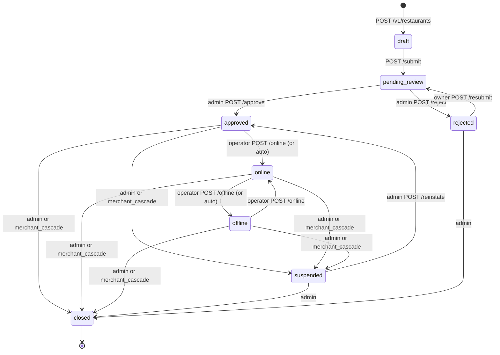
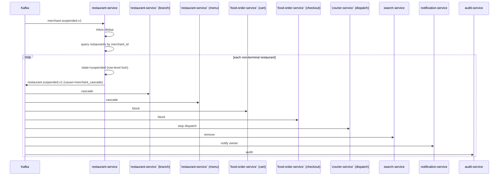

# restaurant-service — Workflows

## 1. Restaurant Onboarding (Create, Submit, Approve)

### 1.1 Objective

A merchant owner creates a restaurant under an approved merchant,
submits it for review, an admin approves, and the restaurant
becomes eligible to host branches and menus. The
`restaurant.approved.v1` event is consumed by ``restaurant-service` (branch)`
and ``restaurant-service` (menu)`, enabling them to accept new resources under
the restaurant.

### 1.2 Initiating Actor

`merchant_owner` (human) — the merchant's owner.

### 1.3 Participating Services

- `restaurant-service` (this service).
- ``restaurant-service` (merchant)` (parent; verify approved).
- `configuration-service` (cuisine / type list).
- `file-service` (logo).
- `notification-service` (lifecycle).
- ``restaurant-service` (branch)`, ``restaurant-service` (menu)`, `search-service` (downstream
  consumers).
- `audit-service`.

### 1.4 Prerequisites

- The merchant is `approved` (verified by ``restaurant-service` (merchant)`).
- The owner has uploaded a logo via `file-service` and has a
  `file_id`.
- The owner has at least one cuisine in mind and a valid `slug`.

### 1.5 Happy Path

```mermaid
sequenceDiagram
    participant OWN as Merchant Owner
    participant FS as file-service
    participant RES as restaurant-service
    participant MER as `restaurant-service` (merchant)
    participant CFG as configuration-service
    participant ADM as Platform Admin
    participant K as Kafka
    participant BRH as `restaurant-service` (branch)
    participant MN as `restaurant-service` (menu)
    participant SR as search-service
    participant AUD as audit-service
    participant NOT as notification-service

    OWN->>FS: upload logo
    FS-->>OWN: file_id, scan pending -> clean
    OWN->>RES: POST /v1/restaurants (merchant_id, name, type, cuisines, slug, logo_file_id, Idempotency-Key)
    RES->>MER: GET /v1/merchants/{merchant_id}
    MER-->>RES: approved
    RES->>CFG: GET cuisine/type list
    CFG-->>RES: lists
    RES->>RES: validate; state=draft
    RES-->>OWN: 201 pending draft
    RES->>K: restaurant.created.v1
    K->>BRH: note: parent exists
    K->>MN: note: parent exists
    K->>SR: note: parent exists
    OWN->>RES: POST /v1/restaurants/{id}/submit
    RES->>RES: state=pending_review
    RES->>K: restaurant.updated.v1
    ADM->>RES: POST /approve
    RES->>RES: state=approved
    RES->>K: restaurant.approved.v1
    K->>BRH: enable branch creation
    K->>MN: enable menu creation
    K->>SR: index
    K->>NOT: notify owner
    NOT-->>OWN: push: "Approved"
    K->>AUD: audit
    OWN->>BRH: POST /v1/branches (restaurant_id, ...)
    BRH->>RES: GET /v1/restaurants/{id}
    RES-->>BRH: approved
    BRH-->>OWN: 201 branch_id
    OWN->>MN: POST /v1/menus (restaurant_id, ...)
    MN->>RES: GET /v1/restaurants/{id}
    RES-->>MN: approved
    MN-->>OWN: 201 menu_id
```

### 1.6 Alternate Paths

- **Cuisine not in allowed list**: `POST /v1/restaurants` returns
  400 `VALIDATION_FAILED` with `details[]`.
- **Slug taken**: 409 `SLUG_TAKEN`.
- **Parent merchant not approved**: 409 `MERCHANT_NOT_APPROVED`.
- **Parent merchant suspended**: 409 `MERCHANT_SUSPENDED`.
- **Re-submission after rejection**: `POST /resubmit` transitions
  `rejected → pending_review`; the previous `reason_code` is
  preserved in the audit log.

### 1.7 Failure Paths

- **``restaurant-service` (merchant)` unreachable**: 503 `DEPENDENCY_TIMEOUT`;
  the request is rejected. The owner retries.
- **Outbox publish failure**: outbox row is retried by the poller;
  if persistent, the row goes to DLQ.
- **Consumer lag** (``restaurant-service` (branch)`, ``restaurant-service` (menu)`): they catch
  up when they recover; lag is monitored.

### 1.8 Business Rules

- A restaurant can be created only if its parent merchant is
  `approved`.
- A restaurant can be approved only if it has a logo, a name,
  ≥ 1 cuisine, a valid `type`, and a valid `slug`.
- The operator can create branches and menus only after approval.

### 1.9 State Transitions



### 1.10 Events

| Event | Direction | When |
|-------|-----------|------|
| `restaurant.created.v1` | produced | `POST /v1/restaurants` |
| `restaurant.updated.v1` | produced | `POST /submit` |
| `restaurant.approved.v1` | produced | admin approval |
| `restaurant.rejected.v1` | produced | admin rejection |
| `merchant.approved.v1` | consumed | parent enabled |
| `merchant.suspended.v1` | consumed | cascade suspension |
| `merchant.reinstated.v1` | consumed | cascade re-instatement |
| `merchant.closed.v1` | consumed | cascade closure |

### 1.11 APIs Involved

| API | Direction | When |
|-----|-----------|------|
| `POST /v1/restaurants` | inbound | create |
| `POST /v1/restaurants/{id}/submit` | inbound | submit |
| `POST /v1/restaurants/{id}/approve` | inbound | admin approval |
| `GET /v1/merchants/{id}` to `restaurant-service` (merchant) | outbound | parent check |

### 1.12 Compensation / Rollback

- **Admin accidentally approves**: admin can `POST /suspend` with
  `reason_code = "admin_error"`; the audit log captures the
  chain. There is no "undo approve" because downstream services
  have already received the event.

### 1.13 Final State

Restaurant is `approved`; branches and menus can be created
under it; the restaurant is searchable (but only listed as
online once a branch is open).

## 2. Online / Offline Toggle

### 2.1 Objective

Allow the operator to take the restaurant online (accepting
orders) or offline (blocking orders) in real time, and propagate
the change to all downstream services.

### 2.2 Initiating Actor

`restaurant_staff` (operator) or `merchant_owner`.

### 2.3 Participating Services

- `restaurant-service` (this service).
- ``food-order-service` (cart)` (consumes — blocks order placement).
- ``food-order-service` (checkout)` (consumes — blocks checkout).
- ``courier-service` (dispatch)` (consumes — disables dispatch for
  this restaurant).
- `search-service` (consumes — updates the index).
- `notification-service` (informs the customer if needed).
- `audit-service`.

### 2.4 Prerequisites

- The restaurant is in `approved` state.
- The operator has the right role.
- For auto-offline: a recent `branch.hours.changed.v1` indicates
  no branch is open.

### 2.5 Happy Path (Manual)

```mermaid
sequenceDiagram
    participant OP as Operator
    participant RES as restaurant-service
    participant K as Kafka
    participant CRT as `food-order-service` (cart)
    participant CHK as `food-order-service` (checkout)
    participant CDP as `courier-service` (dispatch)
    participant SR as search-service
    participant AUD as audit-service

    OP->>RES: POST /v1/restaurants/{id}/online
    RES->>RES: state=online; online=true
    RES->>K: restaurant.online.v1
    K->>CRT: re-enable checkouts
    K->>CHK: re-enable checkout
    K->>CDP: enable dispatch
    K->>SR: index
    K->>AUD: audit
    RES-->>OP: 200 OK
```

### 2.6 Alternate Paths

- **Already online**: 409 `STATE_INVALID`.
- **Not approved**: 409 `STATE_INVALID` (only `approved` can go
  online; `offline → online` is fine; `suspended → online` is
  not).
- **Auto-offline on no open branch**: when a
  `branch.hours.changed.v1` is consumed and no branch is open,
  the service auto-sets `online = false` and emits
  `restaurant.offline.v1` with `data.cause = "auto"`.

### 2.7 Failure Paths

- **Outbox publish failure**: outbox row retried; DLQ on
  persistent failure.
- **Consumer lag**: cart / checkout lag monitored; SLA ≤ 30 s.

### 2.8 Business Rules

- A restaurant can go `online` only if it is `approved` or
  `offline` (already approved, just toggling).
- A restaurant cannot go `online` if it is `suspended`; the
  operator must wait for re-instatement.
- The operator-set `offline` is preserved across merchant
  re-instatement (cascade handler does not auto-go-online).

### 2.9 State Transitions

See the state diagram in 1.9; the relevant transitions are
`approved|offline → online` and `online → offline`.

### 2.10 Events

| Event | Direction | When |
|-------|-----------|------|
| `restaurant.online.v1` | produced | manual or auto |
| `restaurant.offline.v1` | produced | manual or auto |
| `branch.hours.changed.v1` | consumed | recompute online |

### 2.11 APIs Involved

| API | Direction | When |
|-----|-----------|------|
| `POST /v1/restaurants/{id}/online` | inbound | manual |
| `POST /v1/restaurants/{id}/offline` | inbound | manual |

### 2.12 Compensation / Rollback

- The opposite toggle is the compensation. The state machine
  allows free toggling between `online` and `offline`.

### 2.13 Final State

Restaurant is `online` (accepting orders) or `offline` (blocking
orders); the change is propagated within 30 s.

## 3. Cascade Suspension (Parent Merchant Suspended)

### 3.1 Objective

When the parent merchant is suspended, all of its non-terminal
restaurants are suspended so that no orders are accepted and no
new branches or menus are created.

### 3.2 Initiating Actor

``restaurant-service` (merchant)` (system) via the `merchant.suspended.v1`
event.

### 3.3 Participating Services

- `restaurant-service` (this service).
- ``restaurant-service` (branch)` (downstream consumer — cascades further).
- ``restaurant-service` (menu)` (downstream consumer).
- ``food-order-service` (cart)` (downstream consumer — blocks orders).
- ``food-order-service` (checkout)` (downstream consumer).
- ``courier-service` (dispatch)` (downstream consumer).
- `search-service` (downstream consumer — removes from index).
- `notification-service` (informs owner).
- `audit-service`.

### 3.4 Prerequisites

- `merchant.suspended.v1` has been received.
- The ``restaurant-service` (merchant)` event has not been processed before
  (inbox dedup).

### 3.5 Happy Path



### 3.6 Alternate Paths

- **No non-terminal restaurants**: nothing to do; the event is
  ack'd.
- **Already suspended**: skip; the row-level lock check
  prevents re-suspension.

### 3.7 Failure Paths

- **Outbox publish failure**: outbox retried; DLQ.
- **Consumer lag**: ≤ 60 s SLA monitored.

### 3.8 Business Rules

- Cascade has priority over operator-set online state.
- The cause is recorded as `merchant_suspended` and
  `actor_type = "system"`.
- Re-instatement of the merchant restores restaurants to
  `approved` (NOT `online`); operator must re-enable.

### 3.9 State Transitions

The relevant transitions are
`approved|online|offline → suspended` (with
`cause = merchant_cascade`).

### 3.10 Events

| Event | Direction | When |
|-------|-----------|------|
| `merchant.suspended.v1` | consumed | trigger |
| `restaurant.suspended.v1` | produced | per restaurant |

### 3.11 APIs Involved

No direct API involvement; this is a pure event-driven
workflow.

### 3.12 Compensation / Rollback

`merchant.reinstated.v1` triggers cascade re-instatement.

### 3.13 Final State

All non-terminal restaurants of the merchant are `suspended`;
downstream services are notified within 60 s.

---

## See also

### Sibling docs for this service

- [`README.md`](./README.md) — purpose, bounded context, responsibilities
- [`BRD.md`](./BRD.md) — business requirements
- [`SRS.md`](./SRS.md) — functional + non-functional requirements
- [`ERD.md`](./ERD.md) — data model (entities, relationships)
- [`INTEGRATION.md`](./INTEGRATION.md) — inter-service contracts (APIs, events, sagas)
- [`WORKFLOWS.md`](./WORKFLOWS.md) — operational workflows (happy paths, failure modes)
- [`TECH.md`](./TECH.md) — technology profile (runtime, libraries, data layer, admin endpoints, RBAC)

### Platform-wide

- [`../../shared/README.md`](../../shared/README.md) — `platform-spring-boot-starter` shared library (the single source of cross-cutting code for all Spring Boot services in the platform)
- [`../RECOMMENDATIONS.md`](../RECOMMENDATIONS.md) — platform-wide technology map (language, framework, version baseline, admin/RBAC pattern)
- [`../../README.md`](../../README.md) — services overview (the catalog of all 20 services)
- [`../../../main.md`](../../../main.md) — top-level platform specification (architecture, Keycloak, PostgreSQL 18, messaging, observability baseline)

