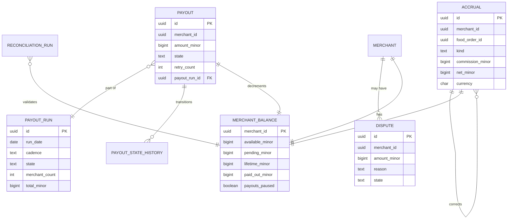

# restaurant-settlement-service — Entity-Relationship Diagram

## 1. Database

- Engine: PostgreSQL 18.
- Schema: `restaurant_settlement` (owned exclusively by this
  service).
- Migrations: `services/restaurant-settlement-service/migrations/`.

## 2. Cross-Service References

| Column | Type | Refers to | Source of truth |
|--------|------|-----------|------------------|
| `merchant_id` | UUID | `Merchant` in `merchant-service` | `merchant-service` |
| `restaurant_id` | UUID | `Restaurant` in `restaurant-service` | `restaurant-service` |
| `branch_id` | UUID | `Branch` in `branch-service` | `branch-service` |
| `city_id` | UUID | `City` in `zone-service` | `zone-service` |
| `food_order_id` | UUID | `FoodOrder` in `food-order-service` | `food-order-service` |
| `payout_id` | UUID | own entity | this service |
| `payment_method_token` | UUID | provider token in `payment-service` | `payment-service` |
| `correlation_id` | UUID | request scope | gateway |

All cross-service references are stored as UUID columns **without**
database-level foreign keys.

## 3. Entities

### `Accrual` (Append-Only Ledger)

One row per merchant payable movement. The accrual ledger is
append-only; corrections are new rows.

#### Columns

| Column | Type | Constraints | Notes |
|--------|------|-------------|-------|
| `id` | UUID | PK | UUIDv7 |
| `merchant_id` | UUID | NOT NULL | |
| `restaurant_id` | UUID | NULL | denormalised |
| `branch_id` | UUID | NULL | denormalised |
| `city_id` | UUID | NOT NULL | |
| `food_order_id` | UUID | NULL | for order-related rows |
| `kind` | TEXT | NOT NULL CHECK in (`order`,`refund_full`,`refund_partial`,`adjustment`,`dispute_debit`,`correction`) | |
| `gross_minor` | BIGINT | NULL | original order gross (for `order`) |
| `commission_minor` | BIGINT | NOT NULL | platform cut for this row |
| `net_minor` | BIGINT | NOT NULL | merchant share for this row |
| `currency` | CHAR(3) | NOT NULL | |
| `reference` | TEXT | NULL | human-readable (e.g. order id) |
| `correlation_id` | UUID | NOT NULL | |
| `created_at` | TIMESTAMPTZ | NOT NULL DEFAULT now() | append-only |
| `created_by` | UUID | NOT NULL | |
| `accrued_at` | TIMESTAMPTZ | NOT NULL | business time |

#### Indexes

- PK on `id`.
- Unique on `(food_order_id, kind)` for `food_order_id IS NOT NULL`.
- Index on `merchant_id, accrued_at DESC` for merchant statement.
- Index on `city_id, accrued_at` for city aggregates.

#### Constraints

- CHECK `kind IN (...)` as above.
- CHECK `commission_minor >= 0`.
- CHECK `net_minor IS NULL OR net_minor >= 0`.

### `Payout` (Partitioned by Month)

A payout run for a merchant.

#### Columns

| Column | Type | Constraints | Notes |
|--------|------|-------------|-------|
| `id` | UUID | PK | UUIDv7 |
| `merchant_id` | UUID | NOT NULL | |
| `city_id` | UUID | NOT NULL | |
| `amount_minor` | BIGINT | NOT NULL | positive |
| `currency` | CHAR(3) | NOT NULL | |
| `state` | TEXT | NOT NULL CHECK in (`scheduled`,`pending`,`completed`,`failed`,`cancelled`) | |
| `retry_count` | INT | NOT NULL DEFAULT 0 | |
| `max_retries` | INT | NOT NULL | snapshot |
| `next_retry_at` | TIMESTAMPTZ | NULL | |
| `last_error` | TEXT | NULL | |
| `payment_method_token` | UUID | NOT NULL | from `payment-service` |
| `payout_provider_id` | UUID | NULL | from `payment-service` |
| `scheduled_for` | DATE | NOT NULL | the scheduled payout date |
| `payout_run_id` | UUID | NOT NULL REFERENCES payout_run(id) | FK within schema |
| `correlation_id` | UUID | NOT NULL | |
| `created_at` | TIMESTAMPTZ | NOT NULL DEFAULT now() | |
| `updated_at` | TIMESTAMPTZ | NOT NULL DEFAULT now() | |
| `created_by` | UUID | NOT NULL | |
| `updated_by` | UUID | NOT NULL | |
| PRIMARY KEY (id, created_at) | | | for partitioning |

#### Indexes

- PK on `(id, created_at)`.
- Index on `merchant_id, created_at DESC`.
- Partial unique on `(merchant_id) WHERE state IN ('scheduled',
  'pending')`.
- Index on `state, next_retry_at` for retry scheduler.

#### Constraints

- CHECK `state IN (...)` as above.
- CHECK `amount_minor > 0`.

### `PayoutStateHistory`

Append-only audit of payout transitions.

#### Columns

| Column | Type | Constraints | Notes |
|--------|------|-------------|-------|
| `id` | BIGSERIAL | PK | |
| `payout_id` | UUID | NOT NULL | (not FK — partitions complicate) |
| `from_state` | TEXT | NULL | |
| `to_state` | TEXT | NOT NULL | |
| `actor_type` | TEXT | NOT NULL CHECK in (`system`,`admin`,`service`) | |
| `actor_id` | UUID | NULL | |
| `reason` | TEXT | NULL | |
| `occurred_at` | TIMESTAMPTZ | NOT NULL | |
| `correlation_id` | UUID | NOT NULL | |
| `created_at` | TIMESTAMPTZ | NOT NULL DEFAULT now() | |

### `PayoutRun`

A scheduled run (e.g. "weekly run for 2026-W30").

#### Columns

| Column | Type | Constraints | Notes |
|--------|------|-------------|-------|
| `id` | UUID | PK | UUIDv7 |
| `run_date` | DATE | NOT NULL | |
| `cadence` | TEXT | NOT NULL CHECK in (`daily`,`weekly`,`biweekly`,`monthly`) | |
| `started_at` | TIMESTAMPTZ | NOT NULL | |
| `ended_at` | TIMESTAMPTZ | NULL | |
| `merchant_count` | INT | NOT NULL DEFAULT 0 | |
| `total_minor` | BIGINT | NOT NULL DEFAULT 0 | |
| `state` | TEXT | NOT NULL CHECK in (`running`,`completed`,`failed`,`partial`) | |
| `correlation_id` | UUID | NOT NULL | |
| `created_at` | TIMESTAMPTZ | NOT NULL DEFAULT now() | |

#### Indexes

- PK on `id`.
- Unique on `(run_date, cadence)`.
- Index on `state`.

### `MerchantBalance`

Materialised balance per merchant.

#### Columns

| Column | Type | Constraints | Notes |
|--------|------|-------------|-------|
| `merchant_id` | UUID | PK | |
| `available_minor` | BIGINT | NOT NULL DEFAULT 0 | `accrued - paid_out` |
| `pending_minor` | BIGINT | NOT NULL DEFAULT 0 | sum of pending payouts |
| `lifetime_minor` | BIGINT | NOT NULL DEFAULT 0 | sum of all net |
| `paid_out_minor` | BIGINT | NOT NULL DEFAULT 0 | sum of completed payouts |
| `currency` | CHAR(3) | NOT NULL | |
| `payouts_paused` | BOOLEAN | NOT NULL DEFAULT false | true on `merchant.suspended.v1` |
| `payout_schedule` | TEXT | NOT NULL DEFAULT 'weekly' CHECK in (...) | per-merchant |
| `min_payout_minor` | BIGINT | NOT NULL DEFAULT 1000 | per-merchant |
| `last_accrual_at` | TIMESTAMPTZ | NULL | |
| `updated_at` | TIMESTAMPTZ | NOT NULL DEFAULT now() | |

#### Constraints

- CHECK `available_minor >= 0`.
- CHECK `pending_minor >= 0`.
- CHECK `lifetime_minor >= 0`.
- CHECK `paid_out_minor >= 0`.

### `Dispute`

A debit dispute against a merchant (quality, chargeback,
settlement reversal).

#### Columns

| Column | Type | Constraints | Notes |
|--------|------|-------------|-------|
| `id` | UUID | PK | UUIDv7 |
| `merchant_id` | UUID | NOT NULL | |
| `food_order_id` | UUID | NULL | |
| `amount_minor` | BIGINT | NOT NULL | positive |
| `currency` | CHAR(3) | NOT NULL | |
| `reason` | TEXT | NOT NULL CHECK in (`quality`,`chargeback`,`settlement_reversal`,`other`) | |
| `state` | TEXT | NOT NULL CHECK in (`open`,`investigating`,`resolved_won`,`resolved_lost`) | |
| `evidence` | JSONB | NULL | per reason |
| `actor_id` | UUID | NULL | who opened |
| `correlation_id` | UUID | NOT NULL | |
| `created_at` | TIMESTAMPTZ | NOT NULL DEFAULT now() | |
| `updated_at` | TIMESTAMPTZ | NOT NULL DEFAULT now() | |
| `resolved_at` | TIMESTAMPTZ | NULL | |
| `resolved_by` | UUID | NULL | |

#### Constraints

- CHECK `amount_minor > 0`.

### `ReconciliationRun`

Daily reconciliation summary.

#### Columns

| Column | Type | Constraints | Notes |
|--------|------|-------------|-------|
| `id` | UUID | PK | UUIDv7 |
| `run_date` | DATE | UNIQUE NOT NULL | |
| `started_at` | TIMESTAMPTZ | NOT NULL | |
| `ended_at` | TIMESTAMPTZ | NULL | |
| `accruals_total` | BIGINT | NOT NULL | sum from this service |
| `ledger_total` | BIGINT | NOT NULL | sum from `ledger-service` |
| `drift_minor` | BIGINT | NOT NULL | |
| `status` | TEXT | NOT NULL CHECK in (`running`,`matched`,`drift`,`error`) | |
| `details` | JSONB | NULL | |
| `correlation_id` | UUID | NOT NULL | |
| `created_at` | TIMESTAMPTZ | NOT NULL DEFAULT now() | |

### `Outbox` / `Inbox`

Standard platform outbox/inbox.

## 4. Mermaid ER Diagram



## 5. DDL Sketch

```sql
CREATE SCHEMA IF NOT EXISTS restaurant_settlement;

CREATE TABLE restaurant_settlement.accruals (
    id UUID PRIMARY KEY,
    merchant_id UUID NOT NULL,
    restaurant_id UUID,
    branch_id UUID,
    city_id UUID NOT NULL,
    food_order_id UUID,
    kind TEXT NOT NULL CHECK (kind IN
        ('order','refund_full','refund_partial','adjustment',
         'dispute_debit','correction')),
    gross_minor BIGINT,
    commission_minor BIGINT NOT NULL,
    net_minor BIGINT NOT NULL,
    currency CHAR(3) NOT NULL,
    reference TEXT,
    correlation_id UUID NOT NULL,
    created_at TIMESTAMPTZ NOT NULL DEFAULT now(),
    created_by UUID NOT NULL,
    accrued_at TIMESTAMPTZ NOT NULL,
    CONSTRAINT accruals_amounts_chk
        CHECK (commission_minor >= 0 AND net_minor >= 0)
);

CREATE UNIQUE INDEX accruals_order_kind_uq
    ON restaurant_settlement.accruals (food_order_id, kind)
    WHERE food_order_id IS NOT NULL;
CREATE INDEX accruals_merchant_accrued_ix
    ON restaurant_settlement.accruals (merchant_id, accrued_at DESC);
CREATE INDEX accruals_city_accrued_ix
    ON restaurant_settlement.accruals (city_id, accrued_at);

CREATE TABLE restaurant_settlement.payouts (
    id UUID NOT NULL,
    merchant_id UUID NOT NULL,
    city_id UUID NOT NULL,
    amount_minor BIGINT NOT NULL,
    currency CHAR(3) NOT NULL,
    state TEXT NOT NULL CHECK (state IN
        ('scheduled','pending','completed','failed','cancelled')),
    retry_count INT NOT NULL DEFAULT 0,
    max_retries INT NOT NULL,
    next_retry_at TIMESTAMPTZ,
    last_error TEXT,
    payment_method_token UUID NOT NULL,
    payout_provider_id UUID,
    scheduled_for DATE NOT NULL,
    payout_run_id UUID NOT NULL,
    correlation_id UUID NOT NULL,
    created_at TIMESTAMPTZ NOT NULL DEFAULT now(),
    updated_at TIMESTAMPTZ NOT NULL DEFAULT now(),
    created_by UUID NOT NULL,
    updated_by UUID NOT NULL,
    PRIMARY KEY (id, created_at)
) PARTITION BY RANGE (created_at);

CREATE TABLE IF NOT EXISTS restaurant_settlement.payouts_2026_07
    PARTITION OF restaurant_settlement.payouts
    FOR VALUES FROM ('2026-07-01 00:00:00+00') TO ('2026-08-01 00:00:00+00');

-- Verify IF NOT EXISTS did not hide a wrong parent or range.
DO $$
DECLARE
    v_parent   REGCLASS := 'restaurant_settlement.payouts'::REGCLASS;
    v_child    REGCLASS := 'restaurant_settlement.payouts_2026_07'::REGCLASS;
    v_expected TSTZRANGE := tstzrange('2026-07-01 00:00:00+00',
                                      '2026-08-01 00:00:00+00',
                                      '[)');
BEGIN
    IF (SELECT inhparent FROM pg_inherits WHERE inhrelid = v_child)
       IS DISTINCT FROM v_parent THEN
        RAISE EXCEPTION 'partition % is not attached to %',
            v_child::text, v_parent::text;
    END IF;
    IF NOT (SELECT relpartbound FROM pg_class WHERE oid = v_child)
              = v_expected THEN
        RAISE EXCEPTION 'partition % has unexpected bounds', v_child::text;
    END IF;
END $$;

CREATE INDEX payouts_merchant_created_ix
    ON restaurant_settlement.payouts (merchant_id, created_at DESC);
CREATE UNIQUE INDEX payouts_one_pending_uq
    ON restaurant_settlement.payouts (merchant_id)
    WHERE state IN ('scheduled','pending');
CREATE INDEX payouts_state_retry_ix
    ON restaurant_settlement.payouts (state, next_retry_at);

CREATE TABLE restaurant_settlement.payout_state_history (
    id BIGSERIAL PRIMARY KEY,
    payout_id UUID NOT NULL,
    from_state TEXT,
    to_state TEXT NOT NULL,
    actor_type TEXT NOT NULL CHECK (actor_type IN ('system','admin','service')),
    actor_id UUID,
    reason TEXT,
    occurred_at TIMESTAMPTZ NOT NULL,
    correlation_id UUID NOT NULL,
    created_at TIMESTAMPTZ NOT NULL DEFAULT now()
);

CREATE TABLE restaurant_settlement.payout_runs (
    id UUID PRIMARY KEY,
    run_date DATE NOT NULL,
    cadence TEXT NOT NULL CHECK (cadence IN
        ('daily','weekly','biweekly','monthly')),
    started_at TIMESTAMPTZ NOT NULL,
    ended_at TIMESTAMPTZ,
    merchant_count INT NOT NULL DEFAULT 0,
    total_minor BIGINT NOT NULL DEFAULT 0,
    state TEXT NOT NULL CHECK (state IN
        ('running','completed','failed','partial')),
    correlation_id UUID NOT NULL,
    created_at TIMESTAMPTZ NOT NULL DEFAULT now(),
    CONSTRAINT payout_runs_uq UNIQUE (run_date, cadence)
);

CREATE TABLE restaurant_settlement.merchant_balances (
    merchant_id UUID PRIMARY KEY,
    available_minor BIGINT NOT NULL DEFAULT 0,
    pending_minor BIGINT NOT NULL DEFAULT 0,
    lifetime_minor BIGINT NOT NULL DEFAULT 0,
    paid_out_minor BIGINT NOT NULL DEFAULT 0,
    currency CHAR(3) NOT NULL,
    payouts_paused BOOLEAN NOT NULL DEFAULT false,
    payout_schedule TEXT NOT NULL DEFAULT 'weekly'
        CHECK (payout_schedule IN ('daily','weekly','biweekly','monthly')),
    min_payout_minor BIGINT NOT NULL DEFAULT 1000,
    last_accrual_at TIMESTAMPTZ,
    updated_at TIMESTAMPTZ NOT NULL DEFAULT now(),
    CONSTRAINT mb_nonneg_chk
        CHECK (available_minor >= 0 AND pending_minor >= 0
               AND lifetime_minor >= 0 AND paid_out_minor >= 0)
);

CREATE TABLE restaurant_settlement.disputes (
    id UUID PRIMARY KEY,
    merchant_id UUID NOT NULL,
    food_order_id UUID,
    amount_minor BIGINT NOT NULL,
    currency CHAR(3) NOT NULL,
    reason TEXT NOT NULL CHECK (reason IN
        ('quality','chargeback','settlement_reversal','other')),
    state TEXT NOT NULL CHECK (state IN
        ('open','investigating','resolved_won','resolved_lost')),
    evidence JSONB,
    actor_id UUID,
    correlation_id UUID NOT NULL,
    created_at TIMESTAMPTZ NOT NULL DEFAULT now(),
    updated_at TIMESTAMPTZ NOT NULL DEFAULT now(),
    resolved_at TIMESTAMPTZ,
    resolved_by UUID,
    CONSTRAINT disputes_amount_chk CHECK (amount_minor > 0)
);

CREATE TABLE restaurant_settlement.reconciliation_runs (
    id UUID PRIMARY KEY,
    run_date DATE UNIQUE NOT NULL,
    started_at TIMESTAMPTZ NOT NULL,
    ended_at TIMESTAMPTZ,
    accruals_total BIGINT NOT NULL,
    ledger_total BIGINT NOT NULL,
    drift_minor BIGINT NOT NULL,
    status TEXT NOT NULL CHECK (status IN
        ('running','matched','drift','error')),
    details JSONB,
    correlation_id UUID NOT NULL,
    created_at TIMESTAMPTZ NOT NULL DEFAULT now()
);

CREATE TABLE restaurant_settlement.outbox (
    id BIGSERIAL PRIMARY KEY,
    event_id UUID UNIQUE NOT NULL,
    topic TEXT NOT NULL,
    partition_key UUID NOT NULL,
    payload JSONB NOT NULL,
    created_at TIMESTAMPTZ NOT NULL DEFAULT now(),
    claimed_at TIMESTAMPTZ,
    published_at TIMESTAMPTZ
);

CREATE TABLE restaurant_settlement.inbox (
    event_id UUID PRIMARY KEY,
    topic TEXT NOT NULL,
    received_at TIMESTAMPTZ NOT NULL DEFAULT now(),
    processed_at TIMESTAMPTZ,
    error TEXT
);
```

## 6. Audit Columns

Every mutable table has `created_at`, `updated_at`, `created_by`,
`updated_by`. The `accruals` and `payout_state_history` tables are
append-only.

## 7. Soft Delete

Not used. Accruals are immutable. Payouts that are `cancelled` or
`failed` are kept for audit; a separate retention job hard-deletes
old rows.

## 8. JSONB Usage

- `disputes.evidence` — per-reason evidence bundle.
- `reconciliation_runs.details` — per-merchant diffs.
- `outbox.payload` — event envelope.

## 9. Partitioning

- `payouts` is range-partitioned by month on `created_at`.
- Pre-create partitions for the next 12 months.
- Drop partitions older than 7 years.


See [`DATABASE_ARCHITECTURE.md` §"Table Partitioning — Canonical Template"](../../architecture/DATABASE_ARCHITECTURE.md) for the idempotent `CREATE TABLE IF NOT EXISTS … PARTITION OF …` pattern, naming convention, and the service-owned maintenance-job contract (advisory lock, verification, retention/mixed-retention handling).

## 10. Data Retention

| Table | Retention | Purged by |
|-------|-----------|-----------|
| `accruals` | 7 years (financial) | nightly batch |
| `payouts` | 7 years (financial) | partition drop |
| `payout_state_history` | 7 years (audit) | nightly batch |
| `payout_runs` | 7 years | nightly batch |
| `merchant_balances` | forever (rebuilt on demand) | n/a |
| `disputes` | 7 years (financial) | nightly batch |
| `reconciliation_runs` | 7 years | nightly batch |
| `outbox` | 24h after `published_at` | poller |
| `inbox` | 30 days (TTL) | nightly batch |

## 11. Migration Considerations

- The `accruals` table is append-only by convention; enforced by
  revoking UPDATE/DELETE on `commission_minor`, `net_minor`,
  `currency`, `merchant_id`, `food_order_id`, `kind` from the
  application role.
- Adding a new `kind` value requires a CHECK update.
- The unique partial index `payouts_one_pending_uq` is critical;
  re-creation must be in a single transaction.
- The `payouts` partition is monthly; the partition-maintenance
  job is the same as the platform's standard job.

---

## See also

### Sibling docs for this service

- [`README.md`](./README.md) — purpose, bounded context, responsibilities
- [`BRD.md`](./BRD.md) — business requirements
- [`SRS.md`](./SRS.md) — functional + non-functional requirements
- [`ERD.md`](./ERD.md) — data model (entities, relationships)
- [`INTEGRATION.md`](./INTEGRATION.md) — inter-service contracts (APIs, events, sagas)
- [`WORKFLOWS.md`](./WORKFLOWS.md) — operational workflows (happy paths, failure modes)
- [`TECH.md`](./TECH.md) — technology profile (runtime, libraries, data layer, admin endpoints, RBAC)

### Platform-wide

- [`../../shared/README.md`](../../shared/README.md) — `platform-spring-boot-starter` shared library (the single source of cross-cutting code for all Spring Boot services in the platform)
- [`../RECOMMENDATIONS.md`](../RECOMMENDATIONS.md) — platform-wide technology map (language, framework, version baseline, admin/RBAC pattern)
- [`../../README.md`](../../README.md) — services overview (the catalog of all 58 services)
- [`../../../main.md`](../../../main.md) — top-level platform specification (architecture, Keycloak, PostgreSQL 18, messaging, observability baseline)

