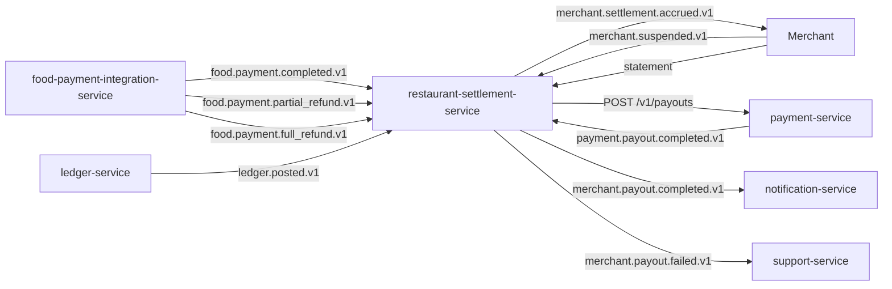

# restaurant-settlement-service — Software Requirements Specification

## 1. Introduction

This document specifies the software behaviour of
`restaurant-settlement-service`. It is the engineering source of
truth for the merchant payable ledger, the payout runs, and the
reconciliation.

## 2. Scope

- In scope: merchant payable accrual, commission, payout runs,
  bank transfer orchestration, retries, dispute handling,
  statement view, daily reconciliation.
- Out of scope: merchant onboarding, the food payment saga,
  payment provider integration (owned by `payment-service`),
  wallet / ledger mechanics.

## 3. System Context



## 4. Actors

- `merchant` operator (Keycloak `platform-staff`).
- `food-payment-integration-service` (system actor).
- `merchant-service` (system actor).
- `payment-service` (system actor; payout execution).
- `ledger-service` (system actor; double-entry).
- `admin-service` / `support-service` (Keycloak
  `platform-internal`).

## 5. Functional Requirements

| ID | Requirement | Priority |
|----|-------------|----------|
| FR--001 | On `food.payment.completed.v1`, insert an `accrual` row with `(merchant_id, gross_minor, commission_minor, net_minor, currency, kind=order)`. | MUST |
| FR--002 | On `food.payment.partial_refund.v1`, insert a `debit` row with the proportional `merchant_debit_minor`. | MUST |
| FR--003 | On `food.payment.full_refund.v1`, insert a `debit` row with the full `merchant_net_minor`. | MUST |
| FR--004 | The accrual insert is idempotent on `(food_order_id, kind)`. | MUST |
| FR--005 | Maintain the merchant's payable balance in `merchant_balances` in the same transaction. | MUST |
| FR--006 | Run a payout-run job on the configured cadence. | MUST |
| FR--007 | For each merchant with `available_minor ≥ min_payout_minor`, create a `payout` row in `scheduled` state. | MUST |
| FR--008 | Reject creating a second `payout` for a merchant with a `pending` payout. | MUST |
| FR--009 | On payout creation, call `payment-service.payout` with the merchant's `payment_method_token` and `Idempotency-Key=payout:<payout_id>`. | MUST |
| FR--010 | On `payment.payout.completed.v1`, mark the payout `completed` and update the balance. | MUST |
| FR--011 | On `payment.payout.failed.v1`, increment retry; if `< payout_max_retries`, retry with backoff; else mark `failed` and open a support ticket. | MUST |
| FR--012 | On `merchant.suspended.v1`, set `merchant_balances.payouts_paused=true`; no new payouts. | MUST |
| FR--013 | Provide `GET /v1/merchant-payouts/balance/{merchant_id}`. | MUST |
| FR--014 | Provide `GET /v1/merchant-statements/{merchant_id}?period=daily|weekly|monthly`. | MUST |
| FR--015 | Support `POST /v1/payout-runs/{id}/force` (admin). | MUST |
| FR--016 | Support `POST /v1/payout-runs/{id}/cancel` (admin; only in `scheduled` or `pending`). | MUST |
| FR--017 | Support `POST /v1/disputes` (service / support) to open a dispute (debit). | MUST |
| FR--018 | Support `POST /v1/disputes/{id}/resolve` (admin) to resolve. | MUST |
| FR--019 | Run a daily reconciliation against `ledger-service` and emit `restaurant_settlement.audit.reconciled.v1` (or `reconciliation_drift.v1`). | MUST |
| FR--020 | Emit `merchant.settlement.accrued.v1`, `merchant.payout.scheduled.v1`, `merchant.payout.completed.v1` on the outbox. | MUST |
| FR--021 | Respect per-merchant `payout_schedule` and `min_payout_minor` overrides. | SHOULD |
| FR--022 | Support per-city `commission_rate_default` overrides. | SHOULD |
| FR--023 | Reject any step that is older than 5 minutes (clock-skew guard). | MUST |

## 6. Non-Functional Requirements

| ID | Category | Requirement | Target |
|----|----------|-------------|--------|
| NFR--001 | performance | Accrual P99 | ≤ 5 min from event |
| NFR--002 | performance | Payout initiation P99 | ≤ 1 min from run |
| NFR--003 | performance | Balance read P99 | ≤ 100ms |
| NFR--004 | performance | Statement read P99 | ≤ 500ms |
| NFR--005 | availability | Service uptime | 99.95% / 30d |
| NFR--006 | scalability | Accrual throughput | 200 rps |
| NFR--007 | scalability | Concurrent active merchants | ≥ 50k |
| NFR--008 | maintainability | MTTR | ≤ 30 min |
| NFR--009 | observability | End-to-end trace per accrual / payout | 100% |
| NFR--010 | consistency | Available payable always = sum of accruals − sum of payouts | enforced by the ledger and reconciliation |

## 7. API Requirements

- All non-idempotent `POST` endpoints require `Idempotency-Key`.
- All responses use the standard error envelope.
- All endpoints validate input with JSON Schema.
- Full contracts: `INTEGRATION.md`.

## 8. Data Requirements

| ID | Requirement | Notes |
|----|-------------|-------|
| DATA--001 | `merchant_id`, `food_order_id`, `payout_id`, `city_id` are stored as UUID columns WITHOUT database FKs. | Cross-service references. |
| DATA--002 | The accrual / debit ledger is append-only. | |
| DATA--003 | Money values are `amount_minor BIGINT` + `currency CHAR(3)`. | |
| DATA--004 | Every mutable table has `created_at`, `updated_at`, `created_by`, `updated_by`. | |
| DATA--005 | No PII beyond `merchant_id`. | |

## 9. Validation Rules

- `amount_minor > 0` for accruals and payouts.
- `currency` is a valid ISO 4217 code.
- A payout's `amount_minor ≤ merchant.available_balance`.
- A dispute's `amount_minor ≤ merchant.available_balance` (else
  the dispute is queued for the next cycle).

## 10. State Transitions

`Payout` state machine:

```
[*] → scheduled → pending → completed
                              ↘ retry_scheduled → pending
                              ↘ failed → [*]
scheduled → cancelled (admin)
pending → cancelled (admin; refunds to balance)
```

`Accrual` rows are terminal on insert.

## 11. Authorization Requirements

- Merchants may only read their own statement and balance.
- Admins require `merchant.admin` for force-payout and dispute
  resolution.
- Service-to-service callers require
  `restaurant-settlement.write` or `restaurant-settlement.read`.

## 12. Configuration Requirements

- Reads `restaurant_settlement.*` from `configuration-service`
  at startup and on `configuration.updated.v1`.
- All numeric config validated against min/max bounds.

## 13. Error Handling

| Error | Response |
|-------|----------|
| Insufficient balance | 422 `INSUFFICIENT_BALANCE` |
| Below minimum | 422 `BELOW_MIN_PAYOUT` |
| Payout already pending | 409 `PAYOUT_ALREADY_PENDING` |
| Merchant suspended | 409 `MERCHANT_SUSPENDED` |
| Downstream `payment-service` down | 503 `CIRCUIT_OPEN` |
| Idempotency-Key reused | 422 `IDEMPOTENCY_KEY_REUSED` |

## 14. Concurrency Requirements

- A row-level lock on the `merchant_balances` row is acquired at
  every payout.
- The accrual insert is idempotent by unique constraint on
  `(food_order_id, kind)`.
- The retry scheduler uses an advisory lock per payout.

## 15. Idempotency Requirements

- All `POST` endpoints require `Idempotency-Key`.
- The accrual idempotency key is
  `merchant:<merchant_id>:order:<food_order_id>:kind:<kind>`.
- The payout idempotency key is `payout:<payout_id>`.
- Replays return the original response.

## 16. Performance

- Dominant path: receive `food.payment.completed.v1`, insert
  accrual, update balance, emit event.
- P50 / P95 / P99: see NFRs.

## 17. Scalability

- Horizontal: stateless; HPA on `kafka_consumer_lag` and
  `merchant_payable_accrued_total`.
- Vertical: bounded by PostgreSQL connection pool.

## 18. Availability

- SLO: 99.95% over 30 days.
- Maintenance: rolling deploys only.
- Degraded mode: if `payment-service` is down, payouts queue;
  the service returns 503 and merchants are told payouts are
  delayed.

## 19. Security

| ID | Requirement | Notes |
|----|-------------|-------|
| SEC--001 | All endpoints require JWT bearer validated at the gateway. | |
| SEC--002 | Merchants may only read their own statement. | |
| SEC--003 | No PII beyond `merchant_id`. | |
| SEC--004 | No bank account details are stored. | Stored in `payment-service`. |
| SEC--005 | Admin force-payout is audit-logged. | `admin.action.performed.v1`. |
| SEC--006 | Rate limit: 5 manual payout triggers per admin per minute. | |

## 20. Privacy

- PII stored: none.
- Retention: 7 years (financial).
- Erasure: not applicable.

## 21. Auditability

- Every accrual row is immutable.
- Every payout has a state history.
- Admin force-payouts emit `admin.action.performed.v1`.
- Reconciliation runs emit
  `restaurant_settlement.audit.reconciled.v1` (or
  `reconciliation_drift.v1`).

## 22. Observability

- Logs: JSON, fields include `correlation_id`, `merchant_id`,
  `payout_id`, `accrual_id`, `tenant_id`.
- Metrics: `merchant_payable_accrued_total{city_id,kind}`,
  `merchant_payout_scheduled_total`,
  `merchant_payout_completed_total`,
  `merchant_payout_failed_total{reason}`,
  `merchant_payout_seconds`,
  `merchant_payout_run_size`,
  `merchant_payout_reconciliation_drift`.
- Traces: OpenTelemetry; root span per accrual / payout.
- Alerts: SLO burn-rate; reconciliation drift > 0; payout
  failure rate > 5%; payout stuck > 24h.

## 23. Maintainability

- Code style: TypeScript strict, ESLint with platform rules.
- Test coverage: ≥ 80% line, ≥ 70% branch.
- Documentation: this folder + `WORKFLOWS.md` diagrams.

## 24. Disaster Recovery

- RPO: 5 minutes.
- RTO: 30 minutes.

## 25. Acceptance Criteria

- All FR/NFR are met and verified by automated tests.
- All SEC are met and verified by a security review.
- A load test sustains 200 accruals / second.
- A chaos test (kill `payment-service`) shows payouts queue and
  resume.
- Reconciliation reports zero drift over 7 days.

---

## See also

### Sibling docs for this service

- [`README.md`](./README.md) — purpose, bounded context, responsibilities
- [`BRD.md`](./BRD.md) — business requirements
- [`SRS.md`](./SRS.md) — functional + non-functional requirements
- [`ERD.md`](./ERD.md) — data model (entities, relationships)
- [`INTEGRATION.md`](./INTEGRATION.md) — inter-service contracts (APIs, events, sagas)
- [`WORKFLOWS.md`](./WORKFLOWS.md) — operational workflows (happy paths, failure modes)
- [`TECH.md`](./TECH.md) — technology profile (runtime, libraries, data layer, admin endpoints, RBAC)

### Platform-wide

- [`../../shared/README.md`](../../shared/README.md) — `platform-spring-boot-starter` shared library (the single source of cross-cutting code for all Spring Boot services in the platform)
- [`../RECOMMENDATIONS.md`](../RECOMMENDATIONS.md) — platform-wide technology map (language, framework, version baseline, admin/RBAC pattern)
- [`../../README.md`](../../README.md) — services overview (the catalog of all 58 services)
- [`../../../main.md`](../../../main.md) — top-level platform specification (architecture, Keycloak, PostgreSQL 18, messaging, observability baseline)

