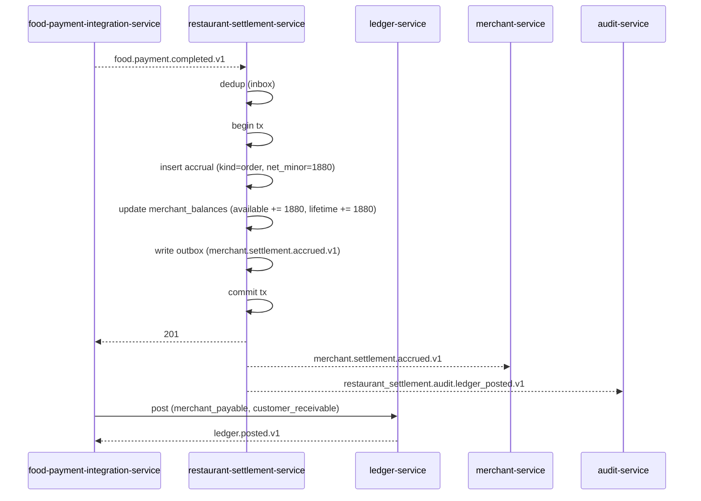
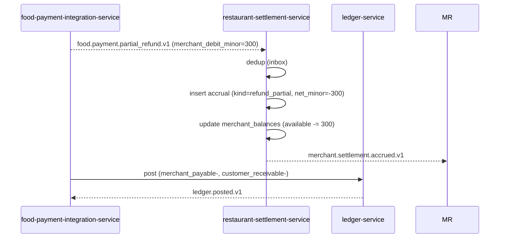
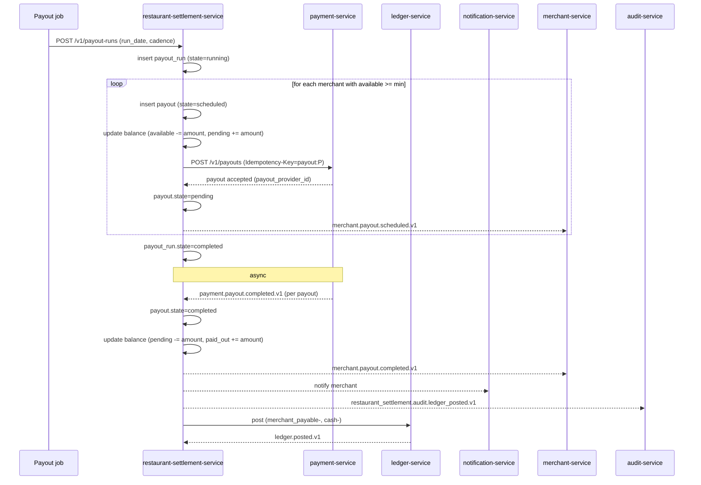
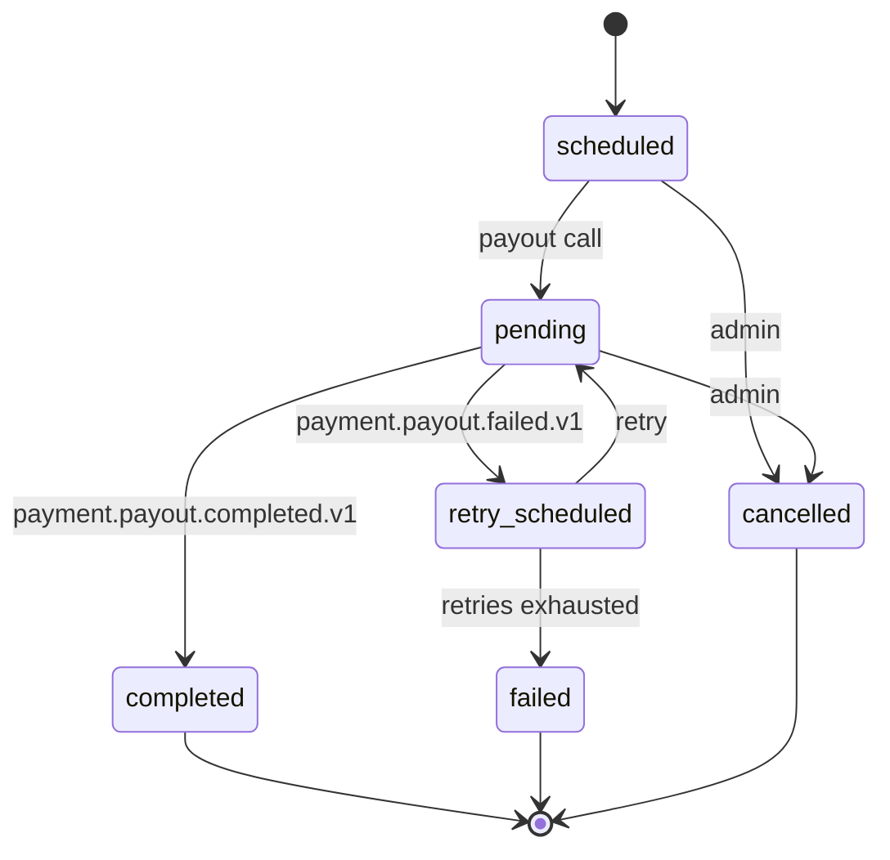
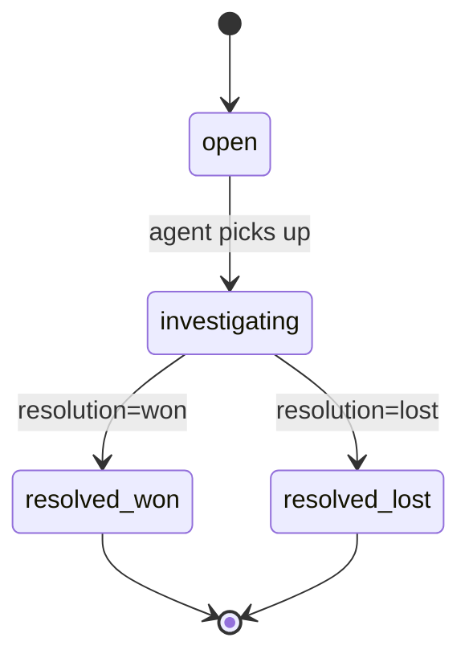

# restaurant-settlement-service — Workflows

## 1. `Order Completed → Merchant Payable Accrued` (Happy Path)

### 1.1 Objective

When a food order's payment is completed, accrue the merchant's
share to their payable balance.

### 1.2 Initiating Actor

`food-payment-integration-service` emits
`food.payment.completed.v1`.

### 1.3 Participating Services

- `food-payment-integration-service` (producer)
- `restaurant-settlement-service` (this service)
- `ledger-service` (records the posting; reconciliation target)
- `merchant-service` (UI notification)

### 1.4 Prerequisites

- A `food.payment.completed.v1` event has been received and
  dedup'd.

### 1.5 Happy Path



### 1.6 Alternate Paths

- **Tip added later**: handled by `customer.tip.added.v1` in
  `food-payment-integration-service`; this service receives
  no separate event (the tip is a courier-only event).
- **Per-merchant commission override**: applied at accrual time.

### 1.7 Failure Paths

- **Duplicate event**: unique constraint prevents double-insert;
  409 returned.
- **Outbox publish fails**: retried; after exhaustion → DLQ.
- **Ledger-service down**: the financial saga continues; this
  service's accrual is independent; reconciliation catches up.

### 1.8 Business Rules

- The accrual row is append-only.
- The commission rate is the snapshot at accrual time.
- The balance is updated in the same transaction.

### 1.9 State Transitions

Accrual rows are terminal on insert; no transitions.

### 1.10 Events

| Event | Direction | When |
|-------|-----------|------|
| `food.payment.completed.v1` | consumed | on completion |
| `merchant.settlement.accrued.v1` | produced | on insert |

### 1.11 APIs Involved

| API | Direction | When |
|-----|-----------|------|
| `POST /v1/merchant-payouts/accrue` | inbound | from FPI |

### 1.12 Compensation / Rollback

- A proportional debit (refund) is a new `refund_partial` or
  `refund_full` accrual.

### 1.13 Final State

- Accrual row present.
- Balance increased.

## 2. `Refund → Merchant Payable Debit` (Proportional)

### 2.1 Objective

When a refund is applied, debit the merchant's payable
proportionally.

### 2.2 Initiating Actor

`food-payment-integration-service` emits
`food.payment.partial_refund.v1` or `food.payment.full_refund.v1`.

### 2.3 Participating Services

- `food-payment-integration-service` (producer)
- `restaurant-settlement-service` (this service)
- `ledger-service` (records the reversal)

### 2.4 Prerequisites

- The original order's accrual exists.
- The refund event includes the proportional `merchant_debit_minor`.

### 2.5 Happy Path



### 2.6 Alternate Paths

- **Full refund**: `food.payment.full_refund.v1` triggers a
  `refund_full` accrual with the full `merchant_net_minor`.

### 2.7 Failure Paths

- **Duplicate event**: 409; idempotent.
- **Insufficient balance for the proportional debit** (rare):
  the debit is queued for the next cycle; a P3 ticket is opened.

### 2.8 Business Rules

- The debit is proportional to the merchant's share of the
  original order.
- A full refund fully reverses the merchant's accrual.

### 2.9 State Transitions

N/A.

### 2.10 Events

| Event | Direction | When |
|-------|-----------|------|
| `food.payment.partial_refund.v1` | consumed | on partial |
| `food.payment.full_refund.v1` | consumed | on full |
| `merchant.settlement.accrued.v1` | produced | on insert |

### 2.11 APIs Involved

None direct (event-driven).

### 2.12 Compensation / Rollback

- A "refund of refund" is a new positive accrual.

### 2.13 Final State

- Accrual row present.
- Balance reduced.

## 3. `Payout Run → Bank Transfer → Completion` (Happy Path)

### 3.1 Objective

On the configured cadence, pay every merchant with a payable ≥
`min_payout_minor` via bank transfer.

### 3.2 Initiating Actor

A scheduled job (or admin via `POST /v1/payout-runs`).

### 3.3 Participating Services

- `restaurant-settlement-service` (this service)
- `payment-service` (executes the bank transfer)
- `ledger-service` (records the payout posting)
- `notification-service` (notifies the merchant)

### 3.4 Prerequisites

- A scheduled run date has been reached (or admin triggered).
- The merchant is not suspended.

### 3.5 Happy Path



### 3.6 Alternate Paths

- **Merchant has no available balance**: skipped.
- **Merchant is suspended**: skipped (but logged).
- **Admin force-payout**: same flow with an audit note.

### 3.7 Failure Paths

- **Payout fails**: see §4.
- **Payout-run job fails**: a daily reconciliation detects
  unrun dates and pages on-call.

### 3.8 Business Rules

- At most one pending payout per merchant.
- The balance is updated in the same transaction as the payout
  state change.

### 3.9 State Transitions



### 3.10 Events

| Event | Direction | When |
|-------|-----------|------|
| `merchant.payout.scheduled.v1` | produced | on creation |
| `merchant.payout.completed.v1` | produced | on completion |
| `payment.payout.completed.v1` | consumed | on done |
| `payment.payout.failed.v1` | consumed | on fail |

### 3.11 APIs Involved

| API | Direction | When |
|-----|-----------|------|
| `POST /v1/payouts` | outbound | to payment-service |

### 3.12 Compensation / Rollback

- A failed payout returns the balance to available (see §4).

### 3.13 Final State

- Payout: `completed`.
- Balance: `available` decreased; `paid_out` increased.

## 4. `Payout Failure and Retry`

### 4.1 Objective

Handle a failed payout: retry with backoff up to
`payout_max_retries`; on exhaustion, surface to support.

### 4.2 Initiating Actor

`payment-service` emits `payment.payout.failed.v1`.

### 4.3 Participating Services

- `payment-service` (producer)
- `restaurant-settlement-service` (this service)
- `support-service` (consumer of `merchant.payout.failed.v1`)

### 4.4 Prerequisites

- The payout is in `pending`.

### 4.5 Happy Path (Retry Succeeds)

```mermaid
sequenceDiagram
    participant PAY as payment-service
    participant RSS as restaurant-settlement-service
    participant SUP as support-service

    PAY-->>RSS: payment.payout.failed.v1
    RSS->>RSS: increment retry_count
    alt retry_count < max_retries
        RSS->>RSS: state=retry_scheduled; next_retry_at = now + backoff
        Note over RSS: backoff: 5m, 30m, 2h
        Note over RSS: scheduler
        RSS->>PAY: POST /v1/payouts (retry)
        PAY-->>RSS: payment.payout.completed.v1
        RSS->>RSS: state=completed
    else retries exhausted
        RSS->>RSS: state=failed
        RSS->>RSS: restore balance (pending -= amount; available += amount)
        RSS-->>SUP: merchant.payout.failed.v1
    end
```

### 4.6 Alternate Paths

- **Permanent failure** (bank details invalid): skip retries,
  surface immediately.

### 4.7 Failure Paths

- **Scheduler fails**: a daily reconciliation detects payouts
  stuck in `retry_scheduled` for > 24h and pages on-call.

### 4.8 Business Rules

- Retries use exponential backoff: 5m, 30m, 2h.
- After `max_retries`, the payout is `failed` and the balance
  is restored.

### 4.9 State Transitions

See §3.9.

### 4.10 Events

| Event | Direction | When |
|-------|-----------|------|
| `payment.payout.failed.v1` | consumed | on fail |
| `merchant.payout.failed.v1` | produced | on exhaustion |

### 4.11 APIs Involved

| API | Direction | When |
|-----|-----------|------|
| `POST /v1/payouts` | outbound | retry |

### 4.12 Compensation / Rollback

- Balance is restored on exhaustion.

### 4.13 Final State

- Payout: `completed` (retry success) or `failed` (exhaustion).
- Balance: correct.

## 5. `Dispute Handling` (Quality / Chargeback)

### 5.1 Objective

Open and resolve disputes (debits) against a merchant's payable.

### 5.2 Initiating Actor

`food-payment-integration-service` (for quality refunds) or
`payment-service` (for chargebacks) or a support agent.

### 5.3 Participating Services

- `restaurant-settlement-service` (this service)
- `merchant-service` (UI notification)
- `audit-service`

### 5.4 Prerequisites

- A dispute event has been received (or a support ticket has
  been opened).

### 5.5 Happy Path

```mermaid
sequenceDiagram
    participant FPI as food-payment-integration-service
    participant SUP as support-service
    participant RSS as restaurant-settlement-service
    participant MR as merchant-service

    FPI-->>RSS: food.payment.partial_refund.v1 (reason=quality)
    Note over RSS: also handled as a refund (see §2)
    SUP->>RSS: POST /v1/disputes (reason=settlement_reversal)
    RSS->>RSS: insert dispute (state=open)
    RSS->>RSS: insert accrual (kind=dispute_debit, net_minor=-amount)
    RSS->>RSS: update balance
    RSS-->>MR: merchant.dispute.opened.v1
    RSS-->>MR: merchant.settlement.accrued.v1
    Note over SUP: investigation
    SUP->>RSS: POST /v1/disputes/{id}/resolve (resolution=won|lost)
    alt won
        RSS->>RSS: dispute.state=resolved_won
        Note over RSS: no further debit; merchant may counter-claim
    else lost
        RSS->>RSS: dispute.state=resolved_lost
        Note over RSS: the debit stands
    end
    RSS-->>MR: merchant.dispute.resolved.v1
```

### 5.6 Alternate Paths

- **Chargeback**: `payment-service` emits a chargeback event;
  the service automatically opens a dispute and applies the debit.

### 5.7 Failure Paths

- **Insufficient balance**: the debit is queued for the next
  cycle; a P3 ticket is opened.

### 5.8 Business Rules

- A dispute has a state machine: `open → investigating →
  resolved_won | resolved_lost`.
- The debit is applied on dispute creation; the resolution only
  affects the dispute state, not the ledger (the debit stands
  unless explicitly reversed).

### 5.9 State Transitions



### 5.10 Events

| Event | Direction | When |
|-------|-----------|------|
| `merchant.dispute.opened.v1` | produced | on open |
| `merchant.dispute.resolved.v1` | produced | on resolve |

### 5.11 APIs Involved

| API | Direction | When |
|-----|-----------|------|
| `POST /v1/disputes` | inbound | service / support |
| `POST /v1/disputes/{id}/resolve` | inbound | admin |

### 5.12 Compensation / Rollback

- A "won" dispute may trigger a positive accrual (admin-only).

### 5.13 Final State

- Dispute: terminal.
- Balance: debited (or restored, if won and an adjustment is
  made).

## 6. `Daily Reconciliation`

Same shape as `courier-earnings-service.daily_reconciliation`,
applied to the merchant payable account. Drift opens a P1 ticket
and emits `restaurant_settlement.audit.reconciliation_drift.v1`.

---

## 99. `Monthly Partition Maintenance`

### 99.1 Objective

Idempotently pre-create the next 12 months for partitioned tables in `restaurant_settlement`. The drop half is handled by the per-service retention job.

### 99.2 Initiating Actor

A scheduled job runs daily at `02:00 UTC`. Leader-elected via `pg_try_advisory_xact_lock(hashtext('restaurant_settlement.partition'), hashtext('monthly'))`.

### 99.3 Happy Path

```mermaid
sequenceDiagram
    participant JOB as Partition job
    participant PG as PostgreSQL
    JOB->>PG: pg_try_advisory_xact_lock('restaurant_settlement.monthly')
    alt lock acquired
        loop for each missing month in next 12
            JOB->>PG: CREATE TABLE IF NOT EXISTS restaurant_settlement.<table>_YYYY_MM PARTITION OF restaurant_settlement.<table>
            JOB->>PG: verify (pg_inherits, relpartbound)
        end
        JOB->>PG: assert now() in existing child
    else lock NOT acquired
        Note over JOB: another instance is running; exit cleanly
    end
```

### 99.4 Failure Paths

| Failure | Handling |
|---------|----------|
| Lock contention | exit 0 |
| DDL fails | retry 3× with backoff (1 s / 4 s / 16 s); page on-call |
| Today's child missing | critical alert; INSERTs would fail |

### 99.5 Business Rules

- Pre-create next 12 complete future months.
- Every child is created with `CREATE TABLE IF NOT EXISTS … PARTITION OF …` so the job is safe to run twice in the same window.
- A verification step (`pg_inherits` parent + `relpartbound` range) runs after every `CREATE TABLE IF NOT EXISTS` because `IF NOT EXISTS` only guards the name, not the bounds.
- Optionally emit `audit.partition.maintained.v1` on success.

---

## See also

### Sibling docs for this service

- [`README.md`](./README.md) — purpose, bounded context, responsibilities
- [`BRD.md`](./BRD.md) — business requirements
- [`SRS.md`](./SRS.md) — functional + non-functional requirements
- [`ERD.md`](./ERD.md) — data model (entities, relationships)
- [`INTEGRATION.md`](./INTEGRATION.md) — inter-service contracts (APIs, events, sagas)
- [`WORKFLOWS.md`](./WORKFLOWS.md) — operational workflows (happy paths, failure modes)
- [`TECH.md`](./TECH.md) — technology profile (runtime, libraries, data layer, admin endpoints, RBAC)

### Platform-wide

- [`../../shared/README.md`](../../shared/README.md) — `platform-spring-boot-starter` shared library (the single source of cross-cutting code for all Spring Boot services in the platform)
- [`../RECOMMENDATIONS.md`](../RECOMMENDATIONS.md) — platform-wide technology map (language, framework, version baseline, admin/RBAC pattern)
- [`../../README.md`](../../README.md) — services overview (the catalog of all 58 services)
- [`../../../main.md`](../../../main.md) — top-level platform specification (architecture, Keycloak, PostgreSQL 18, messaging, observability baseline)

