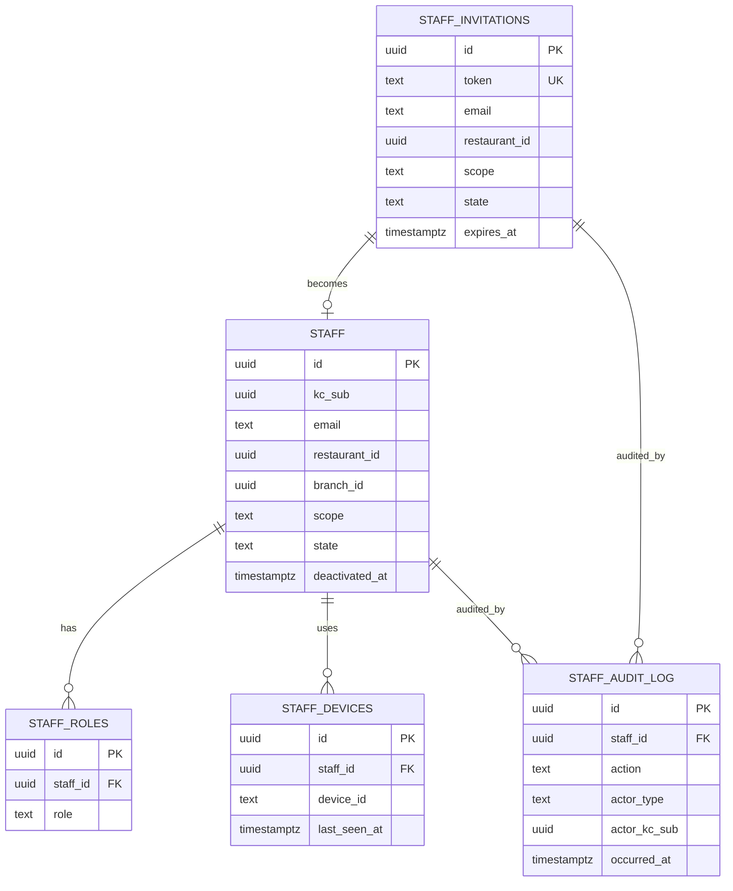

# restaurant-staff-service — Entity-Relationship Diagram

## 1. Database

- Engine: **PostgreSQL 18**.
- Schema: `restaurant_staff` (owned exclusively by this service).
- Migrations: `services/restaurant-staff-service/prisma/migrations/`.

## 2. Cross-Service References

| Column | Type | Refers to | Source of truth |
|--------|------|-----------|------------------|
| `staff.kc_sub` | UUID | Keycloak user | `identity-service` |
| `staff.restaurant_id` | UUID | Restaurant | `restaurant-service` |
| `staff.branch_id` | UUID | Branch | `branch-service` (when scope is branch) |
| `staff.deactivation_actor_kc_sub` | UUID | Keycloak user | `identity-service` |

All cross-service references are stored as columns **without**
database-level foreign keys.

## 3. Entities

### `staff`

A staff record (the business assignment) for a Keycloak user at
a specific restaurant or branch.

#### Columns

| Column | Type | Constraints | Notes |
|--------|------|-------------|-------|
| `id` | UUID | PK | UUIDv7 |
| `kc_sub` | UUID | NOT NULL | cross-service ref; immutable after activation |
| `email` | TEXT | NOT NULL, ENCRYPTED | confidential |
| `restaurant_id` | UUID | NOT NULL | cross-service ref |
| `branch_id` | UUID | NULL | cross-service ref; required if scope = branch |
| `scope` | TEXT | NOT NULL CHECK in (...) | `restaurant` or `branch` |
| `state` | TEXT | NOT NULL DEFAULT 'active' CHECK in (...) | `active`, `deactivated` |
| `invitation_id` | UUID | NULL | FK to `staff_invitations.id` (within schema) |
| `deactivated_at` | TIMESTAMPTZ | NULL | when deactivated |
| `deactivated_by_kc_sub` | UUID | NULL | who deactivated |
| `deactivation_reason_code` | TEXT | NULL | reason |
| `deactivation_cause` | TEXT | NULL | `admin`, `owner`, `cascade` |
| `created_at` | TIMESTAMPTZ | NOT NULL DEFAULT now() | audit |
| `updated_at` | TIMESTAMPTZ | NOT NULL DEFAULT now() | audit |
| `created_by` | UUID | NOT NULL | identity |
| `updated_by` | UUID | NOT NULL | identity |

#### Indexes

- PK on `id`.
- UNIQUE on `(kc_sub, restaurant_id, COALESCE(branch_id, '00000000-0000-0000-0000-000000000000'))` — one assignment per (user, scope).
- Index on `(restaurant_id)`.
- Index on `(state)`.

#### Constraints

- CHECK: `scope IN ('restaurant','branch')`.
- CHECK: `state IN ('active','deactivated')`.
- CHECK: `(scope = 'restaurant' AND branch_id IS NULL) OR (scope = 'branch' AND branch_id IS NOT NULL)`.

### `staff_roles`

Roles assigned to a staff member.

#### Columns

| Column | Type | Constraints | Notes |
|--------|------|-------------|-------|
| `id` | UUID | PK | UUIDv7 |
| `staff_id` | UUID | NOT NULL, FK to `staff.id` | |
| `role` | TEXT | NOT NULL CHECK in (...) | `manager`, `cashier`, `kitchen`, `dispatcher` |
| `created_at` | TIMESTAMPTZ | NOT NULL DEFAULT now() | |

#### Indexes

- PK on `id`.
- UNIQUE on `(staff_id, role)`.

### `staff_devices`

Devices allow-listed for a staff member (POS tablets, etc.).

#### Columns

| Column | Type | Constraints | Notes |
|--------|------|-------------|-------|
| `id` | UUID | PK | UUIDv7 |
| `staff_id` | UUID | NOT NULL, FK to `staff.id` | |
| `device_id` | TEXT | NOT NULL CHECK (length(device_id) <= 128) | opaque |
| `device_label` | TEXT | NULL | human-friendly |
| `last_seen_at` | TIMESTAMPTZ | NULL | when the device last made a request |
| `created_at` | TIMESTAMPTZ | NOT NULL DEFAULT now() | |
| `deactivated_at` | TIMESTAMPTZ | NULL | soft disable |

#### Indexes

- PK on `id`.
- UNIQUE on `(staff_id, device_id)`.

### `staff_invitations`

Pending invitations.

#### Columns

| Column | Type | Constraints | Notes |
|--------|------|-------------|-------|
| `id` | UUID | PK | UUIDv7 |
| `token` | TEXT | NOT NULL UNIQUE | opaque, hashed at rest |
| `email` | TEXT | NOT NULL, ENCRYPTED | confidential |
| `restaurant_id` | UUID | NOT NULL | cross-service ref |
| `branch_id` | UUID | NULL | cross-service ref |
| `scope` | TEXT | NOT NULL CHECK in (...) | |
| `roles` | TEXT[] | NOT NULL | roles to assign on accept |
| `invited_by_kc_sub` | UUID | NOT NULL | who invited |
| `state` | TEXT | NOT NULL DEFAULT 'pending' CHECK in (...) | `pending`, `accepted`, `expired`, `revoked` |
| `expires_at` | TIMESTAMPTZ | NOT NULL | |
| `accepted_at` | TIMESTAMPTZ | NULL | |
| `accepted_kc_sub` | UUID | NULL | who accepted |
| `created_at` | TIMESTAMPTZ | NOT NULL DEFAULT now() | |

#### Indexes

- PK on `id`.
- UNIQUE on `token`.
- Index on `(email)`.
- Index on `(state, expires_at)`.

### `staff_audit_log`

Append-only audit log of admin actions and cascade events.

#### Columns

| Column | Type | Constraints | Notes |
|--------|------|-------------|-------|
| `id` | UUID | PK | UUIDv7 |
| `staff_id` | UUID | NULL, FK to `staff.id` | nullable for invitation events |
| `invitation_id` | UUID | NULL, FK to `staff_invitations.id` | |
| `action` | TEXT | NOT NULL CHECK in (...) | `invite`, `accept`, `role_change`, `device_register`, `device_remove`, `deactivate`, `reactivate`, `cascade_deactivate` |
| `actor_kc_sub` | UUID | NULL | null for system |
| `actor_type` | TEXT | NOT NULL CHECK in (...) | `admin`, `owner`, `manager`, `staff`, `system` |
| `reason_code` | TEXT | NULL | required for deactivation / cascade |
| `reason_text` | TEXT | NULL | optional |
| `details` | JSONB | NULL | action-specific details |
| `correlation_id` | UUID | NOT NULL | trace |
| `occurred_at` | TIMESTAMPTZ | NOT NULL DEFAULT now() | |

#### Indexes

- PK on `id`.
- Index on `(staff_id, occurred_at DESC)`.

### `outbox`

Transactional outbox for events. See `EVENT_ARCHITECTURE.md`.

#### Columns

| Column | Type | Constraints | Notes |
|--------|------|-------------|-------|
| `id` | UUID | PK | UUIDv7 |
| `aggregate_type` | TEXT | NOT NULL | `Staff` |
| `aggregate_id` | UUID | NOT NULL | partition key |
| `event_name` | TEXT | NOT NULL | `staff.*.v1` |
| `event_id` | UUID | NOT NULL UNIQUE | dedup |
| `payload` | JSONB | NOT NULL | envelope |
| `headers` | JSONB | NOT NULL DEFAULT '{}' | Kafka headers |
| `created_at` | TIMESTAMPTZ | NOT NULL DEFAULT now() | |
| `claimed_at` | TIMESTAMPTZ | NULL | poller-set |
| `published_at` | TIMESTAMPTZ | NULL | poller-set |

#### Indexes

- PK on `id`.
- Index on `(published_at NULLS FIRST, created_at)`.

### `inbox`

Consumer-side dedup. See `EVENT_ARCHITECTURE.md`.

#### Columns

| Column | Type | Constraints | Notes |
|--------|------|-------------|-------|
| `event_id` | UUID | PK | |
| `consumer` | TEXT | NOT NULL | |
| `received_at` | TIMESTAMPTZ | NOT NULL DEFAULT now() | |
| `processed_at` | TIMESTAMPTZ | NULL | |
| `error` | TEXT | NULL | |

## 4. Mermaid ER Diagram



## 5. DDL Sketch

```sql
CREATE SCHEMA IF NOT EXISTS restaurant_staff;

CREATE TABLE restaurant_staff.staff (
    id UUID PRIMARY KEY,
    kc_sub UUID NOT NULL,
    email TEXT NOT NULL,
    restaurant_id UUID NOT NULL,
    branch_id UUID,
    scope TEXT NOT NULL CHECK (scope IN ('restaurant','branch')),
    state TEXT NOT NULL DEFAULT 'active' CHECK (state IN
        ('active','deactivated')),
    invitation_id UUID,
    deactivated_at TIMESTAMPTZ,
    deactivated_by_kc_sub UUID,
    deactivation_reason_code TEXT,
    deactivation_cause TEXT,
    created_at TIMESTAMPTZ NOT NULL DEFAULT now(),
    updated_at TIMESTAMPTZ NOT NULL DEFAULT now(),
    created_by UUID NOT NULL,
    updated_by UUID NOT NULL,
    CHECK ((scope = 'restaurant' AND branch_id IS NULL)
        OR (scope = 'branch' AND branch_id IS NOT NULL))
);

CREATE UNIQUE INDEX staff_kc_sub_scope_uniq
    ON restaurant_staff.staff
    (kc_sub, restaurant_id, COALESCE(branch_id, '00000000-0000-0000-0000-000000000000'));

CREATE INDEX staff_restaurant_idx
    ON restaurant_staff.staff (restaurant_id);

CREATE INDEX staff_state_idx
    ON restaurant_staff.staff (state);

CREATE TABLE restaurant_staff.staff_roles (
    id UUID PRIMARY KEY,
    staff_id UUID NOT NULL REFERENCES restaurant_staff.staff(id),
    role TEXT NOT NULL CHECK (role IN
        ('manager','cashier','kitchen','dispatcher')),
    created_at TIMESTAMPTZ NOT NULL DEFAULT now(),
    UNIQUE (staff_id, role)
);

CREATE TABLE restaurant_staff.staff_devices (
    id UUID PRIMARY KEY,
    staff_id UUID NOT NULL REFERENCES restaurant_staff.staff(id),
    device_id TEXT NOT NULL CHECK (length(device_id) <= 128),
    device_label TEXT,
    last_seen_at TIMESTAMPTZ,
    created_at TIMESTAMPTZ NOT NULL DEFAULT now(),
    deactivated_at TIMESTAMPTZ,
    UNIQUE (staff_id, device_id)
);

CREATE TABLE restaurant_staff.staff_invitations (
    id UUID PRIMARY KEY,
    token TEXT NOT NULL UNIQUE,
    email TEXT NOT NULL,
    restaurant_id UUID NOT NULL,
    branch_id UUID,
    scope TEXT NOT NULL CHECK (scope IN ('restaurant','branch')),
    roles TEXT[] NOT NULL,
    invited_by_kc_sub UUID NOT NULL,
    state TEXT NOT NULL DEFAULT 'pending' CHECK (state IN
        ('pending','accepted','expired','revoked')),
    expires_at TIMESTAMPTZ NOT NULL,
    accepted_at TIMESTAMPTZ,
    accepted_kc_sub UUID,
    created_at TIMESTAMPTZ NOT NULL DEFAULT now(),
    CHECK ((scope = 'restaurant' AND branch_id IS NULL)
        OR (scope = 'branch' AND branch_id IS NOT NULL))
);

CREATE INDEX staff_invitations_email_idx
    ON restaurant_staff.staff_invitations (email);

CREATE INDEX staff_invitations_state_idx
    ON restaurant_staff.staff_invitations (state, expires_at);

CREATE TABLE restaurant_staff.staff_audit_log (
    id UUID PRIMARY KEY,
    staff_id UUID REFERENCES restaurant_staff.staff(id),
    invitation_id UUID REFERENCES restaurant_staff.staff_invitations(id),
    action TEXT NOT NULL CHECK (action IN
        ('invite','accept','role_change','device_register',
         'device_remove','deactivate','reactivate',
         'cascade_deactivate')),
    actor_kc_sub UUID,
    actor_type TEXT NOT NULL CHECK (actor_type IN
        ('admin','owner','manager','staff','system')),
    reason_code TEXT,
    reason_text TEXT,
    details JSONB,
    correlation_id UUID NOT NULL,
    occurred_at TIMESTAMPTZ NOT NULL DEFAULT now()
);

CREATE INDEX staff_audit_log_staff_idx
    ON restaurant_staff.staff_audit_log (staff_id, occurred_at DESC);

CREATE TABLE restaurant_staff.outbox (
    id UUID PRIMARY KEY,
    aggregate_type TEXT NOT NULL,
    aggregate_id UUID NOT NULL,
    event_name TEXT NOT NULL,
    event_id UUID NOT NULL UNIQUE,
    payload JSONB NOT NULL,
    headers JSONB NOT NULL DEFAULT '{}'::jsonb,
    created_at TIMESTAMPTZ NOT NULL DEFAULT now(),
    claimed_at TIMESTAMPTZ,
    published_at TIMESTAMPTZ
);

CREATE INDEX outbox_pending_idx
    ON restaurant_staff.outbox (published_at NULLS FIRST, created_at);

CREATE TABLE restaurant_staff.inbox (
    event_id UUID PRIMARY KEY,
    consumer TEXT NOT NULL,
    received_at TIMESTAMPTZ NOT NULL DEFAULT now(),
    processed_at TIMESTAMPTZ,
    error TEXT
);
```

## 6. Audit Columns

`staff` has `created_at`, `updated_at`, `created_by`, `updated_by`,
`deactivated_at`. `staff_roles`, `staff_devices`,
`staff_invitations` have `created_at`. `staff_audit_log` is
append-only.

## 7. Soft Delete

Soft delete via `state = 'deactivated'` and `deactivated_at` on
`staff`. The row is not physically removed. Devices can also be
soft-disabled via `deactivated_at`.

## 8. JSONB Usage

- `outbox.payload` and `outbox.headers` for the event envelope.
- `staff_audit_log.details` for action-specific details (e.g.
  role changes list).
- No other JSONB.

## 9. Partitioning

No partitioning. Staff volume is in the millions globally, not
billions per day.

## 10. Data Retention

| Table | Retention | Purged by |
|-------|-----------|-----------|
| `staff` | 7 years (financial) | hard delete after 7 years of deactivation |
| `staff_roles` | with staff | hard delete with staff |
| `staff_devices` | with staff | hard delete with staff |
| `staff_invitations` | 30 days after expiry/accept | scheduled job |
| `staff_audit_log` | 7 years | hard delete with staff |
| `outbox` | 24 h after `published_at` | scheduled job |
| `inbox` | 30 days | scheduled job |

## 11. Migration Considerations

- Adding a new role: drop CHECK, add new value; the staff
  cascade re-applies roles on next state change.
- The unique index on `(kc_sub, restaurant_id, COALESCE(branch_id,
  ...))` enforces "one assignment per (user, scope)"; the
  `COALESCE` is required because `branch_id` is nullable for
  `scope = 'restaurant'`. Test with a migration that adds a
  duplicate (it should fail).
- Invitation tokens are stored hashed (HMAC-SHA256 of the
  token + server salt); the raw token is returned once on
  creation and never persisted.
- Cascade deactivation is implemented as a row update; the
  audit log captures the cause and the originating event id.

---

## See also

### Sibling docs for this service

- [`README.md`](./README.md) — purpose, bounded context, responsibilities
- [`BRD.md`](./BRD.md) — business requirements
- [`SRS.md`](./SRS.md) — functional + non-functional requirements
- [`ERD.md`](./ERD.md) — data model (entities, relationships)
- [`INTEGRATION.md`](./INTEGRATION.md) — inter-service contracts (APIs, events, sagas)
- [`WORKFLOWS.md`](./WORKFLOWS.md) — operational workflows (happy paths, failure modes)
- [`TECH.md`](./TECH.md) — technology profile (runtime, libraries, data layer, admin endpoints, RBAC)

### Platform-wide

- [`../../shared/README.md`](../../shared/README.md) — `platform-spring-boot-starter` shared library (the single source of cross-cutting code for all Spring Boot services in the platform)
- [`../RECOMMENDATIONS.md`](../RECOMMENDATIONS.md) — platform-wide technology map (language, framework, version baseline, admin/RBAC pattern)
- [`../../README.md`](../../README.md) — services overview (the catalog of all 58 services)
- [`../../../main.md`](../../../main.md) — top-level platform specification (architecture, Keycloak, PostgreSQL 18, messaging, observability baseline)

