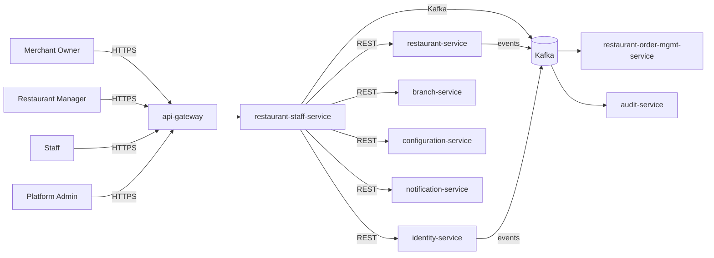

# restaurant-staff-service — Software Requirements Specification

## 1. Introduction

This SRS specifies the software behavior of
`restaurant-staff-service`. It covers functional requirements,
non-functional requirements, data requirements, API contract
summaries, validation, state transitions, authorization,
idempotency, performance, availability, security, and disaster
recovery. The service is the source of truth for the
`RestaurantStaff` aggregate.

## 2. Scope

In scope:

- Staff invitation, activation, role assignment, device
  allow-list, deactivation, reactivation.
- Cascade handling from parent restaurant events and from
  user suspension / disablement.
- Fast RBAC checks for the operator console and POS devices.

Out of scope:

- Keycloak identity (owned by `identity-service`).
- Restaurant brand (owned by `restaurant-service`).
- Branch data (owned by `branch-service`).
- Operator console UI (owned by the admin web app).
- Permissions enforcement at runtime (consumers enforce; this
  service is the source of truth for assignments).

## 3. System Context

## 4. Actors

- **Merchant Owner (human)** — Keycloak subject with role
  `merchant_owner`.
- **Restaurant Manager (human)** — staff with role `manager`.
- **Restaurant Staff (human)** — staff with role `cashier`,
  `kitchen`, or `dispatcher`.
- **Platform Admin (human)** — full access.
- **`identity-service` (system)** — Keycloak sub verification;
  user suspension cascade.
- **`restaurant-service` (system)** — parent; cascade events.
- **`branch-service` (system)** — parent (when scope is branch).
- **`restaurant-order-mgmt-service` (system)** — RBAC consumer.
- **`audit-service` (system)** — receives audit events.

## 5. Functional Requirements

| ID | Requirement | Priority |
|----|-------------|----------|
| FR--001 | The service MUST accept `POST /v1/staff/invitations` with `email`, `roles`, `scope` (`restaurant` or `branch`), `restaurant_id` (or `branch_id`). | MUST |
| FR--002 | The service MUST issue an invitation token with a TTL from `staff.invitation.ttl_hours`. | MUST |
| FR--003 | The service MUST send the invitation via `notification-service` (email). | MUST |
| FR--004 | The service MUST allow activation via `POST /v1/staff/invitations/{token}/accept` with the Keycloak subject. | MUST |
| FR--005 | The service MUST create a `staff` record on activation with the `kc_sub`, `email`, `roles`, and `scope`. | MUST |
| FR--006 | The service MUST support `PATCH /v1/staff/{id}/roles` to add or remove roles. | MUST |
| FR--007 | The service MUST support `POST /v1/staff/{id}/devices` to register a device. | MUST |
| FR--008 | The service MUST enforce `staff.devices.max_per_user` on device registration. | MUST |
| FR--009 | The service MUST support `DELETE /v1/staff/{id}/devices/{device_id}` to remove a device. | MUST |
| FR--010 | The service MUST support `POST /v1/staff/{id}/deactivate` with a `reason_code` (owner or admin). | MUST |
| FR--011 | The service MUST support `POST /v1/staff/{id}/reactivate` (owner or admin). | MUST |
| FR--012 | The service MUST support `GET /v1/staff/by-user/{kc_sub}` (system) to look up by Keycloak subject. | MUST |
| FR--013 | The service MUST support `GET /v1/staff/rbac/check?kc_sub=&restaurant_id=&branch_id=&role=` (system) to check a permission. | MUST |
| FR--014 | The service MUST support cursor pagination on `GET /v1/staff` with filters (`restaurant_id`, `role`, `state`). | MUST |
| FR--015 | The service MUST cascade parent restaurant `suspended` to deactivation of restaurant-scoped staff with reason `restaurant_suspended`. | MUST |
| FR--016 | The service MUST cascade parent restaurant `closed` to deactivation with reason `restaurant_closed`. | MUST |
| FR--017 | The service MUST cascade `identity.user.suspended.v1` to deactivation of all staff records of the user with reason `user_suspended`. | MUST |
| FR--018 | The service MUST cascade `identity.user.disabled.v1` to deactivation with reason `user_disabled`. | MUST |
| FR--019 | The service MUST publish a `staff.*.v1` event for every state change. | MUST |
| FR--020 | The service MUST reject deactivation of the merchant owner with 409 `CANNOT_DEACTIVATE_OWNER`. | MUST |
| FR--021 | The service MUST emit `admin.audit.staff.*` events for every admin action. | MUST |

## 6. Non-Functional Requirements

| ID | Category | Requirement | Target |
|----|----------|-------------|--------|
| NFR--001 | performance | P99 `GET /v1/staff/rbac/check` | < 30 ms (cache hit) |
| NFR--002 | performance | P99 `GET /v1/staff/{id}` | < 150 ms |
| NFR--003 | performance | P99 `POST /v1/staff/invitations` | < 500 ms |
| NFR--004 | availability | service uptime | 99.9% over 30 days |
| NFR--005 | scalability | `rbac/check` lookups | ≥ 10,000 RPS via Redis |
| NFR--006 | scalability | concurrent writes | ≥ 200 RPS sustained, 1,000 RPS burst |
| NFR--007 | maintainability | MTTR for P1 | < 30 min |
| NFR--008 | data-integrity | zero event loss | outbox + 24 h ack |
| NFR--009 | latency | invitation send P95 | < 5 s (notification-service) |
| NFR--010 | observability | every state change queryable in audit | 100% |

## 7. API Requirements

REST API under `/v1/staff[...]` per
[`API_STANDARDS.md`](../../architecture/API_STANDARDS.md). All
write endpoints require `Idempotency-Key`. Cursor pagination by
default. OpenAPI 3.1 spec at `/openapi.json`.

(Full contracts in `INTEGRATION.md`.)

## 8. Data Requirements

| ID | Requirement | Notes |
|----|-------------|-------|
| DATA--001 | Staff records are uniquely identified by `id UUIDv7`. | primary key |
| DATA--002 | Every mutable table has `created_at`, `updated_at`, `created_by`, `updated_by`, `deactivated_at`. | audit |
| DATA--003 | `state` is a CHECK-constrained enum. | lifecycle |
| DATA--004 | `kc_sub` is a UUID column with no DB FK. | cross-service ref |
| DATA--005 | `restaurant_id` and `branch_id` are UUID columns with no DB FK. | cross-service ref |
| DATA--006 | Roles are stored in `staff_roles` (1..n). | normalized |
| DATA--007 | Devices are stored in `staff_devices` (1..n). | normalized |
| DATA--008 | Invitations are stored in `staff_invitations` and deleted on acceptance or expiry. | short-lived |
| DATA--009 | Email is encrypted at the application layer. | confidential |

(Full schema in `ERD.md`.)

## 9. Validation Rules

- `email` — RFC 5322; lowercased.
- `roles` — non-empty array; each value from `staff.roles.list`.
- `scope` — `restaurant` or `branch`.
- `restaurant_id` — required if `scope = restaurant`; required
  (in addition to `branch_id`) if `scope = branch` (the branch
  must belong to that restaurant).
- `branch_id` — required if `scope = branch`.
- `device_id` — opaque string ≤ 128 chars.
- `reason_code` on deactivation — drawn from
  `staff.deactivation.reason_codes`.

## 10. State Transitions

| From | To | Trigger |
|------|----|---------|
| (none) | `pending_activation` | invitation created |
| `pending_activation` | `active` | invitation accepted |
| `pending_activation` | (deleted) | invitation expired |
| `active` | `deactivated` | owner / admin / cascade |
| `deactivated` | `active` | reactivation |

State transitions are described in detail in `WORKFLOWS.md`.

## 11. Authorization Requirements

- `merchant_owner` of the parent restaurant may invite, change
  roles, deactivate, and reactivate staff.
- `restaurant_manager` (staff with role `manager`) may invite
  peers and change roles for staff scoped to the same restaurant
  (subject to policy; cannot deactivate the owner).
- `staff` may self-register devices up to the limit.
- `platform_admin` has full access and may deactivate any staff.
- The owner of the parent merchant cannot be deactivated.

## 12. Configuration Requirements

- `staff.roles.list` — array of allowed roles.
- `staff.invitation.ttl_hours` — int (default 72).
- `staff.devices.max_per_user` — int (default 3).
- `staff.deactivation.reason_codes` — enum.
- `staff.rate_limit.invite_per_hour` — int.
- `staff.cascade.suspend_user_to_staff` — bool.
- `feature_flag.staff.self_device_register` — bool.

## 13. Error Handling

| Error | Response |
|-------|----------|
| Body validation failure | 400 `VALIDATION_FAILED` with `details[]` |
| Missing/invalid JWT | 401 `UNAUTHENTICATED` |
| Insufficient role | 403 `FORBIDDEN` |
| Invitation token not found | 404 `INVITATION_NOT_FOUND` |
| Invitation expired | 410 `INVITATION_EXPIRED` |
| Invitation already accepted | 409 `INVITATION_ALREADY_ACCEPTED` |
| Cannot deactivate owner | 409 `CANNOT_DEACTIVATE_OWNER` |
| Device limit exceeded | 422 `DEVICE_LIMIT_EXCEEDED` |
| Idempotency key reused | 422 `IDEMPOTENCY_KEY_REUSED` |
| Rate limited | 429 `RATE_LIMITED` |
| Downstream (identity, restaurant) timeout | 503 `DEPENDENCY_TIMEOUT` |
| Circuit open | 503 `CIRCUIT_OPEN` |
| Other | 500 `INTERNAL_ERROR` |

## 14. Concurrency Requirements

- Two concurrent role changes on the same staff MUST be
  serialized via row-level lock.
- Two concurrent deactivations MUST be serialized; the second
  one receives 409 `STATE_INVALID` if already deactivated.
- Cascade handlers MUST be idempotent via inbox dedup.

## 15. Idempotency Requirements

- All write endpoints require `Idempotency-Key`.
- All state transitions use the outbox pattern with `event_id`
  dedup.

## 16. Performance

- Dominant path: `GET /v1/staff/rbac/check`. P50 < 5 ms (cache
  hit), P99 < 30 ms.
- `GET /v1/staff/{id}`: P50 < 30 ms, P99 < 150 ms.
- `POST /v1/staff/invitations`: P50 < 200 ms, P99 < 500 ms.

## 17. Scalability

- Horizontal: HPA on CPU > 60% and
  `http_requests_in_flight > 500/replica`; max 12.
- Vertical: up to 4 CPU / 8 GiB.
- DB: 1 primary + 1 read replica in each region.
- Cache: Redis cluster, key
  `staff:rbac:{kc_sub}:{restaurant_id}:{branch_id}:{role}` TTL
  60 s.

## 18. Availability

- SLO: 99.9% over 30 days (Tier-2).
- Error budget: ~44 min / 30 days.
- Maintenance: Sunday 04:00–06:00 UTC.

## 19. Security

| ID | Requirement | Notes |
|----|-------------|-------|
| SEC--001 | All endpoints require a valid JWT; service-to-service uses `client_credentials`. | gateway enforced |
| SEC--002 | Admin actions require `X-Audit-Reason` and HMAC-SHA256 signature. | `API_STANDARDS.md` §14 |
| SEC--003 | The owner of the parent merchant cannot be deactivated. | `CANNOT_DEACTIVATE_OWNER` |
| SEC--004 | Resource-level ownership checks. | `staff.restaurant.merchant.owner_kc_sub == sub` |
| SEC--005 | All cross-service calls use mTLS + `client_credentials` JWT. | defense in depth |
| SEC--006 | Secrets only in Vault. | pre-commit enforced |
| SEC--007 | Rate limiting at gateway and service. | `API_STANDARDS.md` §12 |
| SEC--008 | Email is encrypted at rest. | confidential |
| SEC--009 | Admin actions emit `admin.audit.staff.*` events. | `audit-service` |
| SEC--010 | The service stores no Keycloak credentials. | none |

## 20. Privacy

- PII stored: email (encrypted), Keycloak subject (held as
  `kc_sub` for audit).
- Retention: 7 years (soft delete on deactivation; hard delete
  after 7 years).
- Erasure: not directly supported (financial record retention);
  email can be redacted on request after retention.

## 21. Auditability

- Every state transition emits a `staff.*.v1` event.
- Every admin action emits an `admin.audit.staff.*` event.
- Audit retention: 7 years.

## 22. Observability

- Logs: JSON to stdout with `correlation_id`, `trace_id`,
  `staff_id`, `kc_sub`, `restaurant_id`, `branch_id`, `state`,
  `from_state`, `to_state`, `actor`, `reason_code`.
- Metrics:
  - RED: standard.
  - Business: `staff_invited_total{role}`,
    `staff_activated_total{role}`,
    `staff_deactivated_total{reason}`,
    `staff_role_changes_total{from,to}`,
    `staff_rbac_check_total{cache_hit,result}`,
    `staff_invitation_ttl_hours`.
- Traces: OpenTelemetry.
- Alerts: SLO burn rate, outbox lag, deactivation propagation
  lag.

## 23. Maintainability

- TypeScript strict, ESLint, Prettier.
- Coverage: ≥ 85% lines.
- Documentation: this folder.

## 24. Disaster Recovery

- RPO: 15 min (Tier-2; PITR 7 days).
- RTO: 60 min.
- Quarterly restore drill.

## 25. Acceptance Criteria

- AC-1: A merchant owner can invite and activate a staff
  member in < 7 min.
- AC-2: A role change is reflected in the operator console
  within 30 s.
- AC-3: A deactivated staff member cannot perform any
  RBAC-protected action.
- AC-4: A suspended restaurant's restaurant-scoped staff are
  all deactivated within 60 s.
- AC-5: A user-suspended identity's staff records are all
  deactivated within 60 s.
- AC-6: All admin actions are recorded with reason and actor.
- AC-7: The service exposes a fast RBAC check with P99 < 30 ms.
- AC-8: The service meets its 99.9% SLO.
- AC-9: All state changes are emitted as events.
- AC-10: The service stores no Keycloak credentials.

---

## See also

### Sibling docs for this service

- [`README.md`](./README.md) — purpose, bounded context, responsibilities
- [`BRD.md`](./BRD.md) — business requirements
- [`SRS.md`](./SRS.md) — functional + non-functional requirements
- [`ERD.md`](./ERD.md) — data model (entities, relationships)
- [`INTEGRATION.md`](./INTEGRATION.md) — inter-service contracts (APIs, events, sagas)
- [`WORKFLOWS.md`](./WORKFLOWS.md) — operational workflows (happy paths, failure modes)
- [`TECH.md`](./TECH.md) — technology profile (runtime, libraries, data layer, admin endpoints, RBAC)

### Platform-wide

- [`../../shared/README.md`](../../shared/README.md) — `platform-spring-boot-starter` shared library (the single source of cross-cutting code for all Spring Boot services in the platform)
- [`../RECOMMENDATIONS.md`](../RECOMMENDATIONS.md) — platform-wide technology map (language, framework, version baseline, admin/RBAC pattern)
- [`../../README.md`](../../README.md) — services overview (the catalog of all 58 services)
- [`../../../main.md`](../../../main.md) — top-level platform specification (architecture, Keycloak, PostgreSQL 18, messaging, observability baseline)

