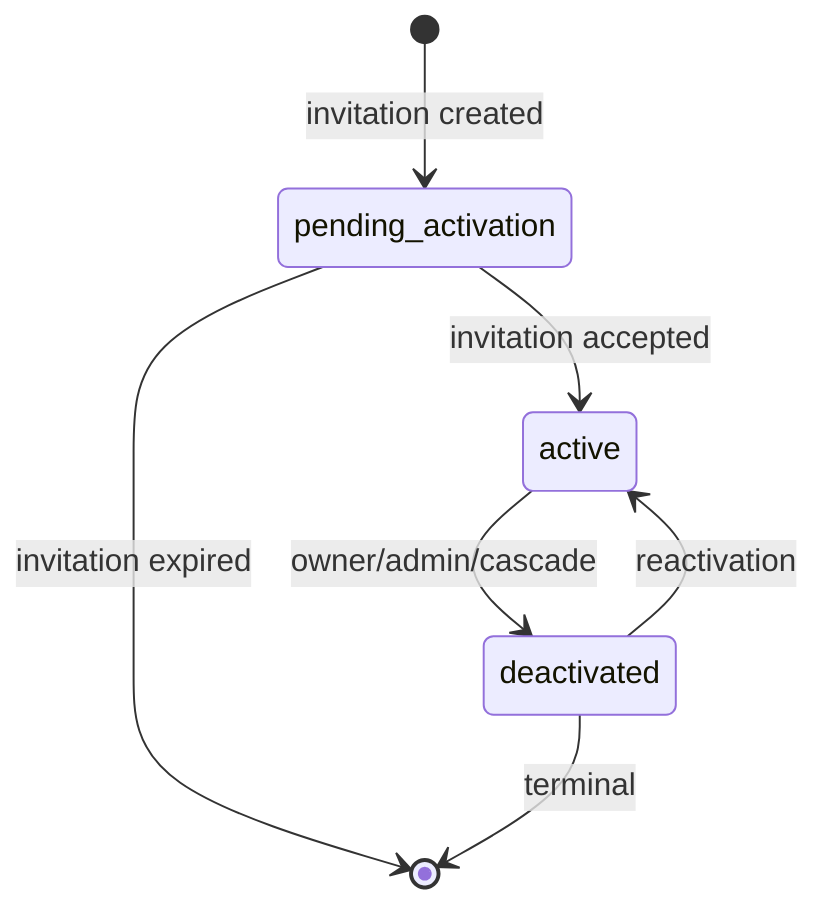

# restaurant-staff-service — Workflows

## 1. Staff Invitation and Activation

### 1.1 Objective

A merchant owner invites a staff member by email; the invitee
signs up via Keycloak, presents the invitation token, and the
service creates the staff record and assigns the roles. The
`staff.activated.v1` event is emitted and consumed by
`restaurant-order-mgmt-service` so the operator console
recognizes the new staff member.

### 1.2 Initiating Actor

`merchant_owner` (human) — invitation.
`staff` (human) — acceptance.

### 1.3 Participating Services

- `restaurant-staff-service` (this service).
- `identity-service` (Keycloak subject verification; user
  creation if new).
- `restaurant-service` (parent verification).
- `branch-service` (parent verification when scope = branch).
- `notification-service` (invitation email).
- `restaurant-order-mgmt-service` (downstream consumer of
  `staff.activated.v1`).
- `audit-service`.

### 1.4 Prerequisites

- The parent restaurant is `approved`.
- The invitee has access to the email inbox.
- The invitee either has a Keycloak account or can sign up.

### 1.5 Happy Path

```mermaid
sequenceDiagram
    participant OWN as Merchant Owner
    participant RS as restaurant-staff-service
    participant RES as restaurant-service
    participant BRH as branch-service
    participant NOT as notification-service
    participant INV as Invitee
    participant ID as identity-service
    participant K as Kafka
    participant ROM as restaurant-order-mgmt-service
    participant AUD as audit-service

    OWN->>RS: POST /v1/staff/invitations (email, scope, restaurant_id, roles, Idempotency-Key)
    RS->>RES: GET /v1/restaurants/{id}
    RES-->>RS: approved
    alt scope=branch
        RS->>BRH: GET /v1/branches/{id}
        BRH-->>RS: exists
    end
    RS->>RS: token = random(); invitation row
    RS->>NOT: send invitation email (token, accept_url)
    NOT-->>INV: email
    RS->>K: staff.invited.v1
    K->>AUD: audit
    RS-->>OWN: 201 invitation
    INV->>ID: sign up (or sign in)
    ID-->>INV: kc_sub
    INV->>RS: POST /v1/staff/invitations/{token}/accept (kc_sub, Idempotency-Key)
    RS->>RS: validate token; create staff row
    RS->>K: staff.activated.v1
    K->>ROM: enable for RBAC
    K->>AUD: audit
    RS-->>INV: 200 staff record
```

### 1.6 Alternate Paths

- **Invitation expired**: 410 `INVITATION_EXPIRED`; the owner
  is asked to re-invite.
- **Already accepted**: 409 `INVITATION_ALREADY_ACCEPTED`.
- **Email mismatch**: a strict mode requires the invitee's
  Keycloak email to match the invitation; if it does not, 422
  `EMAIL_MISMATCH`.

### 1.7 Failure Paths

- **`identity-service` unreachable**: 503 `DEPENDENCY_TIMEOUT`.
- **Notification failure**: the invitation row is persisted
  regardless; a retry is scheduled. The owner is informed via
  the operator console that the email is queued.
- **Outbox publish failure**: outbox retried; DLQ.

### 1.8 Business Rules

- An invitation has a TTL (default 72 h).
- Roles are drawn from `staff.roles.list`.
- Scope must be `restaurant` or `branch`.
- The invitee must sign up via Keycloak; the `kc_sub` is
  captured on activation.

### 1.9 State Transitions



### 1.10 Events

| Event | Direction | When |
|-------|-----------|------|
| `staff.invited.v1` | produced | invitation created |
| `staff.activated.v1` | produced | invitation accepted |
| `restaurant.created.v1` | consumed | parent eligible |

### 1.11 APIs Involved

| API | Direction | When |
|-----|-----------|------|
| `POST /v1/staff/invitations` | inbound | create invitation |
| `POST /v1/staff/invitations/{token}/accept` | inbound | accept |
| `GET /v1/restaurants/{id}` to restaurant-service | outbound | parent check |
| `POST /v1/notifications` to notification-service | outbound | send email |

### 1.12 Compensation / Rollback

- **Owner wants to revoke before acceptance**: `POST
  /v1/staff/invitations/{id}/revoke` transitions the invitation
  to `revoked`; the token is invalidated.
- **Owner invited the wrong person**: same as above.

### 1.13 Final State

A new staff record exists with the assigned roles; the operator
console and POS can now authenticate the user; RBAC checks
return positive results.

## 2. Role Change

### 2.1 Objective

Owner or manager updates the roles of a staff member; the change
is reflected in the operator console within 30 s.

### 2.2 Initiating Actor

`merchant_owner` or `restaurant_manager`.

### 2.3 Participating Services

- `restaurant-staff-service` (this service).
- `restaurant-order-mgmt-service` (downstream — RBAC consumer).
- `audit-service`.

### 2.4 Prerequisites

- Staff is `active`.
- The actor is authorized for the staff's restaurant / branch.

### 2.5 Happy Path

```mermaid
sequenceDiagram
    participant OWN as Owner
    participant RS as restaurant-staff-service
    participant K as Kafka
    participant ROM as restaurant-order-mgmt-service
    participant AUD as audit-service

    OWN->>RS: PATCH /v1/staff/{id}/roles {add: [dispatcher], remove: [cashier]}
    RS->>RS: row-level lock; update staff_roles
    RS->>RS: invalidate Redis cache (staff:rbac:*)
    RS->>K: staff.role_changed.v1
    K->>ROM: invalidate RBAC cache
    K->>AUD: audit
    RS-->>OWN: 200 OK
```

### 2.6 Alternate Paths

- **Role already present**: idempotent.
- **Removing a role the staff does not have**: 422
  `ROLE_NOT_PRESENT`.

### 2.7 Failure Paths

- **Outbox failure**: outbox retried.

### 2.8 Business Rules

- Roles are drawn from `staff.roles.list`.
- A staff must always have at least one role.

### 2.9 State Transitions

This workflow does not change `state`; only the roles.

### 2.10 Events

| Event | Direction | When |
|-------|-----------|------|
| `staff.role_changed.v1` | produced | roles changed |

### 2.11 APIs Involved

| API | Direction | When |
|-----|-----------|------|
| `PATCH /v1/staff/{id}/roles` | inbound | change roles |

### 2.12 Compensation / Rollback

- The actor can re-issue the call to undo.

### 2.13 Final State

Roles are updated; the operator console and POS see the new
roles within 30 s.

## 3. Deactivation (Owner / Admin / Cascade)

### 3.1 Objective

Take a staff member offline so they cannot perform any
RBAC-protected action. The deactivation propagates to all
downstream services within 60 s.

### 3.2 Initiating Actor

`merchant_owner`, `merchant_manager`, `platform_admin`, or
cascade (from parent restaurant suspension / closure, or from
user suspension / disablement).

### 3.3 Participating Services

- `restaurant-staff-service` (this service).
- `restaurant-order-mgmt-service` (downstream — RBAC).
- `notification-service` (inform the staff).
- `audit-service`.

### 3.4 Prerequisites

- The staff is currently `active`.
- For admin / owner / manager: a `reason_code`.
- For cascade: the originating event has been received and
  inbox-deduped.

### 3.5 Happy Path (Direct)

```mermaid
sequenceDiagram
    participant OWN as Owner
    participant RS as restaurant-staff-service
    participant K as Kafka
    participant ROM as restaurant-order-mgmt-service
    participant NOT as notification-service
    participant AUD as audit-service
    participant ST as Staff

    OWN->>RS: POST /v1/staff/{id}/deactivate {reason_code}
    RS->>RS: row-level lock; state=deactivated
    RS->>K: staff.deactivated.v1
    K->>ROM: revoke RBAC
    K->>NOT: notify staff
    K->>AUD: audit
    NOT-->>ST: email
    RS-->>OWN: 200 OK
```

### 3.6 Alternate Paths

- **Cascade from `restaurant.suspended.v1`**: query active
  staff scoped only to the restaurant; deactivate each with
  `cause = 'cascade'`, `reason_code = 'restaurant_suspended'`.
- **Cascade from `identity.user.suspended.v1`**: query active
  staff by `kc_sub`; deactivate each with
  `reason_code = 'user_suspended'`.

### 3.7 Failure Paths

- **Outbox failure**: outbox retried.
- **Already deactivated**: 409 `STATE_INVALID`.

### 3.8 Business Rules

- The owner of the parent merchant cannot be deactivated.
- Deactivation requires a `reason_code`.
- The cause (`admin`, `owner`, `cascade`) is recorded.

### 3.9 State Transitions

The relevant transition is `active → deactivated`. (See state
diagram in §1.9.)

### 3.10 Events

| Event | Direction | When |
|-------|-----------|------|
| `staff.deactivated.v1` | produced | deactivation |
| `restaurant.suspended.v1` | consumed | cascade |
| `restaurant.closed.v1` | consumed | cascade |
| `identity.user.suspended.v1` | consumed | cascade |
| `identity.user.disabled.v1` | consumed | cascade |

### 3.11 APIs Involved

| API | Direction | When |
|-----|-----------|------|
| `POST /v1/staff/{id}/deactivate` | inbound | direct deactivation |

### 3.12 Compensation / Rollback

`POST /v1/staff/{id}/reactivate` restores the staff to
`active`. Devices and roles are preserved.

### 3.13 Final State

The staff member is `deactivated`; the operator console and
POS reject the staff's actions; the staff receives a
notification.

---

## See also

### Sibling docs for this service

- [`README.md`](./README.md) — purpose, bounded context, responsibilities
- [`BRD.md`](./BRD.md) — business requirements
- [`SRS.md`](./SRS.md) — functional + non-functional requirements
- [`ERD.md`](./ERD.md) — data model (entities, relationships)
- [`INTEGRATION.md`](./INTEGRATION.md) — inter-service contracts (APIs, events, sagas)
- [`WORKFLOWS.md`](./WORKFLOWS.md) — operational workflows (happy paths, failure modes)
- [`TECH.md`](./TECH.md) — technology profile (runtime, libraries, data layer, admin endpoints, RBAC)

### Platform-wide

- [`../../shared/README.md`](../../shared/README.md) — `platform-spring-boot-starter` shared library (the single source of cross-cutting code for all Spring Boot services in the platform)
- [`../RECOMMENDATIONS.md`](../RECOMMENDATIONS.md) — platform-wide technology map (language, framework, version baseline, admin/RBAC pattern)
- [`../../README.md`](../../README.md) — services overview (the catalog of all 58 services)
- [`../../../main.md`](../../../main.md) — top-level platform specification (architecture, Keycloak, PostgreSQL 18, messaging, observability baseline)

