# Review and Rating Service — Entity-Relationship Diagram

## 1. Database

- Engine: PostgreSQL 18
- Schema: `review` (owned exclusively by this service)
- Migrations: `services/review-rating-service/migrations/`

## 2. Cross-Service References

| Column | Type | Refers to | Source of truth |
|--------|------|-----------|------------------|
| `review.customer_id` | UUID | `Customer.id` | `customer-service` |
| `review.subject_id` | UUID | `Driver.id` / `Courier.id` / `Restaurant.id` | respective service |
| `review.source_event_id` | UUID | `Trip.id` / `FoodOrder.id` | `trip-service` / `food-order-service` |
| `review.trip_id` | UUID | `Trip.id` | `trip-service` |
| `review.order_id` | UUID | `FoodOrder.id` | `food-order-service` |

No DB FKs.

## 3. Entities

### `Review`

A single review.

#### Columns

| Column | Type | Constraints | Notes |
|--------|------|-------------|-------|
| `id` | UUID | PK | UUIDv7 |
| `customer_id` | UUID | NOT NULL | |
| `subject_type` | TEXT | NOT NULL | `driver` / `courier` / `restaurant` |
| `subject_id` | UUID | NOT NULL | |
| `source_type` | TEXT | NOT NULL | `trip` / `order` |
| `source_event_id` | UUID | NOT NULL | |
| `trip_id` | UUID | NULL | |
| `order_id` | UUID | NULL | |
| `pickup_zone_id` | UUID | NULL | cross-service ref to `zone-service`; backfilled from `trip-service` for completed-trip reviews |
| `dropoff_zone_id` | UUID | NULL | cross-service ref to `zone-service`; backfilled from `trip-service` for completed-trip reviews |
| `rating` | INT | NOT NULL | 1-5 |
| `comment` | TEXT | NULL | 0-1000 chars |
| `tags` | JSONB | NOT NULL DEFAULT '[]' | array of strings |
| `no_rating` | BOOLEAN | NOT NULL DEFAULT false | comment-only review |
| `flagged` | BOOLEAN | NOT NULL DEFAULT false | auto-flag |
| `flagged_reason` | TEXT | NULL | |
| `deleted_at` | TIMESTAMPTZ | NULL | soft delete |
| `deleted_reason` | TEXT | NULL | |
| `created_at` | TIMESTAMPTZ | NOT NULL DEFAULT now() | |
| `updated_at` | TIMESTAMPTZ | NOT NULL DEFAULT now() | |
| `created_by` | UUID | NOT NULL | |
| `updated_by` | UUID | NOT NULL | |

#### Indexes

- PK on `id`
- UNIQUE on `(customer_id, source_event_id)`
- Index on `(subject_type, subject_id, created_at DESC)`
- Partial index on `(subject_type, subject_id) WHERE deleted_at IS NULL`

#### Constraints

- CHECK: `subject_type IN ('driver','courier','restaurant')`
- CHECK: `source_type IN ('trip','order')`
- CHECK: `rating BETWEEN 1 AND 5 OR no_rating = true`
- CHECK: `length(coalesce(comment, '')) <= 1000`
- CHECK: `(trip_id IS NULL) <> (order_id IS NULL)`

### `Reply`

A reply from the subject.

#### Columns

| Column | Type | Constraints | Notes |
|--------|------|-------------|-------|
| `id` | UUID | PK | UUIDv7 |
| `review_id` | UUID | NOT NULL, UNIQUE | one reply per review |
| `subject_id` | UUID | NOT NULL | |
| `text` | TEXT | NOT NULL | 0-500 chars |
| `created_at` | TIMESTAMPTZ | NOT NULL DEFAULT now() | |
| `updated_at` | TIMESTAMPTZ | NOT NULL DEFAULT now() | |

#### Constraints

- CHECK: `length(text) <= 500`

### `Prompt`

A scheduled review prompt.

#### Columns

| Column | Type | Constraints | Notes |
|--------|------|-------------|-------|
| `id` | UUID | PK | UUIDv7 |
| `customer_id` | UUID | NOT NULL | |
| `subject_type` | TEXT | NOT NULL | |
| `subject_id` | UUID | NOT NULL | |
| `source_event_id` | UUID | NOT NULL | |
| `source_type` | TEXT | NOT NULL | |
| `trip_id` | UUID | NULL | |
| `order_id` | UUID | NULL | |
| `scheduled_for` | TIMESTAMPTZ | NOT NULL | now + PROMPT_DELAY_HOURS |
| `status` | TEXT | NOT NULL | `pending` / `sent` / `cancelled` / `expired` |
| `sent_at` | TIMESTAMPTZ | NULL | |
| `cancelled_reason` | TEXT | NULL | e.g. `review_submitted` |
| `created_at` | TIMESTAMPTZ | NOT NULL DEFAULT now() | |

#### Indexes

- PK on `id`
- UNIQUE on `(customer_id, source_event_id)`
- Index on `(status, scheduled_for)` for the worker

#### Constraints

- CHECK: `status IN ('pending','sent','cancelled','expired')`

### `Aggregation`

Materialized aggregated rating per subject. Updated on every
`review.submitted.v1` (debounced).

#### Columns

| Column | Type | Constraints | Notes |
|--------|------|-------------|-------|
| `id` | UUID | PK | UUIDv7 |
| `subject_type` | TEXT | NOT NULL | |
| `subject_id` | UUID | NOT NULL | |
| `window_days` | INT | NOT NULL | |
| `avg_rating` | NUMERIC(3,2) | NOT NULL | |
| `review_count` | INT | NOT NULL | |
| `last_computed_at` | TIMESTAMPTZ | NOT NULL DEFAULT now() | |
| `created_at` | TIMESTAMPTZ | NOT NULL DEFAULT now() | partition key |

#### Indexes

- PK on `id`
- UNIQUE on `(subject_type, subject_id, window_days)`
- Index on `(subject_type, subject_id)`

### `AuditLog`

Immutable audit log.

#### Columns

| Column | Type | Constraints | Notes |
|--------|------|-------------|-------|
| `id` | UUID | PK | UUIDv7 |
| `entity_type` | TEXT | NOT NULL | `review` / `reply` / `prompt` |
| `entity_id` | UUID | NOT NULL | |
| `action` | TEXT | NOT NULL | create/edit/flag/unflag/delete/undelete/reply |
| `old_value` | JSONB | NULL | |
| `new_value` | JSONB | NULL | |
| `actor_id` | UUID | NOT NULL | |
| `reason` | TEXT | NOT NULL | |
| `correlation_id` | UUID | NOT NULL | |
| `client_ip` | INET | NULL | |
| `created_at` | TIMESTAMPTZ | NOT NULL DEFAULT now() | partition key |

#### Constraints

- **No UPDATE / DELETE on this table**.

### `Idempotency`

Same shape.

### `Outbox`

Same shape.

### `Inbox`

Same shape.

## 4. Mermaid ER Diagram

```mermaid
erDiagram
    REVIEW ||--o| REPLY : "has"
    PROMPT }o--|| REVIEW : "may produce"
    REVIEW ||--o{ AUDITLOG : "audits"

    REVIEW {
        uuid id PK
        uuid customer_id
        text subject_type
        uuid subject_id
        text source_type
        uuid source_event_id
        uuid trip_id
        uuid order_id
        int rating
        text comment
        jsonb tags
        boolean no_rating
        boolean flagged
        text flagged_reason
        timestamptz deleted_at
        text deleted_reason
        timestamptz created_at
        timestamptz updated_at
        uuid created_by
        uuid updated_by
    }

    REPLY {
        uuid id PK
        uuid review_id FK
        uuid subject_id
        text text
        timestamptz created_at
        timestamptz updated_at
    }

    PROMPT {
        uuid id PK
        uuid customer_id
        text subject_type
        uuid subject_id
        uuid source_event_id
        text source_type
        uuid trip_id
        uuid order_id
        timestamptz scheduled_for
        text status
        timestamptz sent_at
        text cancelled_reason
        timestamptz created_at
    }

    AGGREGATION {
        uuid id PK
        text subject_type
        uuid subject_id
        int window_days
        numeric avg_rating
        int review_count
        timestamptz last_computed_at
        timestamptz created_at
    }

    AUDITLOG {
        uuid id PK
        text entity_type
        uuid entity_id
        text action
        jsonb old_value
        jsonb new_value
        uuid actor_id
        text reason
        uuid correlation_id
        inet client_ip
        timestamptz created_at
    }

    IDEMPOTENCY {
        uuid idempotency_key PK
        text request_hash
        int response_status
        jsonb response_body
        uuid actor_id
        timestamptz created_at
        timestamptz expires_at
    }

    OUTBOX {
        uuid id PK
        text topic
        uuid event_id
        jsonb payload
        jsonb headers
        timestamptz created_at
        timestamptz claimed_at
        timestamptz published_at
    }

    INBOX {
        uuid event_id PK
        text topic
        timestamptz received_at
        timestamptz processed_at
        text error
    }
```



## 5. DDL Sketch

```sql
CREATE SCHEMA IF NOT EXISTS review;

CREATE TABLE review.reviews (
    id UUID PRIMARY KEY,
    customer_id UUID NOT NULL,
    subject_type TEXT NOT NULL
        CHECK (subject_type IN ('driver','courier','restaurant')),
    subject_id UUID NOT NULL,
    source_type TEXT NOT NULL
        CHECK (source_type IN ('trip','order')),
    source_event_id UUID NOT NULL,
    trip_id UUID,
    order_id UUID,
    pickup_zone_id UUID,
    dropoff_zone_id UUID,
    rating INT,
    comment TEXT,
    tags JSONB NOT NULL DEFAULT '[]',
    no_rating BOOLEAN NOT NULL DEFAULT false,
    flagged BOOLEAN NOT NULL DEFAULT false,
    flagged_reason TEXT,
    deleted_at TIMESTAMPTZ,
    deleted_reason TEXT,
    created_at TIMESTAMPTZ NOT NULL DEFAULT now(),
    updated_at TIMESTAMPTZ NOT NULL DEFAULT now(),
    created_by UUID NOT NULL,
    updated_by UUID NOT NULL,
    UNIQUE (customer_id, source_event_id),
    CHECK (rating BETWEEN 1 AND 5 OR no_rating = true),
    CHECK (length(coalesce(comment, '')) <= 1000),
    CHECK ((trip_id IS NULL) <> (order_id IS NULL))
);

CREATE INDEX idx_reviews_subject
    ON review.reviews (subject_type, subject_id, created_at DESC);
CREATE INDEX idx_reviews_subject_active
    ON review.reviews (subject_type, subject_id)
    WHERE deleted_at IS NULL;

CREATE TABLE review.replies (
    id UUID PRIMARY KEY,
    review_id UUID NOT NULL UNIQUE,
    subject_id UUID NOT NULL,
    text TEXT NOT NULL CHECK (length(text) <= 500),
    created_at TIMESTAMPTZ NOT NULL DEFAULT now(),
    updated_at TIMESTAMPTZ NOT NULL DEFAULT now()
);

CREATE TABLE review.prompts (
    id UUID PRIMARY KEY,
    customer_id UUID NOT NULL,
    subject_type TEXT NOT NULL
        CHECK (subject_type IN ('driver','courier','restaurant')),
    subject_id UUID NOT NULL,
    source_event_id UUID NOT NULL,
    source_type TEXT NOT NULL
        CHECK (source_type IN ('trip','order')),
    trip_id UUID,
    order_id UUID,
    scheduled_for TIMESTAMPTZ NOT NULL,
    status TEXT NOT NULL
        CHECK (status IN ('pending','sent','cancelled','expired')),
    sent_at TIMESTAMPTZ,
    cancelled_reason TEXT,
    created_at TIMESTAMPTZ NOT NULL DEFAULT now(),
    UNIQUE (customer_id, source_event_id)
);
CREATE INDEX idx_prompts_pending
    ON review.prompts (status, scheduled_for)
    WHERE status = 'pending';

CREATE TABLE review.aggregations (
    id UUID NOT NULL,
    subject_type TEXT NOT NULL,
    subject_id UUID NOT NULL,
    window_days INT NOT NULL,
    avg_rating NUMERIC(3,2) NOT NULL,
    review_count INT NOT NULL,
    last_computed_at TIMESTAMPTZ NOT NULL DEFAULT now(),
    created_at TIMESTAMPTZ NOT NULL DEFAULT now(),
    PRIMARY KEY (id, created_at)
) PARTITION BY RANGE (created_at);

CREATE TABLE review.audit_log (
    id UUID NOT NULL,
    entity_type TEXT NOT NULL,
    entity_id UUID NOT NULL,
    action TEXT NOT NULL
        CHECK (action IN ('create','edit','flag','unflag',
                          'delete','undelete','reply')),
    old_value JSONB,
    new_value JSONB,
    actor_id UUID NOT NULL,
    reason TEXT NOT NULL,
    correlation_id UUID NOT NULL,
    client_ip INET,
    created_at TIMESTAMPTZ NOT NULL DEFAULT now(),
    PRIMARY KEY (id, created_at)
) PARTITION BY RANGE (created_at);
REVOKE UPDATE, DELETE ON review.audit_log FROM review_app;

CREATE TABLE IF NOT EXISTS review.aggregations_2026_07
    PARTITION OF review.aggregations
    FOR VALUES FROM ('2026-07-01 00:00:00+00') TO ('2026-08-01 00:00:00+00');

-- Verify the child is actually attached to the correct parent with
-- the expected bounds. IF NOT EXISTS only guards the name; it does
-- not verify bounds.
DO $$
DECLARE
    v_parent   REGCLASS := 'review.aggregations'::REGCLASS;
    v_child    REGCLASS := 'review.aggregations_2026_07'::REGCLASS;
    v_expected TSTZRANGE := tstzrange('2026-07-01 00:00:00+00',
                                      '2026-08-01 00:00:00+00',
                                      '[)');
BEGIN
    IF (SELECT inhparent FROM pg_inherits WHERE inhrelid = v_child)
       IS DISTINCT FROM v_parent THEN
        RAISE EXCEPTION 'partition % is not attached to %',
            v_child::text, v_parent::text;
    END IF;
    IF NOT (SELECT relpartbound FROM pg_class WHERE oid = v_child)
              = v_expected THEN
        RAISE EXCEPTION 'partition % has unexpected bounds', v_child::text;
    END IF;
END $$;

CREATE TABLE IF NOT EXISTS review.audit_log_2026_07
    PARTITION OF review.audit_log
    FOR VALUES FROM ('2026-07-01 00:00:00+00') TO ('2026-08-01 00:00:00+00');

CREATE TABLE review.idempotency (
    idempotency_key UUID PRIMARY KEY,
    request_hash TEXT NOT NULL,
    response_status INT NOT NULL,
    response_body JSONB NOT NULL,
    actor_id UUID NOT NULL,
    created_at TIMESTAMPTZ NOT NULL DEFAULT now(),
    expires_at TIMESTAMPTZ NOT NULL
);

CREATE TABLE review.outbox (
    id UUID PRIMARY KEY,
    topic TEXT NOT NULL,
    event_id UUID NOT NULL,
    payload JSONB NOT NULL,
    headers JSONB,
    created_at TIMESTAMPTZ NOT NULL DEFAULT now(),
    claimed_at TIMESTAMPTZ,
    published_at TIMESTAMPTZ
);

CREATE TABLE review.inbox (
    event_id UUID PRIMARY KEY,
    topic TEXT NOT NULL,
    received_at TIMESTAMPTZ NOT NULL DEFAULT now(),
    processed_at TIMESTAMPTZ,
    error TEXT
);
```

## 6. Audit Columns

Every mutable table has `created_at`, `updated_at`, `created_by`,
`updated_by`. `audit_log` is append-only.

## 7. Soft Delete

`reviews.deleted_at` is the soft-delete flag. Soft-deleted reviews
are excluded from aggregation.

## 8. JSONB Usage

| Table.Column | What is stored | Justification |
|--------------|----------------|---------------|
| `reviews.tags` | array of tag strings | flexible |
| `audit_log.old_value` / `new_value` | pre/post image | diff display |
| `outbox.payload` | event payload | per topic |

## 9. Partitioning

- `aggregations` partitioned by month.
- `audit_log` partitioned by month.

See [`DATABASE_ARCHITECTURE.md` §"Table Partitioning — Canonical Template"](../../architecture/DATABASE_ARCHITECTURE.md) for the idempotent `CREATE TABLE IF NOT EXISTS … PARTITION OF …` pattern, naming convention, and the service-owned maintenance-job contract (advisory lock, verification, retention/mixed-retention handling).

## 10. Data Retention

| Table | Retention | Purged by |
|-------|-----------|-----------|
| `reviews` | 7 years | monthly archival job |
| `replies` | 7 years | monthly archival job |
| `prompts` | 30 days | daily purge job |
| `aggregations` | indefinitely (refreshed) | n/a |
| `audit_log` | 7 years | monthly archival job |
| `idempotency` | 24 hours | daily purge job |
| `outbox` | 24 hours after `published_at` | hourly purge job |
| `inbox` | 7 days | daily purge job |

## 11. Migration Considerations

- Adding a new `subject_type` or `source_type` is a `CHECK`
  constraint update; no data migration.
- The `aggregations` table is materialized; a backfill after a
  schema change runs a one-time recomputation.
- The `audit_log` append-only constraint is enforced at the database
  grant level.

---

## See also

### Sibling docs for this service

- [`README.md`](./README.md) — purpose, bounded context, responsibilities
- [`BRD.md`](./BRD.md) — business requirements
- [`SRS.md`](./SRS.md) — functional + non-functional requirements
- [`ERD.md`](./ERD.md) — data model (entities, relationships)
- [`INTEGRATION.md`](./INTEGRATION.md) — inter-service contracts (APIs, events, sagas)
- [`WORKFLOWS.md`](./WORKFLOWS.md) — operational workflows (happy paths, failure modes)
- [`TECH.md`](./TECH.md) — technology profile (runtime, libraries, data layer, admin endpoints, RBAC)

### Platform-wide

- [`../../shared/README.md`](../../shared/README.md) — `platform-spring-boot-starter` shared library (the single source of cross-cutting code for all Spring Boot services in the platform)
- [`../RECOMMENDATIONS.md`](../RECOMMENDATIONS.md) — platform-wide technology map (language, framework, version baseline, admin/RBAC pattern)
- [`../../README.md`](../../README.md) — services overview (the catalog of all 58 services)
- [`../../../main.md`](../../../main.md) — top-level platform specification (architecture, Keycloak, PostgreSQL 18, messaging, observability baseline)

