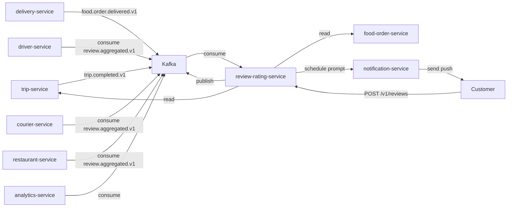
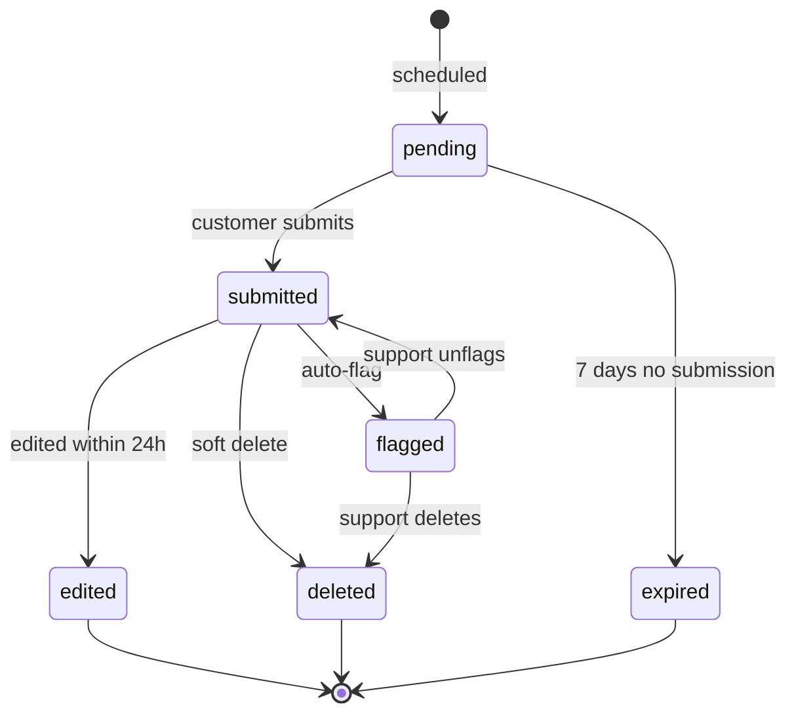

# Review and Rating Service — Software Requirements Specification

## 1. Introduction

This SRS specifies the behavior, performance, and operational
requirements of `review-rating-service`. It inherits the
platform-wide standards in `docs/architecture/API_STANDARDS.md`,
`docs/architecture/EVENT_ARCHITECTURE.md`, and
`docs/architecture/SECURITY_ARCHITECTURE.md`.

## 2. Scope

In scope:

- Review CRUD.
- Aggregated rating.
- Reply.
- Prompt scheduling.
- Event publication.

Out of scope:

- Trip / order persistence.
- Driver / courier / restaurant profile.
- Notification delivery.

## 3. System Context

## 4. Actors

- Customer (human).
- Driver / Courier (human).
- Restaurant staff (human).
- `trip-service` (system).
- `delivery-service` (system).
- `notification-service` (system).
- `support-service` (system).
- `analytics-service` (system; consumer of events).

## 5. Functional Requirements

| ID | Requirement | Priority |
|----|-------------|----------|
| FR--001 | The service MUST expose `POST /v1/reviews` to submit a review. | MUST |
| FR--002 | The service MUST reject a duplicate review for the same `(customer_id, source_event_id)`. | MUST |
| FR--003 | The service MUST expose `GET /v1/reviews/{id}` to read a review. | MUST |
| FR--004 | The service MUST expose `POST /v1/reviews/{id}/reply` for the subject to reply. | MUST |
| FR--005 | The service MUST support editing a review within 24h. | MUST |
| FR--006 | The service MUST support soft delete with reason. | MUST |
| FR--007 | The service MUST auto-flag a review with rating ≤ 2 and a keyword match. | SHOULD |
| FR--008 | The service MUST schedule a review prompt 24h after `trip.completed.v1` / `food.order.delivered.v1`. | MUST |
| FR--009 | The service MUST NOT schedule a prompt if a review is already submitted. | MUST |
| FR--010 | The service MUST compute aggregated ratings with a rolling window. | MUST |
| FR--011 | The service MUST emit `review.submitted.v1` on every successful submission. | MUST |
| FR--012 | The service MUST emit `review.aggregated.v1` on every aggregation update. | MUST |
| FR--013 | The service MUST rate-limit review submissions per customer. | MUST |
| FR--014 | The service MUST keep the full review history for at least 7 years. | MUST |
| FR--015 | The service MUST support per-tenant configuration. | MUST |
| FR--016 | The service MUST support tags (e.g. `clean_car`, `rude_driver`). | SHOULD |
| FR--017 | The service MUST support a "no-rating" review (comment only). | SHOULD |
| FR--018 | The service MUST validate the subject type (`driver` / `courier` / `restaurant`). | MUST |
| FR--019 | The service MUST validate the source type (`trip` / `order`). | MUST |
| FR--020 | The service MUST persist every change in `review.audit_log` with `actor_id` and `reason`. | MUST |
| FR--021 | The service MUST expose `GET /v1/zones/{zone_id}/driver-rating?window_minutes=15` (default 15, min 5, max 60) returning the zone-level driver `avg_rating` and `review_count` for the rolling window, and MUST emit `review.zone_aggregated.v1` (debounced) on every recompute. | MUST |

## 6. Non-Functional Requirements

| ID | Category | Requirement | Target |
|----|----------|-------------|--------|
| NFR--001 | performance | P99 read latency | < 200ms |
| NFR--002 | performance | P99 submit latency | < 300ms |
| NFR--003 | availability | uptime | 99.5% over 30d |
| NFR--004 | scalability | concurrent submits per pod | 500 |
| NFR--005 | durability | zero data loss on regional outage | RPO 5m, RTO 30m |
| NFR--006 | observability | 100% requests have trace and log | enforced in CI |
| NFR--007 | auditability | 100% writes attributed | enforced in DB |
| NFR--008 | freshness | median prompt timing | within 24h ± 30m |
| NFR--009 | aggregation accuracy | rolled-back reviews excluded | reconciliation job |

## 7. API Requirements

- Versioned URIs.
- Bearer JWT.
- `Idempotency-Key` for non-idempotent writes.
- Errors in the standard envelope.
- OpenAPI 3.1 at `/openapi.json`.

## 8. Data Requirements

| ID | Requirement | Notes |
|----|-------------|-------|
| DATA--001 | Primary keys UUIDv7. | |
| DATA--002 | UNIQUE on `(customer_id, source_event_id)`. | One review per source. |
| DATA--003 | Cross-service references are UUID columns without DB FKs. | Rule |
| DATA--004 | Time is RFC3339 UTC. | |
| DATA--005 | `aggregations` partitioned by month. | Retention. |

## 9. Validation Rules

- A `rating` MUST be 1-5.
- A `comment` MUST be 0-1000 characters.
- A `subject_type` MUST be one of `driver`, `courier`, `restaurant`.
- A `source_type` MUST be one of `trip`, `order`.
- A `reply` MUST be 0-500 characters.
- A `tags` array MUST have 0-5 elements.

## 10. State Transitions

## 11. Authorization Requirements

- `review.submit` for submit.
- `review.read` for read.
- `review.reply` for reply (subject only).
- `review.admin` for soft delete / moderation.

## 12. Configuration Requirements

- `PROMPT_DELAY_HOURS` (env; default 24).
- `AGGREGATION_WINDOW_DAYS` (env; default 90).
- `EDIT_WINDOW_HOURS` (env; default 24).
- `RATE_LIMIT_PER_HOUR` (env; default 5).

## 13. Error Handling

| Error | Response |
|-------|----------|
| Duplicate review | 409 `REVIEW_ALREADY_SUBMITTED` |
| Subject invalid | 422 `SUBJECT_INVALID` |
| Source invalid | 422 `SOURCE_INVALID` |
| Edit window expired | 409 `EDIT_WINDOW_EXPIRED` |
| Rate limited | 429 `RATE_LIMITED` |
| Idempotency-Key reuse | 422 `IDEMPOTENCY_KEY_REUSED` |

## 14. Concurrency Requirements

- A submit is serialized at the row level on
  `(customer_id, source_event_id)`.

## 15. Idempotency Requirements

- `POST /v1/reviews` requires `Idempotency-Key`.
- The service stores the key in `review.idempotency` for 24 hours.

## 16. Performance

- Dominant path: `POST /v1/reviews`.
- P50/P95/P99: 30ms / 100ms / 300ms.

## 17. Scalability

- Horizontal scaling: HPA on CPU and submit RPS.
- Vertical scaling: 2 vCPU / 4 GiB production.

## 18. Availability

- SLO: 99.5% over 30 days.
- Error budget: ~3h 36m per 30 days.
- Maintenance window: Sundays 04:00–06:00 UTC.

## 19. Security

| ID | Requirement | Notes |
|----|-------------|-------|
| SEC--001 | All requests JWT-validated. | Standard |
| SEC--002 | Review text treated as `confidential`. | Column-level encryption. |
| SEC--003 | Reply access limited to the subject. | Resource-level check. |
| SEC--004 | Rate-limit per customer. | Defense in depth. |
| SEC--005 | DB user has rights only on the `review` schema. | Least privilege. |
| SEC--006 | Soft delete requires `X-Audit-Reason`. | Audit. |
| SEC--007 | Auto-flagged reviews are hidden from the subject until support unflags. | |

## 20. Privacy

- PII stored: customer UUID; review text may contain PII.
- Retention: 7 years for reviews.
- Erasure: tenant offboarding anonymizes review text; ratings
  remain (as numbers).

## 21. Auditability

- Every write emits an event AND a row in `review.audit_log`.

## 22. Observability

- Logs: JSON to stdout; standard fields + `review_id`,
  `subject_type`, `subject_id`, `rating`, `result`.
- Metrics:
  - `http_requests_total{route, method, status}` (RED)
  - `http_request_duration_seconds{route, method, status}` (RED)
  - `review_submitted_total{subject_type}`
  - `review_aggregated_total{subject_type}`
  - `review_prompt_timing_seconds`
  - `review_aggregated_value{subject_type, subject_id}`
- Traces: OpenTelemetry.
- Alerts:
  - SLO burn rate.
  - Prompt timing > 24h ± 30m.
  - Aggregation drift.

## 23. Maintainability

- Code style: TypeScript ESLint config.
- Test coverage: ≥ 85% on handlers, ≥ 95% on the aggregation engine.
- Documentation: this folder; OpenAPI 3.1 at `/openapi.json`.

## 24. Disaster Recovery

- RPO: 5 minutes.
- RTO: 30 minutes.

## 25. Acceptance Criteria

- 99.5% read availability for 30 days in production.
- A customer can submit a review within 60 seconds of the prompt.
- A driver / courier / restaurant can reply to a review.
- An aggregated rating reflects the last 90 days.
- A duplicate submission is rejected.
- A soft-deleted review is excluded from aggregation.

---

## See also

### Sibling docs for this service

- [`README.md`](./README.md) — purpose, bounded context, responsibilities
- [`BRD.md`](./BRD.md) — business requirements
- [`SRS.md`](./SRS.md) — functional + non-functional requirements
- [`ERD.md`](./ERD.md) — data model (entities, relationships)
- [`INTEGRATION.md`](./INTEGRATION.md) — inter-service contracts (APIs, events, sagas)
- [`WORKFLOWS.md`](./WORKFLOWS.md) — operational workflows (happy paths, failure modes)
- [`TECH.md`](./TECH.md) — technology profile (runtime, libraries, data layer, admin endpoints, RBAC)

### Platform-wide

- [`../../shared/README.md`](../../shared/README.md) — `platform-spring-boot-starter` shared library (the single source of cross-cutting code for all Spring Boot services in the platform)
- [`../RECOMMENDATIONS.md`](../RECOMMENDATIONS.md) — platform-wide technology map (language, framework, version baseline, admin/RBAC pattern)
- [`../../README.md`](../../README.md) — services overview (the catalog of all 58 services)
- [`../../../main.md`](../../../main.md) — top-level platform specification (architecture, Keycloak, PostgreSQL 18, messaging, observability baseline)

