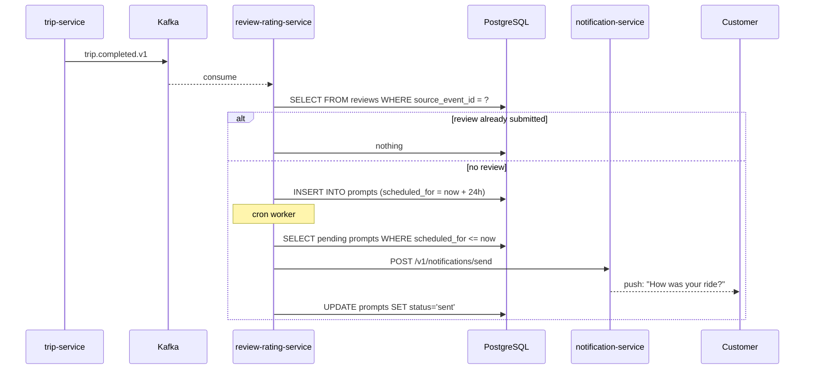
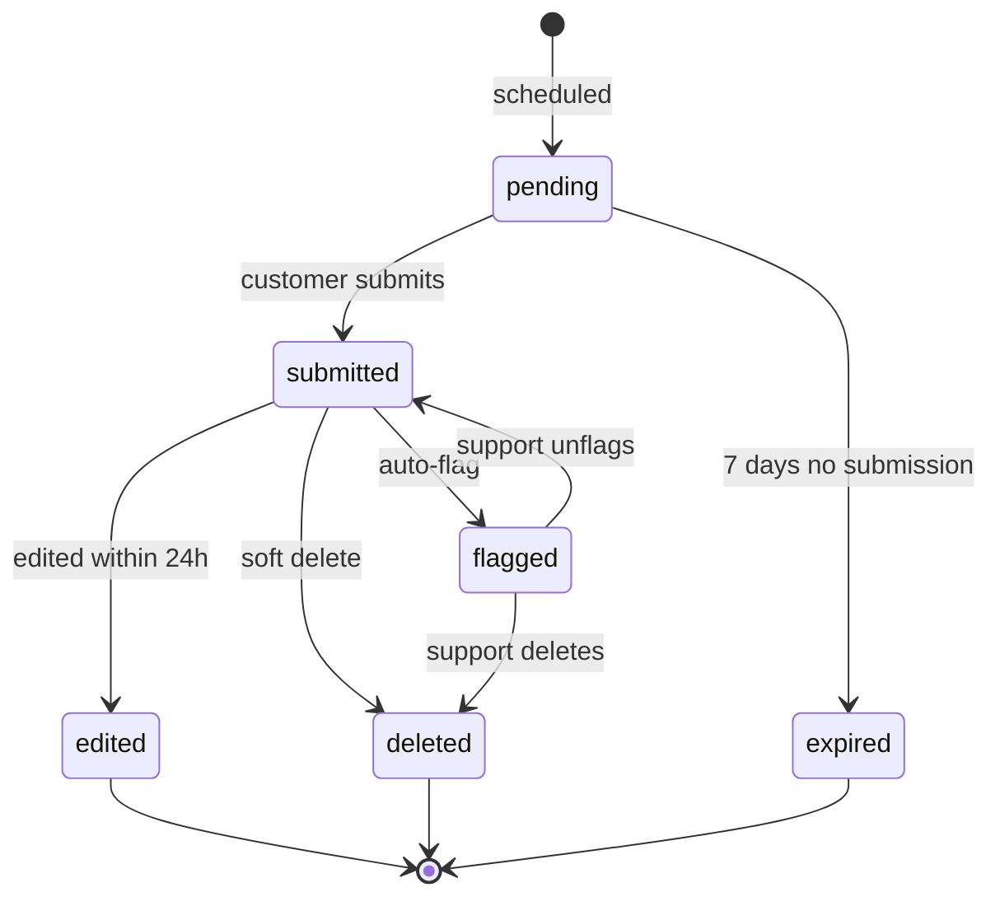
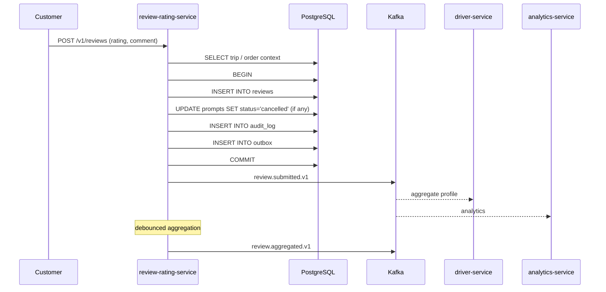
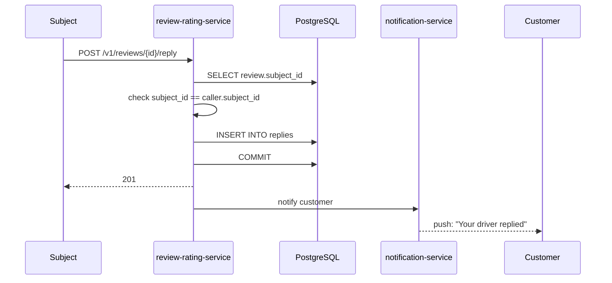
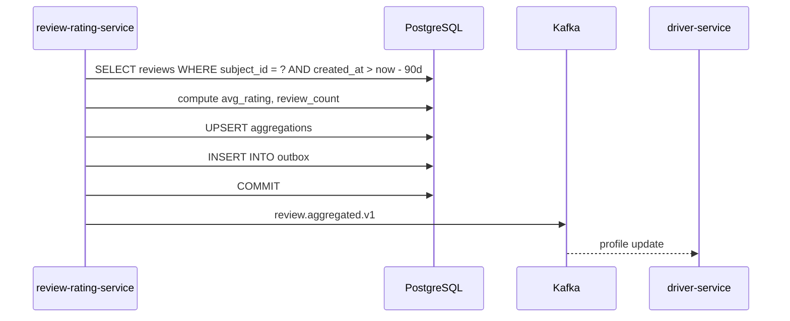

# Review and Rating Service — Workflows

## 1. Schedule Prompt on Trip Completion

### 1.1 Objective

Schedule a review prompt 24h after a trip is completed, only if no
review is already submitted.

### 1.2 Initiating Actor

`trip-service` (system) emitting `trip.completed.v1`.

### 1.3 Participating Services

- `trip-service` (producer)
- Kafka
- `review-rating-service` (this service)
- `notification-service` (sends the prompt)

### 1.4 Prerequisites

- The trip is completed.
- The customer is not suspended.

### 1.5 Happy Path



State machine for a `Review`:



### 1.6 Alternate Paths

- **Review already submitted**: no prompt scheduled.
- **Customer suspended**: prompt suppressed.
- **Notification service unreachable**: prompt is retried; the
  worker is idempotent on `(customer_id, source_event_id)`.

### 1.7 Failure Paths

| Failure | Handling |
|---------|----------|
| `trip-service` event delayed | reconciliation job |
| Notification service unreachable | retry with backoff; DLQ after 3 attempts |
| Cron worker fails | retry next tick; alert on lag |

### 1.8 Business Rules

- A prompt is sent only if no review is submitted.
- A prompt is sent 24h after completion.
- A prompt can be cancelled by a subsequent review submission.

### 1.9 State Transitions

The prompt moves from `pending` → `sent` (on notification) or
`cancelled` (on review submitted before 24h) or `expired` (on 7
days no submission).

### 1.10 Events

| Event | Direction | When |
|-------|-----------|------|
| `trip.completed.v1` | consumed | schedule prompt |
| `review.submitted.v1` | consumed (via inbox on `customer.suspended.v1` not applicable) | cancel prompt |

### 1.11 APIs Involved

| API | Direction | When |
|-----|-----------|------|
| `POST /v1/notifications/send` | outbound | send prompt |

### 1.12 Compensation / Rollback

If a review is submitted before the prompt is sent, the prompt is
cancelled (`status='cancelled', cancelled_reason='review_submitted'`).

### 1.13 Final State

The prompt is `sent`; the customer sees the prompt in the app.

## 2. Customer Submits a Review

### 2.1 Objective

A customer submits a review for a completed trip or order.

### 2.2 Initiating Actor

Customer (mobile / web).

### 2.3 Participating Services

- `review-rating-service` (this service)
- `trip-service` (read) / `food-order-service` (read)
- `driver-service` / `courier-service` / `restaurant-service`
  (consumers of `review.submitted.v1`)

### 2.4 Prerequisites

- The customer has a valid JWT.
- The trip / order is completed (validated via API).
- The customer is the same as the source's customer.

### 2.5 Happy Path



### 2.6 Alternate Paths

- **Duplicate submission**: 409 `REVIEW_ALREADY_SUBMITTED`.
- **Auto-flag**: rating ≤ 2 and a keyword match → `flagged=true`,
  hidden from the subject until support unflags.

### 2.7 Failure Paths

| Failure | Handling |
|---------|----------|
| Trip not completed | 422 `TRIP_NOT_COMPLETED` |
| Order not delivered | 422 `ORDER_NOT_DELIVERED` |
| Customer mismatch | 403 `FORBIDDEN` |
| Rate limited | 429 `RATE_LIMITED` |
| Outbox poller fails | retry with backoff; DLQ after 3 attempts |

### 2.8 Business Rules

- A customer may submit at most one review per trip / order.
- A review's rating MUST be 1-5.
- A review is editable for 24h.
- A soft-deleted review is excluded from aggregation.

### 2.9 State Transitions

`pending` → `submitted`; then optionally `edited` (within 24h) or
`flagged` (auto-flag) or `deleted` (soft delete).

### 2.10 Events

| Event | Direction | When |
|-------|-----------|------|
| `review.submitted.v1` | produced | submit |
| `review.aggregated.v1` | produced | aggregation update |

### 2.11 APIs Involved

| API | Direction | When |
|-----|-----------|------|
| `POST /v1/reviews` | inbound | submit |
| `GET /v1/trips/{id}` | outbound | trip context |

### 2.12 Compensation / Rollback

A review can be soft-deleted by an admin; the aggregation is
recomputed.

### 2.13 Final State

The review is in `reviews`; the prompt is cancelled; the events
are published; the aggregation is updated.

## 3. Driver / Courier / Restaurant Replies

### 3.1 Objective

The subject of a review replies publicly.

### 3.2 Initiating Actor

Driver / Courier / Restaurant (human).

### 3.3 Participating Services

- `review-rating-service`
- `notification-service` (notify the customer)

### 3.4 Prerequisites

- The caller is the subject of the review.
- The reply text is ≤ 500 characters.

### 3.5 Happy Path



### 3.6 Alternate Paths

- **Reply already exists**: 409 `REPLY_ALREADY_EXISTS`.

### 3.7 Failure Paths

| Failure | Handling |
|---------|----------|
| Subject mismatch | 403 `FORBIDDEN` |
| Reply exists | 409 `REPLY_ALREADY_EXISTS` |

### 3.8 Business Rules

- A reply is limited to 500 characters.
- A reply is one per review.

### 3.9 State Transitions

n/a (the reply is a separate row).

### 3.10 Events

n/a (no event for reply; the customer is notified directly).

### 3.11 APIs Involved

| API | Direction | When |
|-----|-----------|------|
| `POST /v1/reviews/{id}/reply` | inbound | reply |

### 3.12 Compensation / Rollback

A reply can be deleted by an admin; the customer is notified of the
removal.

### 3.13 Final State

The reply is in `replies`; the customer is notified.

## 4. Aggregated Rating Update

### 4.1 Objective

When a review is submitted (or soft-deleted), the aggregated rating
for the subject is updated and `review.aggregated.v1` is emitted.

### 4.2 Initiating Actor

The review-rating-service itself, on every `review.submitted.v1`
(debounced).

### 4.3 Participating Services

- `review-rating-service`
- `driver-service` / `courier-service` / `restaurant-service`
  (consumers)

### 4.4 Prerequisites

- A review is submitted / soft-deleted.

### 4.5 Happy Path



### 4.6 Alternate Paths

- **Soft delete**: a new aggregation is computed without the
  deleted review; the `review_count` decreases.

### 4.7 Failure Paths

| Failure | Handling |
|---------|----------|
| Reconciliation drift | hourly job recomputes; alert |

### 4.8 Business Rules

- The aggregation is the rolling average of the last 90 days.
- A soft-deleted review is excluded.

### 4.9 State Transitions

The aggregation is upserted; the previous row is replaced.

### 4.10 Events

| Event | Direction | When |
|-------|-----------|------|
| `review.aggregated.v1` | produced | update |

### 4.11 APIs Involved

| API | Direction | When |
|-----|-----------|------|
| `GET /v1/drivers/{id}/rating` | inbound | read |

### 4.12 Compensation / Rollback

A recompute job rebuilds the aggregation from `reviews`.

### 4.13 Final State

The aggregation is fresh; the event is published; the consumer
profile reflects the new rating within 5 seconds.

## 99. `Monthly` Partition Maintenance`

### 99.1 Objective

Idempotently pre-create the next 12 month child partitions for `review.aggregations` + `review.audit_log` so an INSERT at any time lands in an existing child. The drop half is handled by the per-service retention job.

### 99.2 Initiating Actor

A scheduled job runs daily at `02:00 UTC`. Leader-elected via `pg_try_advisory_xact_lock(hashtext('review.partition'), hashtext('monthly'))`.

### 99.3 Happy Path

```mermaid
sequenceDiagram
    participant JOB as Partition job
    participant PG as PostgreSQL
    JOB->>PG: pg_try_advisory_xact_lock('review.monthly')
    alt lock acquired
        loop for each missing month in next 12
            JOB->>PG: CREATE TABLE IF NOT EXISTS review.table_month PARTITION OF review.table
            JOB->>PG: verify (pg_inherits, relpartbound)
        end
        JOB->>PG: assert now() in existing child
    else lock NOT acquired
        Note over JOB: another instance is running; exit cleanly
    end
```

### 99.4 Failure Paths

| Failure | Handling |
|---------|----------|
| Lock contention | exit 0 |
| DDL fails | retry 3× with backoff (1 s / 4 s / 16 s); page on-call |
| Today's child missing | critical alert; INSERTs would fail |

### 99.5 Business Rules

- Pre-create 12 complete future months.
- Every child is created with `CREATE TABLE IF NOT EXISTS … PARTITION OF …` so the job is safe to run twice in the same window.
- A verification step (`pg_inherits` parent + `relpartbound` range) runs after every `CREATE TABLE IF NOT EXISTS` because `IF NOT EXISTS` only guards the name, not the bounds.
- Optionally emit `audit.partition.maintained.v1` on success.

---

## See also

### Sibling docs for this service

- [`README.md`](./README.md) — purpose, bounded context, responsibilities
- [`BRD.md`](./BRD.md) — business requirements
- [`SRS.md`](./SRS.md) — functional + non-functional requirements
- [`ERD.md`](./ERD.md) — data model (entities, relationships)
- [`INTEGRATION.md`](./INTEGRATION.md) — inter-service contracts (APIs, events, sagas)
- [`WORKFLOWS.md`](./WORKFLOWS.md) — operational workflows (happy paths, failure modes)
- [`TECH.md`](./TECH.md) — technology profile (runtime, libraries, data layer, admin endpoints, RBAC)

### Platform-wide

- [`../../shared/README.md`](../../shared/README.md) — `platform-spring-boot-starter` shared library (the single source of cross-cutting code for all Spring Boot services in the platform)
- [`../RECOMMENDATIONS.md`](../RECOMMENDATIONS.md) — platform-wide technology map (language, framework, version baseline, admin/RBAC pattern)
- [`../../README.md`](../../README.md) — services overview (the catalog of all 58 services)
- [`../../../main.md`](../../../main.md) — top-level platform specification (architecture, Keycloak, PostgreSQL 18, messaging, observability baseline)

