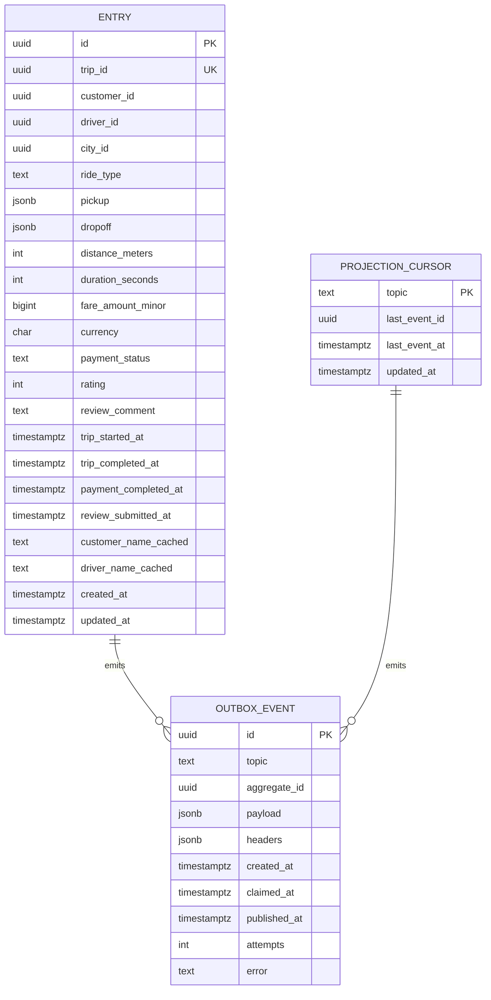

# ride-history-service — Entity-Relationship Diagram

## 1. Database

- Engine: PostgreSQL 18
- Schema: `ride_history` (owned exclusively by this service).
- Migrations: `services/ride-history-service/migrations/`.
- Partitioning: yes — `ride_history.entries` is
  range-partitioned by `trip_completed_at` (year).

## 2. Cross-Service References

| Column | Type | Refers to | Source of truth |
|--------|------|-----------|------------------|
| `entries.trip_id` | UUID (UNIQUE) | `trip` in `trip-service` | `trip-service` |
| `entries.customer_id` | UUID | `customer` in `customer-service` | `customer-service` |
| `entries.driver_id` | UUID | `driver` in `driver-service` | `driver-service` |
| `entries.payment_intent_id` | UUID (nullable) | `payment_intent` in `payment-service` | `payment-service` |
| `entries.review_id` | UUID (nullable) | `review` in `review-rating-service` | `review-rating-service` |

## 3. Entities

### `Entry`

The denormalised ride history entry. One row per trip.

#### Columns

| Column | Type | Constraints | Notes |
|--------|------|-------------|-------|
| `id` | UUID | PK | UUIDv7 |
| `trip_id` | UUID | NOT NULL, UNIQUE | one entry per trip |
| `customer_id` | UUID | NOT NULL | |
| `driver_id` | UUID | NOT NULL | |
| `city_id` | UUID | NOT NULL | |
| `ride_type` | TEXT | NOT NULL | |
| `pickup` | JSONB | NOT NULL | `{lat, lon, address, place_id}` |
| `dropoff` | JSONB | NOT NULL | same shape |
| `distance_meters` | INT | NOT NULL | |
| `duration_seconds` | INT | NOT NULL | |
| `fare_amount_minor` | BIGINT | NULL | set on `ride.payment.completed.v1` |
| `currency` | CHAR(3) | NULL | ISO 4217 |
| `payment_status` | TEXT | NOT NULL, CHECK (payment_status IN ('pending','paid','failed','refunded')) | |
| `rating` | INT | NULL, CHECK (rating IS NULL OR rating BETWEEN 1 AND 5) | set on `review.submitted.v1` |
| `review_comment` | TEXT | NULL | |
| `trip_started_at` | TIMESTAMPTZ | NOT NULL | |
| `trip_completed_at` | TIMESTAMPTZ | NOT NULL | |
| `payment_completed_at` | TIMESTAMPTZ | NULL | |
| `review_submitted_at` | TIMESTAMPTZ | NULL | |
| `customer_name_cached` | TEXT | NULL | cached; refreshed on demand |
| `driver_name_cached` | TEXT | NULL | cached; refreshed on demand |
| `created_at` | TIMESTAMPTZ | NOT NULL DEFAULT now() | |
| `updated_at` | TIMESTAMPTZ | NOT NULL DEFAULT now() | |

#### Indexes

- PK on `id`
- UNIQUE on `trip_id`
- `idx_entry_customer_completed` on `(customer_id, trip_completed_at DESC)`
  — supports the customer's "my trips" list.
- `idx_entry_driver_completed` on `(driver_id, trip_completed_at DESC)`
  — supports the driver's "my trips" list.
- `idx_entry_completed` on `(trip_completed_at DESC)` — supports
  admin's "all trips" list.
- `idx_entry_payment_status` on `(payment_status)` — supports
  dashboards.

#### Constraints

- `CHECK (payment_status IN ('pending','paid','failed','refunded'))`
- `CHECK (rating IS NULL OR rating BETWEEN 1 AND 5)`

#### Partitioning

RANGE by `trip_completed_at` (year). Pre-create 2 years ahead.
Drop partitions older than 7 years.

### `ProjectionCursor`

A small table that tracks the last projected event id per topic.
Used for the projection lag dashboard.

#### Columns

| Column | Type | Constraints | Notes |
|--------|------|-------------|-------|
| `topic` | TEXT | PK | e.g. `trip.completed` |
| `last_event_id` | UUID | NOT NULL | |
| `last_event_at` | TIMESTAMPTZ | NOT NULL | |
| `updated_at` | TIMESTAMPTZ | NOT NULL DEFAULT now() | |

### `OutboxEvent`

#### Columns

| Column | Type | Constraints | Notes |
|--------|------|-------------|-------|
| `id` | UUID | PK | UUIDv7 |
| `topic` | TEXT | NOT NULL | |
| `aggregate_id` | UUID | NOT NULL | partition key = `trip_id` |
| `payload` | JSONB | NOT NULL | |
| `headers` | JSONB | NOT NULL DEFAULT '{}'::jsonb | |
| `created_at` | TIMESTAMPTZ | NOT NULL DEFAULT now() | |
| `claimed_at` | TIMESTAMPTZ | NULL | |
| `published_at` | TIMESTAMPTZ | NULL | |
| `attempts` | INT | NOT NULL DEFAULT 0 | |
| `error` | TEXT | NULL | |

## 4. Mermaid ER Diagram



## 5. DDL Sketch

```sql
CREATE SCHEMA IF NOT EXISTS ride_history;
SET search_path TO ride_history;

CREATE TABLE ride_history.entries (
    id UUID NOT NULL,
    trip_id UUID NOT NULL UNIQUE,
    customer_id UUID NOT NULL,
    driver_id UUID NOT NULL,
    city_id UUID NOT NULL,
    ride_type TEXT NOT NULL,
    pickup JSONB NOT NULL,
    dropoff JSONB NOT NULL,
    distance_meters INT NOT NULL,
    duration_seconds INT NOT NULL,
    fare_amount_minor BIGINT,
    currency CHAR(3),
    payment_status TEXT NOT NULL,
    rating INT,
    review_comment TEXT,
    trip_started_at TIMESTAMPTZ NOT NULL,
    trip_completed_at TIMESTAMPTZ NOT NULL,
    payment_completed_at TIMESTAMPTZ,
    review_submitted_at TIMESTAMPTZ,
    customer_name_cached TEXT,
    driver_name_cached TEXT,
    created_at TIMESTAMPTZ NOT NULL DEFAULT now(),
    updated_at TIMESTAMPTZ NOT NULL DEFAULT now(),
    PRIMARY KEY (id, trip_completed_at),
    CONSTRAINT chk_entry_payment_status CHECK (payment_status IN
        ('pending','paid','failed','refunded')),
    CONSTRAINT chk_entry_rating CHECK (rating IS NULL OR rating BETWEEN 1 AND 5)
) PARTITION BY RANGE (trip_completed_at);
CREATE INDEX idx_entry_customer_completed
    ON ride_history.entries (customer_id, trip_completed_at DESC);
CREATE INDEX idx_entry_driver_completed
    ON ride_history.entries (driver_id, trip_completed_at DESC);
CREATE INDEX idx_entry_completed
    ON ride_history.entries (trip_completed_at DESC);
CREATE INDEX idx_entry_payment_status
    ON ride_history.entries (payment_status);

CREATE TABLE ride_history.projection_cursors (
    topic TEXT PRIMARY KEY,
    last_event_id UUID NOT NULL,
    last_event_at TIMESTAMPTZ NOT NULL,
    updated_at TIMESTAMPTZ NOT NULL DEFAULT now()
);

CREATE TABLE ride_history.outbox (
    id UUID PRIMARY KEY,
    topic TEXT NOT NULL,
    aggregate_id UUID NOT NULL,
    payload JSONB NOT NULL,
    headers JSONB NOT NULL DEFAULT '{}'::jsonb,
    created_at TIMESTAMPTZ NOT NULL DEFAULT now(),
    claimed_at TIMESTAMPTZ,
    published_at TIMESTAMPTZ,
    attempts INT NOT NULL DEFAULT 0,
    error TEXT
);
CREATE INDEX idx_outbox_pending
    ON ride_history.outbox (created_at)
    WHERE published_at IS NULL;
```

## 6. Audit Columns

`entries` has `created_at`, `updated_at`. The entries are
upserted; no soft delete.

## 7. Soft Delete

Not used. The entry is the read model; if the trip is deleted
upstream, the entry is deleted here too (via a separate
reconciliation, not in this service).

## 8. JSONB Usage

- `entries.pickup`, `entries.dropoff`: geocoded address + lat/lon
  + provider's place_id.
- `outbox.payload`: full event envelope.

## 9. Partitioning

| Table | Strategy | Retention |
|-------|----------|-----------|
| `entries` | RANGE by `trip_completed_at` (year) | 7 years |

The partition maintenance job:

- Pre-creates the next 2 complete future years.
- Drops partitions older than 7 years.
- Uses the canonical idempotent pattern from
  [`DATABASE_ARCHITECTURE.md` §"Table Partitioning — Canonical
  Template"](../../architecture/DATABASE_ARCHITECTURE.md) §5:

  ```sql
  CREATE TABLE IF NOT EXISTS ride_history.entries_2027
      PARTITION OF ride_history.entries
      FOR VALUES FROM ('2027-01-01 00:00:00+00') TO ('2028-01-01 00:00:00+00');

  -- Verify the child is attached to the correct parent with the
  -- expected bounds (IF NOT EXISTS only guards the name).
  DO $$
  DECLARE
      v_parent REGCLASS := 'ride_history.entries'::REGCLASS;
      v_child  REGCLASS := 'ride_history.entries_2027'::REGCLASS;
  BEGIN
      IF (SELECT inhparent FROM pg_inherits WHERE inhrelid = v_child)
         IS DISTINCT FROM v_parent THEN
          RAISE EXCEPTION 'partition % not attached to %',
              v_child::text, v_parent::text;
      END IF;
  END $$;
  ```

- Maintenance owner: this service; scheduled job runs daily at
  `02:00 UTC` (see WORKFLOWS §"Yearly Partition Maintenance").
- Leader-elected via
  `pg_try_advisory_xact_lock(hashtext('ride_history.partition'),
  hashtext('yearly'))`.

## 10. Data Retention

| Table | Retention | Purged by |
|-------|-----------|-----------|
| `entries` | 7 years | partition drop |
| `projection_cursors` | forever (small) | n/a |
| `outbox` | 24h after publish | poller purge |

## 11. Migration Considerations

- The `entries` table is partitioned; any new index must be
  created on the parent.
- Adding a new column (e.g. a new payment field) is online.
- The UNIQUE on `trip_id` is the second line of defense against
  duplicate projection; the inbox dedup is the first.

---

## See also

### Sibling docs for this service

- [`README.md`](./README.md) — purpose, bounded context, responsibilities
- [`BRD.md`](./BRD.md) — business requirements
- [`SRS.md`](./SRS.md) — functional + non-functional requirements
- [`ERD.md`](./ERD.md) — data model (entities, relationships)
- [`INTEGRATION.md`](./INTEGRATION.md) — inter-service contracts (APIs, events, sagas)
- [`WORKFLOWS.md`](./WORKFLOWS.md) — operational workflows (happy paths, failure modes)
- [`TECH.md`](./TECH.md) — technology profile (runtime, libraries, data layer, admin endpoints, RBAC)

### Platform-wide

- [`../../shared/README.md`](../../shared/README.md) — `platform-spring-boot-starter` shared library (the single source of cross-cutting code for all Spring Boot services in the platform)
- [`../RECOMMENDATIONS.md`](../RECOMMENDATIONS.md) — platform-wide technology map (language, framework, version baseline, admin/RBAC pattern)
- [`../../README.md`](../../README.md) — services overview (the catalog of all 58 services)
- [`../../../main.md`](../../../main.md) — top-level platform specification (architecture, Keycloak, PostgreSQL 18, messaging, observability baseline)

