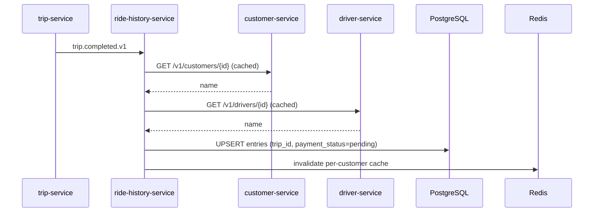
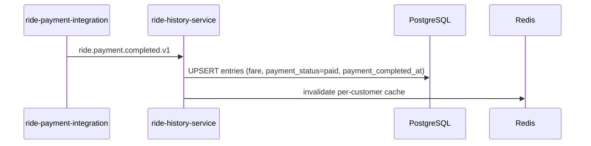
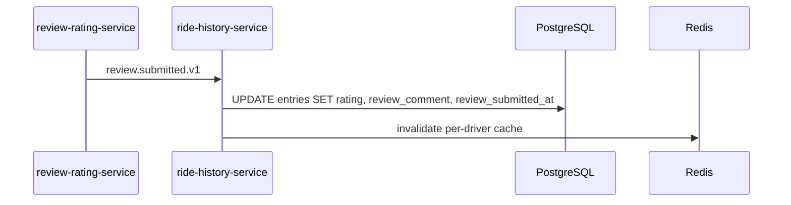
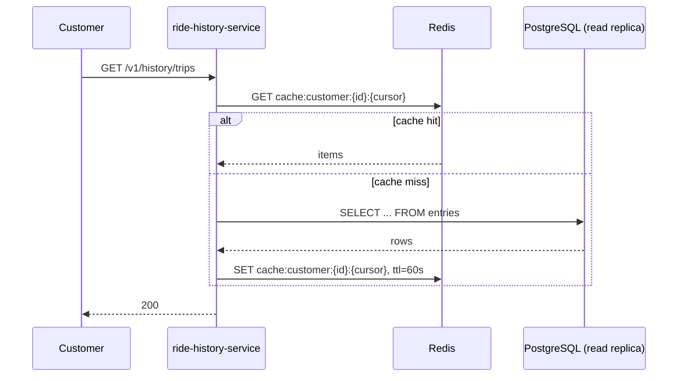

# ride-history-service — Workflows

## 1. Project trip.completed.v1

### 1.1 Objective

When a trip completes, project the entry into the read model with
`payment_status='pending'`.

### 1.2 Initiating Actor

`trip-service` emits `trip.completed.v1`.

### 1.3 Participating Services

- `trip-service` (event producer)
- `ride-history-service` (this service)
- `customer-service` (name, cached)
- `driver-service` (name, cached)

### 1.4 Prerequisites

- The trip is `completed` (per `trip-service`).
- The customer's name is in the cache (or `customer-service` is
  reachable).

### 1.5 Happy Path



### 1.6 Alternate Paths

- `customer-service` / `driver-service` down: use the cached name;
  if no cache, the entry has `customer_name_cached=null`; the
  read path falls back to the ID.
- Event duplicate: inbox dedup; UPSERT is a no-op.

### 1.7 Failure Paths

- DB down: retry; on persistent failure, page on-call.

### 1.8 Business Rules

- BR--010, BR--013.

### 1.9 State Transitions

N/A (the entry is upserted).

### 1.10 Events

| Event | Direction | When |
|-------|-----------|------|
| `trip.completed.v1` | consumed | trigger |

### 1.11 APIs Involved

| API | Direction | When |
|-----|-----------|------|
| `GET /v1/customers/{id}` | outbound | name |
| `GET /v1/drivers/{id}` | outbound | name |

### 1.12 Compensation / Rollback

N/A (idempotent UPSERT).

### 1.13 Final State

The entry exists with `payment_status='pending'`.

## 2. Project ride.payment.completed.v1

### 2.1 Objective

When the ride payment completes, update the entry with the fare
and `payment_status='paid'`.

### 2.2 Initiating Actor

`ride-payment-integration-service` emits
`ride.payment.completed.v1`.

### 2.3 Participating Services

- `ride-payment-integration-service` (event producer)
- `ride-history-service` (this service)

### 2.4 Prerequisites

- The trip's entry exists (or will be created by the
  `trip.completed.v1` handler — we upsert).

### 2.5 Happy Path



### 2.6 Alternate Paths

- The entry does not exist yet (the `trip.completed.v1` hasn't
  been processed): the UPSERT creates it with the payment info.
  This is unusual but safe.

### 2.7 Failure Paths

- DB down: retry.

### 2.8 Business Rules

- BR--011.

### 2.9 State Transitions

N/A.

### 2.10 Events

| Event | Direction | When |
|-------|-----------|------|
| `ride.payment.completed.v1` | consumed | trigger |

### 2.11 APIs Involved

None.

### 2.12 Compensation / Rollback

N/A.

### 2.13 Final State

The entry has `payment_status='paid'` and the fare.

## 3. Project review.submitted.v1

### 3.1 Objective

When a review is submitted, update the entry with the rating and
comment.

### 3.2 Initiating Actor

`review-rating-service` emits `review.submitted.v1`.

### 3.3 Participating Services

- `review-rating-service` (event producer)
- `ride-history-service` (this service)

### 3.4 Prerequisites

- The entry exists.

### 3.5 Happy Path



### 3.6 Alternate Paths

- The entry does not exist yet: insert with the review info.
- A second review is submitted (e.g. driver rates customer): we
  store the customer's rating only; the driver's view is via
  `review-rating-service`.

### 3.7 Failure Paths

- DB down: retry.

### 3.8 Business Rules

- BR--012.

### 3.9 State Transitions

N/A.

### 3.10 Events

| Event | Direction | When |
|-------|-----------|------|
| `review.submitted.v1` | consumed | trigger |

### 3.11 APIs Involved

None.

### 3.12 Compensation / Rollback

N/A.

### 3.13 Final State

The entry has the rating and comment.

## 4. Read "My Trips" (Customer)

### 4.1 Objective

Serve the customer's "my trips" list quickly.

### 4.2 Initiating Actor

The customer app.

### 4.3 Participating Services

- `ride-history-service` (this service)
- Redis (cache)

### 4.4 Prerequisites

- The customer is authenticated.

### 4.5 Happy Path



### 4.6 Alternate Paths

- Bad cursor: 400 `VALIDATION_FAILED`.

### 4.7 Failure Paths

- DB down: 503.
- Cache down: fall through to DB.

### 4.8 Business Rules

- BR--013.

### 4.9 State Transitions

N/A.

### 4.10 Events

None.

### 4.11 APIs Involved

| API | Direction | When |
|-----|-----------|------|
| `GET /v1/history/trips` | inbound | trigger |

### 4.12 Compensation / Rollback

N/A.

### 4.13 Final State

A paginated list of the customer's trips.


## 99. Read Model Sync State Machine

This state machine summarizes the service's internal
state transitions (across all workflows above).

```mermaid
stateDiagram-v2
    [*] --> Building: service starts; first build
    Building --> Live: initial sync complete
    Live --> Backfilling: rebuild / backfill in progress
    Backfilling --> Live: backfill complete
    Live --> Stale: consumer lag > threshold
    Stale --> Live: consumer catches up
    Live --> [*]
```



## 100. `Yearly Partition Maintenance`

### 100.1 Objective

Idempotently pre-create the next 2 yearly child partitions for
`ride_history.entries` so an INSERT at any time lands in an
existing child; drop children older than 7 years.

### 100.2 Initiating Actor

A scheduled job runs daily at `02:00 UTC`. Leader-elected via
`pg_try_advisory_xact_lock(hashtext('ride_history.partition'),
hashtext('yearly'))`.

### 100.3 Happy Path

```mermaid
sequenceDiagram
    participant JOB as Partition job
    participant PG as PostgreSQL
    JOB->>PG: pg_try_advisory_xact_lock('ride_history.yearly')
    alt lock acquired
        loop for each missing year in next 2
            JOB->>PG: CREATE TABLE IF NOT EXISTS ride_history.entries_YYYY PARTITION OF ride_history.entries
            JOB->>PG: verify (pg_inherits, relpartbound)
        end
        loop for each year older than 7 years
            JOB->>PG: archive (S3)
            JOB->>PG: DETACH PARTITION … CONCURRENTLY
            JOB->>PG: DROP TABLE ride_history.entries_YYYY
        end
    else lock NOT acquired
        Note over JOB: another instance is running; exit cleanly
    end
```

### 100.4 Failure Paths

| Failure | Handling |
|---------|----------|
| Lock contention | exit 0 |
| DDL fails | retry 3× with backoff; page on-call |
| Today's child missing | critical alert; INSERTs would fail |

### 100.5 Business Rules

- Pre-create 2 complete future years.
- Archive to S3 before drop (irreversible).
- Child created with `CREATE TABLE IF NOT EXISTS … PARTITION OF …`
  + verification step from
  [`DATABASE_ARCHITECTURE.md` §5](../../architecture/DATABASE_ARCHITECTURE.md).

---

## See also

### Sibling docs for this service

- [`README.md`](./README.md) — purpose, bounded context, responsibilities
- [`BRD.md`](./BRD.md) — business requirements
- [`SRS.md`](./SRS.md) — functional + non-functional requirements
- [`ERD.md`](./ERD.md) — data model (entities, relationships)
- [`INTEGRATION.md`](./INTEGRATION.md) — inter-service contracts (APIs, events, sagas)
- [`WORKFLOWS.md`](./WORKFLOWS.md) — operational workflows (happy paths, failure modes)
- [`TECH.md`](./TECH.md) — technology profile (runtime, libraries, data layer, admin endpoints, RBAC)

### Platform-wide

- [`../../shared/README.md`](../../shared/README.md) — `platform-spring-boot-starter` shared library (the single source of cross-cutting code for all Spring Boot services in the platform)
- [`../RECOMMENDATIONS.md`](../RECOMMENDATIONS.md) — platform-wide technology map (language, framework, version baseline, admin/RBAC pattern)
- [`../../README.md`](../../README.md) — services overview (the catalog of all 58 services)
- [`../../../main.md`](../../../main.md) — top-level platform specification (architecture, Keycloak, PostgreSQL 18, messaging, observability baseline)

