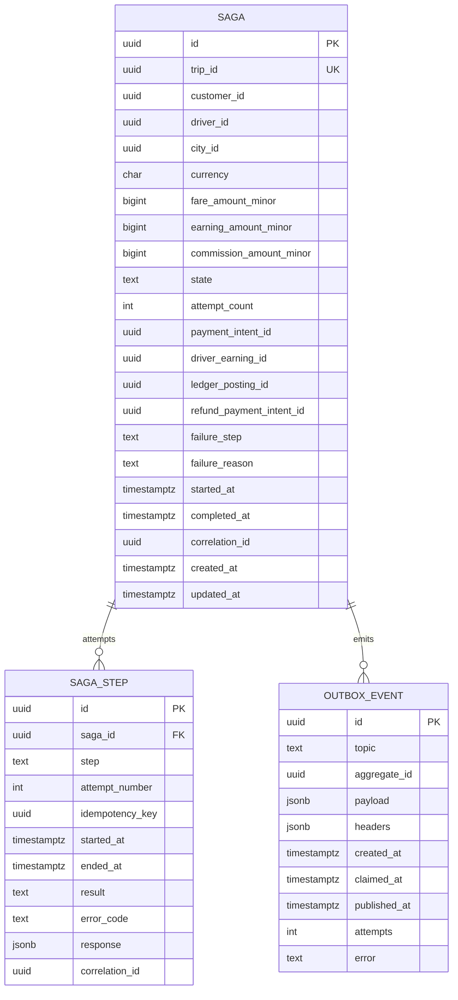

# ride-payment-integration-service — Entity-Relationship Diagram

## 1. Database

- Engine: PostgreSQL 18
- Schema: `ride_payment_integration` (owned exclusively by this
  service).
- Migrations: `services/ride-payment-integration-service/migrations/`.

## 2. Cross-Service References

| Column | Type | Refers to | Source of truth |
|--------|------|-----------|------------------|
| `sagas.trip_id` | UUID (UNIQUE) | `trip` in `trip-service` | `trip-service` |
| `sagas.customer_id` | UUID | `customer` in `customer-service` | `customer-service` |
| `sagas.driver_id` | UUID | `driver` in `driver-service` | `driver-service` |
| `sagas.payment_intent_id` | UUID (nullable) | `payment_intent` in `payment-service` | `payment-service` |
| `sagas.driver_earning_id` | UUID (nullable) | `earning` in `driver-earnings-service` | `driver-earnings-service` |
| `sagas.ledger_posting_id` | UUID (nullable) | `posting` in `ledger-service` | `ledger-service` |
| `sagas.refund_payment_intent_id` | UUID (nullable) | `payment_intent` in `payment-service` | `payment-service` |

## 3. Entities

### `Saga`

The ride payment saga. One row per trip.

#### Columns

| Column | Type | Constraints | Notes |
|--------|------|-------------|-------|
| `id` | UUID | PK | UUIDv7 |
| `trip_id` | UUID | NOT NULL, UNIQUE | one saga per trip |
| `customer_id` | UUID | NOT NULL | cross-service ref |
| `driver_id` | UUID | NOT NULL | cross-service ref |
| `city_id` | UUID | NOT NULL | |
| `currency` | CHAR(3) | NOT NULL | ISO 4217 |
| `fare_amount_minor` | BIGINT | NOT NULL | the trip's final fare |
| `earning_amount_minor` | BIGINT | NOT NULL | fare minus commission |
| `commission_amount_minor` | BIGINT | NOT NULL | platform commission |
| `state` | TEXT | NOT NULL, CHECK (state IN ('pending','capturing','captured','accruing','accrued','posting','posted','ledger_pending','completed','failed','compensated')) | state machine |
| `attempt_count` | INT | NOT NULL DEFAULT 0 | |
| `payment_intent_id` | UUID | NULL | set on capture |
| `driver_earning_id` | UUID | NULL | set on accrue |
| `ledger_posting_id` | UUID | NULL | set on post |
| `refund_payment_intent_id` | UUID | NULL | set on refund |
| `failure_step` | TEXT | NULL, CHECK (failure_step IS NULL OR failure_step IN ('capture','accrue','post','refund')) | which step failed |
| `failure_reason` | TEXT | NULL | free text |
| `started_at` | TIMESTAMPTZ | NOT NULL DEFAULT now() | when saga started |
| `completed_at` | TIMESTAMPTZ | NULL | when `completed` or `failed` |
| `correlation_id` | UUID | NOT NULL | |
| `created_at` | TIMESTAMPTZ | NOT NULL DEFAULT now() | |
| `updated_at` | TIMESTAMPTZ | NOT NULL DEFAULT now() | |
| `created_by` | UUID | NOT NULL | system |
| `updated_by` | UUID | NOT NULL | |

#### Indexes

- PK on `id`
- UNIQUE on `trip_id`
- `idx_saga_state` on `(state)`
- `idx_saga_correlation` on `(correlation_id)`

#### Constraints

- `CHECK (state IN ('pending','capturing','captured','accruing','accrued','posting','posted','ledger_pending','completed','failed','compensated'))`
- `CHECK (failure_step IS NULL OR failure_step IN
  ('capture','accrue','post','refund'))`
- `CHECK (completed_at IS NULL OR state IN ('completed','failed','compensated'))`

### `SagaStep`

Audit trail of every step attempt.

#### Columns

| Column | Type | Constraints | Notes |
|--------|------|-------------|-------|
| `id` | UUID | PK | UUIDv7 |
| `saga_id` | UUID | NOT NULL | FK to `sagas.id` |
| `step` | TEXT | NOT NULL, CHECK (step IN ('capture','accrue','post','refund')) | |
| `attempt_number` | INT | NOT NULL | |
| `idempotency_key` | UUID | NOT NULL | |
| `started_at` | TIMESTAMPTZ | NOT NULL DEFAULT now() | |
| `ended_at` | TIMESTAMPTZ | NULL | |
| `result` | TEXT | NULL, CHECK (result IS NULL OR result IN ('success','failure','retry')) | |
| `error_code` | TEXT | NULL | |
| `response` | JSONB | NULL | the downstream response (sanitised) |
| `correlation_id` | UUID | NOT NULL | |

#### Indexes

- PK on `id`
- `idx_saga_step_saga` on `(saga_id, step, attempt_number)`

### `OutboxEvent`

#### Columns

| Column | Type | Constraints | Notes |
|--------|------|-------------|-------|
| `id` | UUID | PK | UUIDv7 |
| `topic` | TEXT | NOT NULL | |
| `aggregate_id` | UUID | NOT NULL | partition key = `saga_id` |
| `payload` | JSONB | NOT NULL | |
| `headers` | JSONB | NOT NULL DEFAULT '{}'::jsonb | |
| `created_at` | TIMESTAMPTZ | NOT NULL DEFAULT now() | |
| `claimed_at` | TIMESTAMPTZ | NULL | |
| `published_at` | TIMESTAMPTZ | NULL | |
| `attempts` | INT | NOT NULL DEFAULT 0 | |
| `error` | TEXT | NULL | |

## 4. Mermaid ER Diagram



## 5. DDL Sketch

```sql
CREATE SCHEMA IF NOT EXISTS ride_payment_integration;
SET search_path TO ride_payment_integration;

CREATE TABLE ride_payment_integration.sagas (
    id UUID PRIMARY KEY,
    trip_id UUID NOT NULL UNIQUE,
    customer_id UUID NOT NULL,
    driver_id UUID NOT NULL,
    city_id UUID NOT NULL,
    currency CHAR(3) NOT NULL,
    fare_amount_minor BIGINT NOT NULL,
    earning_amount_minor BIGINT NOT NULL,
    commission_amount_minor BIGINT NOT NULL,
    state TEXT NOT NULL,
    attempt_count INT NOT NULL DEFAULT 0,
    payment_intent_id UUID,
    driver_earning_id UUID,
    ledger_posting_id UUID,
    refund_payment_intent_id UUID,
    failure_step TEXT,
    failure_reason TEXT,
    started_at TIMESTAMPTZ NOT NULL DEFAULT now(),
    completed_at TIMESTAMPTZ,
    correlation_id UUID NOT NULL,
    created_at TIMESTAMPTZ NOT NULL DEFAULT now(),
    updated_at TIMESTAMPTZ NOT NULL DEFAULT now(),
    created_by UUID NOT NULL,
    updated_by UUID NOT NULL,
    CONSTRAINT chk_saga_state CHECK (state IN
        ('pending','capturing','captured','accruing','accrued','posting','posted','ledger_pending','completed','failed','compensated')),
    CONSTRAINT chk_saga_failure_step CHECK (
        failure_step IS NULL OR failure_step IN ('capture','accrue','post','refund')
    )
);
CREATE INDEX idx_saga_state ON ride_payment_integration.sagas (state);
CREATE INDEX idx_saga_correlation ON ride_payment_integration.sagas (correlation_id);

CREATE TABLE ride_payment_integration.saga_steps (
    id UUID NOT NULL,
    saga_id UUID NOT NULL REFERENCES ride_payment_integration.sagas(id),
    step TEXT NOT NULL,
    attempt_number INT NOT NULL,
    idempotency_key UUID NOT NULL,
    occurred_at TIMESTAMPTZ NOT NULL DEFAULT now(),
    started_at TIMESTAMPTZ NOT NULL DEFAULT now(),
    ended_at TIMESTAMPTZ,
    result TEXT,
    error_code TEXT,
    response JSONB,
    correlation_id UUID NOT NULL,
    PRIMARY KEY (id, occurred_at),
    CONSTRAINT chk_step_name CHECK (step IN ('capture','accrue','post','refund')),
    CONSTRAINT chk_step_result CHECK (
        result IS NULL OR result IN ('success','failure','retry')
    )
) PARTITION BY RANGE (occurred_at);
CREATE INDEX idx_saga_step_saga
    ON ride_payment_integration.saga_steps (saga_id, step, attempt_number);

CREATE TABLE IF NOT EXISTS ride_payment_integration.saga_steps_2026_08 PARTITION OF ride_payment_integration.saga_steps FOR VALUES FROM ('2026-08-01 00:00:00+00') TO ('2026-09-01 00:00:00+00');

CREATE TABLE ride_payment_integration.outbox (
    id UUID PRIMARY KEY,
    topic TEXT NOT NULL,
    aggregate_id UUID NOT NULL,
    payload JSONB NOT NULL,
    headers JSONB NOT NULL DEFAULT '{}'::jsonb,
    created_at TIMESTAMPTZ NOT NULL DEFAULT now(),
    claimed_at TIMESTAMPTZ,
    published_at TIMESTAMPTZ,
    attempts INT NOT NULL DEFAULT 0,
    error TEXT
);
CREATE INDEX idx_outbox_pending
    ON ride_payment_integration.outbox (created_at)
    WHERE published_at IS NULL;
```

## 6. Audit Columns

Every mutable table has `created_at`, `updated_at`, `created_by`,
`updated_by`. `saga_steps` is append-only.

## 7. Soft Delete

Not used. The state is the source of truth.

## 8. JSONB Usage

- `saga_steps.response`: the downstream response (sanitised; no
  PAN).
- `outbox.payload`: full event envelope.

## 9. Partitioning

| Table | Strategy | Cadence | Pre-create | Retention |
|-------|----------|---------|------------|-----------|
| `saga_steps` | RANGE on `occurred_at` | monthly | 12 months | 7 years (financial) |

> See [DATABASE_ARCHITECTURE.md §"Table Partitioning — Canonical Template"](../../architecture/DATABASE_ARCHITECTURE.md) for the idempotent CREATE TABLE IF NOT EXISTS … PARTITION OF … pattern, naming convention, and the service-owned maintenance-job contract.

## 10. Data Retention

| Table | Retention | Purged by |
|-------|-----------|-----------|
| `sagas` | 7 years | financial; append-only state transitions |
| `saga_steps` | 7 years | with the saga |
| `outbox` | 24h after publish | poller purge |

## 11. Migration Considerations

- The `state` CHECK is the source of truth for the saga machine;
  adding a new state requires a multi-step migration.
- The UNIQUE on `trip_id` enforces one saga per trip; relaxing it
  requires a new column and a migration plan.
- The `failure_step` CHECK is the source of truth for failure
  classification.

---

## See also

### Sibling docs for this service

- [`README.md`](./README.md) — purpose, bounded context, responsibilities
- [`BRD.md`](./BRD.md) — business requirements
- [`SRS.md`](./SRS.md) — functional + non-functional requirements
- [`ERD.md`](./ERD.md) — data model (entities, relationships)
- [`INTEGRATION.md`](./INTEGRATION.md) — inter-service contracts (APIs, events, sagas)
- [`WORKFLOWS.md`](./WORKFLOWS.md) — operational workflows (happy paths, failure modes)
- [`TECH.md`](./TECH.md) — technology profile (runtime, libraries, data layer, admin endpoints, RBAC)

### Platform-wide

- [`../../shared/README.md`](../../shared/README.md) — `platform-spring-boot-starter` shared library (the single source of cross-cutting code for all Spring Boot services in the platform)
- [`../RECOMMENDATIONS.md`](../RECOMMENDATIONS.md) — platform-wide technology map (language, framework, version baseline, admin/RBAC pattern)
- [`../../README.md`](../../README.md) — services overview (the catalog of all 58 services)
- [`../../../main.md`](../../../main.md) — top-level platform specification (architecture, Keycloak, PostgreSQL 18, messaging, observability baseline)

