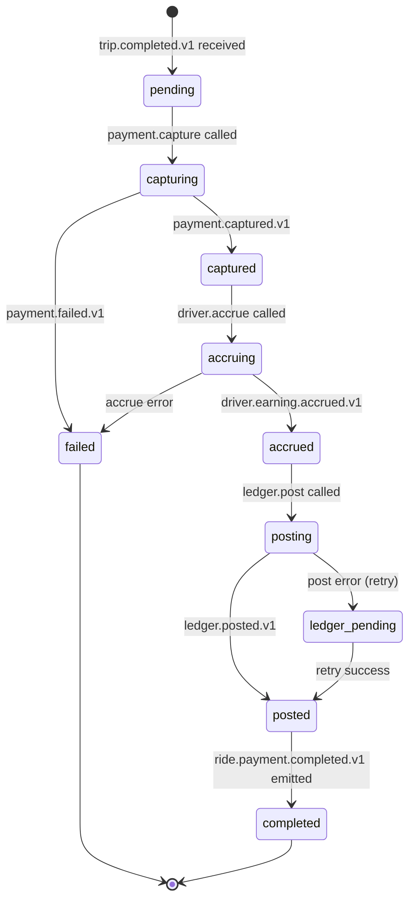

# ride-payment-integration-service — Software Requirements Specification

## 1. Introduction

This document specifies the requirements for
`ride-payment-integration-service`. The service is a saga
orchestrator; correctness, idempotency, and compensation are the
non-negotiables.

## 2. Scope

In scope:

- The ride payment saga state machine.
- The capture / accrue / post flow.
- Compensation.
- Idempotency.
- Emitting `ride.payment.completed.v1` and
  `ride.payment.failed.v1`.
- Admin retry.

Out of scope:

- The trip aggregate.
- Card capture mechanics.
- Driver earnings ledger.
- General ledger.

## 3. System Context

```mermaid
flowchart LR
    TR[trip-service] -. trip.completed.v1 .-> RPI[ride-payment-integration-service]
    PAY[payment-service] -. payment.captured.v1 / payment.failed.v1 .-> RPI
    RPI --> PAY
    RPI --> DE[driver-earnings-service]
    RPI --> LD[ledger-service]
    RPI -. ride.payment.completed.v1 / ride.payment.failed.v1 .-> K[(Kafka)]
    K --> NOT[notification-service]
    K --> SUP[support-service]
    K --> RH[ride-history-service]
    K --> AUD[audit-service]
```

## 4. Actors

- **`trip-service`** — system actor via events.
- **`payment-service`**, **`driver-earnings-service`**,
  **`ledger-service`** — system actors via REST and events.
- **Admin / support** — read sagas; force-retry.

## 5. Functional Requirements

| ID | Requirement | Priority |
|----|-------------|----------|
| FR--001 | On `trip.completed.v1`, create a saga keyed by `trip_id`; if a saga already exists, do not re-create (idempotent). | MUST |
| FR--002 | Call `payment-service.capture` with `Idempotency-Key=trip:{trip_id}:cap` and the trip's `final_fare`. | MUST |
| FR--003 | On `payment.captured.v1` (or a successful sync response), call `driver-earnings-service.accrue` with `Idempotency-Key=trip:{trip_id}:earn`. | MUST |
| FR--004 | After the earning is accrued, call `ledger-service.post` with the saga id; idempotent. | MUST |
| FR--005 | On full success, emit `ride.payment.completed.v1`. | MUST |
| FR--006 | On `payment.failed.v1` (or capture sync failure), fail the saga: emit `ride.payment.failed.v1`, open a support ticket, notify the customer. | MUST |
| FR--007 | If the earning accrual fails after a successful capture, refund the capture via `payment-service.refund` with `Idempotency-Key=trip:{trip_id}:refund:earn_failed`, then emit `ride.payment.failed.v1`. | MUST |
| FR--008 | If the ledger post fails after capture + earning, mark the saga as `ledger_pending` and retry the post (P1 incident if it persists). | MUST |
| FR--009 | All saga transitions are written through the transactional outbox. | MUST |
| FR--010 | Admin can `POST /v1/ride-payment-sagas/{trip_id}/retry` with a reason; the saga resumes from the last successful step. | MUST |
| FR--011 | The saga state is keyed by `trip_id`; replaying the same event re-enters the same state. | MUST |
| FR--012 | Reject all invalid state transitions with 409 `STATE_INVALID`. | MUST |

## 6. Non-Functional Requirements

| ID | Category | Requirement | Target |
|----|----------|-------------|--------|
| NFR--001 | performance | P95 saga start latency after `trip.completed.v1` | ≤ 5s |
| NFR--002 | performance | P95 end-to-end saga duration | ≤ 60s |
| NFR--003 | availability | uptime | 99.95% (Tier-1) |
| NFR--004 | scalability | concurrent sagas | 50k per region |
| NFR--005 | maintainability | MTTR for a bad deploy | ≤ 15 minutes |
| NFR--006 | observability | tracing coverage | 100% |
| NFR--007 | consistency | exactly-once money movement | outbox + inbox + idempotency keys |

## 7. API Requirements

REST per `architecture/API_STANDARDS.md`. The admin endpoints
require `X-Audit-Reason`. Errors use the standard envelope. Full
contract in `INTEGRATION.md`.

## 8. Data Requirements

| ID | Requirement | Notes |
|----|-------------|-------|
| DATA--001 | `sagas` has a UUIDv7 PK | time-ordered |
| DATA--002 | `trip_id` is UNIQUE on `sagas` | one saga per trip |
| DATA--003 | All timestamps `timestamptz` UTC | RFC3339 at the wire |
| DATA--004 | Money in `amount_minor BIGINT` with `currency CHAR(3)` | no floats |
| DATA--005 | Cross-service refs (`trip_id`, `payment_intent_id`, `driver_earning_id`, `ledger_posting_id`) as UUID without FKs | |
| DATA--006 | Audit columns on every mutable table | platform standard |

## 9. Validation Rules

- The trip's `final_fare` must be present and non-zero.
- The customer's payment method must be on file.
- The driver's earning account must be open.

## 10. State Transitions



## 11. Authorization Requirements

- Admin can read and force-retry with a reason.
- Support can read.
- The orchestrator endpoints are system-only.

## 12. Configuration Requirements

Consumed from `configuration-service` and refreshed on
`configuration.updated.v1`. See `README.md` §13.

## 13. Error Handling

| Error | Response | Recovery |
|-------|----------|----------|
| `payment-service` timeout | retry | backoff; on persistent, fail saga |
| `payment-service` 4xx | fail saga | emit `ride.payment.failed.v1` |
| `driver-earnings-service` timeout | retry | backoff; on persistent, refund + fail |
| `ledger-service` timeout | retry | backoff; on persistent, `ledger_pending` + P1 |
| Capture succeeded but commit failed | refund | `Idempotency-Key=trip:{trip_id}:refund` |

## 14. Concurrency Requirements

- One saga per trip; the row lock serialises updates.
- Each step is its own DB transaction; the outbox row is committed
  with the step.

## 15. Idempotency Requirements

- `Idempotency-Key=trip:{trip_id}:cap` on capture.
- `Idempotency-Key=trip:{trip_id}:earn` on accrue.
- `Idempotency-Key=trip:{trip_id}:post` on ledger post (or the
  saga id).
- `Idempotency-Key=trip:{trip_id}:refund` on refund.
- All event handlers are idempotent by `event_id`.

## 16. Performance

- Dominant path: capture → accrue → post.
- P50 / P95 / P99: 5s / 30s / 60s.

## 17. Scalability

- Horizontal: stateless, scale by HPA on
  `ride_payment_saga_duration_seconds_p99` and CPU.
- The downstream services are the bottleneck; we absorb bursts.

## 18. Availability

- SLO: 99.95% over 30 days.
- Error budget: ~22 minutes per 30 days.
- Maintenance window: weekly Sun 04:00–06:00 UTC.

## 19. Security

| ID | Requirement | Notes |
|----|-------------|-------|
| SEC--001 | All endpoints require a valid JWT bearer token | gateway validates |
| SEC--002 | Admin actions require `X-Audit-Reason` | |
| SEC--003 | No PAN stored | the payment-service handles PAN |
| SEC--004 | All money movement is logged with `correlation_id` | audit |
| SEC--005 | Idempotency keys are opaque UUIDs | |
| SEC--006 | TLS 1.3 at edge; mTLS in cluster | platform standard |

## 20. Privacy

- PII stored: trip_id, customer_id, driver_id (cross-service refs).
- Retention: 7 years (financial).
- Erasure: per GDPR, identifiers are erased; financial records
  retained de-identified.

## 21. Auditability

- Every saga transition is logged with `correlation_id`,
  `trip_id`, `from_state`, `to_state`, `actor`.
- Every admin action is logged at `warn` and emitted to
  `audit-service`.

## 22. Observability

- Logs: JSON to stdout with `correlation_id`, `service`,
  `version`, `route`, `latency_ms`, `status`.
- Metrics: see `README.md` §15.
- Traces: OpenTelemetry, root span per saga; child spans per
  step.
- Alerts: SLO burn-rate, capture failure rate, ledger pending
  count.

## 23. Maintainability

- Code style: TypeScript with `strict: true`; ESLint + Prettier.
- Test coverage: ≥ 80% line / branch; 100% on the state machine.
- Documentation: this folder.

## 24. Disaster Recovery

- RPO: ≤ 1 minute.
- RTO: ≤ 15 minutes. A saga in flight is recoverable from the
  outbox + the saga row.

## 25. Acceptance Criteria

- Replaying `trip.completed.v1` for the same trip id does not
  produce a second capture.
- A capture failure triggers `ride.payment.failed.v1` and a
  support ticket.
- An earning accrual failure after a successful capture triggers a
  refund and `ride.payment.failed.v1`.
- The ledger is posted exactly once per saga.
- Admin retry resumes from the last successful step.

---

## See also

### Sibling docs for this service

- [`README.md`](./README.md) — purpose, bounded context, responsibilities
- [`BRD.md`](./BRD.md) — business requirements
- [`SRS.md`](./SRS.md) — functional + non-functional requirements
- [`ERD.md`](./ERD.md) — data model (entities, relationships)
- [`INTEGRATION.md`](./INTEGRATION.md) — inter-service contracts (APIs, events, sagas)
- [`WORKFLOWS.md`](./WORKFLOWS.md) — operational workflows (happy paths, failure modes)
- [`TECH.md`](./TECH.md) — technology profile (runtime, libraries, data layer, admin endpoints, RBAC)

### Platform-wide

- [`../../shared/README.md`](../../shared/README.md) — `platform-spring-boot-starter` shared library (the single source of cross-cutting code for all Spring Boot services in the platform)
- [`../RECOMMENDATIONS.md`](../RECOMMENDATIONS.md) — platform-wide technology map (language, framework, version baseline, admin/RBAC pattern)
- [`../../README.md`](../../README.md) — services overview (the catalog of all 58 services)
- [`../../../main.md`](../../../main.md) — top-level platform specification (architecture, Keycloak, PostgreSQL 18, messaging, observability baseline)

