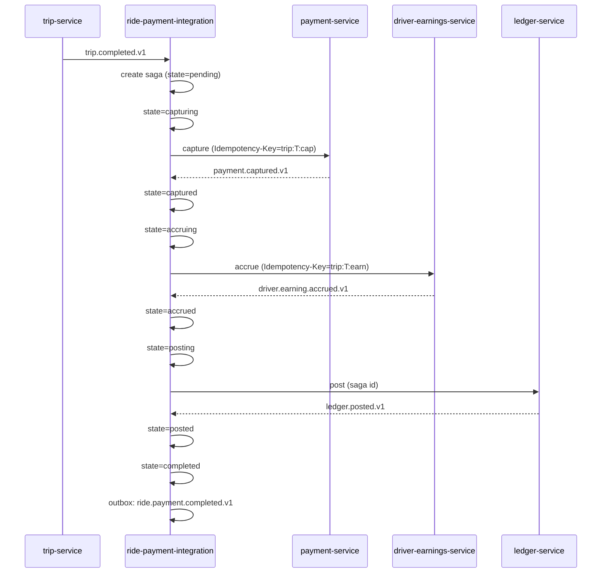
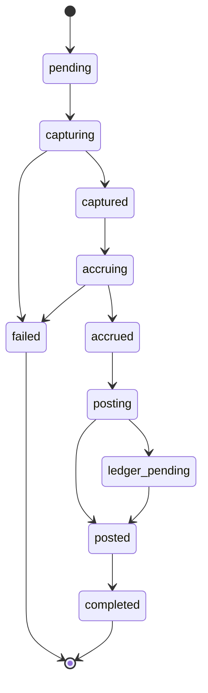
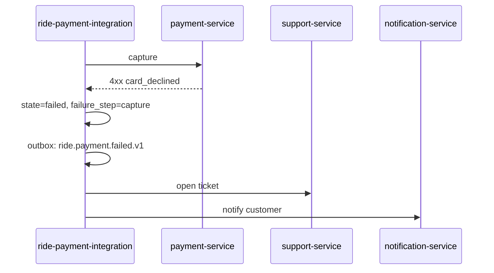
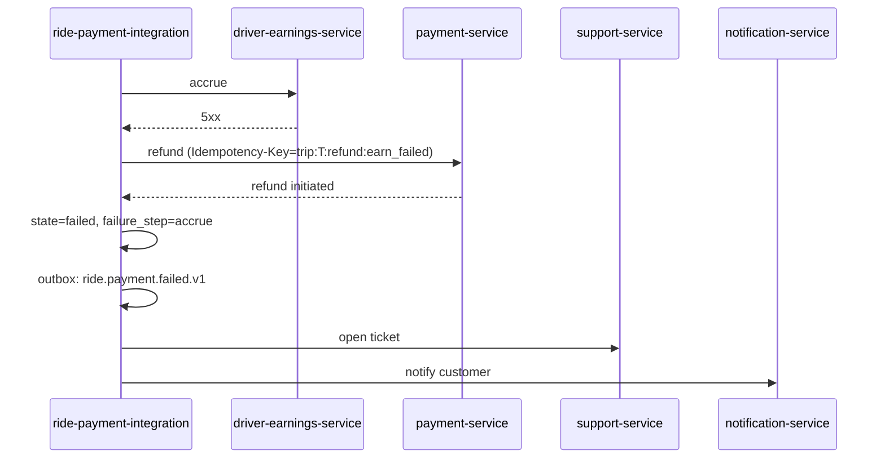
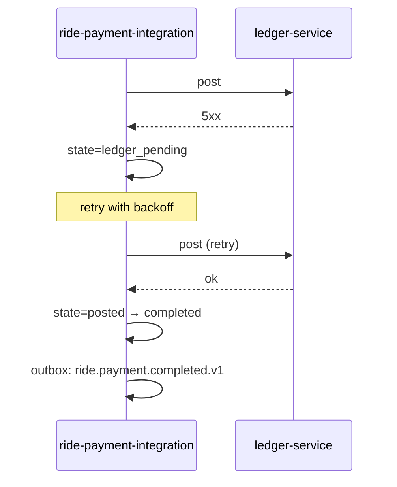
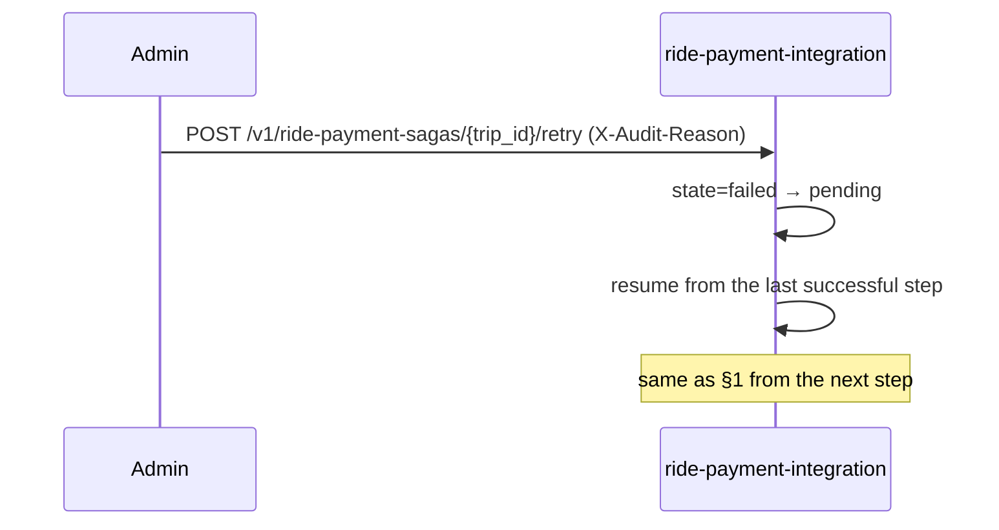

# ride-payment-integration-service — Workflows

## 1. Ride Payment Saga (Happy Path)

### 1.1 Objective

Take a `trip.completed.v1` event and produce a captured payment,
an accrued driver earning, and a ledger posting — exactly once, in
the right order.

### 1.2 Initiating Actor

`trip-service` emits `trip.completed.v1`.

### 1.3 Participating Services

- `ride-payment-integration-service` (this service)
- `payment-service` (capture)
- `driver-earnings-service` (accrue)
- `ledger-service` (post)
- `notification-service` (event consumer; not on the saga path)
- `audit-service` (event consumer; not on the saga path)
- `support-service` (event consumer on failure)
- `ride-history-service` (event consumer on success)

### 1.4 Prerequisites

- The trip is `completed` (per `trip-service`).
- The trip's `final_fare` is set.
- The customer's payment method is on file.
- The driver's earning account is open.

### 1.5 Happy Path



### 1.6 Alternate Paths

- **Capture returns synchronously**: we don't wait for
  `payment.captured.v1`; we advance the saga on the sync response.
- **Pre-auth was used**: we wait for `payment.captured.v1` after the
  deferred capture.

### 1.7 Failure Paths

- **Capture fails**: see §2.
- **Earning accrual fails after capture**: see §3.
- **Ledger post fails after capture + earning**: see §4.

### 1.8 Business Rules

- BR--030 to BR--035.

### 1.9 State Transitions



### 1.10 Events

| Event | Direction | When |
|-------|-----------|------|
| `ride.payment.completed.v1` | produced | on success |
| `ride.payment.failed.v1` | produced | on failure |
| `trip.completed.v1` | consumed | trigger |
| `payment.captured.v1` | consumed | advance (if async) |
| `payment.failed.v1` | consumed | fail |
| `configuration.updated.v1` | consumed | reload |

### 1.11 APIs Involved

| API | Direction | When |
|-----|-----------|------|
| (internal) `payment-service.capture` | outbound | capture step |
| (internal) `driver-earnings-service.accrue` | outbound | accrue step |
| (internal) `ledger-service.post` | outbound | post step |

### 1.12 Compensation / Rollback

- If the earning accrual fails after a successful capture, we
  refund the capture (compensation) and fail the saga.
- If the ledger post fails, we mark `ledger_pending` and retry;
  on persistent failure, we page on-call (P1) but the saga is
  not "failed" — the money has moved; only the ledger is pending.

### 1.13 Final State

`completed` (and `ride.payment.completed.v1` is emitted) or
`failed` (and `ride.payment.failed.v1` is emitted).

## 2. Capture Fails

### 2.1 Objective

When the customer's payment is declined or the provider errors,
fail the saga cleanly: no capture, no earning, no ledger post;
open a support ticket; notify the customer.

### 2.2 Initiating Actor

`payment-service` returns a 4xx/5xx on capture or emits
`payment.failed.v1`.

### 2.3 Participating Services

- `payment-service` (the failure source)
- `ride-payment-integration-service` (this service)
- `support-service` (ticket)
- `notification-service` (customer)

### 2.4 Prerequisites

- The saga is in `capturing` or `pending`.

### 2.5 Happy Path (Failure)



### 2.6 Alternate Paths

- Capture times out and we retry: same flow, on persistent failure.

### 2.7 Failure Paths

- `support-service` down: retry; on persistent failure, page
  on-call.
- `notification-service` down: retry; on persistent failure, log
  (the customer will see the failed payment in the app).

### 2.8 Business Rules

- BR--016, BR--017, BR--018.

### 2.9 State Transitions

`capturing → failed`.

### 2.10 Events

| Event | Direction | When |
|-------|-----------|------|
| `ride.payment.failed.v1` | produced | on failure |

### 2.11 APIs Involved

| API | Direction | When |
|-----|-----------|------|
| `payment-service.capture` | outbound | the failed call |
| `support-service` (event) | outbound | ticket |

### 2.12 Compensation / Rollback

- No money has moved; no compensation needed.

### 2.13 Final State

`failed`. The trip is unpaid. The customer is told to update the
payment method.

## 3. Earning Accrual Fails After Capture

### 3.1 Objective

When the capture succeeded but the earning accrual failed, refund
the capture and fail the saga.

### 3.2 Initiating Actor

`driver-earnings-service` returns a 4xx/5xx on accrue.

### 3.3 Participating Services

- `driver-earnings-service` (the failure source)
- `ride-payment-integration-service` (this service)
- `payment-service` (refund)
- `support-service` (ticket)
- `notification-service` (customer)

### 3.4 Prerequisites

- The saga is in `accruing` and the capture has succeeded.

### 3.5 Happy Path (Failure)



### 3.6 Alternate Paths

- The earning accrual retried and succeeded: continue to ledger
  post.

### 3.7 Failure Paths

- Refund fails: page on-call (P1); reconciliation will detect
  the discrepancy.

### 3.8 Business Rules

- BR--034, BR--016.

### 3.9 State Transitions

`accruing → failed` (with compensation).

### 3.10 Events

| Event | Direction | When |
|-------|-----------|------|
| `ride.payment.failed.v1` | produced | on failure |

### 2.11 APIs Involved

| API | Direction | When |
|-----|-----------|------|
| `driver-earnings-service.accrue` | outbound | the failed call |
| `payment-service.refund` | outbound | compensation |
| `support-service` (event) | outbound | ticket |

### 2.12 Compensation / Rollback

- The refund compensates for the capture. The customer is made
  whole.

### 2.13 Final State

`failed`. The capture is refunded.

## 4. Ledger Post Fails After Capture + Earning

### 4.1 Objective

When the capture and the earning succeeded but the ledger post
failed, retry the post; on persistent failure, page on-call (P1).
The money has moved; the saga is in a recoverable state.

### 4.2 Initiating Actor

`ledger-service` returns a 5xx on post.

### 4.3 Participating Services

- `ledger-service` (the failure source)
- `ride-payment-integration-service` (this service)

### 4.4 Prerequisites

- The saga is in `posting` and capture + earning are done.

### 4.5 Happy Path (Failure)



### 4.6 Alternate Paths

- Retry succeeds: continue to `completed`.
- Retry persistent failure: page on-call (P1); the saga stays
  `ledger_pending` until manual resolution.

### 4.7 Failure Paths

- `ledger-service` down: retry with backoff; on persistent
  failure, page on-call.

### 4.8 Business Rules

- BR--035.

### 4.9 State Transitions

`posting → ledger_pending → posted → completed`.

### 4.10 Events

| Event | Direction | When |
|-------|-----------|------|
| `ride.payment.completed.v1` | produced | when the post eventually succeeds |

### 4.11 APIs Involved

| API | Direction | When |
|-----|-----------|------|
| `ledger-service.post` | outbound | the failed call (and retries) |

### 4.12 Compensation / Rollback

- No compensation; the money has moved. The reconciliation job in
  `reporting-service` detects the missing ledger and pages on-call.

### 4.13 Final State

`completed` (eventually) or `ledger_pending` (until manual
resolution).

## 5. Admin Retry

### 5.1 Objective

Allow an admin to force-retry a failed or stuck saga.

### 5.2 Initiating Actor

Admin (via the support console).

### 5.3 Participating Services

- `ride-payment-integration-service` (this service)
- (downstream services, as needed)

### 5.4 Prerequisites

- The saga is in `failed` or `ledger_pending`.
- The admin has the right role and a reason.

### 5.5 Happy Path



### 5.6 Alternate Paths

- The saga is already `completed`: 409 `STATE_INVALID`.

### 5.7 Failure Paths

- The retry hits the same downstream failure: the saga goes back
  to `failed`; the admin is told.

### 5.8 Business Rules

- BR--020.

### 5.9 State Transitions

`failed → pending → ...` (resumed).

### 5.10 Events

| Event | Direction | When |
|-------|-----------|------|
| (same as §1 from the resumed step) | produced | on success |

### 5.11 APIs Involved

| API | Direction | When |
|-----|-----------|------|
| `POST /v1/ride-payment-sagas/{trip_id}/retry` | inbound | trigger |

### 5.12 Compensation / Rollback

N/A.

### 5.13 Final State

Resumed to `completed` or back to `failed`.

---

## 99. `Monthly Partition Maintenance`

### 99.1 Objective

Idempotently pre-create the next 12 monthly child partitions for partitioned tables in `ride_payment_integration`.

### 99.2 Initiating Actor

A scheduled job runs daily at `02:00 UTC`. Leader-elected via `pg_try_advisory_xact_lock(hashtext('ride_payment_integration.partition'), hashtext('monthly'))`.

### 99.3 Happy Path

```mermaid
sequenceDiagram
    participant JOB as Partition job
    participant PG as PostgreSQL
    JOB->>PG: pg_try_advisory_xact_lock('ride_payment_integration.monthly')
    alt lock acquired
        loop for each missing month in next 12
            JOB->>PG: CREATE TABLE IF NOT EXISTS ride_payment_integration.saga_steps_YYYY_MM PARTITION OF ride_payment_integration.saga_steps
            JOB->>PG: verify (pg_inherits, relpartbound)
        end
        JOB->>PG: assert now() in existing child
    else lock NOT acquired
        Note over JOB: another instance is running; exit cleanly
    end
```

### 99.4 Failure Paths

| Failure | Handling |
|---------|----------|
| Lock contention | exit 0 |
| DDL fails | retry 3× with backoff (1 s / 4 s / 16 s); page on-call |
| Today's child missing | critical alert; INSERTs would fail |

### 99.5 Business Rules

- Pre-create 12 complete future months.
- Every child is created with `CREATE TABLE IF NOT EXISTS … PARTITION OF …`.
- A verification step (`pg_inherits` parent + `relpartbound` range) runs after every `CREATE TABLE IF NOT EXISTS`.
- Optionally emit `audit.partition.maintained.v1` on success.

---

## See also

### Sibling docs for this service

- [`README.md`](./README.md) — purpose, bounded context, responsibilities
- [`BRD.md`](./BRD.md) — business requirements
- [`SRS.md`](./SRS.md) — functional + non-functional requirements
- [`ERD.md`](./ERD.md) — data model (entities, relationships)
- [`INTEGRATION.md`](./INTEGRATION.md) — inter-service contracts (APIs, events, sagas)
- [`WORKFLOWS.md`](./WORKFLOWS.md) — operational workflows (happy paths, failure modes)
- [`TECH.md`](./TECH.md) — technology profile (runtime, libraries, data layer, admin endpoints, RBAC)

### Platform-wide

- [`../../shared/README.md`](../../shared/README.md) — `platform-spring-boot-starter` shared library (the single source of cross-cutting code for all Spring Boot services in the platform)
- [`../RECOMMENDATIONS.md`](../RECOMMENDATIONS.md) — platform-wide technology map (language, framework, version baseline, admin/RBAC pattern)
- [`../../README.md`](../../README.md) — services overview (the catalog of all 58 services)
- [`../../../main.md`](../../../main.md) — top-level platform specification (architecture, Keycloak, PostgreSQL 18, messaging, observability baseline)

