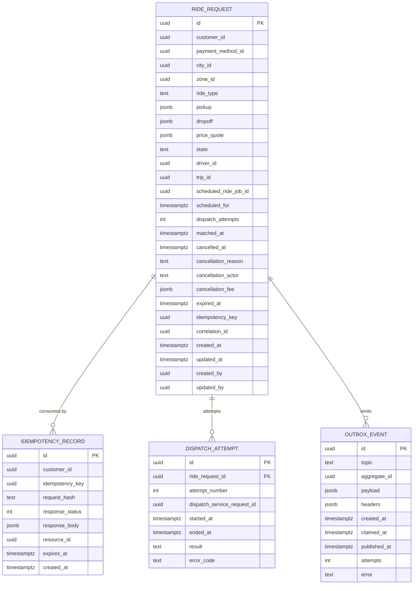

# ride-request-service — Entity-Relationship Diagram

## 1. Database

- Engine: PostgreSQL 18
- Schema: `ride_request` (owned exclusively by this service)
- Migrations: `services/ride-request-service/migrations/`
  (forward-only, `dbmate`-style numbered files)

## 2. Cross-Service References

The following columns are stored as UUIDs **without** database foreign
keys. The referenced row is owned by another service.

| Column | Type | Refers to | Source of truth |
|--------|------|-----------|------------------|
| `requests.customer_id` | UUID | `customer` in `customer-service` | `customer-service` |
| `requests.payment_method_id` | UUID | `payment_method` in `payment-service` | `payment-service` |
| `requests.driver_id` | UUID (nullable) | `driver` in `driver-service` | `driver-service` |
| `requests.trip_id` | UUID (nullable) | `trip` in `trip-service` | `trip-service` |
| `requests.scheduled_ride_job_id` | UUID (nullable) | `scheduled_ride` job in `scheduled-ride-service` | `scheduled-ride-service` |
| `requests.cancellation.actor_id` | UUID | whoever cancelled (customer / support / admin) | the actor's service |
| `idempotency.idempotency_key` | UUID | the client-provided key (opaque) | client |
| `idempotency.customer_id` | UUID | the originating customer | `customer-service` |
| `dispatch_attempts.dispatch_service_request_id` | UUID | correlation id from `dispatch-service` | `dispatch-service` |

## 3. Entities

### `RideRequest`

The single aggregate for the bounded context. One row per customer
ride request.

#### Columns

| Column | Type | Constraints | Notes |
|--------|------|-------------|-------|
| `id` | UUID | PK | UUIDv7 |
| `customer_id` | UUID | NOT NULL | cross-service ref to `customer-service` |
| `payment_method_id` | UUID | NULL | optional; default used if absent |
| `city_id` | UUID | NOT NULL | city the request is in |
| `zone_id` | UUID | NOT NULL | pickup zone |
| `ride_type` | TEXT | NOT NULL, CHECK (ride_type IN ('economy','premium','xl','shared')) | enforced in code, documented in schema |
| `pickup` | JSONB | NOT NULL | `{lat,lon,address,place_id}` |
| `dropoff` | JSONB | NOT NULL | same shape |
| `price_quote` | JSONB | NOT NULL | `{quote_id, amount_minor, currency, expires_at, surge_multiplier, distance_meters, duration_seconds, breakdown[]}` |
| `state` | TEXT | NOT NULL, CHECK (state IN ('requested','matched','cancelled','expired')) | state machine |
| `driver_id` | UUID | NULL | set on `matched` |
| `trip_id` | UUID | NULL | set on `matched` |
| `scheduled_ride_job_id` | UUID | NULL | set if materialised from a scheduled ride |
| `scheduled_for` | TIMESTAMPTZ | NULL | future time if scheduled |
| `dispatch_attempts` | INT | NOT NULL DEFAULT 0 | increments on every dispatch attempt |
| `matched_at` | TIMESTAMPTZ | NULL | when `dispatch.matched.v1` was accepted |
| `cancelled_at` | TIMESTAMPTZ | NULL | when cancellation was finalised |
| `cancellation_reason` | TEXT | NULL | free text from the customer or system |
| `cancellation_actor` | TEXT | NULL, CHECK (cancellation_actor IN ('customer','support','admin','system','safety')) | who |
| `cancellation_fee` | JSONB | NULL | `{amount_minor, currency, captured_at, payment_intent_id}` |
| `expired_at` | TIMESTAMPTZ | NULL | when `dispatch.no_driver.v1` was applied |
| `idempotency_key` | UUID | NOT NULL | client-supplied |
| `correlation_id` | UUID | NOT NULL | end-to-end correlation |
| `created_at` | TIMESTAMPTZ | NOT NULL DEFAULT now() | audit |
| `updated_at` | TIMESTAMPTZ | NOT NULL DEFAULT now() | audit |
| `created_by` | UUID | NOT NULL | identity (customer sub) |
| `updated_by` | UUID | NOT NULL | identity |

#### Indexes

- PK on `id`
- `idx_ride_request_customer_state` on `(customer_id, state)` —
  supports "my active requests" queries.
- `idx_ride_request_state_created` on `(state, created_at)` —
  supports the "expiring soon" sweeper.
- `idx_ride_request_scheduled_for` on `(scheduled_for)` partial
  `WHERE state = 'requested' AND scheduled_for IS NOT NULL` — supports
  the scheduled materialisation check.
- `idx_ride_request_zone_state` on `(zone_id, state)` — supports
  per-zone dashboards.
- `idx_ride_request_correlation` on `(correlation_id)` — supports
  tracing.

#### Constraints

- `CHECK (state IN ('requested','matched','cancelled','expired'))`
- `CHECK (ride_type IN ('economy','premium','xl','shared'))`
- `CHECK (cancellation_actor IS NULL OR cancellation_actor IN
  ('customer','support','admin','system','safety'))`
- `CHECK (cancelled_at IS NULL OR state = 'cancelled')`
- `CHECK (expired_at IS NULL OR state = 'expired')`
- `CHECK (matched_at IS NULL OR state = 'matched')`

### `IdempotencyRecord`

Stores the response of a previous `POST /v1/rides` (or other
non-idempotent POST) keyed by `(customer_id, idempotency_key)`.

#### Columns

| Column | Type | Constraints | Notes |
|--------|------|-------------|-------|
| `id` | UUID | PK | UUIDv7 |
| `customer_id` | UUID | NOT NULL | owning customer |
| `idempotency_key` | UUID | NOT NULL | client key |
| `request_hash` | TEXT | NOT NULL | SHA-256 of the request body |
| `response_status` | INT | NOT NULL | HTTP status to replay |
| `response_body` | JSONB | NOT NULL | response body to replay |
| `resource_id` | UUID | NULL | the created `ride_request.id` (if any) |
| `expires_at` | TIMESTAMPTZ | NOT NULL | TTL = now() + 24h |
| `created_at` | TIMESTAMPTZ | NOT NULL DEFAULT now() | audit |

#### Indexes

- PK on `id`
- UNIQUE on `(customer_id, idempotency_key)`
- Index on `expires_at` for purging.

### `DispatchAttempt`

Audit trail of every dispatch attempt for a request. Useful for
debugging no-driver cases and for fairness analysis.

#### Columns

| Column | Type | Constraints | Notes |
|--------|------|-------------|-------|
| `id` | UUID | PK | UUIDv7 |
| `ride_request_id` | UUID | NOT NULL | FK to `requests.id` (within schema) |
| `attempt_number` | INT | NOT NULL | 1..N |
| `dispatch_service_request_id` | UUID | NULL | correlation id from `dispatch-service` |
| `started_at` | TIMESTAMPTZ | NOT NULL DEFAULT now() | audit |
| `ended_at` | TIMESTAMPTZ | NULL | when result arrived |
| `result` | TEXT | NULL, CHECK (result IN ('matched','no_driver','offer_expired','error')) | outcome |
| `error_code` | TEXT | NULL | if `result='error'` |

#### Indexes

- PK on `id`
- `idx_dispatch_attempt_request` on `(ride_request_id, attempt_number)`

### `OutboxEvent`

Transactional outbox used by every state-changing transaction.

#### Columns

| Column | Type | Constraints | Notes |
|--------|------|-------------|-------|
| `id` | UUID | PK | UUIDv7 |
| `topic` | TEXT | NOT NULL | e.g. `ride.request.created` |
| `aggregate_id` | UUID | NOT NULL | partition key = `ride_request_id` |
| `payload` | JSONB | NOT NULL | envelope + data |
| `headers` | JSONB | NOT NULL DEFAULT '{}' | `correlation_id`, `causation_id`, `traceparent` |
| `created_at` | TIMESTAMPTZ | NOT NULL DEFAULT now() | |
| `claimed_at` | TIMESTAMPTZ | NULL | set when poller picks it up |
| `published_at` | TIMESTAMPTZ | NULL | set after broker ack |
| `attempts` | INT | NOT NULL DEFAULT 0 | |
| `error` | TEXT | NULL | last publish error |

#### Indexes

- PK on `id`
- `idx_outbox_pending` on `(created_at)` partial `WHERE published_at
  IS NULL`

## 4. Mermaid ER Diagram



## 5. DDL Sketch

```sql
CREATE SCHEMA IF NOT EXISTS ride_request;
SET search_path TO ride_request;

CREATE TABLE ride_request.requests (
    id UUID PRIMARY KEY,
    customer_id UUID NOT NULL,
    payment_method_id UUID,
    city_id UUID NOT NULL,
    zone_id UUID NOT NULL,
    ride_type TEXT NOT NULL,
    pickup JSONB NOT NULL,
    dropoff JSONB NOT NULL,
    price_quote JSONB NOT NULL,
    state TEXT NOT NULL,
    driver_id UUID,
    trip_id UUID,
    scheduled_ride_job_id UUID,
    scheduled_for TIMESTAMPTZ,
    dispatch_attempts INT NOT NULL DEFAULT 0,
    matched_at TIMESTAMPTZ,
    cancelled_at TIMESTAMPTZ,
    cancellation_reason TEXT,
    cancellation_actor TEXT,
    cancellation_fee JSONB,
    expired_at TIMESTAMPTZ,
    idempotency_key UUID NOT NULL,
    correlation_id UUID NOT NULL,
    created_at TIMESTAMPTZ NOT NULL DEFAULT now(),
    updated_at TIMESTAMPTZ NOT NULL DEFAULT now(),
    created_by UUID NOT NULL,
    updated_by UUID NOT NULL,
    CONSTRAINT chk_state CHECK (state IN ('requested','matched','cancelled','expired')),
    CONSTRAINT chk_ride_type CHECK (ride_type IN ('economy','premium','xl','shared')),
    CONSTRAINT chk_cancellation_actor CHECK (
        cancellation_actor IS NULL OR
        cancellation_actor IN ('customer','support','admin','system','safety')
    ),
    CONSTRAINT chk_cancelled_at CHECK (cancelled_at IS NULL OR state = 'cancelled'),
    CONSTRAINT chk_expired_at CHECK (expired_at IS NULL OR state = 'expired'),
    CONSTRAINT chk_matched_at CHECK (matched_at IS NULL OR state = 'matched')
);

CREATE INDEX idx_ride_request_customer_state
    ON ride_request.requests (customer_id, state);
CREATE INDEX idx_ride_request_state_created
    ON ride_request.requests (state, created_at);
CREATE INDEX idx_ride_request_scheduled_for
    ON ride_request.requests (scheduled_for)
    WHERE state = 'requested' AND scheduled_for IS NOT NULL;
CREATE INDEX idx_ride_request_zone_state
    ON ride_request.requests (zone_id, state);
CREATE INDEX idx_ride_request_correlation
    ON ride_request.requests (correlation_id);

CREATE TABLE ride_request.idempotency (
    id UUID PRIMARY KEY,
    customer_id UUID NOT NULL,
    idempotency_key UUID NOT NULL,
    request_hash TEXT NOT NULL,
    response_status INT NOT NULL,
    response_body JSONB NOT NULL,
    resource_id UUID,
    expires_at TIMESTAMPTZ NOT NULL,
    created_at TIMESTAMPTZ NOT NULL DEFAULT now(),
    CONSTRAINT uq_idempotency UNIQUE (customer_id, idempotency_key)
);
CREATE INDEX idx_idempotency_expires ON ride_request.idempotency (expires_at);

CREATE TABLE ride_request.dispatch_attempts (
    id UUID PRIMARY KEY,
    ride_request_id UUID NOT NULL REFERENCES ride_request.requests(id),
    attempt_number INT NOT NULL,
    dispatch_service_request_id UUID,
    started_at TIMESTAMPTZ NOT NULL DEFAULT now(),
    ended_at TIMESTAMPTZ,
    result TEXT,
    error_code TEXT,
    CONSTRAINT chk_attempt_result CHECK (
        result IS NULL OR result IN ('matched','no_driver','offer_expired','error')
    )
);
CREATE INDEX idx_dispatch_attempt_request
    ON ride_request.dispatch_attempts (ride_request_id, attempt_number);

CREATE TABLE ride_request.outbox (
    id UUID PRIMARY KEY,
    topic TEXT NOT NULL,
    aggregate_id UUID NOT NULL,
    payload JSONB NOT NULL,
    headers JSONB NOT NULL DEFAULT '{}'::jsonb,
    created_at TIMESTAMPTZ NOT NULL DEFAULT now(),
    claimed_at TIMESTAMPTZ,
    published_at TIMESTAMPTZ,
    attempts INT NOT NULL DEFAULT 0,
    error TEXT
);
CREATE INDEX idx_outbox_pending ON ride_request.outbox (created_at)
    WHERE published_at IS NULL;
```

## 6. Audit Columns

Every mutable table has `created_at`, `updated_at`, `created_by`,
`updated_by`. Outbox events are append-only.

## 7. Soft Delete

Not used for active requests. The `cancelled` and `expired` states are
the "deleted by user or system" equivalent. The 7-year retention
window applies to the request row itself.

## 8. JSONB Usage

- `pickup` and `dropoff`: geocoded address + lat/lon + provider's
  place_id. Schema is small and stable, so JSONB is justified; we do
  not query inside these columns in hot paths.
- `price_quote`: snapshot of the `pricing-service` quote, including
  breakdown, surge, and TTL.
- `cancellation_fee`: `{amount_minor, currency, captured_at,
  payment_intent_id}`.
- `idempotency.response_body`: stored as JSONB for fidelity.
- `outbox.payload`: full event envelope.

## 9. Partitioning

Not used. Volume is moderate (millions of rows, not billions). The
`requests` table is hot but well-indexed. If volume grows, the
`requests` table may be range-partitioned by `created_at` monthly.

## 10. Data Retention

| Table | Retention | Purged by |
|-------|-----------|-----------|
| `requests` | 7 years | a scheduled job that hard-deletes rows older than 7 years, after de-identification |
| `idempotency` | 24h | daily purge of `expires_at < now()` |
| `dispatch_attempts` | 1 year | monthly purge |
| `outbox` | 24h after publish | poller purges `WHERE published_at < now() - 24h` |

## 11. Migration Considerations

- Adding columns is online. Example: adding `scheduled_ride_job_id`
  required no downtime; backfill is optional.
- Renaming or removing columns is multi-step (add new, switch reads,
  switch writes, drop old).
- The `idempotency` table grows fast; the `expires_at` index keeps
  the purge cheap.
- The `requests` table's `state` CHECK is the source of truth for the
  state machine; migrations that change the enum must add the new
  value as nullable first, deploy, then add the constraint.

---

## See also

### Sibling docs for this service

- [`README.md`](./README.md) — purpose, bounded context, responsibilities
- [`BRD.md`](./BRD.md) — business requirements
- [`SRS.md`](./SRS.md) — functional + non-functional requirements
- [`ERD.md`](./ERD.md) — data model (entities, relationships)
- [`INTEGRATION.md`](./INTEGRATION.md) — inter-service contracts (APIs, events, sagas)
- [`WORKFLOWS.md`](./WORKFLOWS.md) — operational workflows (happy paths, failure modes)
- [`TECH.md`](./TECH.md) — technology profile (runtime, libraries, data layer, admin endpoints, RBAC)

### Platform-wide

- [`../../shared/README.md`](../../shared/README.md) — `platform-spring-boot-starter` shared library (the single source of cross-cutting code for all Spring Boot services in the platform)
- [`../RECOMMENDATIONS.md`](../RECOMMENDATIONS.md) — platform-wide technology map (language, framework, version baseline, admin/RBAC pattern)
- [`../../README.md`](../../README.md) — services overview (the catalog of all 58 services)
- [`../../../main.md`](../../../main.md) — top-level platform specification (architecture, Keycloak, PostgreSQL 18, messaging, observability baseline)

