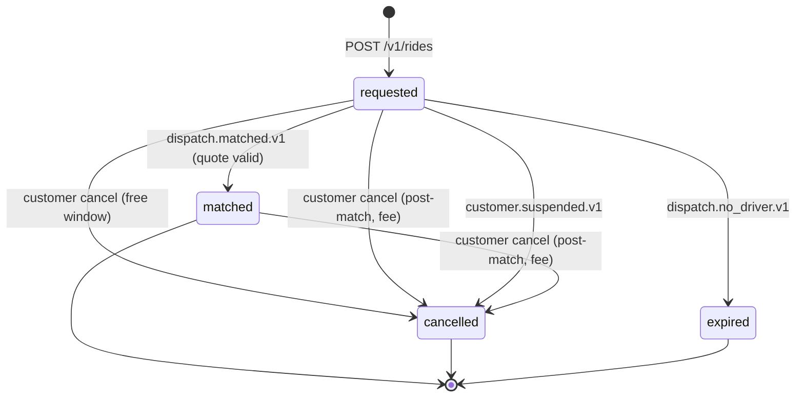

# ride-request-service — Software Requirements Specification

## 1. Introduction

This document specifies the functional, non-functional, data, and
security requirements for `ride-request-service`. It is the contract
that the implementation must satisfy. Acceptance is verified against
this document by integration tests, contract tests, and the platform's
quality gates.

## 2. Scope

In scope:

- The ride request aggregate (create, read, list, cancel, rebook).
- The state machine `requested → matched | cancelled | expired`.
- The price-quote handshake with `pricing-service`.
- The dispatch trigger and reaction (`dispatch.matched.v1`,
  `dispatch.no_driver.v1`, `dispatch.offer.expired.v1`).
- The cancellation policy and the optional fee capture.
- The scheduled-ride handoff (`scheduled_ride.due.v1`).
- Idempotency for non-idempotent POSTs.

Out of scope:

- Driver app APIs.
- The `trip` aggregate (`trip-service`).
- Geocoding/ETA/routing.
- Payment capture details beyond the fee pre-auth.
- Admin UI.

## 3. System Context

```mermaid
flowchart LR
    C[Customer app] --> GW[api-gateway] --> RR[ride-request-service]
    RR --> CST[customer-service]
    RR --> PRC[pricing-service]
    RR --> ZN[zone-service]
    RR --> DA[driver-availability-service]
    RR --> DSP[dispatch-service]
    RR --> PAY[payment-service]
    SR[scheduled-ride-service] -. ride.request.created.v1 .-> RR
    DSP -. dispatch.matched.v1 / dispatch.no_driver.v1 / dispatch.offer.expired.v1 .-> RR
    CST -. customer.created.v1 / customer.suspended.v1 .-> RR
    RR -. ride.request.*.v1 .-> K[(Kafka)]
    K --> NOT[notification-service]
    K --> AUD[audit-service]
    K --> TR[trip-service]
```

## 4. Actors

- **Customer (mobile)** — JWT with role `customer`. Reads/writes own
  resources.
- **Customer support agent** — JWT with role `support_agent`. Read +
  cancel on behalf of customer.
- **Admin** — JWT with role `admin`. Full read + cancel + force
  re-dispatch.
- **dispatch-service** (system) — service-to-service JWT; calls via
  REST or emits events.
- **scheduled-ride-service** (system) — service-to-service JWT.
- **payment-service** (system) — service-to-service JWT.
- **pricing-service** (system) — service-to-service JWT.

## 5. Functional Requirements

| ID | Requirement | Priority |
|----|-------------|----------|
| FR--001 | Accept `POST /v1/rides` with `pickup`, `dropoff`, `ride_type`, `payment_method_id` (optional, default used if absent), `scheduled_for` (optional), and `Idempotency-Key`. | MUST |
| FR--002 | Validate the customer is active (not suspended) via `customer-service` `GET /v1/customers/{id}` and reject 403 if not. | MUST |
| FR--003 | Validate pickup and dropoff are within a served zone via `zone-service` `POST /v1/zones/coverage`; reject 422 with `PICKUP_UNSERVED` or `DROPOFF_UNSERVED` as appropriate. | MUST |
| FR--004 | Request a price quote from `pricing-service` `POST /v1/quotes`; persist the quote and its TTL on the request. | MUST |
| FR--005 | Persist the request in `requested` state and emit `ride.request.created.v1` with `aggregate_id = ride_request_id`. | MUST |
| FR--006 | Trigger `dispatch-service` to begin a match attempt; if dispatch is down, persist the request and let the next consumer event retry. | MUST |
| FR--007 | On `dispatch.matched.v1` with a still-valid quote, transition to `matched`, set `driver_id` and `trip_id`, and emit `ride.request.matched.v1`. | MUST |
| FR--008 | On `dispatch.matched.v1` whose quote has expired, emit `dispatch.offer.expired.v1` and re-dispatch with a fresh quote. | MUST |
| FR--009 | On `dispatch.no_driver.v1`, transition to `expired`, emit `ride.request.expired.v1`, and request a customer notification. | MUST |
| FR--010 | On `dispatch.offer.expired.v1`, re-arm dispatch with the same quote, up to `ride_request.dispatch.max_attempts`. | MUST |
| FR--011 | `POST /v1/rides/{id}/cancellation` by the customer; calculate the fee per policy; if fee > 0 and within the matched window, capture via `payment-service` `POST /v1/payments/charge` with `Idempotency-Key = ride:{id}:cancel`. | MUST |
| FR--012 | `POST /v1/rides/{id}/rebook` creates a new request using the same parameters and a fresh quote. | SHOULD |
| FR--013 | `GET /v1/rides/{id}/quote` returns the current quote (refreshes if expired). | SHOULD |
| FR--014 | On `customer.suspended.v1`, auto-cancel all open requests for that customer with no fee. | MUST |
| FR--015 | On `scheduled_ride.due.v1`, create a `requested` ride using the job's parameters and a fresh quote. | MUST |
| FR--016 | Enforce ≤ 3 concurrent `requested` requests per customer. | MUST |
| FR--017 | Reject any state transition not in the state machine with 409 `STATE_INVALID`. | MUST |
| FR--018 | Persist the `Idempotency-Key` (24h) and replay the stored response on duplicate. | MUST |
| FR--019 | All emitted events go through the transactional outbox. | MUST |
| FR--020 | Soft-deny requests when the customer's fraud risk score is `high` (consume `fraud.risk.scored.v1`; deny new requests when block is in effect). | SHOULD |

## 6. Non-Functional Requirements

| ID | Category | Requirement | Target |
|----|----------|-------------|--------|
| NFR--001 | performance | P50 latency for `POST /v1/rides` | ≤ 250ms |
| NFR--002 | performance | P95 latency for `POST /v1/rides` | ≤ 500ms |
| NFR--003 | performance | P99 latency for `GET /v1/rides/{id}` | ≤ 100ms |
| NFR--004 | availability | service uptime | 99.95% (Tier-1) |
| NFR--005 | scalability | concurrent open requests | 100k per region |
| NFR--006 | maintainability | MTTR for a bad deploy | ≤ 15 minutes (single rollback) |
| NFR--007 | observability | tracing coverage | 100% of API requests and outbound events |
| NFR--008 | data integrity | zero lost requests under retry | durable; outbox guarantees |
| NFR--009 | throughput | create TPS sustained | 5k/s per region, 15k/s peak |
| NFR--010 | capacity | match-to-event lag at p99 | ≤ 3 seconds |

## 7. API Requirements

REST contract per `architecture/API_STANDARDS.md`. Idempotency-Key
required on all non-idempotent POSTs. JWT bearer. JSON. UTF-8. Errors
use the standard envelope. Pagination cursor-based for `GET /v1/rides`.
Full contract in `INTEGRATION.md`.

## 8. Data Requirements

| ID | Requirement | Notes |
|----|-------------|-------|
| DATA--001 | All ride requests have a UUIDv7 primary key | time-ordered |
| DATA--002 | All times stored as `timestamptz` UTC | RFC3339 at the wire |
| DATA--003 | Money stored in `amount_minor BIGINT` with `currency CHAR(3)` | no floats |
| DATA--004 | Pickup and dropoff stored as JSONB (`{lat, lon, address, place_id}`) | not in PostGIS |
| DATA--005 | `customer_id` stored as UUID without FK | cross-service reference |
| DATA--006 | `payment_method_id` stored as UUID without FK | owned by `payment-service` |
| DATA--007 | `trip_id` and `driver_id` are nullable until matched | cross-service references |
| DATA--008 | `price_quote` stored as JSONB with TTL | see `ERD.md` for shape |
| DATA--009 | Soft delete: not used for active requests; archived snapshot rows use `deleted_at` | see ERD |
| DATA--010 | Audit columns (`created_at`, `updated_at`, `created_by`, `updated_by`) on every mutable table | platform standard |

(Full schema in `ERD.md`.)

## 9. Validation Rules

- Pickup and dropoff must be valid coordinates; range check:
  `lat ∈ [-90, 90]`, `lon ∈ [-180, 180]`.
- `ride_type` must be in the city-allowed set (from
  `ride_request.allowed_ride_types`).
- `scheduled_for` (if present) must be ≥ now + 15 minutes and ≤
  now + 30 days.
- `payment_method_id` (if present) must belong to the customer (a
  cross-service check, performed at the request time and re-validated
  when the customer changes the method).
- `idempotency_key` must be a UUID; collisions are detected and
  returned as 422 `IDEMPOTENCY_KEY_REUSED` if the request body
  differs.

## 10. State Transitions



See `WORKFLOWS.md` for transitions with full context.

## 11. Authorization Requirements

- The customer can read and cancel only their own request
  (`ride_request.customer_id == sub`).
- The customer cannot cancel after a driver is at the pickup (BR--033);
  the request returns 409 `STATE_INVALID` and the customer app must
  use the in-trip dispute flow.
- `admin` can cancel with a `X-Audit-Reason` header; this emits a
  high-severity audit event and pages on-call after-hours.
- `support_agent` can read and cancel on behalf of a customer with the
  same constraint (no cancel at pickup) and a required reason.

## 12. Configuration Requirements

Consumed from `configuration-service` and refreshed on
`configuration.updated.v1`:

- `ride_request.match_timeout_seconds`
- `ride_request.cancellation.free_window_seconds`
- `ride_request.cancellation.fee_minor.{currency}`
- `ride_request.cancellation.fee_pickup_minor.{currency}`
- `ride_request.quote_ttl_seconds`
- `ride_request.dispatch.max_attempts`
- `ride_request.dispatch.between_attempts_ms`
- `ride_request.allowed_ride_types.{city_id}`

## 13. Error Handling

| Error | Response | Recovery |
|-------|----------|----------|
| Invalid request body | 400 `VALIDATION_FAILED` | client corrects |
| Unauthenticated | 401 `UNAUTHENTICATED` | client re-auths |
| Not the owner | 403 `FORBIDDEN` | none |
| Customer not active | 403 `CUSTOMER_SUSPENDED` | none |
| Pickup unzoned | 422 `PICKUP_UNSERVED` | none |
| Pricing service timeout | 503 `DEPENDENCY_TIMEOUT` | client retries |
| Dispatch service down | 202 (queued) | background retry |
| State machine rejects | 409 `STATE_INVALID` | client refreshes |
| Idempotency conflict | 422 `IDEMPOTENCY_KEY_REUSED` | client uses new key |

## 14. Concurrency Requirements

- A single `ride_request` row is mutated by at most one writer at a
  time. Updates use `SELECT … FOR UPDATE` or an advisory lock keyed on
  `ride_request_id`.
- The `match_attempt` counter is incremented atomically.
- Concurrent `cancellation` and `dispatch.matched.v1` are resolved by
  the row lock; the first writer wins.

## 15. Idempotency Requirements

- `Idempotency-Key` is required for `POST /v1/rides`,
  `POST /v1/rides/{id}/cancellation`, `POST /v1/rides/{id}/rebook`.
- Storage: `ride_request.idempotency` table keyed by
  `(customer_id, idempotency_key)`. TTL 24h.
- Replay returns the stored `response_status` and `response_body`.
- Mismatch (same key, different body) returns 422
  `IDEMPOTENCY_KEY_REUSED`.

## 16. Performance

- Dominant path: `POST /v1/rides` (validate customer + zone, fetch
  quote, persist, emit).
- P50 / P95 / P99: 250ms / 500ms / 800ms.

## 17. Scalability

- Horizontal: stateless, scale by HPA on CPU and on
  `ride_request_match_seconds_p99`.
- Vertical: 1 vCPU / 1 GiB per replica is sufficient at base load;
  scale up first.
- Database: per-service schema; consider read replicas for the
  customer's "my recent rides" endpoint.

## 18. Availability

- SLO: 99.95% over 30 days.
- Error budget: ~22 minutes per 30 days.
- Maintenance window: weekly Sun 04:00–06:00 UTC.

## 19. Security

| ID | Requirement | Notes |
|----|-------------|-------|
| SEC--001 | All endpoints require a valid JWT bearer token | gateway validates |
| SEC--002 | Customer ownership is enforced for all reads/writes | `customer_id == sub` |
| SEC--003 | PII (pickup/dropoff/address) is encrypted at rest (disk-level KMS) | `DATA--004` |
| SEC--004 | Admin actions require `X-Audit-Reason` and emit a high-severity audit event | BR--023 |
| SEC--005 | Idempotency keys are opaque UUIDs, not derived from request content | prevents enumeration |
| SEC--006 | No secrets in source or environment files | Vault only |
| SEC--007 | TLS 1.3 at edge; mTLS in cluster | platform standard |

## 20. Privacy

- PII stored: pickup/dropoff coordinates and addresses, customer's
  default payment method reference (tokenised).
- Retention: 7 years for the request, per financial regulation. After
  7 years, the snapshot is hard-deleted; the customer's audit history
  remains de-identified.
- Erasure: per GDPR, PII columns are erased; financial records are
  retained but with identifying fields removed.

## 21. Auditability

- Every state transition is logged at `info` with `correlation_id`,
  `ride_request_id`, `from_state`, `to_state`, `actor_id`,
  `actor_type`.
- Every admin action is logged at `warn` and emitted as
  `ride.request.cancelled.v1` (with `actor_type=admin`).
- Audit events are written via `audit-service` for compliance.

## 22. Observability

- Logs: JSON to stdout with `correlation_id`, `service`, `version`,
  `route`, `latency_ms`, `status`.
- Metrics: see `README.md` §15.
- Traces: OpenTelemetry, root span per request.
- Alerts: SLO burn-rate, no-driver-rate anomaly, idempotency-key
  reuse rate, error budget burn.

## 23. Maintainability

- Code style: TypeScript with `strict: true`; ESLint + Prettier.
- Test coverage: ≥ 80% line / branch; 100% on the state machine.
- Documentation: this folder; OpenAPI generated from code.

## 24. Disaster Recovery

- RPO: ≤ 1 minute (WAL streaming + outbox).
- RTO: ≤ 15 minutes (warm standby in same region, cold standby in
  the other region).

## 25. Acceptance Criteria

- The state machine refuses all invalid transitions with 409
  `STATE_INVALID`.
- All emitted events are present in Kafka after the corresponding API
  response.
- Idempotency-Key replay returns the prior response within the TTL.
- Performance NFRs are met at the documented target.
- Security NFRs (SEC--001 to SEC--007) are verified in CI.

---

## See also

### Sibling docs for this service

- [`README.md`](./README.md) — purpose, bounded context, responsibilities
- [`BRD.md`](./BRD.md) — business requirements
- [`SRS.md`](./SRS.md) — functional + non-functional requirements
- [`ERD.md`](./ERD.md) — data model (entities, relationships)
- [`INTEGRATION.md`](./INTEGRATION.md) — inter-service contracts (APIs, events, sagas)
- [`WORKFLOWS.md`](./WORKFLOWS.md) — operational workflows (happy paths, failure modes)
- [`TECH.md`](./TECH.md) — technology profile (runtime, libraries, data layer, admin endpoints, RBAC)

### Platform-wide

- [`../../shared/README.md`](../../shared/README.md) — `platform-spring-boot-starter` shared library (the single source of cross-cutting code for all Spring Boot services in the platform)
- [`../RECOMMENDATIONS.md`](../RECOMMENDATIONS.md) — platform-wide technology map (language, framework, version baseline, admin/RBAC pattern)
- [`../../README.md`](../../README.md) — services overview (the catalog of all 58 services)
- [`../../../main.md`](../../../main.md) — top-level platform specification (architecture, Keycloak, PostgreSQL 18, messaging, observability baseline)

