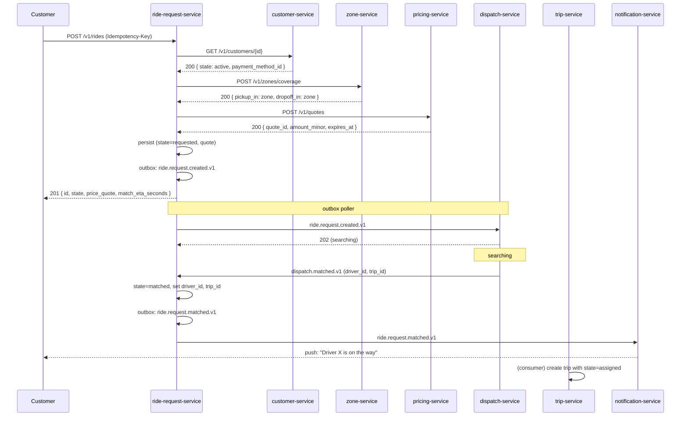
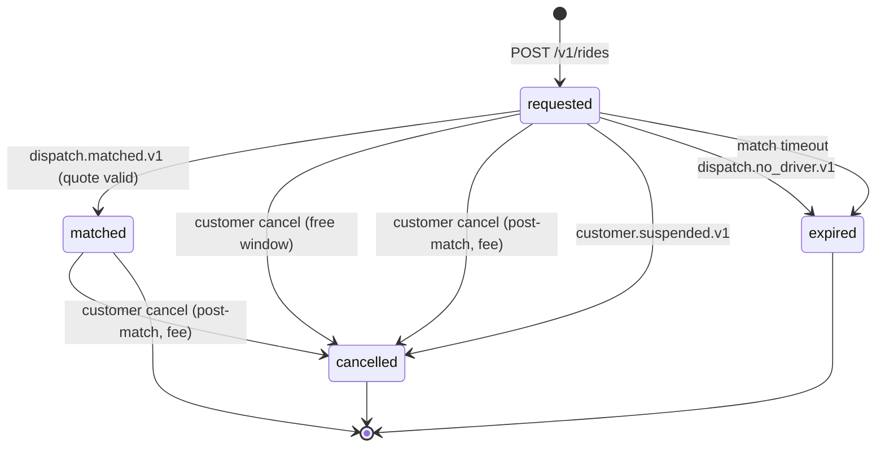
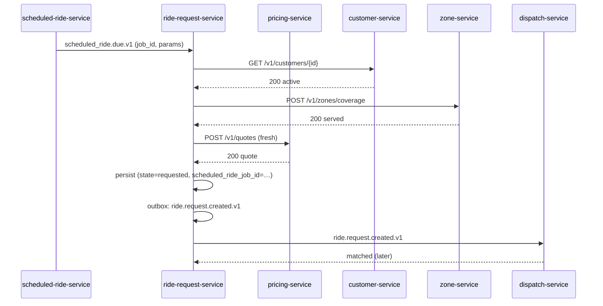
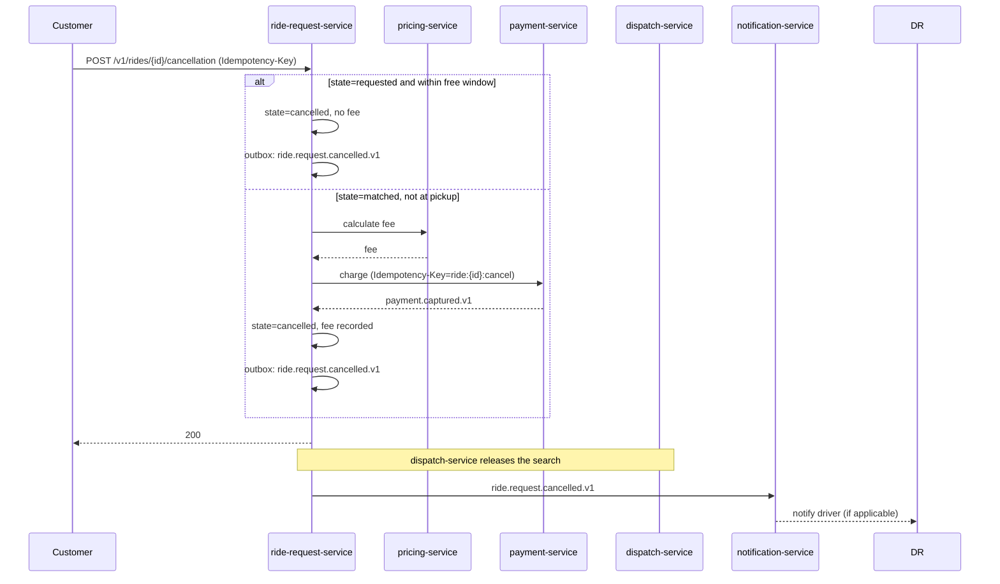

# ride-request-service — Workflows

## 1. Customer Requests a Ride (Happy Path)

### 1.1 Objective

Take a customer from "I want a ride" to "a driver is on the way" with
a single API call and a chain of events that downstream services
react to. The state machine goes `requested → matched`.

### 1.2 Initiating Actor

The customer (mobile app) initiates by calling
`POST /v1/rides` with pickup, dropoff, ride type, and an
`Idempotency-Key`.

### 1.3 Participating Services

- `ride-request-service` (this service)
- `customer-service` (read)
- `pricing-service` (synchronous)
- `zone-service` (synchronous)
- `dispatch-service` (synchronous + events back)
- `notification-service` (event consumer)
- `audit-service` (event consumer)
- `trip-service` (event consumer)

### 1.4 Prerequisites

- The customer is active and not suspended.
- Pickup and dropoff are within a served zone.
- The `ride_type` is in the city's allowed set.
- The `pricing-service` is reachable.
- The customer has a usable payment method on file.

### 1.5 Happy Path

### 1.6 Alternate Paths

- **Pricing service times out**: 503 `DEPENDENCY_TIMEOUT` to the
  customer; no request created. The customer app prompts to retry.
- **Zone not served**: 422 `PICKUP_UNSERVED` or `DROPOFF_UNSERVED`; no
  request created. The customer app suggests changing the address.
- **Customer suspended**: 403 `CUSTOMER_SUSPENDED`; no request
  created.
- **Dispatch service down**: 202 to the customer (request is queued
  in our DB); a poller in the dispatch-direction will retry when
  `dispatch-service` is back.
- **Quote TTL expired before match**: when `dispatch.matched.v1`
  arrives, we re-fetch a quote and either accept (if the new amount
  is within ±5% of the original) or re-dispatch with a fresh quote.

### 1.7 Failure Paths

- **No driver in 90s**: `dispatch-service` emits
  `dispatch.no_driver.v1`; we transition to `expired`, emit
  `ride.request.expired.v1`, and ask `notification-service` to send a
  "no drivers available" push to the customer.
- **Driver location is stale**: dispatch uses last known location with
  a freshness flag. We do not block on location; we surface a
  warning on the request and let dispatch decide.
- **Customer cancels during `requested`**: free (no fee), state →
  `cancelled`, emit `ride.request.cancelled.v1`.
- **Customer cancels during `matched` before pickup**: fee applied
  per policy, state → `cancelled`, fee captured via
  `payment-service` with `Idempotency-Key=ride:{id}:cancel`, emit
  `ride.request.cancelled.v1` and (if a trip was created)
  `trip.cancelled.v1`.
- **Customer cancels at pickup**: 409 `STATE_INVALID`; the customer
  app must use the in-trip dispute flow.
- **Customer suspended during `requested`**: `customer.suspended.v1`
  triggers auto-cancel; no fee.

### 1.8 Business Rules

- Free cancellation window is 60s from `ride.request.created.v1`.
- Cancellation fee is the lower of the published post-match amount
  and the time-based fee (BR--031).
- A match with an expired quote is rejected and re-dispatched.
- At most 3 concurrent `requested` requests per customer.

### 1.9 State Transitions

### 1.10 Events

| Event | Direction | When |
|-------|-----------|------|
| `ride.request.created.v1` | produced | on successful create |
| `ride.request.matched.v1` | produced | on `dispatch.matched.v1` with valid quote |
| `ride.request.cancelled.v1` | produced | on any transition to `cancelled` |
| `ride.request.expired.v1` | produced | on `dispatch.no_driver.v1` or match timeout |
| `dispatch.matched.v1` | consumed | to advance state |
| `dispatch.no_driver.v1` | consumed | to abandon |
| `dispatch.offer.expired.v1` | consumed | to re-attempt |
| `customer.suspended.v1` | consumed | to auto-cancel open requests |
| `scheduled_ride.due.v1` | consumed | to materialise a scheduled ride |
| `customer.created.v1` | consumed | to warm the segment cache |

### 1.11 APIs Involved

| API | Direction | When |
|-----|-----------|------|
| `POST /v1/rides` | inbound | the trigger |
| `GET /v1/customers/{id}` | outbound | validate customer |
| `POST /v1/zones/coverage` | outbound | validate zone |
| `POST /v1/quotes` | outbound | fetch price |
| `POST /v1/dispatch/requests` | outbound | trigger match |
| `POST /v1/payments/charge` | outbound | cancellation fee (only) |
| `GET /v1/rides/{id}` | inbound | read |

### 1.12 Compensation / Rollback

- If the request was created but the dispatch trigger failed, the
  request remains in `requested`; a background poller retries
  dispatch up to `ride_request.dispatch.max_attempts`. After that,
  the request is marked `expired`.
- If the fee capture fails for a post-match cancellation, the
  cancellation is **rejected** (state stays `matched`) and the
  customer is told to retry; we do not cancel without a successful
  fee (except in safety cases).
- If `customer.suspended.v1` arrives after a fee has been captured
  for a still-pending cancellation, we issue a refund via
  `payment-service` with `Idempotency-Key=ride:{id}:cancel:refund`.

### 1.13 Final State

The request ends in one of `matched`, `cancelled`, or `expired`. The
final state is recorded on the row with `matched_at` /
`cancelled_at` / `expired_at` for analytics. The audit log has the
full transition history.

## 2. Scheduled Ride Materialisation

### 2.1 Objective

Convert a future-dated ride job into a live `requested` ride at the
due time, so the customer doesn't need the app open.

### 2.2 Initiating Actor

`scheduled-ride-service` emits `scheduled_ride.due.v1` at T-15
minutes (configurable).

### 2.3 Participating Services

- `scheduled-ride-service` (event producer)
- `ride-request-service` (this service)
- `pricing-service` (synchronous)
- `customer-service` (read)
- `zone-service` (read)
- `dispatch-service` (event consumer)

### 2.4 Prerequisites

- The scheduled job is still active (not cancelled).
- The customer is still active.
- The zone is still served.
- A `payment_method_id` is on file (or a default exists).

### 2.5 Happy Path

### 2.6 Alternate Paths

- Customer suspended between booking and due time: emit
  `scheduled_ride.failed.v1`; do not create the request.
- Zone de-listed: same; do not create.
- Pricing service down: retry up to 3 times, then
  `scheduled_ride.failed.v1` with reason `pricing_unavailable`.

### 2.7 Failure Paths

- Pricing service timeout after retries: `scheduled_ride.failed.v1`;
  `notification-service` informs the customer.
- Customer's payment method expired: `scheduled_ride.failed.v1`
  with reason `payment_method_expired`; customer is asked to update.

### 2.8 Business Rules

- Materialisation happens at T-15 minutes (configurable).
- Parameters of the scheduled ride cannot be changed after creation
  (BR--036); the customer must cancel and re-book.
- The same customer cannot have two scheduled rides for the same
  pickup time within 5 minutes (system-level check).

### 2.9 State Transitions

Same as the live-request flow. The new request starts in `requested`
and follows the same machine.

### 2.10 Events

| Event | Direction | When |
|-------|-----------|------|
| `scheduled_ride.due.v1` | consumed | the trigger |
| `ride.request.created.v1` | produced | once persisted |
| `scheduled_ride.failed.v1` | produced | if materialisation fails |

### 2.11 APIs Involved

| API | Direction | When |
|-----|-----------|------|
| `GET /v1/customers/{id}` | outbound | validate |
| `POST /v1/zones/coverage` | outbound | validate |
| `POST /v1/quotes` | outbound | fresh quote |

### 2.12 Compensation / Rollback

If we create the request but later discover a problem (e.g. the
customer was suspended milliseconds before we persisted), we
auto-cancel with `cancellation_actor='safety'` and no fee, and emit
both `ride.request.cancelled.v1` and `scheduled_ride.failed.v1`.

### 2.13 Final State

Either a new `requested` ride request is created and proceeds
normally, or the materialisation fails and the scheduled job is
marked `failed` in `scheduled-ride-service`.

## 3. Customer Cancellation

### 3.1 Objective

Cancel a `requested` or `matched` ride with the correct fee, emit
events, and ensure dispatch is informed.

### 3.2 Initiating Actor

The customer (or support / admin on the customer's behalf).

### 3.3 Participating Services

- `ride-request-service` (this service)
- `pricing-service` (read for fee)
- `payment-service` (capture fee if applicable)
- `dispatch-service` (event consumer to release the search)
- `notification-service` (notify driver)
- `audit-service`

### 3.4 Prerequisites

- The request is in `requested` or `matched`.
- The customer owns the request (or the actor is admin/support).
- The driver is not at the pickup (otherwise 409).

### 3.5 Happy Path

### 3.6 Alternate Paths

- Customer cancels during the free window: no fee, fast path.
- Admin cancels with a reason: no fee, audit-logged.

### 3.7 Failure Paths

- Driver at pickup: 409 `STATE_INVALID`; the customer is told to use
  the in-trip dispute flow.
- Payment service down: 503; the cancellation is **rejected**; the
  state stays `matched`; the customer retries.
- Fee pre-auth held but capture fails: same — we do not cancel.

### 3.8 Business Rules

- Free cancellation window: 60s from `ride.request.created.v1`.
- Post-match, before-pickup fee: per-city value
  (`ride_request.cancellation.fee_minor.{currency}`).
- At-pickup fee: higher value
  (`ride_request.cancellation.fee_pickup_minor.{currency}`).
- Customer-cancel after pickup is not allowed.

### 3.9 State Transitions

`requested → cancelled` (no fee) or `matched → cancelled` (with fee).

### 3.10 Events

| Event | Direction | When |
|-------|-----------|------|
| `ride.request.cancelled.v1` | produced | every cancellation |

### 3.11 APIs Involved

| API | Direction | When |
|-----|-----------|------|
| `POST /v1/rides/{id}/cancellation` | inbound | trigger |
| `POST /v1/quotes` | outbound | fee calc |
| `POST /v1/payments/charge` | outbound | fee capture (post-match only) |

### 3.12 Compensation / Rollback

- If the fee capture succeeded but the state transition failed (e.g.
  the DB commit failed), we issue a refund with
  `Idempotency-Key=ride:{id}:cancel:refund`.
- If the state transition succeeded but the event publish failed, the
  outbox will retry; the row's `state` is committed before the event
  is published.

### 3.13 Final State

`cancelled`. The `cancellation_fee` column records whether a fee was
captured and via which payment intent.

---

## See also

### Sibling docs for this service

- [`README.md`](./README.md) — purpose, bounded context, responsibilities
- [`BRD.md`](./BRD.md) — business requirements
- [`SRS.md`](./SRS.md) — functional + non-functional requirements
- [`ERD.md`](./ERD.md) — data model (entities, relationships)
- [`INTEGRATION.md`](./INTEGRATION.md) — inter-service contracts (APIs, events, sagas)
- [`WORKFLOWS.md`](./WORKFLOWS.md) — operational workflows (happy paths, failure modes)
- [`TECH.md`](./TECH.md) — technology profile (runtime, libraries, data layer, admin endpoints, RBAC)

### Platform-wide

- [`../../shared/README.md`](../../shared/README.md) — `platform-spring-boot-starter` shared library (the single source of cross-cutting code for all Spring Boot services in the platform)
- [`../RECOMMENDATIONS.md`](../RECOMMENDATIONS.md) — platform-wide technology map (language, framework, version baseline, admin/RBAC pattern)
- [`../../README.md`](../../README.md) — services overview (the catalog of all 58 services)
- [`../../../main.md`](../../../main.md) — top-level platform specification (architecture, Keycloak, PostgreSQL 18, messaging, observability baseline)

