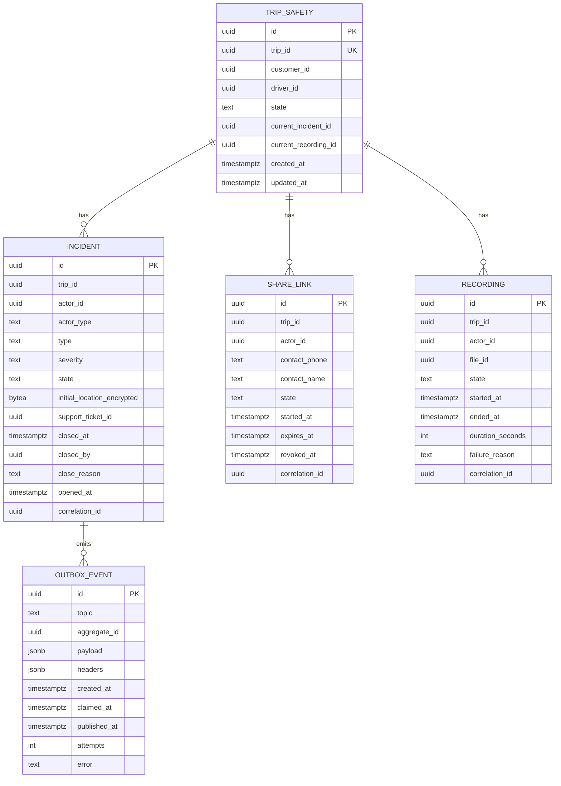

# ride-safety-service — Entity-Relationship Diagram

## 1. Database

- Engine: PostgreSQL 18
- Schema: `ride_safety` (owned exclusively by this service).
- Migrations: `services/ride-safety-service/migrations/`.

## 2. Cross-Service References

| Column | Type | Refers to | Source of truth |
|--------|------|-----------|------------------|
| `trips.trip_id` | UUID (UNIQUE) | `trip` in `trip-service` | `trip-service` |
| `trips.customer_id` | UUID | `customer` in `customer-service` | `customer-service` |
| `trips.driver_id` | UUID | `driver` in `driver-service` | `driver-service` |
| `incidents.trip_id` | UUID | `trip` in `trip-service` | `trip-service` |
| `incidents.actor_id` | UUID | the actor (customer / driver) | the actor's service |
| `share_links.trip_id` | UUID | `trip` in `trip-service` | `trip-service` |
| `recordings.trip_id` | UUID | `trip` in `trip-service` | `trip-service` |
| `recordings.file_id` | UUID | `file` in `file-service` | `file-service` |

## 3. Entities

### `TripSafety`

The per-trip safety state.

#### Columns

| Column | Type | Constraints | Notes |
|--------|------|-------------|-------|
| `id` | UUID | PK | UUIDv7 |
| `trip_id` | UUID | NOT NULL, UNIQUE | one row per trip |
| `customer_id` | UUID | NOT NULL | |
| `driver_id` | UUID | NOT NULL | |
| `state` | TEXT | NOT NULL, CHECK (state IN ('active','in_incident','recording','closed')) | |
| `current_incident_id` | UUID | NULL | FK to `incidents.id` |
| `current_recording_id` | UUID | NULL | FK to `recordings.id` |
| `created_at` | TIMESTAMPTZ | NOT NULL DEFAULT now() | |
| `updated_at` | TIMESTAMPTZ | NOT NULL DEFAULT now() | |

#### Indexes

- PK on `id`
- UNIQUE on `trip_id`
- `idx_trip_safety_state` on `(state)`

### `Incident`

A safety incident (SOS, etc.). Append-only.

#### Columns

| Column | Type | Constraints | Notes |
|--------|------|-------------|-------|
| `id` | UUID | PK | UUIDv7 |
| `trip_id` | UUID | NOT NULL | |
| `actor_id` | UUID | NOT NULL | customer or driver |
| `actor_type` | TEXT | NOT NULL, CHECK (actor_type IN ('customer','driver')) | |
| `type` | TEXT | NOT NULL, CHECK (type IN ('sos','no_show','vehicle_issue','other')) | |
| `severity` | TEXT | NOT NULL, CHECK (severity IN ('low','medium','high','critical')) | |
| `state` | TEXT | NOT NULL, CHECK (state IN ('open','closed')) | |
| `initial_location_encrypted` | BYTEA | NULL | per-column encryption (AES-GCM) |
| `support_ticket_id` | UUID | NULL | set when ticket is opened |
| `closed_at` | TIMESTAMPTZ | NULL | |
| `closed_by` | UUID | NULL | admin |
| `close_reason` | TEXT | NULL | |
| `opened_at` | TIMESTAMPTZ | NOT NULL DEFAULT now() | |
| `correlation_id` | UUID | NOT NULL | |

#### Indexes

- PK on `id`
- `idx_incident_trip` on `(trip_id, opened_at DESC)`
- `idx_incident_state` on `(state)` partial `WHERE state = 'open'`

### `ShareLink`

A share-trip activation.

#### Columns

| Column | Type | Constraints | Notes |
|--------|------|-------------|-------|
| `id` | UUID | PK | UUIDv7 |
| `trip_id` | UUID | NOT NULL | |
| `actor_id` | UUID | NOT NULL | |
| `contact_phone` | TEXT | NOT NULL | trusted contact |
| `contact_name` | TEXT | NULL | |
| `state` | TEXT | NOT NULL, CHECK (state IN ('active','expired','revoked')) | |
| `started_at` | TIMESTAMPTZ | NOT NULL DEFAULT now() | |
| `expires_at` | TIMESTAMPTZ | NULL | when the trip ends |
| `revoked_at` | TIMESTAMPTZ | NULL | |
| `correlation_id` | UUID | NOT NULL | |

#### Indexes

- PK on `id`
- `idx_share_link_trip` on `(trip_id)`

### `Recording`

An audio recording.

#### Columns

| Column | Type | Constraints | Notes |
|--------|------|-------------|-------|
| `id` | UUID | PK | UUIDv7 |
| `trip_id` | UUID | NOT NULL | |
| `actor_id` | UUID | NOT NULL | |
| `file_id` | UUID | NULL | set when storage is reserved |
| `state` | TEXT | NOT NULL, CHECK (state IN ('pending','recording','finalized','failed')) | |
| `started_at` | TIMESTAMPTZ | NOT NULL DEFAULT now() | |
| `ended_at` | TIMESTAMPTZ | NULL | |
| `duration_seconds` | INT | NULL | |
| `failure_reason` | TEXT | NULL | |
| `correlation_id` | UUID | NOT NULL | |

#### Indexes

- PK on `id`
- `idx_recording_trip` on `(trip_id, started_at DESC)`

### `OutboxEvent`

#### Columns

| Column | Type | Constraints | Notes |
|--------|------|-------------|-------|
| `id` | UUID | PK | UUIDv7 |
| `topic` | TEXT | NOT NULL | |
| `aggregate_id` | UUID | NOT NULL | partition key = `trip_id` |
| `payload` | JSONB | NOT NULL | |
| `headers` | JSONB | NOT NULL DEFAULT '{}'::jsonb | |
| `created_at` | TIMESTAMPTZ | NOT NULL DEFAULT now() | |
| `claimed_at` | TIMESTAMPTZ | NULL | |
| `published_at` | TIMESTAMPTZ | NULL | |
| `attempts` | INT | NOT NULL DEFAULT 0 | |
| `error` | TEXT | NULL | |

## 4. Mermaid ER Diagram



## 5. DDL Sketch

```sql
CREATE SCHEMA IF NOT EXISTS ride_safety;
SET search_path TO ride_safety;

CREATE TABLE ride_safety.trip_safety (
    id UUID PRIMARY KEY,
    trip_id UUID NOT NULL UNIQUE,
    customer_id UUID NOT NULL,
    driver_id UUID NOT NULL,
    state TEXT NOT NULL,
    current_incident_id UUID,
    current_recording_id UUID,
    created_at TIMESTAMPTZ NOT NULL DEFAULT now(),
    updated_at TIMESTAMPTZ NOT NULL DEFAULT now(),
    CONSTRAINT chk_trip_safety_state CHECK (state IN
        ('active','in_incident','recording','closed'))
);
CREATE INDEX idx_trip_safety_state ON ride_safety.trip_safety (state);

CREATE TABLE ride_safety.incidents (
    id UUID NOT NULL,
    trip_id UUID NOT NULL,
    actor_id UUID NOT NULL,
    actor_type TEXT NOT NULL,
    type TEXT NOT NULL,
    severity TEXT NOT NULL,
    state TEXT NOT NULL,
    initial_location_encrypted BYTEA,
    support_ticket_id UUID,
    closed_at TIMESTAMPTZ,
    closed_by UUID,
    close_reason TEXT,
    reported_at TIMESTAMPTZ NOT NULL DEFAULT now(),
    opened_at TIMESTAMPTZ NOT NULL DEFAULT now(),
    correlation_id UUID NOT NULL,
    PRIMARY KEY (id, reported_at),
    CONSTRAINT chk_incident_actor_type CHECK (actor_type IN ('customer','driver')),
    CONSTRAINT chk_incident_type CHECK (type IN
        ('sos','no_show','vehicle_issue','other')),
    CONSTRAINT chk_incident_severity CHECK (severity IN
        ('low','medium','high','critical')),
    CONSTRAINT chk_incident_state CHECK (state IN ('open','closed'))
) PARTITION BY RANGE (reported_at);
CREATE INDEX idx_incident_trip ON ride_safety.incidents (trip_id, opened_at DESC);
CREATE INDEX idx_incident_state ON ride_safety.incidents (state)
    WHERE state = 'open';

CREATE TABLE IF NOT EXISTS ride_safety.incidents_2026_08 PARTITION OF ride_safety.incidents FOR VALUES FROM ('2026-08-01 00:00:00+00') TO ('2026-09-01 00:00:00+00');

CREATE TABLE ride_safety.share_links (
    id UUID PRIMARY KEY,
    trip_id UUID NOT NULL,
    actor_id UUID NOT NULL,
    contact_phone TEXT NOT NULL,
    contact_name TEXT,
    state TEXT NOT NULL,
    started_at TIMESTAMPTZ NOT NULL DEFAULT now(),
    expires_at TIMESTAMPTZ,
    revoked_at TIMESTAMPTZ,
    correlation_id UUID NOT NULL,
    CONSTRAINT chk_share_link_state CHECK (state IN
        ('active','expired','revoked'))
);
CREATE INDEX idx_share_link_trip ON ride_safety.share_links (trip_id);

CREATE TABLE ride_safety.recordings (
    id UUID NOT NULL,
    trip_id UUID NOT NULL,
    actor_id UUID NOT NULL,
    file_id UUID,
    state TEXT NOT NULL,
    recorded_at TIMESTAMPTZ NOT NULL DEFAULT now(),
    started_at TIMESTAMPTZ NOT NULL DEFAULT now(),
    ended_at TIMESTAMPTZ,
    duration_seconds INT,
    failure_reason TEXT,
    correlation_id UUID NOT NULL,
    PRIMARY KEY (id, recorded_at),
    CONSTRAINT chk_recording_state CHECK (state IN
        ('pending','recording','finalized','failed'))
) PARTITION BY RANGE (recorded_at);
CREATE INDEX idx_recording_trip ON ride_safety.recordings (trip_id, started_at DESC);

CREATE TABLE IF NOT EXISTS ride_safety.recordings_2026_08 PARTITION OF ride_safety.recordings FOR VALUES FROM ('2026-08-01 00:00:00+00') TO ('2026-09-01 00:00:00+00');

CREATE TABLE ride_safety.outbox (
    id UUID PRIMARY KEY,
    topic TEXT NOT NULL,
    aggregate_id UUID NOT NULL,
    payload JSONB NOT NULL,
    headers JSONB NOT NULL DEFAULT '{}'::jsonb,
    created_at TIMESTAMPTZ NOT NULL DEFAULT now(),
    claimed_at TIMESTAMPTZ,
    published_at TIMESTAMPTZ,
    attempts INT NOT NULL DEFAULT 0,
    error TEXT
);
CREATE INDEX idx_outbox_pending
    ON ride_safety.outbox (created_at)
    WHERE published_at IS NULL;
```

## 6. Audit Columns

Every mutable table has `created_at`, `updated_at`. Incidents,
share links, and recordings are append-only.

## 7. Soft Delete

Not used. Incidents are immutable.

## 8. JSONB Usage

- `outbox.payload`: full event envelope.

## 9. Partitioning

| Table | Strategy | Cadence | Pre-create | Retention |
|-------|----------|---------|------------|-----------|
| `incidents` | RANGE on `reported_at` | monthly | 12 months | 7 years (regulatory) |
| `recordings` | RANGE on `recorded_at` | monthly | 12 months | 1 year |

> See [DATABASE_ARCHITECTURE.md §"Table Partitioning — Canonical Template"](../../architecture/DATABASE_ARCHITECTURE.md) for the idempotent CREATE TABLE IF NOT EXISTS … PARTITION OF … pattern, naming convention, and the service-owned maintenance-job contract.

## 10. Data Retention

| Table | Retention | Purged by |
|-------|-----------|-----------|
| `trip_safety` | 7 years | with the trip |
| `incidents` | 7 years | regulatory; with the trip |
| `share_links` | 1 year | scheduled |
| `recordings` | 1 year (the `file_id` blob is deleted with the row) | scheduled |
| `outbox` | 24h after publish | poller purge |

## 11. Migration Considerations

- The `state` CHECK is the source of truth for the safety state
  machine; adding a new state requires a multi-step migration.
- The encrypted location column is `BYTEA`; the encryption key is
  managed by the platform's KMS.
- The `file_id` is a cross-service reference; the actual audio is
  in `file-service`.

---

## See also

### Sibling docs for this service

- [`README.md`](./README.md) — purpose, bounded context, responsibilities
- [`BRD.md`](./BRD.md) — business requirements
- [`SRS.md`](./SRS.md) — functional + non-functional requirements
- [`ERD.md`](./ERD.md) — data model (entities, relationships)
- [`INTEGRATION.md`](./INTEGRATION.md) — inter-service contracts (APIs, events, sagas)
- [`WORKFLOWS.md`](./WORKFLOWS.md) — operational workflows (happy paths, failure modes)
- [`TECH.md`](./TECH.md) — technology profile (runtime, libraries, data layer, admin endpoints, RBAC)

### Platform-wide

- [`../../shared/README.md`](../../shared/README.md) — `platform-spring-boot-starter` shared library (the single source of cross-cutting code for all Spring Boot services in the platform)
- [`../RECOMMENDATIONS.md`](../RECOMMENDATIONS.md) — platform-wide technology map (language, framework, version baseline, admin/RBAC pattern)
- [`../../README.md`](../../README.md) — services overview (the catalog of all 58 services)
- [`../../../main.md`](../../../main.md) — top-level platform specification (architecture, Keycloak, PostgreSQL 18, messaging, observability baseline)

