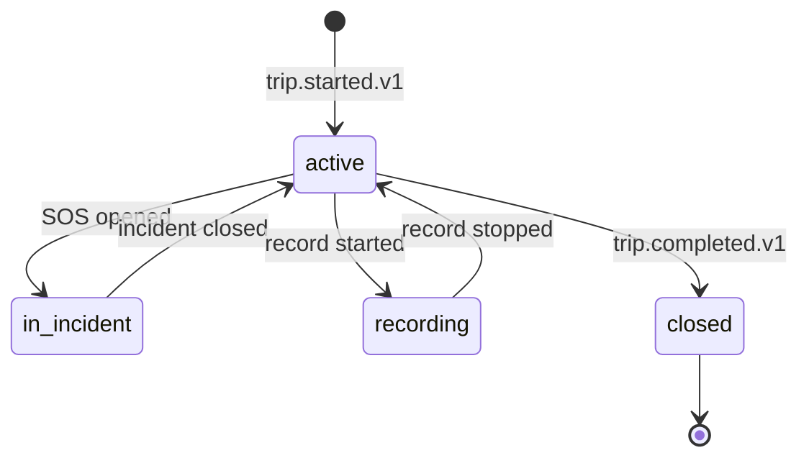

# ride-safety-service — Software Requirements Specification

## 1. Introduction

This document specifies the requirements for `ride-safety-service`.
The service is on the critical path for life-safety events; the
implementation must be fast, reliable, and audited.

## 2. Scope

In scope:

- Trip safety state.
- SOS.
- Share-trip.
- Audio recording.
- Incident opening and audit.

Out of scope:

- The trip aggregate.
- Driver / customer profile.
- General support queue.

## 3. System Context

```mermaid
flowchart LR
    C[Customer app] --> RS[ride-safety-service]
    DR[Driver app] --> RS
    TR[trip-service] -. trip.started.v1 / trip.completed.v1 .-> RS
    RS --> TR
    RS --> CST[customer-service]
    RS --> DL[driver-location-service]
    RS --> FS[file-service]
    RS -. ride.safety.*.v1 .-> K[(Kafka)]
    K --> NOT[notification-service]
    K --> SUP[support-service]
    K --> AUD[audit-service]
```

## 4. Actors

- **Customer app** — JWT role `customer`. SOS, share, record.
- **Driver app** — JWT role `driver`. SOS, share, record.
- **Trust & Safety** — JWT role `safety_agent`. Read all.
- **Admin / support** — read; close with reason.
- **`trip-service`** — system actor via events.
- **`customer-service`**, **`driver-location-service`**, **`file-service`**
  — system actors via REST.

## 5. Functional Requirements

| ID | Requirement | Priority |
|----|-------------|----------|
| FR--001 | On `trip.started.v1`, create a `ride_safety.trips` row with `state=active`. | MUST |
| FR--002 | On `trip.completed.v1`, mark `state=closed`. | MUST |
| FR--003 | `POST /v1/safety/sos` with `{trip_id, location, type}`; notify trusted contacts, open P1 ticket, persist incident, page on-call. | MUST |
| FR--004 | `POST /v1/safety/share` with `{trip_id, contact}`; send SMS with live location link. | MUST |
| FR--005 | `POST /v1/safety/record` with `{trip_id, start}`; reserve storage, stream audio to `file-service` (encrypted). | MUST |
| FR--006 | On recording end, finalize and emit `ride.safety.recording.finalized.v1`. | MUST |
| FR--007 | `GET /v1/safety/trips/{trip_id}` returns the trip safety state. | MUST |
| FR--008 | `GET /v1/safety/incidents/{id}` returns the incident. | MUST |
| FR--009 | `POST /v1/safety/incidents/{id}/close` with reason; admin only. | MUST |
| FR--010 | Reject all invalid state transitions with 409 `STATE_INVALID`. | MUST |
| FR--011 | All events go through the transactional outbox. | MUST |
| FR--012 | All artifacts encrypted at rest (per-column for location; encrypted blob in `file-service` for audio). | MUST |
| FR--013 | SOS is always P1 severity. | MUST |
| FR--014 | Live location preserved for the duration of an incident. | MUST |

## 6. Non-Functional Requirements

| ID | Category | Requirement | Target |
|----|----------|-------------|--------|
| NFR--001 | performance | P99 SOS latency (notify + ticket) | ≤ 60s |
| NFR--002 | performance | P95 share latency | ≤ 5s |
| NFR--003 | performance | P95 record start latency | ≤ 1s |
| NFR--004 | availability | uptime | 99.95% (Tier-1) |
| NFR--005 | scalability | concurrent active trips | 200k per region |
| NFR--006 | maintainability | MTTR for a bad deploy | ≤ 15 minutes |
| NFR--007 | observability | tracing coverage | 100% |

## 7. API Requirements

REST per `architecture/API_STANDARDS.md`. `Idempotency-Key` required
on `POST /v1/safety/sos`, `POST /v1/safety/share`,
`POST /v1/safety/record`. Errors use the standard envelope. Full
contract in `INTEGRATION.md`.

## 8. Data Requirements

| ID | Requirement | Notes |
|----|-------------|-------|
| DATA--001 | All PKs are UUIDv7 | |
| DATA--002 | All timestamps `timestamptz` UTC | RFC3339 at the wire |
| DATA--003 | Cross-service refs (`trip_id`, `customer_id`, `driver_id`) as UUID without FKs | |
| DATA--004 | Precise location encrypted at rest (per-column) | |
| DATA--005 | Audio recordings stored as encrypted blobs in `file-service`; only the `file_id` is stored here | |
| DATA--006 | Audit columns on every mutable table | platform standard |
| DATA--007 | Incidents are append-only | immutable |

## 9. Validation Rules

- `trip_id` must exist and be in `in_progress`.
- The actor (customer / driver) must be a participant of the trip.
- `share.contact` must be in the actor's trusted contacts.
- `record.start` is allowed only in `in_progress`.

## 10. State Transitions



## 11. Authorization Requirements

- Customer / driver can trigger SOS / share / record for own trip.
- Safety / admin / support can read all.
- Admin can close with reason.

## 12. Configuration Requirements

Consumed from `configuration-service` and refreshed on
`configuration.updated.v1`. See `README.md` §13.

## 13. Error Handling

| Error | Response | Recovery |
|-------|----------|----------|
| Trip not in `in_progress` | 409 `STATE_INVALID` | none |
| Not a participant | 403 `FORBIDDEN` | none |
| Trusted contact SMS fails | log; retry with push | on total failure, log |
| `file-service` down | retry; on persistent, store locally and upload later | |
| `support-service` down | retry; on persistent, page on-call | |

## 14. Concurrency Requirements

- One `ride_safety.trips` row per trip; row lock serialises.
- The SOS handler is idempotent by `event_id` (if a duplicate
  arrives, no new incident is opened).

## 15. Idempotency Requirements

- `Idempotency-Key` required on all POSTs.
- All event handlers are idempotent by `event_id`.

## 16. Performance

- Dominant path: SOS (notify + ticket).
- P50 / P95 / P99: 10s / 30s / 60s.

## 17. Scalability

- Horizontal: stateless, scale by HPA on
  `ride_safety_sos_seconds_p99` and CPU.
- The trusted-contacts fan-out is bounded by
  `notify_trusted_contacts_max`.

## 18. Availability

- SLO: 99.95% over 30 days.
- Error budget: ~22 minutes per 30 days.
- Maintenance window: weekly Sun 04:00–06:00 UTC.

## 19. Security

| ID | Requirement | Notes |
|----|-------------|-------|
| SEC--001 | All endpoints require a valid JWT bearer token | gateway validates |
| SEC--002 | Participant check is enforced (customer/driver on the trip) | |
| SEC--003 | Precise location encrypted at rest (per-column encryption) | |
| SEC--004 | Audio recordings encrypted at rest (encrypted blob in `file-service`) | |
| SEC--005 | Admin actions require `X-Audit-Reason` | |
| SEC--006 | Idempotency keys are opaque UUIDs | |
| SEC--007 | TLS 1.3 at edge; mTLS in cluster | platform standard |

## 20. Privacy

- PII stored: precise location (encrypted), audio (encrypted
  blob), trusted contacts.
- Retention: 7 years for incidents (regulatory).
- Erasure: per GDPR, identifiers are erased; the encrypted blobs
  are deleted with audit.

## 21. Auditability

- Every SOS / share / record / incident is audited with
  `correlation_id`, `trip_id`, `actor_id`, `actor_type`.
- Every admin action is logged at `warn` and emitted to
  `audit-service`.

## 22. Observability

- Logs: JSON to stdout with `correlation_id`, `service`,
  `version`, `route`, `latency_ms`, `status`.
- Metrics: see `README.md` §15.
- Traces: OpenTelemetry.
- Alerts: SLO burn-rate, SOS latency, on-call page rate,
  recording storage failure rate.

## 23. Maintainability

- Code style: TypeScript with `strict: true`; ESLint + Prettier.
- Test coverage: ≥ 80% line / branch; 100% on the SOS path.
- Documentation: this folder.

## 24. Disaster Recovery

- RPO: ≤ 1 minute.
- RTO: ≤ 15 minutes. The trip safety state is recoverable from
  the events.

## 25. Acceptance Criteria

- An SOS notifies trusted contacts within 60s p99.
- An SOS opens a P1 ticket within 60s p99.
- Audio recordings are encrypted at rest.
- Live location is preserved for the duration of an incident.
- Every SOS / share / record is audited.

---

## See also

### Sibling docs for this service

- [`README.md`](./README.md) — purpose, bounded context, responsibilities
- [`BRD.md`](./BRD.md) — business requirements
- [`SRS.md`](./SRS.md) — functional + non-functional requirements
- [`ERD.md`](./ERD.md) — data model (entities, relationships)
- [`INTEGRATION.md`](./INTEGRATION.md) — inter-service contracts (APIs, events, sagas)
- [`WORKFLOWS.md`](./WORKFLOWS.md) — operational workflows (happy paths, failure modes)
- [`TECH.md`](./TECH.md) — technology profile (runtime, libraries, data layer, admin endpoints, RBAC)

### Platform-wide

- [`../../shared/README.md`](../../shared/README.md) — `platform-spring-boot-starter` shared library (the single source of cross-cutting code for all Spring Boot services in the platform)
- [`../RECOMMENDATIONS.md`](../RECOMMENDATIONS.md) — platform-wide technology map (language, framework, version baseline, admin/RBAC pattern)
- [`../../README.md`](../../README.md) — services overview (the catalog of all 58 services)
- [`../../../main.md`](../../../main.md) — top-level platform specification (architecture, Keycloak, PostgreSQL 18, messaging, observability baseline)

