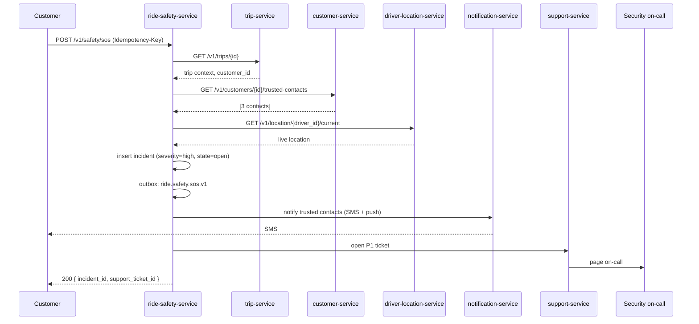
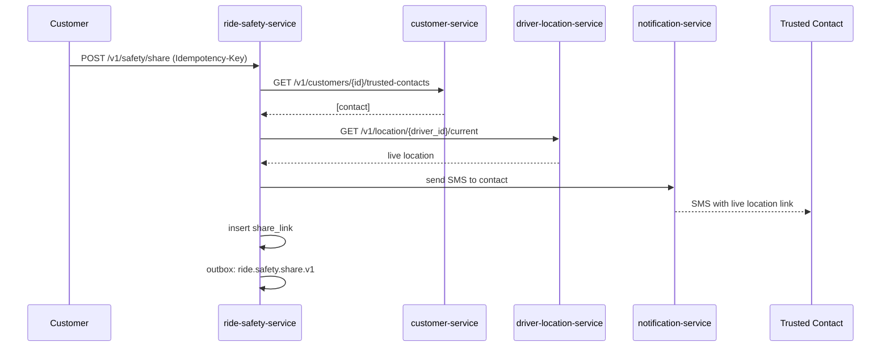
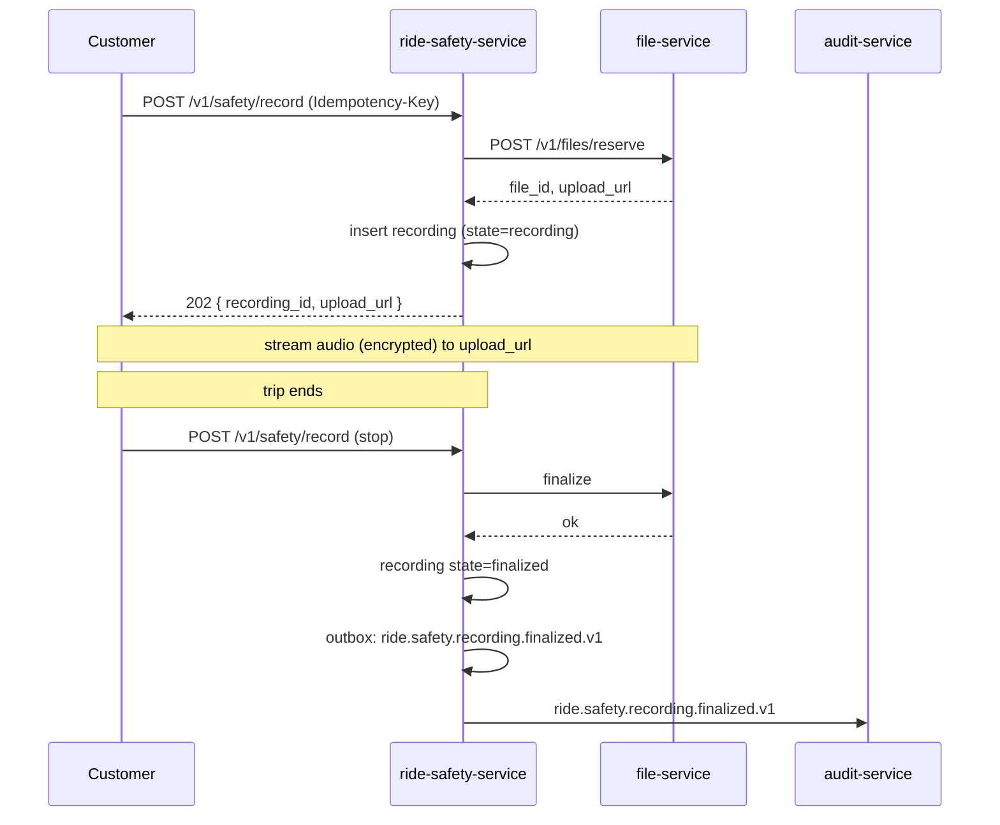
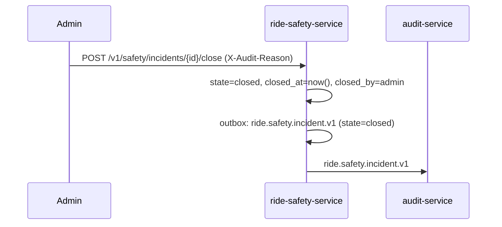
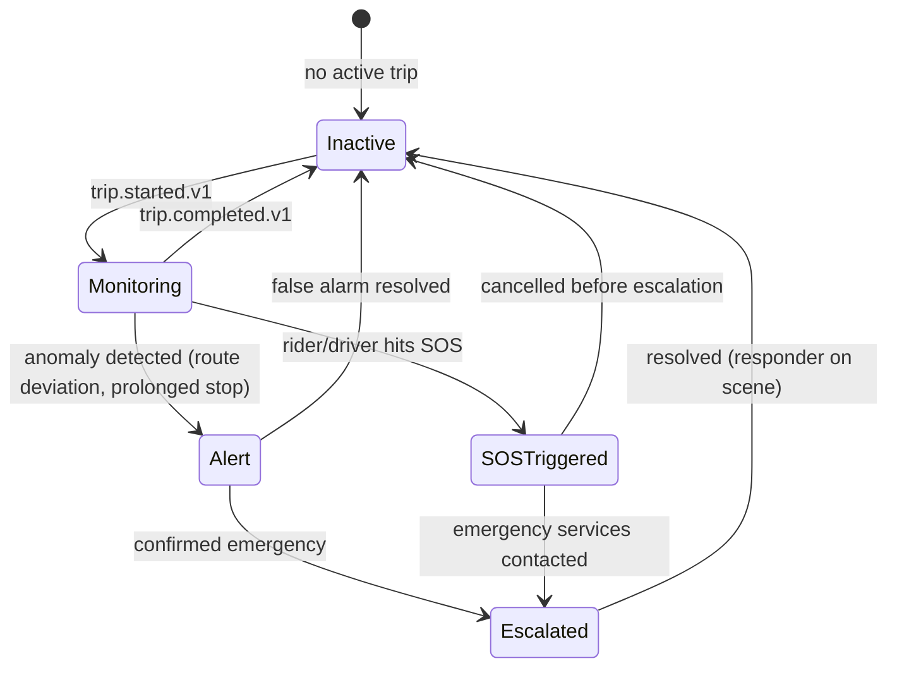

# ride-safety-service — Workflows

## 1. Customer SOS During a Ride

### 1.1 Objective

Respond to a customer SOS within 60 seconds: notify trusted
contacts, open a P1 support ticket, page on-call, persist the
incident.

### 1.2 Initiating Actor

The customer app.

### 1.3 Participating Services

- `ride-safety-service` (this service)
- `trip-service` (get trip context)
- `customer-service` (trusted contacts)
- `driver-location-service` (live location)
- `notification-service` (notify trusted contacts)
- `support-service` (open P1 ticket)
- `audit-service` (audit)

### 1.4 Prerequisites

- The trip is in `in_progress`.
- The customer is the trip's customer.

### 1.5 Happy Path



### 1.6 Alternate Paths

- Trip not in `in_progress`: 409 `STATE_INVALID`.
- Customer not the trip's customer: 403 `FORBIDDEN`.
- No trusted contacts on file: log; still open the ticket and
  page on-call.

### 1.7 Failure Paths

- Trusted contact SMS fails: retry with push; on total failure,
  log.
- `support-service` down: retry; on persistent failure, page
  on-call directly via PagerDuty.
- `notification-service` down: retry; on persistent failure, log;
  the customer is told the SMS is in progress.

### 1.8 Business Rules

- BR--012, BR--013, BR--014.

### 1.9 State Transitions

`active → in_incident`.

### 1.10 Events

| Event | Direction | When |
|-------|-----------|------|
| `ride.safety.sos.v1` | produced | on SOS |
| `ride.safety.incident.v1` | produced | on open |

### 1.11 APIs Involved

| API | Direction | When |
|-----|-----------|------|
| `POST /v1/safety/sos` | inbound | trigger |
| `GET /v1/trips/{id}` | outbound | context |
| `GET /v1/customers/{id}/trusted-contacts` | outbound | contacts |
| `GET /v1/location/{driver_id}/current` | outbound | live location |

### 1.12 Compensation / Rollback

If the incident insert succeeds but the notifications fail, the
incident is still open; the reconciliation job retries the
notifications.

### 1.13 Final State

`in_incident`. The incident row is open; trusted contacts have
been notified; the P1 ticket is open; on-call has been paged.

## 2. Share Trip

### 2.1 Objective

Allow a customer or driver to share the trip's live location with
a trusted contact via SMS.

### 2.2 Initiating Actor

The customer or driver app.

### 2.3 Participating Services

- `ride-safety-service` (this service)
- `customer-service` or `driver-service` (trusted contacts)
- `notification-service` (SMS)
- `driver-location-service` (live location)

### 2.4 Prerequisites

- The trip is in `in_progress`.
- The contact is in the actor's trusted contacts.

### 2.5 Happy Path



### 2.6 Alternate Paths

- Contact not in trusted contacts: 422 `CONTACT_NOT_TRUSTED`.
- Trip not in `in_progress`: 409 `STATE_INVALID`.

### 2.7 Failure Paths

- `notification-service` down: retry; on persistent failure, log.

### 2.8 Business Rules

- BR--016.

### 2.9 State Transitions

N/A (the `share_link` row is `active` until the trip ends or the
user revokes).

### 2.10 Events

| Event | Direction | When |
|-------|-----------|------|
| `ride.safety.share.v1` | produced | on share |

### 2.11 APIs Involved

| API | Direction | When |
|-----|-----------|------|
| `POST /v1/safety/share` | inbound | trigger |
| `GET /v1/customers/{id}/trusted-contacts` | outbound | contacts |
| `GET /v1/location/{driver_id}/current` | outbound | live location |

### 2.12 Compensation / Rollback

If the SMS fails, the share link is still active; the contact can
load it later.

### 2.13 Final State

`share_link` is `active`. The contact receives the SMS.

## 3. Audio Recording

### 3.1 Objective

Allow a customer or driver to record the trip audio for
incident-investigation purposes.

### 3.2 Initiating Actor

The customer or driver app.

### 3.3 Participating Services

- `ride-safety-service` (this service)
- `file-service` (encrypted storage)
- `audit-service` (audit)

### 3.4 Prerequisites

- The trip is in `in_progress`.

### 3.5 Happy Path



### 3.6 Alternate Paths

- Trip not in `in_progress`: 409 `STATE_INVALID`.
- Max duration reached: auto-stop; finalise.

### 3.7 Failure Paths

- `file-service` down: retry; on persistent failure, store the
  audio locally and upload on next launch (the driver app's
  local cache handles this).

### 3.8 Business Rules

- BR--017.

### 3.9 State Transitions

`active → recording → active` (on stop) or `→ closed` (on trip
end).

### 3.10 Events

| Event | Direction | When |
|-------|-----------|------|
| `ride.safety.recording.finalized.v1` | produced | on finalize |

### 3.11 APIs Involved

| API | Direction | When |
|-----|-----------|------|
| `POST /v1/safety/record` | inbound | start / stop |
| `POST /v1/files/reserve` | outbound | reserve |
| `PUT (upload URL)` | outbound | stream |

### 3.12 Compensation / Rollback

If the reservation fails, no recording is started.

### 3.13 Final State

`recording.state=finalized`; the encrypted blob is in
`file-service`; the audit event is emitted.

## 4. Incident Close

### 4.1 Objective

Allow an admin to close an incident with a reason.

### 4.2 Initiating Actor

Admin (via the support console).

### 4.3 Participating Services

- `ride-safety-service` (this service)
- `audit-service` (audit)

### 4.4 Prerequisites

- The incident is `open`.
- The admin has the right role and a reason.

### 4.5 Happy Path



### 4.6 Alternate Paths

- Already closed: 409 `STATE_INVALID`.

### 4.7 Failure Paths

- DB down: retry; on persistent failure, page on-call.

### 4.8 Business Rules

- BR--020.

### 4.9 State Transitions

`open → closed`.

### 4.10 Events

| Event | Direction | When |
|-------|-----------|------|
| `ride.safety.incident.v1` | produced | on close |

### 4.11 APIs Involved

| API | Direction | When |
|-----|-----------|------|
| `POST /v1/safety/incidents/{id}/close` | inbound | trigger |

### 4.12 Compensation / Rollback

N/A.

### 4.13 Final State

`closed`. The trip safety state returns to `active` (or
`closed` if the trip has ended).


## 99. Trip Safety State Machine

This state machine summarizes the service's internal
state transitions (across all workflows above).



---

## 99. `Monthly Partition Maintenance`

### 99.1 Objective

Idempotently pre-create the next 12 monthly child partitions for partitioned tables in `ride_safety`.

### 99.2 Initiating Actor

A scheduled job runs daily at `02:00 UTC`. Leader-elected via `pg_try_advisory_xact_lock(hashtext('ride_safety.partition'), hashtext('monthly'))`.

### 99.3 Happy Path

```mermaid
sequenceDiagram
    participant JOB as Partition job
    participant PG as PostgreSQL
    JOB->>PG: pg_try_advisory_xact_lock('ride_safety.monthly')
    alt lock acquired
        loop for each missing month in next 12
            JOB->>PG: CREATE TABLE IF NOT EXISTS ride_safety.<table>_YYYY_MM PARTITION OF ride_safety.<table>
            JOB->>PG: verify (pg_inherits, relpartbound)
        end
        JOB->>PG: assert now() in existing child
    else lock NOT acquired
        Note over JOB: another instance is running; exit cleanly
    end
```

### 99.4 Failure Paths

| Failure | Handling |
|---------|----------|
| Lock contention | exit 0 |
| DDL fails | retry 3× with backoff (1 s / 4 s / 16 s); page on-call |
| Today's child missing | critical alert; INSERTs would fail |

### 99.5 Business Rules

- Pre-create 12 complete future months.
- Every child is created with `CREATE TABLE IF NOT EXISTS … PARTITION OF …`.
- A verification step (`pg_inherits` parent + `relpartbound` range) runs after every `CREATE TABLE IF NOT EXISTS`.
- Optionally emit `audit.partition.maintained.v1` on success.

---

## See also

### Sibling docs for this service

- [`README.md`](./README.md) — purpose, bounded context, responsibilities
- [`BRD.md`](./BRD.md) — business requirements
- [`SRS.md`](./SRS.md) — functional + non-functional requirements
- [`ERD.md`](./ERD.md) — data model (entities, relationships)
- [`INTEGRATION.md`](./INTEGRATION.md) — inter-service contracts (APIs, events, sagas)
- [`WORKFLOWS.md`](./WORKFLOWS.md) — operational workflows (happy paths, failure modes)
- [`TECH.md`](./TECH.md) — technology profile (runtime, libraries, data layer, admin endpoints, RBAC)

### Platform-wide

- [`../../shared/README.md`](../../shared/README.md) — `platform-spring-boot-starter` shared library (the single source of cross-cutting code for all Spring Boot services in the platform)
- [`../RECOMMENDATIONS.md`](../RECOMMENDATIONS.md) — platform-wide technology map (language, framework, version baseline, admin/RBAC pattern)
- [`../../README.md`](../../README.md) — services overview (the catalog of all 58 services)
- [`../../../main.md`](../../../main.md) — top-level platform specification (architecture, Keycloak, PostgreSQL 18, messaging, observability baseline)

