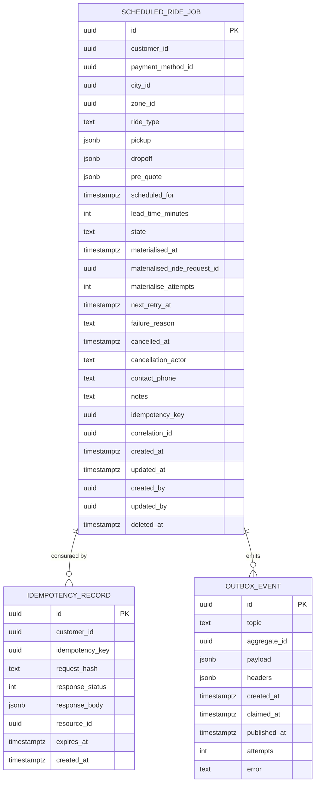

# scheduled-ride-service — Entity-Relationship Diagram

## 1. Database

- Engine: PostgreSQL 18
- Schema: `scheduled_ride` (owned exclusively by this service).
- Migrations: `services/scheduled-ride-service/migrations/`.

## 2. Cross-Service References

| Column | Type | Refers to | Source of truth |
|--------|------|-----------|------------------|
| `jobs.customer_id` | UUID | `customer` in `customer-service` | `customer-service` |
| `jobs.payment_method_id` | UUID (nullable) | `payment_method` in `payment-service` | `payment-service` |
| `jobs.materialised_ride_request_id` | UUID (nullable) | `ride_request` in `ride-request-service` | `ride-request-service` |
| `idempotency.customer_id` | UUID | `customer` in `customer-service` | `customer-service` |

## 3. Entities

### `ScheduledRideJob`

A scheduled ride booking.

#### Columns

| Column | Type | Constraints | Notes |
|--------|------|-------------|-------|
| `id` | UUID | PK | UUIDv7 |
| `customer_id` | UUID | NOT NULL | |
| `payment_method_id` | UUID | NULL | |
| `city_id` | UUID | NOT NULL | |
| `zone_id` | UUID | NOT NULL | pickup zone |
| `ride_type` | TEXT | NOT NULL | |
| `pickup` | JSONB | NOT NULL | `{lat, lon, address, place_id}` |
| `dropoff` | JSONB | NOT NULL | same shape |
| `pre_quote` | JSONB | NULL | best-effort pre-quote |
| `scheduled_for` | TIMESTAMPTZ | NOT NULL | the pickup time |
| `lead_time_minutes` | INT | NOT NULL DEFAULT 15 | when the scheduler fires |
| `state` | TEXT | NOT NULL, CHECK (state IN ('pending','materialised','cancelled','failed','expired')) | state machine |
| `materialised_at` | TIMESTAMPTZ | NULL | when fired |
| `materialised_ride_request_id` | UUID | NULL | the resulting ride request |
| `materialise_attempts` | INT | NOT NULL DEFAULT 0 | increments per attempt |
| `next_retry_at` | TIMESTAMPTZ | NULL | for retries |
| `failure_reason` | TEXT | NULL | |
| `cancelled_at` | TIMESTAMPTZ | NULL | |
| `cancellation_actor` | TEXT | NULL, CHECK (cancellation_actor IS NULL OR cancellation_actor IN ('customer','admin','system','safety')) | |
| `contact_phone` | TEXT | NULL | optional |
| `notes` | TEXT | NULL | optional |
| `idempotency_key` | UUID | NOT NULL | client-supplied |
| `correlation_id` | UUID | NOT NULL | |
| `created_at` | TIMESTAMPTZ | NOT NULL DEFAULT now() | |
| `updated_at` | TIMESTAMPTZ | NOT NULL DEFAULT now() | |
| `created_by` | UUID | NOT NULL | customer |
| `updated_by` | UUID | NOT NULL | |
| `deleted_at` | TIMESTAMPTZ | NULL | soft delete |

#### Indexes

- PK on `id`
- `idx_scheduled_ride_scheduled_for_pending` on
  `(scheduled_for, state)` partial `WHERE state = 'pending'` —
  supports the scheduler sweep.
- `idx_scheduled_ride_customer_state` on `(customer_id, state)` —
  supports "upcoming" lists.
- `idx_scheduled_ride_correlation` on `(correlation_id)`

#### Constraints

- `CHECK (state IN ('pending','materialised','cancelled','failed','expired'))`
- `CHECK (cancellation_actor IS NULL OR cancellation_actor IN
  ('customer','admin','system','safety'))`
- `CHECK (lead_time_minutes > 0 AND lead_time_minutes < 1440)`
- `CHECK (scheduled_for > created_at + INTERVAL '15 minutes')`
- `CHECK (scheduled_for < created_at + INTERVAL '30 days')`

### `IdempotencyRecord`

Same shape as other services.

#### Columns

| Column | Type | Constraints | Notes |
|--------|------|-------------|-------|
| `id` | UUID | PK | UUIDv7 |
| `customer_id` | UUID | NOT NULL | |
| `idempotency_key` | UUID | NOT NULL | client key |
| `request_hash` | TEXT | NOT NULL | |
| `response_status` | INT | NOT NULL | |
| `response_body` | JSONB | NOT NULL | |
| `resource_id` | UUID | NULL | the job id |
| `expires_at` | TIMESTAMPTZ | NOT NULL | |
| `created_at` | TIMESTAMPTZ | NOT NULL DEFAULT now() | |

#### Indexes

- PK on `id`
- UNIQUE on `(customer_id, idempotency_key)`

### `OutboxEvent`

#### Columns

| Column | Type | Constraints | Notes |
|--------|------|-------------|-------|
| `id` | UUID | PK | UUIDv7 |
| `topic` | TEXT | NOT NULL | |
| `aggregate_id` | UUID | NOT NULL | partition key = `scheduled_ride_id` |
| `payload` | JSONB | NOT NULL | |
| `headers` | JSONB | NOT NULL DEFAULT '{}'::jsonb | |
| `created_at` | TIMESTAMPTZ | NOT NULL DEFAULT now() | |
| `claimed_at` | TIMESTAMPTZ | NULL | |
| `published_at` | TIMESTAMPTZ | NULL | |
| `attempts` | INT | NOT NULL DEFAULT 0 | |
| `error` | TEXT | NULL | |

## 4. Mermaid ER Diagram



## 5. DDL Sketch

```sql
CREATE SCHEMA IF NOT EXISTS scheduled_ride;
SET search_path TO scheduled_ride;

CREATE TABLE scheduled_ride.scheduled_rides (
    id UUID NOT NULL,
    customer_id UUID NOT NULL,
    payment_method_id UUID,
    city_id UUID NOT NULL,
    zone_id UUID NOT NULL,
    ride_type TEXT NOT NULL,
    pickup JSONB NOT NULL,
    dropoff JSONB NOT NULL,
    pre_quote JSONB,
    scheduled_for TIMESTAMPTZ NOT NULL,
    lead_time_minutes INT NOT NULL DEFAULT 15,
    state TEXT NOT NULL,
    materialised_at TIMESTAMPTZ,
    materialised_ride_request_id UUID,
    materialise_attempts INT NOT NULL DEFAULT 0,
    next_retry_at TIMESTAMPTZ,
    failure_reason TEXT,
    cancelled_at TIMESTAMPTZ,
    cancellation_actor TEXT,
    contact_phone TEXT,
    notes TEXT,
    idempotency_key UUID NOT NULL,
    correlation_id UUID NOT NULL,
    created_at TIMESTAMPTZ NOT NULL DEFAULT now(),
    updated_at TIMESTAMPTZ NOT NULL DEFAULT now(),
    created_by UUID NOT NULL,
    updated_by UUID NOT NULL,
    deleted_at TIMESTAMPTZ,
    PRIMARY KEY (id, scheduled_for),
    CONSTRAINT chk_scheduled_state CHECK (state IN
        ('pending','materialised','cancelled','failed','expired')),
    CONSTRAINT chk_scheduled_cancellation_actor CHECK (
        cancellation_actor IS NULL OR
        cancellation_actor IN ('customer','admin','system','safety')
    ),
    CONSTRAINT chk_scheduled_lead CHECK (lead_time_minutes > 0
        AND lead_time_minutes < 1440)
) PARTITION BY RANGE (scheduled_for);
CREATE INDEX idx_scheduled_ride_scheduled_for_pending
    ON scheduled_ride.scheduled_rides (scheduled_for, state)
    WHERE state = 'pending';
CREATE INDEX idx_scheduled_ride_customer_state
    ON scheduled_ride.scheduled_rides (customer_id, state);
CREATE INDEX idx_scheduled_ride_correlation
    ON scheduled_ride.scheduled_rides (correlation_id);

CREATE TABLE IF NOT EXISTS scheduled_ride.scheduled_rides_2026_08 PARTITION OF scheduled_ride.scheduled_rides FOR VALUES FROM ('2026-08-01 00:00:00+00') TO ('2026-09-01 00:00:00+00');

CREATE TABLE scheduled_ride.dispatch_attempts (
    id UUID NOT NULL,
    scheduled_ride_id UUID NOT NULL,
    attempt_number INT NOT NULL,
    attempted_at TIMESTAMPTZ NOT NULL DEFAULT now(),
    result TEXT,
    error_code TEXT,
    correlation_id UUID NOT NULL,
    PRIMARY KEY (id, attempted_at),
    CONSTRAINT chk_dispatch_attempt_result CHECK (
        result IS NULL OR result IN ('success','failure','retry')
    )
) PARTITION BY RANGE (attempted_at);

CREATE TABLE IF NOT EXISTS scheduled_ride.dispatch_attempts_2026_08 PARTITION OF scheduled_ride.dispatch_attempts FOR VALUES FROM ('2026-08-01 00:00:00+00') TO ('2026-09-01 00:00:00+00');
CREATE INDEX idx_scheduled_ride_scheduled_for_pending
    ON scheduled_ride.jobs (scheduled_for, state)
    WHERE state = 'pending';
CREATE INDEX idx_scheduled_ride_customer_state
    ON scheduled_ride.jobs (customer_id, state);
CREATE INDEX idx_scheduled_ride_correlation
    ON scheduled_ride.jobs (correlation_id);

CREATE TABLE scheduled_ride.idempotency (
    id UUID PRIMARY KEY,
    customer_id UUID NOT NULL,
    idempotency_key UUID NOT NULL,
    request_hash TEXT NOT NULL,
    response_status INT NOT NULL,
    response_body JSONB NOT NULL,
    resource_id UUID,
    expires_at TIMESTAMPTZ NOT NULL,
    created_at TIMESTAMPTZ NOT NULL DEFAULT now(),
    CONSTRAINT uq_idempotency UNIQUE (customer_id, idempotency_key)
);

CREATE TABLE scheduled_ride.outbox (
    id UUID PRIMARY KEY,
    topic TEXT NOT NULL,
    aggregate_id UUID NOT NULL,
    payload JSONB NOT NULL,
    headers JSONB NOT NULL DEFAULT '{}'::jsonb,
    created_at TIMESTAMPTZ NOT NULL DEFAULT now(),
    claimed_at TIMESTAMPTZ,
    published_at TIMESTAMPTZ,
    attempts INT NOT NULL DEFAULT 0,
    error TEXT
);
CREATE INDEX idx_outbox_pending
    ON scheduled_ride.outbox (created_at)
    WHERE published_at IS NULL;
```

## 6. Audit Columns

Every mutable table has `created_at`, `updated_at`, `created_by`,
`updated_by`. The state transitions are recorded in the
`scheduled_ride.jobs` row.

## 7. Soft Delete

`jobs.deleted_at` is the soft delete; the row stays for audit.

## 8. JSONB Usage

- `jobs.pickup`, `jobs.dropoff`: geocoded address + lat/lon +
  provider's place_id.
- `jobs.pre_quote`: best-effort quote at booking.
- `idempotency.response_body`: stored as JSONB for fidelity.
- `outbox.payload`: full event envelope.

## 9. Partitioning

| Table | Strategy | Cadence | Pre-create | Retention |
|-------|----------|---------|------------|-----------|
| `scheduled_rides` | RANGE on `scheduled_for` | monthly | 12 months | 7 years (financial) |
| `dispatch_attempts` | RANGE on `attempted_at` | monthly | 12 months | 7 years (with the ride) |

> See [DATABASE_ARCHITECTURE.md §"Table Partitioning — Canonical Template"](../../architecture/DATABASE_ARCHITECTURE.md) for the idempotent CREATE TABLE IF NOT EXISTS … PARTITION OF … pattern, naming convention, and the service-owned maintenance-job contract.

## 10. Data Retention

| Table | Retention | Purged by |
|-------|-----------|-----------|
| `jobs` | 7 years | financial; scheduled |
| `idempotency` | 24h | daily purge |
| `outbox` | 24h after publish | poller purge |

## 11. Migration Considerations

- Adding columns is online. Renaming or removing is multi-step.
- The `state` CHECK is the source of truth for the state
  machine; migrations that change the enum must add the new value
  as nullable first.
- The partial index on `(scheduled_for, state) WHERE state =
  'pending'` is critical for the scheduler; do not drop it.

---

## See also

### Sibling docs for this service

- [`README.md`](./README.md) — purpose, bounded context, responsibilities
- [`BRD.md`](./BRD.md) — business requirements
- [`SRS.md`](./SRS.md) — functional + non-functional requirements
- [`ERD.md`](./ERD.md) — data model (entities, relationships)
- [`INTEGRATION.md`](./INTEGRATION.md) — inter-service contracts (APIs, events, sagas)
- [`WORKFLOWS.md`](./WORKFLOWS.md) — operational workflows (happy paths, failure modes)
- [`TECH.md`](./TECH.md) — technology profile (runtime, libraries, data layer, admin endpoints, RBAC)

### Platform-wide

- [`../../shared/README.md`](../../shared/README.md) — `platform-spring-boot-starter` shared library (the single source of cross-cutting code for all Spring Boot services in the platform)
- [`../RECOMMENDATIONS.md`](../RECOMMENDATIONS.md) — platform-wide technology map (language, framework, version baseline, admin/RBAC pattern)
- [`../../README.md`](../../README.md) — services overview (the catalog of all 58 services)
- [`../../../main.md`](../../../main.md) — top-level platform specification (architecture, Keycloak, PostgreSQL 18, messaging, observability baseline)

