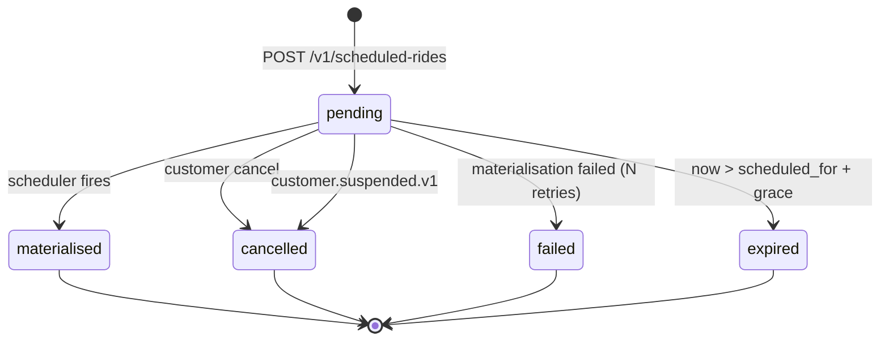

# scheduled-ride-service — Software Requirements Specification

## 1. Introduction

This document specifies the requirements for
`scheduled-ride-service`. The service owns future-dated bookings
and materialises them at the right time.

## 2. Scope

In scope:

- Scheduled ride jobs.
- The scheduler.
- Materialisation via `ride-request-service`.
- Cancellation.
- Customer notifications.

Out of scope:

- The ride request aggregate.
- Pricing.
- Dispatch.

## 3. System Context

```mermaid
flowchart LR
    C[Customer app] --> SR[scheduled-ride-service]
    SR --> CST[customer-service]
    SR --> PRC[pricing-service]
    SR --> ZN[zone-service]
    SR -. scheduled_ride.due.v1 .-> K[(Kafka)]
    K --> RR[ride-request-service]
    K --> NOT[notification-service]
    K --> SUP[support-service]
    CST -. customer.suspended.v1 .-> SR
```

## 4. Actors

- **Customer app** — JWT role `customer`. Book, view, cancel.
- **`ride-request-service`** — system actor via events.
- **`pricing-service`**, **`customer-service`**, **`zone-service`**
  — system actors via REST.
- **Admin / support** — read, force-cancel.

## 5. Functional Requirements

| ID | Requirement | Priority |
|----|-------------|----------|
| FR--001 | `POST /v1/scheduled-rides` with `{pickup, dropoff, ride_type, scheduled_for, payment_method_id}`; reject if `scheduled_for < now + 15min` or `> now + 30 days`. | MUST |
| FR--002 | On create, pre-quote via `pricing-service` (best-effort; non-blocking on failure). | SHOULD |
| FR--003 | On create, schedule a job to fire at `scheduled_for - lead_time_minutes`. | MUST |
| FR--004 | Scheduler sweep every 30s picks due jobs (`SELECT … FOR UPDATE SKIP LOCKED`). | MUST |
| FR--005 | On fire, emit `scheduled_ride.due.v1` with the job's parameters and a fresh quote (re-fetched). | MUST |
| FR--006 | Mark the job as `materialised` on successful fire. | MUST |
| FR--007 | On `ride-request-service` not materialising within 5 min of the fire, retry up to N times. | MUST |
| FR--008 | On persistent materialisation failure, mark `failed`, emit `scheduled_ride.failed.v1`, open a support ticket. | MUST |
| FR--009 | `GET /v1/scheduled-rides/{id}` returns the job. | MUST |
| FR--010 | `GET /v1/scheduled-rides` returns the caller's upcoming jobs. | MUST |
| FR--011 | `POST /v1/scheduled-rides/{id}/cancellation` cancels the job; reject if outside the free window. | MUST |
| FR--012 | `PATCH /v1/scheduled-rides/{id}` allows limited updates (notes, contact phone). | MUST |
| FR--013 | On `customer.suspended.v1`, auto-cancel the customer's pending jobs; emit `scheduled_ride.cancelled.v1`. | MUST |
| FR--014 | All events go through the transactional outbox. | MUST |
| FR--015 | Notify the customer on booking, on the day (T-1h), and on failure. | MUST |
| FR--016 | Reject all invalid state transitions with 409 `STATE_INVALID`. | MUST |
| FR--017 | Admin can force-cancel with `X-Audit-Reason`. | MUST |

## 6. Non-Functional Requirements

| ID | Category | Requirement | Target |
|----|----------|-------------|--------|
| NFR--001 | performance | P95 latency for `POST /v1/scheduled-rides` | ≤ 500ms |
| NFR--002 | performance | P95 latency for `GET /v1/scheduled-rides/{id}` | ≤ 100ms |
| NFR--003 | availability | uptime | 99.9% (Tier-2) |
| NFR--004 | scalability | concurrent scheduled rides | 1M per region |
| NFR--005 | maintainability | MTTR for a bad deploy | ≤ 15 minutes |
| NFR--006 | observability | tracing coverage | 100% |
| NFR--007 | freshness | scheduler sweep lag P99 | ≤ 30s |

## 7. API Requirements

REST per `architecture/API_STANDARDS.md`. `Idempotency-Key` required
on `POST /v1/scheduled-rides`. Errors use the standard envelope.
Full contract in `INTEGRATION.md`.

## 8. Data Requirements

| ID | Requirement | Notes |
|----|-------------|-------|
| DATA--001 | All PKs are UUIDv7 | |
| DATA--002 | All timestamps `timestamptz` UTC | RFC3339 at the wire |
| DATA--003 | Money in `amount_minor BIGINT` with `currency CHAR(3)` | no floats |
| DATA--004 | Cross-service refs (`customer_id`, `payment_method_id`) as UUID without FKs | |
| DATA--005 | Pickup, dropoff stored as JSONB | |
| DATA--006 | Audit columns on every mutable table | platform standard |
| DATA--007 | Soft delete: yes (`deleted_at`) | admin-forced removal |

## 9. Validation Rules

- `scheduled_for` must be in the future.
- `scheduled_for` must be ≥ now + 15 min and ≤ now + 30 days.
- Pickup and dropoff must be within a served zone.
- `ride_type` must be in the city's allowed set.

## 10. State Transitions



## 11. Authorization Requirements

- Customer can read/cancel own scheduled rides.
- Admin can read/force-cancel with reason.
- The scheduler is system-only.

## 12. Configuration Requirements

Consumed from `configuration-service` and refreshed on
`configuration.updated.v1`. See `README.md` §13.

## 13. Error Handling

| Error | Response | Recovery |
|-------|----------|----------|
| Outside time window | 422 `OUTSIDE_TIME_WINDOW` | none |
| Zone unserved | 422 `ZONE_UNSERVED` | none |
| Pricing service down | 200 (best-effort; the quote is null) | retry at materialisation |
| Materialisation failed | 200 (job is in retry) | retry |
| Materialisation persistent failure | `scheduled_ride.failed.v1` | support ticket |
| Customer suspended | 200 (auto-cancel) | emit `cancelled` |

## 14. Concurrency Requirements

- The scheduler uses `SELECT … FOR UPDATE SKIP LOCKED` for safe
  parallelism.
- A job is fired at most once (the `materialised_at` is set
  atomically with the outbox row).

## 15. Idempotency Requirements

- `Idempotency-Key` required on `POST /v1/scheduled-rides`.
- The materialisation is idempotent on `scheduled_ride_id` (the
  `ride-request-service` handles the downstream idempotency).
- All event handlers are idempotent by `event_id`.

## 16. Performance

- Dominant path: the scheduler sweep.
- Sweep P99: ≤ 30s.
- `POST /v1/scheduled-rides` P95: ≤ 500ms.

## 17. Scalability

- Horizontal: stateless, scale by HPA on CPU.
- The scheduler runs on all replicas; the row lock ensures only
  one replica fires each job.

## 18. Availability

- SLO: 99.9% over 30 days.
- Error budget: ~44 minutes per 30 days.
- Maintenance window: weekly Sun 04:00–06:00 UTC.

## 19. Security

| ID | Requirement | Notes |
|----|-------------|-------|
| SEC--001 | All endpoints require a valid JWT bearer token | gateway validates |
| SEC--002 | Customer ownership is enforced | `customer_id == sub` |
| SEC--003 | Admin actions require `X-Audit-Reason` | |
| SEC--004 | PII (pickup/dropoff) encrypted at rest | disk-level KMS |
| SEC--005 | Idempotency keys are opaque UUIDs | |
| SEC--006 | TLS 1.3 at edge; mTLS in cluster | platform standard |

## 20. Privacy

- PII stored: pickup/dropoff, contact phone, notes.
- Retention: 7 years for the job (financial).
- Erasure: per GDPR, PII columns are erased; financial records
  retained de-identified.

## 21. Auditability

- Every state transition is logged with `correlation_id`,
  `scheduled_ride_id`, `from_state`, `to_state`, `actor`.
- Every admin action is logged at `warn` and emitted to
  `audit-service`.

## 22. Observability

- Logs: JSON to stdout with `correlation_id`, `service`,
  `version`, `route`, `latency_ms`, `status`.
- Metrics: see `README.md` §15.
- Traces: OpenTelemetry.
- Alerts: SLO burn-rate, materialisation failure rate, scheduler
  lag.

## 23. Maintainability

- Code style: TypeScript with `strict: true`; ESLint + Prettier.
- Test coverage: ≥ 80% line / branch.
- Documentation: this folder.

## 24. Disaster Recovery

- RPO: ≤ 1 minute.
- RTO: ≤ 15 minutes. The scheduler is recoverable from the
  `scheduled_rides` table.

## 25. Acceptance Criteria

- A scheduled ride within the allowed time window is accepted.
- A scheduled ride outside the window is rejected.
- The scheduler fires `scheduled_ride.due.v1` at the lead time.
- The materialisation is idempotent.
- A customer cancellation within the free window incurs no fee.
- A customer suspended mid-window auto-cancels the job.

---

## See also

### Sibling docs for this service

- [`README.md`](./README.md) — purpose, bounded context, responsibilities
- [`BRD.md`](./BRD.md) — business requirements
- [`SRS.md`](./SRS.md) — functional + non-functional requirements
- [`ERD.md`](./ERD.md) — data model (entities, relationships)
- [`INTEGRATION.md`](./INTEGRATION.md) — inter-service contracts (APIs, events, sagas)
- [`WORKFLOWS.md`](./WORKFLOWS.md) — operational workflows (happy paths, failure modes)
- [`TECH.md`](./TECH.md) — technology profile (runtime, libraries, data layer, admin endpoints, RBAC)

### Platform-wide

- [`../../shared/README.md`](../../shared/README.md) — `platform-spring-boot-starter` shared library (the single source of cross-cutting code for all Spring Boot services in the platform)
- [`../RECOMMENDATIONS.md`](../RECOMMENDATIONS.md) — platform-wide technology map (language, framework, version baseline, admin/RBAC pattern)
- [`../../README.md`](../../README.md) — services overview (the catalog of all 58 services)
- [`../../../main.md`](../../../main.md) — top-level platform specification (architecture, Keycloak, PostgreSQL 18, messaging, observability baseline)

