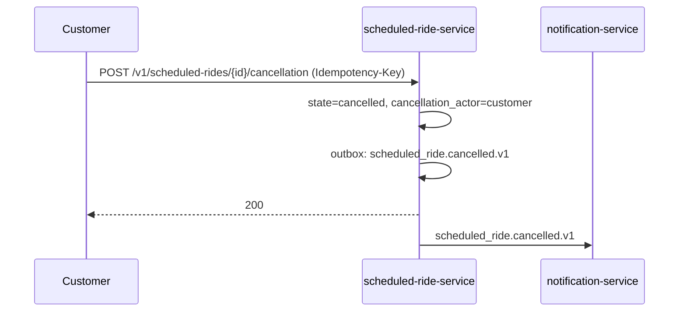
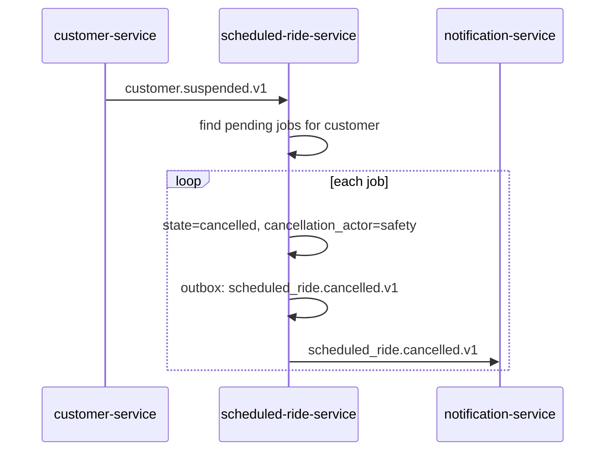
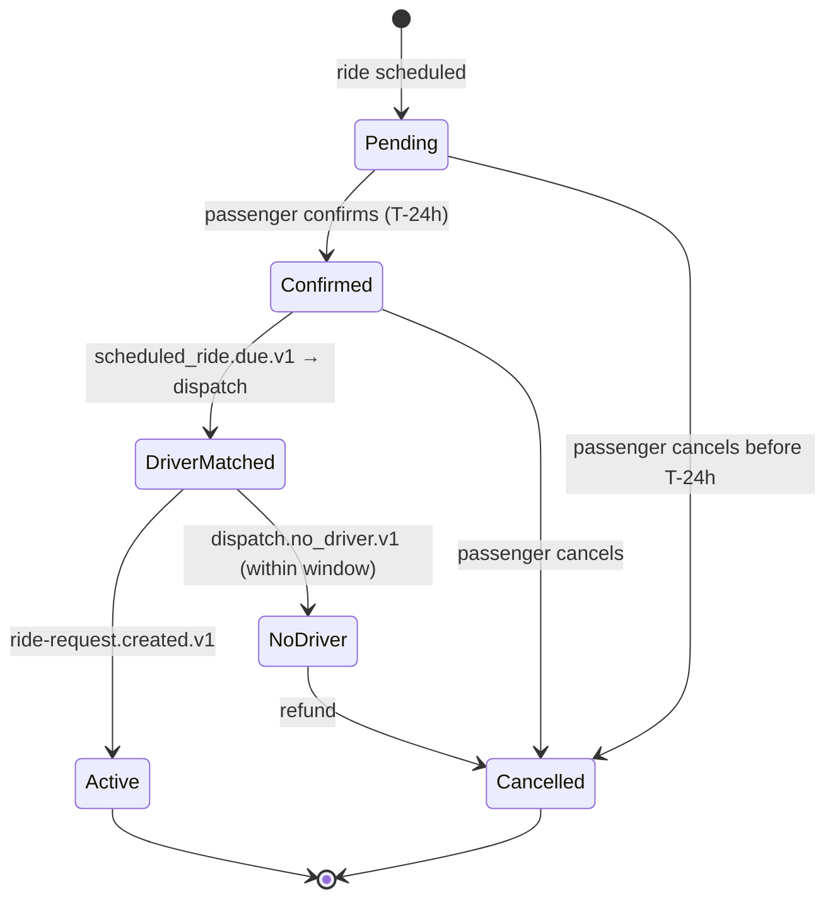

# scheduled-ride-service — Workflows

## 1. Book a Scheduled Ride

### 1.1 Objective

Allow a customer to book a ride for a future time, validate the
parameters, and schedule the materialisation job.

### 1.2 Initiating Actor

The customer app.

### 1.3 Participating Services

- `scheduled-ride-service` (this service)
- `customer-service` (validate)
- `pricing-service` (pre-quote, best-effort)
- `zone-service` (validate zone)
- `notification-service` (notify on booking)

### 1.4 Prerequisites

- The customer is active.
- The pickup/dropoff is within a served zone.
- `scheduled_for` is in the future and within the allowed window.

### 1.5 Happy Path

```mermaid
sequenceDiagram
    participant C as Customer
    participant SR as scheduled-ride-service
    participant CST as customer-service
    participant PRC as pricing-service
    participant ZN as zone-service
    participant NOT as notification-service

    C->>SR: POST /v1/scheduled-rides (Idempotency-Key)
    SR->>CST: GET /v1/customers/{id}
    CST-->>SR: 200 active
    SR->>ZN: POST /v1/zones/coverage
    ZN-->>SR: 200 served
    SR->>PRC: POST /v1/quotes (best-effort)
    PRC-->>SR: quote
    SR->>SR: persist (state=pending, scheduled_for, pre_quote)
    SR->>SR: outbox: (none yet; will fire at T-15min)
    SR-->>C: 201
    SR->>NOT: notify customer (booking confirmed)
```

### 1.6 Alternate Paths

- Customer suspended: 403 `CUSTOMER_SUSPENDED`.
- Zone unserved: 422 `ZONE_UNSERVED`.
- Outside time window: 422 `OUTSIDE_TIME_WINDOW`.
- `pricing-service` down: pre_quote is null; the customer is
  told the final price will be at materialisation time.

### 1.7 Failure Paths

- DB down: 503; the customer retries.

### 1.8 Business Rules

- BR--010, BR--011.

### 1.9 State Transitions

`[*] → pending`.

### 1.10 Events

None at booking; the `scheduled_ride.due.v1` event is fired at
the lead time.

### 1.11 APIs Involved

| API | Direction | When |
|-----|-----------|------|
| `POST /v1/scheduled-rides` | inbound | trigger |
| `GET /v1/customers/{id}` | outbound | validate |
| `POST /v1/zones/coverage` | outbound | validate |
| `POST /v1/quotes` | outbound | pre-quote |

### 1.12 Compensation / Rollback

If the persist fails, no job is created. The customer retries.

### 1.13 Final State

`pending`. The scheduler will fire at the lead time.

## 2. Scheduler Fires

### 2.1 Objective

At the lead time, emit `scheduled_ride.due.v1` to materialise the
live ride request.

### 2.2 Initiating Actor

The scheduler (a sweeper on every replica).

### 2.3 Participating Services

- `scheduled-ride-service` (this service)
- `ride-request-service` (consumer)

### 2.4 Prerequisites

- The job is `pending` and `scheduled_for - lead_time_minutes <=
  now()`.

### 2.5 Happy Path

```mermaid
sequenceDiagram
    participant SW as sweeper
    participant SR as scheduled-ride-service
    participant RR as ride-request-service

    SW->>SR: SELECT ... FROM jobs
              WHERE state='pending'
                AND scheduled_for - lead_time_minutes <= now()
              FOR UPDATE SKIP LOCKED
    SR->>SR: state=materialised, materialised_at=now()
    SR->>SR: outbox: scheduled_ride.due.v1
    SR->>RR: scheduled_ride.due.v1
```

### 2.6 Alternate Paths

- Multiple replicas try the same job: `SKIP LOCKED` ensures only
  one fires.
- The materialisation fails downstream: the `ride-request-service`
  emits an error event (or no event); our sweeper marks the job
  `materialised` anyway (the fire succeeded; the downstream
  failure is not our concern — the `ride-request-service` handles
  it).

### 2.7 Failure Paths

- DB down: retry on the next sweep tick.
- Outbox publish fails: retry with backoff; on persistent
  failure, DLQ.

### 2.8 Business Rules

- BR--012.

### 2.9 State Transitions

`pending → materialised`.

### 2.10 Events

| Event | Direction | When |
|-------|-----------|------|
| `scheduled_ride.due.v1` | produced | on fire |

### 2.11 APIs Involved

None (event-driven).

### 2.12 Compensation / Rollback

- If the outbox publish fails, the poller retries.
- The downstream `ride-request-service` is responsible for
  handling the materialisation.

### 2.13 Final State

`materialised`. The `materialised_ride_request_id` may be set
later by the `ride-request-service` via a callback event (not
specified in v1).

## 3. Materialisation Retry (Downstream Failure)

### 3.1 Objective

If the `ride-request-service` reports a failure to materialise
(e.g. via `scheduled_ride.failed.v1` from a different flow, or
via a webhook), retry up to N times; on persistent failure,
emit `scheduled_ride.failed.v1`.

### 3.2 Initiating Actor

A `scheduled_ride.failed.v1` consumer (in v1, we may implement
this via a callback event from `ride-request-service`; in v2, a
direct retry).

### 3.3 Participating Services

- `scheduled-ride-service` (this service)
- `ride-request-service` (downstream)

### 3.4 Prerequisites

- The materialisation has failed.

### 3.5 Happy Path

```mermaid
sequenceDiagram
    participant SR as scheduled-ride-service
    participant RR as ride-request-service

    Note over SR: scheduled_ride.due.v1 was emitted
    RR-->>SR: (no live request created; downstream failure)
    SR->>SR: schedule retry (next_retry_at)
    Note over SR: sweeper picks up at next_retry_at
    SR->>RR: scheduled_ride.due.v1 (retry)
    RR-->>SR: (success)
    SR->>SR: state=materialised
    alt persistent failure
        SR->>SR: state=failed
        SR->>SR: outbox: scheduled_ride.failed.v1
    end
```

### 3.6 Alternate Paths

- The downstream `ride-request-service` reports success via a
  callback: state → `materialised`.
- The downstream reports failure: state stays `materialised` (we
  already fired); the `ride-request-service` owns the
  materialisation result. (v1 simplification: the fire is the
  handoff; we do not track the result here.)

### 3.7 Failure Paths

- All retries fail: state → `failed`; emit
  `scheduled_ride.failed.v1`; open a support ticket.

### 3.8 Business Rules

- BR--013, BR--014.

### 3.9 State Transitions

`pending → materialised → failed` (if retries fail).

### 3.10 Events

| Event | Direction | When |
|-------|-----------|------|
| `scheduled_ride.failed.v1` | produced | on persistent failure |

### 3.11 APIs Involved

None.

### 3.12 Compensation / Rollback

N/A.

### 3.13 Final State

`materialised` (on success) or `failed` (on persistent failure).

## 4. Customer Cancel

### 4.1 Objective

Allow a customer to cancel a scheduled ride within the free
window (and outside, with a fee handled by
`ride-request-service` at materialisation time).

### 4.2 Initiating Actor

The customer app.

### 4.3 Participating Services

- `scheduled-ride-service` (this service)
- `notification-service` (notify)

### 4.4 Prerequisites

- The job is `pending`.
- The actor is the owner or admin.

### 4.5 Happy Path



### 4.6 Alternate Paths

- Outside the free window: 409 `OUTSIDE_FREE_WINDOW` (the customer
  is told to wait; the fee will be applied at materialisation
  time).

### 4.7 Failure Paths

- DB down: 503; the customer retries.

### 4.8 Business Rules

- BR--015.

### 4.9 State Transitions

`pending → cancelled`.

### 4.10 Events

| Event | Direction | When |
|-------|-----------|------|
| `scheduled_ride.cancelled.v1` | produced | on cancel |

### 4.11 APIs Involved

| API | Direction | When |
|-----|-----------|------|
| `POST /v1/scheduled-rides/{id}/cancellation` | inbound | trigger |

### 4.12 Compensation / Rollback

If the cancel fails, no state change.

### 4.13 Final State

`cancelled`. The scheduler will not fire.

## 5. Customer Suspended Mid-Window

### 5.1 Objective

When a customer is suspended between booking and the scheduled
time, auto-cancel all of their pending jobs.

### 5.2 Initiating Actor

`customer-service` emits `customer.suspended.v1`.

### 5.3 Participating Services

- `customer-service` (event producer)
- `scheduled-ride-service` (this service)
- `notification-service` (notify)

### 5.4 Prerequisites

- The customer has at least one `pending` job.

### 5.5 Happy Path



### 5.6 Alternate Paths

- No pending jobs: no-op.

### 5.7 Failure Paths

- DB down: retry; on persistent failure, page on-call.

### 5.8 Business Rules

- BR--017.

### 5.9 State Transitions

`pending → cancelled` (for each affected job).

### 5.10 Events

| Event | Direction | When |
|-------|-----------|------|
| `scheduled_ride.cancelled.v1` | produced | for each job |
| `customer.suspended.v1` | consumed | trigger |

### 5.11 APIs Involved

None.

### 5.12 Compensation / Rollback

N/A.

### 5.13 Final State

All affected jobs are `cancelled`.


## 99. Scheduled Ride Lifecycle State Machine

This state machine summarizes the service's internal
state transitions (across all workflows above).



---

## 99. `Monthly Partition Maintenance`

### 99.1 Objective

Idempotently pre-create the next 12 monthly child partitions for partitioned tables in `scheduled_ride`.

### 99.2 Initiating Actor

A scheduled job runs daily at `02:00 UTC`. Leader-elected via `pg_try_advisory_xact_lock(hashtext('scheduled_ride.partition'), hashtext('monthly'))`.

### 99.3 Happy Path

```mermaid
sequenceDiagram
    participant JOB as Partition job
    participant PG as PostgreSQL
    JOB->>PG: pg_try_advisory_xact_lock('scheduled_ride.monthly')
    alt lock acquired
        loop for each missing month in next 12
            JOB->>PG: CREATE TABLE IF NOT EXISTS scheduled_ride.<table>_YYYY_MM PARTITION OF scheduled_ride.<table>
            JOB->>PG: verify (pg_inherits, relpartbound)
        end
        JOB->>PG: assert now() in existing child
    else lock NOT acquired
        Note over JOB: another instance is running; exit cleanly
    end
```

### 99.4 Failure Paths

| Failure | Handling |
|---------|----------|
| Lock contention | exit 0 |
| DDL fails | retry 3× with backoff (1 s / 4 s / 16 s); page on-call |
| Today's child missing | critical alert; INSERTs would fail |

### 99.5 Business Rules

- Pre-create 12 complete future months.
- Every child is created with `CREATE TABLE IF NOT EXISTS … PARTITION OF …`.
- A verification step (`pg_inherits` parent + `relpartbound` range) runs after every `CREATE TABLE IF NOT EXISTS`.
- Optionally emit `audit.partition.maintained.v1` on success.

---

## See also

### Sibling docs for this service

- [`README.md`](./README.md) — purpose, bounded context, responsibilities
- [`BRD.md`](./BRD.md) — business requirements
- [`SRS.md`](./SRS.md) — functional + non-functional requirements
- [`ERD.md`](./ERD.md) — data model (entities, relationships)
- [`INTEGRATION.md`](./INTEGRATION.md) — inter-service contracts (APIs, events, sagas)
- [`WORKFLOWS.md`](./WORKFLOWS.md) — operational workflows (happy paths, failure modes)
- [`TECH.md`](./TECH.md) — technology profile (runtime, libraries, data layer, admin endpoints, RBAC)

### Platform-wide

- [`../../shared/README.md`](../../shared/README.md) — `platform-spring-boot-starter` shared library (the single source of cross-cutting code for all Spring Boot services in the platform)
- [`../RECOMMENDATIONS.md`](../RECOMMENDATIONS.md) — platform-wide technology map (language, framework, version baseline, admin/RBAC pattern)
- [`../../README.md`](../../README.md) — services overview (the catalog of all 58 services)
- [`../../../main.md`](../../../main.md) — top-level platform specification (architecture, Keycloak, PostgreSQL 18, messaging, observability baseline)

