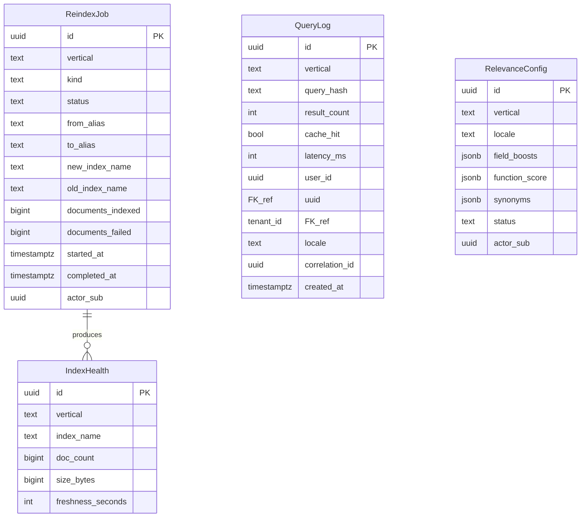

# search-service — Entity-Relationship Diagram

## 1. Database

- **Engine**: PostgreSQL 19.
- **Schema**: `search` — owned exclusively by this service.
- **Migrations**: `services/search-service/migrations/`
  (versioned, forward-only, golang-migrate).

The PostgreSQL schema stores:
- Reindex job state.
- Query log (for analytics and audit).
- Relevance config snapshot.
- A/B test config.

The search index itself is in OpenSearch (not in
PostgreSQL) — **Apache-2.0, opensource-only**, self-hosted
on K8s (per
[`../../shared/OSS_DEPENDENCIES.md`](../../shared/OSS_DEPENDENCIES.md)
§2 row 12). The schema is the *meta* layer; the index is
the *data* layer.

## 2. Cross-Service References

| Column | Type | Refers to | Source of truth |
|--------|------|-----------|------------------|
| `restaurant_id`, `menu_item_id`, `merchant_id`, `ticket_id` | UUID | respective owner service | respective owner service |
| `actor_sub` (audit) | UUID | Keycloak `sub` | `identity-service` (Keycloak) |
| `tenant_id` | UUID | multi-tenant isolation | `identity-service` |
| `correlation_id` | UUID | per request | gateway / caller |

## 3. Entities

### `ReindexJob`

A reindex job (full or incremental).

#### Columns

| Column | Type | Constraints | Notes |
|--------|------|-------------|-------|
| `id` | UUID | PK | UUIDv7 |
| `vertical` | TEXT | NOT NULL | `restaurants`, `menu_items`, `merchants`, `tickets` |
| `kind` | TEXT | NOT NULL | `full`, `incremental` |
| `status` | TEXT | NOT NULL | `pending`, `running`, `completed`, `failed`, `rolled_back` |
| `from_alias` | TEXT | NOT NULL | the alias before the reindex |
| `to_alias` | TEXT | NOT NULL | the alias after the reindex (the new index name) |
| `new_index_name` | TEXT | NOT NULL | the new index being built |
| `old_index_name` | TEXT | NOT NULL | the index being replaced |
| `documents_indexed` | BIGINT | NOT NULL DEFAULT 0 | |
| `documents_failed` | BIGINT | NOT NULL DEFAULT 0 | |
| `started_at` | TIMESTAMPTZ | NULL | |
| `completed_at` | TIMESTAMPTZ | NULL | |
| `error` | TEXT | NULL | |
| `actor_sub` | UUID | NOT NULL | the admin who triggered it |
| `idempotency_key` | TEXT | NULL | |
| `metadata` | JSONB | NULL | e.g. `{"source_count": 1000, "index_size_bytes": 1234567}` |
| `created_at` | TIMESTAMPTZ | NOT NULL DEFAULT now() | |
| `updated_at` | TIMESTAMPTZ | NOT NULL DEFAULT now() | |
| `created_by` | UUID | NOT NULL | |
| `updated_by` | UUID | NOT NULL | |

#### Indexes

- PK on `id`
- BTree on `(vertical, status)` WHERE `status IN ('pending','running')`
- BTree on `started_at` DESC

#### Constraints

- CHECK: `vertical IN ('restaurants','menu_items','merchants','tickets')`
- CHECK: `kind IN ('full','incremental')`
- CHECK: `status IN ('pending','running','completed','failed','rolled_back')`

### `QueryLog`

Every search query (with `query_hash`, not raw query).

#### Columns

| Column | Type | Constraints | Notes |
|--------|------|-------------|-------|
| `id` | UUID | PK | UUIDv7 |
| `vertical` | TEXT | NOT NULL | |
| `query_hash` | TEXT | NOT NULL | SHA-256 hex of (query + filter + sort + locale + tenant) |
| `result_count` | INT | NOT NULL | |
| `cache_hit` | BOOLEAN | NOT NULL | |
| `latency_ms` | INT | NOT NULL | |
| `user_id` | UUID | NULL | the requester (if authenticated) |
| `tenant_id` | UUID | NULL | |
| `locale` | TEXT | NOT NULL | |
| `ip_hash` | TEXT | NULL | SHA-256 of the IP |
| `correlation_id` | UUID | NOT NULL | |
| `created_at` | TIMESTAMPTZ | NOT NULL DEFAULT now() | partition key |

#### Indexes

- PK on `id`
- BTree on `(vertical, created_at DESC)`
- BTree on `(query_hash, created_at DESC)` for analytics

#### Constraints

- CHECK: `vertical IN ('restaurants','menu_items','merchants','tickets')`
- CHECK: `result_count >= 0`
- CHECK: `latency_ms >= 0`

#### Partitioning

- Range-partitioned by `created_at`, monthly.
- Retention: 30 days; partition dropped.

### `RelevanceConfig`

A snapshot of the relevance config (per vertical, per
locale). The live config is in `configuration-service`;
this table is for audit and rollback.

#### Columns

| Column | Type | Constraints | Notes |
|--------|------|-------------|-------|
| `id` | UUID | PK | UUIDv7 |
| `vertical` | TEXT | NOT NULL | |
| `locale` | TEXT | NOT NULL | |
| `field_boosts` | JSONB | NOT NULL | e.g. `{"name": 2.0, "description": 1.0, "tags": 1.5}` |
| `function_score` | JSONB | NULL | OpenSearch function score config |
| `synonyms` | JSONB | NULL | e.g. `{"pizza": ["pizzeria"]}` |
| `status` | TEXT | NOT NULL | `active`, `superseded` |
| `actor_sub` | UUID | NOT NULL | |
| `created_at` | TIMESTAMPTZ | NOT NULL DEFAULT now() | |
| `superseded_at` | TIMESTAMPTZ | NULL | |
| `superseded_by` | UUID | NULL | self-reference |

#### Indexes

- PK on `id`
- BTree on `(vertical, locale, status) WHERE status = 'active'`
- BTree on `(vertical, locale, created_at DESC)`

#### Constraints

- CHECK: `vertical IN ('restaurants','menu_items','merchants','tickets')`
- CHECK: `status IN ('active','superseded')`

### `IndexHealth`

A snapshot of index health (size, doc count, freshness).

#### Columns

| Column | Type | Constraints | Notes |
|--------|------|-------------|-------|
| `id` | UUID | PK | UUIDv7 |
| `vertical` | TEXT | NOT NULL | |
| `index_name` | TEXT | NOT NULL | |
| `doc_count` | BIGINT | NOT NULL | |
| `size_bytes` | BIGINT | NOT NULL | |
| `last_event_at` | TIMESTAMPTZ | NULL | when the last event was indexed |
| `freshness_seconds` | INT | NULL | now - last_event_at |
| `created_at` | TIMESTAMPTZ | NOT NULL DEFAULT now() | |

#### Indexes

- PK on `id`
- BTree on `(vertical, created_at DESC)`

#### Constraints

- CHECK: `vertical IN ('restaurants','menu_items','merchants','tickets')`

### `Outbox` and `Inbox`

Standard outbox and inbox tables per `EVENT_ARCHITECTURE.md`.
See `geolocation-service/ERD.md` for the canonical DDL.

## 4. Mermaid ER Diagram



## 5. DDL Sketch

```sql
CREATE SCHEMA IF NOT EXISTS search;
SET search_path = search, public;

CREATE TABLE search.reindex_jobs (
    id UUID PRIMARY KEY,
    vertical TEXT NOT NULL CHECK (vertical IN ('restaurants','menu_items','merchants','tickets')),
    kind TEXT NOT NULL CHECK (kind IN ('full','incremental')),
    status TEXT NOT NULL CHECK (status IN ('pending','running','completed','failed','rolled_back')),
    from_alias TEXT NOT NULL,
    to_alias TEXT NOT NULL,
    new_index_name TEXT NOT NULL,
    old_index_name TEXT NOT NULL,
    documents_indexed BIGINT NOT NULL DEFAULT 0,
    documents_failed BIGINT NOT NULL DEFAULT 0,
    started_at TIMESTAMPTZ,
    completed_at TIMESTAMPTZ,
    error TEXT,
    actor_sub UUID NOT NULL,
    idempotency_key TEXT,
    metadata JSONB,
    created_at TIMESTAMPTZ NOT NULL DEFAULT now(),
    updated_at TIMESTAMPTZ NOT NULL DEFAULT now(),
    created_by UUID NOT NULL,
    updated_by UUID NOT NULL
);
CREATE INDEX reindex_jobs_vertical_status_idx
    ON search.reindex_jobs (vertical, status)
    WHERE status IN ('pending','running');
CREATE INDEX reindex_jobs_started_idx
    ON search.reindex_jobs (started_at DESC);

CREATE TABLE search.query_log (
    id UUID NOT NULL,
    vertical TEXT NOT NULL CHECK (vertical IN ('restaurants','menu_items','merchants','tickets')),
    query_hash TEXT NOT NULL,
    result_count INT NOT NULL CHECK (result_count >= 0),
    cache_hit BOOLEAN NOT NULL,
    latency_ms INT NOT NULL CHECK (latency_ms >= 0),
    user_id UUID,
    tenant_id UUID,
    locale TEXT NOT NULL,
    ip_hash TEXT,
    correlation_id UUID NOT NULL,
    created_at TIMESTAMPTZ NOT NULL DEFAULT now(),
    PRIMARY KEY (id, created_at)
) PARTITION BY RANGE (created_at);

-- Idempotent pre-creation; safe to rerun as part of the maintenance job.
CREATE TABLE IF NOT EXISTS search.query_log_2026_07
    PARTITION OF search.query_log
    FOR VALUES FROM ('2026-07-01 00:00:00+00') TO ('2026-08-01 00:00:00+00');

CREATE INDEX query_log_vertical_created_idx
    ON search.query_log (vertical, created_at DESC);
CREATE INDEX query_log_hash_idx
    ON search.query_log (query_hash, created_at DESC);

CREATE TABLE search.relevance_config (
    id UUID PRIMARY KEY,
    vertical TEXT NOT NULL CHECK (vertical IN ('restaurants','menu_items','merchants','tickets')),
    locale TEXT NOT NULL,
    field_boosts JSONB NOT NULL,
    function_score JSONB,
    synonyms JSONB,
    status TEXT NOT NULL CHECK (status IN ('active','superseded')),
    actor_sub UUID NOT NULL,
    created_at TIMESTAMPTZ NOT NULL DEFAULT now(),
    superseded_at TIMESTAMPTZ,
    superseded_by UUID
);
CREATE INDEX relevance_active_idx
    ON search.relevance_config (vertical, locale, status)
    WHERE status = 'active';
CREATE INDEX relevance_history_idx
    ON search.relevance_config (vertical, locale, created_at DESC);

CREATE TABLE search.index_health (
    id UUID PRIMARY KEY,
    vertical TEXT NOT NULL CHECK (vertical IN ('restaurants','menu_items','merchants','tickets')),
    index_name TEXT NOT NULL,
    doc_count BIGINT NOT NULL,
    size_bytes BIGINT NOT NULL,
    last_event_at TIMESTAMPTZ,
    freshness_seconds INT,
    created_at TIMESTAMPTZ NOT NULL DEFAULT now()
);
CREATE INDEX index_health_vertical_idx
    ON search.index_health (vertical, created_at DESC);
```

## 6. Audit Columns

Every mutable table has `created_at`, `updated_at`, `created_by`,
`updated_by`. `query_log` is append-mostly.

## 7. Soft Delete

The schema does not use soft delete. Reindex jobs and
relevance config are immutable (new versions supersede old
ones). Query log is append-mostly with retention.

## 8. JSONB Usage

| Table | Column | Justification |
|-------|--------|---------------|
| `reindex_jobs` | `metadata` | e.g. `source_count`, `index_size_bytes` |
| `relevance_config` | `field_boosts` | per-field boost numbers |
| `relevance_config` | `function_score` | OpenSearch function score config |
| `relevance_config` | `synonyms` | locale-specific synonyms |
| `outbox` | `payload`, `headers` | event body |

## 9. Partitioning

| Table | Partition strategy | Retention |
|-------|--------------------|-----------|
| `query_log` | RANGE by `created_at`, monthly | 30 days |

## 10. Data Retention

| Table | Retention | Purged by |
|-------|-----------|-----------|
| `reindex_jobs` | 1y | hard delete |
| `query_log` | 30 days | partition drop |
| `relevance_config` | indefinite | superseded versions retained for audit |
| `index_health` | 90 days | hard delete |
| `outbox` | 24h after publish | partition drop |
| `inbox` | 7d | hard delete |

## 11. Migration Considerations

- **Adding a new vertical** is a config + schema change
  (update CHECK constraints; add an index alias).
- **Reindex** is a routine operation; the schema tracks
  it but does not block it.
- **Right-to-erasure** for query log: `DELETE FROM
  query_log WHERE user_id = ?` within 24h.
- **OpenSearch index migration** (e.g. mapping change):
  the new index is created; data is backfilled; the alias
  is swapped; the old index is deleted after a grace
  period. This is a reindex job.

---

## 12. OpenSearch Index Mapping

The search indices are the *data* layer for full-text search; the
PostgreSQL schema in §3 is the *meta* layer. Every index in this
service follows the same mapping pattern (with vertical-specific
additions in §12.5). The mapping is owned by this service and is
**immutable for the life of an index** — changes trigger a
zero-downtime reindex per `WORKFLOWS.md` §3 (also DATA--016).

### 12.1 Common fields (every vertical)

| Field | Type | Notes |
|-------|------|-------|
| `id` | `keyword` | document id (UUIDv7 string) |
| `tenant_id` | `keyword` | multi-tenant isolation |
| `locale` | `keyword` | the locale this document variant belongs to (`en` / `ar`) |
| `created_at` | `date` | epoch_millis |
| `updated_at` | `date` | epoch_millis |
| `vertical` | `keyword` | `restaurants` / `menu_items` / `merchants` / `tickets` |

### 12.2 Text fields (locale-aware)

These fields are the targets of the full-text `multi_match` query
(see `SRS.md` FR--022 and `INTEGRATION.md` §1.1).

| Field | Type | Sub-fields | Notes |
|-------|------|------------|-------|
| `name` | `text` | `.keyword` (keyword), `.search_as_you_type`, `.en` (english), `.ar` (arabic_normalized) | primary search field; one document per locale (`name_i18n.{locale}` aliases onto this) |
| `name.search_as_you_type` | `search_as_you_type` | (max_shingle_size=3) | backs autocomplete per FR--030 |
| `name_i18n.en` | `text` | `.keyword` | English name; routed via `name.en` |
| `name_i18n.ar` | `text` | `.keyword` | Arabic name; routed via `name.ar`; normalized at index time per FR--028 |
| `description` | `text` | `.keyword` | long-form description |
| `description.en` | `text` | — | English description (analyzer `english`) |
| `description.ar` | `text` | — | Arabic description (analyzer `arabic_normalized`) |
| `tags` | `keyword` | — | exact-match facets |

### 12.3 Locale analyzers

| Locale | Analyzer | Tokenizer | Token filters |
|--------|----------|-----------|---------------|
| `en` | `english` | `standard` | `lowercase`, `stop` (english), `snowball` (english) |
| `ar` | `arabic_normalized` | `standard` | `lowercase`, `arabic_normalization` (tashkil, alef, yaa, hamza), `stop` (arabic), `arabic_stemmer` |

The `arabic_normalized` analyzer is a custom analyzer defined in this
service's index settings (per `INTEGRATION.md` §2). It applies the
normalization rules in FR--028 at index time before tokenization.

### 12.4 Index settings (every vertical)

| Setting | Value | Rationale |
|---------|-------|-----------|
| Number of shards | 3 per index | per environment; matches the 3-master / 3-data topology |
| Number of replicas | 2 per index | per NFR--004 |
| Refresh interval | `1s` | default; balances freshness vs throughput |
| Similarity | `BM25` | per FR--027 (OpenSearch default) |
| `max_shingle_size` | `3` | for `search_as_you_type` autocomplete |

### 12.5 Vertical-specific additions

| Vertical | Extra text fields | Notes |
|----------|-------------------|-------|
| `restaurants` | `cuisine` (keyword), `price_range` (keyword), `tags` (keyword) | filter-only; no full-text |
| `menu_items` | `category` (keyword), `price` (scaled_float) | filter + sort |
| `merchants` | `category` (keyword), `tags` (keyword) | filter-only |
| `tickets` | `subject`, `body`, `status` (keyword), `priority` (keyword) | full-text on `subject` and `body`; filter on the rest |

### 12.6 Mapping version

The mapping version is pinned in `relevance_config.metadata.mapping_version`
(JSONB) at the time the active relevance config is created. A change to
the mapping requires a new relevance config + reindex (per WORKFLOWS.md
§3).

---

## See also

### Sibling docs for this service

- [`README.md`](./README.md) — purpose, bounded context, responsibilities
- [`BRD.md`](./BRD.md) — business requirements
- [`SRS.md`](./SRS.md) — functional + non-functional requirements
- [`ERD.md`](./ERD.md) — data model (entities, relationships)
- [`INTEGRATION.md`](./INTEGRATION.md) — inter-service contracts (APIs, events, sagas)
- [`WORKFLOWS.md`](./WORKFLOWS.md) — operational workflows (happy paths, failure modes)
- [`TECH.md`](./TECH.md) — technology profile (runtime, libraries, data layer, admin endpoints, RBAC)

### Platform-wide

- [`../../shared/README.md`](../../shared/README.md) — `platform-spring-boot-starter` shared library (the single source of cross-cutting code for all Spring Boot services in the platform)
- [`../RECOMMENDATIONS.md`](../RECOMMENDATIONS.md) — platform-wide technology map (language, framework, version baseline, admin/RBAC pattern)
- [`../../README.md`](../../README.md) — services overview (the catalog of all 20 services)
- [`../../../main.md`](../../../main.md) — top-level platform specification (architecture, Keycloak, PostgreSQL 19, messaging, observability baseline)

## Related docs

- [`../../architecture/DATA_OWNERSHIP.md`](../../architecture/DATA_OWNERSHIP.md) — full source-of-truth matrix
- [`../../architecture/SERVICE_ISOLATION.md`](../../architecture/SERVICE_ISOLATION.md) — how this service handles a downstream outage
- [`../../architecture/DATABASE_ARCHITECTURE.md`](../../architecture/DATABASE_ARCHITECTURE.md) — PostgreSQL-per-service rules
- [`../../architecture/CONSISTENCY_STRATEGY.md`](../../architecture/CONSISTENCY_STRATEGY.md) — strong vs eventual consistency per context

