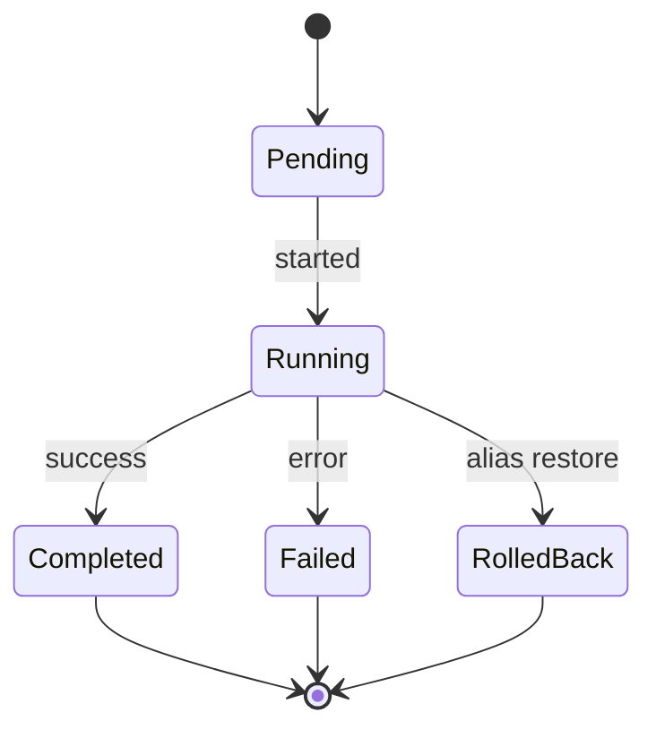

# search-service — Software Requirements Specification

## 1. Introduction

This SRS specifies, for the engineering team, the functional,
non-functional, data, security, and operational requirements of
`search-service`. It is derived from `BRD.md` and from the
platform's cross-service architecture.

## 2. Scope

In scope:

- All REST endpoints listed in `INTEGRATION.md` (search,
  suggest, admin reindex, admin relevance, admin top
  queries).
- Indexing pipeline (consume events, project to index).
- Multi-locale relevance.
- Zero-downtime reindex.
- Query analytics.
- Outbound events `search.query.executed.v1`,
  `search.reindex.started.v1`, `search.reindex.completed.v1`.

Out of scope:

- The data itself (owned by the respective services).
- The app's UI.
- Geospatial queries (point-in-zone, ETA) — owned by
  `geolocation-service`.

## 3. System Context

```mermaid
flowchart LR
    APP[Customer app / Merchant portal] -->|POST /v1/search/{v}| S[search-service]
    APP -->|GET /v1/search/suggest/{v}| S
    R[restaurant-service] -->|restaurant.updated.v1| S
    M[menu-service] -->|menu.updated.v1| S
    MS[merchant-service] -->|merchant.updated.v1| S
    Z[zone-service] -->|zone.updated.v1| S
    CFG[configuration-service] -->|configuration.updated.v1| S
    S -->|index / search| OS[(OpenSearch)]
    S -->|search.query.executed.v1| AN[analytics-service]
    S -->|search.reindex.*.v1| AUD[audit-service]
```

## 4. Actors

| Actor | Type | Description |
|-------|------|-------------|
| Customer app (rider / diner) | system | search restaurants, menu items |
| Merchant / Restaurant portal | system | search own menu, support tickets |
| Support console | system | search tickets |
| Admin console | system | admin operations |
| `restaurant-service` | system | producer |
| `menu-service` | system | producer |
| `merchant-service` | system | producer |
| `zone-service` | system | producer |
| `configuration-service` | system | producer |
| `feature-flag-service` | system | producer |
| Data analyst | human | relevance tuning |

## 5. Functional Requirements

| ID | Requirement | Priority |
|----|-------------|----------|
| FR--001 | The service MUST expose `POST /v1/search/{vertical}` for each vertical (restaurants, menu_items, merchants, tickets). | MUST |
| FR--002 | The service MUST support full-text query, filter, sort, and cursor pagination on every search. | MUST |
| FR--003 | The service MUST consume `restaurant.updated.v1` and project to the `restaurants` index within 5s P95. | MUST |
| FR--004 | The service MUST consume `menu.updated.v1` and project to the `menu_items` index within 5s P95. | MUST |
| FR--005 | The service MUST consume `merchant.updated.v1` and project to the `merchants` index within 5s P95. | MUST |
| FR--006 | The service MUST support multi-locale (en, ar) with locale-aware relevance per field. | MUST |
| FR--007 | The service MUST support geo filters (lat, lon, radius_m) on restaurants and menu items. | MUST |
| FR--008 | The service MUST expose `GET /v1/search/suggest/{vertical}` for autocomplete. | MUST |
| FR--009 | The service MUST support zero-downtime reindex via alias swap. | MUST |
| FR--010 | The service MUST expose `POST /v1/admin/reindex` (admin + HMAC) to trigger a reindex. | MUST |
| FR--011 | The service MUST expose `POST /v1/admin/relevance/update` (admin) to update relevance config. | MUST |
| FR--012 | The service MUST emit `search.query.executed.v1` for every search (for analytics). | MUST |
| FR--013 | The service MUST emit `search.reindex.started.v1` and `search.reindex.completed.v1`. | MUST |
| FR--014 | The service MUST log every query with `query_hash` (not raw query) and retain for 30 days. | MUST |
| FR--015 | The service MUST NOT index PII fields unless explicitly required. | MUST |
| FR--016 | The service MUST support per-tenant index isolation where applicable. | SHOULD |
| FR--017 | The service MUST cache hot queries in Redis with `search.cache.query.ttl_seconds` (default 60s). | MUST |
| FR--018 | The service MUST validate every input against JSON Schema. | MUST |
| FR--019 | The service MUST document an OpenAPI 3.1 spec at `/openapi.json`. | MUST |
| FR--020 | The service MUST support A/B testing of relevance configs (via `feature-flag-service`). | SHOULD |

## 6. Non-Functional Requirements

| ID | Category | Requirement | Target |
|----|----------|-------------|--------|
| NFR--001 | performance | P99 search (cache miss) | ≤ 300 ms |
| NFR--002 | performance | P99 search (cache hit) | ≤ 100 ms |
| NFR--003 | performance | P99 suggest | ≤ 100 ms |
| NFR--004 | availability | service uptime | 99.9% (T2) |
| NFR--005 | scalability | queries per second per replica | ≥ 200 |
| NFR--006 | maintainability | MTTR | ≤ 30 min |
| NFR--007 | correctness | index freshness P95 | ≤ 5 s |
| NFR--008 | observability | all errors have `correlation_id` and `trace_id` | 100% |
| NFR--009 | resilience | reindex with no search outage | 100% |

## 7. API Requirements

- All public endpoints follow `architecture/API_STANDARDS.md`:
  - REST, JSON, UTF-8.
  - URI versioned (`/v1/...`).
  - Bearer JWT (validated at gateway); internal calls use
    client-credentials tokens.
  - Errors follow the platform envelope (see INTEGRATION.md).
  - `X-Correlation-Id` and `traceparent` propagated.

(Full contract in INTEGRATION.md.)

## 8. Data Requirements

| ID | Requirement | Notes |
|----|-------------|-------|
| DATA--001 | All tables live in schema `search`. | per `DATABASE_ARCHITECTURE.md` |
| DATA--002 | The search index is owned by this service (OpenSearch). | multiple indices, one per vertical |
| DATA--003 | Reindex jobs and query log stored in PostgreSQL. | |
| DATA--004 | Primary keys are UUIDv7. | |
| DATA--005 | Cross-service references (`restaurant_id`, etc.) are UUID columns WITHOUT database FKs. | |
| DATA--006 | Every mutable table has `created_at`, `updated_at`, `created_by`, `updated_by`. | |
| DATA--007 | Query log is purged after 30 days. | |
| DATA--008 | Relevance config is hot-reloadable; stored in `search.relevance_config` and in `configuration-service`. | |
| DATA--009 | JSONB allowed only for: relevance config (per-field boosts), reindex job metadata. | |

## 9. Validation Rules

- **FR--001 (search)**: `query` 0..256 chars; `filter` is a
  key-value map; `sort` is a list of `field:asc|desc`;
  `limit` 1..100 (default 20); `cursor` opaque.
- **FR--007 (geo filter)**: `lat ∈ [-90, 90]`;
  `lon ∈ [-180, 180]`; `radius_m` 100..50000.
- **FR--010 (reindex)**: `vertical` ∈ configured verticals;
  `from` (optional) is a timestamp for incremental
  reindex; HMAC signed.
- **FR--011 (relevance update)**: `vertical` ∈ configured
  verticals; `field_boosts` is a map of `field: number`;
  HMAC signed.

## 10. State Transitions

Pointer: see `WORKFLOWS.md` §1, §2, §3. The reindex job
state machine:



## 11. Authorization Requirements

- Public verticals (restaurants, menu_items, merchants):
  any authenticated principal may search.
- `tickets` vertical: role `support_agent_l1+` or
  `admin`.
- `POST /v1/admin/reindex`: role `admin` or
  `platform_engineer` + HMAC.
- `POST /v1/admin/relevance/update`: role `admin` or
  `data_analyst` + HMAC.

## 12. Configuration Requirements

- `search.index.{vertical}.alias` — string.
- `search.relevance.{vertical}.{field}.boost` — number.
- `search.locale.{vertical}.supported` — array.
- `search.cache.query.ttl_seconds` — int (60).
- `search.query_log.retention_days` — int (30).
- All keys hot-reloadable on `configuration.updated.v1`.

## 13. Error Handling

| Error | When | Response |
|-------|------|----------|
| `VALIDATION_FAILED` | input schema or business validation fails | 400 |
| `UNAUTHENTICATED` / `FORBIDDEN` | auth | 401 / 403 |
| `RATE_LIMITED` | per-user or per-IP | 429 |
| `CIRCUIT_OPEN` | OpenSearch down | 503 |
| `DEPENDENCY_TIMEOUT` | OpenSearch timeout | 504 |
| `SIGNATURE_INVALID` | admin HMAC mismatch | 409 |
| `INTERNAL_ERROR` | unexpected | 500 |

## 14. Concurrency Requirements

- Query cache uses Redis with `SETNX` and TTL.
- Indexing is single-consumer per partition (Kafka).
- Reindex uses `SELECT … FOR UPDATE SKIP LOCKED` to fan
  out across multiple workers.

## 15. Idempotency Requirements

- `POST /v1/admin/reindex` requires `Idempotency-Key`;
  re-running the same key returns the existing job.
- Indexing is idempotent on document id (upsert).
- Query cache is keyed by `(vertical, query_hash,
  filter_hash, sort_hash, locale, tenant_id)`; same
  query returns the same cached result.

## 16. Performance

- **Dominant path**: `POST /v1/search/{vertical}`.
- **P50 / P95 / P99** (cache miss): 50ms / 150ms / 300ms.
- **P50 / P95 / P99** (cache hit): 10ms / 50ms / 100ms.
- Throughput target: 200 QPS per replica at P99.

## 17. Scalability

- **Horizontal scaling**: stateless replicas behind a load
  balancer. HPA on CPU 60% and on
  `search_queries_per_second > 200`. Max replicas 20.
- **Vertical scaling**: typical 1 CPU / 1Gi memory
  requests; 2 CPU / 2Gi limits (JVM).
- **OpenSearch**: 3 masters + 3 data nodes per
  environment; data nodes scale horizontally.

## 18. Availability

- **SLO**: 99.9% over 30 days. Error budget: ~44 min / 30d.
- **Maintenance window**: Sunday 04:00–06:00 UTC.
- **Reindex**: zero-downtime (alias swap); the old index
  is retained for a grace period (7 days).

## 19. Security

| ID | Requirement | Notes |
|----|-------------|-------|
| SEC--001 | All endpoints require bearer JWT. | per `SECURITY_ARCHITECTURE.md` §2 |
| SEC--002 | OpenSearch credentials in Vault, rotated quarterly. | per §5 |
| SEC--003 | Query log stores `query_hash` (SHA-256), not the raw query, for privacy. | per §7 |
| SEC--004 | No PII in the index unless explicitly required. | per §7 |
| SEC--005 | Per-tenant index isolation for multi-tenant admin paths. | per §16 |
| SEC--006 | Per-user and per-IP rate limiting. | per §12 |
| SEC--007 | Admin endpoints require role + HMAC signature. | per §14 |
| SEC--008 | Every reindex audited. | per §9 |

## 20. Privacy

- **PII stored**: query log (query_hash, no raw query);
  user_id of the requester; tenant_id.
- **Retention**: query log 30 days; relevance config
  indefinite; reindex jobs 1y.
- **Erasure**: on right-to-erasure request, the user's
  query log entries are deleted within 24h.

## 21. Auditability

- **Audit events**:
  - `search.reindex.started.v1` / `.completed.v1`.
  - `search.query.executed.v1` (for analytics; not strictly
    audit, but recorded).
- `reindex_jobs` table is append-mostly, 1y retention.

## 22. Observability

- **Logs**: JSON to stdout; per `OBSERVABILITY.md`. Standard
  fields plus `vertical`, `query_hash`, `result_count`,
  `latency_ms`.
- **Metrics** (Prometheus):
  - `http_requests_total{route, method, status}`
  - `http_request_duration_seconds{route, method, status}` (histogram)
  - `search_queries_total{vertical, status, cache_hit}`
  - `search_query_seconds{vertical}` (histogram)
  - `search_results_count{vertical}` (histogram)
  - `search_zero_result_queries_total{vertical}`
  - `search_reindex_total{vertical, status}`
  - `search_index_size_bytes{vertical}` (gauge)
  - `search_index_freshness_seconds{vertical}` (gauge, time
    since last update)
- **Traces**: OpenTelemetry; root span per search;
  OpenSearch call as child span.
- **Alerts**:
  - Search P99 > 500ms for 5 min → page.
  - Index freshness > 60s P95 → page.
  - Reindex failure → page.
  - OpenSearch down → page.

## 23. Maintainability

- **Code style**: Java 21, `google-java-format`,
  `spotless`, `checkstyle`.
- **Test coverage**: ≥ 85%.
- **Documentation**: OpenAPI 3.1 spec; CI validates.

## 24. Disaster Recovery

- **RPO**: 1h. Index can be rebuilt from the source
  services via backfill.
- **RTO**: 30 min. Stateless service; replicas can be
  promoted. OpenSearch is restored from snapshot.

## 25. Acceptance Criteria

- All 20 functional requirements implemented and verified.
- All 9 non-functional requirements met.
- All 8 security requirements verified.
- A `restaurant.updated.v1` event in staging results in
  the restaurant being searchable within 5s.
- A search for a known restaurant in staging returns
  within 300ms (cache miss) or 100ms (cache hit).
- A reindex of 10k restaurants in staging completes
  with no search outage.
- A relevance config change is hot-reloaded within 1
  minute.
- An autocomplete query in staging returns within 100ms.

---

## See also

### Sibling docs for this service

- [`README.md`](./README.md) — purpose, bounded context, responsibilities
- [`BRD.md`](./BRD.md) — business requirements
- [`SRS.md`](./SRS.md) — functional + non-functional requirements
- [`ERD.md`](./ERD.md) — data model (entities, relationships)
- [`INTEGRATION.md`](./INTEGRATION.md) — inter-service contracts (APIs, events, sagas)
- [`WORKFLOWS.md`](./WORKFLOWS.md) — operational workflows (happy paths, failure modes)
- [`TECH.md`](./TECH.md) — technology profile (runtime, libraries, data layer, admin endpoints, RBAC)

### Platform-wide

- [`../../shared/README.md`](../../shared/README.md) — `platform-spring-boot-starter` shared library (the single source of cross-cutting code for all Spring Boot services in the platform)
- [`../RECOMMENDATIONS.md`](../RECOMMENDATIONS.md) — platform-wide technology map (language, framework, version baseline, admin/RBAC pattern)
- [`../../README.md`](../../README.md) — services overview (the catalog of all 58 services)
- [`../../../main.md`](../../../main.md) — top-level platform specification (architecture, Keycloak, PostgreSQL 18, messaging, observability baseline)

