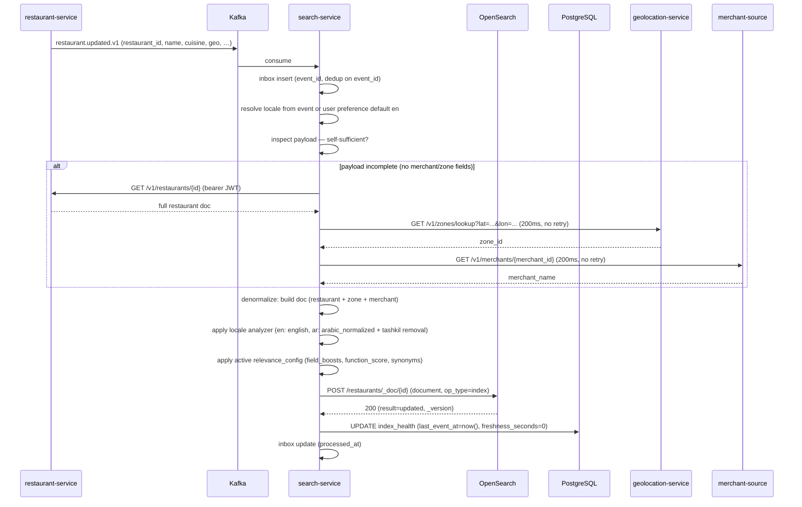
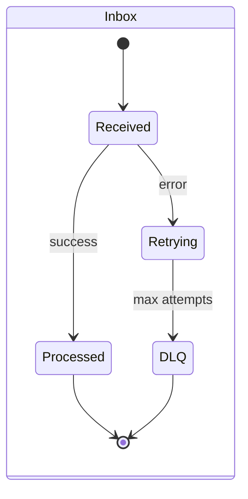
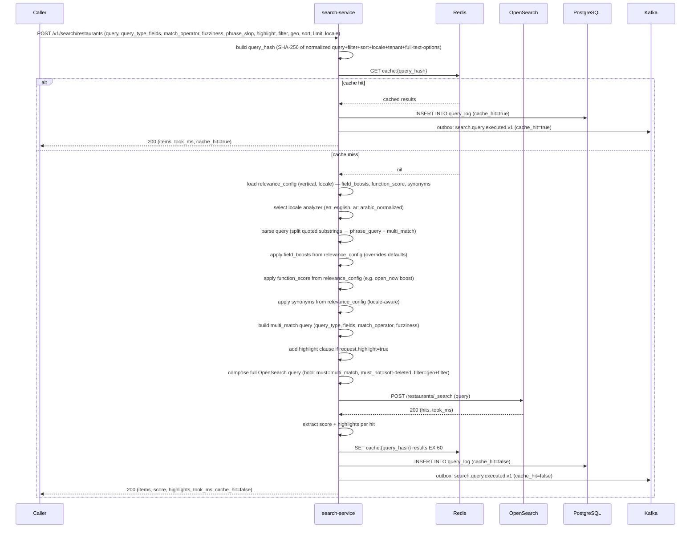
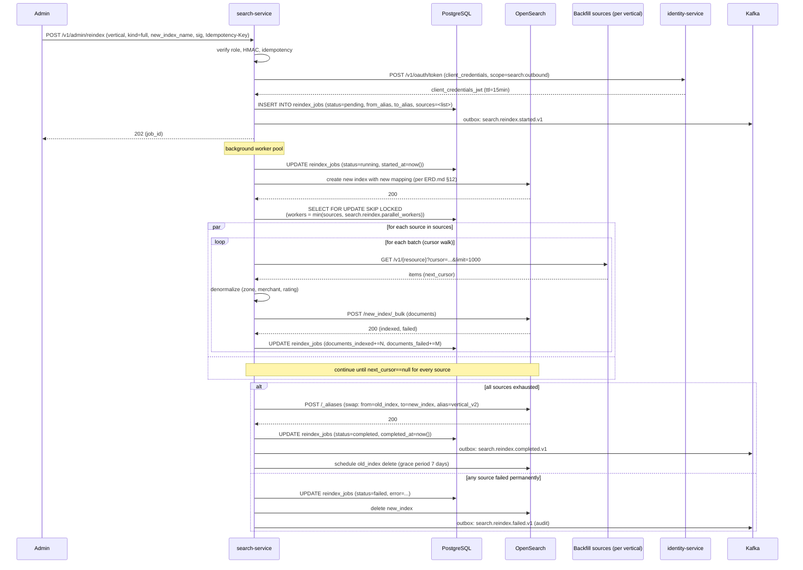
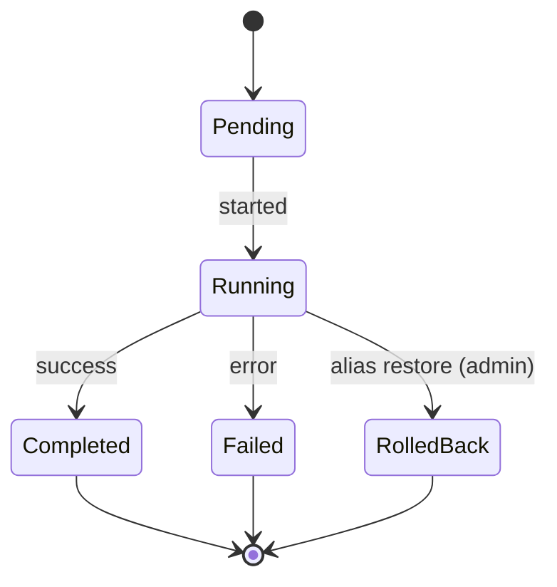
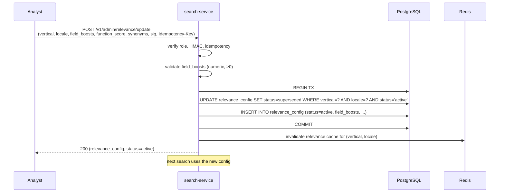
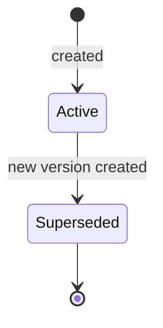
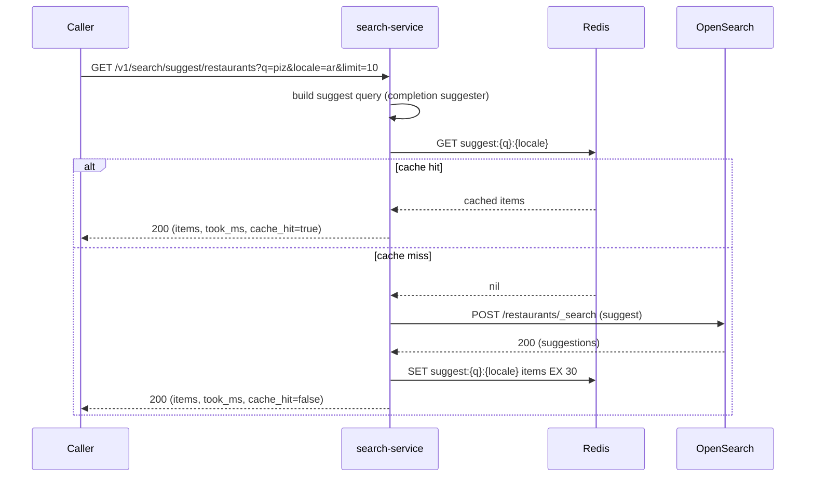

# search-service — Workflows

## 1. Index a Restaurant Update

### 1.1 Objective

When `restaurant-service` emits `restaurant.updated.v1`,
project the restaurant to the OpenSearch index within 5
seconds.

### 1.2 Initiating Actor

`restaurant-service` publishes `restaurant.updated.v1`.

### 1.3 Participating Services

- `restaurant-service` (producer; event + REST hydration fallback).
- `search-service` (this service) — consumer + actor.
- OpenSearch (the index).
- `geolocation-service` (zone enrichment — sync fallback when
  `zone.updated.v1` hasn't propagated yet, per `INTEGRATION.md`
  §2.5).
- ``restaurant-service` (merchant)` (merchant denormalization —
  REST fetch, 200ms, no retry, soft-fail).
- ``reporting-service` (data lake)` (consumer of
  `search.query.executed.v1`, indirectly via the index).

### 1.4 Prerequisites

- The Kafka consumer is running.
- The `restaurants` index exists and is mapped.
- The relevance config for the vertical / locale is loaded.
- The client-credentials JWT (per `INTEGRATION.md` §2.5) is
  available in process for outbound REST hydration.

### 1.5 Happy Path

The hydration branches (REST fetches) are **parallel and
non-blocking** for the happy path: if any one fails, the doc is
indexed with whatever fields succeeded (graceful degradation). Only
a *complete* hydration failure (all three REST calls failed) routes
the event to DLQ — but in that case the original event payload is
already sufficient and the doc is still indexed from the event alone.

### 1.6 Alternate Paths

- **Locale missing**: the default locale (en) is used.
- **Restaurant is soft-deleted**: the document is deleted
  from the index (`DELETE /restaurants/_doc/{id}`).
- **Restaurant is suspended**: the document is updated
  with `suspended=true`; it is still searchable but
  filtered out by the app.
- **Source payload is self-sufficient**: the hydration REST
  branches are skipped entirely (per `INTEGRATION.md` §2.2).
  Configurable per `(vertical, event)` in the service config.
- **Merchant-source fetch fails**: the doc is indexed with
  `merchant_name=null`; the relevance config applies a
  `missing_merchant` function_score penalty (per
  `relevance_config.function_score`). The event is *not*
  DLQ'd — soft degradation.
- **Zone-source fetch fails**: the doc is indexed with
  `zone_id=unknown`; geo filters fall back to the bounding
  box instead of the zone polygon. Not DLQ'd.
- **Restaurant-source fetch fails (hydration)**: the event
  payload is used as-is; if the payload is also insufficient,
  the event is DLQ'd (per `INTEGRATION.md` §2.6).

### 1.7 Failure Paths

- **OpenSearch down**: the consumer retries with
  backoff (3 attempts, 250ms / 1s / 4s). After 3 failures, the
  event is routed to DLQ; an alert fires.
- **Document build fails** (e.g. invalid geo): the event
  is logged; the document is not indexed; the event is
  routed to DLQ.
- **DB write fails**: the index is updated, but the
  `index_health` row is stale. A reconciliation job
  repairs the drift.
- **All hydration REST calls fail AND event payload is
  insufficient**: the event is DLQ'd (per `INTEGRATION.md`
  §2.6). Daily reconciliation will replay from DLQ.
- **Outbox row insert fails** (for `search.review.projection.upserted.v1`
  when this is a review-related event): the event is retried
  up to 3 times; on persistent failure, the outbox row is
  staged for the daily reconciliation to retry.

### 1.8 Business Rules

- BR--003, BR--011, BR--020.
- FR--003, FR--014, FR--015.

### 1.9 State Transitions

The inbox row transitions `received → processed`. The
index_health row is updated (no state machine).

### 1.10 Events

| Event | Direction | When |
|-------|-----------|------|
| `restaurant.updated.v1` | consumed | start of flow |

### 1.11 APIs Involved

| API | Direction | When |
|-----|-----------|------|
| Kafka consumer | inbound | start of flow |
| OpenSearch POST `/{index}/_doc/{id}` | outbound | index |

### 1.12 Compensation / Rollback

- An indexed document is updated, not rolled back. If a
  wrong document was indexed, the next
  `restaurant.updated.v1` event will correct it (or a
  reindex is triggered).

### 1.13 Final State

- The OpenSearch `restaurants` index has the updated
  document.
- The `index_health` row has `last_event_at=now()`.
- The inbox row is marked `processed_at`.

## 2. Search a Restaurant

### 2.1 Objective

Search the `restaurants` index and return ranked results.

### 2.2 Initiating Actor

The customer app (rider / diner) or merchant portal.

### 2.3 Participating Services

- `search-service` (this service).
- OpenSearch (the index).
- ``reporting-service` (data lake)` (consumer of `search.query.executed.v1`).

### 2.4 Prerequisites

- The `restaurants` index is healthy.
- The relevance config is loaded.

### 2.5 Happy Path

#### 2.5.1 Full-text query build steps (cache miss)

In order, the search-service constructs the OpenSearch query as
follows. These steps are inline in the cache-miss path above; they
are the canonical sequence referenced by `SRS.md` §5 (FR--021..FR--033),
`ERD.md` §12, and `INTEGRATION.md` §1.1.

1. **Resolve relevance config** — load the active `relevance_config`
   row for `(vertical, locale)` from PostgreSQL (or from the Redis
   cache hot layer). Three JSONB fields are consumed:
   `field_boosts`, `function_score`, `synonyms`.
2. **Select locale analyzer** — `en` → `english`, `ar` →
   `arabic_normalized`. The analyzer is implicit in the field
   mapping (per `ERD.md` §12.3); the service does not set it
   per query.
3. **Parse the query string** — split on whitespace so quoted
   substrings (e.g. `"deep dish"`) become phrase queries; the
   remaining unquoted tokens are passed to `multi_match`.
4. **Apply field boosts** — replace the request's `fields` (or
   merge) with the `field_boosts` from `relevance_config`. The
   request's `^N` per-field syntax is honored only if it matches
   the configured set.
5. **Apply function_score** — wrap the `multi_match` in
   `function_score` with the `relevance_config.function_score`
   functions (e.g. `open_now: 1.2 boost`).
6. **Apply synonyms** — at query time, expand the user query
   with the locale-aware synonyms from `relevance_config.synonyms`
   (e.g. `pizza → pizzeria / بيتزا`). Done in the `multi_match`
   `query` clause via a `synonym_graph` filter on the analyzed
   field (OpenSearch 2.x supports this at query time).
7. **Add highlight clause** — if `request.highlight=true`, attach
   `highlight.fields.{name, description}` to the query (per
   `INTEGRATION.md` §1.1).
8. **Compose the bool query** — `must` (multi_match with
   phrase_extras), `must_not` (soft-deleted, suspended), `filter`
   (geo + filter clauses). The composite is the final query
   body sent to OpenSearch.

### 2.6 Alternate Paths

- **Suggest / autocomplete** (`GET /v1/search/suggest/{v}`):
  a separate path that uses the OpenSearch completion
  suggester; P99 ≤ 100ms.
- **A/B routing** (via ``configuration-service` (flags)`): the
  relevance config may differ per user; the query_hash
  includes the config id so the cache key is correct.
- **Multi-tenant** (when applicable): the cache key
  includes `tenant_id`; tenants see only their own
  results.

### 2.7 Failure Paths

- **OpenSearch down**: 503 `CIRCUIT_OPEN`; the cache
  may still serve hot queries.
- **OpenSearch timeout**: 504 `DEPENDENCY_TIMEOUT`; the
  caller retries.
- **Cache miss + OpenSearch error**: the query is logged
  with `result_count=0`; the caller gets 503.

### 2.8 Business Rules

- BR--002, BR--014, BR--015, BR--019, BR--020, BR--021.
- FR--001, FR--002, FR--006, FR--007, FR--012, FR--014,
  FR--015, FR--017, FR--020.

### 2.9 State Transitions

The query log row is appended (no state machine). The
cache entry transitions `Fresh → Stale → Evicted` (TTL).

### 2.10 Events

| Event | Direction | When |
|-------|-----------|------|
| `search.query.executed.v1` | produced | on every search |

### 2.11 APIs Involved

| API | Direction | When |
|-----|-----------|------|
| `POST /v1/search/restaurants` | inbound | start of flow |
| OpenSearch `_search` | outbound | query |

### 2.12 Compensation / Rollback

- A search is informational; no rollback.

### 2.13 Final State

- A `query_log` row with `query_hash`, `result_count`,
  `latency_ms`, `cache_hit`.
- An outbox row for `search.query.executed.v1`.
- (On cache miss) a cache entry in Redis (TTL 60s).

## 3. Reindex a Vertical

### 3.1 Objective

Reindex a vertical (e.g. `restaurants`) with a new index
mapping (or after a schema change) with zero search
outage.

### 3.2 Initiating Actor

A platform admin (via `POST /v1/admin/reindex`).

### 3.3 Participating Services

The set of "backfill sources" depends on the vertical being reindexed.
Per vertical:

| Vertical | Backfill source(s) | Notes |
|---|---|---|
| `restaurants` | `restaurant-service` (primary), `geolocation-service` (zone enrichment) | zone is fresh-from-REST, not the index |
| `menu_items` | ``restaurant-service` (menu)` (primary), `restaurant-service` (denormalized restaurant) | per FR--016 the menu-item doc denormalizes the restaurant name |
| `merchants` | ``restaurant-service` (merchant)` | single source |
| `tickets` | `admin-service` (support module) | per `MIGRATION_HUB.md` 3.20 |
| `reviews` | `trip-service` / `food-order-service` / ``restaurant-service` (review projections)` | per Appendix A |
| `rating_aggregates` | `trip-service` / `food-order-service` | per Appendix A |

All backfill sources are walked in **parallel** (one cursor per
source, fan-out across N workers per the source). See
§3.5.1 *Multi-source backfill pattern* below.

Other participating services:

- `search-service` (this service).
- OpenSearch.
- `audit-service` (consumer of `search.reindex.*.v1` events).

### 3.4 Prerequisites

- The new index name is provided.
- The source services are healthy (or, the per-source
  circuit breaker is closed).
- The admin is authorized (`platform.admin` + HMAC + Idempotency-Key).
- Sufficient disk quota on the OpenSearch cluster for the new
  index (the reindex is rejected if the cluster's free disk %
  drops below `search.reindex.min_free_disk_pct` — default 20%).

### 3.5 Happy Path

#### 3.5.1 Multi-source backfill pattern

For each vertical, the reindex enumerates a **set of backfill sources**
(per the table in §3.3). search-service fans out one walker per
source, bounded by `search.reindex.parallel_workers` (default 4,
configurable per vertical). The cursor state is per-walker (not per
reindex job); restart resumes from the last committed cursor.

Per-source walker pattern:

1. **Acquire cursor** — `SELECT ... FOR UPDATE SKIP LOCKED` on the
   `reindex_cursors` table to claim the next unfinished source
   (only one walker touches a given source at a time).
2. **Fetch batch** — `GET /v1/{resource}?cursor=<last>&limit=1000`
   with the bearer token minted at §3.5 step "Identity".
3. **Reverse-NAT** — if the source returned 0 items but
   `next_cursor` is not null, log a soft warning (a no-op batch
   is acceptable for empty pages).
4. **Denormalize** — for each item, enrich with cross-source data
   (zone, merchant, rating) via read-through REST at 200ms
   timeout (no retry within the backfill walker — denormalization
   failure marks the *document* as failed, not the whole batch).
5. **Bulk index** — `POST /new_index/_bulk` with `id=<source.id>`
   for idempotent overwrite. Bulk size: 1000 (one batch).
6. **Checkpoint** — `UPDATE reindex_cursors SET last_cursor=<next>,
   documents_indexed=<n>, documents_failed=<m>`.
7. **Loop** until `next_cursor == null` (cursor exhausted).
8. **Release** — `UPDATE reindex_cursors SET completed_at=now()`
   for the source.

The reindex is **complete** when every source in the set has
`completed_at != null`. The alias swap (§3.5 step "alias swap")
only fires after all sources are done.

#### 3.5.2 Per-batch retry and circuit breaker

Each walker enforces a per-source circuit breaker:

- **Open**: ≥ 3 consecutive 5xx / timeout in 30s → the walker
  pauses for `search.reindex.circuit.cooldown_seconds` (default 60s).
  After cooldown, the walker re-attempts with a single probe; if
  it succeeds, the breaker closes.
- **Per-batch retry**: 1 retry with exponential backoff (250ms then
  1s). After 1 retry, the batch is reported as failed and the
  walker advances to the next cursor.
- **Per-source terminal failure**: if the breaker trips 3 times in
  5 minutes, the reindex is marked `failed` (per §3.7).

The walker is **durable across pod restarts** — the cursor is
checkpointed after every batch, so a killed pod resumes from the
last commit. The reindex job is owned by `SELECT FOR UPDATE SKIP
LOCKED` so multiple pods can race for the same walker without
double-walking.

#### 3.5.3 Incremental reindex (`kind=incremental`)

Same pattern as full, but the walker passes `updated_since=<last_event_at>`
to the backfill source. Only documents updated after the cursor's
`last_event_at` are returned. Faster, but requires the source to
support `updated_since` filtering (per §3.6).

### 3.6 Alternate Paths

- **Incremental reindex** (`kind=incremental`): the source
  is queried with `updated_since=<last_event_at>`; only the
  changed documents are indexed. Faster, but requires the
  source to support `updated_since` filtering.
- **Rollback**: if the new index has issues, the admin
  can manually re-swap the alias to the old index via
  `POST /v1/admin/reindex` with `kind=rollback` + `job_id`.
- **One-source failure**: if a single source walker fails
  terminally, the reindex is marked `failed`; the operator
  can re-run only the failed source via
  `POST /v1/admin/reindex` with `kind=resume` + `job_id` +
  `source=<name>`.

### 3.7 Failure Paths

- **One backfill source fails**: the walker retries once
  per batch; on persistent failure (breaker trips 3x in
  5 min), the reindex is marked `failed`. The new index
  is NOT deleted yet — it is held for `search.reindex.hold_minutes`
  (default 30) so an operator can resume via
  `kind=resume` once the upstream is healthy.
- **All backfill sources fail simultaneously**: the reindex
  is marked `failed` immediately; the new index is deleted;
  the old alias remains. Operator must restart the upstream
  service, then re-trigger with `kind=full`.
- **Alias swap fails**: same — the reindex is marked
  `failed`; the new index is held (then deleted after the
  hold window); the old alias remains.
- **OpenSearch down (cluster-wide)**: the reindex is
  queued; the worker pauses; the breaker on OpenSearch
  trips; an alert fires. The reindex job remains in
  `pending` state and resumes when the cluster is back.
- **OpenSearch down (single index)**: the walker pauses
  for `search.reindex.circuit.cooldown_seconds`; resumes
  when the index recovers.
- **Identity / token mint fails**: the reindex cannot
  start. The job is marked `failed` immediately;
  `search.reindex.failed.v1` is emitted with reason
  `identity_unavailable`.
- **Tenant validation fails** (multi-tenant paths):
  the reindex is rejected at the admin call (FR--016);
  no walker is started.

### 3.8 Business Rules

- BR--005, BR--013.
- FR--009, FR--010, FR--013.

### 3.9 State Transitions

### 3.10 Events

| Event | Direction | When |
|-------|-----------|------|
| `search.reindex.started.v1` | produced | on start |
| `search.reindex.completed.v1` | produced | on completion |
| `search.reindex.failed.v1` | produced | on terminal failure (new — audit-only) |

### 3.11 APIs Involved

Per vertical, the backfill source set varies (per §3.3). The
table below lists the full call surface used during a reindex
of the `restaurants` vertical (the most common case). For other
verticals, swap the backfill-source rows per §3.3.

| API | Direction | When |
|-----|-----------|------|
| `POST /v1/admin/reindex` | inbound | start of flow |
| `POST /v1/oauth/token` (identity-service) | outbound | mint client_credentials JWT (once per job) |
| OpenSearch `POST /{index}` | outbound | create new index |
| OpenSearch `POST /_bulk` | outbound | bulk index batches |
| OpenSearch `POST /_aliases` | outbound | atomic alias swap |
| OpenSearch `DELETE /{old_index}` | outbound | cleanup after grace period |
| `GET /v1/restaurants?cursor=...&limit=1000` | outbound (backfill) | walk restaurants source |
| `GET /v1/zones/{zone_id}` (geolocation-service) | outbound (denormalize) | enrich with current zone |
| `GET /v1/restaurants/{id}` (restaurant-service) | outbound (hydrate) | fallback when batch lacks fields |

### 3.12 Compensation / Rollback

- A failed reindex is rolled back (new index deleted,
  old alias remains). The reindex can be retried.
- A successful reindex can be manually rolled back by
  re-swapping the alias to the old index.

### 3.13 Final State

- `reindex_jobs` row with `status=completed` (or
  `failed`).
- The new index is active; the old index is deleted
  after a 7-day grace period.
- Outbox rows for `search.reindex.started.v1` and
  `search.reindex.completed.v1`.

## 4. Update Relevance Config

### 4.1 Objective

Update the relevance config for a vertical / locale
(e.g. boost `name` for restaurants, add synonyms) and
hot-reload it.

### 4.2 Initiating Actor

A data analyst or admin.

### 4.3 Participating Services

- `search-service` (this service).
- `configuration-service` (the source of truth for the
  config; the service reloads on `configuration.updated.v1`).

### 4.4 Prerequisites

- The actor is `admin` or `data_analyst`.
- The HMAC signature is valid.

### 4.5 Happy Path

### 4.6 Alternate Paths

- **A/B test**: the analyst can specify an A/B split
  (e.g. 50% old, 50% new); the new config is marked
  `status=ab_test`; a fraction of users see the new
  config (per ``configuration-service` (flags)`).

### 4.7 Failure Paths

- **Validation fails**: 400 `VALIDATION_FAILED`; no DB
  write; the old config remains active.
- **DB write fails**: 500; the old config remains active.

### 4.8 Business Rules

- BR--006, BR--014.
- FR--011, FR--020.

### 4.9 State Transitions

The relevance config state:

### 4.10 Events

- No events produced (internal config change).

### 4.11 APIs Involved

| API | Direction | When |
|-----|-----------|------|
| `POST /v1/admin/relevance/update` | inbound | start of flow |

### 4.12 Compensation / Rollback

- A relevance config change is not rolled back. The
  analyst can create a new version that supersedes the
  current one (effectively a rollback).

### 4.13 Final State

- `relevance_config` row with `status=active` (new
  version); the old version has `status=superseded`.
- The Redis relevance cache for `(vertical, locale)` is
  invalidated.
- The next search uses the new config.

## 5. Suggest / Autocomplete

### 5.1 Objective

Provide autocomplete suggestions for a search query
(e.g. as the user types "piz", return "Pizza Palace",
"Pizzeria Roma").

### 5.2 Initiating Actor

The customer app (rider / diner) or merchant portal.

### 5.3 Participating Services

- `search-service` (this service).
- OpenSearch (the completion suggester).

### 5.4 Prerequisites

- The completion suggester is configured on the index.
- The relevance config is loaded.

### 5.5 Happy Path

### 5.6 Alternate Paths

- **Locale missing**: default locale (en) is used.
- **No suggestions**: empty result; the client shows
  nothing.

### 5.7 Failure Paths

- **OpenSearch down**: 503 `CIRCUIT_OPEN`; the caller
  is expected to fall back to a non-suggesting UI.

### 5.8 Business Rules

- BR--016.
- FR--008, FR--017.

### 5.9 State Transitions

The cache entry transitions `Fresh → Stale → Evicted`
(TTL 30s). No state machine for the suggester itself.

### 5.10 Events

- `search.query.executed.v1` is emitted for every
  suggest call (so the analytics team can see what users
  are typing).

### 5.11 APIs Involved

| API | Direction | When |
|-----|-----------|------|
| `GET /v1/search/suggest/{v}` | inbound | start of flow |
| OpenSearch `_search` (suggest) | outbound | query |

### 5.12 Compensation / Rollback

- A suggest is informational; no rollback.

### 5.13 Final State

- A `query_log` row (with `query_hash`).
- An outbox row for `search.query.executed.v1`.
- (On cache miss) a cache entry in Redis (TTL 30s).

---

## See also

### Sibling docs for this service

- [`README.md`](./README.md) — purpose, bounded context, responsibilities
- [`BRD.md`](./BRD.md) — business requirements
- [`SRS.md`](./SRS.md) — functional + non-functional requirements
- [`ERD.md`](./ERD.md) — data model (entities, relationships)
- [`INTEGRATION.md`](./INTEGRATION.md) — inter-service contracts (APIs, events, sagas)
- [`WORKFLOWS.md`](./WORKFLOWS.md) — operational workflows (happy paths, failure modes)
- [`TECH.md`](./TECH.md) — technology profile (runtime, libraries, data layer, admin endpoints, RBAC)

### Platform-wide

- [`../../shared/README.md`](../../shared/README.md) — `platform-spring-boot-starter` shared library (the single source of cross-cutting code for all Spring Boot services in the platform)
- [`../RECOMMENDATIONS.md`](../RECOMMENDATIONS.md) — platform-wide technology map (language, framework, version baseline, admin/RBAC pattern)
- [`../../README.md`](../../README.md) — services overview (the catalog of all 20 services)
- [`../../../main.md`](../../../main.md) — top-level platform specification (architecture, Keycloak, PostgreSQL 19, messaging, observability baseline)

