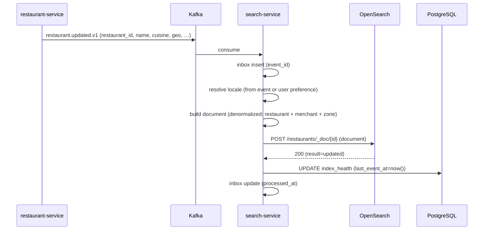
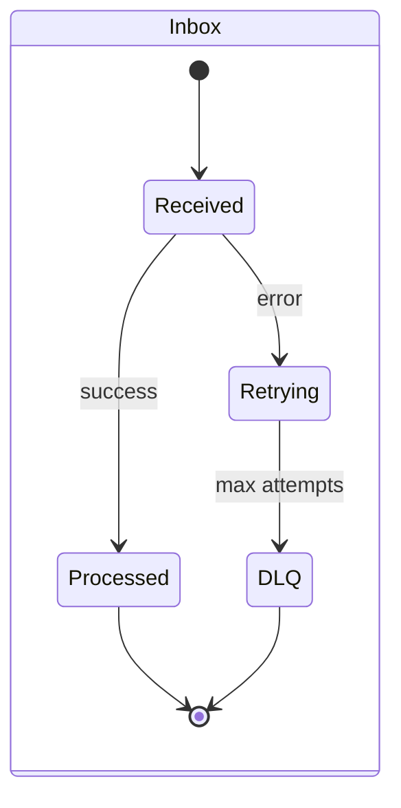
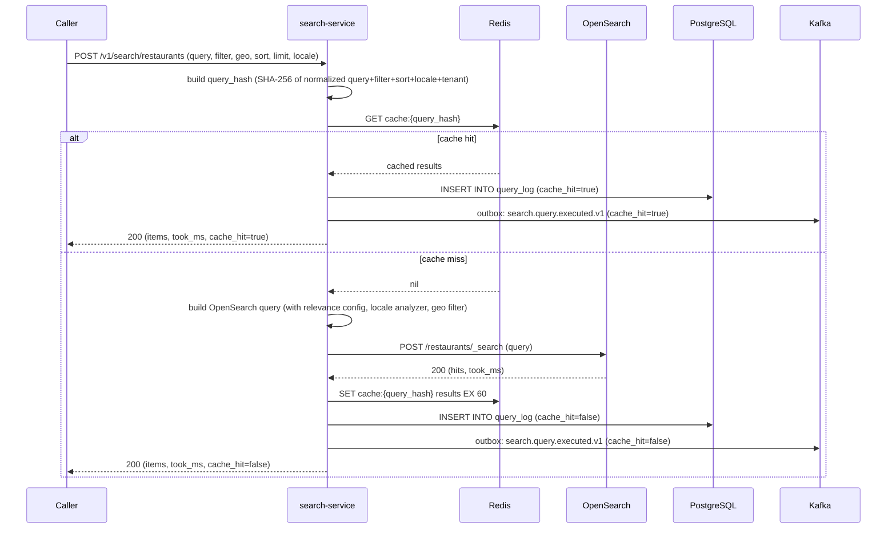
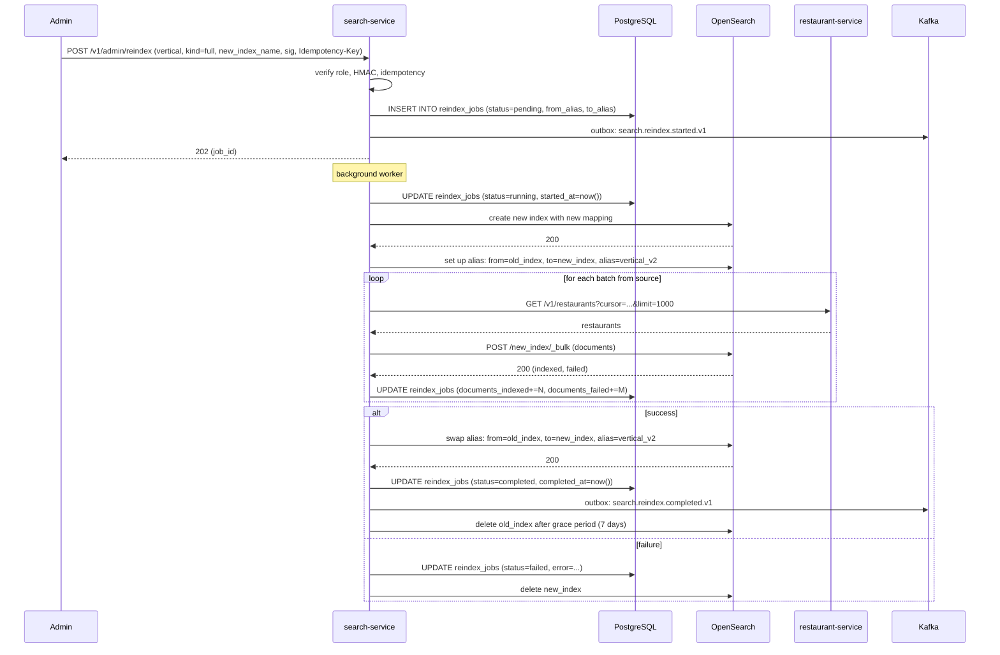
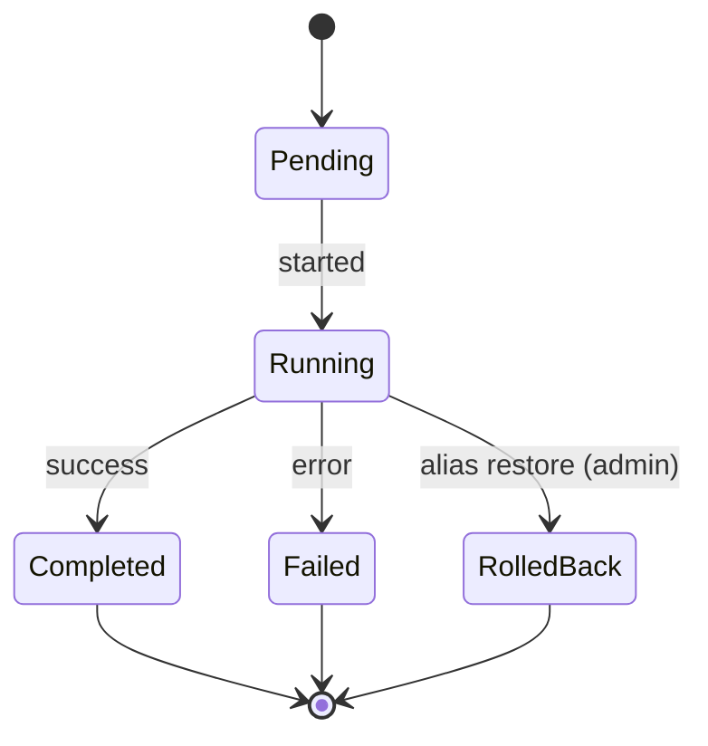
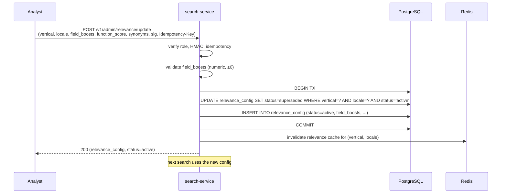
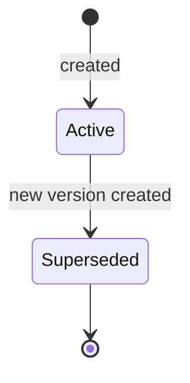
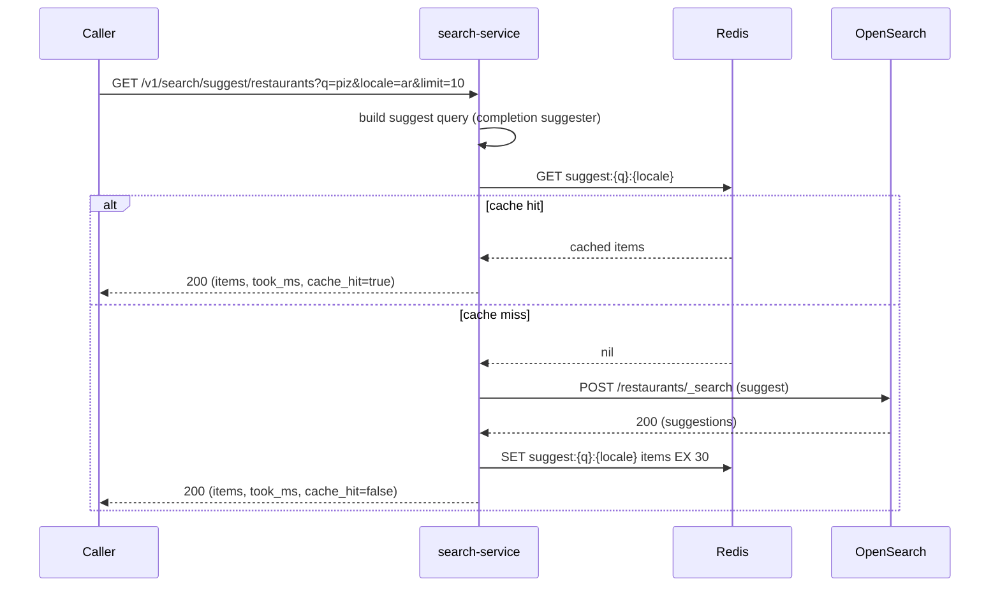

# search-service — Workflows

## 1. Index a Restaurant Update

### 1.1 Objective

When `restaurant-service` emits `restaurant.updated.v1`,
project the restaurant to the OpenSearch index within 5
seconds.

### 1.2 Initiating Actor

`restaurant-service` publishes `restaurant.updated.v1`.

### 1.3 Participating Services

- `restaurant-service` (producer).
- `search-service` (this service) — consumer + actor.
- OpenSearch (the index).
- ``reporting-service` (data lake)` (consumer of `search.query.executed.v1`,
  indirectly via the index).

### 1.4 Prerequisites

- The Kafka consumer is running.
- The `restaurants` index exists and is mapped.
- The relevance config for the vertical / locale is loaded.

### 1.5 Happy Path

### 1.6 Alternate Paths

- **Locale missing**: the default locale (en) is used.
- **Restaurant is soft-deleted**: the document is deleted
  from the index (`DELETE /restaurants/_doc/{id}`).
- **Restaurant is suspended**: the document is updated
  with `suspended=true`; it is still searchable but
  filtered out by the app.

### 1.7 Failure Paths

- **OpenSearch down**: the consumer retries with
  backoff (3 attempts, 1s/4s/16s). After 3 failures, the
  event is routed to DLQ; an alert fires.
- **Document build fails** (e.g. invalid geo): the event
  is logged; the document is not indexed; the event is
  routed to DLQ.
- **DB write fails**: the index is updated, but the
  `index_health` row is stale. A reconciliation job
  repairs the drift.

### 1.8 Business Rules

- BR--003, BR--011, BR--020.
- FR--003, FR--014, FR--015.

### 1.9 State Transitions

The inbox row transitions `received → processed`. The
index_health row is updated (no state machine).

### 1.10 Events

| Event | Direction | When |
|-------|-----------|------|
| `restaurant.updated.v1` | consumed | start of flow |

### 1.11 APIs Involved

| API | Direction | When |
|-----|-----------|------|
| Kafka consumer | inbound | start of flow |
| OpenSearch POST `/{index}/_doc/{id}` | outbound | index |

### 1.12 Compensation / Rollback

- An indexed document is updated, not rolled back. If a
  wrong document was indexed, the next
  `restaurant.updated.v1` event will correct it (or a
  reindex is triggered).

### 1.13 Final State

- The OpenSearch `restaurants` index has the updated
  document.
- The `index_health` row has `last_event_at=now()`.
- The inbox row is marked `processed_at`.

## 2. Search a Restaurant

### 2.1 Objective

Search the `restaurants` index and return ranked results.

### 2.2 Initiating Actor

The customer app (rider / diner) or merchant portal.

### 2.3 Participating Services

- `search-service` (this service).
- OpenSearch (the index).
- ``reporting-service` (data lake)` (consumer of `search.query.executed.v1`).

### 2.4 Prerequisites

- The `restaurants` index is healthy.
- The relevance config is loaded.

### 2.5 Happy Path

### 2.6 Alternate Paths

- **Suggest / autocomplete** (`GET /v1/search/suggest/{v}`):
  a separate path that uses the OpenSearch completion
  suggester; P99 ≤ 100ms.
- **A/B routing** (via ``configuration-service` (flags)`): the
  relevance config may differ per user; the query_hash
  includes the config id so the cache key is correct.
- **Multi-tenant** (when applicable): the cache key
  includes `tenant_id`; tenants see only their own
  results.

### 2.7 Failure Paths

- **OpenSearch down**: 503 `CIRCUIT_OPEN`; the cache
  may still serve hot queries.
- **OpenSearch timeout**: 504 `DEPENDENCY_TIMEOUT`; the
  caller retries.
- **Cache miss + OpenSearch error**: the query is logged
  with `result_count=0`; the caller gets 503.

### 2.8 Business Rules

- BR--002, BR--014, BR--015, BR--019, BR--020, BR--021.
- FR--001, FR--002, FR--006, FR--007, FR--012, FR--014,
  FR--015, FR--017, FR--020.

### 2.9 State Transitions

The query log row is appended (no state machine). The
cache entry transitions `Fresh → Stale → Evicted` (TTL).

### 2.10 Events

| Event | Direction | When |
|-------|-----------|------|
| `search.query.executed.v1` | produced | on every search |

### 2.11 APIs Involved

| API | Direction | When |
|-----|-----------|------|
| `POST /v1/search/restaurants` | inbound | start of flow |
| OpenSearch `_search` | outbound | query |

### 2.12 Compensation / Rollback

- A search is informational; no rollback.

### 2.13 Final State

- A `query_log` row with `query_hash`, `result_count`,
  `latency_ms`, `cache_hit`.
- An outbox row for `search.query.executed.v1`.
- (On cache miss) a cache entry in Redis (TTL 60s).

## 3. Reindex a Vertical

### 3.1 Objective

Reindex a vertical (e.g. `restaurants`) with a new index
mapping (or after a schema change) with zero search
outage.

### 3.2 Initiating Actor

A platform admin (via `POST /v1/admin/reindex`).

### 3.3 Participating Services

- `search-service` (this service).
- OpenSearch.
- `restaurant-service` (backfill source).
- `audit-service` (consumer of reindex events).

### 3.4 Prerequisites

- The new index name is provided.
- The source services are healthy.
- The admin is authorized.

### 3.5 Happy Path

### 3.6 Alternate Paths

- **Incremental reindex** (`kind=incremental`): the source
  is queried with `from=<last_event_at>`; only the
  changed documents are indexed. Faster, but requires the
  source to support `from` filtering.
- **Rollback**: if the new index has issues, the admin
  can manually re-swap the alias to the old index.

### 3.7 Failure Paths

- **Backfill source fails**: retried with backoff; on
  persistent failure, the reindex is marked `failed`;
  the new index is deleted; the old alias remains.
- **Alias swap fails**: same — the reindex is marked
  `failed`; the new index is deleted; the old alias
  remains.
- **OpenSearch down**: the reindex is queued; the worker
  retries; an alert fires.

### 3.8 Business Rules

- BR--005, BR--013.
- FR--009, FR--010, FR--013.

### 3.9 State Transitions

### 3.10 Events

| Event | Direction | When |
|-------|-----------|------|
| `search.reindex.started.v1` | produced | on start |
| `search.reindex.completed.v1` | produced | on completion (or failure) |

### 3.11 APIs Involved

| API | Direction | When |
|-----|-----------|------|
| `POST /v1/admin/reindex` | inbound | start of flow |
| OpenSearch (create, bulk, alias) | outbound | reindex |
| Source service GET | outbound | backfill |

### 3.12 Compensation / Rollback

- A failed reindex is rolled back (new index deleted,
  old alias remains). The reindex can be retried.
- A successful reindex can be manually rolled back by
  re-swapping the alias to the old index.

### 3.13 Final State

- `reindex_jobs` row with `status=completed` (or
  `failed`).
- The new index is active; the old index is deleted
  after a 7-day grace period.
- Outbox rows for `search.reindex.started.v1` and
  `search.reindex.completed.v1`.

## 4. Update Relevance Config

### 4.1 Objective

Update the relevance config for a vertical / locale
(e.g. boost `name` for restaurants, add synonyms) and
hot-reload it.

### 4.2 Initiating Actor

A data analyst or admin.

### 4.3 Participating Services

- `search-service` (this service).
- `configuration-service` (the source of truth for the
  config; the service reloads on `configuration.updated.v1`).

### 4.4 Prerequisites

- The actor is `admin` or `data_analyst`.
- The HMAC signature is valid.

### 4.5 Happy Path

### 4.6 Alternate Paths

- **A/B test**: the analyst can specify an A/B split
  (e.g. 50% old, 50% new); the new config is marked
  `status=ab_test`; a fraction of users see the new
  config (per ``configuration-service` (flags)`).

### 4.7 Failure Paths

- **Validation fails**: 400 `VALIDATION_FAILED`; no DB
  write; the old config remains active.
- **DB write fails**: 500; the old config remains active.

### 4.8 Business Rules

- BR--006, BR--014.
- FR--011, FR--020.

### 4.9 State Transitions

The relevance config state:

### 4.10 Events

- No events produced (internal config change).

### 4.11 APIs Involved

| API | Direction | When |
|-----|-----------|------|
| `POST /v1/admin/relevance/update` | inbound | start of flow |

### 4.12 Compensation / Rollback

- A relevance config change is not rolled back. The
  analyst can create a new version that supersedes the
  current one (effectively a rollback).

### 4.13 Final State

- `relevance_config` row with `status=active` (new
  version); the old version has `status=superseded`.
- The Redis relevance cache for `(vertical, locale)` is
  invalidated.
- The next search uses the new config.

## 5. Suggest / Autocomplete

### 5.1 Objective

Provide autocomplete suggestions for a search query
(e.g. as the user types "piz", return "Pizza Palace",
"Pizzeria Roma").

### 5.2 Initiating Actor

The customer app (rider / diner) or merchant portal.

### 5.3 Participating Services

- `search-service` (this service).
- OpenSearch (the completion suggester).

### 5.4 Prerequisites

- The completion suggester is configured on the index.
- The relevance config is loaded.

### 5.5 Happy Path

### 5.6 Alternate Paths

- **Locale missing**: default locale (en) is used.
- **No suggestions**: empty result; the client shows
  nothing.

### 5.7 Failure Paths

- **OpenSearch down**: 503 `CIRCUIT_OPEN`; the caller
  is expected to fall back to a non-suggesting UI.

### 5.8 Business Rules

- BR--016.
- FR--008, FR--017.

### 5.9 State Transitions

The cache entry transitions `Fresh → Stale → Evicted`
(TTL 30s). No state machine for the suggester itself.

### 5.10 Events

- `search.query.executed.v1` is emitted for every
  suggest call (so the analytics team can see what users
  are typing).

### 5.11 APIs Involved

| API | Direction | When |
|-----|-----------|------|
| `GET /v1/search/suggest/{v}` | inbound | start of flow |
| OpenSearch `_search` (suggest) | outbound | query |

### 5.12 Compensation / Rollback

- A suggest is informational; no rollback.

### 5.13 Final State

- A `query_log` row (with `query_hash`).
- An outbox row for `search.query.executed.v1`.
- (On cache miss) a cache entry in Redis (TTL 30s).

---

## See also

### Sibling docs for this service

- [`README.md`](./README.md) — purpose, bounded context, responsibilities
- [`BRD.md`](./BRD.md) — business requirements
- [`SRS.md`](./SRS.md) — functional + non-functional requirements
- [`ERD.md`](./ERD.md) — data model (entities, relationships)
- [`INTEGRATION.md`](./INTEGRATION.md) — inter-service contracts (APIs, events, sagas)
- [`WORKFLOWS.md`](./WORKFLOWS.md) — operational workflows (happy paths, failure modes)
- [`TECH.md`](./TECH.md) — technology profile (runtime, libraries, data layer, admin endpoints, RBAC)

### Platform-wide

- [`../../shared/README.md`](../../shared/README.md) — `platform-spring-boot-starter` shared library (the single source of cross-cutting code for all Spring Boot services in the platform)
- [`../RECOMMENDATIONS.md`](../RECOMMENDATIONS.md) — platform-wide technology map (language, framework, version baseline, admin/RBAC pattern)
- [`../../README.md`](../../README.md) — services overview (the catalog of all 20 services)
- [`../../../main.md`](../../../main.md) — top-level platform specification (architecture, Keycloak, PostgreSQL 18, messaging, observability baseline)

