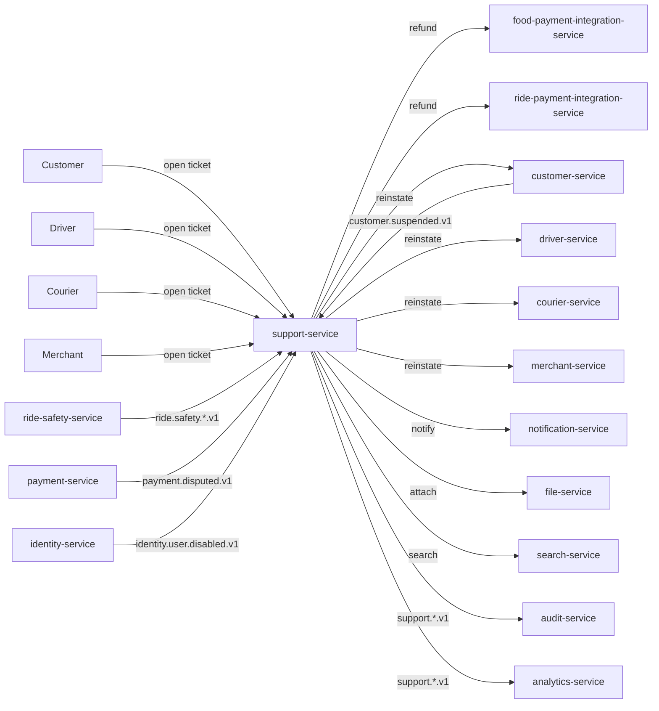
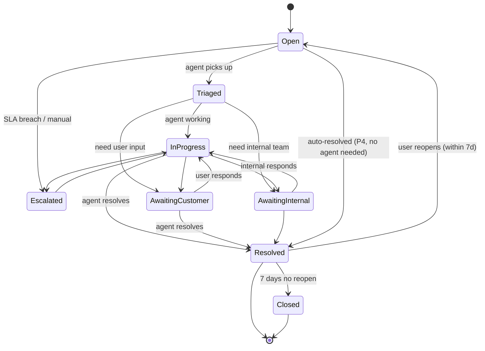

# support-service — Software Requirements Specification

## 1. Introduction

This SRS specifies, for the engineering team, the functional,
non-functional, data, security, and operational requirements of
`support-service`. It is derived from `BRD.md`, the platform's
cross-service architecture, and the integration with
`SAFETY_WORKFLOWS.md` and `REFUND_WORKFLOWS.md`.

## 2. Scope

In scope:

- All REST endpoints listed in `INTEGRATION.md` (tickets,
  messages, escalate, resolve, refund, reinstate, DSAR).
- Ticket lifecycle and severity matrix.
- Agent RBAC and co-signature.
- Refund initiation (delegated to payment integration
  services).
- Account re-instatement (delegated to profile services).
- DSAR (access / erasure) orchestration.
- Event consumption (`ride.safety.*.v1`,
  `payment.disputed.v1`, `customer.suspended.v1`, etc.).
- Event production (`support.ticket.*.v1`,
  `support.incident.*.v1`, `support.action.performed.v1`).

Out of scope:

- Customer / driver / courier / merchant profile data.
- Payment execution.
- Fraud scoring.
- Safety detection.

## 3. System Context

## 4. Actors

| Actor | Type | Description |
|-------|------|-------------|
| Customer | human | opens ticket, adds message |
| Driver / Courier | human | same |
| Merchant / Restaurant staff | human | same |
| Support agent (L1, L2, L3) | human | triage, assign, resolve |
| Safety team | human | handles P1 safety |
| Fraud team | human | handles chargebacks |
| Finance team | human | handles large refunds |
| Compliance officer | human | handles DSAR, legal hold |
| `ride-safety-service` | system | producer |
| `payment-service` | system | producer |
| `customer-service`, `driver-service`, `courier-service`, `merchant-service` | system | profile reads, re-instatement |
| `food-payment-integration-service`, `ride-payment-integration-service` | system | refund execution |
| `notification-service` | system | send ticket updates |
| `file-service` | system | attachments |
| `search-service` | system | ticket search |

## 5. Functional Requirements

| ID | Requirement | Priority |
|----|-------------|----------|
| FR--001 | The service MUST expose CRUD endpoints for tickets (`POST /v1/tickets`, `GET /v1/tickets/{id}`, `PATCH /v1/tickets/{id}`, `GET /v1/tickets`). | MUST |
| FR--002 | The service MUST expose `POST /v1/tickets/{id}/messages` for adding a message to a ticket (user or agent). | MUST |
| FR--003 | The service MUST expose `POST /v1/tickets/{id}/escalate` for escalating to L2/L3/safety/fraud/finance. | MUST |
| FR--004 | The service MUST expose `POST /v1/tickets/{id}/resolve` for resolving a ticket. | MUST |
| FR--005 | The service MUST expose `POST /v1/tickets/{id}/refund` for issuing a refund (delegated to payment integration services). | MUST |
| FR--006 | The service MUST expose `POST /v1/tickets/{id}/reinstate` for re-instating a suspended account. | MUST |
| FR--007 | The service MUST consume `ride.safety.sos.v1` and open a P1 ticket within 60 seconds. | MUST |
| FR--008 | The service MUST consume `ride.safety.incident.v1` and open a P1 ticket within 60 seconds. | MUST |
| FR--009 | The service MUST consume `payment.disputed.v1` and open a P1 ticket within 60 seconds. | MUST |
| FR--010 | The service MUST consume `customer.suspended.v1` and open a P2 review ticket. | MUST |
| FR--011 | The service MUST consume `identity.user.disabled.v1` and open a P2 review ticket. | MUST |
| FR--012 | The service MUST consume `notification.failed.v1` and open a P1 ticket if it's a money event. | MUST |
| FR--013 | The service MUST emit `support.ticket.opened.v1`, `support.ticket.resolved.v1`, `support.action.performed.v1`, `support.incident.opened.v1`, `support.incident.resolved.v1`. | MUST |
| FR--014 | The service MUST enforce the severity matrix (P1/P2/P3/P4) and SLA timers per configuration. | MUST |
| FR--015 | The service MUST enforce agent RBAC (L1/L2/L3/safety/fraud/finance/compliance/admin). | MUST |
| FR--016 | The service MUST enforce refund limits per agent and per ticket; refund > $500 requires co-signature. | MUST |
| FR--017 | The service MUST use `Idempotency-Key = ticket:<ticket_id>:refund:<N>` for refund calls. | MUST |
| FR--018 | The service MUST honor DSAR access / erasure requests within 30 days. | MUST |
| FR--019 | The service MUST record every agent action in an audit log. | MUST |
| FR--020 | The service MUST allow the user to reopen a resolved ticket within 7 days. | SHOULD |
| FR--021 | The service MUST support attachments via `file-service`. | MUST |
| FR--022 | The service MUST auto-escalate on SLA breach. | MUST |
| FR--023 | The service MUST support a "fraud hold" flag that prevents the user from performing high-value actions while the ticket is open. | MUST |
| FR--024 | The service MUST respect "do not contact" preferences for ticket update notifications. | MUST |
| FR--025 | The service MUST document an OpenAPI 3.1 spec at `/openapi.json`. | MUST |

## 6. Non-Functional Requirements

| ID | Category | Requirement | Target |
|----|----------|-------------|--------|
| NFR--001 | performance | P1 ticket open from SOS | ≤ 60s end-to-end |
| NFR--002 | performance | P1 ticket open from chargeback | ≤ 60s end-to-end |
| NFR--003 | performance | ticket read P95 | ≤ 200ms |
| NFR--004 | performance | ticket message P95 | ≤ 500ms |
| NFR--005 | availability | service uptime | 99.9% (T2) |
| NFR--006 | scalability | tickets open per minute per replica | ≥ 100 |
| NFR--007 | maintainability | MTTR | ≤ 30 min |
| NFR--008 | correctness | SLA breach rate (P1) | 0% |
| NFR--009 | observability | all actions have `correlation_id` and `trace_id` | 100% |
| NFR--010 | auditability | all agent actions in audit log | 100% |
| NFR--011 | resilience | downstream outage → queue the action for retry | ≤ 5 min queue depth |

## 7. API Requirements

- All public endpoints follow `architecture/API_STANDARDS.md`.
- Bearer JWT (validated at gateway); internal calls use
  client-credentials tokens.
- Cursor pagination on list endpoints.
- `Idempotency-Key` required on state-changing POSTs.
- `X-Correlation-Id` and `traceparent` propagated.
- HMAC signature on high-value admin actions
  (refund > $500, re-instatement, DSAR).

(Full contract in INTEGRATION.md.)

## 8. Data Requirements

| ID | Requirement | Notes |
|----|-------------|-------|
| DATA--001 | All tables live in schema `support`. | |
| DATA--002 | Ticket body, conversation messages, attachments are PII; encrypted at rest (`pgcrypto`). | |
| DATA--003 | `support.actions` (audit) is partitioned by month. | append-only |
| DATA--004 | Primary keys are UUIDv7. | |
| DATA--005 | Cross-service references (`customer_id`, `trip_id`, `order_id`, `payment_id`) are UUID columns WITHOUT database FKs. | per `DATA_OWNERSHIP.md` |
| DATA--006 | Every mutable table has `created_at`, `updated_at`, `created_by`, `updated_by`, `deleted_at`. | |
| DATA--007 | Soft delete: `deleted_at TIMESTAMPTZ NULL`; reads filter `WHERE deleted_at IS NULL`. | |
| DATA--008 | JSONB allowed only for: ticket metadata, agent notes, audit `before`/`after` snapshots. | |

## 9. Validation Rules

- **FR--001 (open ticket)**: `subject` 5..200 chars; `body`
  10..10000 chars; `category` ∈ configured categories;
  `severity` ∈ {P1, P2, P3, P4} (auto-derived from category
  per severity matrix; explicit override requires L2+).
- **FR--002 (message)**: `body` 1..10000 chars; `kind` ∈
  {user, agent, internal_note, system}.
- **FR--005 (refund)**: `amount_minor` > 0; `currency` ISO
  4217; `reason` non-empty; ≤ per-agent limit
  (`support.refund.max_per_agent_minor`); ≤ per-ticket
  limit (`support.refund.max_per_ticket_minor`); > $500
  requires co-signature.
- **FR--006 (reinstate)**: `actor_sub` of the agent;
  co-signature required (HMAC signed by a second admin).
- **FR--018 (DSAR)**: `kind` ∈ {access, erasure};
  `user_id`; verified by ID before processing.

## 10. State Transitions

Pointer: see `WORKFLOWS.md` §1, §2, §3, §4, §5, §6. The
ticket state machine:

## 11. Authorization Requirements

- User can open / read / message their own tickets.
- Support agent L1 can read all tickets in their assigned
  queues; can resolve P3/P4; can refund up to $20.
- Support agent L2 can read all tickets; can resolve
  P1-P4; can refund up to $100; can escalate.
- Support agent L3 can read all tickets; can refund up to
  $500; can reinstate (with co-signature).
- Safety role: handles P1 safety tickets; can reinstate
  driver / courier.
- Fraud role: handles chargebacks; can mark "fraud hold".
- Finance role: handles large refunds; can refund > $500
  (with co-signature).
- Compliance role: handles DSAR.
- Admin: full access.

## 12. Configuration Requirements

- `support.severity_matrix` — object mapping event types
  to severity.
- `support.sla.p1.first_response_seconds` — int (60).
- `support.sla.p2.first_response_seconds` — int (3600).
- `support.sla.p3.first_response_seconds` — int (86400).
- `support.sla.p4.first_response_seconds` — int (172800).
- `support.refund.max_per_agent_minor` — int (10000).
- `support.refund.max_per_ticket_minor` — int (50000).
- `support.refund.co_signature_threshold_minor` — int
  (50000).
- `support.escalation.l1_to_l2_seconds` — int (1800).
- `support.escalation.l2_to_l3_seconds` — int (3600).
- `support.reopen_window_days` — int (7).
- `support.dsar.deadline_days` — int (30).

## 13. Error Handling

| Error | When | Response |
|-------|------|----------|
| `VALIDATION_FAILED` | input schema or business validation fails | 400 |
| `UNAUTHENTICATED` / `FORBIDDEN` | auth | 401 / 403 |
| `NOT_FOUND` | ticket not found | 404 |
| `TICKET_CLOSED` | action on a closed ticket | 409 |
| `RATE_LIMITED` | per-user or per-agent | 429 |
| `REFUND_LIMIT_EXCEEDED` | over per-agent or per-ticket limit | 422 |
| `CO_SIGNATURE_REQUIRED` | high-value action without co-signature | 409 |
| `SIGNATURE_INVALID` | HMAC mismatch | 409 |
| `IDEMPOTENCY_KEY_REUSED` | key with different body | 422 |
| `DOWNSTREAM_UNAVAILABLE` | payment / profile service down | 503 |
| `INTERNAL_ERROR` | unexpected | 500 |

## 14. Concurrency Requirements

- Ticket state transitions use optimistic concurrency on
  `version` (If-Match header).
- The SLA timer worker uses `SELECT … FOR UPDATE SKIP LOCKED`
  to fan out across multiple workers.
- The audit log is append-only; no row is updated.
- The refund call uses the outbox + inbox pattern with
  `Idempotency-Key`.

## 15. Idempotency Requirements

- All state-changing POSTs require `Idempotency-Key`.
  Stored for 24h.
- Refund calls use `Idempotency-Key = ticket:<ticket_id>:refund:<N>`
  (matches the platform's refund idempotency pattern).
- All event emissions are guarded by the outbox pattern.

## 16. Performance

- **Dominant path**: `GET /v1/tickets/{id}` and
  `POST /v1/tickets/{id}/messages`.
- **P50 / P95 / P99** (read): 30ms / 100ms / 200ms.
- **P50 / P95 / P99** (message): 100ms / 300ms / 500ms.
- **P1 ticket open from event**: P95 ≤ 60s end-to-end
  (dominated by Kafka consumer lag + DB write).

## 17. Scalability

- **Horizontal scaling**: stateless replicas behind a load
  balancer. HPA on CPU 60% and on
  `tickets_in_flight > 500`. Max replicas 20.
- **Vertical scaling**: typical 500m CPU / 768Mi memory
  requests; 1 CPU, 1.5Gi limits.

## 18. Availability

- **SLO**: 99.9% over 30 days. Error budget: ~44 min / 30d.
- **Maintenance window**: Sunday 04:00–06:00 UTC.
- **Critical path**: P1 ticket open from event must
  succeed even if downstream services are down. The
  ticket is opened; the action is queued and retried.

## 19. Security

| ID | Requirement | Notes |
|----|-------------|-------|
| SEC--001 | All endpoints require bearer JWT. | per `SECURITY_ARCHITECTURE.md` §2 |
| SEC--002 | Agent RBAC enforced at every endpoint. | per §3, §15 |
| SEC--003 | High-value actions (refund > $500, re-instatement, DSAR) require co-signature. | per §14 |
| SEC--004 | Ticket body, conversation, attachments encrypted at rest (`pgcrypto`). | per §6, §7 |
| SEC--005 | DSAR access request: data package signed URL, encrypted. | per §7 |
| SEC--006 | Per-user and per-agent rate limiting. | per §12 |
| SEC--007 | Every agent action in audit log. | per §9 |
| SEC--008 | No PAN, CVV, or financial PII in the ticket body (use `payment_id` reference). | per §8 |

## 20. Privacy

- **PII stored**: ticket body, conversation, attachments
  (Confidential).
- **Retention**: 7 years (financial tickets); 1 year (others).
- **Erasure**: on DSAR erasure request, ticket body and
  conversation are purged; the ticket metadata is retained
  with `user_id` nulled for audit.

## 21. Auditability

- **Audit events**:
  - `support.action.performed.v1` for every agent action
    (refund, reinstate, escalate, etc.).
  - `support.ticket.opened.v1` / `.resolved.v1`.
  - `support.incident.opened.v1` / `.resolved.v1`.
- The `support.actions` table is append-only, monthly
  partitioned, 7y retention for financial; 1y for others.

## 22. Observability

- **Logs**: JSON to stdout; per `OBSERVABILITY.md`. Standard
  fields plus `ticket_id`, `agent_sub`, `severity`, `action`.
- **Metrics** (Prometheus):
  - `http_requests_total{route, method, status}`
  - `http_request_duration_seconds{route, method, status}` (histogram)
  - `tickets_opened_total{severity, source}`
  - `tickets_resolved_total{severity, source}`
  - `tickets_open{severity}` (gauge)
  - `ticket_first_response_seconds{severity}` (histogram)
  - `ticket_resolution_seconds{severity}` (histogram)
  - `sla_breaches_total{severity, sla_type}`
  - `agent_actions_total{action}`
  - `dsar_completed_total{kind, on_time}`
- **Traces**: OpenTelemetry; root span per agent action.
- **Alerts**:
  - P1 SLA breach (no response in 60s) → page on-call.
  - P1 ticket open latency > 60s for 5 min → page.
  - SLA breach rate > 5% (P2) for 15 min → warn.

## 23. Maintainability

- **Code style**: TypeScript strict, ESLint, Prettier.
- **Test coverage**: ≥ 85%.
- **Documentation**: OpenAPI 3.1 spec; CI validates.

## 24. Disaster Recovery

- **RPO**: 1h. Ticket history can be rebuilt from
  downstream service events.
- **RTO**: 30 min. Stateless service.

## 25. Acceptance Criteria

- All 25 functional requirements implemented and verified.
- All 11 non-functional requirements met.
- All 8 security requirements verified.
- A `ride.safety.sos.v1` in staging results in a P1 ticket
  within 60s.
- A `payment.disputed.v1` in staging results in a P1 ticket
  within 60s.
- A refund of $600 in staging requires co-signature.
- A DSAR access request results in a data package within
  30 days (test with shorter deadline in staging).

---

## See also

### Sibling docs for this service

- [`README.md`](./README.md) — purpose, bounded context, responsibilities
- [`BRD.md`](./BRD.md) — business requirements
- [`SRS.md`](./SRS.md) — functional + non-functional requirements
- [`ERD.md`](./ERD.md) — data model (entities, relationships)
- [`INTEGRATION.md`](./INTEGRATION.md) — inter-service contracts (APIs, events, sagas)
- [`WORKFLOWS.md`](./WORKFLOWS.md) — operational workflows (happy paths, failure modes)
- [`TECH.md`](./TECH.md) — technology profile (runtime, libraries, data layer, admin endpoints, RBAC)

### Platform-wide

- [`../../shared/README.md`](../../shared/README.md) — `platform-spring-boot-starter` shared library (the single source of cross-cutting code for all Spring Boot services in the platform)
- [`../RECOMMENDATIONS.md`](../RECOMMENDATIONS.md) — platform-wide technology map (language, framework, version baseline, admin/RBAC pattern)
- [`../../README.md`](../../README.md) — services overview (the catalog of all 58 services)
- [`../../../main.md`](../../../main.md) — top-level platform specification (architecture, Keycloak, PostgreSQL 18, messaging, observability baseline)

