# support-service — Workflows

## 1. Open a P1 Safety Ticket from SOS

### 1.1 Objective

When a customer presses the SOS button during a ride, the
platform must open a P1 support ticket within 60 seconds and
page the safety on-call.

### 1.2 Initiating Actor

`ride-safety-service` publishes `ride.safety.sos.v1`.

### 1.3 Participating Services

- `ride-safety-service` (producer).
- `support-service` (this service) — consumer + actor.
- `notification-service` (pages on-call; sends the user
  confirmation).
- `audit-service` (consumer of `support.incident.opened.v1`).

### 1.4 Prerequisites

- The Kafka consumer is running.
- The `ride.safety.sos.v1` event includes the `trip_id`,
  `customer_id`, `driver_id`, and `location`.

### 1.5 Happy Path

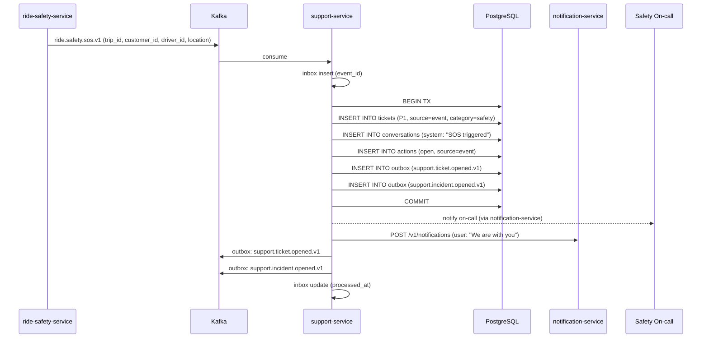

### 1.6 Alternate Paths

- **Event arrives but the DB is down**: the consumer
  retries with backoff (3 attempts, 1s/4s/16s). After 3
  failures, the event is routed to DLQ; an alert fires;
  the on-call is paged manually by the alert.
- **Duplicate SOS** (e.g. user pressed twice): the inbox
  dedupes on `event_id`; the second consume is a no-op.

### 1.7 Failure Paths

- **Ticket creation fails**: the consumer retries. If
  persistent failure, the event goes to DLQ. A safety
  officer is paged by the alert.
- **Notification to user fails**: the ticket is still
  open; the user can be re-notified when the service
  recovers. The on-call is the priority.

### 1.8 Business Rules

- BR--011 (P1 within 60s of SOS).
- FR--007.
- SEC--007 (every action audited).

### 1.9 State Transitions

The ticket transitions `[*] → Open → Triaged → InProgress →
Resolved` (in the safety team's hands).

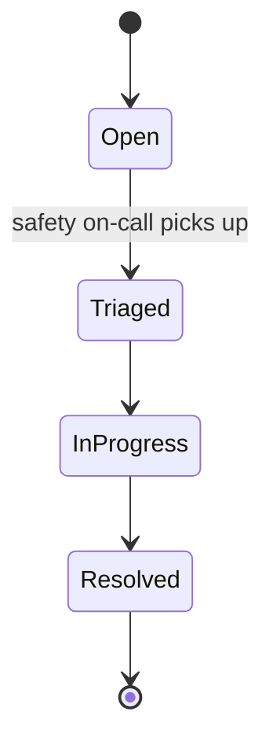

### 1.10 Events

| Event | Direction | When |
|-------|-----------|------|
| `ride.safety.sos.v1` | consumed | start of flow |
| `support.ticket.opened.v1` | produced | after commit |
| `support.incident.opened.v1` | produced | after commit |

### 1.11 APIs Involved

| API | Direction | When |
|-----|-----------|------|
| Kafka consumer | inbound | start of flow |
| `POST /v1/notifications` | outbound | page on-call; notify user |

### 1.12 Compensation / Rollback

- There is no rollback. The ticket is opened; the safety
  team handles the rest.

### 1.13 Final State

- A `tickets` row in `support.tickets` with `severity=P1`,
  `status=open`, `source=event`.
- A `conversations` row (system message: "SOS triggered").
- An `actions` row (audit).
- Outbox rows for `support.ticket.opened.v1` and
  `support.incident.opened.v1`.

## 2. Triage and Respond to a Customer Ticket

### 2.1 Objective

A support agent picks up an open ticket, talks with the
customer, and either resolves it or escalates it.

### 2.2 Initiating Actor

A support agent (L1, L2, L3).

### 2.3 Participating Services

- `support-service` (this service).
- `notification-service` (sends the user the agent's
  message).

### 2.4 Prerequisites

- The ticket is in `open` or `triaged` state.
- The agent has the appropriate role.

### 2.5 Happy Path

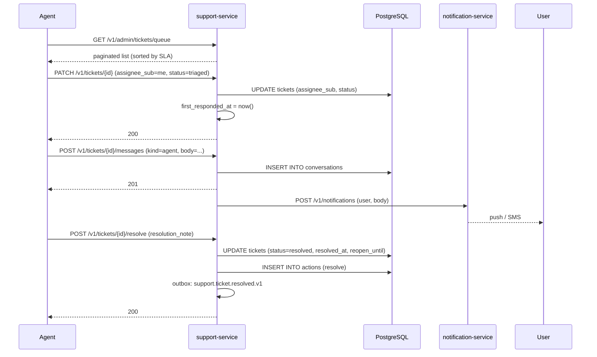

### 2.6 Alternate Paths

- **Agent needs more info from user**: status →
  `awaiting_customer`; user is notified; agent waits.
- **Agent needs internal team**: status →
  `awaiting_internal`; the relevant team is paged.
- **Agent decides to escalate**: workflow 6 (Escalate on
  SLA breach or manual).

### 2.7 Failure Paths

- **Version mismatch on PATCH**: 409 `VERSION_MISMATCH`;
  the agent re-fetches the ticket and retries.
- **Notification fails**: the message is still in the
  conversation thread; the user will see it on next
  refresh. The agent is informed.

### 2.8 Business Rules

- BR--012, BR--013.
- FR--001..FR--004.

### 2.9 State Transitions

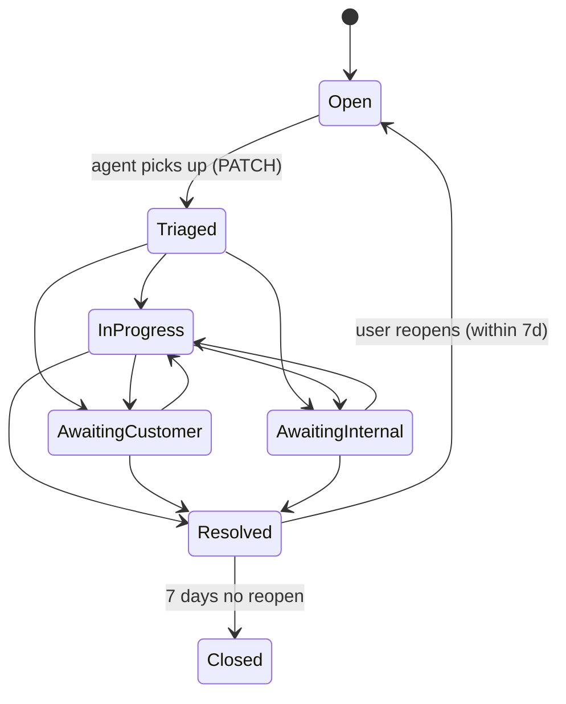

### 2.10 Events

| Event | Direction | When |
|-------|-----------|------|
| `support.ticket.resolved.v1` | produced | on resolve |

### 2.11 APIs Involved

| API | Direction | When |
|-----|-----------|------|
| `GET /v1/admin/tickets/queue` | inbound | list |
| `PATCH /v1/tickets/{id}` | inbound | assign / status |
| `POST /v1/tickets/{id}/messages` | inbound | message |
| `POST /v1/tickets/{id}/resolve` | inbound | resolve |
| `POST /v1/notifications` | outbound | notify user |

### 2.12 Compensation / Rollback

- A resolved ticket can be reopened by the user within
  7 days (workflow 2's "alternate" path).
- A message cannot be unsent; the agent can add a
  follow-up.

### 2.13 Final State

- `tickets` row with `status=resolved`, `resolved_at`,
  `reopen_until=resolved_at + 7 days`.
- `conversations` rows for each message.
- `actions` row for the resolve.
- Outbox row for `support.ticket.resolved.v1`.

## 3. Issue a Refund from a Ticket

### 3.1 Objective

A support agent issues a refund to a customer from a
ticket, with proper authorization and idempotency.

### 3.2 Initiating Actor

A support agent (L1, L2, L3, or finance).

### 3.3 Participating Services

- `support-service` (this service) — owner of the policy.
- `food-payment-integration-service` or
  `ride-payment-integration-service` — executor of the
  refund.
- `payment-service` (consumer of `payment.refund.*.v1`).
- `audit-service` (consumer of `support.action.performed.v1`).

### 3.4 Prerequisites

- The agent has the appropriate role (L1 ≤ $20; L2 ≤ $100;
  L3 ≤ $500; finance > $500 with co-signature).
- The ticket is open or in progress.
- The payment exists and is capturable / refundable.

### 3.5 Happy Path

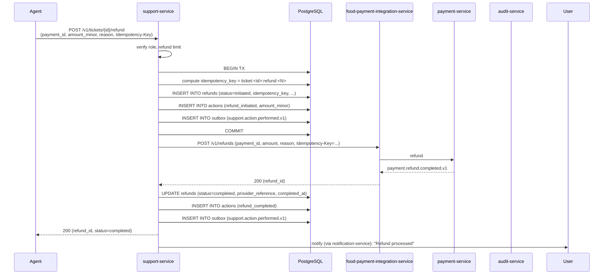

### 3.6 Alternate Paths

- **Refund to wallet** (instead of original method): the
  agent specifies `target=wallet`; the payment integration
  credits the wallet instead of refunding the provider.
- **Partial refund**: the agent specifies a smaller
  `amount_minor` than the captured amount.

### 3.7 Failure Paths

- **Refund limit exceeded**: 422 `REFUND_LIMIT_EXCEEDED`.
- **Co-signature required but missing**: 409
  `CO_SIGNATURE_REQUIRED`.
- **Payment integration fails** (provider timeout): the
  service retries with backoff (2 attempts). On persistent
  failure, the refund is marked `failed`; a follow-up P1
  ticket is opened (per `REFUND_WORKFLOWS.md`); the user
  is notified.
- **Idempotency-Key reuse with different body**: 422
  `IDEMPOTENCY_KEY_REUSED`.
- **Ticket closed**: 409 `TICKET_CLOSED`.

### 3.8 Business Rules

- BR--014, BR--015, BR--021, BR--022.
- FR--005, FR--015, FR--016, FR--017.

### 3.9 State Transitions

The refund state machine:

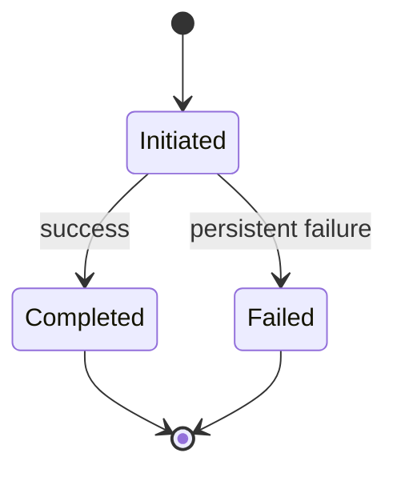

### 3.10 Events

| Event | Direction | When |
|-------|-----------|------|
| `support.action.performed.v1` | produced | on refund initiation and completion |
| `payment.refund.completed.v1` | consumed (via FPI) | updates refund state |
| `payment.refund.failed.v1` | consumed (via FPI) | marks refund failed |

### 3.11 APIs Involved

| API | Direction | When |
|-----|-----------|------|
| `POST /v1/tickets/{id}/refund` | inbound | start of flow |
| `POST /v1/refunds` (FPI / RPI) | outbound | execute refund |
| `POST /v1/notifications` | outbound | notify user |

### 3.12 Compensation / Rollback

- A refund is not rolled back. If issued by mistake, the
  agent can issue a "clawback" (see `REFUND_WORKFLOWS.md`
  §Compensation).
- A failed refund is retried by the payment integration
  service; if persistent, a follow-up P1 ticket is opened.

### 3.13 Final State

- `refunds` row with `status=completed` (or `failed`).
- `actions` rows for `refund_initiated` and
  `refund_completed` (or `refund_failed`).
- Outbox rows for `support.action.performed.v1`.

## 4. Re-instate a Suspended Account

### 4.1 Objective

Re-instate a customer / driver / courier / merchant who was
suspended (by fraud, safety, or admin) after the issue is
resolved.

### 4.2 Initiating Actor

A support agent (L3 or safety) with co-signature from
another admin.

### 4.3 Participating Services

- `support-service` (this service) — policy owner.
- `customer-service` / `driver-service` / `courier-service`
  / `merchant-service` — executor.
- `identity-service` (re-enable login).
- `notification-service` (notify the user).
- `audit-service` (consumer of `support.action.performed.v1`).

### 4.4 Prerequisites

- The agent is L3 or safety.
- The co-signature is valid (HMAC from a second admin).
- The account is currently suspended or disabled.

### 4.5 Happy Path

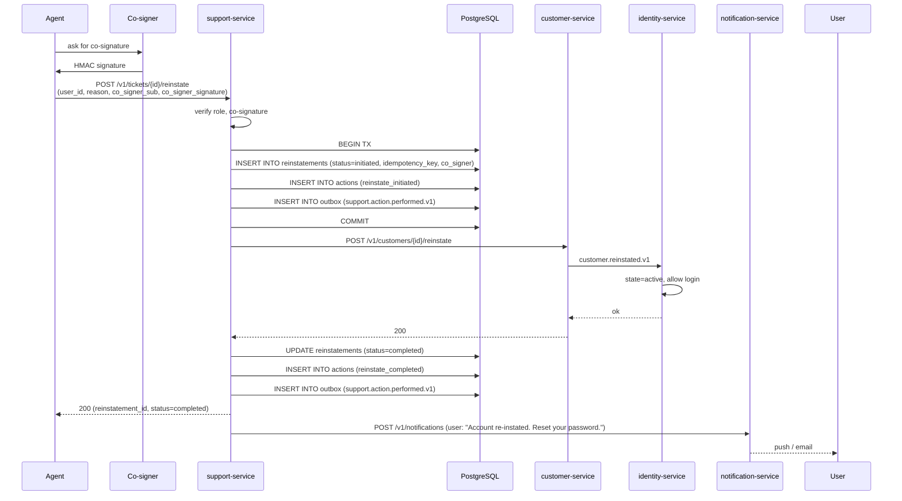

### 4.6 Alternate Paths

- **Driver / courier re-instatement**: same flow but
  `driver-service` / `courier-service` is the executor.
- **Merchant re-instatement**: same flow with
  `merchant-service`.

### 4.7 Failure Paths

- **Co-signature invalid**: 409 `CO_SIGNATURE_REQUIRED` or
  `SIGNATURE_INVALID`.
- **Account not suspended**: 409 `STATE_INVALID` (the
  account is already active; re-instatement is a no-op).
- **Customer service down**: 503 `DOWNSTREAM_UNAVAILABLE`;
  the re-instatement is queued for retry.

### 4.8 Business Rules

- BR--024.
- FR--006, FR--015.

### 4.9 State Transitions

The re-instatement state machine:

The account transitions (in the respective service):
`suspended → active`.

### 4.10 Events

| Event | Direction | When |
|-------|-----------|------|
| `support.action.performed.v1` | produced | on initiation and completion |
| `customer.reinstated.v1` (etc.) | consumed | updates account state |

### 4.11 APIs Involved

| API | Direction | When |
|-----|-----------|------|
| `POST /v1/tickets/{id}/reinstate` | inbound | start of flow |
| `POST /v1/customers/{id}/reinstate` (etc.) | outbound | execute |

### 4.12 Compensation / Rollback

- A re-instatement is not rolled back. If issued by mistake,
  the account is re-suspended (a new ticket).

### 4.13 Final State

- `reinstatements` row with `status=completed`.
- `actions` rows for `reinstate_initiated` and
  `reinstate_completed`.
- The account is `active` in the respective service.

## 5. Honor a Data Subject Access Request (DSAR)

### 5.1 Objective

Honor a GDPR / PDPL data subject access request: collect
the user's data from all services, return a signed,
encrypted data package within 30 days.

### 5.2 Initiating Actor

The user (via `support-service` API, or via an email to
privacy@example.com which is triaged into the support
system).

### 5.3 Participating Services

- `support-service` (this service) — orchestrator.
- `customer-service` / `driver-service` / `courier-service` /
  `merchant-service` — collect profile.
- `payment-service` — collect payment history (no PAN).
- `ride-history-service` / `food-order-service` — collect
  trip / order history.
- `notification-service` — send the user the signed URL.
- `file-service` — store the data package.

### 5.4 Prerequisites

- The user is verified (identity check via
  `identity-service`).
- The request is within the 30-day SLA.

### 5.5 Happy Path

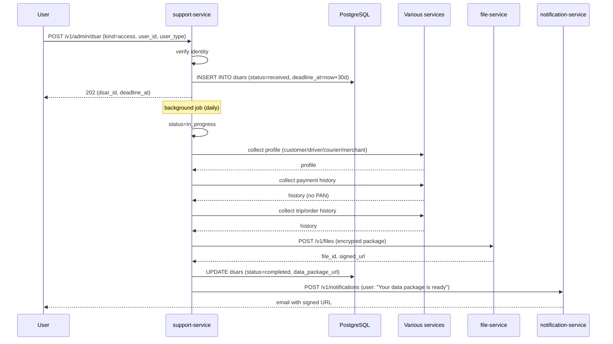

### 5.6 Alternate Paths

- **Erasure request** (`kind=erasure`): instead of
  collecting data, the service calls each owning service
  to erase the user's PII. Financial records are retained
  per law but with identifying fields removed.
- **Partial failure**: the parts that succeeded are
  included in the package; the parts that failed are
  retried; if persistent, the user is informed within
  30 days.

### 5.7 Failure Paths

- **One service fails to respond**: retried with backoff;
  on persistent failure, the DSAR is marked `completed`
  with a note in `notes` about the gap; the user is
  informed.
- **File upload fails**: the DSAR is retried; if persistent,
  the DSAR is marked `failed` and an alert fires.
- **30-day deadline missed**: the DSAR is escalated; an
  alert fires.

### 5.8 Business Rules

- BR--016.
- FR--018.

### 5.9 State Transitions

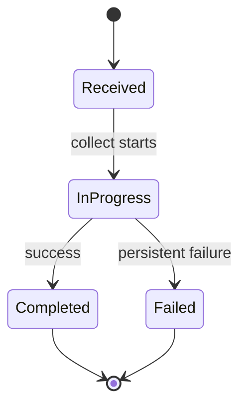

### 5.10 Events

| Event | Direction | When |
|-------|-----------|------|
| `support.action.performed.v1` | produced | on DSAR initiation and completion |

### 5.11 APIs Involved

| API | Direction | When |
|-----|-----------|------|
| `POST /v1/admin/dsar` | inbound | start of flow |
| Various service GETs | outbound | collect data |
| `POST /v1/files` | outbound | store package |
| `POST /v1/notifications` | outbound | notify user |

### 5.12 Compensation / Rollback

- An access request is not rolled back. The user can
  request a re-package.
- An erasure is not rolled back. The user must re-create
  their account.

### 5.13 Final State

- `dsars` row with `status=completed` (or `failed`),
  `data_package_url` (for access).
- `actions` rows for the DSAR actions.
- (For erasure) the user's PII is erased in the respective
  services.

## 6. Escalate on SLA Breach

### 6.1 Objective

When a ticket breaches its SLA timer, automatically
escalate to the next role (P1 → safety on-call; P2 → L2;
P3 → L3).

### 6.2 Initiating Actor

A background SLA worker detects the breach.

### 6.3 Participating Services

- `support-service` (this service).
- `notification-service` (pages the next role).

### 6.4 Prerequisites

- The ticket is open / in progress / awaiting.
- The `sla_first_response_due_at` is in the past.

### 6.5 Happy Path

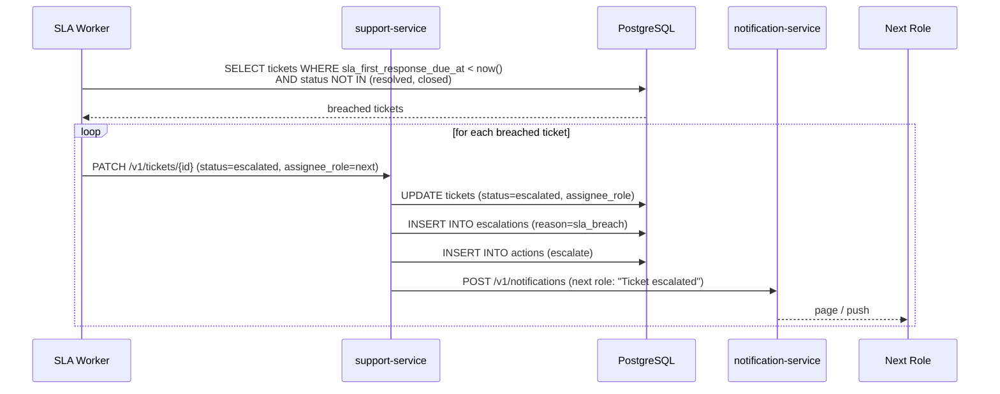

### 6.6 Alternate Paths

- **P1 with no response in 60s**: page safety on-call (P1
  is already severe; the page is the escalation).
- **Repeated breach**: each breach creates a new
  escalation row; the ticket is annotated.

### 6.7 Failure Paths

- **DB write fails**: the worker retries; on persistent
  failure, an alert fires; the on-call is paged manually.

### 6.8 Business Rules

- BR--012, BR--021.
- FR--014, FR--022.

### 6.9 State Transitions

The ticket transitions to `escalated`, then to `in_progress`
when the next role picks it up.

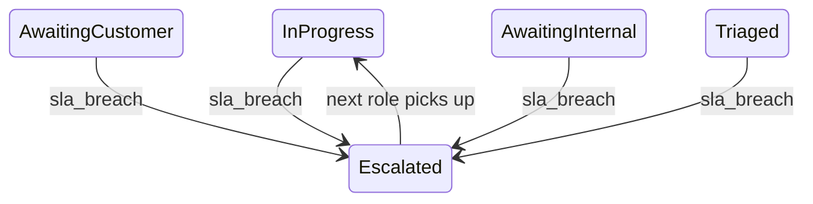

### 6.10 Events

| Event | Direction | When |
|-------|-----------|------|
| `support.action.performed.v1` | produced | on escalation |

### 6.11 APIs Involved

| API | Direction | When |
|-----|-----------|------|
| `PATCH /v1/tickets/{id}` | internal (called by worker) | escalate |
| `POST /v1/notifications` | outbound | page next role |

### 6.12 Compensation / Rollback

- An escalation is not rolled back. The next role picks it
  up; if they determine the breach was a false alarm, they
  de-escalate by reassigning.

### 6.13 Final State

- `tickets` row updated to `status=escalated`,
  `assignee_role=<next>`.
- `escalations` row.
- `actions` row.
- Outbox row for `support.action.performed.v1`.

---

## See also

### Sibling docs for this service

- [`README.md`](./README.md) — purpose, bounded context, responsibilities
- [`BRD.md`](./BRD.md) — business requirements
- [`SRS.md`](./SRS.md) — functional + non-functional requirements
- [`ERD.md`](./ERD.md) — data model (entities, relationships)
- [`INTEGRATION.md`](./INTEGRATION.md) — inter-service contracts (APIs, events, sagas)
- [`WORKFLOWS.md`](./WORKFLOWS.md) — operational workflows (happy paths, failure modes)
- [`TECH.md`](./TECH.md) — technology profile (runtime, libraries, data layer, admin endpoints, RBAC)

### Platform-wide

- [`../../shared/README.md`](../../shared/README.md) — `platform-spring-boot-starter` shared library (the single source of cross-cutting code for all Spring Boot services in the platform)
- [`../RECOMMENDATIONS.md`](../RECOMMENDATIONS.md) — platform-wide technology map (language, framework, version baseline, admin/RBAC pattern)
- [`../../README.md`](../../README.md) — services overview (the catalog of all 58 services)
- [`../../../main.md`](../../../main.md) — top-level platform specification (architecture, Keycloak, PostgreSQL 18, messaging, observability baseline)

