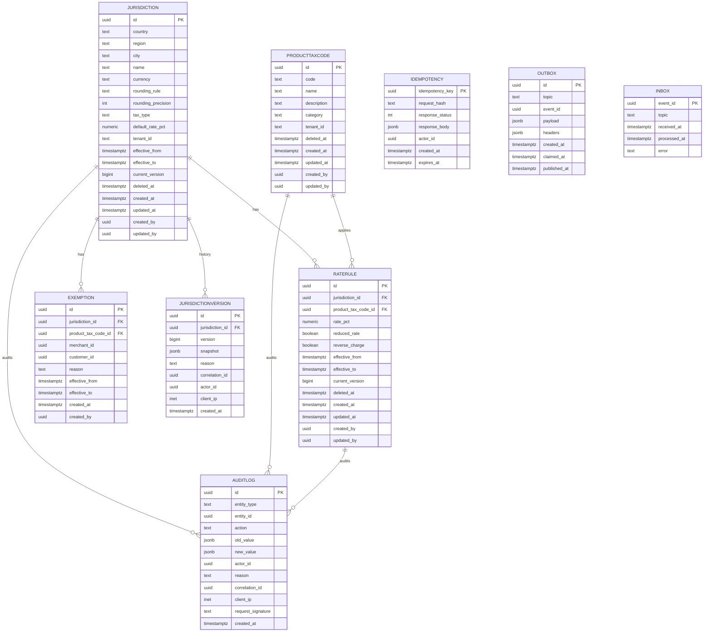

# Tax Service — Entity-Relationship Diagram

## 1. Database

- Engine: PostgreSQL 18
- Schema: `tax` (owned exclusively by this service)
- Migrations: `services/tax-service/migrations/`

## 2. Cross-Service References

| Column | Type | Refers to | Source of truth |
|--------|------|-----------|------------------|
| `exemption.merchant_id` (optional) | UUID | `Merchant.id` | `merchant-service` |
| `product_tax_code.tenant_id` | TEXT | tenant | this service |

No DB FKs.

## 3. Entities

### `Jurisdiction`

A tax jurisdiction. Identified by `(country, region, city)`.

#### Columns

| Column | Type | Constraints | Notes |
|--------|------|-------------|-------|
| `id` | UUID | PK | UUIDv7 |
| `country` | TEXT | NOT NULL | ISO 3166-1 alpha-2 |
| `region` | TEXT | NULL | ISO 3166-2 or local |
| `city` | TEXT | NULL | slug |
| `name` | TEXT | NOT NULL | |
| `currency` | TEXT | NOT NULL | ISO-4217 |
| `rounding_rule` | TEXT | NOT NULL | `round_half_up` / `round_half_even` / `truncate` |
| `rounding_precision` | INT | NOT NULL DEFAULT 2 | decimal places |
| `tax_type` | TEXT | NOT NULL | `VAT` / `sales_tax` / `GST` / `service_tax` |
| `default_rate_pct` | NUMERIC(5,2) | NOT NULL | fallback if no product rule |
| `tenant_id` | TEXT | NOT NULL DEFAULT 'global' | |
| `effective_from` | TIMESTAMPTZ | NULL | |
| `effective_to` | TIMESTAMPTZ | NULL | |
| `current_version` | BIGINT | NOT NULL DEFAULT 0 | |
| `deleted_at` | TIMESTAMPTZ | NULL | soft delete |
| `created_at` | TIMESTAMPTZ | NOT NULL DEFAULT now() | |
| `updated_at` | TIMESTAMPTZ | NOT NULL DEFAULT now() | |
| `created_by` | UUID | NOT NULL | |
| `updated_by` | UUID | NOT NULL | |

#### Indexes

- PK on `id`
- UNIQUE on `(country, region, city, tenant_id) WHERE deleted_at IS NULL`
- Index on `(country, region)`

#### Constraints

- CHECK: `length(country) = 2`
- CHECK: `tax_type IN ('VAT','sales_tax','GST','service_tax')`
- CHECK: `default_rate_pct >= 0`
- CHECK: `rounding_rule IN ('round_half_up','round_half_even','truncate')`

### `JurisdictionVersion`

Immutable history.

#### Columns

| Column | Type | Constraints | Notes |
|--------|------|-------------|-------|
| `id` | UUID | PK | UUIDv7 |
| `jurisdiction_id` | UUID | NOT NULL | |
| `version` | BIGINT | NOT NULL | monotonic per jurisdiction |
| `snapshot` | JSONB | NOT NULL | the full rule at this version |
| `reason` | TEXT | NOT NULL | |
| `correlation_id` | UUID | NOT NULL | |
| `actor_id` | UUID | NOT NULL | |
| `client_ip` | INET | NULL | |
| `created_at` | TIMESTAMPTZ | NOT NULL DEFAULT now() | partition key |

#### Indexes

- PK on `id`
- UNIQUE on `(jurisdiction_id, version)`

### `ProductTaxCode`

Maps a product category to a tax code.

#### Columns

| Column | Type | Constraints | Notes |
|--------|------|-------------|-------|
| `id` | UUID | PK | UUIDv7 |
| `code` | TEXT | NOT NULL UNIQUE | `[A-Z0-9_]{1,32}` |
| `name` | TEXT | NOT NULL | |
| `description` | TEXT | NULL | |
| `category` | TEXT | NOT NULL | `food` / `alcohol` / `ride_fare` / `delivery_fee` / `tip` / `service_fee` |
| `tenant_id` | TEXT | NOT NULL DEFAULT 'global' | |
| `deleted_at` | TIMESTAMPTZ | NULL | |
| `created_at` | TIMESTAMPTZ | NOT NULL DEFAULT now() | |
| `updated_at` | TIMESTAMPTZ | NOT NULL DEFAULT now() | |
| `created_by` | UUID | NOT NULL | |
| `updated_by` | UUID | NOT NULL | |

#### Constraints

- CHECK: `category IN ('food','alcohol','ride_fare','delivery_fee','tip','service_fee')`

### `RateRule`

A specific rate for a `(jurisdiction, product_code)` pair, with an
optional exemption.

#### Columns

| Column | Type | Constraints | Notes |
|--------|------|-------------|-------|
| `id` | UUID | PK | UUIDv7 |
| `jurisdiction_id` | UUID | NOT NULL | |
| `product_tax_code_id` | UUID | NOT NULL | |
| `rate_pct` | NUMERIC(5,2) | NOT NULL | `0.00` for exempt |
| `reduced_rate` | BOOLEAN | NOT NULL DEFAULT false | |
| `reverse_charge` | BOOLEAN | NOT NULL DEFAULT false | B2B |
| `effective_from` | TIMESTAMPTZ | NULL | |
| `effective_to` | TIMESTAMPTZ | NULL | |
| `current_version` | BIGINT | NOT NULL DEFAULT 0 | |
| `deleted_at` | TIMESTAMPTZ | NULL | |
| `created_at` | TIMESTAMPTZ | NOT NULL DEFAULT now() | |
| `updated_at` | TIMESTAMPTZ | NOT NULL DEFAULT now() | |
| `created_by` | UUID | NOT NULL | |
| `updated_by` | UUID | NOT NULL | |

#### Indexes

- PK on `id`
- UNIQUE on `(jurisdiction_id, product_tax_code_id) WHERE deleted_at IS NULL`
- Index on `(jurisdiction_id, product_tax_code_id, effective_from)`

#### Constraints

- CHECK: `rate_pct >= 0`

### `Exemption`

A per-merchant or per-customer override.

#### Columns

| Column | Type | Constraints | Notes |
|--------|------|-------------|-------|
| `id` | UUID | PK | UUIDv7 |
| `jurisdiction_id` | UUID | NOT NULL | |
| `product_tax_code_id` | UUID | NULL | null = all products |
| `merchant_id` | UUID | NULL | |
| `customer_id` | UUID | NULL | |
| `reason` | TEXT | NOT NULL | |
| `effective_from` | TIMESTAMPTZ | NOT NULL | |
| `effective_to` | TIMESTAMPTZ | NULL | |
| `created_at` | TIMESTAMPTZ | NOT NULL DEFAULT now() | |
| `created_by` | UUID | NOT NULL | |

#### Indexes

- PK on `id`
- Index on `(jurisdiction_id, merchant_id)`
- Index on `(jurisdiction_id, customer_id)`

### `AuditLog`

Immutable audit log.

#### Columns

| Column | Type | Constraints | Notes |
|--------|------|-------------|-------|
| `id` | UUID | PK | UUIDv7 |
| `entity_type` | TEXT | NOT NULL | `jurisdiction` / `product_tax_code` / `rate_rule` / `exemption` |
| `entity_id` | UUID | NOT NULL | |
| `action` | TEXT | NOT NULL | create/update/delete |
| `old_value` | JSONB | NULL | |
| `new_value` | JSONB | NULL | |
| `actor_id` | UUID | NOT NULL | |
| `reason` | TEXT | NOT NULL | |
| `correlation_id` | UUID | NOT NULL | |
| `client_ip` | INET | NULL | |
| `request_signature` | TEXT | NULL | |
| `created_at` | TIMESTAMPTZ | NOT NULL DEFAULT now() | partition key |

#### Constraints

- **No UPDATE / DELETE on this table**.

### `Idempotency`

Same shape.

### `Outbox`

Same shape.

### `Inbox`

Same shape.

## 4. Mermaid ER Diagram



## 5. DDL Sketch

```sql
CREATE SCHEMA IF NOT EXISTS tax;

CREATE TABLE tax.jurisdictions (
    id UUID PRIMARY KEY,
    country TEXT NOT NULL CHECK (length(country) = 2),
    region TEXT,
    city TEXT,
    name TEXT NOT NULL,
    currency TEXT NOT NULL,
    rounding_rule TEXT NOT NULL
        CHECK (rounding_rule IN ('round_half_up','round_half_even','truncate')),
    rounding_precision INT NOT NULL DEFAULT 2,
    tax_type TEXT NOT NULL
        CHECK (tax_type IN ('VAT','sales_tax','GST','service_tax')),
    default_rate_pct NUMERIC(5,2) NOT NULL CHECK (default_rate_pct >= 0),
    tenant_id TEXT NOT NULL DEFAULT 'global',
    effective_from TIMESTAMPTZ,
    effective_to TIMESTAMPTZ,
    current_version BIGINT NOT NULL DEFAULT 0,
    deleted_at TIMESTAMPTZ,
    created_at TIMESTAMPTZ NOT NULL DEFAULT now(),
    updated_at TIMESTAMPTZ NOT NULL DEFAULT now(),
    created_by UUID NOT NULL,
    updated_by UUID NOT NULL
);

CREATE UNIQUE INDEX idx_jurisdictions_unique
    ON tax.jurisdictions (country, region, city, tenant_id)
    WHERE deleted_at IS NULL;

CREATE TABLE tax.jurisdiction_versions (
    id UUID NOT NULL,
    jurisdiction_id UUID NOT NULL,
    version BIGINT NOT NULL,
    snapshot JSONB NOT NULL,
    reason TEXT NOT NULL,
    correlation_id UUID NOT NULL,
    actor_id UUID NOT NULL,
    client_ip INET,
    created_at TIMESTAMPTZ NOT NULL DEFAULT now(),
    PRIMARY KEY (id, created_at)
) PARTITION BY RANGE (created_at);

CREATE TABLE IF NOT EXISTS tax.jurisdiction_versions_2026_07
    PARTITION OF tax.jurisdiction_versions
    FOR VALUES FROM ('2026-07-01 00:00:00+00') TO ('2026-08-01 00:00:00+00');

-- Verify the child is actually attached to the correct parent with
-- the expected bounds. IF NOT EXISTS only guards the name; it does
-- not verify bounds.
DO $$
DECLARE
    v_parent   REGCLASS := 'tax.jurisdiction_versions'::REGCLASS;
    v_child    REGCLASS := 'tax.jurisdiction_versions_2026_07'::REGCLASS;
    v_expected TSTZRANGE := tstzrange('2026-07-01 00:00:00+00',
                                      '2026-08-01 00:00:00+00',
                                      '[)');
BEGIN
    IF (SELECT inhparent FROM pg_inherits WHERE inhrelid = v_child)
       IS DISTINCT FROM v_parent THEN
        RAISE EXCEPTION 'partition % is not attached to %',
            v_child::text, v_parent::text;
    END IF;
    IF NOT (SELECT relpartbound FROM pg_class WHERE oid = v_child)
              = v_expected THEN
        RAISE EXCEPTION 'partition % has unexpected bounds', v_child::text;
    END IF;
END $$;

CREATE TABLE tax.product_tax_codes (
    id UUID PRIMARY KEY,
    code TEXT NOT NULL UNIQUE
        CHECK (code ~ '^[A-Z0-9_]{1,32}$'),
    name TEXT NOT NULL,
    description TEXT,
    category TEXT NOT NULL
        CHECK (category IN ('food','alcohol','ride_fare','delivery_fee','tip','service_fee')),
    tenant_id TEXT NOT NULL DEFAULT 'global',
    deleted_at TIMESTAMPTZ,
    created_at TIMESTAMPTZ NOT NULL DEFAULT now(),
    updated_at TIMESTAMPTZ NOT NULL DEFAULT now(),
    created_by UUID NOT NULL,
    updated_by UUID NOT NULL
);

CREATE TABLE tax.rate_rules (
    id UUID PRIMARY KEY,
    jurisdiction_id UUID NOT NULL,
    product_tax_code_id UUID NOT NULL,
    rate_pct NUMERIC(5,2) NOT NULL CHECK (rate_pct >= 0),
    reduced_rate BOOLEAN NOT NULL DEFAULT false,
    reverse_charge BOOLEAN NOT NULL DEFAULT false,
    effective_from TIMESTAMPTZ,
    effective_to TIMESTAMPTZ,
    current_version BIGINT NOT NULL DEFAULT 0,
    deleted_at TIMESTAMPTZ,
    created_at TIMESTAMPTZ NOT NULL DEFAULT now(),
    updated_at TIMESTAMPTZ NOT NULL DEFAULT now(),
    created_by UUID NOT NULL,
    updated_by UUID NOT NULL
);

CREATE UNIQUE INDEX idx_rate_rules_unique
    ON tax.rate_rules (jurisdiction_id, product_tax_code_id)
    WHERE deleted_at IS NULL;

CREATE TABLE tax.exemptions (
    id UUID PRIMARY KEY,
    jurisdiction_id UUID NOT NULL,
    product_tax_code_id UUID,
    merchant_id UUID,
    customer_id UUID,
    reason TEXT NOT NULL,
    effective_from TIMESTAMPTZ NOT NULL,
    effective_to TIMESTAMPTZ,
    created_at TIMESTAMPTZ NOT NULL DEFAULT now(),
    created_by UUID NOT NULL
);

CREATE INDEX idx_exemptions_merchant
    ON tax.exemptions (jurisdiction_id, merchant_id);
CREATE INDEX idx_exemptions_customer
    ON tax.exemptions (jurisdiction_id, customer_id);

CREATE TABLE tax.audit_log (
    id UUID NOT NULL,
    entity_type TEXT NOT NULL,
    entity_id UUID NOT NULL,
    action TEXT NOT NULL
        CHECK (action IN ('create','update','delete')),
    old_value JSONB,
    new_value JSONB,
    actor_id UUID NOT NULL,
    reason TEXT NOT NULL,
    correlation_id UUID NOT NULL,
    client_ip INET,
    request_signature TEXT,
    created_at TIMESTAMPTZ NOT NULL DEFAULT now(),
    PRIMARY KEY (id, created_at)
) PARTITION BY RANGE (created_at);
REVOKE UPDATE, DELETE ON tax.audit_log FROM tax_app;

CREATE TABLE IF NOT EXISTS tax.audit_log_2026_07
    PARTITION OF tax.audit_log
    FOR VALUES FROM ('2026-07-01 00:00:00+00') TO ('2026-08-01 00:00:00+00');

CREATE TABLE tax.idempotency (
    idempotency_key UUID PRIMARY KEY,
    request_hash TEXT NOT NULL,
    response_status INT NOT NULL,
    response_body JSONB NOT NULL,
    actor_id UUID NOT NULL,
    created_at TIMESTAMPTZ NOT NULL DEFAULT now(),
    expires_at TIMESTAMPTZ NOT NULL
);

CREATE TABLE tax.outbox (
    id UUID PRIMARY KEY,
    topic TEXT NOT NULL,
    event_id UUID NOT NULL,
    payload JSONB NOT NULL,
    headers JSONB,
    created_at TIMESTAMPTZ NOT NULL DEFAULT now(),
    claimed_at TIMESTAMPTZ,
    published_at TIMESTAMPTZ
);

CREATE TABLE tax.inbox (
    event_id UUID PRIMARY KEY,
    topic TEXT NOT NULL,
    received_at TIMESTAMPTZ NOT NULL DEFAULT now(),
    processed_at TIMESTAMPTZ,
    error TEXT
);
```

## 6. Audit Columns

Every mutable table has `created_at`, `updated_at`, `created_by`,
`updated_by`. `audit_log`, `jurisdiction_versions` are append-only.

## 7. Soft Delete

`jurisdictions.deleted_at`, `product_tax_codes.deleted_at`,
`rate_rules.deleted_at` are the soft-delete flags. Deleted records
return 404 on read.

## 8. JSONB Usage

| Table.Column | What is stored | Justification |
|--------------|----------------|---------------|
| `jurisdiction_versions.snapshot` | the full rule at this version | history |
| `audit_log.old_value` / `new_value` | pre/post image | diff display |
| `outbox.payload` | event payload | per topic |

## 9. Partitioning

- `jurisdiction_versions` partitioned by month.
- `audit_log` partitioned by month.

See [`DATABASE_ARCHITECTURE.md` §"Table Partitioning — Canonical Template"](../../architecture/DATABASE_ARCHITECTURE.md) for the idempotent `CREATE TABLE IF NOT EXISTS … PARTITION OF …` pattern, naming convention, and the service-owned maintenance-job contract (advisory lock, verification, retention/mixed-retention handling).

## 10. Data Retention

| Table | Retention | Purged by |
|-------|-----------|-----------|
| `jurisdictions` | indefinitely (soft delete) | n/a |
| `jurisdiction_versions` | 7 years | monthly archival job |
| `product_tax_codes` | indefinitely (soft delete) | n/a |
| `rate_rules` | indefinitely (soft delete) | n/a |
| `exemptions` | 7 years | monthly archival job |
| `audit_log` | 7 years | monthly archival job |
| `idempotency` | 24 hours | daily purge job |
| `outbox` | 24 hours after `published_at` | hourly purge job |
| `inbox` | 7 days | daily purge job |

## 11. Migration Considerations

- Adding a new `tax_type` or `category` is a `CHECK` constraint
  update; no data migration.
- A jurisdiction rename is a new version, not an in-place edit.
- The `audit_log` append-only constraint is enforced at the database
  grant level.

---

## See also

### Sibling docs for this service

- [`README.md`](./README.md) — purpose, bounded context, responsibilities
- [`BRD.md`](./BRD.md) — business requirements
- [`SRS.md`](./SRS.md) — functional + non-functional requirements
- [`ERD.md`](./ERD.md) — data model (entities, relationships)
- [`INTEGRATION.md`](./INTEGRATION.md) — inter-service contracts (APIs, events, sagas)
- [`WORKFLOWS.md`](./WORKFLOWS.md) — operational workflows (happy paths, failure modes)
- [`TECH.md`](./TECH.md) — technology profile (runtime, libraries, data layer, admin endpoints, RBAC)

### Platform-wide

- [`../../shared/README.md`](../../shared/README.md) — `platform-spring-boot-starter` shared library (the single source of cross-cutting code for all Spring Boot services in the platform)
- [`../RECOMMENDATIONS.md`](../RECOMMENDATIONS.md) — platform-wide technology map (language, framework, version baseline, admin/RBAC pattern)
- [`../../README.md`](../../README.md) — services overview (the catalog of all 58 services)
- [`../../../main.md`](../../../main.md) — top-level platform specification (architecture, Keycloak, PostgreSQL 18, messaging, observability baseline)

