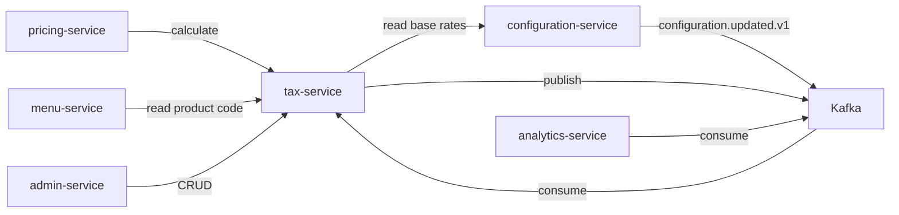
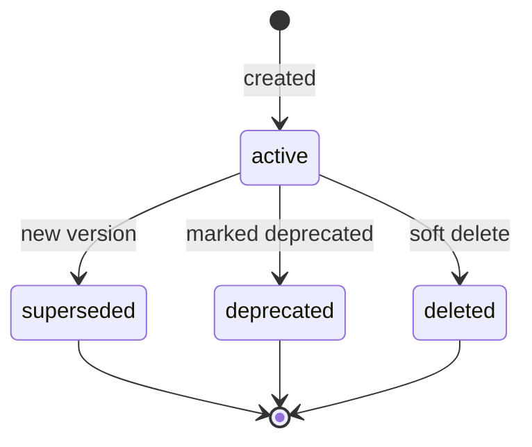

# Tax Service — Software Requirements Specification

## 1. Introduction

This SRS specifies the behavior, performance, and operational
requirements of `tax-service`. It inherits the platform-wide
standards in `docs/architecture/API_STANDARDS.md`,
`docs/architecture/EVENT_ARCHITECTURE.md`, and
`docs/architecture/SECURITY_ARCHITECTURE.md`.

## 2. Scope

In scope:

- Jurisdiction rules.
- Product tax codes.
- Exemptions.
- Tax calculation API.
- Event publication.

Out of scope:

- Pricing (owned by `pricing-service`).
- Order / cart (owned by `cart-service`, `checkout-service`).
- Customer profile (owned by `customer-service`).

## 3. System Context

## 4. Actors

- Operator (admin) — human.
- `pricing-service` — system.
- `menu-service` — system.
- `analytics-service` — system (consumer).

## 5. Functional Requirements

| ID | Requirement | Priority |
|----|-------------|----------|
| FR--001 | The service MUST expose `POST /v1/tax/calculate` returning rate, taxable, tax, snapshot. | MUST |
| FR--002 | The service MUST support jurisdiction rules keyed by `(country, region, city)`. | MUST |
| FR--003 | The service MUST support per-product tax codes. | MUST |
| FR--004 | The service MUST support exemptions per `(jurisdiction, product_code)`. | MUST |
| FR--005 | The service MUST support reduced rates (per product). | MUST |
| FR--006 | The service MUST support reverse-charge (B2B). | SHOULD |
| FR--007 | The service MUST support inclusive / exclusive tax. | MUST |
| FR--008 | The service MUST support rounding rules per jurisdiction. | MUST |
| FR--009 | The service MUST support "destination" vs. "origin" tax. | MUST |
| FR--010 | The service MUST return the matched rule id in the response. | MUST |
| FR--011 | The service MUST emit `tax.calculated.v1` for every successful calculation. | MUST |
| FR--012 | The service MUST emit `tax.rule.updated.v1` on rule changes. | MUST |
| FR--013 | The service MUST reload its in-memory cache on `configuration.updated.v1`. | MUST |
| FR--014 | The service MUST support multi-currency. | MUST |
| FR--015 | The service MUST persist every change in `tax.audit_log` with `actor_id` and `reason`. | MUST |
| FR--016 | The service MUST return a `snapshot` listing the rules used. | MUST |
| FR--017 | The service MUST support time-windowed rules (`effective_from` / `effective_to`). | MUST |
| FR--018 | The service MUST return the default rate if no rule matches. | MUST |
| FR--019 | The service MUST support per-tenant rules. | MUST |
| FR--020 | The service MUST support per-merchant overrides (e.g. tax-exempt merchants). | SHOULD |

## 6. Non-Functional Requirements

| ID | Category | Requirement | Target |
|----|----------|-------------|--------|
| NFR--001 | performance | P99 calculate latency (cached) | < 50ms |
| NFR--002 | performance | P99 calculate latency (uncached) | < 200ms |
| NFR--003 | availability | uptime | 99.9% over 30d |
| NFR--004 | scalability | concurrent calculates per pod | 5,000 |
| NFR--005 | determinism | same input + same rules → same output | 100% |
| NFR--006 | durability | zero data loss on regional outage | RPO 5m, RTO 30m |
| NFR--007 | observability | 100% requests have trace and log | enforced in CI |
| NFR--008 | auditability | 100% writes attributed | enforced in DB |
| NFR--009 | freshness | median propagation latency | < 2s |

## 7. API Requirements

- Versioned URIs.
- Bearer JWT.
- `Idempotency-Key` for non-idempotent writes.
- Errors in the standard envelope.
- Money: integer minor units.
- OpenAPI 3.1 at `/openapi.json`.

## 8. Data Requirements

| ID | Requirement | Notes |
|----|-------------|-------|
| DATA--001 | Primary keys UUIDv7. | |
| DATA--002 | Soft delete via `deleted_at`. | |
| DATA--003 | Cross-service references are UUID columns without DB FKs. | Rule |
| DATA--004 | Time is RFC3339 UTC. | |
| DATA--005 | Rule history is partitioned by month. | Retention. |

## 9. Validation Rules

- A jurisdiction `(country, region, city)` MUST have `region` and
  `city` nullable (city is the most specific).
- A product code MUST be `[A-Z0-9_]{1,32}`.
- A rate MUST be `>= 0`.
- An exemption MUST have an `effective_from` and `effective_to`
  (or both null = always effective).

## 10. State Transitions

## 11. Authorization Requirements

- `tax.read` for reads.
- `tax.admin` for writes.

## 12. Configuration Requirements

- `DEFAULT_TAX_PCT` (env; default 0).
- `CACHE_TTL_SECONDS` (env; default 300).

## 13. Error Handling

| Error | Response |
|-------|----------|
| No rule and no default | 422 `NO_TAX_RULE` |
| Currency mismatch | 422 `CURRENCY_MISMATCH` |
| Idempotency-Key reuse | 422 `IDEMPOTENCY_KEY_REUSED` |
| Configuration unreachable, cache cold | 503 `CIRCUIT_OPEN` |

## 14. Concurrency Requirements

- A calculation is read-only; no row-level locks.
- A write to a rule is serialized at the row level
  (`SELECT ... FOR UPDATE` on the latest version).

## 15. Idempotency Requirements

- All write endpoints require `Idempotency-Key`.
- The service stores the key in `tax.idempotency` for 24 hours.

## 16. Performance

- Dominant path: `POST /v1/tax/calculate`.
- P50/P95/P99: 5ms / 20ms / 50ms (cached); 30ms / 100ms / 200ms
  (uncached).

## 17. Scalability

- Horizontal scaling: HPA on CPU and calculate RPS.
- Vertical scaling: 2 vCPU / 4 GiB production.

## 18. Availability

- SLO: 99.9% over 30 days.
- Error budget: ~44 minutes per 30 days.
- Maintenance window: Sundays 04:00–06:00 UTC.

## 19. Security

| ID | Requirement | Notes |
|----|-------------|-------|
| SEC--001 | All requests JWT-validated. | Standard |
| SEC--002 | Rule updates require `X-Audit-Reason` and `X-Signature`. | |
| SEC--003 | No PII. | |
| SEC--004 | Money is integer minor units. | |
| SEC--005 | DB user has rights only on the `tax` schema. | Least privilege. |

## 20. Privacy

- PII stored: none.
- Retention: 7 years for rules and history.
- Erasure: n/a (no PII).

## 21. Auditability

- Every write emits an event AND a row in `tax.audit_log`.
- `audit-service` consumes the events.

## 22. Observability

- Logs: JSON to stdout; standard fields + `jurisdiction_id`,
  `product_code`, `tax_minor`.
- Metrics:
  - `http_requests_total{route, method, status}` (RED)
  - `http_request_duration_seconds{route, method, status}` (RED)
  - `tax_calculate_total{jurisdiction, product_code}`
  - `tax_calculate_seconds`
  - `tax_cache_hit_ratio`
  - `tax_propagation_seconds`
- Traces: OpenTelemetry.
- Alerts:
  - SLO burn rate.
  - Cache hit rate < 90% for 5 min.

## 23. Maintainability

- Code style: Go.
- Test coverage: ≥ 90% on the tax engine.
- Documentation: this folder; OpenAPI 3.1 at `/openapi.json`.

## 24. Disaster Recovery

- RPO: 5 minutes.
- RTO: 30 minutes.

## 25. Acceptance Criteria

- 99.9% calculate availability for 30 days in production.
- 100% of writes attributed to a user with a reason.
- A rule change is live in < 5 seconds.
- A calculation returns the rules used in `snapshot`.
- A jurisdiction's rounding rule is honored.
- An exempted product is taxed at 0%.

---

## See also

### Sibling docs for this service

- [`README.md`](./README.md) — purpose, bounded context, responsibilities
- [`BRD.md`](./BRD.md) — business requirements
- [`SRS.md`](./SRS.md) — functional + non-functional requirements
- [`ERD.md`](./ERD.md) — data model (entities, relationships)
- [`INTEGRATION.md`](./INTEGRATION.md) — inter-service contracts (APIs, events, sagas)
- [`WORKFLOWS.md`](./WORKFLOWS.md) — operational workflows (happy paths, failure modes)
- [`TECH.md`](./TECH.md) — technology profile (runtime, libraries, data layer, admin endpoints, RBAC)

### Platform-wide

- [`../../shared/README.md`](../../shared/README.md) — `platform-spring-boot-starter` shared library (the single source of cross-cutting code for all Spring Boot services in the platform)
- [`../RECOMMENDATIONS.md`](../RECOMMENDATIONS.md) — platform-wide technology map (language, framework, version baseline, admin/RBAC pattern)
- [`../../README.md`](../../README.md) — services overview (the catalog of all 58 services)
- [`../../../main.md`](../../../main.md) — top-level platform specification (architecture, Keycloak, PostgreSQL 18, messaging, observability baseline)

