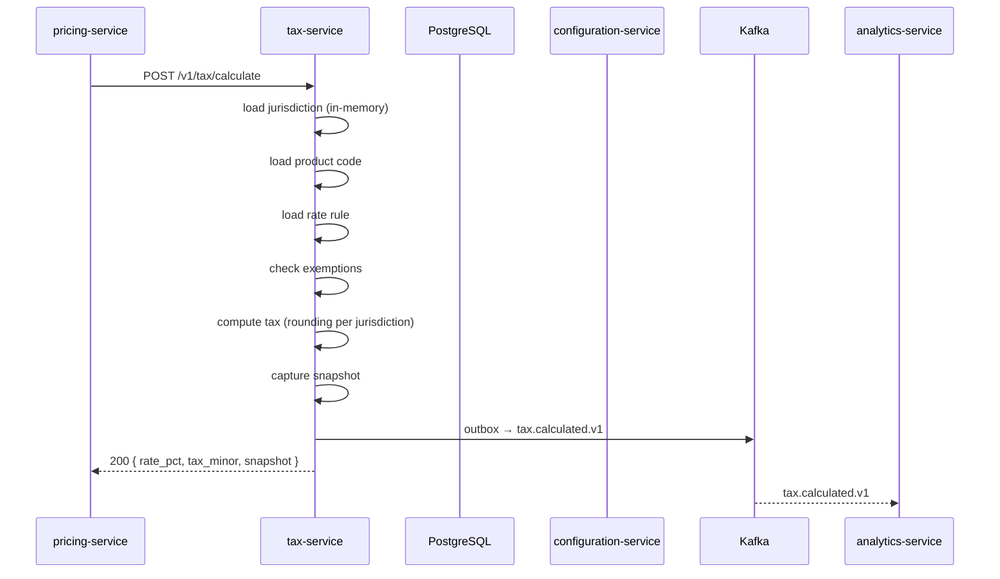
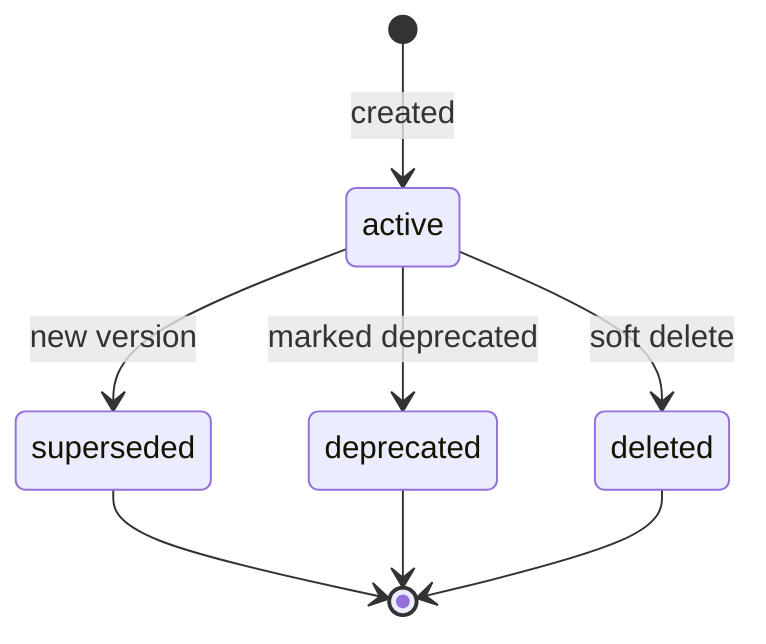
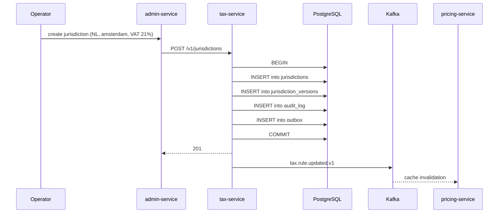
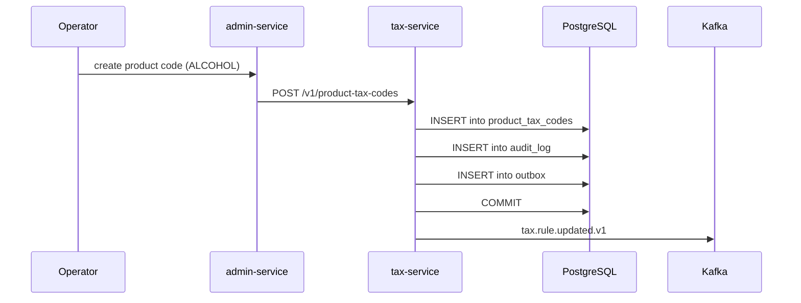
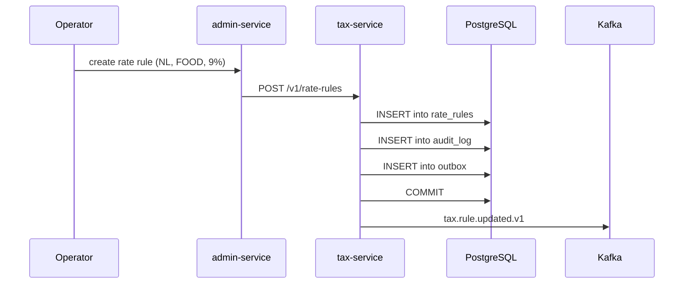

# Tax Service — Workflows

## 1. Pricing Service Calculates Tax

### 1.1 Objective

Compute the tax for a `(country, region, city, product, amount)`
query in < 50ms P99 (cached), with a captured `snapshot`.

### 1.2 Initiating Actor

`pricing-service` (system) on every quote.

### 1.3 Participating Services

- `pricing-service` (caller)
- `tax-service` (this service)
- `configuration-service` (base rates)
- `analytics-service` (consumer of `tax.calculated.v1`)

### 1.4 Prerequisites

- The caller holds `tax.read`.
- The cache is warm; if not, a cold read takes up to 50ms.

### 1.5 Happy Path



State machine for `Jurisdiction` (rule):



### 1.6 Alternate Paths

- **No rule, no default**: 422 `NO_TAX_RULE`.
- **Reverse-charge**: `reverse_charge=true`; the response carries
  `tax_minor = 0` and a flag.
- **Exemption**: the response carries `exemption_id` and
  `tax_minor = 0`.
- **Inclusive price**: the service extracts the tax from the price.

### 1.7 Failure Paths

| Failure | Handling |
|---------|----------|
| No rule and no default | 422 `NO_TAX_RULE` |
| Currency mismatch | 422 `CURRENCY_MISMATCH` |
| Configuration unreachable, cache cold | 503 `CIRCUIT_OPEN` |
| Outbox poller fails | retry with backoff; DLQ after 3 attempts |

### 1.8 Business Rules

- A jurisdiction is identified by `(country, region, city)`; the
  most specific match wins.
- A product tax code is identified by `code`; the code is mapped to
  a category.
- An exemption overrides the base rate for a `(jurisdiction,
  product_code)` pair.
- The tax is computed on the taxable amount (after discounts,
  before tips).
- The tax is rounded to the nearest minor unit per the
  jurisdiction's rounding rule.

### 1.9 State Transitions

n/a (read-only).

### 1.10 Events

| Event | Direction | When |
|-------|-----------|------|
| `tax.calculated.v1` | produced | every successful calculation |

### 1.11 APIs Involved

| API | Direction | When |
|-----|-----------|------|
| `POST /v1/tax/calculate` | inbound | every quote |

### 1.12 Compensation / Rollback

n/a (read-only).

### 1.13 Final State

The caller has the tax breakdown and the snapshot; the event is
published for analytics.

## 2. Operator Creates a Jurisdiction

### 2.1 Objective

Create a new jurisdiction with full attribution and audit.

### 2.2 Initiating Actor

Operator (admin) via the admin console.

### 2.3 Participating Services

- `admin-service`
- `tax-service`
- `pricing-service` (consumer)
- `audit-service` (consumer)
- Kafka

### 2.4 Prerequisites

- The operator holds `tax.admin`.
- `X-Audit-Reason` and `X-Signature` are set.

### 2.5 Happy Path



### 2.6 Alternate Paths

- **Update existing**: a new version; the prior version is retained.

### 2.7 Failure Paths

| Failure | Handling |
|---------|----------|
| Duplicate `(country, region, city, tenant_id)` | 409 `JURISDICTION_EXISTS` |
| Validation | 422 `VALIDATION_FAILED` |
| `X-Signature` missing | 403 `SIGNATURE_INVALID` |

### 2.8 Business Rules

- A jurisdiction is unique per `(country, region, city, tenant_id)`.
- A change creates a new version; the prior version is retained.

### 2.9 State Transitions

`active` → `superseded` on a new version; `active` → `deleted` on
soft delete.

### 2.10 Events

| Event | Direction | When |
|-------|-----------|------|
| `tax.rule.updated.v1` | produced | every write |

### 2.11 APIs Involved

| API | Direction | When |
|-----|-----------|------|
| `POST /v1/jurisdictions` | inbound | create |

### 2.12 Compensation / Rollback

A new version with the prior values reverts.

### 2.13 Final State

The jurisdiction is in `jurisdictions`; the audit log has a row;
the event is published; consumers reload within 5 seconds.

## 3. Operator Creates a Product Tax Code

### 3.1 Objective

Create a new product tax code (e.g. `ALCOHOL`) for use in rate
rules.

### 3.2 Initiating Actor

Operator (admin).

### 3.3 Participating Services

- `admin-service`
- `tax-service`
- `pricing-service` (consumer)
- Kafka

### 3.4 Prerequisites

- The operator holds `tax.admin`.

### 3.5 Happy Path



### 3.6 Alternate Paths

- **Update existing**: a new version; the prior is retained.

### 3.7 Failure Paths

| Failure | Handling |
|---------|----------|
| Code exists | 409 `PRODUCT_TAX_CODE_EXISTS` |
| Validation | 422 `VALIDATION_FAILED` |

### 3.8 Business Rules

- A code is unique.
- A change creates a new version.

### 3.9 State Transitions

`active` → `superseded` on a new version.

### 3.10 Events

| Event | Direction | When |
|-------|-----------|------|
| `tax.rule.updated.v1` | produced | every write |

### 3.11 APIs Involved

| API | Direction | When |
|-----|-----------|------|
| `POST /v1/product-tax-codes` | inbound | create |

### 3.12 Compensation / Rollback

A new version with the prior values reverts.

### 3.13 Final State

The product code is in `product_tax_codes`; the audit log has a
row; the event is published.

## 4. Operator Creates a Rate Rule

### 4.1 Objective

Create a rate rule for a `(jurisdiction, product_code)` pair with a
specific rate.

### 4.2 Initiating Actor

Operator (admin).

### 4.3 Participating Services

- `admin-service`
- `tax-service`
- `pricing-service` (consumer)
- Kafka

### 4.4 Prerequisites

- The operator holds `tax.admin`.
- A jurisdiction and a product code exist.

### 4.5 Happy Path



### 4.6 Alternate Paths

- **Update existing**: a new version; the prior is retained.

### 4.7 Failure Paths

| Failure | Handling |
|---------|----------|
| Rule exists | 409 `RATE_RULE_EXISTS` |
| Validation | 422 `VALIDATION_FAILED` |

### 4.8 Business Rules

- A rule is unique per `(jurisdiction_id, product_tax_code_id)`.
- A change creates a new version.

### 4.9 State Transitions

`active` → `superseded` on a new version.

### 4.10 Events

| Event | Direction | When |
|-------|-----------|------|
| `tax.rule.updated.v1` | produced | every write |

### 4.11 APIs Involved

| API | Direction | When |
|-----|-----------|------|
| `POST /v1/rate-rules` | inbound | create |

### 4.12 Compensation / Rollback

A new version with the prior values reverts.

### 4.13 Final State

The rate rule is in `rate_rules`; the audit log has a row; the
event is published; the next calculation uses the new rate.

## 99. `Monthly` Partition Maintenance`

### 99.1 Objective

Idempotently pre-create the next 12 month child partitions for `tax.jurisdiction_versions` + `tax.audit_log` so an INSERT at any time lands in an existing child. The drop half is handled by the per-service retention job.

### 99.2 Initiating Actor

A scheduled job runs daily at `02:00 UTC`. Leader-elected via `pg_try_advisory_xact_lock(hashtext('tax.partition'), hashtext('monthly'))`.

### 99.3 Happy Path

```mermaid
sequenceDiagram
    participant JOB as Partition job
    participant PG as PostgreSQL
    JOB->>PG: pg_try_advisory_xact_lock('tax.monthly')
    alt lock acquired
        loop for each missing month in next 12
            JOB->>PG: CREATE TABLE IF NOT EXISTS tax.table_month PARTITION OF tax.table
            JOB->>PG: verify (pg_inherits, relpartbound)
        end
        JOB->>PG: assert now() in existing child
    else lock NOT acquired
        Note over JOB: another instance is running; exit cleanly
    end
```

### 99.4 Failure Paths

| Failure | Handling |
|---------|----------|
| Lock contention | exit 0 |
| DDL fails | retry 3× with backoff (1 s / 4 s / 16 s); page on-call |
| Today's child missing | critical alert; INSERTs would fail |

### 99.5 Business Rules

- Pre-create 12 complete future months.
- Every child is created with `CREATE TABLE IF NOT EXISTS … PARTITION OF …` so the job is safe to run twice in the same window.
- A verification step (`pg_inherits` parent + `relpartbound` range) runs after every `CREATE TABLE IF NOT EXISTS` because `IF NOT EXISTS` only guards the name, not the bounds.
- Optionally emit `audit.partition.maintained.v1` on success.

---

## See also

### Sibling docs for this service

- [`README.md`](./README.md) — purpose, bounded context, responsibilities
- [`BRD.md`](./BRD.md) — business requirements
- [`SRS.md`](./SRS.md) — functional + non-functional requirements
- [`ERD.md`](./ERD.md) — data model (entities, relationships)
- [`INTEGRATION.md`](./INTEGRATION.md) — inter-service contracts (APIs, events, sagas)
- [`WORKFLOWS.md`](./WORKFLOWS.md) — operational workflows (happy paths, failure modes)
- [`TECH.md`](./TECH.md) — technology profile (runtime, libraries, data layer, admin endpoints, RBAC)

### Platform-wide

- [`../../shared/README.md`](../../shared/README.md) — `platform-spring-boot-starter` shared library (the single source of cross-cutting code for all Spring Boot services in the platform)
- [`../RECOMMENDATIONS.md`](../RECOMMENDATIONS.md) — platform-wide technology map (language, framework, version baseline, admin/RBAC pattern)
- [`../../README.md`](../../README.md) — services overview (the catalog of all 58 services)
- [`../../../main.md`](../../../main.md) — top-level platform specification (architecture, Keycloak, PostgreSQL 18, messaging, observability baseline)

