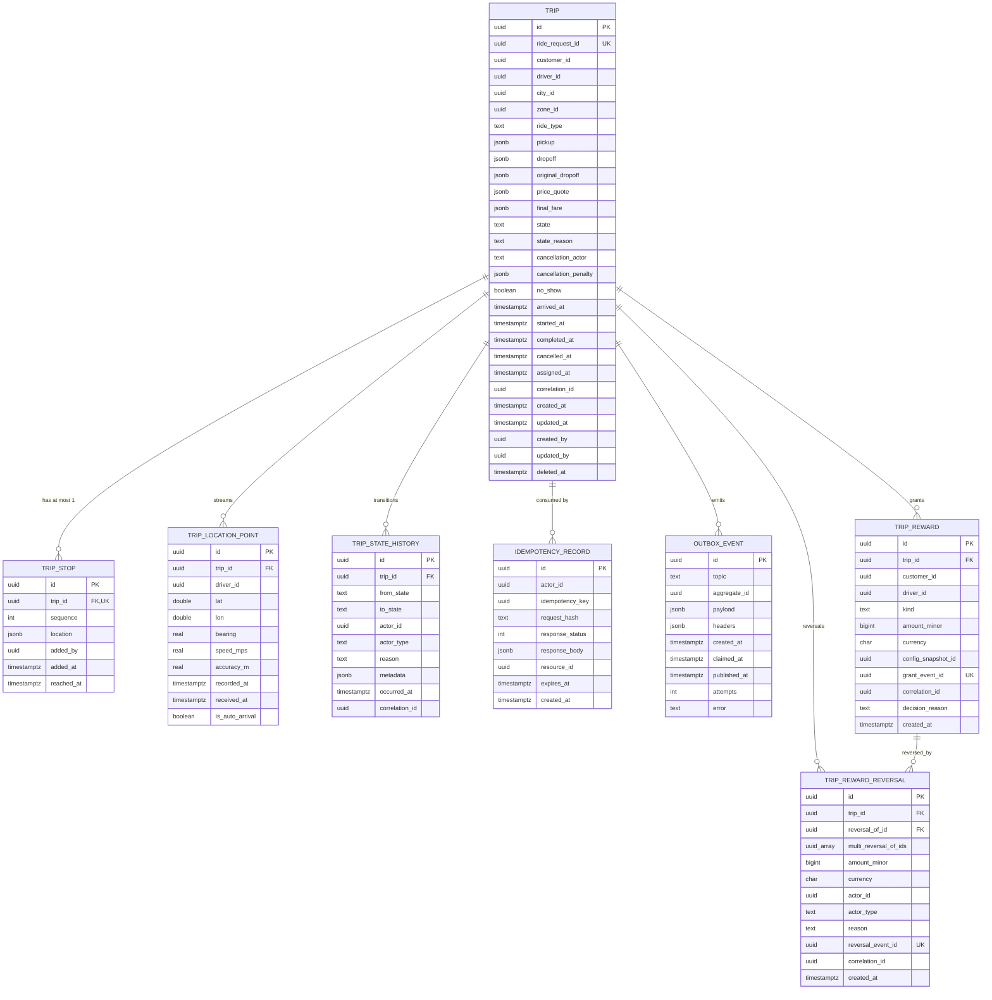

# trip-service — Entity-Relationship Diagram

## 1. Database

- Engine: PostgreSQL 18
- Schema: `trip` (owned exclusively by this service)
- Migrations: `services/trip-service/migrations/`
- Partitioning: `trip.location_points` is range-partitioned by day.

## 2. Cross-Service References

| Column | Type | Refers to | Source of truth |
|--------|------|-----------|------------------|
| `trips.customer_id` | UUID | `customer` in `customer-service` | `customer-service` |
| `trips.driver_id` | UUID | `driver` in `driver-service` | `driver-service` |
| `trips.ride_request_id` | UUID | `ride_request` in ``trip-service` (ride-request)` | ``trip-service` (ride-request)` |
| `trips.scheduled_ride_job_id` | UUID (nullable) | `scheduled_ride` job in ``trip-service` (scheduled)` | ``trip-service` (scheduled)` |
| `trips.original_dropoff_id` | UUID | location reference; no cross-service ref | this service |
| `trip_stops.customer_added_by` | UUID | customer | `customer-service` |
| `trip_state_history.actor_id` | UUID | whoever did it | the actor's service |
| `idempotency.actor_id` | UUID | caller | the actor's service |

## 3. Entities

### `Trip`

The trip aggregate. One row per ride from acceptance to completion.

#### Columns

| Column | Type | Constraints | Notes |
|--------|------|-------------|-------|
| `id` | UUID | PK | UUIDv7 |
| `ride_request_id` | UUID | NOT NULL, UNIQUE | cross-service ref; idempotency key for create |
| `customer_id` | UUID | NOT NULL | cross-service ref |
| `driver_id` | UUID | NOT NULL | cross-service ref |
| `city_id` | UUID | NOT NULL | city |
| `zone_id` | UUID | NOT NULL | pickup zone |
| `ride_type` | TEXT | NOT NULL | matches the request |
| `pickup` | JSONB | NOT NULL | `{lat,lon,address,place_id}` |
| `dropoff` | JSONB | NOT NULL | same shape; replaced by mid-trip change |
| `original_dropoff` | JSONB | NOT NULL | the original; the recompute-fare rule uses this |
| `price_quote` | JSONB | NOT NULL | `{quote_id, amount_minor, currency, expires_at, ...}` |
| `final_fare` | JSONB | NULL | `{fare_id, amount_minor, currency, breakdown, recompute_eta, recompute_distance}` |
| `state` | TEXT | NOT NULL, CHECK (state IN ('assigned','en_route_pickup','arrived','in_progress','completed','cancelled')) | state machine |
| `state_reason` | TEXT | NULL | free text |
| `cancellation_actor` | TEXT | NULL, CHECK (cancellation_actor IN ('customer','driver','admin','safety','no_show')) | who |
| `cancellation_penalty` | JSONB | NULL | `{amount_minor, currency, payment_intent_id, captured_at}` |
| `no_show` | BOOLEAN | NOT NULL DEFAULT false | true if cancelled due to no-show |
| `arrived_at` | TIMESTAMPTZ | NULL | |
| `started_at` | TIMESTAMPTZ | NULL | when `state=in_progress` |
| `completed_at` | TIMESTAMPTZ | NULL | |
| `cancelled_at` | TIMESTAMPTZ | NULL | |
| `assigned_at` | TIMESTAMPTZ | NOT NULL DEFAULT now() | when created |
| `correlation_id` | UUID | NOT NULL | end-to-end |
| `created_at` | TIMESTAMPTZ | NOT NULL DEFAULT now() | |
| `updated_at` | TIMESTAMPTZ | NOT NULL DEFAULT now() | |
| `created_by` | UUID | NOT NULL | system / service identity |
| `updated_by` | UUID | NOT NULL | |
| `deleted_at` | TIMESTAMPTZ | NULL | soft delete (rare) |

#### Indexes

- PK on `id`
- UNIQUE on `ride_request_id` (one trip per request)
- `idx_trip_customer_state` on `(customer_id, state)` — supports
  "active trip" lookup.
- `idx_trip_driver_state` on `(driver_id, state)` — supports the
  driver's active trip.
- `idx_trip_state_assigned_at` on `(state, assigned_at)` — supports
  the heartbeat sweeper.
- `idx_trip_correlation` on `(correlation_id)` — supports tracing.

#### Constraints

- `CHECK (state IN (...))` per state machine.
- `CHECK (cancellation_actor IS NULL OR cancellation_actor IN
  ('customer','driver','admin','safety','no_show'))`
- `CHECK (started_at IS NULL OR state IN ('in_progress','completed','cancelled'))`
- `CHECK (completed_at IS NULL OR state = 'completed')`
- `CHECK (cancelled_at IS NULL OR state = 'cancelled')`

### `TripStop`

A mid-trip added stop. At most one row per trip.

#### Columns

| Column | Type | Constraints | Notes |
|--------|------|-------------|-------|
| `id` | UUID | PK | UUIDv7 |
| `trip_id` | UUID | NOT NULL, UNIQUE | FK to `trips.id` |
| `sequence` | INT | NOT NULL, CHECK (sequence = 1) | one stop per trip |
| `location` | JSONB | NOT NULL | `{lat,lon,address,place_id}` |
| `added_by` | UUID | NOT NULL | customer |
| `added_at` | TIMESTAMPTZ | NOT NULL DEFAULT now() | |
| `reached_at` | TIMESTAMPTZ | NULL | when the driver passed this stop |

#### Indexes

- PK on `id`
- UNIQUE on `trip_id` (one stop per trip)

### `TripLocationPoint`

A GPS point streamed by the driver. Partitioned by day.

#### Columns

| Column | Type | Constraints | Notes |
|--------|------|-------------|-------|
| `id` | UUID | PK | UUIDv7 |
| `trip_id` | UUID | NOT NULL | FK to `trips.id` (within schema) |
| `driver_id` | UUID | NOT NULL | denormalised for partitioning |
| `lat` | DOUBLE PRECISION | NOT NULL | |
| `lon` | DOUBLE PRECISION | NOT NULL | |
| `bearing` | REAL | NULL | degrees, 0..360 |
| `speed_mps` | REAL | NULL | metres per second |
| `accuracy_m` | REAL | NULL | GPS-reported accuracy |
| `recorded_at` | TIMESTAMPTZ | NOT NULL | when the driver app recorded it |
| `received_at` | TIMESTAMPTZ | NOT NULL DEFAULT now() | when our service received it |
| `is_auto_arrival` | BOOLEAN | NOT NULL DEFAULT false | true for the point that triggered auto-arrival |

#### Indexes

- PK on `(id, recorded_at)` (must include the partition key)
- `idx_trip_location_point_trip_time` on `(trip_id, recorded_at DESC)`
- `idx_trip_location_point_driver_time` on `(driver_id, recorded_at DESC)`

#### Partitioning

Range partition by `recorded_at` (day). Pre-create 30 days ahead.
Drop partitions older than 2h after the trip completes. The drop
job runs hourly.

### `TripStateHistory`

Audit log of every state transition.

#### Columns

| Column | Type | Constraints | Notes |
|--------|------|-------------|-------|
| `id` | UUID | PK | UUIDv7 |
| `trip_id` | UUID | NOT NULL | FK to `trips.id` |
| `from_state` | TEXT | NULL | null for the initial creation |
| `to_state` | TEXT | NOT NULL | |
| `actor_id` | UUID | NOT NULL | |
| `actor_type` | TEXT | NOT NULL, CHECK (actor_type IN ('customer','driver','admin','support','safety','system')) | |
| `reason` | TEXT | NULL | free text |
| `metadata` | JSONB | NULL | e.g. `{"penalty":{...}}` |
| `occurred_at` | TIMESTAMPTZ | NOT NULL DEFAULT now() | |
| `correlation_id` | UUID | NOT NULL | |

#### Indexes

- PK on `id`
- `idx_trip_state_history_trip_time` on `(trip_id, occurred_at)`

### `IdempotencyRecord`

Same shape as in ``trip-service` (ride-request)`, owned by this service.

#### Columns

| Column | Type | Constraints | Notes |
|--------|------|-------------|-------|
| `id` | UUID | PK | UUIDv7 |
| `actor_id` | UUID | NOT NULL | driver or customer |
| `idempotency_key` | UUID | NOT NULL | client key |
| `request_hash` | TEXT | NOT NULL | |
| `response_status` | INT | NOT NULL | |
| `response_body` | JSONB | NOT NULL | |
| `resource_id` | UUID | NULL | the trip id |
| `expires_at` | TIMESTAMPTZ | NOT NULL | |
| `created_at` | TIMESTAMPTZ | NOT NULL DEFAULT now() | |

#### Indexes

- PK on `id`
- UNIQUE on `(actor_id, idempotency_key)`

### `OutboxEvent`

Transactional outbox.

#### Columns

| Column | Type | Constraints | Notes |
|--------|------|-------------|-------|
| `id` | UUID | PK | UUIDv7 |
| `topic` | TEXT | NOT NULL | |
| `aggregate_id` | UUID | NOT NULL | partition key |
| `payload` | JSONB | NOT NULL | |
| `headers` | JSONB | NOT NULL DEFAULT '{}'::jsonb | |
| `created_at` | TIMESTAMPTZ | NOT NULL DEFAULT now() | |
| `claimed_at` | TIMESTAMPTZ | NULL | |
| `published_at` | TIMESTAMPTZ | NULL | |
| `attempts` | INT | NOT NULL DEFAULT 0 | |
| `error` | TEXT | NULL | |

#### Indexes

- PK on `id`
- `idx_outbox_pending` on `(created_at)` partial `WHERE
  published_at IS NULL`

### `TripReward`

A granted reward decision (driver top-up OR user credit) for a
trip. Append-only — `REVOKE UPDATE, DELETE` from the application
role, mirroring `ledger.postings` per the accounting four-layer
truth model.

#### Columns

| Column | Type | Constraints | Notes |
|--------|------|-------------|-------|
| `id` | UUID | PK | UUIDv7 |
| `trip_id` | UUID | NOT NULL | cross-service ref to `trips.id` |
| `customer_id` | UUID | NULL | denormalised for query |
| `driver_id` | UUID | NULL | denormalised for query |
| `kind` | TEXT | NOT NULL | `driver_per_trip_topup` / `driver_hourly_topup` / `driver_daily_topup` / `user_per_trip_credit` |
| `amount_minor` | BIGINT | NOT NULL | money in minor units |
| `currency` | CHAR(3) | NOT NULL | ISO-4217 |
| `config_snapshot_id` | UUID | NOT NULL | cross-ref to the captured snapshot row |
| `grant_event_id` | UUID | NOT NULL | UUIDv7 stamped on the outbox event for `trip.reward.granted.v1` |
| `correlation_id` | UUID | NOT NULL | end-to-end |
| `decision_reason` | TEXT | NOT NULL | enum-like label (e.g. `per_trip_eligible`, `hourly_floor_unmet`, `ineligible`, `period_floor_residual`, `user_cap_reached`) |
| `created_at` | TIMESTAMPTZ | NOT NULL DEFAULT now() | |

#### Indexes

- PK on `id`
- UNIQUE on `(trip_id, kind)` — exactly one grant per kind per trip
- UNIQUE on `grant_event_id` — replay dedup against the inbox
- `idx_trip_reward_trip` on `(trip_id, created_at)`

#### Constraints

- CHECK: `kind IN ('driver_per_trip_topup','driver_hourly_topup','driver_daily_topup','user_per_trip_credit')`
- CHECK: `amount_minor >= 0`
- REVOKE UPDATE, DELETE from the application role (mirrors
  `ledger.postings`).

### `TripRewardReversal`

A reversal of one or more previously-granted rewards. Append-only
with `REVOKE UPDATE, DELETE` from the application role. The
`reversal_of_id` column references `TripReward.id` for the original
grant row; for multi-line reversals a reversal can carry MULTIPLE
pointers via the JSONB field, but the typical case is one reversal
per grant.

#### Columns

| Column | Type | Constraints | Notes |
|--------|------|-------------|-------|
| `id` | UUID | PK | UUIDv7 |
| `trip_id` | UUID | NOT NULL | cross-service ref to `trips.id` |
| `reversal_of_id` | UUID | NULL | FK to `trip_reward.id` — the grant row being reversed |
| `multi_reversal_of_ids` | UUID[] | NULL | for multi-line reversals |
| `amount_minor` | BIGINT | NOT NULL | reverse-of-grant amount (positive number; the ledger posts as the opposite sign) |
| `currency` | CHAR(3) | NOT NULL | ISO-4217 |
| `actor_id` | UUID | NOT NULL | admin / provider / system |
| `actor_type` | TEXT | NOT NULL | `admin` / `provider` / `system` |
| `reason` | TEXT | NOT NULL | free text ≥ 8 chars |
| `reversal_event_id` | UUID | NOT NULL | UUIDv7 stamped on the outbox event for `trip.reward.reversed.v1` |
| `correlation_id` | UUID | NOT NULL | end-to-end |
| `created_at` | TIMESTAMPTZ | NOT NULL DEFAULT now() | |

#### Indexes

- PK on `id`
- UNIQUE on `reversal_event_id`
- `idx_trip_reward_reversal_trip` on `(trip_id, created_at)`
- `idx_trip_reward_reversal_grant` on `(reversal_of_id)`
  WHERE reversal_of_id IS NOT NULL

#### Constraints

- CHECK: `actor_type IN ('admin','provider','system')`
- CHECK: `reversal_of_id IS NOT NULL OR multi_reversal_of_ids IS NOT NULL`
- REVOKE UPDATE, DELETE from the application role (mirrors
  `ledger.postings`).

## 4. Mermaid ER Diagram



## 5. DDL Sketch

```sql
CREATE SCHEMA IF NOT EXISTS trip;
SET search_path TO trip;

CREATE TABLE trip.trips (
    id UUID PRIMARY KEY,
    ride_request_id UUID NOT NULL UNIQUE,
    customer_id UUID NOT NULL,
    driver_id UUID NOT NULL,
    city_id UUID NOT NULL,
    zone_id UUID NOT NULL,
    ride_type TEXT NOT NULL,
    pickup JSONB NOT NULL,
    dropoff JSONB NOT NULL,
    original_dropoff JSONB NOT NULL,
    price_quote JSONB NOT NULL,
    final_fare JSONB,
    state TEXT NOT NULL,
    state_reason TEXT,
    cancellation_actor TEXT,
    cancellation_penalty JSONB,
    no_show BOOLEAN NOT NULL DEFAULT false,
    arrived_at TIMESTAMPTZ,
    started_at TIMESTAMPTZ,
    completed_at TIMESTAMPTZ,
    cancelled_at TIMESTAMPTZ,
    assigned_at TIMESTAMPTZ NOT NULL DEFAULT now(),
    correlation_id UUID NOT NULL,
    created_at TIMESTAMPTZ NOT NULL DEFAULT now(),
    updated_at TIMESTAMPTZ NOT NULL DEFAULT now(),
    created_by UUID NOT NULL,
    updated_by UUID NOT NULL,
    deleted_at TIMESTAMPTZ,
    CONSTRAINT chk_trip_state CHECK (state IN
        ('assigned','en_route_pickup','arrived','in_progress','completed','cancelled')),
    CONSTRAINT chk_trip_cancellation_actor CHECK (
        cancellation_actor IS NULL OR
        cancellation_actor IN ('customer','driver','admin','safety','no_show')
    )
);
CREATE INDEX idx_trip_customer_state ON trip.trips (customer_id, state);
CREATE INDEX idx_trip_driver_state ON trip.trips (driver_id, state);
CREATE INDEX idx_trip_state_assigned_at ON trip.trips (state, assigned_at);
CREATE INDEX idx_trip_correlation ON trip.trips (correlation_id);

CREATE TABLE trip.trip_stops (
    id UUID PRIMARY KEY,
    trip_id UUID NOT NULL UNIQUE REFERENCES trip.trips(id),
    sequence INT NOT NULL,
    location JSONB NOT NULL,
    added_by UUID NOT NULL,
    added_at TIMESTAMPTZ NOT NULL DEFAULT now(),
    reached_at TIMESTAMPTZ,
    CONSTRAINT chk_stop_sequence CHECK (sequence = 1)
);

CREATE TABLE trip.trip_location_points (
    id UUID NOT NULL,
    trip_id UUID NOT NULL,
    driver_id UUID NOT NULL,
    lat DOUBLE PRECISION NOT NULL,
    lon DOUBLE PRECISION NOT NULL,
    bearing REAL,
    speed_mps REAL,
    accuracy_m REAL,
    recorded_at TIMESTAMPTZ NOT NULL,
    received_at TIMESTAMPTZ NOT NULL DEFAULT now(),
    is_auto_arrival BOOLEAN NOT NULL DEFAULT false,
    PRIMARY KEY (id, recorded_at)
) PARTITION BY RANGE (recorded_at);

-- Idempotent pre-creation; safe to rerun as part of the maintenance job.
CREATE TABLE IF NOT EXISTS trip.trip_location_points_2026_07_29
    PARTITION OF trip.trip_location_points
    FOR VALUES FROM ('2026-07-29 00:00:00+00') TO ('2026-07-30 00:00:00+00');

CREATE INDEX idx_trip_location_point_trip_time
    ON trip.trip_location_points (trip_id, recorded_at DESC);
CREATE INDEX idx_trip_location_point_driver_time
    ON trip.trip_location_points (driver_id, recorded_at DESC);

CREATE TABLE trip.trip_state_history (
    id UUID PRIMARY KEY,
    trip_id UUID NOT NULL REFERENCES trip.trips(id),
    from_state TEXT,
    to_state TEXT NOT NULL,
    actor_id UUID NOT NULL,
    actor_type TEXT NOT NULL,
    reason TEXT,
    metadata JSONB,
    occurred_at TIMESTAMPTZ NOT NULL DEFAULT now(),
    correlation_id UUID NOT NULL,
    CONSTRAINT chk_state_history_actor CHECK (actor_type IN
        ('customer','driver','admin','support','safety','system'))
);
CREATE INDEX idx_trip_state_history_trip_time
    ON trip.trip_state_history (trip_id, occurred_at);

CREATE TABLE trip.idempotency (
    id UUID PRIMARY KEY,
    actor_id UUID NOT NULL,
    idempotency_key UUID NOT NULL,
    request_hash TEXT NOT NULL,
    response_status INT NOT NULL,
    response_body JSONB NOT NULL,
    resource_id UUID,
    expires_at TIMESTAMPTZ NOT NULL,
    created_at TIMESTAMPTZ NOT NULL DEFAULT now(),
    CONSTRAINT uq_idempotency UNIQUE (actor_id, idempotency_key)
);

CREATE TABLE trip.outbox (
    id UUID PRIMARY KEY,
    topic TEXT NOT NULL,
    aggregate_id UUID NOT NULL,
    payload JSONB NOT NULL,
    headers JSONB NOT NULL DEFAULT '{}'::jsonb,
    created_at TIMESTAMPTZ NOT NULL DEFAULT now(),
    claimed_at TIMESTAMPTZ,
    published_at TIMESTAMPTZ,
    attempts INT NOT NULL DEFAULT 0,
    error TEXT
);
CREATE INDEX idx_outbox_pending ON trip.outbox (created_at)
    WHERE published_at IS NULL;

-- Trip reward table: append-only; REVOKE UPDATE/DELETE from the
-- application role (mirrors ledger.postings per the accounting
-- four-layer truth model). Reward kinds are an enum; amount is in
-- minor units with currency.
CREATE TABLE trip.trip_reward (
    id UUID PRIMARY KEY,
    trip_id UUID NOT NULL REFERENCES trip.trips(id),
    customer_id UUID,
    driver_id UUID,
    kind TEXT NOT NULL CHECK (kind IN (
        'driver_per_trip_topup','driver_hourly_topup',
        'driver_daily_topup','user_per_trip_credit'
    )),
    amount_minor BIGINT NOT NULL CHECK (amount_minor >= 0),
    currency CHAR(3) NOT NULL,
    config_snapshot_id UUID NOT NULL,
    grant_event_id UUID NOT NULL UNIQUE,
    correlation_id UUID NOT NULL,
    decision_reason TEXT NOT NULL,
    created_at TIMESTAMPTZ NOT NULL DEFAULT now(),
    CONSTRAINT uq_trip_reward_trip_kind UNIQUE (trip_id, kind)
);
CREATE INDEX idx_trip_reward_trip ON trip.trip_reward (trip_id, created_at);
REVOKE UPDATE, DELETE ON trip.trip_reward FROM trip_app;

CREATE TABLE trip.trip_reward_reversal (
    id UUID PRIMARY KEY,
    trip_id UUID NOT NULL REFERENCES trip.trips(id),
    reversal_of_id UUID REFERENCES trip.trip_reward(id),
    multi_reversal_of_ids UUID[],
    amount_minor BIGINT NOT NULL CHECK (amount_minor >= 0),
    currency CHAR(3) NOT NULL,
    actor_id UUID NOT NULL,
    actor_type TEXT NOT NULL CHECK (actor_type IN ('admin','provider','system')),
    reason TEXT NOT NULL CHECK (char_length(reason) >= 8),
    reversal_event_id UUID NOT NULL UNIQUE,
    correlation_id UUID NOT NULL,
    created_at TIMESTAMPTZ NOT NULL DEFAULT now(),
    CONSTRAINT chk_reversal_target_present CHECK (
        reversal_of_id IS NOT NULL OR multi_reversal_of_ids IS NOT NULL
    )
);
CREATE INDEX idx_trip_reward_reversal_trip
    ON trip.trip_reward_reversal (trip_id, created_at);
CREATE INDEX idx_trip_reward_reversal_grant
    ON trip.trip_reward_reversal (reversal_of_id)
    WHERE reversal_of_id IS NOT NULL;
REVOKE UPDATE, DELETE ON trip.trip_reward_reversal FROM trip_app;
```

## 6. Audit Columns

Every mutable table has `created_at`, `updated_at`, `created_by`,
`updated_by`. The `trip_state_history` table is append-only.

## 7. Soft Delete

Not used for active trips. The `cancelled` and `completed` states
are the "deleted by user or system" equivalent. The 7-year retention
window applies to the trip row.

## 8. JSONB Usage

- `pickup`, `dropoff`, `original_dropoff`, `trip_stops.location`:
  geocoded address + lat/lon + provider's place_id.
- `price_quote`, `final_fare`, `cancellation_penalty`: full quote
  shape preserved for audit and reconciliation.
- `trip_state_history.metadata`: state-specific payload (e.g.
  penalty).
- `outbox.payload`: full event envelope.
- `trip_reward.decision_reason`: a small enum-like label
  (`per_trip_eligible`, `hourly_floor_unmet`, `ineligible`,
  `period_floor_residual`, `user_cap_reached`, etc.). The full
  config snapshot is stored as a sibling row (referenced by
  `config_snapshot_id`); the JSONB form is intentionally minimal
  to keep the row narrow.
- `trip_reward_reversal.multi_reversal_of_ids`: only used when one
  reversal covers multiple grants (rare).

## 9. Partitioning

| Table | Strategy | Retention |
|-------|----------|-----------|
| `trip_location_points` | RANGE by `recorded_at` (day) | 2h after `completed_at`; partition dropped 2h+30min later |

The partition maintenance job:
- Pre-creates the next 30 days of partitions.
- Drops partitions whose max `recorded_at` is older than
  `now() - 2h30min` and for which no trip is still active.

## 10. Data Retention

| Table | Retention | Purged by |
|-------|-----------|-----------|
| `trips` | 7 years | scheduled job; de-identifies first |
| `trip_stops` | with the trip | with the trip |
| `trip_location_points` | 2h after `completed_at` | partition drop |
| `trip_state_history` | 7 years | with the trip |
| `idempotency` | 24h | daily purge |
| `outbox` | 24h after publish | poller purge |
| `trip_reward` | 7 years (financial record, same as `trips`) | append-only; never deleted (REVOKE DELETE) |
| `trip_reward_reversal` | 7 years (financial record) | append-only; never deleted (REVOKE DELETE) |

## 11. Migration Considerations

- The `trip_location_points` table is partitioned; any new index
  must be created on the parent (PostgreSQL propagates to children).
- Adding `final_fare` and `cancellation_penalty` columns is online.
- Renaming `state` values is forbidden; deprecation requires a new
  value added to the CHECK constraint and a multi-step migration.
- The `trips` table's `ride_request_id` UNIQUE constraint enforces
  idempotency; an attempt to relax it must be done with a new
  column to avoid breaking the create flow.

---

## See also

### Sibling docs for this service

- [`README.md`](./README.md) — purpose, bounded context, responsibilities
- [`BRD.md`](./BRD.md) — business requirements
- [`SRS.md`](./SRS.md) — functional + non-functional requirements
- [`ERD.md`](./ERD.md) — data model (entities, relationships)
- [`INTEGRATION.md`](./INTEGRATION.md) — inter-service contracts (APIs, events, sagas)
- [`WORKFLOWS.md`](./WORKFLOWS.md) — operational workflows (happy paths, failure modes)
- [`TECH.md`](./TECH.md) — technology profile (runtime, libraries, data layer, admin endpoints, RBAC)

### Platform-wide

- [`../../shared/README.md`](../../shared/README.md) — `platform-spring-boot-starter` shared library (the single source of cross-cutting code for all Spring Boot services in the platform)
- [`../RECOMMENDATIONS.md`](../RECOMMENDATIONS.md) — platform-wide technology map (language, framework, version baseline, admin/RBAC pattern)
- [`../../README.md`](../../README.md) — services overview (the catalog of all 20 services)
- [`../../../main.md`](../../../main.md) — top-level platform specification (architecture, Keycloak, PostgreSQL 18, messaging, observability baseline)

