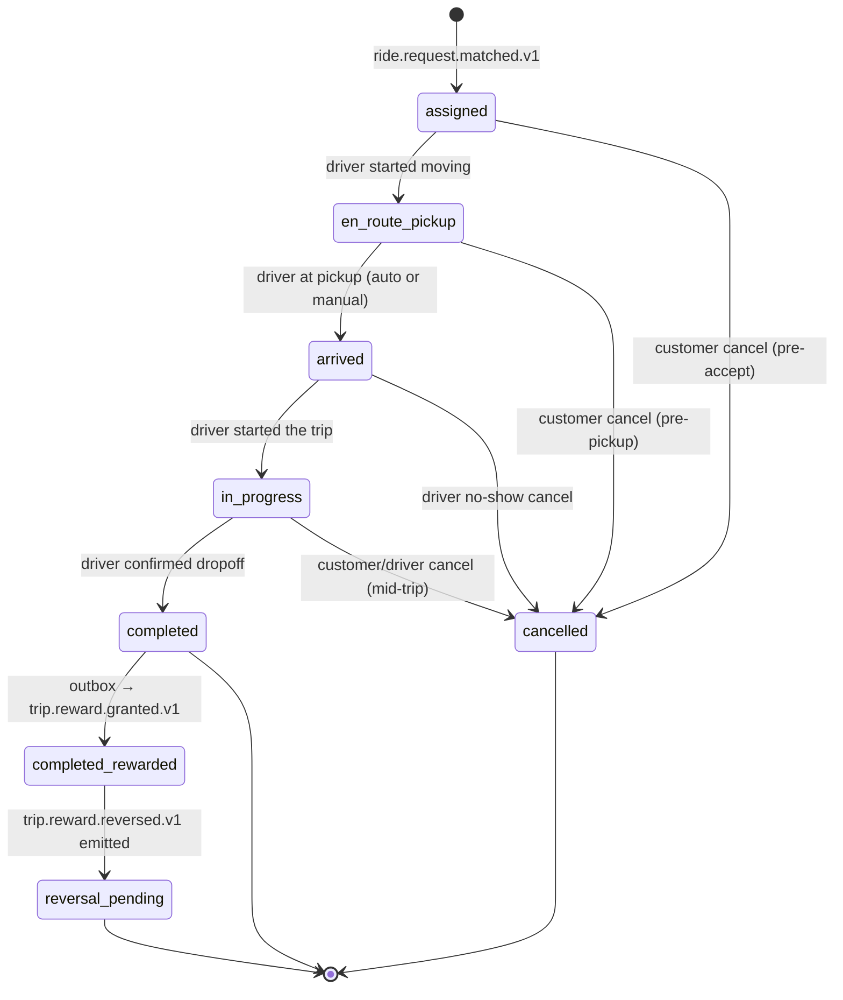

# trip-service — Software Requirements Specification

## 1. Introduction

This document specifies the functional, non-functional, data, and
security requirements for `trip-service`. The trip aggregate is the
unit of revenue, dispute, and safety; the implementation must
preserve its correctness, freshness, and recoverability.

## 2. Scope

In scope:

- The trip aggregate (states `assigned`, `en_route_pickup`, `arrived`,
  `in_progress`, `completed`, `cancelled`).
- Live tracking location stream and the location trail.
- Auto-arrival via geofence.
- Mid-trip changes (stop add, dropoff change).
- Final-fare recompute.
- Driver-cancellation penalty.
- Trip events consumed by downstream services.

Out of scope:

- The ride request aggregate.
- Driver online state and zone.
- Pricing rules and quote generation logic.
- The driver's earnings or payment capture.

## 3. System Context

```mermaid
flowchart LR
    RR["`trip-service` (ride-request)] -. ride.request.matched.v1 .-> TS[trip-service]
    DL["`driver-service` (location)] -. driver.location.updated.v1 .-> TS
    DR[Driver app] --> TS
    C[Customer app] --> TS
    TS --> DRV[driver-service]
    TS --> CST[customer-service]
    TS --> ETA["`geolocation-service` (ETA/routing)]
    TS --> PRC[pricing-service]
    TS --> NOT[notification-service]
    TS -. trip.*.v1 .-> K[(Kafka)]
    K --> RPI[ride-payment-integration]
    K --> DE["`payment-service` (driver earnings)]
    K --> DI["`driver-service` (incentives)]
    K --> REV[`trip-service` / `food-order-service` / `search-service` (review projections")]
    K --> RH["`trip-service` (history)]
    K --> RS["`trip-service` (safety)]
    K --> AUD[audit-service]
```

## 4. Actors

- **Driver app** — JWT role `driver`. Pushes state transitions and
  GPS points.
- **Customer app** — JWT role `customer`. Reads trip; pushes mid-trip
  changes.
- **Trust & Safety agent** — JWT role `safety_agent`. Reads live
  location and trail.
- **Support agent** — JWT role `support_agent`. Reads; force-cancels.
- **Admin** — JWT role `admin`. Full read; cancel; reason required.
- **`trip-service` (ride-request)** — system actor via event.
- **`driver-service` (location)** — system actor via event.
- **`geolocation-service` (ETA/routing)**, **pricing-service** — system actors via
  REST.

## 5. Functional Requirements

| ID | Requirement | Priority |
|----|-------------|----------|
| FR--001 | On `ride.request.matched.v1`, create a `trip` in state `assigned`, copying `pickup`, `dropoff`, `ride_type`, `price_quote`, `customer_id`, `driver_id`. | MUST |
| FR--002 | Reject duplicate creation if a trip with the same `ride_request_id` already exists (idempotent by `ride_request_id`). | MUST |
| FR--003 | Allow the assigned driver to call `POST /v1/trips/{id}/arrive`; transition `* → arrived`. | MUST |
| FR--004 | Allow the assigned driver to call `POST /v1/trips/{id}/start`; transition `arrived → in_progress`. | MUST |
| FR--005 | Auto-detect arrival: when `driver.location.updated.v1` for `driver_id` is within the pickup geofence for ≥ 5 seconds and the trip is in `en_route_pickup`, transition to `arrived` and emit `trip.arrived.v1`. | MUST |
| FR--006 | Accept `POST /v1/trips/{id}/location` from the driver; persist a point in the trail and emit `trip.location.updated.v1`. | MUST |
| FR--007 | Limit the driver's location stream to 5 points per second (HTTP 429 otherwise). | MUST |
| FR--008 | Allow the customer to call `POST /v1/trips/{id}/stops` with a `{lat, lon, address}`; add a stop if the count would be ≤ 1. | MUST |
| FR--009 | Allow the customer to call `POST /v1/trips/{id}/dropoff`; replace the dropoff if within 5 km of the original and the trip is in `in_progress`. | MUST |
| FR--010 | On `POST /v1/trips/{id}/complete` (driver), call ``geolocation-service` (ETA/routing)` for the actual route, then `pricing-service` for the final fare, set `final_fare`, transition to `completed`, emit `trip.completed.v1`. | MUST |
| FR--011 | Allow the driver to call `POST /v1/trips/{id}/cancel` in `assigned`, `en_route_pickup`, or `arrived` (within 2 minutes of arrival). | MUST |
| FR--012 | On driver-cancel after the early window, call `pricing-service` for the penalty; record it on the trip and emit `trip.cancelled.v1` with `actor=driver, penalty=…`. | MUST |
| FR--013 | Allow the customer to call `POST /v1/trips/{id}/cancel` only in `assigned` or `en_route_pickup` (before pickup). | MUST |
| FR--014 | On customer no-show at pickup, allow the driver to call `POST /v1/trips/{id}/cancel` with `reason=no_show`; transition to `cancelled`, no penalty to customer, `no_show=true` flag set. | MUST |
| FR--015 | `GET /v1/trips/{id}/track` returns the current position and the polyline of the remaining route, with `last_updated_at`. | MUST |
| FR--016 | Reject all state transitions not in the state machine with 409 `STATE_INVALID`. | MUST |
| FR--017 | Persist every state transition with `correlation_id`, `actor_id`, `actor_type`, `from_state`, `to_state`, and a timestamp. | MUST |
| FR--018 | Soft-redact precise GPS from any response sent to the customer after `trip.completed_at + 2h`. | MUST |
| FR--019 | All emitted events go through the transactional outbox. | MUST |
| FR--020 | On heartbeat loss (no `driver.location.updated.v1` for the trip's driver for 2 minutes, AND no driver app ping for 5 minutes), open a P1 safety ticket via ``trip-service` (safety)`. | MUST |
| FR--021 | On `state=completed`, the service MUST snapshot the reward configuration (`trip.reward.*` keys from `configuration-service`) and the eligible earnings from ``payment-service` (driver earnings)` (`GET /v1/drivers/{id}/period-eligible-earnings?window=hourly` and `?window=daily`) before persisting the reward decision. The snapshot is recorded on each `trip_reward` row as `config_snapshot_id`. | MUST |
| FR--022 | The service MUST compute the driver-side per-trip top-up as `max(0, trip.reward.driver.per_trip_minor.{currency} − base_driver_earnings)`. `base_driver_earnings` is the standard `fare_share − commission − withholding_tax` from ``payment-service` (driver earnings)`'s gross-to-net (see `workflows/ACCOUNTING_WORKFLOWS.md` "Driver / Courier Income"). | MUST |
| FR--023 | The service MUST compute the driver-side hourly floor as `max(0, trip.reward.driver.hourly_floor_minor.{currency} − eligible_earnings_in_rolling_60min_window)` and the daily floor as `max(0, trip.reward.driver.daily_floor_minor.{currency} − eligible_earnings_in_rolling_24h_window)`. The window is per-driver, rolling; both floor evaluations reuse the eligibility filter in FR--025. | MUST |
| FR--024 | The final driver reward MUST be the per-trip top-up plus the larger of the hourly or daily floor (whichever is greater than zero); the chosen period becomes part of the `decision_reason`. No double-counting with existing quests / surge bonuses from ``driver-service` (incentives)`: that service consumes the same `trip.completed.v1` event and posts separately via `driver.incentive.earned.v1`. | MUST |
| FR--025 | Reward eligibility requires ALL of: (a) driver rating ≥ `trip.reward.driver.eligibility.min_rating` (default `4.0`); (b) driver has ≥ `trip.reward.driver.eligibility.min_completed_trips` completed trips in the rolling 24-h window (default `5`); (c) `pickup_zone_id` is in the city-level reward-eligible set; (d) (for user credit) `customer_id` is not suspended per `customer.suspended.v1`. A trip failing the filter is rewarded with zero but `trip.reward.granted.v1` is still emitted with `decision_reason = "ineligible"`. | MUST |
| FR--026 | The service MUST compute the user-side reward per `trip.reward.user.kind.{city_id}`: `wallet_credit` → `min(trip.reward.user.per_trip_minor.{currency}, user_cap)`, route to ``payment-service` (wallet)` (default); `loyalty_points` → compute points from ``pricing-service` (loyalty rules) / `customer-service` (account)` rules, route to ``pricing-service` (loyalty rules) / `customer-service` (account)`; `none` → no reward, do not emit the user line. The user reward is independent of the driver reward and may be granted even when the driver reward is `0` (and vice versa). | MUST |
| FR--027 | The service MUST emit `trip.reward.granted.v1` in the SAME database transaction as the `state=completed` write; the outbox row MUST carry `trip_id`, one `kind` line for each granted reward, the `config_snapshot_id`, the `decision_reason`, the captured rule values, and the consumer `correlation_id`. The event MUST be published within 1s of `state=completed` (NFR--011). The reversal event is `trip.reward.reversed.v1` with `reversal_of_event_id` and `grant_id` (FR--029). | MUST |
| FR--028 | The grant idempotency key is `trip:{trip_id}:reward:grant`. A retried request (the driver's app re-pressing `Complete` after a transient failure) MUST NOT produce a second grant; the inbox dedupes by `event_id`. The reversal idempotency key is `trip:{trip_id}:reward:reversal`. | MUST |
| FR--029 | The service MUST provide `POST /v1/trips/{id}/reward/re-evaluate` (admin, `pricing.admin` scope) and `POST /v1/trips/{id}/reward/reverse` (admin, `pricing.admin` scope, required `reason` ≥ 8 chars). Re-evaluation replaces the grant (the new grant references the old via `replaces_grant_id`); reversal creates a new `trip.trip_reward_reversal` row and emits `trip.reward.reversed.v1`. The admin endpoints are idempotent on `Idempotency-Key`. | MUST |
| FR--030 | The service MUST consume `payment.captured.v1` informationally (no side-effect) to skip re-evaluating an already-granted reward when the payment capture confirms the trip; the existing `trip.completed.v1` outbox remains the primary trigger. Heartbeat-style refresh of the trip's reward status is via the redis active-trip cache. | SHOULD |

## 6. Non-Functional Requirements

| ID | Category | Requirement | Target |
|----|----------|-------------|--------|
| NFR--001 | performance | P50 latency for `POST /v1/trips/{id}/location` | ≤ 30ms |
| NFR--002 | performance | P95 latency for state transitions | ≤ 200ms |
| NFR--003 | performance | P99 latency for `GET /v1/trips/{id}/track` | ≤ 100ms |
| NFR--004 | availability | uptime | 99.95% (Tier-1) |
| NFR--005 | scalability | concurrent active trips | 200k per region |
| NFR--006 | scalability | location points per second sustained | 1M/s per region |
| NFR--007 | maintainability | MTTR for a bad deploy | ≤ 15 minutes |
| NFR--008 | observability | tracing coverage | 100% of API requests |
| NFR--009 | data integrity | zero lost state transitions under retry | outbox guarantees |
| NFR--010 | capacity | match-to-create P99 | ≤ 1s |
| NFR--011 | performance | reward evaluation P95 (driver + user) | ≤ 200ms end-to-end |
| NFR--012 | latency | `trip.reward.granted.v1` published within 1s of `state=completed` | measured |
| NFR--013 | latency | `trip.reward.reversed.v1` published P95 ≤ 300ms after admin reversal call | measured |

## 7. API Requirements

REST per `architecture/API_STANDARDS.md`. The driver's `location`
endpoint is rate-limited per driver (10/s) at the gateway and
internally (5/s). All non-idempotent POSTs require
`Idempotency-Key`. Errors use the standard envelope. Full contract
in `INTEGRATION.md`.

## 8. Data Requirements

| ID | Requirement | Notes |
|----|-------------|-------|
| DATA--001 | Trip has a UUIDv7 PK; time-ordered for analytics | |
| DATA--002 | All timestamps `timestamptz` UTC | RFC3339 at the wire |
| DATA--003 | Money in `amount_minor BIGINT` with `currency CHAR(3)` | no floats |
| DATA--004 | Pickup, dropoff, and added stops stored as JSONB | `{lat,lon,address,place_id}` |
| DATA--005 | `customer_id`, `driver_id`, `ride_request_id` stored as UUID without FKs | cross-service references |
| DATA--006 | Location points stored in a partitioned table by day | 2h retention |
| DATA--007 | Final fare stored with the same shape as the price quote | `DATA--003` |
| DATA--008 | Audit columns on every mutable table | platform standard |
| DATA--009 | Soft delete not used for active trips; archive snapshot rows use `deleted_at` | |
| DATA--010 | State enum encoded in `state TEXT` with `CHECK` | platform state machine |
| DATA--011 | `trip.trip_reward` table is append-only; `REVOKE UPDATE, DELETE` from the application role; the `kind` column encodes the reward type. | same pattern as `ledger.postings` (four-layer truth model) |
| DATA--012 | `trip.trip_reward_reversal` references the grant row via `reversal_of_id UUID` (FK to `trip.trip_reward.id`); both grant and reversal are immutable. | |
| DATA--013 | All reward money columns are `amount_minor BIGINT NOT NULL` with `currency CHAR(3) NOT NULL` — extends DATA--003 to the reward domain. | no floats |

## 9. Validation Rules

- `arrive` is allowed only in `en_route_pickup` (auto) or
  `en_route_pickup` (manual).
- `start` is allowed only in `arrived`.
- `complete` is allowed only in `in_progress`.
- Mid-trip `stops` is allowed only in `in_progress` and only if the
  count is 0.
- Mid-trip `dropoff` is allowed only in `in_progress` and only if
  the new point is within 5 km of the original.
- `cancel` is allowed only in `assigned`, `en_route_pickup`, or
  `arrived` (within 2 minutes of arrival).
- All location points are validated: `lat ∈ [-90, 90]`, `lon ∈
  [-180, 180]`.
- Reward parameters are validated: `trip.reward.driver.per_trip_minor.{currency} ≥ 0`,
  `trip.reward.driver.hourly_floor_minor.{currency} ≥ 0`, and the
  hourly window (`trip.reward.driver.min_window_minutes`) MUST be a
  strict subset of the daily window (24-h rolling).
- A reversal event MUST include `reversal_of_event_id` matching a
  prior `trip.reward.granted.v1.event_id`; otherwise the reversal
  is rejected with 422 `REVERSAL_OF_NOT_FOUND`.

## 10. State Transitions



## 11. Authorization Requirements

- The assigned driver can push state transitions and location.
- The customer can read and request mid-trip changes.
- Support / admin can read; admin can force-cancel with a reason.
- Trust & Safety can read live location and trail for active or
  recently completed trips.

## 12. Configuration Requirements

Consumed from `configuration-service` and refreshed on
`configuration.updated.v1`. See `README.md` 13.

## 13. Error Handling

| Error | Response | Recovery |
|-------|----------|----------|
| Invalid request body | 400 `VALIDATION_FAILED` | client corrects |
| Not the assigned driver | 403 `FORBIDDEN` | none |
| State machine rejects | 409 `STATE_INVALID` | client refreshes |
| Rate limited (location) | 429 `RATE_LIMITED` | driver app backoff |
| Pricing service down | 503 `DEPENDENCY_TIMEOUT` | retry on complete |
| Auto-arrival race | idempotent merge (no duplicate state) | logged |

## 14. Concurrency Requirements

- A single trip row is mutated by at most one writer at a time.
  Updates use `SELECT … FOR UPDATE`.
- Location points are written in batches (size 1, no batching needed
  at 5/s).
- The driver's location stream is processed by a single consumer
  group per region; the trip's geofence check is local to that
  consumer.

## 15. Idempotency Requirements

- `Idempotency-Key` required on all non-idempotent POSTs.
- Storage: `trip.idempotency` table keyed by `(actor_id,
  idempotency_key)`. TTL 24h.
- Replay returns the stored response.
- Reward grant / reversal idempotency: `trip:{trip_id}:reward:grant`
  and `trip:{trip_id}:reward:reversal` carry the inbox dedup key;
  TTL is 30 days for grants (covers admin follow-up within the
  dispute window) and indefinite for reversals (a reversal can
  always be re-issued against the same grant).

## 16. Performance

- Dominant path: `POST /v1/trips/{id}/location`.
- P50 / P95 / P99: 30ms / 80ms / 200ms.
- Throughput: 1M location points/s sustained per region.

## 17. Scalability

- Horizontal: stateless, scale by HPA on
  `trip_location_points_total` and on CPU.
- Vertical: 1 vCPU / 1 GiB per replica is the minimum.
- The location-points table is partitioned by day; old partitions
  are dropped after retention.

## 18. Availability

- SLO: 99.95% over 30 days.
- Error budget: ~22 minutes per 30 days.
- Maintenance window: weekly Sun 04:00–06:00 UTC.

## 19. Security

| ID | Requirement | Notes |
|----|-------------|-------|
| SEC--001 | All endpoints require a valid JWT bearer token | gateway validates |
| SEC--002 | Only the assigned driver can push state transitions and location | `driver_id == sub` |
| SEC--003 | PII (pickup/dropoff/address/location) is encrypted at rest (disk-level KMS) | DATA--004, DATA--006 |
| SEC--004 | Admin actions require `X-Audit-Reason` and emit a high-severity audit event | BR--025 |
| SEC--005 | Driver location is sampled for storage at 1Hz to limit PII volume; the API receives the full 5Hz | acceptable |
| SEC--006 | Idempotency keys are opaque UUIDs | prevents enumeration |
| SEC--007 | No secrets in source or environment files | Vault only |
| SEC--008 | TLS 1.3 at edge; mTLS in cluster | platform standard |
| SEC--009 | The customer's tracking response redacts the driver's exact route beyond 2h | BR--020 |
| SEC--010 | Admin reward endpoints (`POST /v1/trips/{id}/reward/re-evaluate`, `POST /v1/trips/{id}/reward/reverse`) require the `pricing.admin` scope and a required `X-Audit-Reason` header of ≥ 8 chars | FR--029; the customer / driver JWTs are rejected with 403 `FORBIDDEN` |
| SEC--011 | The `trip.reward.granted.v1` and `trip.reward.reversed.v1` payloads MUST NOT include customer contact info, driver contact info, or precise GPS; only the trip_id, actor type, `amount_minor`, `currency`, `decision_reason`, and the captured `config_snapshot_id` | privacy |

## 20. Privacy

- PII stored: pickup/dropoff/address, location trail, customer and
  driver IDs.
- Retention: 7 years for the trip row (financial); 2h for the
  location trail (partition drop).
- Erasure: per GDPR, PII columns are erased; financial records are
  retained but with identifying fields removed. The location trail
  is dropped by partition.

## 21. Auditability

- Every state transition is logged with `correlation_id`,
  `trip_id`, `from_state`, `to_state`, `actor_id`, `actor_type`.
- Every admin action is logged at `warn` and emitted to
  `audit-service`.
- The location trail is reproducible from the driver's stream and
  the trip's `assigned_at` / `completed_at` for 2h after completion.

## 22. Observability

- Logs: JSON to stdout with `correlation_id`, `service`, `version`,
  `route`, `latency_ms`, `status`.
- Metrics: see `README.md` 15.
- Traces: OpenTelemetry, root span per request.
- Alerts: SLO burn-rate, location point drop, auto-arrival failure
  rate, P1 safety ticket rate.

## 23. Maintainability

- Code style: TypeScript with `strict: true`; ESLint + Prettier.
- Test coverage: ≥ 80% line / branch; 100% on the state machine.
- Documentation: this folder; OpenAPI generated from code.

## 24. Disaster Recovery

- RPO: ≤ 1 minute (WAL streaming + outbox).
- RTO: ≤ 15 minutes (warm standby in same region, cold standby in
  the other region). The location trail can be reconstructed from
  the ``driver-service` (location)` stream within the 2h window.

## 25. Acceptance Criteria

- The state machine refuses all invalid transitions with 409
  `STATE_INVALID`.
- The auto-arrival geofence triggers within 5s of the driver being
  within range, with ≤ 1% false positive rate.
- The final fare is within ±5% of the original quote in ≥ 99% of
  completed trips.
- A driver-cancellation after the early window applies the penalty
  and emits the event.
- A customer no-show transitions the trip to `cancelled` and emits
  the event.
- The location trail is queryable by Trust & Safety for the
  documented window.
- For every `state=completed` trip, **exactly one**
  `trip.reward.granted.v1` is emitted (within 1s, per NFR--012) with
  at least one of the four kinds
  (`driver_per_trip_topup` / `driver_hourly_topup` /
  `driver_daily_topup` / `user_per_trip_credit`) OR with
  `decision_reason = "ineligible"`. **No double-grant** is allowed
  even on retry of the driver's `complete` call.
- For every reversal request, **exactly one** `trip.reward.reversed.v1`
  is emitted (within 300ms P95, per NFR--013) with the matching
  `reversal_of_event_id` and a new balanced row in
  `trip.trip_reward_reversal`; **no UPDATE or DELETE** on
  `trip.trip_reward` is permitted.
- **All 30 functional requirements (FR--001..FR--030)** are
  implemented with the 25 list above as the contract that every
  release must satisfy.

---

## See also

### Sibling docs for this service

- [`README.md`](./README.md) — purpose, bounded context, responsibilities
- [`BRD.md`](./BRD.md) — business requirements
- [`SRS.md`](./SRS.md) — functional + non-functional requirements
- [`ERD.md`](./ERD.md) — data model (entities, relationships)
- [`INTEGRATION.md`](./INTEGRATION.md) — inter-service contracts (APIs, events, sagas)
- [`WORKFLOWS.md`](./WORKFLOWS.md) — operational workflows (happy paths, failure modes)
- [`TECH.md`](./TECH.md) — technology profile (runtime, libraries, data layer, admin endpoints, RBAC)

### Platform-wide

- [`../../shared/README.md`](../../shared/README.md) — `platform-spring-boot-starter` shared library (the single source of cross-cutting code for all Spring Boot services in the platform)
- [`../RECOMMENDATIONS.md`](../RECOMMENDATIONS.md) — platform-wide technology map (language, framework, version baseline, admin/RBAC pattern)
- [`../../README.md`](../../README.md) — services overview (the catalog of all 20 services)
- [`../../../main.md`](../../../main.md) — top-level platform specification (architecture, Keycloak, PostgreSQL 18, messaging, observability baseline)

