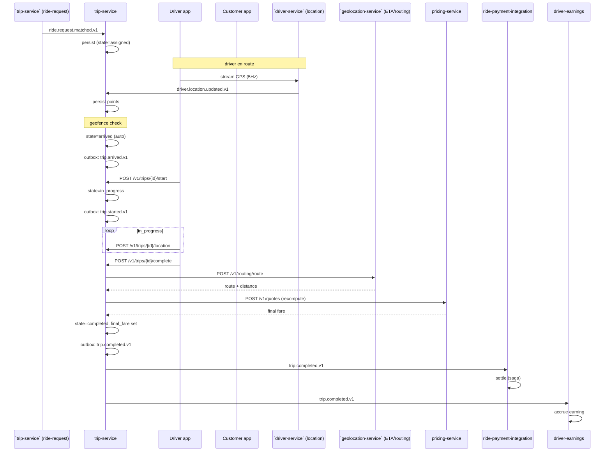
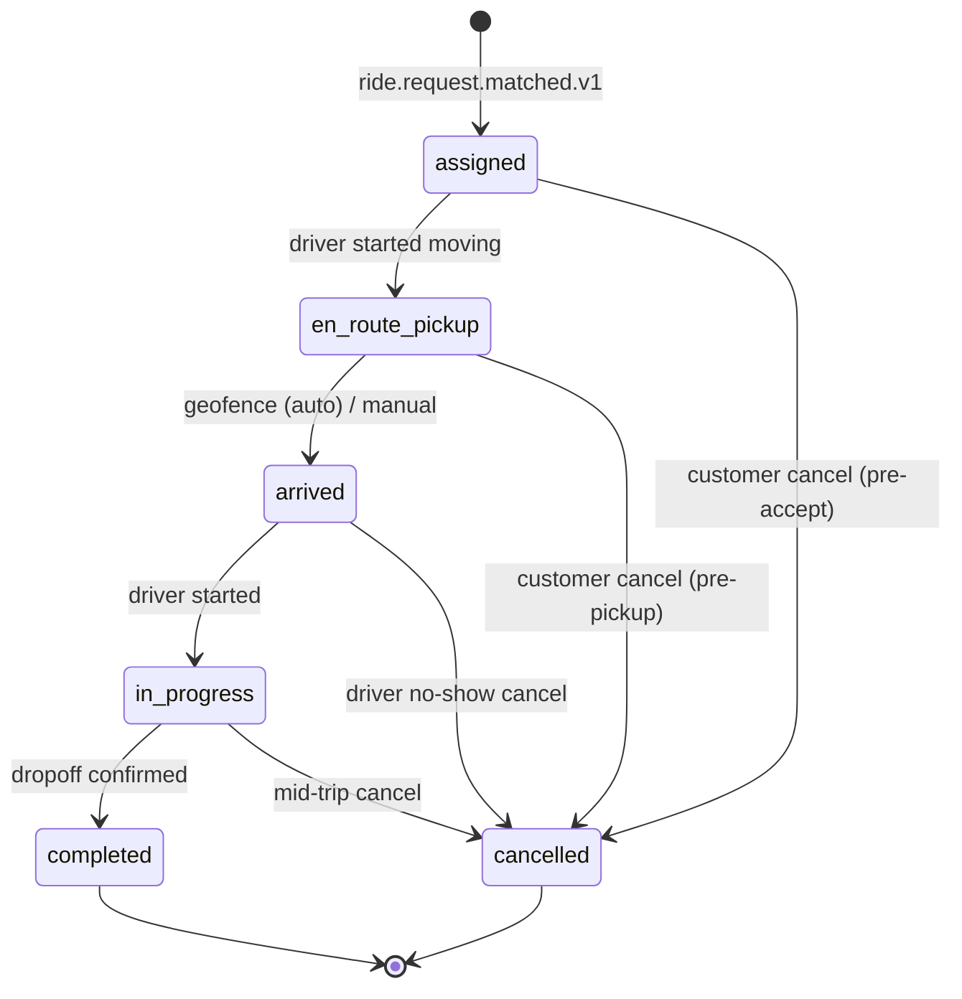
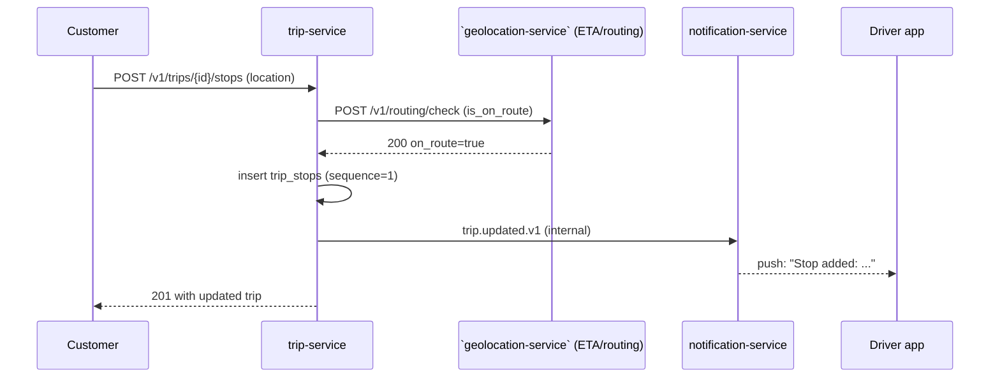
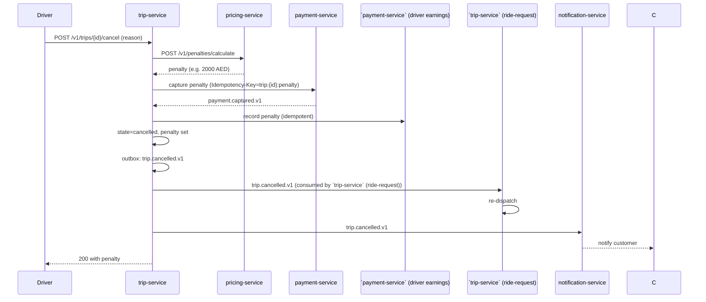
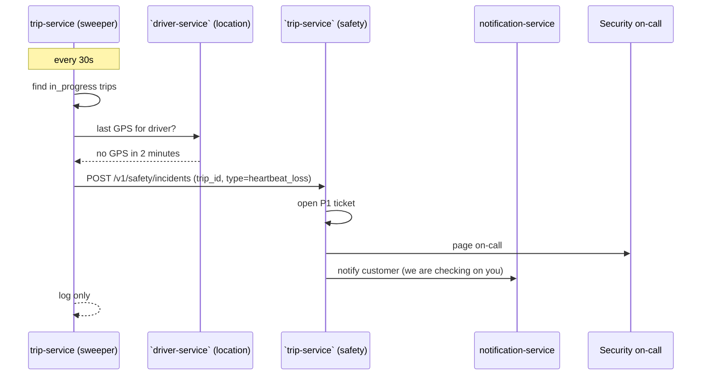
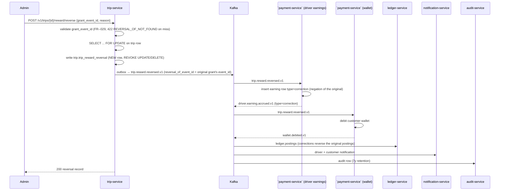

# trip-service — Workflows

## 1. Trip Lifecycle (Happy Path)

### 1.1 Objective

Move a trip through `assigned → en_route_pickup → arrived →
in_progress → completed` and emit the events that downstream services
react to (payment, earnings, history).

### 1.2 Initiating Actor

``trip-service` (ride-request)` emits `ride.request.matched.v1` to create the
trip. The driver app and customer app drive subsequent transitions.

### 1.3 Participating Services

- ``trip-service` (ride-request)` (event producer)
- `trip-service` (this service)
- ``driver-service` (location)` (event producer for tracking)
- ``geolocation-service` (ETA/routing)` (final fare)
- `pricing-service` (final fare)
- ``payment-service` (ride saga)` (event consumer on
  `trip.completed.v1`)
- ``payment-service` (driver earnings)` (event consumer)
- ``trip-service` / `food-order-service` / `search-service` (review projections)` (event consumer)
- ``trip-service` (history)` (event consumer)

### 1.4 Prerequisites

- The driver app is online and authenticated.
- The customer is in the trip's app session.
- The pickup geofence is configured for the zone.
- ``geolocation-service` (ETA/routing)` and `pricing-service` are reachable.

### 1.5 Happy Path



### 1.6 Alternate Paths

- **Auto-arrival fails (GPS noise)**: driver manually marks
  `arrive`; same transition.
- **Mid-trip stop add**: customer calls `POST /v1/trips/{id}/stops`;
  the `trip_stops` row is created; the recompute-fare rule applies
  on completion.
- **Mid-trip dropoff change**: customer calls
  `POST /v1/trips/{id}/dropoff`; the trip's `dropoff` is replaced
  (but `original_dropoff` is preserved for the recompute-fare
  rule).
- **Driver app crash mid-trip**: heartbeat detection in
  ``driver-service` (location)`; if no GPS in 2 minutes and no driver
  app ping in 5 minutes, open a P1 safety ticket.

### 1.7 Failure Paths

- **Customer cancels pre-pickup**: state `en_route_pickup →
  cancelled`; `trip.cancelled.v1` with `actor=customer`; no fee (the
  `trip-service` (ride-request) handles the cancellation fee; we just record
  the trip is gone).
- **Driver cancels in the early window**: state `assigned /
  en_route_pickup / arrived` (≤ 2 min after arrival) → `cancelled`;
  no penalty; `trip.cancelled.v1` with `actor=driver, penalty=null`.
- **Driver cancels after the early window**: penalty applied; we
  call `pricing-service` for the penalty, capture it (separately;
  see ``payment-service` (driver earnings)`), and emit `trip.cancelled.v1` with
  `actor=driver, penalty={...}`.
- **Customer no-show**: driver calls cancel with `reason=no_show`;
  no penalty; `trip.cancelled.v1` with `actor=no_show, no_show=true`.
- **ETA / Pricing service down at completion**: keep the trip
  `in_progress`; retry the recompute; alert if it doesn't complete
  in 60s.
- **Heartbeat loss**: see 1.6 alternate paths.

### 1.8 Business Rules

- Driver can cancel in `assigned`, `en_route_pickup`, `arrived`
  (within 2 minutes of arrival).
- Customer can cancel only in `assigned` or `en_route_pickup` (no
  cancel after pickup).
- Mid-trip: 1 add-stop, 1 dropoff change (within 5 km).
- Final fare: `clip(recomputed, quote × 0.95, quote × 1.05)`.

### 1.9 State Transitions



### 1.10 Events

| Event | Direction | When |
|-------|-----------|------|
| `trip.started.v1` | produced | `state=in_progress` |
| `trip.arrived.v1` | produced | `state=arrived` |
| `trip.completed.v1` | produced | `state=completed` |
| `trip.cancelled.v1` | produced | any `state=cancelled` |
| `trip.location.updated.v1` | produced | each accepted point (1Hz curated) |
| `ride.request.matched.v1` | consumed | create |
| `driver.location.updated.v1` | consumed | tracking + auto-arrival |
| `dispatch.arrived.v1` | consumed | informational |
| `configuration.updated.v1` | consumed | cache invalidation |

### 1.11 APIs Involved

| API | Direction | When |
|-----|-----------|------|
| `POST /v1/trips` | inbound | create (system) |
| `GET /v1/trips/{id}` | inbound | read |
| `GET /v1/trips/active` | inbound | active trip |
| `POST /v1/trips/{id}/arrive` | inbound | driver |
| `POST /v1/trips/{id}/start` | inbound | driver |
| `POST /v1/trips/{id}/location` | inbound | driver (high frequency) |
| `POST /v1/trips/{id}/stops` | inbound | customer |
| `POST /v1/trips/{id}/dropoff` | inbound | customer |
| `POST /v1/trips/{id}/complete` | inbound | driver |
| `POST /v1/trips/{id}/cancel` | inbound | driver / admin |
| `GET /v1/trips/{id}/track` | inbound | customer / driver / safety |
| `POST /v1/routing/route` | outbound | at completion |
| `POST /v1/quotes` | outbound | at completion |

### 1.12 Compensation / Rollback

- If the trip is created but `trip.completed.v1` fails to publish,
  the outbox retries. Reconciliation detects a completed trip with
  no consumer-side settle and opens a P1 ticket.
- If the recompute fare fails and the trip times out in
  `in_progress`, an operator can manually complete via admin API
  with a documented reason.
- If the heartbeat loss is a false positive (driver app recovered),
  the safety ticket is closed automatically; no trip rollback.

### 1.13 Final State

`completed` or `cancelled`. The trip row is retained for 7 years.
The location trail is dropped 2h after completion.

## 2. Mid-Trip Stop Add

### 2.1 Objective

Allow a customer to add one mid-trip stop without leaving the app or
re-quoting.

### 2.2 Initiating Actor

The customer app.

### 2.3 Participating Services

- `trip-service` (this service)
- `driver-service` (read for the driver's view; we don't push to
  the driver here — the driver app pulls)
- `notification-service` (notify driver)
- ``geolocation-service` (ETA/routing)` (re-quote ETA; we don't re-quote fare here)

### 2.4 Prerequisites

- The trip is in `in_progress`.
- The trip has no `trip_stops` row yet.
- The proposed stop is within 5 km of the current route
  (validated by the route service — we ask
  ``geolocation-service` (ETA/routing)` for the check).

### 2.5 Happy Path



### 2.6 Alternate Paths

- A stop already exists: 409 `STOP_ALREADY_ADDED`.
- Trip not in `in_progress`: 409 `STATE_INVALID`.

### 2.7 Failure Paths

- ETA check down: 503 `DEPENDENCY_TIMEOUT`; the customer is told
  to retry.

### 2.8 Business Rules

- One stop per trip.
- Must be within 5 km of the route.

### 2.9 State Transitions

`in_progress → in_progress` (no state change; the trip row gets a
`trip_stops` row).

### 2.10 Events

| Event | Direction | When |
|-------|-----------|------|
| (none published externally) | — | — |

### 2.11 APIs Involved

| API | Direction | When |
|-----|-----------|------|
| `POST /v1/trips/{id}/stops` | inbound | trigger |
| `POST /v1/routing/check` | outbound | validate |

### 2.12 Compensation / Rollback

If the stop insert succeeds but the driver app fails to receive the
push, the driver's polling on `GET /v1/trips/{id}` will see the
stop; no rollback needed.

### 2.13 Final State

Trip is still `in_progress`; the `trip_stops` row is present.

## 3. Driver Cancellation (After Early Window)

### 3.1 Objective

Allow a driver to cancel a trip in flight; apply the penalty; emit
the event so ``trip-service` (ride-request)` can re-dispatch and
``payment-service` (ride saga)` can settle the penalty.

### 3.2 Initiating Actor

The driver app, or an admin on the driver's behalf.

### 3.3 Participating Services

- `trip-service` (this service)
- `pricing-service` (penalty calc)
- `payment-service` (penalty capture; out of scope but called by
  `ride-payment-integration`)
- ``payment-service` (driver earnings)` (penalty posting)
- ``trip-service` (ride-request)` (re-dispatch)
- `notification-service` (notify customer)

### 3.4 Prerequisites

- The trip is in `assigned`, `en_route_pickup`, or `arrived`.
- The actor is the driver or admin.
- For `arrived`, the cancellation must be within 2 minutes of
  arrival.

### 3.5 Happy Path (After Early Window)



### 3.6 Alternate Paths

- Driver cancels in the early window: same flow, but `PRC` returns
  `amount_minor=0`; we record `penalty=null` and emit
  `trip.cancelled.v1` with `penalty=null`.

### 3.7 Failure Paths

- Pricing service down: 503 `DEPENDENCY_TIMEOUT`; the cancellation
  is rejected (the trip stays in its current state). The driver is
  told to retry.
- Payment service down: same; the cancellation is rejected; no
  state change.
- Penalty captured but trip commit failed: refund via
  `payment-service` with `Idempotency-Key=trip:{id}:penalty:refund`.

### 3.8 Business Rules

- Driver can cancel in `assigned`, `en_route_pickup`, or `arrived`
  (within 2 minutes of arrival).
- Penalty is city-configured.
- A successful cancellation always emits `trip.cancelled.v1`.

### 3.9 State Transitions

`* → cancelled` (from `assigned`, `en_route_pickup`, or `arrived`).

### 3.10 Events

| Event | Direction | When |
|-------|-----------|------|
| `trip.cancelled.v1` | produced | always |

### 3.11 APIs Involved

| API | Direction | When |
|-----|-----------|------|
| `POST /v1/trips/{id}/cancel` | inbound | trigger |
| `POST /v1/penalties/calculate` | outbound | penalty |
| `POST /v1/payments/charge` | outbound | capture penalty |

### 3.12 Compensation / Rollback

- If the penalty capture succeeded but the trip commit failed, we
  issue a refund with `Idempotency-Key=trip:{id}:penalty:refund`.
- If the trip commit succeeded but the event publish failed, the
  outbox retries. Reconciliation detects a cancelled trip with no
  `trip.cancelled.v1` after 1 minute and opens a P1 ticket.

### 3.13 Final State

`cancelled`. The `cancellation_penalty` column records the penalty
and the `payment_intent_id`.

## 4. Heartbeat Loss → P1 Safety Ticket

### 4.1 Objective

Detect a mid-trip incident (driver app crash, vehicle accident,
rider emergency) and open a P1 safety ticket so Trust & Safety can
intervene.

### 4.2 Initiating Actor

A background sweeper in this service, triggered by
``driver-service` (location)` and the driver-app heartbeat.

### 4.3 Participating Services

- `trip-service` (this service)
- ``driver-service` (location)` (no GPS signal)
- ``trip-service` (safety)` (P1 ticket)
- `notification-service` (try to reach the customer)

### 4.4 Prerequisites

- The trip is in `in_progress`.
- The sweeper is running on a 30s tick.

### 4.5 Happy Path (Detection)



### 4.6 Alternate Paths

- Driver app pings the trip in the meantime: the sweeper clears the
  flag; no ticket opened.
- The GPS resumes within 5 minutes: the sweeper clears the flag; no
  ticket opened.

### 4.7 Failure Paths

- ``trip-service` (safety)` down: retry; on persistent failure, page
  the on-call directly via PagerDuty.

### 4.8 Business Rules

- 2 minutes of no GPS AND 5 minutes of no driver-app heartbeat =
  open ticket.
- One ticket per trip per detection window (no duplicates within
  10 minutes).

### 4.9 State Transitions

No state change in the trip; the trip stays `in_progress`. The
ticket is owned by ``trip-service` (safety)`.

### 4.10 Events

| Event | Direction | When |
|-------|-----------|------|
| (no trip event) | — | — |

### 4.11 APIs Involved

| API | Direction | When |
|-----|-----------|------|
| `POST /v1/safety/incidents` | outbound | open ticket |

### 4.12 Compensation / Rollback

- If the driver recovers and the trip completes normally, the
  ticket is closed by Trust & Safety.
- If the customer is in real danger, Trust & Safety escalates to
  emergency services.

### 4.13 Final State

The trip continues (or is cancelled by Trust & Safety). The
location trail is preserved.

---

## 5. Guaranteed Rewards — Driver + User at Trip Completion

### 5.1 Objective

When a trip reaches `state=completed`, evaluate the reward
eligibility for both the driver and the user, persist the grant
decision in the same transaction as the trip completion, and emit
`trip.reward.granted.v1` so downstream services (``payment-service` (driver earnings)`,
``payment-service` (wallet)`, `ledger-service`, `notification-service`,
`audit-service`) can settle. The grant is **independent of payment
capture**: a trip that completed successfully is rewarded even if the
downstream payment capture fails (this is by design — see 13
exception BR--039 in the BRD).

### 5.2 Initiating Actor

`POST /v1/trips/{id}/complete` from the driver app; the corresponding
internal flow can also be re-driven by the admin re-evaluation
endpoint (`POST /v1/trips/{id}/reward/re-evaluate`).

### 5.3 Participating Services

- `trip-service` (this service, the grant owner)
- ``payment-service` (driver earnings)` (consumes `trip.reward.granted.v1`,
  accrues the driver top-up with idempotency-key
  `trip:{trip_id}:reward:driver:grant`)
- ``payment-service` (wallet)` (consumes `trip.reward.granted.v1`, credits the
  customer wallet when `trip.reward.user.kind = wallet_credit` — default)
- ``pricing-service` (loyalty rules) / `customer-service` (account)` (consumes `trip.reward.granted.v1`, accrues
  points when `trip.reward.user.kind = loyalty_points` — configurable
  per city)
- `ledger-service` (informational consumer)
- `notification-service` (driver + customer notice)
- `audit-service` (7-year retention)

### 5.4 Prerequisites

- The trip is in `state=in_progress` and the driver has called
  `POST /v1/trips/{id}/complete`.
- The reward config keys (`trip.reward.*`) have been loaded by
  `configuration.updated.v1`; cache miss falls back to the
  synchronous read (DEGRADABLE).
- ``payment-service` (driver earnings)` is reachable for the
  `GET /v1/drivers/{id}/period-eligible-earnings?window=hourly` (and
  `=daily`) call — critical path; CRITICAL class on the isolation
  table.

### 5.5 Happy Path

```mermaid
sequenceDiagram
    participant DR as Driver app
    participant TS as trip-service
    participant DE as `payment-service` (driver earnings)
    participant LOY as `pricing-service` (loyalty rules) / `customer-service` (account)
    participant WLT as `payment-service` (wallet)
    participant K as Kafka
    participant LD as ledger-service
    participant NOT as notification-service
    participant AUD as audit-service

    DR->>TS: POST /v1/trips/{id}/complete
    TS->>TS: validate state (in_progress only) — FR--010
    TS->>TS: snapshot reward config (FR--021)
    TS->>DE: GET /v1/drivers/{id}/period-eligible-earnings?window=hourly
    DE-->>TS: eligible_earnings_60min
    TS->>DE: GET /v1/drivers/{id}/period-eligible-earnings?window=daily
    DE-->>TS: eligible_earnings_24h
    TS->>TS: compute driver_per_trip_topup, hourly_topup, daily_topup, user_credit (FR--022..FR--026)
    TS->>TS: SELECT ... FOR UPDATE on trip row (same tx as outbox)
    TS->>TS: write trip.trip_reward (one row per kind, append-only)
    TS->>K: outbox → trip.reward.granted.v1 (FR--027)
    Note over TS,WLT: state=completed + outbox rows are atomic
    K->>DE: trip.reward.granted.v1 (driver line)
    DE-->>K: driver.earning.accrued.v1 (type=guaranteed_topup)
    K->>WLT: trip.reward.granted.v1 (user line)
    WLT-->>K: wallet.credited.v1 (when kind=wallet_credit)
    K->>LOY: trip.reward.granted.v1 (user line; when kind=loyalty_points)
    LOY-->>K: loyalty.points.earned.v1
    K->>LD: ledger.postings (informational; balances from DE/WLT)
    K->>NOT: driver + customer notification
    K->>AUD: audit row (7y retention)
    DR-->>DR: complete response
```

State diagram for the reward lifecycle:

```mermaid
stateDiagram-v2
    [*] --> pending_grant
    pending_grant --> granted: outbox published
    pending_grant --> superseded: admin re-evaluation (creates a new grant; the prior references via replaces_grant_id)
    granted --> reversed: trip.reward.reversed.v1
    reversed --> [*]
    superseded --> [*]
```



### 5.6 Alternate Paths

- **Driver ineligible** (fails any eligibility filter in FR--025):
  the trip is rewarded with zero, but `trip.reward.granted.v1` is
  still emitted with `decision_reason = "ineligible"` and an empty
  `grants[]`. This keeps the event stream per-trip-end single (no
  conditional emission).
- **Hourly / daily window insufficient**: only the per-trip top-up
  is granted; the period floor contributes `0`. The
  `decision_reason` distinguishes the cases.
- **User-side kind = `loyalty_points`**: the user line is routed to
  ``pricing-service` (loyalty rules) / `customer-service` (account)` instead of ``payment-service` (wallet)` (no wallet credit).
- **User-side kind = `none`** or the customer is suspended (after
  capture): no user line is emitted (or it is zero with
  `decision_reason = "user_ineligible"`).

### 5.7 Failure Paths

| Failure | Handling |
|---------|----------|
| ``payment-service` (driver earnings)` unreachable on the period-earnings call | retry once; CRITICAL failure → 503 `DEPENDENCY_UNAVAILABLE` after retry; the trip is still persisted as `completed` but the `decision_reason` field carries `pending_external_evidence` and the admin re-evaluation endpoint recovers later |
| ``payment-service` (wallet)` unreachable on a `wallet_credit` user reward | retry; CRITICAL after retry; admin re-evaluation recovers |
| ``pricing-service` (loyalty rules) / `customer-service` (account)` unreachable on a `loyalty_points` user reward | retry; CRITICAL after retry; admin re-evaluation recovers |
| Outbox publish failure | retry with backoff; DLQ after 3 |
| Concurrent re-evaluation by two admins | inbox dedup on `Idempotency-Key`; the second call returns the same response (no double-grant) |

### 5.8 Business Rules

- The grant is **per trip**, not per driver / user; multiple trips
  → multiple grants.
- The decision snapshot (`config_snapshot`) is captured at the time
  of the grant and never recomputed retroactively (BR--040).
- `trip.reward.driver.eligibility` filters apply; rewards cannot be
  granted if the driver is below the floor even if the city allows.
- The user-side credit is independent of the driver-side reward; a
  trip may have one without the other. The event payload carries
  both shapes in a single envelope.

### 5.9 Final State

For every `state=completed` trip, exactly one
`trip.reward.granted.v1` is emitted within 1 second (NFR--012), with
the same `trip_id` and a possibly-empty `grants[]`. Downstream
services persist their own balancing rows (the
`6200_customer_credit_liability` row in ``payment-service` (wallet)`,
the `6302_guaranteed_minimum` row in ``payment-service` (driver earnings)`) — all
append-only, mirroring `ledger.postings`.

---

## 6. Reward Reversal on Trip Correction

### 6.1 Objective

Reverse a previously-granted reward. Used by customer-support
refund flows, dispute resolution (e.g. captured-but-trip-wasn't-actual),
or admin corrections. The reversal event is `trip.reward.reversed.v1`,
the new row in `trip.trip_reward_reversal` is the authoritative
record; the original grant row in `trip.trip_reward` is **never
updated or deleted** (mirrors the reversal rule on
`ledger.postings`).

### 6.2 Initiating Actor

- Admin via `POST /v1/trips/{id}/reward/reverse` with `reason ≥ 8 chars`,
- The `driver.suspended.v1` or `customer.suspended.v1` handler (5
  eligibility filter; auto-reversal),
- A payment-capture failure path that meets a city-config threshold
  for guaranteed driver payments (deferred-capture mode; see BRD
  13).

### 6.3 Participating Services

- `trip-service` (this service, the reversal owner)
- ``payment-service` (driver earnings)` (consumes `trip.reward.reversed.v1`; posts
  a `correction` earning row; ref. README 3 "guaranteed_topup"
  accrual)
- ``payment-service` (wallet)` (consumes `trip.reward.reversed.v1`; debits the
  customer wallet)
- ``pricing-service` (loyalty rules) / `customer-service` (account)` (consumes `trip.reward.reversed.v1`; reverses the
  loyalty points when applicable)
- `ledger-service` (informational — the downstream postings ARE the
  ledger; this reversal aligns with the four-layer truth model)
- `notification-service` (driver + customer notice of reversal)
- `audit-service` (7-year retention of the reversal)

### 6.4 Prerequisites

- A prior `trip.reward.granted.v1` exists for the trip (`grants[]`
  non-empty, or a prior `reversal_of_event_id` chain).
- The admin caller has the `pricing.admin` scope (admin path), OR
  the suspension handler is firing (5.7).
- A `reason` is provided (admin path) — free text ≥ 8 chars per the
  CHECK constraint on `trip.trip_reward_reversal.reason`.

### 6.5 Happy Path



State transition for a reversal:

```mermaid
stateDiagram-v2
    granted --> reversal_pending: outbox trip.reward.reversed.v1
    reversal_pending --> reversed: downstream postings complete
    reversed --> reversal_pending: chained reversal (multi-grant; the envelope carries an array)
    reversed --> [*]
```



### 6.6 Alternate Paths

- **Multi-grant reversal**: a single reversal envelope carries
  `multi_reversal_of_ids: [...]` (UUID[]) for cases where several
  grants must be reversed together (e.g. driver + user in one
  administrative action).
- **Admin re-evaluation** (`POST /v1/trips/{id}/reward/re-evaluate`)
  instead of `reverse`: a new grant replaces the old in the same
  transaction; the old grant references the new via `replaces_grant_id`
  in the new row, and `trip.reward.granted.v1` is re-emitted (the
  reversal is implicit — single grant row "moved forward").
- **Replayed event from Kafka** (at-least-once delivery): the inbox
  dedupes by `event_id`; the downstream services treat the replay
  as a no-op (the row in `trip.trip_reward_reversal` already exists).

### 6.7 Failure Paths

| Failure | Handling |
|---------|----------|
| `grant_event_id` not found | 422 `REVERSAL_OF_NOT_FOUND`; no outbox write |
| `trip` not in `state=completed` or later | 409 `STATE_NOT_COMPLETED` |
| `reason` < 8 chars | 422 `REVERSAL_REASON_TOO_SHORT` |
| Outbox publish failure | retry; DLQ after 3 (the trip has a recorded reversal but the downstream is still pending) |
| Downstream service unreachable | retry; cron sweep that re-emits `trip.reward.reversed.v1` from `trip.trip_reward_reversal` rows older than 60s that have no downstream consumption mark (admin alerts if the gap is > 5 minutes) |

### 6.8 Business Rules

- A reversal is always a NEW row in `trip.trip_reward_reversal` and
  a NEW balanced posting — `UPDATE` / `DELETE` are forbidden via
  `REVOKE UPDATE, DELETE` on the table and a Postgres trigger on
  `ledger.postings` (mirrors the accounting four-layer truth model).
- Reversal reason is human-readable and ≥ 8 chars; it surfaces to
  the operator UI and is captured in the audit row.
- A reversal never partially cancels a multi-line grant; either the
  full grant is reversed, or a separate multi-grant reversal event
  is emitted.

### 6.9 Final State

For every reversal call, exactly one `trip.reward.reversed.v1` is
emitted within 300ms P95 (NFR--013), with the matching
`reversal_of_event_id` and a new balanced row in
`trip.trip_reward_reversal`. Downstream services (``payment-service` (driver earnings)`,
``payment-service` (wallet)`, ``pricing-service` (loyalty rules) / `customer-service` (account)`) persist their own balancing
rows. **No UPDATE or DELETE** on `trip.trip_reward` is permitted
and the Postgres trigger on `ledger.postings` blocks the same.

---

## See also

### Sibling docs for this service

- [`README.md`](./README.md) — purpose, bounded context, responsibilities
- [`BRD.md`](./BRD.md) — business requirements
- [`SRS.md`](./SRS.md) — functional + non-functional requirements
- [`ERD.md`](./ERD.md) — data model (entities, relationships)
- [`INTEGRATION.md`](./INTEGRATION.md) — inter-service contracts (APIs, events, sagas)
- [`WORKFLOWS.md`](./WORKFLOWS.md) — operational workflows (happy paths, failure modes)
- [`TECH.md`](./TECH.md) — technology profile (runtime, libraries, data layer, admin endpoints, RBAC)

### Workflows this service participates in

- [`../../workflows/RIDE_WORKFLOWS.md`](../../workflows/RIDE_WORKFLOWS.md) — end-to-end ride flows
- [`../../workflows/ACCOUNTING_WORKFLOWS.md`](../../workflows/ACCOUNTING_WORKFLOWS.md) — accounting view (guaranteed-reward settlement for driver + customer at trip completion; see "Guaranteed Rewards — Driver Top-Up + Customer Credit")

### Platform-wide

- [`../../shared/README.md`](../../shared/README.md) — `platform-spring-boot-starter` shared library (the single source of cross-cutting code for all Spring Boot services in the platform)
- [`../../shared/PLATFORM_BASELINE.md`](../../shared/PLATFORM_BASELINE.md) — single source for PostgreSQL 18, Kafka, Keycloak, Redis, OpenTelemetry, Vault, deployment, DR (do not restate these in this README)
- [`../../architecture/SERVICE_ISOLATION.md`](../../architecture/SERVICE_ISOLATION.md) — **how this service behaves when a downstream is down** (timeout / bulkhead / circuit / retry / fallback, by class: CRITICAL / DEGRADABLE / BEST-EFFORT)
- [`../../architecture/DOWNSTREAM_ERROR_CATALOG.md`](../../architecture/DOWNSTREAM_ERROR_CATALOG.md) — **canonical error-code catalog + propagation rules** (the `downstream` block, forward/translate/degrade/reject)
- [`../../architecture/EVENT_ARCHITECTURE.md`](../../architecture/EVENT_ARCHITECTURE.md) — event naming conventions (`<domain>.<entity>.<event>.v<N>` payload, `<domain>.<entity>.<event>` topic, partition keys, outbox/inbox, DLQ) — relevant for the new `trip.reward.granted.v1` and `trip.reward.reversed.v1` events
- [`../RECOMMENDATIONS.md`](../RECOMMENDATIONS.md) — platform-wide technology map (language, framework, version baseline, admin/RBAC pattern)
- [`../../README.md`](../../README.md) — services overview (the catalog of all 20 services)
- [`../../../main.md`](../../../main.md) — top-level platform specification (architecture, Keycloak, PostgreSQL 18, messaging, observability baseline)
- [`../RECOMMENDATIONS.md`](../RECOMMENDATIONS.md) — platform-wide technology map (language, framework, version baseline, admin/RBAC pattern)
- [`../../README.md`](../../README.md) — services overview (the catalog of all 20 services)
- [`../../../main.md`](../../../main.md) — top-level platform specification (architecture, Keycloak, PostgreSQL 18, messaging, observability baseline)

