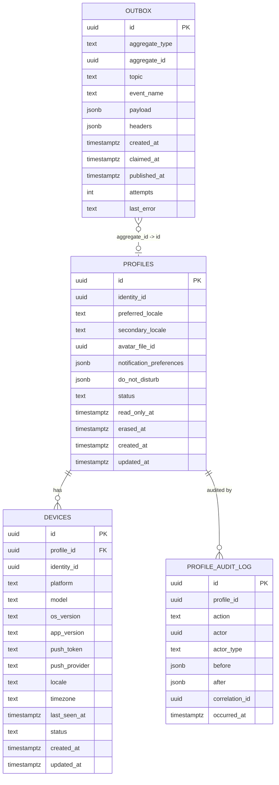

# user-profile-service — Entity-Relationship Diagram

## 1. Database

- **Engine**: PostgreSQL 18.
- **Schema**: `user_profile`.
- **Migrations**: `services/user-profile-service/migrations/`
  (versioned, forward-only, golang-migrate).

## 2. Cross-Service References

| Column | Type | Refers to | Source of truth |
|--------|------|-----------|------------------|
| `identity_id` (in `profiles`) | UUID | `Identity` in `identity-service` | `identity-service` |
| `avatar_file_id` (in `profiles`) | UUID | `File` in `file-service` | `file-service` |

Both are stored as UUID columns WITHOUT database FKs.

## 3. Entities

### `profiles`

The platform's common user data. One row per user.

#### Columns

| Column | Type | Constraints | Notes |
|--------|------|-------------|-------|
| `id` | UUID | PK | UUIDv7 |
| `identity_id` | UUID | NOT NULL, UNIQUE | cross-service reference |
| `preferred_locale` | TEXT | NOT NULL DEFAULT 'en-US' | BCP-47 |
| `secondary_locale` | TEXT | NULL | BCP-47 |
| `avatar_file_id` | UUID | NULL | cross-service ref to `file-service` |
| `notification_preferences` | JSONB | NOT NULL DEFAULT '{}' | per-topic, per-channel opt-in |
| `do_not_disturb` | JSONB | NULL | `{start: "22:00", end: "07:00", tz: "Asia/Riyadh"}` |
| `status` | TEXT | NOT NULL DEFAULT 'active' | `active` / `read_only` / `read_only_permanent` / `erased` |
| `read_only_at` | TIMESTAMPTZ | NULL | when read-only was set |
| `read_only_reason` | TEXT | NULL | `suspended` / `disabled` |
| `erased_at` | TIMESTAMPTZ | NULL | when GDPR-erased |
| `row_version` | BIGINT | NOT NULL DEFAULT 1 | optimistic-lock |
| `created_at` | TIMESTAMPTZ | NOT NULL DEFAULT now() | audit |
| `updated_at` | TIMESTAMPTZ | NOT NULL DEFAULT now() | audit |
| `created_by` | UUID | NOT NULL | identity |
| `updated_by` | UUID | NOT NULL | identity |
| `deleted_at` | TIMESTAMPTZ | NULL | soft delete |

#### Indexes

- PK on `id`.
- UNIQUE on `identity_id` (partial, `WHERE deleted_at IS NULL`).
- Index on `status` (partial, `WHERE status <> 'active'`).

#### Constraints

- CHECK: `status IN ('active', 'read_only', 'read_only_permanent', 'erased')`.
- CHECK: `read_only_reason IS NULL OR read_only_reason IN ('suspended', 'disabled')`.

### `devices`

The user's registered devices. Multiple rows per user.

#### Columns

| Column | Type | Constraints | Notes |
|--------|------|-------------|-------|
| `id` | UUID | PK | UUIDv7 |
| `profile_id` | UUID | NOT NULL | FK to `profiles.id` |
| `identity_id` | UUID | NOT NULL | cross-service ref (denormalized for fast lookup) |
| `platform` | TEXT | NOT NULL | `ios` / `android` / `web` |
| `model` | TEXT | NULL | e.g. `iPhone15,2` |
| `os_version` | TEXT | NULL | e.g. `iOS 17.4` |
| `app_version` | TEXT | NULL | e.g. `5.42.0` |
| `push_token` | TEXT | NULL (column-level encrypted) | provider-specific token |
| `push_provider` | TEXT | NULL | `apns` / `fcm` / `webpush` |
| `locale` | TEXT | NULL | device locale (BCP-47) |
| `timezone` | TEXT | NULL | IANA timezone |
| `last_seen_at` | TIMESTAMPTZ | NULL | when the device last hit the platform |
| `status` | TEXT | NOT NULL DEFAULT 'active' | `active` / `revoked` / `erased` |
| `row_version` | BIGINT | NOT NULL DEFAULT 1 | optimistic-lock |
| `created_at` | TIMESTAMPTZ | NOT NULL DEFAULT now() | audit |
| `updated_at` | TIMESTAMPTZ | NOT NULL DEFAULT now() | audit |
| `created_by` | UUID | NOT NULL | identity |
| `updated_by` | UUID | NOT NULL | identity |
| `deleted_at` | TIMESTAMPTZ | NULL | soft delete |

#### Indexes

- PK on `id`.
- Index on `profile_id` (active devices only).
- Index on `identity_id` (active devices only).
- UNIQUE on `(identity_id, push_token)` (partial,
  `WHERE push_token IS NOT NULL AND deleted_at IS NULL`).
- Index on `last_seen_at` (for the inactivity job).

#### Constraints

- CHECK: `platform IN ('ios', 'android', 'web')`.
- CHECK: `push_provider IS NULL OR push_provider IN
  ('apns', 'fcm', 'webpush')`.
- CHECK: `status IN ('active', 'revoked', 'erased')`.

### `profile_audit_log`

Append-only audit of every state change. Immutable.

#### Columns

| Column | Type | Constraints | Notes |
|--------|------|-------------|-------|
| `id` | UUID | PK | UUIDv7 |
| `profile_id` | UUID | NOT NULL | FK to `profiles.id` |
| `action` | TEXT | NOT NULL | `create` / `update` / `device_add` / `device_remove` / `read_only` / `erase` |
| `actor` | UUID | NULL | the actor's `identity_id` |
| `actor_type` | TEXT | NOT NULL | `user` / `admin` / `service` / `system` |
| `before` | JSONB | NULL | snapshot before |
| `after` | JSONB | NULL | snapshot after |
| `correlation_id` | UUID | NULL | request correlation id |
| `occurred_at` | TIMESTAMPTZ | NOT NULL DEFAULT now() | when the action happened |

#### Constraints

- No `UPDATE` or `DELETE` on this table (enforced by a
  trigger).
- Retention 7 years.

### `outbox`

Outbox table for the outbox pattern.

#### Columns

| Column | Type | Constraints | Notes |
|--------|------|-------------|-------|
| `id` | UUID | PK | UUIDv7; the `event_id` |
| `aggregate_type` | TEXT | NOT NULL | e.g. `UserProfile` |
| `aggregate_id` | UUID | NOT NULL | `profile_id` |
| `topic` | TEXT | NOT NULL | Kafka topic name |
| `event_name` | TEXT | NOT NULL | e.g. `user.profile.updated.v1` |
| `payload` | JSONB | NOT NULL | event envelope |
| `headers` | JSONB | NOT NULL DEFAULT '{}' | Kafka headers |
| `created_at` | TIMESTAMPTZ | NOT NULL DEFAULT now() | when written |
| `claimed_at` | TIMESTAMPTZ | NULL | when the poller picked it up |
| `published_at` | TIMESTAMPTZ | NULL | when Kafka acked |
| `attempts` | INT | NOT NULL DEFAULT 0 | retry counter |
| `last_error` | TEXT | NULL | last error message |

#### Indexes

- PK on `id`.
- Index on `(published_at, created_at)` where
  `published_at IS NULL`.
- Index on `aggregate_id`.

## 4. Mermaid ER Diagram



## 5. DDL Sketch

```sql
CREATE SCHEMA IF NOT EXISTS user_profile;

CREATE TABLE user_profile.profiles (
    id UUID PRIMARY KEY,
    identity_id UUID NOT NULL,
    preferred_locale TEXT NOT NULL DEFAULT 'en-US',
    secondary_locale TEXT,
    avatar_file_id UUID,
    notification_preferences JSONB NOT NULL DEFAULT '{}'::jsonb,
    do_not_disturb JSONB,
    status TEXT NOT NULL DEFAULT 'active',
    read_only_at TIMESTAMPTZ,
    read_only_reason TEXT,
    erased_at TIMESTAMPTZ,
    row_version BIGINT NOT NULL DEFAULT 1,
    created_at TIMESTAMPTZ NOT NULL DEFAULT now(),
    updated_at TIMESTAMPTZ NOT NULL DEFAULT now(),
    created_by UUID NOT NULL,
    updated_by UUID NOT NULL,
    deleted_at TIMESTAMPTZ,
    CONSTRAINT profiles_status_check
        CHECK (status IN ('active','read_only','read_only_permanent','erased')),
    CONSTRAINT profiles_read_only_reason_check
        CHECK (read_only_reason IS NULL OR read_only_reason IN ('suspended','disabled'))
);

CREATE UNIQUE INDEX profiles_identity_id_uniq
    ON user_profile.profiles (identity_id)
    WHERE deleted_at IS NULL;

CREATE INDEX profiles_status_idx
    ON user_profile.profiles (status)
    WHERE status <> 'active';

CREATE TABLE user_profile.devices (
    id UUID PRIMARY KEY,
    profile_id UUID NOT NULL REFERENCES user_profile.profiles(id),
    identity_id UUID NOT NULL,
    platform TEXT NOT NULL,
    model TEXT,
    os_version TEXT,
    app_version TEXT,
    push_token TEXT,
    push_provider TEXT,
    locale TEXT,
    timezone TEXT,
    last_seen_at TIMESTAMPTZ,
    status TEXT NOT NULL DEFAULT 'active',
    row_version BIGINT NOT NULL DEFAULT 1,
    created_at TIMESTAMPTZ NOT NULL DEFAULT now(),
    updated_at TIMESTAMPTZ NOT NULL DEFAULT now(),
    created_by UUID NOT NULL,
    updated_by UUID NOT NULL,
    deleted_at TIMESTAMPTZ,
    CONSTRAINT devices_platform_check
        CHECK (platform IN ('ios','android','web')),
    CONSTRAINT devices_push_provider_check
        CHECK (push_provider IS NULL OR push_provider IN ('apns','fcm','webpush')),
    CONSTRAINT devices_status_check
        CHECK (status IN ('active','revoked','erased'))
);

CREATE INDEX devices_profile_id_idx
    ON user_profile.devices (profile_id)
    WHERE deleted_at IS NULL;

CREATE INDEX devices_identity_id_idx
    ON user_profile.devices (identity_id)
    WHERE deleted_at IS NULL;

CREATE UNIQUE INDEX devices_push_token_uniq
    ON user_profile.devices (identity_id, push_token)
    WHERE push_token IS NOT NULL AND deleted_at IS NULL;

CREATE INDEX devices_last_seen_at_idx
    ON user_profile.devices (last_seen_at)
    WHERE deleted_at IS NULL;

CREATE TABLE user_profile.profile_audit_log (
    id UUID PRIMARY KEY,
    profile_id UUID NOT NULL REFERENCES user_profile.profiles(id),
    action TEXT NOT NULL,
    actor UUID,
    actor_type TEXT NOT NULL,
    before JSONB,
    after JSONB,
    correlation_id UUID,
    occurred_at TIMESTAMPTZ NOT NULL DEFAULT now()
);

CREATE TRIGGER profile_audit_log_no_update
    BEFORE UPDATE OR DELETE ON user_profile.profile_audit_log
    FOR EACH STATEMENT EXECUTE FUNCTION raise_exception();

CREATE TABLE user_profile.outbox (
    id UUID PRIMARY KEY,
    aggregate_type TEXT NOT NULL,
    aggregate_id UUID NOT NULL,
    topic TEXT NOT NULL,
    event_name TEXT NOT NULL,
    payload JSONB NOT NULL,
    headers JSONB NOT NULL DEFAULT '{}'::jsonb,
    created_at TIMESTAMPTZ NOT NULL DEFAULT now(),
    claimed_at TIMESTAMPTZ,
    published_at TIMESTAMPTZ,
    attempts INT NOT NULL DEFAULT 0,
    last_error TEXT
);

CREATE INDEX outbox_unpublished_idx
    ON user_profile.outbox (created_at)
    WHERE published_at IS NULL;

CREATE INDEX outbox_aggregate_id_idx
    ON user_profile.outbox (aggregate_id);
```

## 6. Audit Columns

Every mutable table has `created_at`, `updated_at`,
`created_by`, `updated_by`. The `profiles` and `devices`
tables also have `row_version` for optimistic locking.
The `profile_audit_log` is the source of truth for
audit; every state change writes there AND emits the
corresponding `user.profile.*.v1` or
`user.device.*.v1` event.

## 7. Soft Delete

- The `profiles` and `devices` tables use soft delete
  (`deleted_at`).
- Soft delete is performed on GDPR erasure and on
  device inactivity.

## 8. JSONB Usage

- `profiles.notification_preferences` — per-topic,
  per-channel opt-in. Shape:
  `{"marketing": {"push": true, "email": false, "sms": false},
  "transactional": {"push": true, "email": true, "sms": false}}`.
  Validated on write.
- `profiles.do_not_disturb` — `{start, end, tz}`.
  Validated on write.
- `profile_audit_log.before` / `after` — snapshots.
- `outbox.payload` / `outbox.headers` — event envelope.

## 9. Partitioning

No table is partitioned; their volume does not warrant
it.

## 10. Data Retention

| Table | Retention | Purged by |
|-------|-----------|-----------|
| `profiles` | until erasure + 1 year (tombstone) | background job |
| `devices` | until user erases; or `idle_unregister_days` of inactivity | nightly job |
| `profile_audit_log` | 7 years (audit) | background job after 7 years |
| `outbox` | 24 h after `published_at` | background job |

## 11. Migration Considerations

- Adding a new field to `notification_preferences`:
  add the field with a default; old rows read back the
  default. Backward-compatible.
- Renaming a `preferred_locale` value: deprecated
  alias stored alongside; old code path reads the
  alias; new code reads the new value. Drop after a
  deprecation window.
- Schema changes that affect the API: a major API
  version bump; the `INTEGRATION.md` is updated
  first.
- Cross-service references (`identity_id`,
  `avatar_file_id`) are added as nullable columns;
  the back-channel consumer
  (`identity.user.created.v1`) populates them.

---

## See also

### Sibling docs for this service

- [`README.md`](./README.md) — purpose, bounded context, responsibilities
- [`BRD.md`](./BRD.md) — business requirements
- [`SRS.md`](./SRS.md) — functional + non-functional requirements
- [`ERD.md`](./ERD.md) — data model (entities, relationships)
- [`INTEGRATION.md`](./INTEGRATION.md) — inter-service contracts (APIs, events, sagas)
- [`WORKFLOWS.md`](./WORKFLOWS.md) — operational workflows (happy paths, failure modes)
- [`TECH.md`](./TECH.md) — technology profile (runtime, libraries, data layer, admin endpoints, RBAC)

### Platform-wide

- [`../../shared/README.md`](../../shared/README.md) — `platform-spring-boot-starter` shared library (the single source of cross-cutting code for all Spring Boot services in the platform)
- [`../RECOMMENDATIONS.md`](../RECOMMENDATIONS.md) — platform-wide technology map (language, framework, version baseline, admin/RBAC pattern)
- [`../../README.md`](../../README.md) — services overview (the catalog of all 58 services)
- [`../../../main.md`](../../../main.md) — top-level platform specification (architecture, Keycloak, PostgreSQL 18, messaging, observability baseline)

