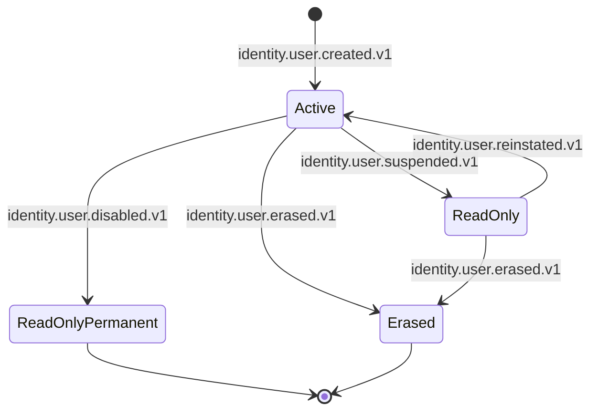

# user-profile-service — Software Requirements Specification

## 1. Introduction

This document specifies the software behavior, contracts, and
non-functional requirements of the `user-profile-service`.
The service is the platform's single source of truth for
common user data (language preferences, notification
preferences, device list, avatar reference) across all
personas.

## 2. Scope

**In scope:**

- Language preferences (BCP-47; primary + secondary).
- Notification preferences (per channel, per topic).
- Device list (platform, model, OS, push token, last-seen).
- Avatar reference (file_id in `file-service`).
- Read-only mode on suspension / disable.
- Anonymization on erasure.
- i18n catalogs and AR/RTL support.
- Event emission (`user.profile.*.v1`,
  `user.device.*.v1`).

**Out of scope:**

- Persona-specific profile data.
- Notification delivery.
- File storage.
- Push token validation.
- Authentication.

## 3. System Context

```mermaid
flowchart LR
    IS[identity-service]
    KAFKA[(Kafka)]
    ISV[identity-service (REST)]
    FS[file-service]
    USV[user-profile-service]
    DB[(PostgreSQL schema: user_profile)]
    REDIS[(Redis)]
    NOT[notification-service]
    CS[customer-service]
    DRV[driver-service]
    COS[courier-service]
    MER[merchant-service]
    ADM[admin-service]
    AUD[audit-service]
    ANA[analytics-service]
    CFG[configuration-service]

    IS -->|identity.*.v1| KAFKA
    KAFKA --> USV
    CFG -->|configuration.updated.v1| KAFKA
    KAFKA --> USV
    USV --> DB
    USV --> REDIS
    USV --> ISV
    USV --> FS
    USV -->|user.profile.*.v1, user.device.*.v1| KAFKA
    KAFKA --> NOT
    KAFKA --> CS
    KAFKA --> DRV
    KAFKA --> COS
    KAFKA --> MER
    KAFKA --> AUD
    KAFKA --> ANA
    ADM --> USV
```

## 4. Actors

- **Customer / driver / courier / merchant staff** (human) —
  manage their own profile.
- **Internal admin** (human) — admin actions.
- **Identity service** (system) — emits lifecycle events.
- **Notification service** (system) — reads preferences.
- **File service** (system) — avatar storage.
- **Persona services** (system) — read avatar, locale.

## 5. Functional Requirements

| ID | Requirement | Priority |
|----|-------------|----------|
| FR--001 | Provide `GET /v1/profiles/{identity_id}` returning the profile. | MUST |
| FR--002 | Provide `POST /v1/profiles/{identity_id}` to create a profile (idempotent on `identity_id`). | MUST |
| FR--003 | Provide `PATCH /v1/profiles/{identity_id}` to update preferences. | MUST |
| FR--004 | Provide `GET /v1/profiles/{identity_id}/devices` listing devices. | MUST |
| FR--005 | Provide `POST /v1/profiles/{identity_id}/devices` to register a device. | MUST |
| FR--006 | Provide `PATCH /v1/profiles/{identity_id}/devices/{device_id}` to update push token / last-seen. | MUST |
| FR--007 | Provide `DELETE /v1/profiles/{identity_id}/devices/{device_id}` to unregister. | MUST |
| FR--008 | Provide `GET /v1/profiles/{identity_id}/notification-preferences`. | MUST |
| FR--009 | Provide `PUT /v1/profiles/{identity_id}/notification-preferences` to set prefs. | MUST |
| FR--010 | Provide `POST /v1/profiles/{identity_id}/avatar` to upload avatar (delegated to `file-service`). | MUST |
| FR--011 | Consume `identity.user.created.v1` to back-fill a profile. | MUST |
| FR--012 | Consume `identity.user.updated.v1` to refresh cached claims. | MUST |
| FR--013 | Consume `identity.user.suspended.v1` to set `read_only`. | MUST |
| FR--014 | Consume `identity.user.disabled.v1` to set `read_only` permanently. | MUST |
| FR--015 | Consume `identity.user.reinstated.v1` to clear `read_only`. | MUST |
| FR--016 | Consume `identity.user.erased.v1` to anonymize the row. | MUST |
| FR--017 | Emit `user.profile.updated.v1` on any change. | MUST |
| FR--018 | Emit `user.profile.erased.v1` on anonymization. | MUST |
| FR--019 | Emit `user.device.added.v1` on device registration. | MUST |
| FR--020 | Emit `user.device.removed.v1` on device unregistration. | MUST |
| FR--021 | All writes use the outbox pattern. | MUST |
| FR--022 | All non-idempotent POSTs require an `Idempotency-Key` header. | MUST |
| FR--023 | Nightly job auto-removes devices inactive for `idle_unregister_days`. | SHOULD |
| FR--024 | Support a "do not disturb" window per user. | MAY |
| FR--025 | Support org-wide default notification preferences. | SHOULD |

## 6. Non-Functional Requirements

| ID | Category | Requirement | Target |
|----|----------|-------------|--------|
| NFR--001 | availability | monthly uptime | 99.9% |
| NFR--002 | performance | P99 read latency | ≤ 100 ms |
| NFR--003 | performance | P99 write latency | ≤ 500 ms |
| NFR--004 | scalability | concurrent reads per replica | ≥ 2,000 |
| NFR--005 | scalability | horizontal scale | 2 → 20 replicas per region |
| NFR--006 | maintainability | MTTR | ≤ 15 min median |
| NFR--007 | reliability | outbox publish lag P99 | ≤ 5 s |
| NFR--008 | reliability | event loss | 0 |
| NFR--009 | i18n | AR/RTL support | yes, from day one |
| NFR--010 | compliance | GDPR erasure SLA | 100% within 60 s |

## 7. API Requirements

All endpoints follow `architecture/API_STANDARDS.md`. The
self-service endpoints accept the gateway-validated JWT
(the gateway injects `X-User-Id` = `identity_id`). Service
endpoints accept `client_credentials` tokens. The full
contract is in `INTEGRATION.md`.

## 8. Data Requirements

| ID | Requirement | Notes |
|----|-------------|-------|
| DATA--001 | The service MUST own the `user_profile` schema. | One writer. |
| DATA--002 | Primary keys MUST be UUIDv7. | Time-ordered. |
| DATA--003 | The `identity_id` cross-service reference MUST be stored as a UUID column WITHOUT database FK. | Consistency strategy. |
| DATA--004 | Push tokens MUST be column-level encrypted. | Privacy. |
| DATA--005 | Audit columns (`created_at`, `updated_at`, `created_by`, `updated_by`) MUST be present on every mutable table. | Standard. |
| DATA--006 | Soft delete (`deleted_at`) MUST be used for profiles and devices. | GDPR / hygiene. |
| DATA--007 | The `outbox` table MUST be present and used. | At-least-once. |

(Full schema in `ERD.md`.)

## 9. Validation Rules

- `preferred_locale` MUST be a BCP-47 code in
  `user_profile.supported_locales`; otherwise fallback
  to `user_profile.default_locale`.
- A device push token MUST be a non-empty string ≤ 4096
  chars.
- Avatar MIME MUST be in
  `user_profile.avatar.allowed_mime`.
- Avatar size MUST be ≤ `user_profile.avatar.max_size_bytes`.
- The number of devices per user MUST NOT exceed
  `user_profile.devices.max_per_user`.
- A `PATCH /v1/profiles/{id}` on a `read_only` profile
  MUST be rejected with 403 `PROFILE_READ_ONLY`.

## 10. State Transitions



## 11. Authorization Requirements

- All endpoints require a JWT bearer token.
- Self-service endpoints require the `identity_id` in
  the path to match the token's `sub` (gateway-injected
  `X-User-Id`); otherwise 403 `FORBIDDEN`.
- Cross-user reads (e.g. persona service rendering a
  profile header) require the
  `user-profile.read.any` admin scope.
- Admin endpoints require the `user-profile.admin` realm
  role on `platform-internal`.

## 12. Configuration Requirements

Listed in `README.md` §13.

## 13. Error Handling

| Condition | Response |
|-----------|----------|
| Unknown identity | 404 `NOT_FOUND` |
| `read_only` profile | 403 `PROFILE_READ_ONLY` |
| Unsupported locale | 200 with fallback locale (no error) |
| Avatar too large | 413 `PAYLOAD_TOO_LARGE` |
| Avatar wrong MIME | 415 `UNSUPPORTED_MEDIA_TYPE` |
| Too many devices | 409 `DEVICE_LIMIT_REACHED` |
| Idempotency key reused with different body | 422 `IDEMPOTENCY_KEY_REUSED` |
| `identity-service` unreachable on read | degrade to cache; 200 (stale) |
| `file-service` unreachable on avatar upload | 502 `DEPENDENCY_UPSTREAM_FAILURE` |

## 14. Concurrency Requirements

- The `profiles` row has an optimistic-lock version
  (`row_version`).
- The outbox poller is single-writer per replica via a
  Postgres advisory lock.

## 15. Idempotency Requirements

- All non-idempotent POSTs require an `Idempotency-Key`.
- The service stores `(actor, idempotency_key,
  request_hash, response_status, response_body,
  expires_at)` for 24 h.

## 16. Performance

- **Dominant path**: profile read by `identity_id` (PK
  index hit) → return row. P99 ≤ 100 ms.
- Hot DB query: `SELECT * FROM user_profile.profiles
  WHERE identity_id = $1`.
- Cache: Redis claim hot-cache TTL 600 s; hit ratio
  ≥ 90% target.

## 17. Scalability

- **Horizontal**: stateless beyond PostgreSQL + Redis +
  Kafka.
- **Vertical**: 500m vCPU / 512 MiB default; can scale
  to 1 vCPU / 1 GiB.
- **HPA**: CPU 60% target; custom metric
  `user_profile_lookups_per_second` (target 2k/replica).

## 18. Availability

- **SLO**: 99.9% per 30d.
- **Error budget**: ~44 min / 30d.
- **Maintenance window**: none planned; rolling deploys.

## 19. Security

| ID | Requirement | Notes |
|----|-------------|-------|
| SEC--001 | All endpoints require a JWT bearer token. | Self or service. |
| SEC--002 | Self-service endpoints enforce `identity_id == X-User-Id`. | Gateway-injected header. |
| SEC--003 | Push tokens are column-level encrypted. | Privacy. |
| SEC--004 | No PII is logged in production. | Defense in depth. |
| SEC--005 | Anonymization on erasure preserves `identity_id`. | Soft delete + tombstone. |
| SEC--006 | mTLS in cluster. | Network-layer identity. |

## 20. Privacy

- Stored data: `preferred_locale` (not PII),
  `notification_preferences` (privacy-sensitive),
  `devices` (push tokens, last-seen, platform
  metadata).
- Encryption: column-level for push tokens.
- Retention: until erasure + 1 year for the
  `identity_id` tombstone; devices auto-removed
  after `idle_unregister_days` of inactivity.
- Erasure: `identity.user.erased.v1` causes the
  service to anonymize the row and clear devices.
- Logs do not contain PII in production.

## 21. Auditability

- Every state-changing action emits the corresponding
  `user.profile.*.v1` or `user.device.*.v1` event.
- The `user_profile.profile_audit_log` table is
  append-only and immutable.
- Retention: 7 years.

## 22. Observability

- **Logs**: JSON to stdout; fields listed in
  `README.md` §15.
- **Metrics**: RED per endpoint + business metrics
  listed in `README.md` §15.
- **Traces**: OpenTelemetry. Sample 100% on errors,
  10% on success.
- **Alerts**: SLO burn-rate; cache hit ratio; outbox
  lag; erasure lag.

## 23. Maintainability

- **Code style**: TypeScript (ESLint + Prettier).
- **Test coverage**: ≥ 85% overall, 100% on
  anonymization path.
- **Documentation**: this folder + the platform's
  i18n guide.

## 24. Disaster Recovery

- **RPO**: ≤ 5 min (WAL streaming + 7-day PITR).
- **RTO**: ≤ 30 min (warm standby).

## 25. Acceptance Criteria

- An `identity.user.created.v1` event results in a
  `user_profile.profiles` row within 5 seconds.
- A `PATCH /v1/profiles/{id}` updates the row and
  emits `user.profile.updated.v1` within 1 second.
- A `POST /v1/profiles/{id}/devices` registers the
  device and emits `user.device.added.v1`.
- An `identity.user.erased.v1` event results in PII
  redaction and `user.profile.erased.v1` emitted
  within 60 seconds.
- A suspended user's `PATCH /v1/profiles/{id}` returns
  `403 PROFILE_READ_ONLY`.
- An `Accept-Language: ar-SA` request is served with
  Arabic strings where the catalog has a translation.
- The avatar `file_id` is in `file-service`; this
  service only stores the reference.
- AR/RTL locales render correctly in mobile and web.

---

## See also

### Sibling docs for this service

- [`README.md`](./README.md) — purpose, bounded context, responsibilities
- [`BRD.md`](./BRD.md) — business requirements
- [`SRS.md`](./SRS.md) — functional + non-functional requirements
- [`ERD.md`](./ERD.md) — data model (entities, relationships)
- [`INTEGRATION.md`](./INTEGRATION.md) — inter-service contracts (APIs, events, sagas)
- [`WORKFLOWS.md`](./WORKFLOWS.md) — operational workflows (happy paths, failure modes)
- [`TECH.md`](./TECH.md) — technology profile (runtime, libraries, data layer, admin endpoints, RBAC)

### Platform-wide

- [`../../shared/README.md`](../../shared/README.md) — `platform-spring-boot-starter` shared library (the single source of cross-cutting code for all Spring Boot services in the platform)
- [`../RECOMMENDATIONS.md`](../RECOMMENDATIONS.md) — platform-wide technology map (language, framework, version baseline, admin/RBAC pattern)
- [`../../README.md`](../../README.md) — services overview (the catalog of all 58 services)
- [`../../../main.md`](../../../main.md) — top-level platform specification (architecture, Keycloak, PostgreSQL 18, messaging, observability baseline)

