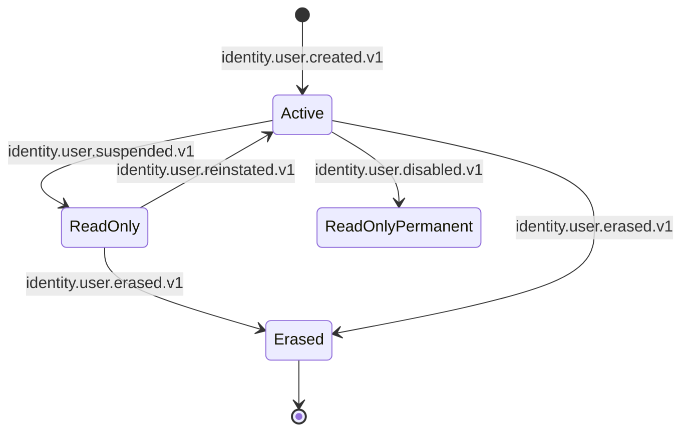
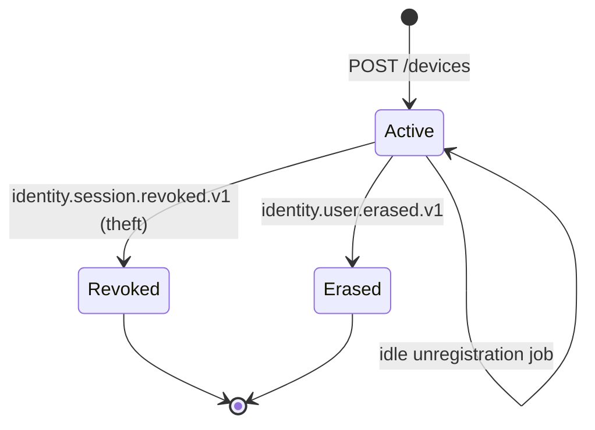
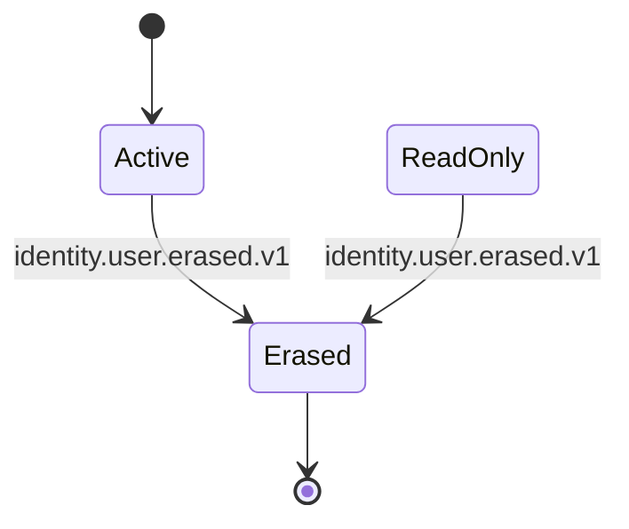

# user-profile-service — Workflows

## 1. Profile Creation on `identity.user.created.v1`

### 1.1 Objective

When a new user is created in `identity-service`, ensure a
`user_profile.profiles` row exists with default
preferences before any dependent feature (notification,
persona service) references the new `identity_id`.

### 1.2 Initiating Actor

`identity-service` emits `identity.user.created.v1` on
the identity topic.

### 1.3 Participating Services

- `identity-service` (producer).
- Kafka (transport).
- `user-profile-service` (consumer; creates the row).
- `notification-service`, persona services
  (consumers of `user.profile.updated.v1`).

### 1.4 Prerequisites

- The `user_profile` schema is migrated.
- The Kafka topic `identity.user.created` exists with
  replication factor ≥ 3.

### 1.5 Happy Path

```mermaid
sequenceDiagram
    participant IS as identity-service
    participant T as Kafka (identity.user.created)
    participant USV as user-profile-service
    participant ISV as identity-service (REST)
    participant DB as PostgreSQL (user_profile)
    participant OB as Outbox
    participant T2 as Kafka (user.profile.updated)

    IS->>T: produce identity.user.created.v1 (identity_id, claims)
    T->>USV: deliver to consumer
    USV->>ISV: GET /v1/identities/{identity_id}
    ISV-->>USV: { name, email, phone, locale, ... }
    USV->>DB: BEGIN; INSERT INTO user_profile.profiles (identity_id, preferred_locale=claims.locale OR default, notification_preferences=defaults); INSERT INTO outbox (user.profile.updated.v1, payload=created); COMMIT
    USV-->>T2: produce
    T2->>NOT: consume
    T2->>CS: consume
```

### 1.6 Alternate Paths

- **Direct creation by a persona service**: a
  `customer-service` (or other) call to
  `POST /v1/profiles/{identity_id}` creates the row if
  missing. The service then enriches with claims from
  `identity-service`.
- **Back-channel fill**: a `customer.created.v1` event
  from `customer-service` does not directly create the
  profile (the `identity.user.created.v1` does), but if
  the profile is missing for some reason, the persona
  service's POST handles it.

### 1.7 Failure Paths

- **`identity-service` unreachable on read**: the
  consumer retries 3 times with backoff; on continued
  failure, the message lands in the DLQ. The on-call
  is paged.
- **DB write fails**: the consumer retries; on failure,
  the message lands in the DLQ.
- **Outbox publish fails**: the poller retries; the
  event is eventually emitted.

### 1.8 Business Rules

- A new `profiles` row MUST be created before any
  dependent service references the `identity_id`. The
  outbox pattern guarantees atomicity.
- The default `preferred_locale` is
  `user_profile.default_locale` if the claim is
  missing; otherwise the claim's locale.
- The default `notification_preferences` is
  `user_profile.notification_defaults` from config.

### 1.9 State Transitions



### 1.10 Events

| Event | Direction | When |
|-------|-----------|------|
| `user.profile.updated.v1` | produced | on creation (with `changed_fields: ["created"]`) |
| `identity.user.created.v1` | consumed | to create the row |

### 1.11 APIs Involved

| API | Direction | When |
|-----|-----------|------|
| `GET /v1/identities/{id}` | outbound | on creation |
| Kafka publish | outbound (outbox) | on creation |

### 1.12 Compensation / Rollback

There is no compensation: the row and the event are
atomic. If the Kafka publish fails, the poller retries
until success.

### 1.13 Final State

- The `profiles` row exists with default preferences.
- `user.profile.updated.v1` is on the topic.
- The dependent services have consumed it.

## 2. Language Preference Change

### 2.1 Objective

Allow a user to change their `preferred_locale` (and
optionally `secondary_locale`); propagate the change to
every channel and the gateway's i18n catalogs.

### 2.2 Initiating Actor

A user (or admin) calls
`PATCH /v1/profiles/{identity_id}` with a new
`preferred_locale`.

### 2.3 Participating Services

- `user-profile-service` (this service).
- `notification-service`, persona services
  (consumers of `user.profile.updated.v1`).
- `api-gateway` (indirectly; it reads the locale from
  the `Accept-Language` header or from the user's
  profile via a header injection if the user is
  authenticated).

### 2.4 Prerequisites

- The `profiles` row exists.
- The user is not `read_only` (not suspended / disabled).

### 2.5 Happy Path

```mermaid
sequenceDiagram
    participant U as User
    participant USV as user-profile-service
    participant DB as PostgreSQL (user_profile)
    participant OB as Outbox
    participant T as Kafka (user.profile.updated)
    participant NOT as notification-service
    participant CS as customer-service

    U->>USV: PATCH /v1/profiles/{id} { preferred_locale: "ar-SA" }
    USV->>DB: BEGIN; UPDATE profiles SET preferred_locale='ar-SA', row_version=row_version+1; INSERT INTO profile_audit_log; INSERT INTO outbox; COMMIT
    USV-->>U: 200 OK
    OB->>T: produce user.profile.updated.v1
    T->>NOT: consume -> re-cache locale for templates
    T->>CS: consume -> re-cache locale for UI
```

### 2.6 Alternate Paths

- **Admin override**: an admin issues the PATCH with
  the `user-profile.admin` realm role; the same
  flow applies.

### 2.7 Failure Paths

- **Unsupported locale**: the service falls back to
  `user_profile.default_locale` and emits
  `user.profile.updated.v1` with the fallback
  (a `warnings[]` field in the response indicates
  the fallback).
- **Read-only profile**: 403 `PROFILE_READ_ONLY`.
- **Row version mismatch**: 409 `CONFLICT`.

### 2.8 Business Rules

- `preferred_locale` MUST be in
  `user_profile.supported_locales`; otherwise
  fallback to `user_profile.default_locale`.
- The change MUST be reflected in dependent services
  within 10 seconds (P99).

### 2.9 State Transitions

The `profiles.status` state machine is unaffected by
preference changes. The `preferred_locale` field
itself has no state machine.

### 2.10 Events

| Event | Direction | When |
|-------|-----------|------|
| `user.profile.updated.v1` | produced | on any preference change |

### 2.11 APIs Involved

| API | Direction | When |
|-----|-----------|------|
| `PATCH /v1/profiles/{id}` | inbound | per change |
| Kafka publish | outbound (outbox) | per change |

### 2.12 Compensation / Rollback

A user can issue another PATCH to revert. There is no
compensation at the service level.

### 2.13 Final State

- The `profiles` row has the new `preferred_locale`.
- `user.profile.updated.v1` is on the topic with
  `changed_fields: ["preferred_locale"]`.
- The dependent services have updated their caches.

## 3. Notification Preference Change

### 3.1 Objective

Allow a user to opt in or out of specific notification
channels for specific topics; ensure
`notification-service` honors the new prefs on the
next send.

### 3.2 Initiating Actor

A user calls
`PUT /v1/profiles/{identity_id}/notification-preferences`
with a full preferences object.

### 3.3 Participating Services

- `user-profile-service` (this service).
- `notification-service` (consumer; updates its
  preference cache).

### 3.4 Prerequisites

- The `profiles` row exists.
- The user is not `read_only`.

### 3.5 Happy Path

```mermaid
sequenceDiagram
    participant U as User
    participant USV as user-profile-service
    participant DB as PostgreSQL (user_profile)
    participant OB as Outbox
    participant T as Kafka (user.profile.updated)
    participant NOT as notification-service

    U->>USV: PUT /v1/profiles/{id}/notification-preferences { marketing: { push: false, email: true } }
    USV->>DB: BEGIN; UPDATE profiles SET notification_preferences=...; INSERT INTO profile_audit_log; INSERT INTO outbox; COMMIT
    USV-->>U: 200 OK
    OB->>T: produce user.profile.updated.v1
    T->>NOT: consume -> invalidate preference cache
```

### 3.6 Alternate Paths

- **Patch (partial update)**: `PATCH
  /v1/profiles/{id}` with the new
  `notification_preferences` does a JSON merge.
- **Admin override**: admin sets the prefs for a user
  (e.g. compliance turning off marketing for all users
  in a region).

### 3.7 Failure Paths

- **Invalid prefs** (unknown topic or channel): 400
  `VALIDATION_FAILED`.
- **Read-only profile**: 403 `PROFILE_READ_ONLY`.

### 3.8 Business Rules

- The preferences MUST conform to the schema
  (`{topic: {channel: bool}}`).
- The change MUST propagate to
  `notification-service`'s cache within 10 seconds
  (P99).

### 3.9 State Transitions

As in §2.9.

### 3.10 Events

| Event | Direction | When |
|-------|-----------|------|
| `user.profile.updated.v1` | produced | on any preference change |

### 3.11 APIs Involved

| API | Direction | When |
|-----|-----------|------|
| `PUT /v1/profiles/{id}/notification-preferences` | inbound | per change |
| `PATCH /v1/profiles/{id}` | inbound | for partial changes |
| Kafka publish | outbound (outbox) | per change |

### 3.12 Compensation / Rollback

A user can PUT again to revert.

### 3.13 Final State

- The `notification_preferences` JSONB is updated.
- `user.profile.updated.v1` is on the topic.
- `notification-service`'s cache is invalidated; the
  next send reads the new prefs.

## 4. Device Registration / Unregistration

### 4.1 Objective

Allow a user to register a device (with push token) so
`notification-service` can deliver push notifications;
emit `user.device.added.v1` and
`user.device.removed.v1` accordingly.

### 4.2 Initiating Actor

A mobile client on first launch (or after a token
refresh) calls
`POST /v1/profiles/{identity_id}/devices`.

### 4.3 Participating Services

- `user-profile-service` (this service).
- `notification-service` (consumer; uses the device
  for push delivery).

### 4.4 Prerequisites

- The `profiles` row exists.
- The user is not `read_only` for registration
  (unregistration is always allowed).

### 4.5 Happy Path

```mermaid
sequenceDiagram
    participant M as Mobile client
    participant USV as user-profile-service
    participant DB as PostgreSQL (user_profile)
    participant OB as Outbox
    participant T1 as Kafka (user.device.added)
    participant T2 as Kafka (user.profile.updated)
    participant NOT as notification-service

    M->>USV: POST /v1/profiles/{id}/devices { platform, push_token, ... }
    USV->>DB: BEGIN; INSERT INTO devices (...); UPDATE profiles SET row_version=row_version+1; INSERT INTO profile_audit_log; INSERT INTO outbox (user.device.added.v1); INSERT INTO outbox (user.profile.updated.v1, changed_fields=[devices]); COMMIT
    USV-->>M: 201 Created
    OB->>T1: produce user.device.added.v1
    OB->>T2: produce user.profile.updated.v1
    T1->>NOT: consume -> register device for push
```

### 4.6 Alternate Paths

- **Push token refresh**: the mobile client calls
  `PATCH /v1/profiles/{id}/devices/{device_id}` with
  the new `push_token` and `app_version`.
- **Auto-unregistration by inactivity**: a nightly
  job removes devices whose `last_seen_at` is older
  than `user_profile.devices.idle_unregister_days`.
- **Force-unregistration on `identity.session.revoked.v1`**
  (theft): a separate flow in the `user-profile-service`
  marks the device `revoked` and emits
  `user.device.removed.v1` with
  `reason: "session_revocation"`.

### 4.7 Failure Paths

- **Device limit reached**: 409 `DEVICE_LIMIT_REACHED`.
- **Duplicate push token**: the UNIQUE index on
  `(identity_id, push_token)` rejects the second
  insert; the existing device is updated instead
  (idempotent re-registration).
- **Read-only profile**: 403 `PROFILE_READ_ONLY`.

### 4.8 Business Rules

- A device push token MUST be unique within the
  user's device list.
- A device MUST be auto-removed after
  `idle_unregister_days` of inactivity.
- The change MUST propagate to
  `notification-service` within 10 seconds (P99).

### 4.9 State Transitions



### 4.10 Events

| Event | Direction | When |
|-------|-----------|------|
| `user.device.added.v1` | produced | on device registration |
| `user.device.removed.v1` | produced | on unregistration (manual, idle, revocation) |
| `user.profile.updated.v1` | produced | on registration / unregistration |

### 4.11 APIs Involved

| API | Direction | When |
|-----|-----------|------|
| `POST /v1/profiles/{id}/devices` | inbound | on registration |
| `DELETE /v1/profiles/{id}/devices/{device_id}` | inbound | on unregistration |
| Kafka publish | outbound (outbox) | on every change |

### 4.12 Compensation / Rollback

A user can DELETE the device. A re-registration is
idempotent on the push token.

### 4.13 Final State

- The `devices` row exists (or is soft-deleted on
  unregistration).
- `user.device.added.v1` (or `user.device.removed.v1`)
  is on the topic.
- `notification-service` has the new device in its
  push registry.

## 5. Avatar Upload

### 5.1 Objective

Allow a user to upload an avatar; the file is stored
in `file-service` and the `profiles.avatar_file_id` is
updated.

### 5.2 Initiating Actor

A user calls
`POST /v1/profiles/{identity_id}/avatar` with a
multipart body.

### 5.3 Participating Services

- `user-profile-service` (this service).
- `file-service` (storage).

### 5.4 Prerequisites

- The `profiles` row exists.
- The user is not `read_only`.

### 5.5 Happy Path

```mermaid
sequenceDiagram
    participant U as User
    participant USV as user-profile-service
    participant FS as file-service
    participant DB as PostgreSQL (user_profile)
    participant OB as Outbox
    participant T as Kafka (user.profile.updated)
    participant NOT as notification-service

    U->>USV: POST /v1/profiles/{id}/avatar (multipart)
    USV->>USV: validate MIME and size
    USV->>FS: POST /v1/files (binary)
    FS-->>USV: { file_id, virus_scan: "clean" }
    USV->>DB: BEGIN; UPDATE profiles SET avatar_file_id=file_id, row_version=row_version+1; INSERT INTO profile_audit_log; INSERT INTO outbox; COMMIT
    USV-->>U: 200 OK { avatar_file_id }
    OB->>T: produce user.profile.updated.v1
    T->>NOT: consume -> invalidate avatar cache
```

### 5.6 Alternate Paths

- **Replace avatar**: same flow; the old
  `avatar_file_id` is soft-deleted in
  `file-service` (via `DELETE /v1/files/{id}`).

### 5.7 Failure Paths

- **Avatar too large**: 413 `PAYLOAD_TOO_LARGE`.
- **Avatar wrong MIME**: 415 `UNSUPPORTED_MEDIA_TYPE`.
- **`file-service` unreachable**: 502
  `DEPENDENCY_UPSTREAM_FAILURE`.
- **Virus scan failed**: 422
  `BUSINESS_RULE_VIOLATION` with
  `code: "FILE_INFECTED"`.

### 5.8 Business Rules

- The avatar MIME MUST be in
  `user_profile.avatar.allowed_mime`.
- The avatar size MUST be ≤
  `user_profile.avatar.max_size_bytes`.
- The avatar file MUST be stored in
  `file-service`; this service only stores the
  reference.

### 5.9 State Transitions

The `profiles.status` state machine is unaffected.

### 5.10 Events

| Event | Direction | When |
|-------|-----------|------|
| `user.profile.updated.v1` | produced | on avatar change |

### 5.11 APIs Involved

| API | Direction | When |
|-----|-----------|------|
| `POST /v1/profiles/{id}/avatar` | inbound | per upload |
| `POST /v1/files` (file-service) | outbound | per upload |
| `DELETE /v1/files/{id}` (file-service) | outbound | on replace |
| Kafka publish | outbound (outbox) | per change |

### 5.12 Compensation / Rollback

A failed `file-service` upload leaves the old
`avatar_file_id` unchanged. The user can retry.

### 5.13 Final State

- The `profiles.avatar_file_id` is the new file.
- `user.profile.updated.v1` is on the topic.
- The old file is soft-deleted in `file-service` (if
  replacing).

## 6. Profile Anonymization on Erasure

### 6.1 Objective

On `identity.user.erased.v1`, anonymize the
`user_profile.profiles` row, clear all devices, and
emit `user.profile.erased.v1` and
`user.device.removed.v1` for each device.

### 6.2 Initiating Actor

`identity-service` emits `identity.user.erased.v1`.

### 6.3 Participating Services

- `identity-service` (producer).
- `user-profile-service` (this service; consumer).
- `notification-service`, persona services
  (consumers of `user.profile.erased.v1` and
  `user.device.removed.v1`).

### 6.4 Prerequisites

- The `profiles` row exists.

### 6.5 Happy Path

```mermaid
sequenceDiagram
    participant IS as identity-service
    participant T as Kafka (identity.user.erased)
    participant USV as user-profile-service
    participant DB as PostgreSQL (user_profile)
    participant OB as Outbox
    participant T2 as Kafka (user.profile.erased)
    participant T3 as Kafka (user.device.removed)
    participant NOT as notification-service

    IS->>T: produce identity.user.erased.v1
    T->>USV: deliver to consumer
    USV->>DB: BEGIN; UPDATE profiles SET preferred_locale='en-US', secondary_locale=NULL, avatar_file_id=NULL, notification_preferences='{}'::jsonb, do_not_disturb=NULL, status='erased', erased_at=now(), deleted_at=now(), row_version=row_version+1; UPDATE devices SET push_token=NULL, status='erased', deleted_at=now(); INSERT INTO profile_audit_log; INSERT INTO outbox (user.profile.erased.v1); INSERT INTO outbox (user.device.removed.v1 per device); COMMIT
    OB->>T2: produce user.profile.erased.v1
    OB->>T3: produce user.device.removed.v1 (per device)
    T2->>NOT: consume -> drop caches
    T3->>NOT: consume -> drop push registry
```

### 6.6 Alternate Paths

- **Direct erasure via `admin-service`**: an admin
  can call `POST /v1/profiles/{id}/erase` (the same
  flow as the event-driven path).

### 6.7 Failure Paths

- **DB write fails**: the consumer retries; on
  failure, the message lands in the DLQ. The
  reconciliation job in `reporting-service` detects
  drift and re-emits the erasure (idempotent).
- **Outbox publish fails**: the poller retries.

### 6.8 Business Rules

- The `identity_id` is preserved.
- All PII fields are set to defaults / NULL.
- The `status` is set to `erased`.
- The `deleted_at` is set; the row is a tombstone.
- All devices are cleared (push token nulled,
  `status='erased'`).
- The events are emitted exactly once (idempotency on
  `event_id`).

### 6.9 State Transitions



### 6.10 Events

| Event | Direction | When |
|-------|-----------|------|
| `user.profile.erased.v1` | produced | on erasure |
| `user.device.removed.v1` | produced | per device (reason=erasure) |

### 6.11 APIs Involved

| API | Direction | When |
|-----|-----------|------|
| Kafka publish | outbound (outbox) | per erasure |

### 6.12 Compensation / Rollback

There is no compensation. Erasure is irreversible.

### 6.13 Final State

- The `profiles` row is a tombstone with PII
  redacted.
- All `devices` rows have `push_token=NULL`,
  `status='erased'`.
- The events are on the topic.
- The dependent services have dropped their caches.

---

## See also

### Sibling docs for this service

- [`README.md`](./README.md) — purpose, bounded context, responsibilities
- [`BRD.md`](./BRD.md) — business requirements
- [`SRS.md`](./SRS.md) — functional + non-functional requirements
- [`ERD.md`](./ERD.md) — data model (entities, relationships)
- [`INTEGRATION.md`](./INTEGRATION.md) — inter-service contracts (APIs, events, sagas)
- [`WORKFLOWS.md`](./WORKFLOWS.md) — operational workflows (happy paths, failure modes)
- [`TECH.md`](./TECH.md) — technology profile (runtime, libraries, data layer, admin endpoints, RBAC)

### Platform-wide

- [`../../shared/README.md`](../../shared/README.md) — `platform-spring-boot-starter` shared library (the single source of cross-cutting code for all Spring Boot services in the platform)
- [`../RECOMMENDATIONS.md`](../RECOMMENDATIONS.md) — platform-wide technology map (language, framework, version baseline, admin/RBAC pattern)
- [`../../README.md`](../../README.md) — services overview (the catalog of all 58 services)
- [`../../../main.md`](../../../main.md) — top-level platform specification (architecture, Keycloak, PostgreSQL 18, messaging, observability baseline)

