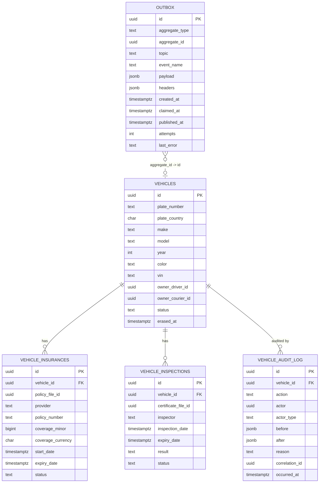

# vehicle-service — Entity-Relationship Diagram

## 1. Database

- **Engine**: PostgreSQL 18.
- **Schema**: `vehicle`.
- **Migrations**: `services/vehicle-service/migrations/`
  (versioned, forward-only, golang-migrate).

## 2. Cross-Service References

| Column | Type | Refers to | Source of truth |
|--------|------|-----------|------------------|
| `owner_driver_id` | UUID | `Driver` in `driver-service` | `driver-service` |
| `owner_courier_id` | UUID | `Courier` in `courier-service` | `courier-service` |
| `registration_certificate_file_id` | UUID | `File` in `file-service` | `file-service` |
| `insurance_policy_file_id` | UUID | `File` in `file-service` | `file-service` |
| `inspection_certificate_file_id` | UUID | `File` in `file-service` | `file-service` |

All stored as UUID columns WITHOUT database FKs.

## 3. Entities

### `vehicles`

The platform's vehicle aggregate. One row per vehicle.

#### Columns

| Column | Type | Constraints | Notes |
|--------|------|-------------|-------|
| `id` | UUID | PK | UUIDv7 |
| `plate_number` | TEXT | NOT NULL (column-level encrypted) | PII |
| `plate_country` | CHAR(2) | NOT NULL | ISO 3166-1 alpha-2 |
| `make` | TEXT | NOT NULL | e.g. `Toyota` |
| `model` | TEXT | NOT NULL | e.g. `Camry` |
| `year` | INT | NOT NULL | 1900-2100 |
| `color` | TEXT | NULL | e.g. `white` |
| `vin` | TEXT | NULL | Vehicle Identification Number (column-level encrypted) |
| `registration_certificate_file_id` | UUID | NULL | cross-service ref to `file-service` |
| `registration_expiry_date` | TIMESTAMPTZ | NULL | nullable in some markets |
| `owner_driver_id` | UUID | NULL | cross-service ref |
| `owner_courier_id` | UUID | NULL | cross-service ref |
| `status` | TEXT | NOT NULL DEFAULT 'pending_review' | `pending_review` / `approved` / `rejected` / `erased` |
| `rejected_reason` | TEXT | NULL | reason for rejection |
| `approved_at` | TIMESTAMPTZ | NULL | when approved |
| `approved_by` | UUID | NULL | actor's identity_id |
| `erased_at` | TIMESTAMPTZ | NULL | when GDPR-erased |
| `row_version` | BIGINT | NOT NULL DEFAULT 1 | optimistic-lock |
| `created_at` | TIMESTAMPTZ | NOT NULL DEFAULT now() | audit |
| `updated_at` | TIMESTAMPTZ | NOT NULL DEFAULT now() | audit |
| `created_by` | UUID | NOT NULL | identity |
| `updated_by` | UUID | NOT NULL | identity |
| `deleted_at` | TIMESTAMPTZ | NULL | soft delete |

#### Indexes

- PK on `id`.
- UNIQUE on `(plate_number, plate_country)` (partial,
  `WHERE deleted_at IS NULL`).
- Index on `owner_driver_id` (partial, `WHERE owner_driver_id IS NOT NULL`).
- Index on `owner_courier_id` (partial, `WHERE owner_courier_id IS NOT NULL`).
- Index on `status` (partial, `WHERE status IN ('pending_review', 'approved')`).

#### Constraints

- CHECK: `status IN ('pending_review', 'approved', 'rejected', 'erased')`.
- CHECK: `plate_country ~ '^[A-Z]{2}$'`.
- CHECK: `year >= 1900 AND year <= 2100`.

### `vehicle_insurances`

The vehicle's insurance policies. Multiple rows per
vehicle (current + past).

#### Columns

| Column | Type | Constraints | Notes |
|--------|------|-------------|-------|
| `id` | UUID | PK | UUIDv7 |
| `vehicle_id` | UUID | NOT NULL | FK to `vehicles.id` |
| `policy_file_id` | UUID | NULL | cross-service ref to `file-service` |
| `provider` | TEXT | NOT NULL | e.g. `Allianz` |
| `policy_number` | TEXT | NULL | insurer's id |
| `coverage_minor` | BIGINT | NOT NULL | coverage amount in minor units |
| `coverage_currency` | CHAR(3) | NOT NULL | ISO 4217 |
| `start_date` | TIMESTAMPTZ | NOT NULL | when the policy started |
| `expiry_date` | TIMESTAMPTZ | NOT NULL | when the policy expires |
| `status` | TEXT | NOT NULL DEFAULT 'active' | `active` / `expired` / `cancelled` |
| `row_version` | BIGINT | NOT NULL DEFAULT 1 | optimistic-lock |
| `created_at` | TIMESTAMPTZ | NOT NULL DEFAULT now() | audit |
| `updated_at` | TIMESTAMPTZ | NOT NULL DEFAULT now() | audit |
| `created_by` | UUID | NOT NULL | identity |
| `updated_by` | UUID | NOT NULL | identity |
| `deleted_at` | TIMESTAMPTZ | NULL | soft delete |

#### Indexes

- PK on `id`.
- Index on `vehicle_id` (partial, `WHERE deleted_at IS NULL`).
- Index on `expiry_date` (partial, `WHERE deleted_at IS NULL`) for the nightly expiry job.
- Index on `status` (partial, `WHERE status = 'active'`).

#### Constraints

- CHECK: `status IN ('active', 'expired', 'cancelled')`.
- CHECK: `expiry_date > start_date`.
- CHECK: `coverage_minor >= 0`.

### `vehicle_inspections`

The vehicle's inspection certificates. Multiple rows per
vehicle.

#### Columns

| Column | Type | Constraints | Notes |
|--------|------|-------------|-------|
| `id` | UUID | PK | UUIDv7 |
| `vehicle_id` | UUID | NOT NULL | FK to `vehicles.id` |
| `certificate_file_id` | UUID | NULL | cross-service ref |
| `inspector` | TEXT | NULL | inspector's name or center |
| `inspection_date` | TIMESTAMPTZ | NOT NULL | when the inspection was done |
| `expiry_date` | TIMESTAMPTZ | NOT NULL | when the inspection expires |
| `result` | TEXT | NOT NULL | `pass` / `fail` / `conditional` |
| `status` | TEXT | NOT NULL DEFAULT 'active' | `active` / `expired` / `cancelled` |
| `row_version` | BIGINT | NOT NULL DEFAULT 1 | optimistic-lock |
| `created_at` | TIMESTAMPTZ | NOT NULL DEFAULT now() | audit |
| `updated_at` | TIMESTAMPTZ | NOT NULL DEFAULT now() | audit |
| `created_by` | UUID | NOT NULL | identity |
| `updated_by` | UUID | NOT NULL | identity |
| `deleted_at` | TIMESTAMPTZ | NULL | soft delete |

#### Indexes

- PK on `id`.
- Index on `vehicle_id` (partial, `WHERE deleted_at IS NULL`).
- Index on `expiry_date` (partial, `WHERE deleted_at IS NULL`) for the nightly expiry job.
- Index on `status` (partial, `WHERE status = 'active'`).

#### Constraints

- CHECK: `status IN ('active', 'expired', 'cancelled')`.
- CHECK: `result IN ('pass', 'fail', 'conditional')`.
- CHECK: `expiry_date > inspection_date`.

### `vehicle_audit_log`

Append-only audit of every state change. Immutable.

#### Columns

| Column | Type | Constraints | Notes |
|--------|------|-------------|-------|
| `id` | UUID | PK | UUIDv7 |
| `vehicle_id` | UUID | NOT NULL | FK to `vehicles.id` |
| `action` | TEXT | NOT NULL | `create` / `update` / `approve` / `reject` / `erase` / `insurance_add` / `insurance_remove` / `inspection_add` / `inspection_remove` / `owner_add` / `owner_remove` |
| `actor` | UUID | NULL | actor's identity_id |
| `actor_type` | TEXT | NOT NULL | `user` / `admin` / `service` / `system` |
| `before` | JSONB | NULL | snapshot before |
| `after` | JSONB | NULL | snapshot after |
| `reason` | TEXT | NULL | reason code |
| `correlation_id` | UUID | NULL | request correlation id |
| `occurred_at` | TIMESTAMPTZ | NOT NULL DEFAULT now() | when the action happened |

#### Constraints

- No `UPDATE` or `DELETE`.
- Retention 7 years.

### `outbox`

Outbox table for the outbox pattern. Same shape as
`identity-service.outbox`.

## 4. Mermaid ER Diagram



## 5. DDL Sketch

```sql
CREATE SCHEMA IF NOT EXISTS vehicle;

CREATE TABLE vehicle.vehicles (
    id UUID PRIMARY KEY,
    plate_number TEXT NOT NULL,
    plate_country CHAR(2) NOT NULL,
    make TEXT NOT NULL,
    model TEXT NOT NULL,
    year INT NOT NULL,
    color TEXT,
    vin TEXT,
    registration_certificate_file_id UUID,
    registration_expiry_date TIMESTAMPTZ,
    owner_driver_id UUID,
    owner_courier_id UUID,
    status TEXT NOT NULL DEFAULT 'pending_review',
    rejected_reason TEXT,
    approved_at TIMESTAMPTZ,
    approved_by UUID,
    erased_at TIMESTAMPTZ,
    row_version BIGINT NOT NULL DEFAULT 1,
    created_at TIMESTAMPTZ NOT NULL DEFAULT now(),
    updated_at TIMESTAMPTZ NOT NULL DEFAULT now(),
    created_by UUID NOT NULL,
    updated_by UUID NOT NULL,
    deleted_at TIMESTAMPTZ,
    CONSTRAINT vehicles_status_check
        CHECK (status IN ('pending_review','approved','rejected','erased')),
    CONSTRAINT vehicles_plate_country_check
        CHECK (plate_country ~ '^[A-Z]{2}$'),
    CONSTRAINT vehicles_year_check
        CHECK (year >= 1900 AND year <= 2100)
);

CREATE UNIQUE INDEX vehicles_plate_uniq
    ON vehicle.vehicles (plate_number, plate_country)
    WHERE deleted_at IS NULL;

CREATE INDEX vehicles_owner_driver_id_idx
    ON vehicle.vehicles (owner_driver_id)
    WHERE owner_driver_id IS NOT NULL;

CREATE INDEX vehicles_owner_courier_id_idx
    ON vehicle.vehicles (owner_courier_id)
    WHERE owner_courier_id IS NOT NULL;

CREATE INDEX vehicles_status_idx
    ON vehicle.vehicles (status)
    WHERE status IN ('pending_review','approved');

CREATE TABLE vehicle.vehicle_insurances (
    id UUID PRIMARY KEY,
    vehicle_id UUID NOT NULL REFERENCES vehicle.vehicles(id),
    policy_file_id UUID,
    provider TEXT NOT NULL,
    policy_number TEXT,
    coverage_minor BIGINT NOT NULL,
    coverage_currency CHAR(3) NOT NULL,
    start_date TIMESTAMPTZ NOT NULL,
    expiry_date TIMESTAMPTZ NOT NULL,
    status TEXT NOT NULL DEFAULT 'active',
    row_version BIGINT NOT NULL DEFAULT 1,
    created_at TIMESTAMPTZ NOT NULL DEFAULT now(),
    updated_at TIMESTAMPTZ NOT NULL DEFAULT now(),
    created_by UUID NOT NULL,
    updated_by UUID NOT NULL,
    deleted_at TIMESTAMPTZ,
    CONSTRAINT vehicle_insurances_status_check
        CHECK (status IN ('active','expired','cancelled')),
    CONSTRAINT vehicle_insurances_expiry_check
        CHECK (expiry_date > start_date),
    CONSTRAINT vehicle_insurances_coverage_check
        CHECK (coverage_minor >= 0)
);

CREATE INDEX vehicle_insurances_vehicle_id_idx
    ON vehicle.vehicle_insurances (vehicle_id)
    WHERE deleted_at IS NULL;

CREATE INDEX vehicle_insurances_expiry_date_idx
    ON vehicle.vehicle_insurances (expiry_date)
    WHERE deleted_at IS NULL;

CREATE INDEX vehicle_insurances_status_idx
    ON vehicle.vehicle_insurances (status)
    WHERE status = 'active';

CREATE TABLE vehicle.vehicle_inspections (
    id UUID PRIMARY KEY,
    vehicle_id UUID NOT NULL REFERENCES vehicle.vehicles(id),
    certificate_file_id UUID,
    inspector TEXT,
    inspection_date TIMESTAMPTZ NOT NULL,
    expiry_date TIMESTAMPTZ NOT NULL,
    result TEXT NOT NULL,
    status TEXT NOT NULL DEFAULT 'active',
    row_version BIGINT NOT NULL DEFAULT 1,
    created_at TIMESTAMPTZ NOT NULL DEFAULT now(),
    updated_at TIMESTAMPTZ NOT NULL DEFAULT now(),
    created_by UUID NOT NULL,
    updated_by UUID NOT NULL,
    deleted_at TIMESTAMPTZ,
    CONSTRAINT vehicle_inspections_status_check
        CHECK (status IN ('active','expired','cancelled')),
    CONSTRAINT vehicle_inspections_result_check
        CHECK (result IN ('pass','fail','conditional')),
    CONSTRAINT vehicle_inspections_expiry_check
        CHECK (expiry_date > inspection_date)
);

CREATE INDEX vehicle_inspections_vehicle_id_idx
    ON vehicle.vehicle_inspections (vehicle_id)
    WHERE deleted_at IS NULL;

CREATE INDEX vehicle_inspections_expiry_date_idx
    ON vehicle.vehicle_inspections (expiry_date)
    WHERE deleted_at IS NULL;

CREATE INDEX vehicle_inspections_status_idx
    ON vehicle.vehicle_inspections (status)
    WHERE status = 'active';

CREATE TABLE vehicle.vehicle_audit_log (
    id UUID PRIMARY KEY,
    vehicle_id UUID NOT NULL REFERENCES vehicle.vehicles(id),
    action TEXT NOT NULL,
    actor UUID,
    actor_type TEXT NOT NULL,
    before JSONB,
    after JSONB,
    reason TEXT,
    correlation_id UUID,
    occurred_at TIMESTAMPTZ NOT NULL DEFAULT now()
);

CREATE TRIGGER vehicle_audit_log_no_update
    BEFORE UPDATE OR DELETE ON vehicle.vehicle_audit_log
    FOR EACH STATEMENT EXECUTE FUNCTION raise_exception();

CREATE TABLE vehicle.outbox (
    id UUID PRIMARY KEY,
    aggregate_type TEXT NOT NULL,
    aggregate_id UUID NOT NULL,
    topic TEXT NOT NULL,
    event_name TEXT NOT NULL,
    payload JSONB NOT NULL,
    headers JSONB NOT NULL DEFAULT '{}'::jsonb,
    created_at TIMESTAMPTZ NOT NULL DEFAULT now(),
    claimed_at TIMESTAMPTZ,
    published_at TIMESTAMPTZ,
    attempts INT NOT NULL DEFAULT 0,
    last_error TEXT
);

CREATE INDEX outbox_unpublished_idx
    ON vehicle.outbox (created_at)
    WHERE published_at IS NULL;

CREATE INDEX outbox_aggregate_id_idx
    ON vehicle.outbox (aggregate_id);
```

## 6. Audit Columns

Every mutable table has `created_at`, `updated_at`,
`created_by`, `updated_by`. The `vehicles`,
`vehicle_insurances`, and `vehicle_inspections` tables
also have `row_version` for optimistic locking.

## 7. Soft Delete

- The `vehicles` table uses soft delete (`deleted_at`).
- The `vehicle_insurances` and `vehicle_inspections`
  tables use soft delete; re-adding a new policy /
  certificate soft-deletes the old one (only one
  active at a time per type).

## 8. JSONB Usage

- `vehicle_audit_log.before` / `after` — snapshots.
- `outbox.payload` / `outbox.headers` — event
  envelope.

## 9. Partitioning

No table is partitioned; their volume does not warrant
it.

## 10. Data Retention

| Table | Retention | Purged by |
|-------|-----------|-----------|
| `vehicles` | until erasure + 7 years (tombstone) | background job |
| `vehicle_insurances` | 7 years (financial) | background job |
| `vehicle_inspections` | 7 years (audit) | background job |
| `vehicle_audit_log` | 7 years (audit) | background job |
| `outbox` | 24 h after `published_at` | background job |

## 11. Migration Considerations

- Adding a new country: add the plate format to
  `vehicle.plate_format_per_country` in
  configuration; the validation reads from config.
- Renaming a status: deprecated alias stored
  alongside; old code path reads the alias; new
  code reads the new value. Drop after a
  deprecation window.
- Cross-service references (`owner_driver_id`,
  `owner_courier_id`) are added as nullable
  columns; the back-channel consumer populates
  them.

---

## See also

### Sibling docs for this service

- [`README.md`](./README.md) — purpose, bounded context, responsibilities
- [`BRD.md`](./BRD.md) — business requirements
- [`SRS.md`](./SRS.md) — functional + non-functional requirements
- [`ERD.md`](./ERD.md) — data model (entities, relationships)
- [`INTEGRATION.md`](./INTEGRATION.md) — inter-service contracts (APIs, events, sagas)
- [`WORKFLOWS.md`](./WORKFLOWS.md) — operational workflows (happy paths, failure modes)
- [`TECH.md`](./TECH.md) — technology profile (runtime, libraries, data layer, admin endpoints, RBAC)

### Platform-wide

- [`../../shared/README.md`](../../shared/README.md) — `platform-spring-boot-starter` shared library (the single source of cross-cutting code for all Spring Boot services in the platform)
- [`../RECOMMENDATIONS.md`](../RECOMMENDATIONS.md) — platform-wide technology map (language, framework, version baseline, admin/RBAC pattern)
- [`../../README.md`](../../README.md) — services overview (the catalog of all 58 services)
- [`../../../main.md`](../../../main.md) — top-level platform specification (architecture, Keycloak, PostgreSQL 18, messaging, observability baseline)

