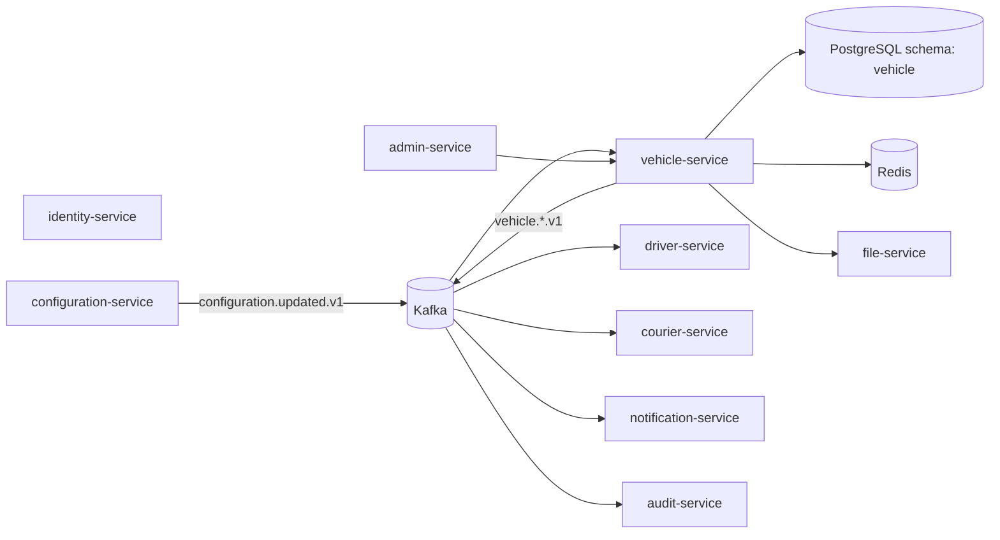
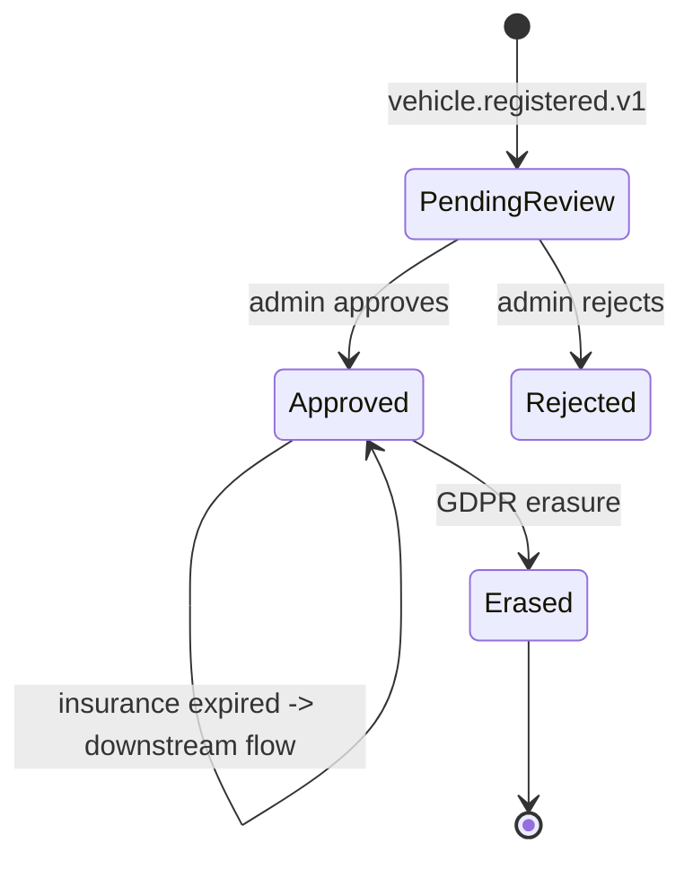

# vehicle-service — Software Requirements Specification

## 1. Introduction

This document specifies the software behavior, contracts,
and non-functional requirements of the `vehicle-service`.
The service is the platform's source of truth for
vehicles — registration, plate, insurance, inspection,
and multi-owner support.

## 2. Scope

**In scope:**

- Vehicle registration (plate, model, year, color,
  registration certificate).
- Multi-owner support (driver + courier on the same
  vehicle).
- Insurance policy tracking with expiry warnings.
- Inspection certificate tracking with expiry
  warnings.
- GDPR right-to-erasure.
- Event emission (`vehicle.*.v1`).

**Out of scope:**

- Driver / courier profiles.
- Location.
- Trip / delivery records.

## 3. System Context

## 4. Actors

- **Driver / courier (vehicle owner)** (human) —
  manage vehicles.
- **Internal admin / support** (human) — admin
  actions.
- **Downstream services** (system) — read vehicles
  for dispatch, trip, delivery.

## 5. Functional Requirements

| ID | Requirement | Priority |
|----|-------------|----------|
| FR--001 | Provide `GET /v1/vehicles/{vehicle_id}` returning the vehicle. | MUST |
| FR--002 | Provide `POST /v1/vehicles` to register. | MUST |
| FR--003 | Provide `PATCH /v1/vehicles/{vehicle_id}` to update. | MUST |
| FR--004 | Provide `GET /v1/vehicles/{vehicle_id}/insurances`. | MUST |
| FR--005 | Provide `POST /v1/vehicles/{vehicle_id}/insurances`. | MUST |
| FR--006 | Provide `DELETE /v1/vehicles/{vehicle_id}/insurances/{id}`. | MUST |
| FR--007 | Provide `GET /v1/vehicles/{vehicle_id}/inspections`. | MUST |
| FR--008 | Provide `POST /v1/vehicles/{vehicle_id}/inspections`. | MUST |
| FR--009 | Provide `DELETE /v1/vehicles/{vehicle_id}/inspections/{id}`. | MUST |
| FR--010 | Provide `POST /v1/vehicles/{vehicle_id}/owners` to add co-owner. | MUST |
| FR--011 | Provide `DELETE /v1/vehicles/{vehicle_id}/owners/{owner_id}`. | MUST |
| FR--012 | Provide `POST /v1/vehicles/{vehicle_id}/approve` (admin). | MUST |
| FR--013 | Provide `POST /v1/vehicles/{vehicle_id}/erase` (GDPR). | MUST |
| FR--014 | Consume `configuration.updated.v1`. | MUST |
| FR--015 | Nightly job emits `vehicle.insurance.expiring.v1` and `vehicle.inspection.expiring.v1`. | MUST |
| FR--016 | Nightly job emits `vehicle.insurance.expired.v1` and `vehicle.inspection.expired.v1` past grace period. | MUST |
| FR--017 | Emit `vehicle.registered.v1`. | MUST |
| FR--018 | Emit `vehicle.approved.v1`. | MUST |
| FR--019 | Emit `vehicle.insurance.expired.v1`. | MUST |
| FR--020 | Emit `vehicle.inspection.expired.v1`. | MUST |
| FR--021 | Emit `vehicle.erased.v1`. | MUST |
| FR--022 | All writes use the outbox pattern. | MUST |
| FR--023 | All non-idempotent POSTs require `Idempotency-Key`. | MUST |

## 6. Non-Functional Requirements

| ID | Category | Requirement | Target |
|----|----------|-------------|--------|
| NFR--001 | availability | monthly uptime | 99.9% |
| NFR--002 | performance | P99 read latency | ≤ 30 ms |
| NFR--003 | performance | P99 write latency | ≤ 500 ms |
| NFR--004 | scalability | concurrent reads per replica | ≥ 2,000 |
| NFR--005 | scalability | horizontal scale | 2 → 20 replicas per region |
| NFR--006 | maintainability | MTTR | ≤ 15 min median |
| NFR--007 | reliability | outbox publish lag P99 | ≤ 5 s |
| NFR--008 | reliability | event loss | 0 |
| NFR--009 | compliance | GDPR erasure SLA | 100% within 24 h expedited |

## 7. API Requirements

All endpoints follow `architecture/API_STANDARDS.md`.
Full contract in `INTEGRATION.md`.

## 8. Data Requirements

| ID | Requirement | Notes |
|----|-------------|-------|
| DATA--001 | The service MUST own the `vehicle` schema. | One writer. |
| DATA--002 | Primary keys MUST be UUIDv7. | Time-ordered. |
| DATA--003 | Cross-service IDs (`owner_driver_id`, `owner_courier_id`, `file_id`) MUST be UUID columns WITHOUT database FKs. | Consistency strategy. |
| DATA--004 | Plate (`plate_number`) MUST be column-level encrypted. | PII. |
| DATA--005 | Audit columns MUST be present on every mutable table. | Standard. |
| DATA--006 | Soft delete (`deleted_at`) MUST be used. | GDPR. |
| DATA--007 | The `outbox` table MUST be present and used. | At-least-once. |

(Full schema in `ERD.md`.)

## 9. Validation Rules

- A `plate_number` MUST conform to
  `vehicle.plate_format_per_country[country]`.
- A vehicle has at most one primary driver owner
  and one primary courier owner.
- An insurance `expiry_date` MUST be a future
  date on add.
- An inspection `expiry_date` MUST be a future
  date on add.
- A `co-owner` cannot be added twice
  (`UNIQUE (vehicle_id, owner_id)`).

## 10. State Transitions

## 11. Authorization Requirements

- All endpoints require a JWT bearer token.
- Owner-only mutations: the JWT's `X-User-Id` must
  match `owner_driver_id` or `owner_courier_id` of
  the vehicle (validated via REST on
  `driver-service` / `courier-service`); otherwise
  403.
- Admin endpoints require `vehicle.admin` realm
  role on `platform-internal`.

## 12. Configuration Requirements

Listed in `README.md` §13.

## 13. Error Handling

| Condition | Response |
|-----------|----------|
| Unknown `vehicle_id` | 404 `NOT_FOUND` |
| Concurrent update | 409 `CONFLICT` |
| Plate format invalid | 400 `VALIDATION_FAILED` |
| Co-owner already associated | 409 `CONFLICT` |
| `Idempotency-Key` reused with different body | 422 `IDEMPOTENCY_KEY_REUSED` |

## 14. Concurrency Requirements

- The `vehicles` row has an optimistic-lock version
  (`row_version`).
- The outbox poller is single-writer per replica via
  a Postgres advisory lock.

## 15. Idempotency Requirements

- All non-idempotent POSTs require `Idempotency-Key`.

## 16. Performance

- **Dominant path**: vehicle read by `vehicle_id`
  (PK index hit) → return row. P99 ≤ 30 ms.

## 17. Scalability

- **Horizontal**: stateless beyond PostgreSQL +
  Redis + Kafka.
- **Vertical**: 500m vCPU / 512 MiB default.
- **HPA**: CPU 60% target; custom metric
  `vehicle_lookups_per_second` (target 2k/replica).

## 18. Availability

- **SLO**: 99.9% per 30d.
- **Error budget**: ~44 min / 30d.

## 19. Security

| ID | Requirement | Notes |
|----|-------------|-------|
| SEC--001 | All endpoints require a JWT bearer token. | Self or service. |
| SEC--002 | Self-service endpoints enforce ownership. | Via `driver-service` / `courier-service` validation. |
| SEC--003 | Plate number is column-level encrypted. | PII. |
| SEC--004 | Document files stored in `file-service`; this service holds only the `file_id`. | Defense in depth. |
| SEC--005 | GDPR erasure preserves `vehicle_id`. | Soft delete + tombstone. |
| SEC--006 | mTLS in cluster. | Network-layer identity. |

## 20. Privacy

- Stored PII: `plate_number` (encrypted).
- Encryption: column-level, per-tenant DEK.
- Retention: until erasure + 7 years for the
  `vehicle_id` tombstone.
- Erasure: `POST /v1/vehicles/{id}/erase` anonymizes
  PII; `vehicle_id` preserved.

## 21. Auditability

- Every state change writes a row to
  `vehicle.vehicle_audit_log` (append-only) AND
  emits the corresponding `vehicle.*.v1` event.
- Retention 7 years.

## 22. Observability

- **Logs**: JSON to stdout; fields listed in
  `README.md` §15.
- **Metrics**: RED per endpoint + business metrics
  listed in `README.md` §15.
- **Traces**: OpenTelemetry. Sample 100% on errors,
  10% on success.
- **Alerts**: SLO burn-rate; document expiry
  warning lag.

## 23. Maintainability

- **Code style**: TypeScript (ESLint + Prettier).
- **Test coverage**: ≥ 85% overall, 100% on
  document expiry, multi-owner, erasure paths.

## 24. Disaster Recovery

- **RPO**: ≤ 5 min (WAL streaming + 7-day PITR).
- **RTO**: ≤ 30 min (warm standby).

## 25. Acceptance Criteria

- A vehicle registration results in a
  `vehicle.vehicles` row and `vehicle.registered.v1`
  emitted.
- Adding a co-owner results in a
  `vehicle.owners` row and the owner's services
  are notified.
- An insurance expiring in 30 / 7 / 1 day results
  in `vehicle.insurance.expiring.v1` emitted.
- An insurance past expiry + grace period results
  in `vehicle.insurance.expired.v1` emitted.
- A GDPR erasure request results in PII redaction
  and `vehicle.erased.v1` emitted.
- A plate format validation rejects invalid plates
  with `400 VALIDATION_FAILED`.

---

## See also

### Sibling docs for this service

- [`README.md`](./README.md) — purpose, bounded context, responsibilities
- [`BRD.md`](./BRD.md) — business requirements
- [`SRS.md`](./SRS.md) — functional + non-functional requirements
- [`ERD.md`](./ERD.md) — data model (entities, relationships)
- [`INTEGRATION.md`](./INTEGRATION.md) — inter-service contracts (APIs, events, sagas)
- [`WORKFLOWS.md`](./WORKFLOWS.md) — operational workflows (happy paths, failure modes)
- [`TECH.md`](./TECH.md) — technology profile (runtime, libraries, data layer, admin endpoints, RBAC)

### Platform-wide

- [`../../shared/README.md`](../../shared/README.md) — `platform-spring-boot-starter` shared library (the single source of cross-cutting code for all Spring Boot services in the platform)
- [`../RECOMMENDATIONS.md`](../RECOMMENDATIONS.md) — platform-wide technology map (language, framework, version baseline, admin/RBAC pattern)
- [`../../README.md`](../../README.md) — services overview (the catalog of all 58 services)
- [`../../../main.md`](../../../main.md) — top-level platform specification (architecture, Keycloak, PostgreSQL 18, messaging, observability baseline)

