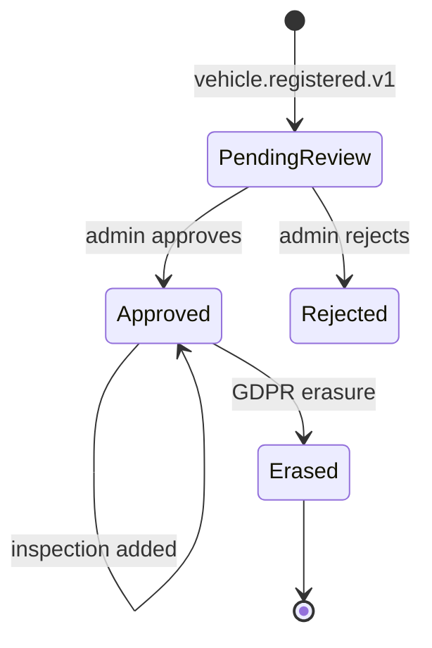
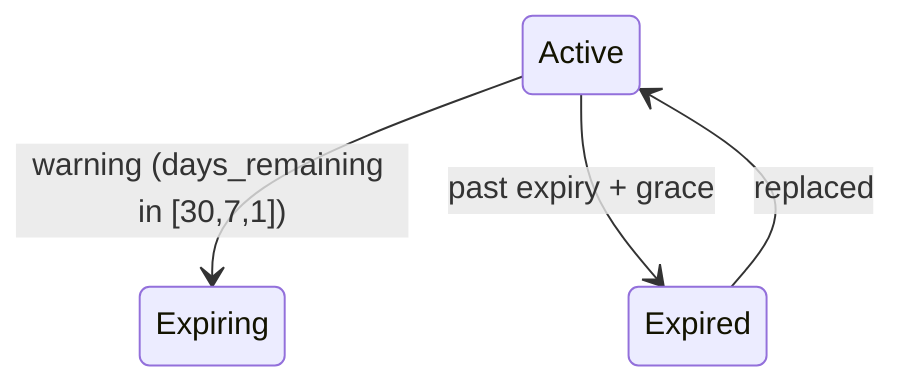

# vehicle-service — Workflows

## 1. Vehicle Registration

### 1.1 Objective

A driver or courier registers a vehicle with the
platform. The vehicle is created in `pending_review`;
after admin approval, the driver / courier can use it.

### 1.2 Initiating Actor

A driver or courier calls
`POST /v1/vehicles` with the vehicle details.

### 1.3 Participating Services

- `vehicle-service` (this service).
- `file-service` (registration certificate).
- `driver-service` / `courier-service` (consumers
  of `vehicle.registered.v1`).
- `admin-service` (admin review).
- `notification-service` (registration confirmation).
- `audit-service`.

### 1.4 Prerequisites

- The driver / courier has an identity in
  `identity-service`.
- The registration certificate file is uploaded to
  `file-service`.

### 1.5 Happy Path

```mermaid
sequenceDiagram
    participant O as Owner (driver/courier)
    participant VSV as vehicle-service
    participant FS as file-service
    participant DSV as driver-service / courier-service
    participant ADM as admin-service
    participant NOT as notification-service
    participant T as Kafka

    O->>FS: upload registration certificate
    FS-->>O: { file_id }
    O->>VSV: POST /v1/vehicles { plate_number, ..., file_id, owner_driver_id }
    VSV->>VSV: validate plate format
    VSV->>DB: BEGIN; INSERT INTO vehicle.vehicles (..., status='pending_review'); INSERT INTO vehicle_audit_log; INSERT INTO outbox; COMMIT
    VSV-->>O: 201 Created
    T->>VSV: outbox -> vehicle.registered.v1
    T->>DSV: consume -> link to primary vehicle
    ADM->>VSV: POST /v1/vehicles/{id}/approve
    VSV->>DB: BEGIN; UPDATE vehicles SET status='approved', approved_at=now(), approved_by=actor; INSERT INTO vehicle_audit_log; INSERT INTO outbox; COMMIT
    T->>VSV: outbox -> vehicle.approved.v1
    T->>DSV: consume -> vehicle is now usable
    T->>NOT: consume -> notify owner
```

### 1.6 Alternate Paths

- **Vehicle rejection**: admin reviews and finds an
  issue; the admin calls
  `POST /v1/vehicles/{id}/reject` (or simply does
  not approve); `vehicle.approved.v1` is not
  emitted.
- **Plate already registered**: 409 `CONFLICT`.

### 1.7 Failure Paths

- **Plate format invalid**: 400 `VALIDATION_FAILED`.
- **`file-service` unreachable**: 502
  `DEPENDENCY_UPSTREAM_FAILURE`.

### 1.8 Business Rules

- A plate MUST conform to
  `vehicle.plate_format_per_country[country]`.
- A vehicle is in `pending_review` until admin
  approval.
- The `vehicle.registered.v1` event MUST be emitted
  before any consumer (driver / courier) can
  reference the `vehicle_id`.

### 1.9 State Transitions



### 1.10 Events

| Event | Direction | When |
|-------|-----------|------|
| `vehicle.registered.v1` | produced | on registration |
| `vehicle.approved.v1` | produced | on approval |

### 1.11 APIs Involved

| API | Direction | When |
|-----|-----------|------|
| `POST /v1/vehicles` | inbound | on registration |
| `POST /v1/vehicles/{id}/approve` | inbound | on approval |
| Kafka publish | outbound (outbox) | per state change |

### 1.12 Compensation / Rollback

An erasure is irreversible. A re-registration with
the same plate after erasure is rejected with 409
(the tombstone retains the plate).

### 1.13 Final State

- The `vehicles` row is `approved`.
- `vehicle.approved.v1` is on the topic.
- The owner can now use the vehicle.

## 2. Insurance / Inspection Expiry

### 2.1 Objective

A vehicle's insurance or inspection is nearing
expiry. The service emits warnings 30, 7, 1 day
before; if past expiry + grace period, emits
`vehicle.*.expired.v1` so the
`driver-service` / `courier-service` can auto-suspend
the owner.

### 2.2 Initiating Actor

A nightly job in `vehicle-service` scans
`vehicle_insurances` and `vehicle_inspections` for
upcoming and past expiries.

### 2.3 Participating Services

- `vehicle-service` (this service; nightly job).
- `notification-service` (warnings).
- `driver-service` / `courier-service` (auto-suspend).

### 2.4 Prerequisites

- The `vehicle_insurances` and `vehicle_inspections`
  rows have `expiry_date` populated.

### 2.5 Happy Path (Warning)

```mermaid
sequenceDiagram
    participant JOB as Nightly job
    participant DB as PostgreSQL (vehicle)
    participant OB as Outbox
    participant T as Kafka (vehicle.insurance.expiring)
    participant NOT as notification-service
    participant O as Owner

    JOB->>DB: SELECT * FROM vehicle_insurances WHERE status='active' AND expiry_date BETWEEN now() AND now() + interval '30 days' AND deleted_at IS NULL
    loop for each insurance
        alt days_remaining in [30, 7, 1]
            JOB->>DB: BEGIN; INSERT INTO vehicle_audit_log; INSERT INTO outbox (vehicle.insurance.expiring.v1, days_remaining=...); COMMIT
            OB->>T: produce vehicle.insurance.expiring.v1
            T->>NOT: consume -> notify owner
            NOT-->>O: SMS/push: "Your insurance expires in 7 days"
        end
    end
```

### 2.6 Auto-Notify (Past Expiry)

```mermaid
sequenceDiagram
    participant JOB as Nightly job
    participant DB as PostgreSQL (vehicle)
    participant OB as Outbox
    participant T1 as Kafka (vehicle.insurance.expired)
    participant DSV as driver-service / courier-service
    participant NOT as notification-service

    JOB->>DB: SELECT * FROM vehicle_insurances WHERE status='active' AND expiry_date < now() - interval '7 days' AND deleted_at IS NULL
    loop for each insurance
        JOB->>DB: BEGIN; UPDATE vehicle_insurances SET status='expired'; INSERT INTO vehicle_audit_log; INSERT INTO outbox (vehicle.insurance.expired.v1); COMMIT
        OB->>T1: produce vehicle.insurance.expired.v1
        T1->>DSV: consume -> auto-suspend the owner
        T1->>NOT: consume -> notify owner
    end
```

### 2.7 Alternate Paths

- **Owner replaces insurance before expiry**: the
  new insurance is `active`; the old one is
  `status='cancelled'`; the warnings are no longer
  emitted.

### 2.8 Business Rules

- Warning windows are 30, 7, 1 day.
- The grace period is `expiry_grace_days` (default
  7).
- The expired event MUST propagate to
  `driver-service` / `courier-service` within 10 s
  (P99) so the owner is auto-suspended.

### 2.9 State Transitions



### 2.10 Events

| Event | Direction | When |
|-------|-----------|------|
| `vehicle.insurance.expiring.v1` | produced | 30/7/1 day before expiry |
| `vehicle.insurance.expired.v1` | produced | past expiry + grace |
| `vehicle.inspection.expiring.v1` | produced | same for inspection |
| `vehicle.inspection.expired.v1` | produced | same for inspection |

### 2.11 APIs Involved

None (internal job).

### 2.12 Compensation / Rollback

An owner can add a new insurance / inspection,
which supersedes the old one.

### 2.13 Final State

- The expired insurance / inspection is
  `status='expired'`.
- The events are on the topic.
- The owner is auto-suspended by
  `driver-service` / `courier-service`.

## 3. Multi-Owner

### 3.1 Objective

A vehicle can be associated with one driver and one
courier at the same time (e.g. a family car used
by a driver for rides and a courier for deliveries).

### 3.2 Initiating Actor

The primary owner (or admin) calls
`POST /v1/vehicles/{vehicle_id}/owners` with
`owner_driver_id` and / or `owner_courier_id`.

### 3.3 Participating Services

- `vehicle-service` (this service).
- `driver-service` / `courier-service` (consumers
  of the event).

### 3.4 Prerequisites

- The vehicle is `approved`.
- The new owner is an approved driver / courier.

### 3.5 Happy Path

```mermaid
sequenceDiagram
    participant O as Primary owner
    participant VSV as vehicle-service
    participant DB as PostgreSQL (vehicle)
    participant OB as Outbox
    participant T as Kafka (vehicle.registered.v1)
    participant DSV as driver-service
    participant COS as courier-service

    O->>VSV: POST /v1/vehicles/{id}/owners { owner_courier_id: "01HZX…" }
    VSV->>DB: BEGIN; UPDATE vehicles SET owner_courier_id=co_owner_id, row_version=row_version+1; INSERT INTO vehicle_audit_log; INSERT INTO outbox (vehicle.registered.v1 with co-owner change); COMMIT
    OB->>T: produce vehicle.registered.v1 (with the new co-owner)
    T->>COS: consume -> courier is now linked to this vehicle
    T->>DSV: consume -> driver is informed
```

### 3.6 Alternate Paths

- **Removing a co-owner**: the primary owner calls
  `DELETE /v1/vehicles/{id}/owners/{owner_id}`.
- **A vehicle has no co-owner**: just the driver or
  just the courier.

### 3.7 Failure Paths

- **Co-owner already associated**: 409 `CONFLICT`.
- **Co-owner not approved**: 422
  `OWNER_NOT_APPROVED`.

### 3.8 Business Rules

- A vehicle has at most one primary driver owner
  and one primary courier owner.
- Adding a co-owner MUST propagate to
  `driver-service` / `courier-service` within 10 s
  (P99).

### 3.9 State Transitions

None (the owner IDs are single values).

### 3.10 Events

| Event | Direction | When |
|-------|-----------|------|
| `vehicle.registered.v1` | produced | on owner change (re-emitted) |

### 3.11 APIs Involved

| API | Direction | When |
|-----|-----------|------|
| `POST /v1/vehicles/{id}/owners` | inbound | per add |
| Kafka publish | outbound (outbox) | per change |

### 3.12 Compensation / Rollback

Removing a co-owner re-emits the event with the
owner IDs cleared.

### 3.13 Final State

- The `vehicles.owner_driver_id` /
  `owner_courier_id` is updated.
- `vehicle.registered.v1` is on the topic with the
  new owner IDs.
- The consumer services have the new ownership.

## 4. GDPR Right-to-Erasure

### 4.1 Objective

Anonymize the `vehicles` row; emit
`vehicle.erased.v1`; preserve the `vehicle_id` for
referential integrity (trip / delivery records
retain the `vehicle_id` reference but their PII
fields are redacted by the owning service).

### 4.2 Initiating Actor

`admin-service` calls
`POST /v1/vehicles/{vehicle_id}/erase` on behalf of
a compliance officer.

### 4.3 Participating Services

- `admin-service` (caller).
- `vehicle-service` (this service).
- Kafka (`vehicle.erased.v1`).
- `audit-service`, `analytics-service` (consumers).

### 4.4 Prerequisites

- The `vehicles` row exists.
- The compliance officer has `vehicle.admin` or
  `super_admin` realm role.

### 4.5 Happy Path

```mermaid
sequenceDiagram
    participant ADM as admin-service
    participant VSV as vehicle-service
    participant DB as PostgreSQL (vehicle)
    participant OB as Outbox
    participant T as Kafka (vehicle.erased)
    participant AUD as audit-service
    participant TR as trip-service
    participant DLV as delivery-service

    ADM->>VSV: POST /v1/vehicles/{id}/erase { legal_basis: "user_request" }
    VSV->>DB: BEGIN; UPDATE vehicles SET plate_number='REDACTED', vin='REDACTED', owner_driver_id=NULL, owner_courier_id=NULL, status='erased', erased_at=now(), deleted_at=now(); UPDATE vehicle_insurances SET policy_number=NULL; INSERT INTO vehicle_audit_log; INSERT INTO outbox; COMMIT
    VSV-->>ADM: 200 OK { status: "erased", warnings: [] }
    OB->>T: produce vehicle.erased.v1
    T->>AUD: consume
    T->>TR: consume -> trip records retain vehicle_id, redacts PII
    T->>DLV: consume -> delivery records retain vehicle_id, redacts PII
```

### 4.6 Alternate Paths

- **Erasure with active trip / delivery records**:
  the service performs the erasure but populates
  `warnings[]` in the response.

### 4.7 Failure Paths

- **DB write fails**: the action is not performed;
  the admin retries.
- **Outbox publish fails**: the poller retries.

### 4.8 Business Rules

- The `vehicle_id` is preserved.
- All PII columns (plate, VIN, owner IDs) are set
  to `REDACTED` / NULL.
- The `status` is set to `erased`.
- The `deleted_at` is set; the row is a tombstone.
- `vehicle.erased.v1` is emitted exactly once
  (idempotency on `Idempotency-Key`).
- The audit log retains the erasure entry
  indefinitely.

### 4.9 State Transitions

```mermaid
stateDiagram-v2
    [*] --> PendingReview
    PendingReview --> Erased: POST /erase
    Approved --> Erased: POST /erase
    Rejected --> Erased: POST /erase
    Erased --> [*]
    Erased -.->|re-activation NOT allowed| Erased
```

### 4.10 Events

| Event | Direction | When |
|-------|-----------|------|
| `vehicle.erased.v1` | produced | on erasure |

### 4.11 APIs Involved

| API | Direction | When |
|-----|-----------|------|
| `POST /v1/vehicles/{id}/erase` | inbound | per erasure |
| Kafka publish | outbound (outbox) | per erasure |

### 4.12 Compensation / Rollback

None. Erasure is irreversible.

### 4.13 Final State

- The `vehicles` row is a tombstone with PII
  redacted.
- `vehicle_insurances` and `vehicle_inspections`
  rows are preserved (for the audit trail).
- `vehicle.erased.v1` is on the topic.
- The dependent services have anonymized their PII
  but retain the `vehicle_id` reference.
- The audit log has the erasure entry.

---

## See also

### Sibling docs for this service

- [`README.md`](./README.md) — purpose, bounded context, responsibilities
- [`BRD.md`](./BRD.md) — business requirements
- [`SRS.md`](./SRS.md) — functional + non-functional requirements
- [`ERD.md`](./ERD.md) — data model (entities, relationships)
- [`INTEGRATION.md`](./INTEGRATION.md) — inter-service contracts (APIs, events, sagas)
- [`WORKFLOWS.md`](./WORKFLOWS.md) — operational workflows (happy paths, failure modes)
- [`TECH.md`](./TECH.md) — technology profile (runtime, libraries, data layer, admin endpoints, RBAC)

### Platform-wide

- [`../../shared/README.md`](../../shared/README.md) — `platform-spring-boot-starter` shared library (the single source of cross-cutting code for all Spring Boot services in the platform)
- [`../RECOMMENDATIONS.md`](../RECOMMENDATIONS.md) — platform-wide technology map (language, framework, version baseline, admin/RBAC pattern)
- [`../../README.md`](../../README.md) — services overview (the catalog of all 58 services)
- [`../../../main.md`](../../../main.md) — top-level platform specification (architecture, Keycloak, PostgreSQL 18, messaging, observability baseline)

