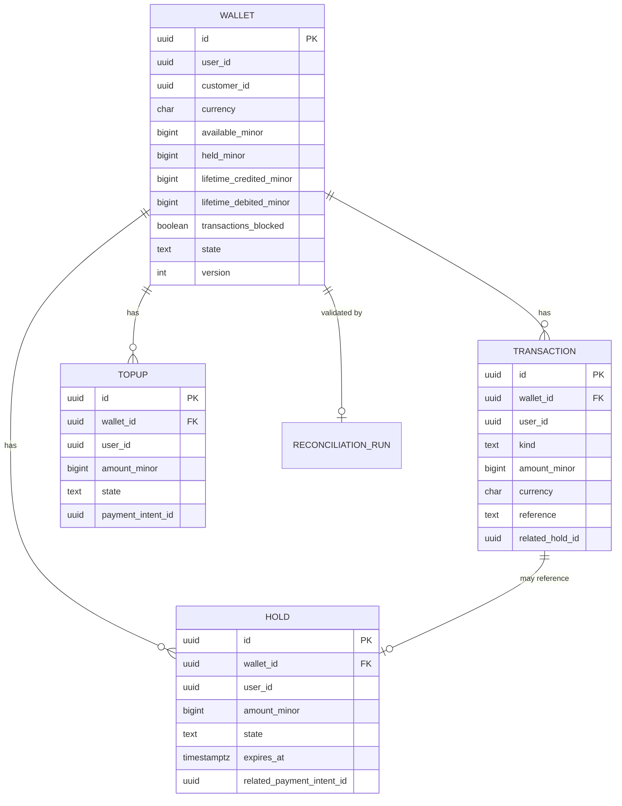

# wallet-service — Entity-Relationship Diagram

## 1. Database

- Engine: PostgreSQL 18.
- Schema: `wallet` (owned exclusively by this service).
- Migrations: `services/wallet-service/migrations/`.

## 2. Cross-Service References

| Column | Type | Refers to | Source of truth |
|--------|------|-----------|------------------|
| `user_id` | UUID | `Identity` in `identity-service` | `identity-service` |
| `customer_id` | UUID | `Customer` in `customer-service` | `customer-service` |
| `payment_intent_id` | UUID | `PaymentIntent` in `payment-service` | `payment-service` |
| `food_order_id` | UUID | `FoodOrder` in `food-order-service` (ref) | `food-order-service` |
| `ride_id` | UUID | `RideRequest` in `ride-request-service` (ref) | `ride-request-service` |
| `trip_id` | UUID | `Trip` in `trip-service` (ref) | `trip-service` |
| `correlation_id` | UUID | request scope | gateway |

All cross-service references are stored as UUID columns **without**
database-level foreign keys.

## 3. Entities

### `Wallet`

One row per user per currency.

#### Columns

| Column | Type | Constraints | Notes |
|--------|------|-------------|-------|
| `id` | UUID | PK | UUIDv7 |
| `user_id` | UUID | NOT NULL | cross-service ref |
| `customer_id` | UUID | NULL | for customer wallets |
| `currency` | CHAR(3) | NOT NULL | ISO 4217 |
| `available_minor` | BIGINT | NOT NULL DEFAULT 0 | `credits - debits - holds` |
| `held_minor` | BIGINT | NOT NULL DEFAULT 0 | sum of active holds |
| `lifetime_credited_minor` | BIGINT | NOT NULL DEFAULT 0 | |
| `lifetime_debited_minor` | BIGINT | NOT NULL DEFAULT 0 | |
| `transactions_blocked` | BOOLEAN | NOT NULL DEFAULT false | true on `customer.suspended.v1` |
| `state` | TEXT | NOT NULL CHECK in (`active`,`frozen`,`closed`) | |
| `created_at` | TIMESTAMPTZ | NOT NULL DEFAULT now() | |
| `updated_at` | TIMESTAMPTZ | NOT NULL DEFAULT now() | |
| `version` | INT | NOT NULL DEFAULT 1 | optimistic concurrency |

#### Indexes

- PK on `id`.
- Unique on `(user_id, currency)`.
- Index on `(state, updated_at)` for operational queries.

#### Constraints

- CHECK `available_minor >= 0`.
- CHECK `held_minor >= 0`.
- CHECK `lifetime_credited_minor >= 0`.
- CHECK `lifetime_debited_minor >= 0`.
- CHECK `state IN (...)` as above.
- CHECK `version > 0`.

### `Transaction` (Partitioned by Month)

Append-only transaction log. Every credit, debit, hold, release,
and capture produces a row.

#### Columns

| Column | Type | Constraints | Notes |
|--------|------|-------------|-------|
| `id` | UUID | PK | UUIDv7 |
| `wallet_id` | UUID | NOT NULL | FK within schema |
| `user_id` | UUID | NOT NULL | denormalised |
| `kind` | TEXT | NOT NULL CHECK in (`credit`,`debit`,`hold`,`release`,`capture`,`admin_adjust`) | |
| `amount_minor` | BIGINT | NOT NULL | positive |
| `currency` | CHAR(3) | NOT NULL | |
| `reference` | TEXT | NULL | e.g. payment intent id |
| `related_hold_id` | UUID | NULL | for release / capture |
| `actor_id` | UUID | NULL | user or admin |
| `actor_type` | TEXT | NULL CHECK in (`user`,`service`,`admin`,`system`) | |
| `correlation_id` | UUID | NOT NULL | |
| `occurred_at` | TIMESTAMPTZ | NOT NULL | |
| `created_at` | TIMESTAMPTZ | NOT NULL DEFAULT now() | append-only |
| PRIMARY KEY (id, occurred_at) | | | for partitioning |

#### Indexes

- PK on `(id, occurred_at)`.
- Index on `wallet_id, occurred_at DESC`.
- Index on `user_id, occurred_at DESC`.
- Unique on `(reference, kind)` for `reference IS NOT NULL` to
  enforce idempotency at the data layer.

#### Constraints

- CHECK `kind IN (...)` as above.
- CHECK `amount_minor > 0`.

### `Hold`

A reservation against the wallet balance. The hold has a state
machine: `active → captured | released | auto_released`.

#### Columns

| Column | Type | Constraints | Notes |
|--------|------|-------------|-------|
| `id` | UUID | PK | UUIDv7 |
| `wallet_id` | UUID | NOT NULL | FK within schema |
| `user_id` | UUID | NOT NULL | denormalised |
| `amount_minor` | BIGINT | NOT NULL | positive |
| `currency` | CHAR(3) | NOT NULL | |
| `state` | TEXT | NOT NULL CHECK in (`active`,`captured`,`released`,`auto_released`) | |
| `expires_at` | TIMESTAMPTZ | NULL | when auto-release runs |
| `related_payment_intent_id` | UUID | NULL | cross-service ref |
| `correlation_id` | UUID | NOT NULL | |
| `created_at` | TIMESTAMPTZ | NOT NULL DEFAULT now() | |
| `updated_at` | TIMESTAMPTZ | NOT NULL DEFAULT now() | |
| `created_by` | UUID | NOT NULL | |
| `resolved_at` | TIMESTAMPTZ | NULL | when captured / released |

#### Indexes

- PK on `id`.
- Index on `wallet_id, state`.
- Index on `state, expires_at` for the auto-release scheduler.
- Unique on `(related_payment_intent_id)` where not null.

#### Constraints

- CHECK `amount_minor > 0`.
- CHECK `state IN (...)` as above.

### `Topup`

The record of a top-up. Separate from `transactions` for clarity
(it's a special kind of credit that is initiated by the user).

#### Columns

| Column | Type | Constraints | Notes |
|--------|------|-------------|-------|
| `id` | UUID | PK | UUIDv7 |
| `wallet_id` | UUID | NOT NULL | FK within schema |
| `user_id` | UUID | NOT NULL | denormalised |
| `amount_minor` | BIGINT | NOT NULL | positive |
| `currency` | CHAR(3) | NOT NULL | |
| `state` | TEXT | NOT NULL CHECK in (`initiated`,`succeeded`,`failed`) | |
| `payment_intent_id` | UUID | NOT NULL | cross-service ref |
| `failure_reason` | TEXT | NULL | |
| `correlation_id` | UUID | NOT NULL | |
| `created_at` | TIMESTAMPTZ | NOT NULL DEFAULT now() | |
| `updated_at` | TIMESTAMPTZ | NOT NULL DEFAULT now() | |
| `succeeded_at` | TIMESTAMPTZ | NULL | |

#### Constraints

- CHECK `amount_minor > 0`.
- CHECK `state IN (...)` as above.

### `ReconciliationRun`

Daily reconciliation summary.

#### Columns

| Column | Type | Constraints | Notes |
|--------|------|-------------|-------|
| `id` | UUID | PK | UUIDv7 |
| `run_date` | DATE | UNIQUE NOT NULL | |
| `started_at` | TIMESTAMPTZ | NOT NULL | |
| `ended_at` | TIMESTAMPTZ | NULL | |
| `wallet_total` | BIGINT | NOT NULL | sum from this service |
| `ledger_total` | BIGINT | NOT NULL | sum from `ledger-service` |
| `drift_minor` | BIGINT | NOT NULL | |
| `status` | TEXT | NOT NULL CHECK in (`running`,`matched`,`drift`,`error`) | |
| `details` | JSONB | NULL | per-user diffs |
| `correlation_id` | UUID | NOT NULL | |
| `created_at` | TIMESTAMPTZ | NOT NULL DEFAULT now() | |

### `Outbox` / `Inbox`

Standard platform outbox/inbox.

## 4. Mermaid ER Diagram



## 5. DDL Sketch

```sql
CREATE SCHEMA IF NOT EXISTS wallet;

CREATE TABLE wallet.wallets (
    id UUID PRIMARY KEY,
    user_id UUID NOT NULL,
    customer_id UUID,
    currency CHAR(3) NOT NULL,
    available_minor BIGINT NOT NULL DEFAULT 0,
    held_minor BIGINT NOT NULL DEFAULT 0,
    lifetime_credited_minor BIGINT NOT NULL DEFAULT 0,
    lifetime_debited_minor BIGINT NOT NULL DEFAULT 0,
    transactions_blocked BOOLEAN NOT NULL DEFAULT false,
    state TEXT NOT NULL CHECK (state IN ('active','frozen','closed')),
    created_at TIMESTAMPTZ NOT NULL DEFAULT now(),
    updated_at TIMESTAMPTZ NOT NULL DEFAULT now(),
    version INT NOT NULL DEFAULT 1,
    CONSTRAINT wallets_nonneg_chk
        CHECK (available_minor >= 0 AND held_minor >= 0
               AND lifetime_credited_minor >= 0 AND lifetime_debited_minor >= 0),
    CONSTRAINT wallets_version_chk CHECK (version > 0)
);

CREATE UNIQUE INDEX wallets_user_currency_uq
    ON wallet.wallets (user_id, currency);
CREATE INDEX wallets_state_updated_ix
    ON wallet.wallets (state, updated_at);

CREATE TABLE wallet.transactions (
    id UUID NOT NULL,
    wallet_id UUID NOT NULL REFERENCES wallet.wallets(id),
    user_id UUID NOT NULL,
    kind TEXT NOT NULL CHECK (kind IN
        ('credit','debit','hold','release','capture','admin_adjust')),
    amount_minor BIGINT NOT NULL,
    currency CHAR(3) NOT NULL,
    reference TEXT,
    related_hold_id UUID,
    actor_id UUID,
    actor_type TEXT CHECK (actor_type IN ('user','service','admin','system')),
    correlation_id UUID NOT NULL,
    occurred_at TIMESTAMPTZ NOT NULL,
    created_at TIMESTAMPTZ NOT NULL DEFAULT now(),
    PRIMARY KEY (id, occurred_at)
) PARTITION BY RANGE (occurred_at);

CREATE TABLE IF NOT EXISTS wallet.transactions_2026_07
    PARTITION OF wallet.transactions
    FOR VALUES FROM ('2026-07-01 00:00:00+00') TO ('2026-08-01 00:00:00+00');

-- Verify IF NOT EXISTS did not hide a wrong parent or range.
DO $$
DECLARE
    v_parent   REGCLASS := 'wallet.transactions'::REGCLASS;
    v_child    REGCLASS := 'wallet.transactions_2026_07'::REGCLASS;
    v_expected TSTZRANGE := tstzrange('2026-07-01 00:00:00+00',
                                      '2026-08-01 00:00:00+00',
                                      '[)');
BEGIN
    IF (SELECT inhparent FROM pg_inherits WHERE inhrelid = v_child)
       IS DISTINCT FROM v_parent THEN
        RAISE EXCEPTION 'partition % is not attached to %',
            v_child::text, v_parent::text;
    END IF;
    IF NOT (SELECT relpartbound FROM pg_class WHERE oid = v_child)
              = v_expected THEN
        RAISE EXCEPTION 'partition % has unexpected bounds', v_child::text;
    END IF;
END $$;

CREATE INDEX tx_wallet_time_ix
    ON wallet.transactions (wallet_id, occurred_at DESC);
CREATE INDEX tx_user_time_ix
    ON wallet.transactions (user_id, occurred_at DESC);
CREATE UNIQUE INDEX tx_reference_kind_uq
    ON wallet.transactions (reference, kind)
    WHERE reference IS NOT NULL;

CREATE TABLE wallet.holds (
    id UUID PRIMARY KEY,
    wallet_id UUID NOT NULL REFERENCES wallet.wallets(id),
    user_id UUID NOT NULL,
    amount_minor BIGINT NOT NULL,
    currency CHAR(3) NOT NULL,
    state TEXT NOT NULL CHECK (state IN
        ('active','captured','released','auto_released')),
    expires_at TIMESTAMPTZ,
    related_payment_intent_id UUID,
    correlation_id UUID NOT NULL,
    created_at TIMESTAMPTZ NOT NULL DEFAULT now(),
    updated_at TIMESTAMPTZ NOT NULL DEFAULT now(),
    created_by UUID NOT NULL,
    resolved_at TIMESTAMPTZ,
    CONSTRAINT holds_amount_chk CHECK (amount_minor > 0)
);

CREATE INDEX holds_wallet_state_ix
    ON wallet.holds (wallet_id, state);
CREATE INDEX holds_state_expires_ix
    ON wallet.holds (state, expires_at);
CREATE UNIQUE INDEX holds_payment_intent_uq
    ON wallet.holds (related_payment_intent_id)
    WHERE related_payment_intent_id IS NOT NULL;

CREATE TABLE wallet.topups (
    id UUID PRIMARY KEY,
    wallet_id UUID NOT NULL REFERENCES wallet.wallets(id),
    user_id UUID NOT NULL,
    amount_minor BIGINT NOT NULL,
    currency CHAR(3) NOT NULL,
    state TEXT NOT NULL CHECK (state IN ('initiated','succeeded','failed')),
    payment_intent_id UUID NOT NULL,
    failure_reason TEXT,
    correlation_id UUID NOT NULL,
    created_at TIMESTAMPTZ NOT NULL DEFAULT now(),
    updated_at TIMESTAMPTZ NOT NULL DEFAULT now(),
    succeeded_at TIMESTAMPTZ,
    CONSTRAINT topups_amount_chk CHECK (amount_minor > 0)
);

CREATE TABLE wallet.reconciliation_runs (
    id UUID PRIMARY KEY,
    run_date DATE UNIQUE NOT NULL,
    started_at TIMESTAMPTZ NOT NULL,
    ended_at TIMESTAMPTZ,
    wallet_total BIGINT NOT NULL,
    ledger_total BIGINT NOT NULL,
    drift_minor BIGINT NOT NULL,
    status TEXT NOT NULL CHECK (status IN
        ('running','matched','drift','error')),
    details JSONB,
    correlation_id UUID NOT NULL,
    created_at TIMESTAMPTZ NOT NULL DEFAULT now()
);

CREATE TABLE wallet.outbox (
    id BIGSERIAL PRIMARY KEY,
    event_id UUID UNIQUE NOT NULL,
    topic TEXT NOT NULL,
    partition_key UUID NOT NULL,
    payload JSONB NOT NULL,
    created_at TIMESTAMPTZ NOT NULL DEFAULT now(),
    claimed_at TIMESTAMPTZ,
    published_at TIMESTAMPTZ
);

CREATE TABLE wallet.inbox (
    event_id UUID PRIMARY KEY,
    topic TEXT NOT NULL,
    received_at TIMESTAMPTZ NOT NULL DEFAULT now(),
    processed_at TIMESTAMPTZ,
    error TEXT
);
```

## 6. Audit Columns

Every mutable table has `created_at`, `updated_at`, `created_by`,
`updated_by`. The `transactions` and `holds` (when terminal) are
append-only.

## 7. Soft Delete

Not used. Wallet rows are immutable; `state=closed` is the
terminal state for closed wallets (e.g. account deletion).

## 8. JSONB Usage

- `reconciliation_runs.details` — per-user diffs.
- `outbox.payload` — event envelope.

## 9. Partitioning

- `transactions` is range-partitioned by month on `occurred_at`.
- Pre-create partitions for the next 12 months.
- Drop partitions older than 7 years.


See [`DATABASE_ARCHITECTURE.md` §"Table Partitioning — Canonical Template"](../../architecture/DATABASE_ARCHITECTURE.md) for the idempotent `CREATE TABLE IF NOT EXISTS … PARTITION OF …` pattern, naming convention, and the service-owned maintenance-job contract (advisory lock, verification, retention/mixed-retention handling).

## 10. Data Retention

| Table | Retention | Purged by |
|-------|-----------|-----------|
| `wallets` | forever (until account closure + 5y) | n/a |
| `transactions` | 7 years (financial) | partition drop |
| `holds` | 7 years (audit) | nightly batch |
| `topups` | 7 years (financial) | nightly batch |
| `reconciliation_runs` | 7 years | nightly batch |
| `outbox` | 24h after `published_at` | poller |
| `inbox` | 30 days (TTL) | nightly batch |

## 11. Migration Considerations

- The `transactions` table is append-only by convention;
  enforced by revoking UPDATE/DELETE on `kind`, `amount_minor`,
  `currency` from the application role.
- Adding a new `kind` value requires a CHECK update and code
  changes.
- The unique index `tx_reference_kind_uq` is critical for
  idempotency at the data layer; re-creation must be in a
  single transaction.
- The wallet's optimistic concurrency (`version`) is enforced
  on every state-changing operation.

---

## See also

### Sibling docs for this service

- [`README.md`](./README.md) — purpose, bounded context, responsibilities
- [`BRD.md`](./BRD.md) — business requirements
- [`SRS.md`](./SRS.md) — functional + non-functional requirements
- [`ERD.md`](./ERD.md) — data model (entities, relationships)
- [`INTEGRATION.md`](./INTEGRATION.md) — inter-service contracts (APIs, events, sagas)
- [`WORKFLOWS.md`](./WORKFLOWS.md) — operational workflows (happy paths, failure modes)
- [`TECH.md`](./TECH.md) — technology profile (runtime, libraries, data layer, admin endpoints, RBAC)

### Platform-wide

- [`../../shared/README.md`](../../shared/README.md) — `platform-spring-boot-starter` shared library (the single source of cross-cutting code for all Spring Boot services in the platform)
- [`../RECOMMENDATIONS.md`](../RECOMMENDATIONS.md) — platform-wide technology map (language, framework, version baseline, admin/RBAC pattern)
- [`../../README.md`](../../README.md) — services overview (the catalog of all 58 services)
- [`../../../main.md`](../../../main.md) — top-level platform specification (architecture, Keycloak, PostgreSQL 18, messaging, observability baseline)

