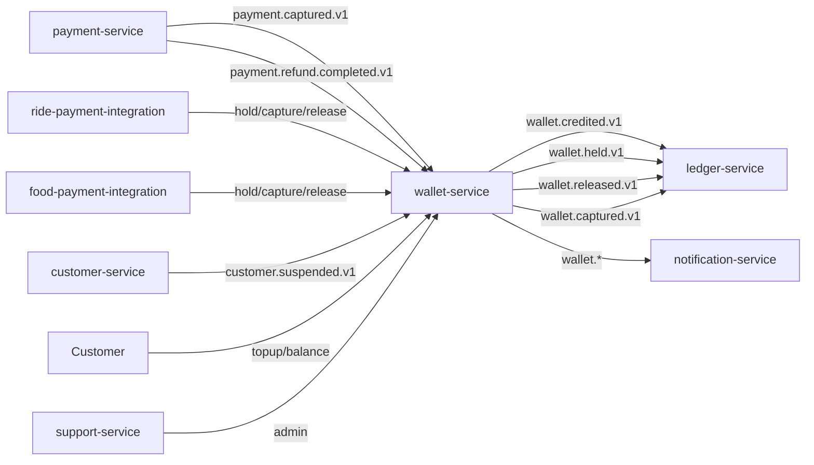

# wallet-service — Software Requirements Specification

## 1. Introduction

This document specifies the software behaviour of
`wallet-service`. It is the engineering source of truth for the
wallet's API, the hold / capture / release state machine, and
the reconciliation.

## 2. Scope

- In scope: wallet balance, holds, captures, releases, top-up,
  credits / debits, statement view, daily reconciliation.
- Out of scope: payment provider integration, the platform's
  double-entry ledger, the food / ride payment sagas.

## 3. System Context



## 4. Actors

- `customer` (Keycloak `platform-customer`).
- `payment-service` (system actor).
- `ride-payment-integration-service` (system actor).
- `food-payment-integration-service` (system actor).
- `customer-service` (system actor).
- `admin-service` / `support-service` (Keycloak
  `platform-internal`).

## 5. Functional Requirements

| ID | Requirement | Priority |
|----|-------------|----------|
| FR--001 | Maintain a `wallet` per user with `available_minor`, `held_minor`, `currency`. | MUST |
| FR--002 | Accept `POST /v1/wallets/{user_id}/hold` with `amount_minor`, `currency`, `hold_ttl_minutes` (optional). | MUST |
| FR--003 | Reject the hold if `amount_minor > wallet.available_minor` (422 `INSUFFICIENT_BALANCE`). | MUST |
| FR--004 | Atomically: insert `hold` row, increment `wallet.held_minor`, decrement `wallet.available_minor`. | MUST |
| FR--005 | Accept `POST /v1/wallets/{user_id}/holds/{hold_id}/capture` (commit). | MUST |
| FR--006 | Atomically on capture: insert `transaction` (debit), delete the hold, decrement `wallet.held_minor` (and `lifetime_debited_minor`). | MUST |
| FR--007 | Accept `POST /v1/wallets/{user_id}/holds/{hold_id}/release`. | MUST |
| FR--008 | Atomically on release: delete the hold, decrement `wallet.held_minor`, increment `wallet.available_minor`. | MUST |
| FR--009 | Accept `POST /v1/wallets/{user_id}/topup` with `amount_minor`, `currency`, `payment_method_token`. | MUST |
| FR--010 | On top-up, call `payment-service` for capture; on success, credit the wallet. | MUST |
| FR--011 | On `payment.captured.v1` (with `destination=wallet`), credit the wallet. | MUST |
| FR--012 | On `payment.refund.completed.v1` (with `destination=wallet`), debit the wallet. | MUST |
| FR--013 | Auto-release holds older than `hold_ttl_minutes` (default 60). | SHOULD |
| FR--014 | Provide `GET /v1/wallets/{user_id}` (balance). | MUST |
| FR--015 | Provide `GET /v1/wallets/{user_id}/transactions?from=…&to=…` (cursor pagination). | MUST |
| FR--016 | Provide `GET /v1/wallets/{user_id}/statement?period=daily|weekly|monthly`. | MUST |
| FR--017 | Support `POST /v1/wallets/{user_id}/admin-adjust` (admin; with audit note). | MUST |
| FR--018 | Reject any operation if the customer is `suspended` (403 `CUSTOMER_SUSPENDED`). | MUST |
| FR--019 | Make every operation idempotent on `Idempotency-Key`. | MUST |
| FR--020 | Emit `wallet.credited.v1`, `wallet.debited.v1`, `wallet.held.v1`, `wallet.released.v1`, `wallet.captured.v1` on the outbox. | MUST |
| FR--021 | Run a daily reconciliation against `ledger-service` and report drift. | MUST |
| FR--022 | Reject any operation that is older than 5 minutes (clock-skew guard). | MUST |

## 6. Non-Functional Requirements

| ID | Category | Requirement | Target |
|----|----------|-------------|--------|
| NFR--001 | performance | Balance read P99 | ≤ 50ms |
| NFR--002 | performance | Hold / capture / release P99 | ≤ 100ms |
| NFR--003 | performance | Top-up P99 | ≤ 5s |
| NFR--004 | availability | Service uptime | 99.95% / 30d |
| NFR--005 | scalability | Concurrent active wallets | ≥ 10M |
| NFR--006 | scalability | Hold / capture throughput | 500 rps |
| NFR--007 | maintainability | MTTR | ≤ 30 min |
| NFR--008 | observability | End-to-end trace per transaction | 100% |
| NFR--009 | consistency | Invariant: `available + held = credits - debits` | enforced |

## 7. API Requirements

- All non-idempotent `POST` endpoints require `Idempotency-Key`.
- All responses use the standard error envelope.
- All endpoints validate input with JSON Schema.
- Full contracts: `INTEGRATION.md`.

## 8. Data Requirements

| ID | Requirement | Notes |
|----|-------------|-------|
| DATA--001 | `user_id` is a UUID (cross-service ref to `identity-service`); no DB FK. | |
| DATA--002 | The `transactions` table is append-only and range-partitioned by month. | |
| DATA--003 | The `holds` table is append-only; holds are "deleted" by inserting a `released` or `captured` row (or by a status column). | |
| DATA--004 | Money values are `amount_minor BIGINT` + `currency CHAR(3)`. | |
| DATA--005 | No PII is stored. | |

## 9. Validation Rules

- `amount_minor > 0` for all amounts.
- `currency` is a valid ISO 4217 code.
- A hold's `amount_minor` ≤ wallet's `available_minor`.
- A capture's `amount_minor` = the hold's `amount_minor`.

## 10. State Transitions

`Hold` state machine:

```
[*] → active → captured (commit)
            → released (cancel)
active → auto_released (TTL)
captured → [*]
released → [*]
auto_released → [*]
```

## 11. Authorization Requirements

- Users may only read their own wallet (`user_id == sub`).
- Admins require `wallet.admin` for manual adjustments.
- Service-to-service callers require `wallet.write` or
  `wallet.read`.

## 12. Configuration Requirements

- Reads `wallet.*` from `configuration-service` at startup and
  on `configuration.updated.v1`.
- All numeric config validated against min/max bounds.

## 13. Error Handling

| Error | Response |
|-------|----------|
| Insufficient balance | 422 `INSUFFICIENT_BALANCE` |
| Hold not found | 404 `HOLD_NOT_FOUND` |
| Hold not active | 409 `HOLD_NOT_ACTIVE` |
| Wallet not found | 404 `WALLET_NOT_FOUND` |
| Customer suspended | 403 `CUSTOMER_SUSPENDED` |
| Idempotency-Key reused | 422 `IDEMPOTENCY_KEY_REUSED` |
| Top-up fails (provider) | 422 `TOPUP_FAILED` |

## 14. Concurrency Requirements

- A row-level lock on the `wallet` row is acquired at every
  state-changing operation.
- The optimistic concurrency on the `wallet.version` column is
  used to detect concurrent updates.

## 15. Idempotency Requirements

- All `POST` endpoints require `Idempotency-Key`.
- The hold idempotency key is
  `wallet:<user_id>:hold:<request_id>`.
- The capture idempotency key is
  `wallet:<user_id>:hold:<hold_id>:capture`.
- Replays return the original response.

## 16. Performance

- Dominant path: receive request, lock the wallet row, update
  the balance, insert a transaction, emit an event.
- P50 / P95 / P99: see NFRs.
- Hot spot: the wallet row lock. Mitigated by sharding by
  `user_id` (no single wallet is a hot row under normal load).

## 17. Scalability

- Horizontal: stateless; HPA on `kafka_consumer_lag` and
  `wallet_transactions_total`.
- Vertical: bounded by PostgreSQL connection pool.

## 18. Availability

- SLO: 99.95% over 30 days.
- Maintenance: rolling deploys only.
- Degraded mode: if `payment-service` is down, top-ups are
  blocked; holds / captures continue.

## 19. Security

| ID | Requirement | Notes |
|----|-------------|-------|
| SEC--001 | All endpoints require JWT bearer validated at the gateway. | |
| SEC--002 | Users may only read their own wallet. | |
| SEC--003 | No PII is stored. | |
| SEC--004 | Admin manual adjustments are audit-logged. | `admin.action.performed.v1`. |
| SEC--005 | Rate limit: 10 hold/capture per user per minute. | At the service. |

## 20. Privacy

- PII stored: none.
- Retention: 7 years (financial).
- Erasure: not applicable.

## 21. Auditability

- Every transaction is in `transactions` (append-only).
- Every hold is in `holds` (with `state` history).
- Admin manual adjustments emit `admin.action.performed.v1`.
- Reconciliation runs emit
  `wallet.audit.reconciled.v1` (or
  `reconciliation_drift.v1` on drift).

## 22. Observability

- Logs: JSON, fields include `correlation_id`, `wallet_id`,
  `user_id`, `transaction_id`, `hold_id`.
- Metrics: `wallet_credit_total{currency}`,
  `wallet_debit_total{currency}`,
  `wallet_hold_total{currency}`,
  `wallet_balance_total{currency}`,
  `wallet_topup_total{currency,method}`,
  `wallet_reconciliation_drift`.
- Traces: OpenTelemetry; root span per transaction.
- Alerts: SLO burn-rate; reconciliation drift > 0; hold TTL
  backlog > 1000.

## 23. Maintainability

- Code style: TypeScript strict, ESLint with platform rules.
- Test coverage: ≥ 80% line, ≥ 75% branch; 100% on the hold /
  capture / release state machine.
- Documentation: this folder + `WORKFLOWS.md` diagrams.

## 24. Disaster Recovery

- RPO: 5 minutes (the wallet table is replicated to standby
  region).
- RTO: 30 minutes (stateless service).

## 25. Acceptance Criteria

- All FR/NFR are met and verified by automated tests.
- All SEC are met and verified by a security review.
- A load test sustains 500 hold/capture / second with p99 ≤ 100ms.
- A chaos test (kill `payment-service`) shows top-ups are
  blocked but holds continue.
- Reconciliation reports zero drift over 7 days.

---

## See also

### Sibling docs for this service

- [`README.md`](./README.md) — purpose, bounded context, responsibilities
- [`BRD.md`](./BRD.md) — business requirements
- [`SRS.md`](./SRS.md) — functional + non-functional requirements
- [`ERD.md`](./ERD.md) — data model (entities, relationships)
- [`INTEGRATION.md`](./INTEGRATION.md) — inter-service contracts (APIs, events, sagas)
- [`WORKFLOWS.md`](./WORKFLOWS.md) — operational workflows (happy paths, failure modes)
- [`TECH.md`](./TECH.md) — technology profile (runtime, libraries, data layer, admin endpoints, RBAC)

### Platform-wide

- [`../../shared/README.md`](../../shared/README.md) — `platform-spring-boot-starter` shared library (the single source of cross-cutting code for all Spring Boot services in the platform)
- [`../RECOMMENDATIONS.md`](../RECOMMENDATIONS.md) — platform-wide technology map (language, framework, version baseline, admin/RBAC pattern)
- [`../../README.md`](../../README.md) — services overview (the catalog of all 58 services)
- [`../../../main.md`](../../../main.md) — top-level platform specification (architecture, Keycloak, PostgreSQL 18, messaging, observability baseline)

