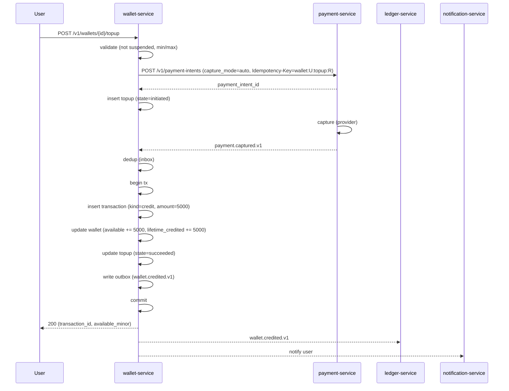
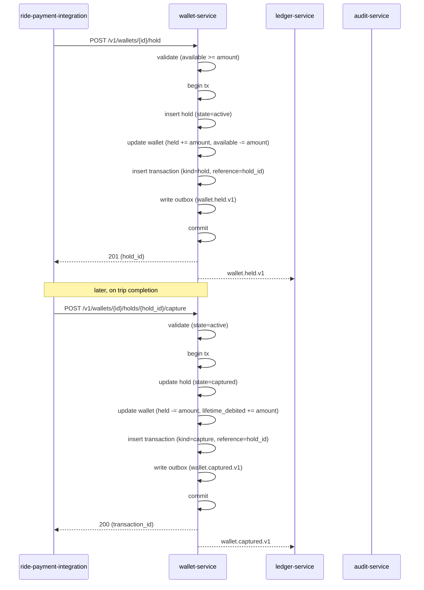
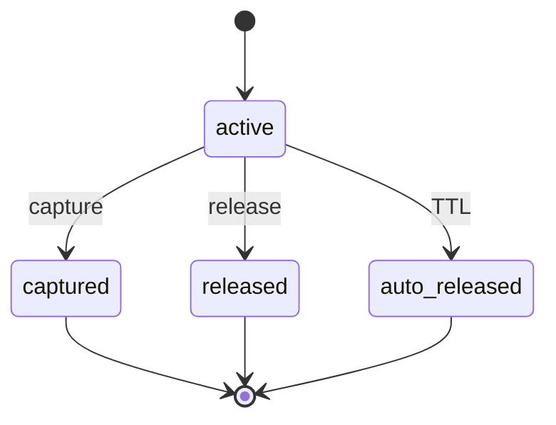
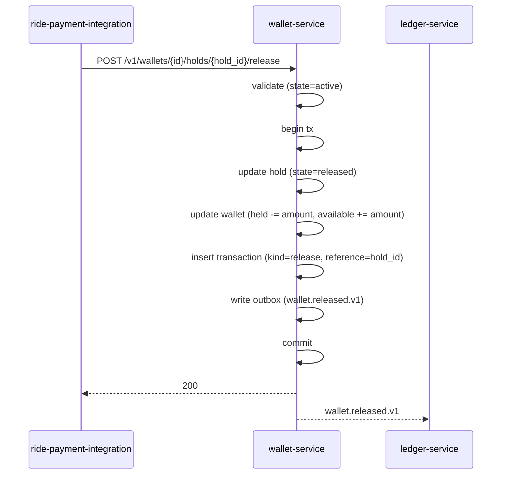
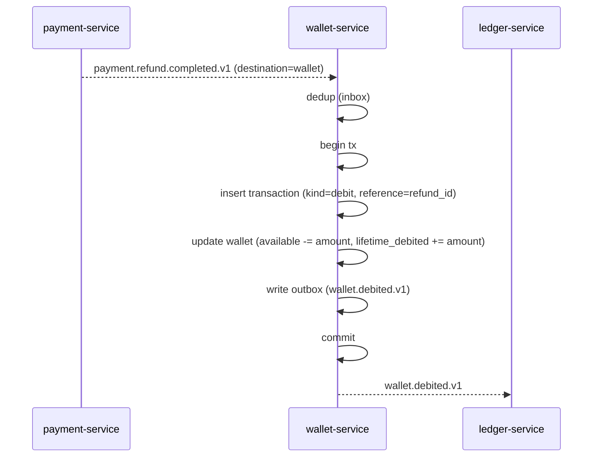
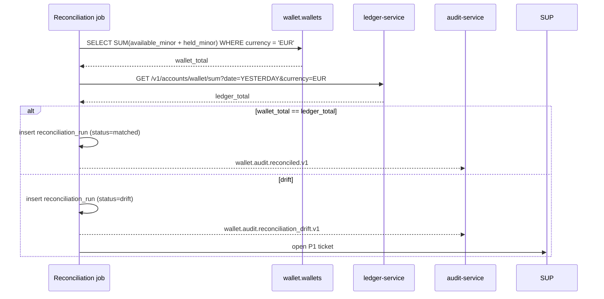

# wallet-service — Workflows

## 1. `Top-Up via Payment Method` (Happy Path)

### 1.1 Objective

Charge the user's payment method; on success, credit the wallet.

### 1.2 Initiating Actor

Customer (mobile app) calls `POST /v1/wallets/{user_id}/topup`.

### 1.3 Participating Services

- `wallet-service` (this service)
- `payment-service` (charge the payment method)
- `ledger-service` (records the credit posting)
- `notification-service` (notifies the user)

### 1.4 Prerequisites

- The user has a valid `payment_method_token`.
- The user is not suspended.

### 1.5 Happy Path



### 1.6 Alternate Paths

- **3-D Secure challenge**: the provider returns a redirect URL;
  the user is told to authenticate; on return, the top-up
  completes.

### 1.7 Failure Paths

- **Provider decline**: topup.state=failed; user is told.
- **User suspended**: 403.
- **Below min / above max**: 422.

### 1.8 Business Rules

- The top-up is idempotent on `Idempotency-Key`.
- The credit is only applied after the provider confirms
  capture.

### 1.9 State Transitions

`Topup`: `initiated → succeeded | failed`.

### 1.10 Events

| Event | Direction | When |
|-------|-----------|------|
| `payment.captured.v1` | consumed | on capture |
| `wallet.credited.v1` | produced | on credit |

### 1.11 APIs Involved

| API | Direction | When |
|-----|-----------|------|
| `POST /v1/wallets/{id}/topup` | inbound | user |
| `POST /v1/payment-intents` | outbound | to payment-service |

### 1.12 Compensation / Rollback

- If the credit is applied but the user disputes the charge, a
  manual adjustment (debit) is applied.

### 1.13 Final State

- Wallet: `available` increased.
- `topup` in `succeeded`.
- `wallet.credited.v1` emitted.

## 2. `Hold → Capture` (Happy Path)

### 2.1 Objective

Reserve funds for a pending charge; commit them when the charge
is finalised.

### 2.2 Initiating Actor

`ride-payment-integration-service` (or
`food-payment-integration-service`).

### 2.3 Participating Services

- `wallet-service` (this service)
- `ledger-service` (records the hold and capture)
- The integration service (consumer of the events)

### 2.4 Prerequisites

- The wallet's `available_minor` ≥ the hold amount.
- The user is not suspended.

### 2.5 Happy Path



### 2.6 Alternate Paths

- **Hold has a `related_payment_intent_id`**: the service uses
  the unique constraint on `related_payment_intent_id` to
  prevent duplicate holds for the same payment intent.

### 2.7 Failure Paths

- **Insufficient balance**: 422; the integration service is
  told; the ride / food order is compensated.
- **Hold not active**: 409; the integration service retries
  with a fresh hold.

### 2.8 Business Rules

- A hold's amount ≤ `available`.
- A capture's amount = the hold's amount (the unique constraint
  on `related_payment_intent_id` enforces 1:1).

### 2.9 State Transitions



### 2.10 Events

| Event | Direction | When |
|-------|-----------|------|
| `wallet.held.v1` | produced | on hold |
| `wallet.captured.v1` | produced | on capture |

### 2.11 APIs Involved

| API | Direction | When |
|-----|-----------|------|
| `POST /v1/wallets/{id}/hold` | inbound | service |
| `POST /v1/wallets/{id}/holds/{hold_id}/capture` | inbound | service |

### 2.12 Compensation / Rollback

- A release returns the amount to available (see §3).
- A failed capture is rare; the integration service is notified
  to retry.

### 2.13 Final State

- Hold: `captured`.
- Wallet: `available` decreased; `lifetime_debited` increased.

## 3. `Hold Release` (Cancellation)

### 3.1 Objective

Cancel a hold (e.g. order cancelled) and return the funds to
available.

### 3.2 Initiating Actor

`ride-payment-integration-service` or
`food-payment-integration-service` (on cancellation).

### 3.3 Participating Services

- `wallet-service` (this service)
- `ledger-service` (records the release)

### 3.4 Prerequisites

- The hold is in `active`.

### 3.5 Happy Path



### 3.6 Alternate Paths

- **Auto-release (TTL)**: a scheduler picks up holds whose
  `expires_at` is past; releases them; emits the same event.

### 3.7 Failure Paths

- **Hold not active**: 409.

### 3.8 Business Rules

- A release returns the amount to available.
- The release is idempotent on `Idempotency-Key`.

### 3.9 State Transitions

See §2.9.

### 3.10 Events

| Event | Direction | When |
|-------|-----------|------|
| `wallet.released.v1` | produced | on release |

### 3.11 APIs Involved

| API | Direction | When |
|-----|-----------|------|
| `POST /v1/wallets/{id}/holds/{hold_id}/release` | inbound | service |

### 3.12 Compensation / Rollback

None — the release is the compensation.

### 3.13 Final State

- Hold: `released`.
- Wallet: `available` increased.

## 4. `Closed-Loop Refund` (Wallet Debit)

### 4.1 Objective

On `payment.refund.completed.v1` with `destination=wallet`, debit
the wallet.

### 4.2 Initiating Actor

`payment-service` emits `payment.refund.completed.v1`.

### 4.3 Participating Services

- `payment-service` (producer)
- `wallet-service` (this service)
- `ledger-service` (records the debit)

### 4.4 Prerequisites

- The wallet has sufficient balance (rare; the refund amount
  should match the original charge).

### 4.5 Happy Path



### 4.6 Alternate Paths

- **Insufficient balance** (rare): the debit is queued; a
  P3 ticket is opened; an admin manually adjusts.

### 4.7 Failure Paths

- **Wallet not found**: 422; reconciliation catches up.

### 4.8 Business Rules

- The debit is idempotent on the `payment.refund.completed.v1`
  `event_id`.
- The reference is the provider's refund id.

### 4.9 State Transitions

N/A (terminal transaction).

### 4.10 Events

| Event | Direction | When |
|-------|-----------|------|
| `payment.refund.completed.v1` | consumed | on refund |
| `wallet.debited.v1` | produced | on debit |

### 4.11 APIs Involved

None direct.

### 4.12 Compensation / Rollback

- A "refund of refund" is a new positive credit (admin-only).

### 4.13 Final State

- Wallet: `available` decreased.
- `transactions` row present.

## 5. `Daily Reconciliation`

### 5.1 Objective

Compare the wallet's total `available + held` against the
wallet account in `ledger-service`; report drift.

### 5.2 Initiating Actor

A scheduled job at 03:00 UTC daily.

### 5.3 Participating Services

- `wallet-service` (this service)
- `ledger-service` (provides the wallet account total)
- `support-service` (consumer of drift events)

### 5.4 Prerequisites

- Yesterday's transactions are immutable.

### 5.5 Happy Path



### 5.6 Alternate Paths

- **`ledger-service` down**: the run is `error`; retried after
  1h.

### 5.7 Failure Paths

- **Drift persists > 1 day**: severity escalates; finance is
  looped in.

### 5.8 Business Rules

- Reconciliation runs at most once per day per currency.
- Drift is computed as `wallet_total - ledger_total` in minor
  units; per-user diffs are stored in `details`.

### 5.9 State Transitions

Reconciliation runs: `running → matched | drift | error`.

### 5.10 Events

| Event | Direction | When |
|-------|-----------|------|
| `wallet.audit.reconciled.v1` | produced | on match |
| `wallet.audit.reconciliation_drift.v1` | produced | on drift |

### 5.11 APIs Involved

| API | Direction | When |
|-----|-----------|------|
| `GET /v1/accounts/wallet/sum` | outbound | to ledger-service |

### 5.12 Compensation / Rollback

- A drift is repaired by an ops / finance investigation; the
  correction is a manual `admin_adjust` transaction.

### 5.13 Final State

- A `reconciliation_runs` row present.
- If drift: a P1 ticket is open.

---

## 99. `Monthly Partition Maintenance`

### 99.1 Objective

Idempotently pre-create the next 12 months for partitioned tables in `wallet`. The drop half is handled by the per-service retention job.

### 99.2 Initiating Actor

A scheduled job runs daily at `02:00 UTC`. Leader-elected via `pg_try_advisory_xact_lock(hashtext('wallet.partition'), hashtext('monthly'))`.

### 99.3 Happy Path

```mermaid
sequenceDiagram
    participant JOB as Partition job
    participant PG as PostgreSQL
    JOB->>PG: pg_try_advisory_xact_lock('wallet.monthly')
    alt lock acquired
        loop for each missing month in next 12
            JOB->>PG: CREATE TABLE IF NOT EXISTS wallet.<table>_YYYY_MM PARTITION OF wallet.<table>
            JOB->>PG: verify (pg_inherits, relpartbound)
        end
        JOB->>PG: assert now() in existing child
    else lock NOT acquired
        Note over JOB: another instance is running; exit cleanly
    end
```

### 99.4 Failure Paths

| Failure | Handling |
|---------|----------|
| Lock contention | exit 0 |
| DDL fails | retry 3× with backoff (1 s / 4 s / 16 s); page on-call |
| Today's child missing | critical alert; INSERTs would fail |

### 99.5 Business Rules

- Pre-create next 12 complete future months.
- Every child is created with `CREATE TABLE IF NOT EXISTS … PARTITION OF …` so the job is safe to run twice in the same window.
- A verification step (`pg_inherits` parent + `relpartbound` range) runs after every `CREATE TABLE IF NOT EXISTS` because `IF NOT EXISTS` only guards the name, not the bounds.
- Optionally emit `audit.partition.maintained.v1` on success.

---

## See also

### Sibling docs for this service

- [`README.md`](./README.md) — purpose, bounded context, responsibilities
- [`BRD.md`](./BRD.md) — business requirements
- [`SRS.md`](./SRS.md) — functional + non-functional requirements
- [`ERD.md`](./ERD.md) — data model (entities, relationships)
- [`INTEGRATION.md`](./INTEGRATION.md) — inter-service contracts (APIs, events, sagas)
- [`WORKFLOWS.md`](./WORKFLOWS.md) — operational workflows (happy paths, failure modes)
- [`TECH.md`](./TECH.md) — technology profile (runtime, libraries, data layer, admin endpoints, RBAC)

### Platform-wide

- [`../../shared/README.md`](../../shared/README.md) — `platform-spring-boot-starter` shared library (the single source of cross-cutting code for all Spring Boot services in the platform)
- [`../RECOMMENDATIONS.md`](../RECOMMENDATIONS.md) — platform-wide technology map (language, framework, version baseline, admin/RBAC pattern)
- [`../../README.md`](../../README.md) — services overview (the catalog of all 58 services)
- [`../../../main.md`](../../../main.md) — top-level platform specification (architecture, Keycloak, PostgreSQL 18, messaging, observability baseline)

