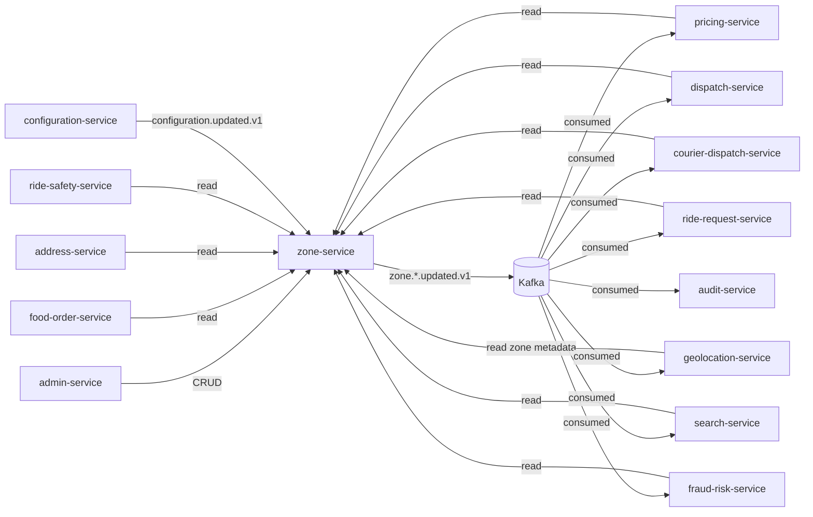
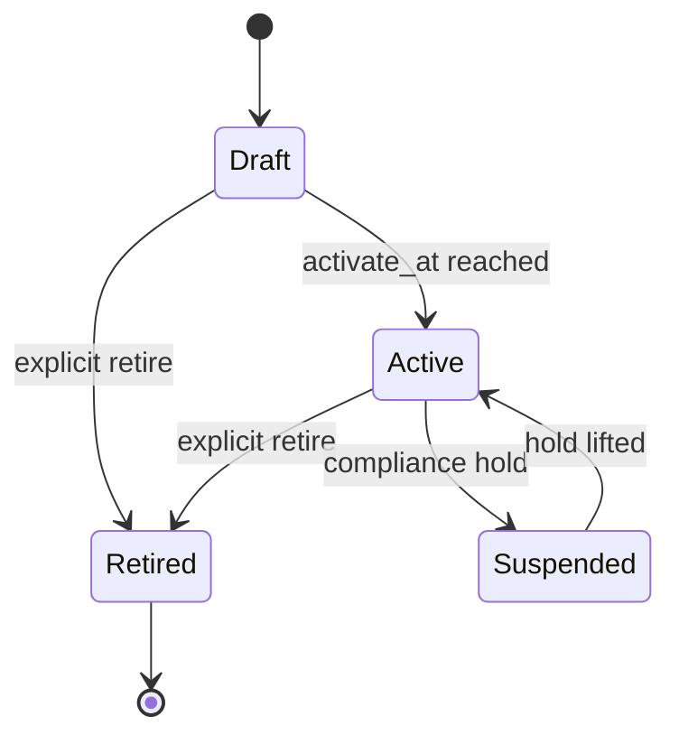

# zone-service — Software Requirements Specification

## 1. Introduction

This SRS specifies, for the engineering team, the functional,
non-functional, data, security, and operational requirements of
`zone-service`. It is derived from `BRD.md` and from the
platform's cross-service architecture (`API_STANDARDS.md`,
`DATABASE_ARCHITECTURE.md`, `EVENT_ARCHITECTURE.md`,
`SECURITY_ARCHITECTURE.md`, `OBSERVABILITY.md`).

## 2. Scope

In scope:

- All REST endpoints listed in `INTEGRATION.md` (cities, service
  zones, surge zones, restricted zones, point-in-zone,
  polygon-intersects).
- PostGIS-backed storage of all polygons with `ST_IsValid`
  validation.
- Time-bound zone hours with per-weekday and holiday rules.
- Event emission for every change.
- Read-through cache in Redis for hot path queries.

Out of scope:

- Live driver / courier location.
- Pricing computation.
- Trip / order state.
- City onboarding workflow UI (admin console lives in
  `admin-service`).

## 3. System Context

## 4. Actors

| Actor | Type | Description |
|-------|------|-------------|
| Admin (operations) | human | CRUD on cities, zones, surge, restricted |
| Admin (city ops) | human | CRUD on their own city only |
| Admin (platform engineer) | human | emergency edits, schema migrations |
| `pricing-service` | system | reads zones, surge multipliers |
| `dispatch-service` | system | reads service + restricted zones |
| `courier-dispatch-service` | system | reads service + restricted zones |
| `ride-request-service` | system | reads service zones |
| `food-order-service` | system | reads service zones |
| `address-service` | system | reads cities |
| `geolocation-service` | system | reads zone metadata for cache-key scoping |
| `fraud-risk-service` | system | reads zones for risk scoring |
| `search-service` | system | reads zones for filtering |
| `ride-safety-service` | system | reads restricted zones |
| `configuration-service` | system | publishes `configuration.updated.v1` |

## 5. Functional Requirements

| ID | Requirement | Priority |
|----|-------------|----------|
| FR--001 | The service MUST expose CRUD endpoints for cities (`POST /v1/cities`, `GET /v1/cities`, `GET /v1/cities/{id}`, `PATCH /v1/cities/{id}`). | MUST |
| FR--002 | The service MUST expose CRUD endpoints for service zones (`POST /v1/zones`, `GET /v1/zones`, `GET /v1/zones/{id}`, `PATCH /v1/zones/{id}`, `POST /v1/zones/{id}/retire`). | MUST |
| FR--003 | The service MUST expose CRUD endpoints for surge zones (`POST /v1/surge-zones`, `GET /v1/surge-zones`, `GET /v1/surge-zones/{id}`, `PATCH /v1/surge-zones/{id}`). | MUST |
| FR--004 | The service MUST expose CRUD endpoints for restricted zones (`POST /v1/restricted-zones`, `GET /v1/restricted-zones`, `GET /v1/restricted-zones/{id}`, `PATCH /v1/restricted-zones/{id}`). | MUST |
| FR--005 | The service MUST expose `POST /v1/zones/contains` accepting a coordinate and returning all matching service / surge / restricted zones for the point, ordered deterministically. | MUST |
| FR--006 | The service MUST expose `POST /v1/zones/intersects` accepting a polygon and returning all zones whose polygon overlaps it, used by admins to detect overlap before save. | MUST |
| FR--007 | The service MUST expose `GET /v1/cities/lookup` accepting a coordinate and returning the enclosing city (or 404 if none). | MUST |
| FR--008 | The service MUST validate every polygon before persisting (`ST_IsValid`, `ST_IsSimple`, `ST_Within(zone, city)`, area ≤ `zone.polygon.max_area_km2`, SRID 4326). | MUST |
| FR--009 | The service MUST emit `zone.city.updated.v1`, `zone.updated.v1`, `zone.surge.updated.v1`, `zone.restricted.updated.v1`, `zone.deleted.v1` for every change, with the right `aggregate_id` and `correlation_id`. | MUST |
| FR--010 | The service MUST support time-bound zones via `zone_hours` (per weekday + holiday calendar) and answer time-sensitive `contains` queries correctly. | MUST |
| FR--011 | The service MUST support restricted zone types: `no_pickup`, `no_dropoff`, `no_idle`, `surge_only`. | MUST |
| FR--012 | The service MUST support surge multipliers in `[1.0, zone.surge.max_multiplier]` (configurable upper bound, default 10.0). | MUST |
| FR--013 | The service MUST support `draft` zones with an `activate_at` timestamp; a background job promotes them to active at that time. | SHOULD |
| FR--014 | The service MUST support a "legal hold" flag on restricted zones that prevents deletion (admin must clear the hold first). | MUST |
| FR--015 | The service MUST support `Idempotency-Key` on all state-changing POSTs. | MUST |
| FR--016 | The service MUST require HMAC-SHA256 signature on all state-changing admin requests (Vault-stored per-tenant key). | MUST |
| FR--017 | The service MUST document an OpenAPI 3.1 spec at `/openapi.json`. | MUST |
| FR--018 | The service MUST detect overlapping service zones in the same city at write time and emit a warning (allowed but warned). | SHOULD |
| FR--019 | The service MUST support soft delete (`deleted_at`); reads MUST filter `WHERE deleted_at IS NULL`. | MUST |
| FR--020 | The service MUST cache `contains` results in Redis with `zone.cache.contains.ttl_seconds`; invalidate on every `zone.*.updated.v1`. | MUST |

## 6. Non-Functional Requirements

| ID | Category | Requirement | Target |
|----|----------|-------------|--------|
| NFR--001 | performance | P99 `POST /v1/zones/contains` (cache hit) | ≤ 50 ms |
| NFR--002 | performance | P99 `POST /v1/zones/contains` (cache miss) | ≤ 150 ms |
| NFR--003 | performance | P99 `GET /v1/cities/lookup` | ≤ 30 ms |
| NFR--004 | performance | P99 zone-update propagation (admin save → consumer ack) | ≤ 5 s P95 |
| NFR--005 | availability | service uptime | 99.95% (T1) |
| NFR--006 | scalability | point-in-zone queries per second per replica | ≥ 1000 |
| NFR--007 | maintainability | MTTR | ≤ 30 min |
| NFR--008 | correctness | polygon validation rejection rate at write | 100% of invalid polygons rejected |
| NFR--009 | observability | all errors have `correlation_id` and `trace_id` | 100% |
| NFR--010 | auditability | all zone edits in audit log | 100% |
| NFR--011 | resilience | DB fail-over to read replica | ≤ 30 s |

## 7. API Requirements

- All public endpoints follow `architecture/API_STANDARDS.md`:
  - REST, JSON, UTF-8.
  - URI versioned (`/v1/...`).
  - Bearer JWT (validated at gateway); internal calls use
    client-credentials tokens.
  - Cursor pagination on list endpoints.
  - Errors follow the platform envelope (see INTEGRATION.md).
  - `Idempotency-Key` required on state-changing POSTs.
  - `X-Correlation-Id` and `traceparent` propagated.

(Full contract in INTEGRATION.md.)

## 8. Data Requirements

| ID | Requirement | Notes |
|----|-------------|-------|
| DATA--001 | All tables live in schema `zone`. | per `DATABASE_ARCHITECTURE.md` |
| DATA--002 | Polygons stored as PostGIS `geometry(Polygon, 4326)`. | SRID 4326 = WGS84 |
| DATA--003 | Every polygon column has a GIST index. | required for `ST_Intersects`, `ST_Within`, `ST_DWithin` |
| DATA--004 | Primary keys are UUIDv7. | per platform standard |
| DATA--005 | Cross-service references (e.g. `merchant_id` if any) are UUID columns WITHOUT database FKs. | per `DATA_OWNERSHIP.md` |
| DATA--006 | Every mutable table has `created_at`, `updated_at`, `created_by`, `updated_by`, `deleted_at`. | per platform standard |
| DATA--007 | Soft delete: `deleted_at TIMESTAMPTZ NULL`; reads filter `WHERE deleted_at IS NULL`. | |
| DATA--008 | Zone hours stored as a child table (`zone_hours`) with `(zone_id, weekday, opens_at, closes_at)`. | `weekday ∈ {0..6}` |
| DATA--009 | Holiday calendar stored as a child table (`zone_holiday_overrides`) with `(zone_id, holiday_date, opens_at, closes_at, is_closed)`. | |
| DATA--010 | JSONB allowed only for: zone metadata (e.g. extra rules), polygon_validation log. | never used in hot WHERE |

## 9. Validation Rules

- **City**: `country_code` ISO 3166-1 alpha-2; `timezone` IANA;
  `currency` ISO 4217; `polygon` valid, SRID 4326; area ≤
  `zone.polygon.max_area_km2` × 100 (cities are big).
- **Service zone**: `polygon` valid, simple, inside city,
  area ≤ `zone.polygon.max_area_km2`; `vertical` ∈
  `configuration.supported_verticals`; `allowed_ride_types` (if
  specified) ∈ configured ride types.
- **Surge zone**: `polygon` valid, inside city; `multiplier`
  ∈ `[1.0, zone.surge.max_multiplier]`; `time_windows` valid.
- **Restricted zone**: `polygon` valid, inside city;
  `type ∈ {no_pickup, no_dropoff, no_idle, surge_only}`;
  `reason` non-empty.
- **Hours**: `opens_at < closes_at`; same-day hours only
  (no overnight wrap).
- **Admin request body**: HMAC signature required, signature
  stored on the audit row, replay-safe with timestamp.

## 10. State Transitions

Pointer: see `WORKFLOWS.md` §1, §2, §3, §5. The state machine
for a zone is:

## 11. Authorization Requirements

- Read endpoints: any authenticated principal with a `customer`,
  `driver`, `courier`, `merchant_staff`, `service`, or
  `admin` role may call. Rate-limited per `sub`.
- Write endpoints (`POST /v1/cities`, `POST /v1/zones`,
  etc.): role `admin` or `city_ops`. `city_ops` may only edit
  cities whose `tenant_id` matches the actor's `X-Tenant-Id`
  claim.
- `POST /v1/cities/{id}/retire`: role `platform_engineer` +
  co-signature.
- `POST /v1/restricted-zones/{id}` with `legal_hold=true`:
  role `compliance_officer` + co-signature.
- Service-to-service calls (read) use client-credentials
  tokens from the `platform-services` realm.

## 12. Configuration Requirements

- `zone.default_country` — ISO 3166-1 alpha-2 (default `US`).
- `zone.supported_verticals` — array (default `["ride", "food"]`).
- `zone.surge.max_multiplier` — number (default 10.0).
- `zone.polygon.max_area_km2` — number (default 500).
- `zone.holiday_calendar_locale` — string (default `en`).
- `zone.cache.contains.ttl_seconds` — int (default 300).
- `zone.cache.surge.ttl_seconds` — int (default 30).
- `zone.draft.activate_poll_interval_seconds` — int (default 30).
- All keys hot-reloadable on `configuration.updated.v1`.

## 13. Error Handling

| Error | When | Response |
|-------|------|----------|
| `VALIDATION_FAILED` | input schema or business validation fails | 400 with field-level `details[]` |
| `UNAUTHENTICATED` | missing / invalid bearer | 401 |
| `FORBIDDEN` | role missing or tenant mismatch | 403 |
| `NOT_FOUND` | resource not found or soft-deleted | 404 |
| `CONFLICT` | version mismatch on PATCH | 409 |
| `POLYGON_SELF_INTERSECTS` | `ST_IsValid` fails | 422 |
| `POLYGON_OUTSIDE_CITY` | not inside the city polygon | 422 |
| `POLYGON_TOO_LARGE` | exceeds `zone.polygon.max_area_km2` | 422 |
| `POLYGON_INVALID_SRID` | SRID is not 4326 | 422 |
| `SIGNATURE_INVALID` | HMAC mismatch | 409 |
| `IDEMPOTENCY_KEY_REUSED` | key with different body | 422 |
| `LEGAL_HOLD_ACTIVE` | cannot delete a restricted zone on legal hold | 409 |
| `INTERNAL_ERROR` | unexpected | 500 |

All errors include `correlationId` and follow
`architecture/API_STANDARDS.md` §11.

## 14. Concurrency Requirements

- Polygon writes are serialized per city via
  `SELECT … FOR UPDATE` on the city row. Two admins editing
  zones in the same city cannot interleave.
- PATCH uses optimistic concurrency: client sends
  `If-Match: <version>`; server returns 409 `VERSION_MISMATCH`
  if the row's `version` is higher.
- The draft-to-active promoter uses `SELECT … FOR UPDATE
  SKIP LOCKED` to fan out across multiple workers.
- The point-in-zone cache invalidation is idempotent: a
  duplicate `zone.updated.v1` event is a no-op.

## 15. Idempotency Requirements

- All state-changing POSTs require `Idempotency-Key`. The
  service stores `(actor_sub, idempotency_key, request_hash,
  response_status, response_body, expires_at)` for 24h. On
  duplicate, if `request_hash` matches → return stored
  response; else 422 `IDEMPOTENCY_KEY_REUSED`.
- Event emissions are guarded by the outbox pattern (see
  `EVENT_ARCHITECTURE.md`).

## 16. Performance

- **Dominant path**: `POST /v1/zones/contains` (point-in-zone).
- **P50 / P95 / P99** (cache hit): 5ms / 20ms / 50ms.
- **P50 / P95 / P99** (cache miss): 30ms / 80ms / 150ms.
- Throughput target: 1000 QPS per replica at P99 ≤ 50 ms
  (cache hit).
- Reads use a GIST index on every polygon column; we never
  use `ST_Distance` for filtering (only `ST_DWithin`).

## 17. Scalability

- **Horizontal scaling**: stateless replicas behind a load
  balancer. HPA on CPU 60% and on
  `zone_contains_queries_per_second > 200`. Max replicas 20.
- **Vertical scaling**: typical 500m CPU / 768Mi memory
  requests; 1 CPU / 1.5Gi limits.
- **PostgreSQL**: GIST indexes on every polygon; read replica
  for read-heavy queries (e.g. mobile app's "where do we
  serve?"). Write traffic is small; primary is sufficient.

## 18. Availability

- **SLO**: 99.95% over 30 days. Error budget: ~22 min / 30d.
- **Maintenance window**: Sunday 04:00–06:00 UTC, announced
  7 days in advance.
- **Dependencies**: `geolocation-service` is consulted only
  on zone creation (centroid reverse geocode) — a zone create
  failure does not affect reads.
- **Read path**: if Redis is down, the service falls back to
  direct PostgreSQL (slower but correct).

## 19. Security

| ID | Requirement | Notes |
|----|-------------|-------|
| SEC--001 | All endpoints require a valid bearer JWT; mTLS for admin listener. | per `SECURITY_ARCHITECTURE.md` §4, §14 |
| SEC--002 | Admin signing keys stored in Vault, rotated quarterly. | per `SECURITY_ARCHITECTURE.md` §5 |
| SEC--003 | Tenant isolation: city_ops can only edit cities whose `tenant_id` matches their `X-Tenant-Id`. | per `SECURITY_ARCHITECTURE.md` §16 |
| SEC--004 | Legal hold on restricted zones cannot be removed without role `compliance_officer` + co-signature. | per `SECURITY_ARCHITECTURE.md` §14 |
| SEC--005 | Per-IP and per-`sub` rate limiting at the gateway. | per `SECURITY_ARCHITECTURE.md` §12 |
| SEC--006 | HMAC-SHA256 signature on all admin writes (replay-safe with `X-Signature: t=<unix>,v1=<hex>`). | per `SECURITY_ARCHITECTURE.md` §14 |
| SEC--007 | Every zone edit in the audit log with `actor_sub`, `before`, `after`, `correlation_id`. | per `SECURITY_ARCHITECTURE.md` §9 |
| SEC--008 | Reverse-geocoded centroid address (PII, Confidential) encrypted at rest. | per `SECURITY_ARCHITECTURE.md` §7 |
| SEC--009 | No PAN, CVV, or financial PII ever processed. | per `SECURITY_ARCHITECTURE.md` §8 |

## 20. Privacy

- **PII stored**: zone centroid address (Confidential) if
  reverse-geocoded; admin's `actor_sub` (Internal). The
  polygon itself is not PII.
- **Retention**: zone data is retained indefinitely (with
  soft delete) for audit; hard delete is allowed only after
  the legal hold is cleared and the retention period (7 years
  for financial, 1 year for others) elapses.
- **Erasure**: on a right-to-erasure request via
  `support-service`, no zone-level PII is affected (zones
  don't store per-user data). The audit log is scrubbed of
  `actor_sub` if the actor is the data subject.

## 21. Auditability

- **Audit events**:
  - `zone.*.updated.v1` for every change.
  - `zone.*.deleted.v1` (we treat deletes as state changes).
  - Append-only `zone.zone_audit` table on the same schema
    with `(id, zone_id, action, before, after, actor_sub,
    correlation_id, occurred_at)`. Retained 7y for legal
    hold compatibility.

## 22. Observability

- **Logs**: JSON to stdout; per `OBSERVABILITY.md`. Standard
  fields plus `city_id`, `zone_id`, `actor_sub`, `polygon_valid`.
- **Metrics** (Prometheus):
  - `http_requests_total{route, method, status}`
  - `http_request_duration_seconds{route, method, status}` (histogram)
  - `zone_contains_queries_total{cache_hit, status}`
  - `zone_cities_count`, `zone_service_zones_count{city_id}`,
    `zone_surge_zones_count`, `zone_restricted_zones_count`
  - `polygon_validation_failures_total{reason}`
  - `zone_update_lag_seconds` (histogram, from admin save
    to outbox publish)
  - `surge_multiplier{zone_id}` (gauge, last published)
- **Traces**: OpenTelemetry; root span per request; PostGIS
  queries as child spans. Sample 100% of errors, 10% of
  successes in production; 100% in staging.
- **Alerts**:
  - P95 zone-update propagation > 5 s for 15 min → warn.
  - P99 point-in-zone (cache hit) > 100 ms for 15 min → warn.
  - Polygon validation failure rate > 0% in production → page.
  - Service uptime < 99.95% over 30d → error budget alert.

## 23. Maintainability

- **Code style**: Go 1.22, `gofmt`, `go vet`, `golangci-lint`.
- **Test coverage**: ≥ 85% statements, ≥ 80% branches.
- **Documentation**: OpenAPI 3.1 spec under
  `services/zone-service/openapi.yaml`; CI validates the
  spec and the implementation match.

## 24. Disaster Recovery

- **RPO**: 1h. Zone data is small; nightly PITR is enough.
- **RTO**: 30 min. Stateless service; replicas can be
  promoted; PostgreSQL primary can be re-created from the
  read replica.

## 25. Acceptance Criteria

- All 20 functional requirements implemented and verified by
  automated tests.
- All 11 non-functional requirements met in production
  telemetry for the prior 30 days.
- All 9 security requirements verified by an internal
  security review prior to launch.
- A new city (fixtures) can be created end-to-end in staging
  in ≤ 30 minutes.
- A load test sustains 10k QPS on `POST /v1/zones/contains`
  in staging with P99 ≤ 50 ms (cache hit) on 4 replicas.

---

## See also

### Sibling docs for this service

- [`README.md`](./README.md) — purpose, bounded context, responsibilities
- [`BRD.md`](./BRD.md) — business requirements
- [`SRS.md`](./SRS.md) — functional + non-functional requirements
- [`ERD.md`](./ERD.md) — data model (entities, relationships)
- [`INTEGRATION.md`](./INTEGRATION.md) — inter-service contracts (APIs, events, sagas)
- [`WORKFLOWS.md`](./WORKFLOWS.md) — operational workflows (happy paths, failure modes)
- [`TECH.md`](./TECH.md) — technology profile (runtime, libraries, data layer, admin endpoints, RBAC)

### Platform-wide

- [`../../shared/README.md`](../../shared/README.md) — `platform-spring-boot-starter` shared library (the single source of cross-cutting code for all Spring Boot services in the platform)
- [`../RECOMMENDATIONS.md`](../RECOMMENDATIONS.md) — platform-wide technology map (language, framework, version baseline, admin/RBAC pattern)
- [`../../README.md`](../../README.md) — services overview (the catalog of all 58 services)
- [`../../../main.md`](../../../main.md) — top-level platform specification (architecture, Keycloak, PostgreSQL 18, messaging, observability baseline)

