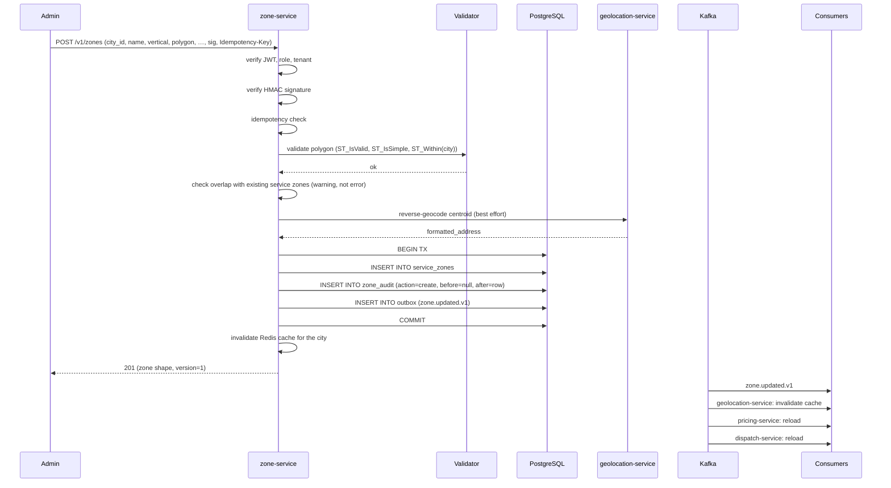
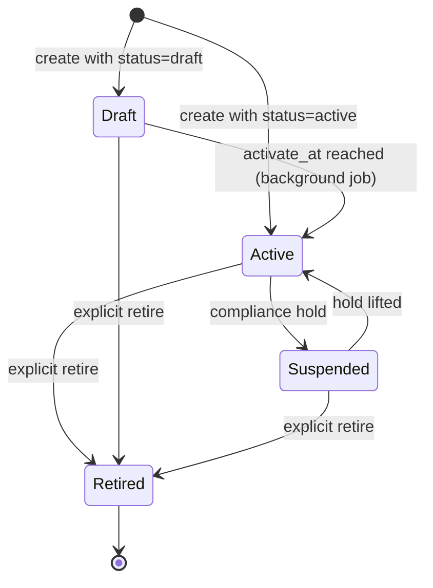
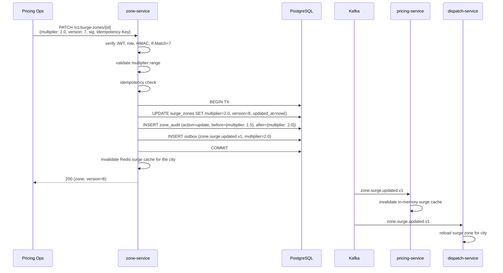
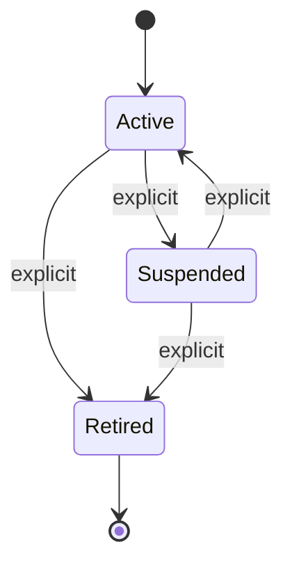
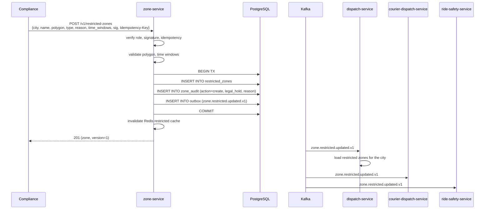
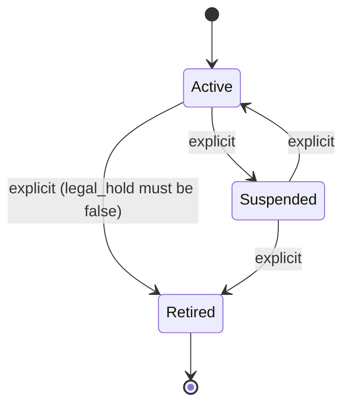
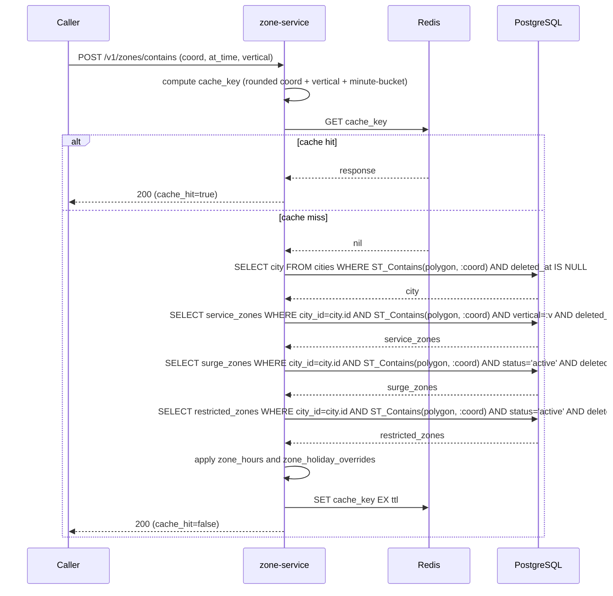
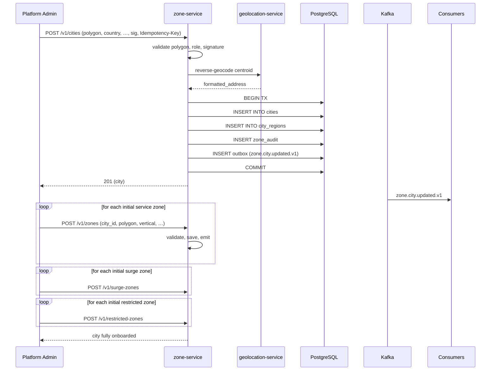

# zone-service — Workflows

## 1. Add a New Service Zone

### 1.1 Objective

Allow a city-ops admin to add a new service zone (a polygon
inside a city where a vertical is allowed) with full validation
and event propagation.

### 1.2 Initiating Actor

A city-ops or platform admin, via `admin-service` (which calls
`zone-service` over REST) or directly via `POST /v1/zones` with
an HMAC-signed body.

### 1.3 Participating Services

- `zone-service` (this service).
- `geolocation-service` (reverse-geocode the centroid for the
  audit log).
- `configuration-service` (read default country, supported
  verticals).
- `audit-service` (consumes `zone.updated.v1`).
- `pricing-service` (consumer — picks up the new zone).
- `dispatch-service` (consumer).
- `courier-dispatch-service` (consumer).
- `geolocation-service` (consumer — invalidates cache).

### 1.4 Prerequisites

- The admin has the `admin` or `city_ops` role.
- The admin's `X-Tenant-Id` claim matches the city's
  `tenant_id` (or the admin has `platform_engineer` role,
  which bypasses tenant check).
- The city exists and is `active`.
- The polygon is well-formed GeoJSON.

### 1.5 Happy Path

### 1.6 Alternate Paths

- **Overlap detected**: the write is allowed; the response
  includes a `warnings: ["OVERLAP_DETECTED"]` array. The
  admin UI is responsible for surfacing the warning.
- **Reverse geocode fails**: the zone is still created; the
  centroid's formatted address is `null` in the audit log.

### 1.7 Failure Paths

- **Polygon invalid (`ST_IsValid` fails)**: 422
  `POLYGON_SELF_INTERSECTS`. No DB write; no event.
- **Polygon outside city**: 422 `POLYGON_OUTSIDE_CITY`. No
  DB write; no event.
- **Polygon too large**: 422 `POLYGON_TOO_LARGE`.
- **Polygon invalid SRID**: 422 `POLYGON_INVALID_SRID`.
- **HMAC signature invalid**: 409 `SIGNATURE_INVALID`. No
  DB write; no event. Logged as a high-severity audit event
  on a separate audit topic.
- **Idempotency-Key reuse with different body**: 422
  `IDEMPOTENCY_KEY_REUSED`.
- **Tenant mismatch**: 403 `FORBIDDEN`.
- **DB write fails**: the entire transaction rolls back; the
  cache is not invalidated; the client gets 500. The error
  is logged with `correlation_id`; an alert fires if the
  rate exceeds threshold.

### 1.8 Business Rules

- BR--011, BR--013, BR--020..BR--022 (validation).
- FR--002, FR--008, FR--009, FR--015, FR--016, FR--018.

### 1.9 State Transitions

### 1.10 Events

| Event | Direction | When |
|-------|-----------|------|
| `zone.updated.v1` | produced | after commit |
| `zone.deleted.v1` | produced | on explicit retire (we treat retire as a soft delete) |

### 1.11 APIs Involved

| API | Direction | When |
|-----|-----------|------|
| `POST /v1/zones` | inbound | start of flow |
| `GET /v1/geocodes/reverse` | outbound | best-effort centroid reverse geocode |
| `GET /v1/config/zone` | outbound | read defaults |

### 1.12 Compensation / Rollback

- A zone write is atomic; on failure, the transaction rolls
  back. No event is published.
- If the event publish fails after the DB commit, the
  outbox poller retries. The reconciliation job (daily)
  detects any outbox rows older than 24h that haven't
  been published and republishes them.

### 1.13 Final State

- A row in `service_zones` with `version=1`.
- A row in `zone_audit` with `action=create`, `before=null`,
  `after=<row>`.
- An outbox row in `outbox` with `topic=zone.zone.updated`.
- Redis cache for the city invalidated.

## 2. Update Surge Multiplier

### 2.1 Objective

Allow a pricing-ops admin to change a surge zone's multiplier
in real time, with the change visible to all consumers within
5 seconds.

### 2.2 Initiating Actor

A pricing-ops or platform admin, via `admin-service`.

### 2.3 Participating Services

- `zone-service` (this service).
- `pricing-service` (consumer — picks up the new multiplier
  and re-quotes in-flight ride requests on the next
  dispatch).
- `dispatch-service` (consumer — uses the multiplier in
  match scoring).
- `audit-service` (consumer — high-severity audit).

### 2.4 Prerequisites

- The admin has the `admin` or `pricing_ops` role.
- The surge zone exists and is `active`.
- The new multiplier is in `[1.0, zone.surge.max_multiplier]`.

### 2.5 Happy Path

### 2.6 Alternate Paths

- **Multiplier at the upper bound**: the write is allowed;
  the response includes a `warnings: ["MULTIPLIER_AT_MAX"]`
  array. The admin UI is responsible for surfacing the
  warning.
- **Idempotency replay**: returns the original response
  with the same `version`.

### 2.7 Failure Paths

- **Version mismatch**: 409 `VERSION_MISMATCH`. The client
  re-fetches the current state and retries.
- **Multiplier out of range**: 422 `MULTIPLIER_OUT_OF_RANGE`.
- **HMAC signature invalid**: 409 `SIGNATURE_INVALID`.
- **Surge zone is `retired` or `suspended`**: 409
  `STATE_INVALID`.
- **Outbox publish fails**: the outbox poller retries. The
  daily reconciliation job detects missed publishes and
  re-emits.

### 2.8 Business Rules

- BR--016 (surge multiplier in `[1.0, max_multiplier]`).
- FR--009, FR--012.
- SEC--006 (HMAC signature).

### 2.9 State Transitions

The surge zone state machine:

The `multiplier` field changes inside `Active` /
`Suspended`; transitions are tracked in the audit log.

### 2.10 Events

| Event | Direction | When |
|-------|-----------|------|
| `zone.surge.updated.v1` | produced | after commit |
| `audit.surge.multiplier.changed.v1` | produced (via outbox) | high-severity for `analytics-service` |

### 2.11 APIs Involved

| API | Direction | When |
|-----|-----------|------|
| `PATCH /v1/surge-zones/{id}` | inbound | start of flow |

### 2.12 Compensation / Rollback

- A surge multiplier change is not rolled back. If a wrong
  multiplier was published, the admin issues a corrective
  PATCH.
- In-flight ride requests that were priced with the old
  multiplier are not re-priced. The new multiplier applies
  to the next dispatch.

### 2.13 Final State

- `surge_zones` row updated, `version` incremented.
- `zone_audit` row with `action=update` and the
  before/after snapshot.
- Outbox row for `zone.surge.updated.v1`.
- Redis surge cache for the city invalidated.

## 3. Create a Temporary Restricted Zone (Parade)

### 3.1 Objective

Allow operations to create a time-bound restricted zone for a
temporary event (e.g. a parade, a stadium match, a VIP
movement) and have the dispatch services honor it within
seconds.

### 3.2 Initiating Actor

A compliance officer or operations admin, via `admin-service`.

### 3.3 Participating Services

- `zone-service` (this service).
- `dispatch-service` (consumer — rejects pickups in the
  zone).
- `courier-dispatch-service` (consumer).
- `ride-safety-service` (consumer — surfaces in safety
  advisories).
- `audit-service` (consumer — high-severity audit).

### 3.4 Prerequisites

- The admin has the `admin` or `compliance_officer` role.
- The polygon is well-formed and inside the city.
- The time window is valid (opens_at < closes_at).
- If `legal_hold=true`, the admin has co-signature from
  another `compliance_officer`.

### 3.5 Happy Path

### 3.6 Alternate Paths

- **Recurring restriction**: the `time_windows` array may
  contain multiple entries (e.g. every Friday 18:00-22:00).
  The zone is `active` whenever the current time falls in
  any of the windows.
- **Permanent restriction**: the `time_windows` array is
  empty (or contains a single "always" window); the zone is
  always `active_now`.

### 3.7 Failure Paths

- **`legal_hold=true` without co-signature**: 403
  `LEGAL_HOLD_REQUIRES_COSIGN`.
- **Reason empty**: 422 `REASON_REQUIRED`.
- **Type invalid**: 422 `VALIDATION_FAILED` (the schema
  validates `type`).
- **Polygon outside city**: 422 `POLYGON_OUTSIDE_CITY`.
- **Outbox publish fails**: same as the other workflows
  (outbox poller retries; reconciliation catches).

### 3.8 Business Rules

- BR--011, BR--015, BR--027.
- FR--004, FR--011, FR--014.

### 3.9 State Transitions

A separate `time_windows` array drives the `active_now` flag
at query time (it is not a state transition; it is a derived
flag).

### 3.10 Events

| Event | Direction | When |
|-------|-----------|------|
| `zone.restricted.updated.v1` | produced | after commit |
| `audit.restricted.zone.created.v1` | produced (via outbox) | high-severity |

### 3.11 APIs Involved

| API | Direction | When |
|-----|-----------|------|
| `POST /v1/restricted-zones` | inbound | start of flow |

### 3.12 Compensation / Rollback

- A restricted zone is not rolled back. To undo, the admin
  issues a PATCH with `status=retired` (or `suspended`).
- If a wrong zone was published, `dispatch-service` may
  reject pickups in a valid area for the duration of the
  zone's `active` window. Mitigation: PATCH the zone's
  `time_windows` to be empty (effectively inactive), or
  PATCH `status=suspended`.

### 3.13 Final State

- `restricted_zones` row with `version=1`.
- `zone_audit` row with the full snapshot.
- Outbox row for `zone.restricted.updated.v1`.
- Redis restricted cache for the city invalidated.

## 4. Point-in-Zone Query (Hot Path)

### 4.1 Objective

Resolve a coordinate to the set of service / surge / restricted
zones that contain it, time-aware, with a P99 ≤ 50 ms cache hit.

### 4.2 Initiating Actor

Any authenticated caller — `ride-request-service`,
`food-order-service`, `dispatch-service`, `courier-dispatch-service`,
mobile apps.

### 4.3 Participating Services

- `zone-service` (this service).
- Redis (hot cache).
- PostgreSQL (cold cache / source of truth).

### 4.4 Prerequisites

- The coordinate is valid (lat ∈ [-90, 90], lon ∈ [-180, 180]).
- The service is ready (DB + Redis + Kafka reachable).

### 4.5 Happy Path

### 4.6 Alternate Paths

- **`at_time` is in the past**: the response still computes
  the zones, but `active_now` is computed against the
  supplied time (for forensic queries).
- **Multiple service zones match**: all are returned in
  deterministic order (by `zone_id` UUIDv7, ascending); the
  caller picks the "active" one by the lowest id (BR--026).
- **Multiple surge zones match**: the one with the lowest
  `priority` (tiebreaker: lowest `zone_id`) is the
  "effective" multiplier for pricing.

### 4.7 Failure Paths

- **Coordinate is in no city**: 404 `CITY_NOT_FOUND`. The
  caller (e.g. `ride-request-service`) decides what to do
  (typically, reject the request with a customer-facing
  message).
- **Redis unreachable**: the service falls back to direct
  PostgreSQL; response includes a `degraded=true` flag
  (informational only; caller behavior does not change).
- **DB unreachable**: 503 `CIRCUIT_OPEN` (no fallback; zone
  queries are not cached at the gateway because the cache
  invalidation is too dynamic).
- **`at_time` is malformed**: 400 `VALIDATION_FAILED`.

### 4.8 Business Rules

- BR--026 (deterministic tiebreaker for overlapping zones).
- BR--029 (zone hours in city timezone).
- BR--030 (holiday calendar locale-specific).
- FR--005, FR--010, FR--018, FR--020.

### 4.9 State Transitions

The point-in-zone response is stateless; no state transitions.
The cache entry transitions `Fresh → Stale → Evicted` (TTL).

### 4.10 Events

- No events produced. (This is a read-only path.)

### 4.11 APIs Involved

| API | Direction | When |
|-----|-----------|------|
| `POST /v1/zones/contains` | inbound | start of flow |

### 4.12 Compensation / Rollback

- None. A read has no rollback.

### 4.13 Final State

- A response with the matching zones, time-aware.
- A cache entry in Redis (TTL 5 min for `contains`).

## 5. Onboard a New City

### 5.1 Objective

Onboard a new city (e.g. Riyadh, then Dubai) end-to-end in
≤ 14 days, with all zone data authored and propagated.

### 5.2 Initiating Actor

A platform admin (the city expansion team).

### 5.3 Participating Services

- `zone-service` (this service).
- `geolocation-service` (reverse geocode).
- `configuration-service` (read defaults).
- `pricing-service` (consumer — picks up the new city).
- `dispatch-service` (consumer).
- All other consumers.

### 5.4 Prerequisites

- The new city's polygon is well-defined (legal entity,
  country, currency, timezone, supported verticals all
  decided).
- The expansion team has prepared an initial set of service
  zones, surge zones, and restricted zones as a fixture
  file.

### 5.5 Happy Path

### 5.6 Alternate Paths

- **Bulk import via admin tool**: a separate `POST
  /v1/admin/cities/bulk-import` endpoint accepts a JSON
  file with a city and all its zones, processes them in a
  single transaction (or batched transactions for very
  large imports), and emits all events. Used for large
  expansions.

### 5.7 Failure Paths

- **City polygon invalid**: 422 `POLYGON_*`. No events.
- **One zone fails mid-import**: the import transaction
  rolls back; the admin can fix and retry. With bulk
  import, partial success is reported (the admin re-runs
  with the failed zones only).

### 5.8 Business Rules

- BR--010 (only `zone-service` writes here).
- BR--011, BR--022.
- BR--024 (city onboarding in ≤ 14 days — operational SLO,
  not technical).

### 5.9 State Transitions

A new city goes `[*] → Active` immediately (no draft for
cities).

### 5.10 Events

| Event | Direction | When |
|-------|-----------|------|
| `zone.city.updated.v1` | produced | after city insert |
| `zone.updated.v1` | produced | after each service zone insert |
| `zone.surge.updated.v1` | produced | after each surge zone insert |
| `zone.restricted.updated.v1` | produced | after each restricted zone insert |

### 5.11 APIs Involved

| API | Direction | When |
|-----|-----------|------|
| `POST /v1/cities` | inbound | start of flow |
| `POST /v1/zones` | inbound | one per service zone |
| `POST /v1/surge-zones` | inbound | one per surge zone |
| `POST /v1/restricted-zones` | inbound | one per restricted zone |

### 5.12 Compensation / Rollback

- If onboarding fails mid-way, the admin issues compensating
  PATCHes (or a bulk-delete if the city was just created).
- Cities are rarely rolled back; if the launch is delayed,
  the city is left `active` but the dispatch / pricing
  services gate on a feature flag.

### 5.13 Final State

- A row in `cities` with `version=1`.
- N rows in `service_zones` (one per initial service zone).
- M rows in `surge_zones`.
- P rows in `restricted_zones`.
- M+N+P+1 rows in `zone_audit`.
- M+N+P+1 outbox rows.
- Redis caches for the city invalidated.

---

## See also

### Sibling docs for this service

- [`README.md`](./README.md) — purpose, bounded context, responsibilities
- [`BRD.md`](./BRD.md) — business requirements
- [`SRS.md`](./SRS.md) — functional + non-functional requirements
- [`ERD.md`](./ERD.md) — data model (entities, relationships)
- [`INTEGRATION.md`](./INTEGRATION.md) — inter-service contracts (APIs, events, sagas)
- [`WORKFLOWS.md`](./WORKFLOWS.md) — operational workflows (happy paths, failure modes)
- [`TECH.md`](./TECH.md) — technology profile (runtime, libraries, data layer, admin endpoints, RBAC)

### Platform-wide

- [`../../shared/README.md`](../../shared/README.md) — `platform-spring-boot-starter` shared library (the single source of cross-cutting code for all Spring Boot services in the platform)
- [`../RECOMMENDATIONS.md`](../RECOMMENDATIONS.md) — platform-wide technology map (language, framework, version baseline, admin/RBAC pattern)
- [`../../README.md`](../../README.md) — services overview (the catalog of all 58 services)
- [`../../../main.md`](../../../main.md) — top-level platform specification (architecture, Keycloak, PostgreSQL 18, messaging, observability baseline)

